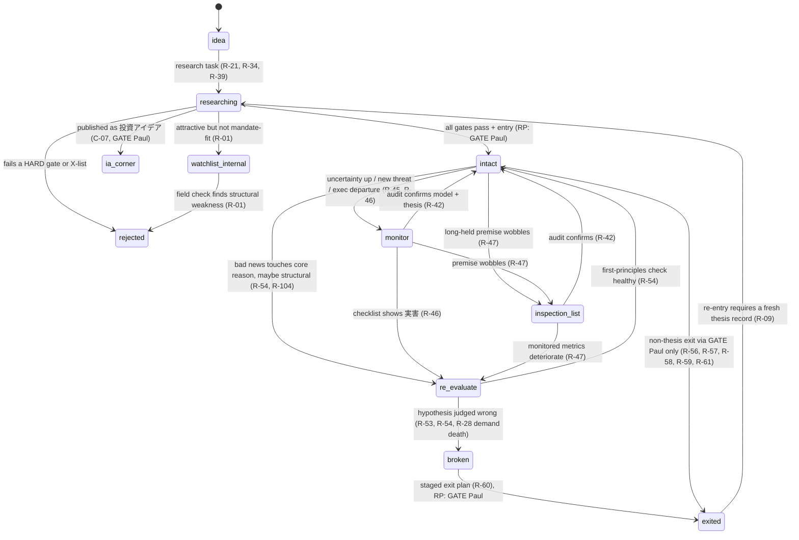

## §3 Decision system

Source: P2 (Decision Rules, Exclusions, Compliance Guardrails & Reader Guidance), Jul 2022 → Sep 2026. Counts: 130 rules (R-01–R-130), 40 exclusions (X-01–X-40); §7 covers 20 guardrails (C-01–C-20) and 18 reader-guidance patterns (RG-01–RG-18). → P2 Overview.

**The spine (→ P2 Overview).** Thesis state is the master variable: buy only when the price falls and the thesis is intact, sell only when the thesis breaks, and treat volatility as noise. Sizing is asymmetric and survival-first. The core is a tech × oil barbell on a US base. Market-timing is allowed only as position adjustment. Crises mean staged buying, never panic-selling. Paul gave almost no numeric thresholds for trims, caps, stop-losses or rebalancing: these stay `TBD(Paul)` and route to ALERT → GATE(Paul), never to an invented number (INV-5).

**Legend used throughout §3.**
- Strength (P2 definitions): **Core** = explicit and recurring on ≥3 distinct dates, or explicitly called a rule/principle; **Stated** = explicit on 1–2 dates; **Observed** = inferred from actions. P2 assigns no Core★ grade to rules. Provenance is shown as first→last year and n≈ distinct dates.
- Encodings (P2 §2.0): **HARD** = inviolable constraint (blocks or requires); **SOFT** = scoring/ranking input; **ALERT** = surfaced for review, no automatic action; **GATE(Paul)** = needs Paul's explicit approval; **GATE(reader)** = decision handed to the reader-as-PM (framework out, never an instruction).
- Evidence flags: ⚠series = mainly from the curated 12-column 米国株入門 series tagged 2026-03-31 (a compilation of earlier columns; whether it is current doctrine is P2 Open Q25); ⚠AI-draft = lower-weight source; ⚠arith = arithmetic slip in his example.
- Abbreviations: RP = 推奨ポートフォリオ (recommended portfolio); IA = 投資アイデア corner; UST = US Treasury.

### 3.1 The thesis-state machine

P2 gives an *implied state model* and states plainly that it is "an engineering suggestion built from his own categories, not his words" (→ P2 §2.0). The lifecycle stages below (idea → researching → owned → exited, plus the internal watchlist and the IA corner) are the engineering frame; the owned sub-states are exactly P2's `thesis_status` values.

**Per-name tags (P2 implied state model).**
- `thesis_status` ∈ {intact, monitor, inspection_list, re_evaluate, broken}
- `role` ∈ {core_growth, barbell_insurance (oil majors), ai_upstream (uranium/energy for AI), stable_income (legacy), weed, speculative (lottery-size), trade (time-stopped), idea_outside_RP}
- `asset_type` ∈ {non_commodity, commodity_cyclical, miner_resource, real_estate, fund_etf, bond_cash}
- `conviction` ∈ {low, mid, high}; `edge_statement`; `horizon_years`
- `bucket` ∈ {spendable_yen, emergency, growth_usd, speculative}
- `shock_type` ∈ {temporary, structural} × {demand_death, position_clearing}

**Portfolio-level overlay flags** named in P2's engine hints (not separate name states): shock flag (R-94, R-107 cooling-off), crisis flag (R-102, R-109 deploy alert), crisis mode (R-104: no sell without a story-change classification).

**Transitions and the evidence that moves a name.**

| From → To | Evidence required | Rules |
|---|---|---|
| idea → researching | A research task: a price collapse (drawdown ≥ `TBD(Paul)`) triggers research, never a buy; a Paul-set level is hit; the first clear numerical rebuttal after long skepticism; an everyday observation to verify | R-21, R-34, R-39, R-26 |
| researching → rejected | Any HARD gate fails, or the name matches an exclusion (X-01–X-40) | R-09–R-24, §3.3 |
| researching → internal watchlist | Attractive but outside the RP mandate ("attractive ≠ eligible"); internal only, no public queue into the RP (C-08) | R-01, C-08 |
| researching → IA corner | Paul chooses to publish it as a 投資アイデア outside the RP (role `idea_outside_RP`), with the fair-disclosure sentence | R-01, R-39, C-07 |
| researching → owned/`intact` | Thesis record {story, grounds, break conditions, valuation view, horizon}; 5-yr conviction (core_growth); management alignment; edge statement; right yardstick; not peak-cyclical; income/AI/dev-stage gates as applicable; survival check; staged first tranche. RP inclusion = Paul-set mandate-fit flag + GATE(Paul) | R-01–R-26, R-30, R-65–R-67, INV-1, INV-2, INV-4 |
| `intact` → `monitor` | Uncertainty rises but thesis not broken; a new threat to the business model; an executive departure without 実害 | R-45, R-46 |
| `intact`/`monitor` → `inspection_list` (点検リスト) | A long-held premise wobbles: 「撤回はまだしません。ただ、点検リストには正式に載せます」; auto-creates a disclosure task | R-47, C-10 |
| any owned → `re_evaluate` | Bad news that touches the basic reason for owning and may be structural (three-question triage); news contradicting the one-line reason for buying; monitored metrics deteriorate; the 4-point departure checklist shows 実害 | R-54, R-104, R-47, R-46 |
| `monitor`/`inspection_list`/`re_evaluate` → `intact` | Post-earnings audit confirms both business model and thesis (「ビジネスモデル、投資テーゼ、両方確認できました」); first-principles check healthy | R-42, R-54 |
| `re_evaluate` → `broken` | Hypothesis judged wrong or core of story broken; revenue/earnings structure broken, capital impaired, or "time works for me" design broken; demand-death drop (2000-type) | R-53, R-54, R-28 |
| `broken` → exited | Exit plan staged per R-60 (unless catastrophic) within `TBD(Paul)` days; GATE(Paul) for RP names; disclosure task | R-53, R-60, C-10 |
| `intact` → exited/trimmed (non-thesis) | Only via ALERT → GATE(Paul): bubble dashboard, cycle peak (commodity_cyclical), opportunity cost (return ≈ hurdle), weed underperformance, trade time stop, concentration/tilt band | R-56–R-59, R-61, R-91, R-95 |
| exited → researching | Re-entry is a new idea; funds sold on a manager change are re-evaluated after a few months | R-09, R-63 |

**Evidence that can never move `thesis_status` on its own** (HARD suppression, R-44/X-35): a consensus miss with guidance unchanged; a small beat/miss; a flat or negative price reaction without fundamental change; one datapoint read as the end of the AI cycle; one week vs the index; one quarter; one month's macro data; a mix-driven weak quarter; a short-term guidance slowdown; a "not fatal" failed acquisition; a tariff threat; (2024 rule) FCF compression or a capex spike at a grower. Also never a trigger: price alone (R-29, R-33, R-55, INV-3), a political headline (R-101), a macro reason (R-106), a diversifiable single-name tail risk (R-78).

**Which rules fire in each state.**

| State | Rules that fire | Allowed actions |
|---|---|---|
| idea | R-21, R-26, X-36 | Research task only; an unresearched idea may be shared only flagged 「まだ深く調べていない」 (C-10) |
| researching | Eligibility R-01–R-08; gates R-09–R-26; behavioral checks R-25; exclusions X-01–X-40 | Pass/park/reject; no buy proposal without the thesis record (R-09) |
| internal watchlist | R-01, C-08 | Research notes for Paul; public wording must not imply a queue into the RP |
| IA corner (`idea_outside_RP`) | C-07, C-13, R-39, R-68 | Full idea draft to the wording ceiling; GATE(Paul) before release |
| owned · `intact` | Hold R-41, R-42, R-43, R-44, R-48–R-52; adds R-27–R-34, R-36, R-40 (staged, R-30); sizing R-65–R-69; alerts R-31, R-49, R-56, R-57, R-59, R-91, R-95 | Hold; staged adds when a dip is classified not thesis-relevant (R-27/R-28); any RP add or trim = GATE(Paul); dip wording via C-03/C-04 |
| owned · `monitor` | R-45, R-46, R-42 | Freeze adds, no sells; run the explicit checklist |
| owned · `inspection_list` | R-47, C-10, R-42 | No retraction yet; redo the check if metrics deteriorate; mandatory disclosure 「悪化すれば黙らずお知らせします」 |
| owned · `re_evaluate` | R-54, R-104, R-42 | Sell proposals become permissible (R-41); triage + first-principles check decides intact vs broken |
| owned · `broken` | R-53, R-60, C-10 | Exit plan (staged), GATE(Paul) for RP; holding on = 「投資ではなくギャンブル」 |
| exited | R-63, R-130, R-50 | TLH switch into a similar-driver name (±30-day wash-sale check); no FOMO re-buys |
| Role overrides | `trade`: R-61 time stop (exempt from R-10); `speculative`: R-68 cap (exempt from R-10); `commodity_cyclical`: R-57 exit plan; `weed`: R-58; `stable_income`: R-16/R-17; `barbell_insurance`: R-77 (not R-57) | — |
| Overlay: shock/crisis | R-102–R-110, R-62, R-93, R-94 (see §3.5) | Cooling-off; classify; hold intact stories; staged deployment → GATE |

### 3.2 Rulebook summary (R-01 – R-130)

One row per rule, grouped as in P2 §2.1 (a)–(m). "Str" = strength · first→last year · n≈ distinct dates. Config keys are defined in the parameter inventory at the end of this file.

#### (a) Universe & eligibility → P2 §2.1(a)

| ID | Condition → action | Parameters | Str | Encoding | Config key |
|---|---|---|---|---|---|
| R-01 | Strategy-fit gate: attractive but not mandate-fit → keep out of RP; route to IA (C-07), watch note, or suitability-labelled reader reference. Watch item dropped when field checks show structural weakness | Mandate = AI/tech growth core + barbell legs (oil majors, uranium) + legacy real-estate/stable sleeve; formal text `TBD(Paul)`. No promotion/demotion since 2026-09-11 (C-08) | Core · 22→25 · n≈10 | HARD (Paul-set mandate-fit flag) + GATE(Paul) | `universe.rp_mandate_text`, `universe.rp_mandate_fit_flag_required` |
| R-02 | Reader-access gate: Japanese readers can't practically buy via JP brokers → exclude from RP or pair with accessible substitute/route; check per ticker, not per asset class | Routes: IBKR; SPY/XLP (stable part); XLRE/VNQ (US REITs); VTR for OHI; PAGP for PAA; URA for CCJ; SGOV/SCHO/HYG/JNK "check each broker" | Core · 23→26 · n≈8 | HARD (per-ticker flag) + SOFT substitute map | `universe.reader_access_check`, `universe.access_substitutes` |
| R-03 | Own the protagonist (「主役企業」, the overwhelming #1 or a pinpoint name), not the basket; never buy a theme label indiscriminately | Examples: BXP not XLRE; CCJ over NXE; China/Japan by stock; nuclear taxonomy utility ≠ equipment ≠ pre-revenue SMR ≠ Navy supplier | Core · 23→26 · n≈8 | SOFT prefer #1 + HARD block on label buying | `universe.prefer_theme_leader`, `universe.block_label_driven_buying` |
| R-04 | Commodity (standardized, supply/demand-priced) → cyclical: hold only while cycle rises, with an exit plan (R-57), never long-term core; non-commodity (irreplaceable, toll booth (関所)) → core-eligible. Exception: oil majors as barbell insurance | 「必ずいつかは売却しなければいけないです」 | Core · 22→26 · n≈10 | HARD `asset_type` tag (drives R-57, R-14) | `universe.asset_type_tag_required`, `hold.cyclical_long_term_core_allowed` |
| R-05 | US base, Japan option: JP single names need an individual story (owner/large-holder management, disclosure, global competitiveness, 総還元); avoid domestic-oriented industries and JP software/internet | 「米国市場をベースに、日本をオプションとして考える」; Japan weight `TBD(Paul)` (small but nonzero) | Core · 22→26 · n≈10 | HARD story record + SOFT weight band | `universe.jp_requires_story`, `construction.jp_weight_pct` |
| R-06 | China/EM cheap but politically unpredictable → hold, don't add much; if buying, stagger and pick names; EM favoured when global rates fall, struggles under high US rates/strong USD | China purchases over ~1 year after a stimulus spike | Core · 23→25 · n≈10 | SOFT geopolitical penalty + ALERT on US-rate/USD regime | `entry.china_stagger_period`, `universe.geopolitical_risk_penalty` |
| R-07 | Hold exposure through the right vehicle: operating companies over futures (oil not USO); BTC via ETF/spot not treasury cos; speculative sectors via ETFs/large caps; a theme via a cheaper owned vehicle; JP without yen risk via DXJ; offer stock and ETF routes | Waymo inside GOOGL ~24x vs TSLA ~160x | Core · 23→26 · n≈8 | SOFT vehicle selector + HARD block on long-term futures/leveraged holds (X-14) | `universe.vehicle_preferences`, `universe.long_term_futures_or_leveraged_allowed` |
| R-08 | Fund/ETF screen for any fund suggested to readers: ETFs/low-cost first → active only for risk ETFs can't give → only exceptional understood managers → niches with liquidity care; check manager's total AUM | Fees ≥1% avoid unless special; ~300bp eats the alpha; no front/redemption loads without reason; turnover >100%/yr warning, <50% desirable (~25% good Fidelity funds); active money well below 50% = closet indexer; good funds ~30–40 names; funds trade ~20% of ADV; DIY: top 30–35 holdings + a little S&P ETF, hold 2–3 yrs | Core · 22→25 · n≈7 | HARD screen | `research.fund_screen.*` |

#### (b) Pre-buy research gates → P2 §2.1(b)

| ID | Condition → action | Parameters | Str | Encoding | Config key |
|---|---|---|---|---|---|
| R-09 | Written-thesis gate: can't answer 「この会社の投資ストーリーは何か」「そのストーリーを信じる根拠は何か」「そのストーリーはいつ崩れるか」 → 「買ってはいけません」. Hypothesis = business runway (成長の滑走路) + valuation (what's priced in) | Record = {story, grounds, break conditions, valuation view, horizon}; one-sentence reason per holding; tested quarterly | Core · 22→26 · n≈6 | HARD (no buy/add without record) | `research.thesis_record_required`, `research.thesis_record_fields` |
| R-10 | Five-year conviction: no conviction to hold ≥5 yrs → don't buy, even in a rising market | 5 years; exempt roles trade (R-61), speculative (R-68) | Core · 25→26 · n≈5 | HARD (core_growth) | `research.min_conviction_years` |
| R-11 | Management alignment: can't answer 「経営陣の利益は、私の利益と一致しているか」 → don't buy however cheap; aligned owners justify a modest premium | Positive signals: open-market buying by founder/large holder, dialogue, CEO on calls, dividends + buybacks | Core · 22→26 · n≈6 | HARD gate + SOFT premium; red flags → X-17 | `research.management_alignment_required` |
| R-12 | Edge gate: state the edge before sizing; judged by process not hits; no edge → index; never big money on an unpredictable 50/50 (「それは投資より投機です」) | Edge reweights 50/50 → 55/45 or 60/40; needs 100+ bets to show | Core · 24→26 · n≈5 | HARD (edge statement for conviction > low) + SOFT sizing input | `research.edge_statement_required_above` |
| R-13 | Valuation after the story, never mechanical: multiple vs story/growth, own history, peers, S&P; cheapness no defense when results confirm the bear case; check FCF yield | Reference points only (NVDA PEG ~1.1x; TSLA ~160x unjustified; normal S&P 14–16x; PSR if no profits); cutoffs: none by design | Core · 22→26 · n≈20+ | SOFT score, never a standalone trigger | `research.valuation_inputs`, `research.valuation_mechanical_cutoffs` |
| R-14 | Use the sector's yardstick: miners = reserves/grade/cost/contracts; oil majors = reserves + capital returns; uranium = long-term contract price; cyclicals = profit direction; order-driven = not P/E; real estate = rent + residual; JP = 総還元; E&Ps = EV/PV-10, EV/EBITDA; IPOs/pre-profit = PSR | E&P EV/EBITDA band 2–8x (⚠AI-draft/third-party) | Core · 22→26 · n≈12 | HARD (yardstick selected by `asset_type`) | `research.valuation_yardstick_by_asset_type` |
| R-15 | Cyclical peak-earnings trap: cyclical ∧ at/near peak earnings → don't buy even at low PER; locate real peak from supply/demand; no non-growth cyclical after a huge run | INPEX ~6.4x off bottom = high risk; extreme-growth alert threshold `TBD(Paul)` (semis +143% vs past peaks +30–80%) | Core · 22→26 · n≈4 | HARD block + ALERT | `research.block_cyclical_peak_earnings`, `research.earnings_growth_extreme_alert_pct` |
| R-16 | Income-name gate: never on yield alone; total return = yield + upside − loss risk; five questions; verify FCF/AFFO coverage and balance sheet | Yield ≥5% = "high"; ~10% fund yield → check it's real dividends; yield ≈ SGOV (3.5–4%) → why take equity risk? | Core · 22→26 · n≈10 | HARD gate + SOFT total-return vs hurdle | `research.income_gate_required`, `research.high_yield_threshold_pct` |
| R-17 | Risk-free hurdle: judge every investment vs the live USD risk-free rate (「MMFリターンを頭にベンチマークとして置くべきです」); a position whose remaining expected return has fallen to the hurdle is an exit candidate (R-59) | Live hurdle (history: 1-yr UST 4.75%; MMF ~4–5%; T-bill 5.46%; SGOV 3.5–4%; 10-yr ~5%) | Core · 22→26 · n≈9 | HARD input to expected returns + SOFT ranking | `cash.hurdle_rate_source` |
| R-18 | Balance sheet, cash quality, accounting noise: weak balance sheets = biggest risk; cash flow over net income; operating income over inflated EPS; flag debt/equity-funded capex and customer concentration | — | Core · 25→26 · n≈7 | HARD red flags (→ X-19) + SOFT quality | `research.red_flag_checks` |
| R-19 | Capex-with-receipts: capex justified only against visible contracted demand; separate sellers with backlog from buyers with promises; RPO counts only as it converts (「約束は約束にすぎない」). Supersedes the 2024 "ignore FCF compression" rule for capex-heavy names | Alert threshold (backlog/capex ratio) `TBD(Paul)` | Core · 26→26 · n≈4 | SOFT + ALERT | `research.capex_receipts_alert_ratio` |
| R-20 | Development-stage/single-asset: prefer producers with revenue; a pre-revenue single-asset name = 「コンパウンダーではなく、レバレッジのかかった賭け」 → non-core, sized to its premise; set watch/break metrics up front | NXE break: 1-yr slip, cost overrun, softer market (→ dilution); non-core cap `TBD(Paul)` | Core · 24→26 · n≈4 | HARD non-core cap + ALERT break metrics | `sizing.non_core_max_pct` |
| R-21 | Research before reaction: a price collapse triggers deeper research, not a buy; unresearched ideas shared only flagged 「まだ深く調べていない」 | Drawdown research trigger `TBD(Paul)` | Core · 23→25 · n=3 | ALERT → research task; never auto-buy | `research.drawdown_research_trigger_pct`, `research.unresearched_flag_text` |
| R-22 | Corroborating evidence only as confirmation: multiple meaningful insider buys, big informed buyers, buybacks, new coverage, upward revisions, pros' positioning (答え合わせ) | Don't jump on one small insider buy | Core · 24→26 · n≈9 | SOFT only | `research.corroborating_signals_soft_only` |
| R-23 | AI gates: buy where AI already lifts margins, not "AI potential"; state the AI-GDP scenario; tag the 知能のサプライチェーン layer (upstream energy/uranium; midstream chips/DCs + receipts test; downstream toll booths); avoid borrowed-compute resellers | Scenario range Acemoglu ~1% … Goldman ~7% …; dials: lit rate (点灯率), backlog growth, power prices | Core · 26→26 · n≈4 | HARD (layer + scenario tag) + ALERT dashboard | `research.ai_required_tags`, `research.ai_dials` |
| R-24 | Return-plausibility: convert any claim to a required annual return and compare with ceilings; beyond plausible → risk or promotion | 3%/yr outperformance = top class; >10%/yr stable is hard; ~20%/yr 「相当難しい」, >20% target avoided; 70–100%/yr = 「宝くじ的発想」; yield 5–10× benchmark sold as low-risk = red flag; planning 5–10% (equities 7–8%, bonds ~3%) | Core · 22→25 · n≈7 | HARD sanity check on outputs | `research.return_plausibility.*` |
| R-25 | Pre-decision behavioral checks: three regret questions; 5年判断ルール; "closer to what I really want?"; IPO future vs psychology; pre-mortem each worry | — | Core · 24→26 · n≈5 (⚠series in part) | GATE(reader) prompts; internal checklist for Paul | `research.behavioral_checklist` |
| R-26 | Research workflow: primary sources (10-K, transcripts, Buffett letters); AI restricted to 10-Ks/transcripts plus own industry knowledge; cross-check everyday observations (使って理解する) | — | Core (process) · 24→26 · n≈6 | HARD source whitelist for the AI research agent | `research.required_sources` |

#### (c) Entry / buy / add → P2 §2.1(c)

| ID | Condition → action | Parameters | Str | Encoding | Config key |
|---|---|---|---|---|---|
| R-27 | Standing dip rule: price falls ∧ thesis re-check passes (R-42) ∧ drop classified not thesis-relevant (R-28) → eligible for staged adds (R-30); thesis changed → no add, route to R-53 | No %-drop trigger; rate/oil-driven correction = "the typical example"; 「慌てる必要はありません」. Whether the RP itself adds on dips is unresolved (P2 Open Q7) | Core · 22→26 · n≈28 | HARD precondition `thesis_status = intact` + SOFT score + GATE(Paul) for any RP add; wording C-03/C-04 | `entry.dip_buy_requires_thesis_intact`, `entry.dip_threshold_pct`, `entry.rp_add_requires_paul` |
| R-28 | Judge first, act second: before any add or sell classify the drop on 5 axes — fundamental vs macro; industry cycle vs company; demand death (exit) vs position clearing (opportunity), judged by lit rate not price (「株価ではなく点灯率」); temporary vs structural; rational reaction? | — | Core · 22→26 · n≈12 | HARD (`shock_type` required before add/sell proposal) | `entry.drop_classification_required` |
| R-29 | A falling price alone is not a signal (「株価がさがったから、買いだと言えません」); best setup = good company falling on good results / near-term profit, capex or cost worries | — | Core · 22→26 · n≈5 | HARD no price-only buy + SOFT bonus | `entry.price_only_signal_allowed` |
| R-30 | Staged entry and time diversification (時間分散): buy part first, add on declines; more conviction → more time-spreading (「60年待てとは言いません。しかし、60日で判定するのも間違いです」); exits gradual too | China ~1 yr; TSM ~6-month sideways; tranche count and interval `TBD(Paul)`. Reconciliation (L): conviction sets size, timing uncertainty sets pace | Core · 22→26 · n≈15 | HARD no single-tranche full entry + SOFT scheduler | `entry.staged_tranches`, `entry.tranche_interval`, `entry.single_tranche_full_entry_allowed` |
| R-31 | After a sharp run: non-holders don't buy big (wait for bad news or calm); holders hold but stop adding; temper expectations; pullback after a run is normal; don't chase | Examples: NVDA +20%/10 days; +60% in ~6 months; +50%/1 yr; run-up threshold `TBD(Paul)` | Core · 22→26 · n≈10 | ALERT run-up flag + SOFT new-money penalty; holder/non-holder outputs differ (RG-11) | `entry.run_up_alert_pct` |
| R-32 | Buy pessimism, not euphoria; contrarian read of crowd positioning; Dalio bubble markers (newcomers, leverage-financed buying, broad bullishness) | — | Core · 22→26 · n≈6 | SOFT sentiment + ALERT bubble markers | `entry.sentiment_input` |
| R-33 | No percentage or price triggers; price vs corporate value guides adds; averaging down (ナンピン) may result; may add after a rise if still cheap; no single-metric rules | None exist; no numeric stop, size, weight or count rules in 2024 files | Stated · 2026 · n=2 | HARD (no price-only triggers) | `entry.price_pct_triggers_allowed` |
| R-34 | Set levels and commitments in advance: decide story and 「買いたい価格水準」 while calm; pre-commit 「この会社が30%下落したとき、自分はどうするか」; write 「投資ストーリーが変わらない限り、30%以上の暴落でも売らない」 | 30% = his example; per-name levels `TBD(Paul)` | Stated · 2026 · n=2 (⚠series) | SOFT Paul-maintained level table; hit → ALERT + research task, never auto-buy | `entry.per_name_levels`, `entry.precommit_drop_example_pct` |
| R-35 | Charts are a secondary timing aid, internal only: fundamentals decide what, technicals help when; never charts alone | Used: ranges, support zones, relative strength (e.g., XLE/S&P 0.229). Voice ban since 2026-08-14 | Core (practice) · 22→26 · n≈15 / forbidden in voice | SOFT internal hint + HARD output lint (C-05) | `timing.technical_overlay_allowed` |
| R-36 | Don't chase the event hedge; never sell what fell to buy what rose (「安くなった資産を売って、高くなった資産を買うこと」 is the error) | — | Stated · 25→26 · n≈3 | SOFT post-event penalty + HARD swap block | `entry.block_sell_fallen_buy_risen` |
| R-37 | Contrarian cyclical entries: sector underperformed for visible reasons → watch drivers turn; oil at historic lows → stage in via companies; survivable cyclicals near the trough once volume recovers; only part of the portfolio | XLE +7.66% vs S&P +16.77%, WTI ~$60 (⚠AI-draft); allocation cap `TBD(Paul)` | Core · 23→26 · n≈6 | ALERT + SOFT, capped by role | `construction.contrarian_cyclical_max_pct` |
| R-38 | JP stocks in yen-driven sell-offs: consider good companies only 「もし株が業績の為替感応度以上に下落していれば」 | — | Stated · 2024 · n=1 | SOFT (price vs FX-sensitivity model) | `entry.jp_fx_sensitivity_check` |
| R-39 | Idea timing: first clear numerical rebuttal after a long spell on the skepticism side, even if execution proof needs more quarters (ORCL) | — | Stated · 2026 · n=1 | SOFT signal for IA candidates | `entry.ia_first_rebuttal_signal` |
| R-40 | Get a theme via the cheapest owned vehicle; avoid redundant exposure already held 「厚く」; hold several beneficiaries whose risks offset; spread substitutions | AI via NVDA, GOOGL, TSM, SAP, META → no MSFT/AMZN | Stated · 23→26 · n=3 | SOFT overlap/correlation penalty | `construction.overlap_penalty` |

#### (d) Hold / do-nothing discipline → P2 §2.1(d)

| ID | Condition → action | Parameters | Str | Encoding | Config key |
|---|---|---|---|---|---|
| R-41 | Thesis intact → hold whatever the price (「テーゼが変わっていない限り、ボラティリティはノイズ」); sell only when the original hypothesis breaks | Tension with R-56 bubble exit and 2025-07-14 profit-taking line | Core · 22→26 · n≈25 | HARD: no sell proposal unless `thesis_status` ∈ {re_evaluate, broken} or Paul overrides | `exit.sell_on_thesis_break`, `hold.sell_allowed_statuses` |
| R-42 | Quarterly thesis audit: after each report check results point by point vs original reasons (「元々の理由通りに行っているのか？」), confirm business model and thesis; both hold → keep | Quarterly, every holding | Core · 22→26 · n≈14 | HARD post-earnings audit task → outputs `thesis_status` | `hold.post_earnings_audit` |
| R-43 | Growth-stock hold metric = revenue (and subscriber) growth: hold while revenue expands, even >40x near-term P/E; watch acceleration; one-off margin/EPS misses "not a big problem" | Deceleration alert threshold `TBD(Paul)` | Core · 23→25 · n≈6 | HARD metric (growth-tagged) + ALERT | `hold.revenue_decel_alert_pct` |
| R-44 | Noise filters: events that cannot alone change the thesis (see §3.1 suppression list) — 「一つデーターポイントに過ぎないです。過剰に注目しています。」 | List as written | Core · 23→26 · n≈18 | HARD suppression list; logged as ALERT context | `hold.noise_suppression_list` |
| R-45 | Uncertainty rises but thesis not broken → neither add nor sell (「足すことも…しません。しかし手放すこともしない」) | — | Core · 23→24 · n≈5 | `thesis_status = monitor` → freeze adds, no sells | `hold.monitor_freezes_adds` |
| R-46 | New business-model threat or executive departure → keep and monitor; "not fatal" setbacks are watch items; sell only on 実害 | Four checks: competitiveness slipping, launches delayed, AI monetization breaking in numbers, departures cascading | Core · 23→26 · n=3 | ALERT checklist; `thesis_status = monitor` | `hold.departure_checklist` |
| R-47 | A wobbling premise goes on the inspection list, never silence: 「撤回はまだしません。ただ、点検リストには正式に載せます」; metrics deteriorate → redo check and tell readers; publish hypothesis errors | — | Core · 2026 · n=3 | ALERT + mandatory disclosure task (C-10); `thesis_status = inspection_list` | `hold.inspection_list_disclosure_required` |
| R-48 | Low turnover; no 回転売買; "not trading ≠ doing nothing" | Endorsed <20%/yr turnover, 3+-yr holds; RP 2025 「銘柄の入れ替えなしで」; RP cap `TBD(Paul)`. Conditional, not absolute (R-56) | Core · 22→26 · n≈8 | SOFT turnover budget + ALERT when exceeded | `hold.turnover_endorsed_max_pct`, `hold.rp_turnover_cap_pct` |
| R-49 | Ride structural winners: no trims while the cycle is early; hold through high multiples (「マルチプルが高くとも」); 「花を摘んで雑草に水をやるな」 | NVDA never trimmed; CCJ ~5 yrs held. Concentration alert `TBD(Paul)` | Core · 23→26 · n≈10 | SOFT (no auto-trim) + ALERT concentration → GATE(Paul) | `hold.auto_trim_structural_winners`, `rebalance.concentration_alert_pct` |
| R-50 | Re-buy test daily, cost-basis blind; prefer upward revisions and quality (Danoff); ignore other people's winners; no FOMO swaps | — | Stated · 25→26 · n=3 | SOFT cost-blind scoring + HARD FOMO-swap block | `hold.cost_basis_blind`, `hold.block_fomo_swaps` |
| R-51 | Horizon parameters | Stocks ≥3–5 yrs; buying a sell-off ≥4–5 yrs; look 5–10 yrs ahead; new buys 5-yr conviction; FIRE 20–30 yrs; crises get a "10-year test". 2022: "long-term = 1–3 yrs" (superseded) | Core · 22→26 · n≈8 | Parameter `horizon_min_years = 5` for new core buys (P2: confirm with Paul, Open Q26) | `hold.horizon_min_years`, `hold.min_view_years` |
| R-52 | "Passing grade" top-level check (family-money standard): (1) hold on thesis, sell only when it breaks; (2) stay on the flowers, don't overwater the weeds; (3) keep cash and nerve to buy in despair | — | Stated · 2026 · n=1 (summarizes Core rules) | Top-level policy check on any action set | `hold.passing_grade_check` |

#### (e) Trim / sell → P2 §2.1(e)

| ID | Condition → action | Parameters | Str | Encoding | Config key |
|---|---|---|---|---|---|
| R-53 | Broken thesis → sell, even after a short hold (「仮説は間違えたと判断したら、株は長く保有歴なくても、売ります」); holding on = 「投資ではなくギャンブル」 | Exit window `TBD(Paul)` days; his named weakness = exiting too slowly. Don't cite the series' NFLX sell example (NFLX held since Aug 2022) | Core · 22→26 · n≈8 | HARD exit plan staged per R-60 + GATE(Paul) for RP | `exit.sell_on_thesis_break`, `exit.broken_thesis_exit_window_days` |
| R-54 | Sell-trigger taxonomy: fundamental change only (competitor, business model, management, industry structure) — 「ニュースは売り時を教えてくれない。ファンダメンタルズだけが教えてくれる」. Triage: touches the core reason? temporary vs structural? story returns if resolved? First principles: earnings structure, capital, "time works for me" | Healthy → buy cheaper; broken → cut loss | Core · 2026 · n=3 (⚠series in part) | HARD classification → `thesis_status` | `exit.bad_news_triage` |
| R-55 | No price-based stop-loss | Written-rule example: 「投資ストーリーが変わらない限り、30%以上の暴落でも売らない」; speculative-name exception `TBD(Paul)` (Open Q4) | Observed / Stated · (⚠series) | HARD (no price stop) | `exit.price_stop_loss`, `exit.speculative_stop_exception` |
| R-56 | Extreme valuation / bubble exit (discretionary): sell only on deteriorating fundamentals or too-high valuation; AI bubble to be sensed by feel (「感覚で掴んで、売る、またはポジションを削らなければいけない」); AI "over" 「利益が減ったときではなく、技術の進歩が止まったとき」 | Bubble clock ~2–4 yrs (typ. ~3); forward P/E analog NVDA 26x vs CSCO 214x peak (40–80x for 2+ yrs); trim thresholds `TBD(Paul)` | Core · 24→25 · n≈7 | ALERT (bubble dashboard) → GATE(Paul); never automatic | `exit.valuation_trim_enabled`, `exit.valuation_trim_trigger`, `exit.bubble_clock_years` |
| R-57 | Exiting cyclicals: must be sold eventually; sell near the real peak (supply/demand); take profits when earnings look most glamorous; exits are "even closer to art". Not for oil majors held as insurance | Semis ~40-month inventory cycle; past downturns ~−50% | Core · 23→26 · n≈7 | ALERT cycle-peak → GATE(Paul) | `exit.cyclical_exit_required`, `exit.cycle_peak_indicators` |
| R-58 | Trim rather than exit when a macro headwind caps upside but the thesis holds; keep "a few weeds", consider trimming underperformers (RE ETFs) | Size/timing `TBD(Paul)`; no RE trim executed as of 2026-09 | Stated · 24→26 · n=2 | ALERT (underperformance vs role) → GATE(Paul) | `exit.weed_trim_size_pct`, `exit.weed_trim_timing` |
| R-59 | Exit on opportunity cost: thesis played out and remaining expected return ≈ hurdle (R-17) → sell into names expected to beat it; merger-arb OK while a standalone floor limits downside | ATVI at $90–95 vs $95 bid = 「年率５％の定期預金みたいなもの」; margin `TBD(Paul)` | Core · 22→23 · n=4 | ALERT when (expected return − hurdle) ≤ `TBD(Paul)` | `exit.opportunity_cost_margin_pct` |
| R-60 | Exit gradually and by logic (Bolton #5, endorsed): 「売却は感情ではなく論理によって行われる」 | Staging `TBD(Paul)` | Stated · 2025 · n=1 | HARD staged exits unless catastrophic | `exit.staged_exit`, `exit.exit_staging` |
| R-61 | Time stop for trades (「投資ではなく、トレードと考えてください」): define catalyst + expiry; catalyst fails → reduce, then "don't recommend holding" | 「１ヶ月ちょっと、または数週間でうまくいかなければ、もう諦めた方がいい」; vehicle = diversified ETF (IAT/KRE) | Core · 2023 · n=3 | HARD (role = trade needs catalyst + expiry) + ALERT at expiry | `exit.trade_time_stop`, `exit.trade_requires_catalyst` |
| R-62 | Switching (乗り換え) during a crash from weakened holdings to intact-but-cheap names is rational; rotate high-risk → lower-risk instead of cash; harvest tax losses via similar-driver names (R-130) | — | Core · 22→26 · n=3 | SOFT switch candidates → GATE(Paul/reader) | `crisis.switching_candidates` |
| R-63 | Exiting funds: sell when the manager changes (「ファンドマネジャーが変更したら、とりあえずファンドを売るべき」); re-evaluate after a few months; realize losses on high-cost losers | — | Stated · 2022 · n=2 | ALERT (manager-change feed) | `research.fund_screen.sell_on_manager_change` |
| R-64 | Fund offense from defense (「一つ手」): trim a low-downside defensive position to add offense, with own-account disclosure | — | Stated · 2023 · n=1 | SOFT suggestion → GATE | `exit.defense_to_offense_switch` |

#### (f) Position sizing & concentration → P2 §2.1(f)

| ID | Condition → action | Parameters | Str | Encoding | Config key |
|---|---|---|---|---|---|
| R-65 | Asymmetric entry: 「納得できる値段で小さく買い、勝者は売らず複利で青天井」; loss avoidance first without capping upside (非対称な効用関数) | Initial size `TBD(Paul)`; e.g., GOOGL ~60% up vs ~15% down = 「良い賭け」 | Core · 22→26 · n≈6 | HARD initial-size cap + SOFT up/down ratio | `sizing.initial_position_pct` |
| R-66 | Conviction sizing (「確信度に応じてポジションを調整する」); Kelly as a concept only; never bet everything | Illustrative: 60% win → ~20% of assets (≈ f = 2p − 1); max position `TBD(Paul)`; base rates (~55% vs benchmark for excellent investors). Conflict with R-65 (Open Q1) | Core · 23→26 · n≈5 | SOFT conviction → weight band + HARD caps + GATE | `sizing.kelly_fraction`, `sizing.max_position_pct`, `sizing.add_on_conviction` |
| R-67 | Survival constraint (退場しない): 「外れても市場から退場しない大きさで賭けること」; 「期待値はコインを投げ続けた人にしか支払われない」; no bet-the-house; ask whether the certain ~5% (10-yr UST) suffices and whether life survives a zero | Max drawdown and position loss cap `TBD(Paul)` | Core · 22→26 · n≈8 | HARD portfolio stress + position loss cap; runs before any optimizer | `sizing.max_portfolio_drawdown_pct`, `sizing.position_loss_cap_pct` |
| R-68 | Speculation 「投機は宝くじサイズまで」; re-earned moats 「持つなら小さく」; single-asset levered bets sized to premise; binary dreamers only as a ~10-name basket; private deals only a careful slice; cyclical value only part of the portfolio | Lottery size `TBD(Paul)`; dreamer basket ~10 names | Core · 22→26 · n≈8 | HARD role caps; every position carries `role` | `sizing.speculative_max_pct`, `sizing.dreamer_basket_names` |
| R-69 | Never Martingale; never add risk to win back losses; no one-shot comeback concentration | — | Core · 23→25 · n=4 | HARD (no size increase conditioned on losses) | `sizing.martingale_allowed` |
| R-70 | Number of names by context | 20–30 = "fairly diversified"; 10–20 with strong conviction; RP 10 (2022-11) → 13 → 12 (2023-01) → 14 (2023-04) → 17 (2025); 30–60 for capable investors; NISA ≥10–15; dreamer ~10; ~¥1.5M account 4–5 | Core · 22→26 · n≈8 | RP band N ∈ [10, 20] under high conviction (P2: confirm with Paul; Open Q18) | `construction.target_names_min`, `construction.target_names_max` |
| R-71 | No fixed percentage per name; size by portfolio balance, conviction and cheapness | — | Stated · 2026 · n=1 | Consistent with R-66 bands | `sizing.fixed_pct_per_name` |
| R-72 | Largest weight → highest-conviction name whose valuation-vs-growth justifies it (NVDA; AI = 「推奨ポートフォリオの中心の部分」) | NVDA 15% (2023-04-05) | Observed · 23→26 · n≈5 | SOFT | `sizing.largest_weight_logic` |
| R-73 | True diversification: across asset classes, regions, currencies; look through ETFs; count household exposures ("one ship"); avoid diworsification | Korea ETF: two names = 44% | Core · 24→26 · n≈6 | HARD correlation/overlap check with ETF look-through | `construction.etf_look_through` |
| R-74 | Concentrate only with knowledge; diversify by default (「集中ではなく分散を心がける」); depends on life stage | — | Stated · 24→25 · n=3 | Reader-profile parameter | `reader.concentration_default` |
| R-75 | Options only with a clear catalyst and understood edge, after study | — | Stated · 2024 · n=2 | HARD: no options in RP unless Paul enables | `universe.options_allowed_in_rp` |

#### (g) Portfolio construction & asset allocation → P2 §2.1(g)

| ID | Condition → action | Parameters | Str | Encoding | Config key |
|---|---|---|---|---|---|
| R-76 | Decide asset class → sector → stock (「「資産配分」が90％の結果を決める」); RP weights loss avoidance over beating the index (絶対リターン思考); don't fight the macro current | Drawdown-penalty functional form `TBD(Paul)` | Core · 23→26 · n≈5 | HARD pipeline order; objective penalizes drawdowns | `construction.pipeline_order`, `construction.objective_drawdown_penalty` |
| R-77 | Barbell: tech/AI growth (offense) × oil majors as 「AIポートフォリオの保険」 (defense) on one bar (「私のバーベルは、テック株と石油株を一本の棒の両端に載せる考え方です」); not an oil-price bet; avoid a 「中途半端な真ん中」 and excessive tilt | Target weights `TBD(Paul)`; history e.g. 2023-03-15 tech 69% / integrated oil 12.48%; proof week 2026-09-11 (「保険は、事故の週に価値を証明します」). Gold's role and CCJ's leg unresolved (Open Q14) | Core · 22→26 · n≈15 | HARD both legs present; tilt band `TBD(Paul)`; ALERT on drift | `construction.sleeves`, `construction.sleeve_weights`, `construction.barbell_tilt_band` |
| R-78 | Uncorrelated diversification: pair legs that move for different reasons; handle a single-name tail risk by diversifying, not exiting | — | Core · 22→26 · n≈8 | SOFT correlation + HARD: diversifiable tail risk ≠ exit trigger | `construction.correlation_input` |
| R-79 | Keep tech weight high; no big rotation out of AI (「いまはAI株から大きく乗り換える局面ではありません」); breadth (RSP) as cheap insurance; watch semi-cycle peak / slowing profit acceleration | Semis ~40-month cycle; past EPS-growth peaks +30–80% vs +143% now | Core · 23→26 · n≈6 | ALERT semi-cycle gauges → GATE | `construction.semi_cycle_gauges` |
| R-80 | Reader allocation by risk capacity: halving test first (「資産は半分なっても耐えられるかどうかです」); 5+-yr money equity-centric; 60/40 only for the drawdown-intolerant | Timeline: 70/30 stocks/cash (2023) → 60/40 for beginners (2023–24) → equity-centric (2025) → 60/20/20 stocks/bonds/hard money when stock-bond correlation is positive (2026-03-24; split inferred). RP itself all equity (Observed) | Core (evolving) · 23→26 · n≈8 | Reader-profile module | `reader.allocation_templates` |
| R-81 | Inflation hedges/real assets — the gold question: real estate (2024) → oil + RE, no gold/crypto (2025-08) → energy + gold at 「一定比率」 (2026-03) → defensive leg gold + energy (2026-07-24) → tech × oil (2026-08-14) | Current: oil majors in RP, no gold ticker; `TBD(Paul)` | Stated (evolving) · 24→26 · n≈7 | GATE(Paul) on any gold/hard-money inclusion | `hedge.gold_allowed`, `hedge.bitcoin_allowed` |
| R-82 | Bonds: current rule short only (≤1 yr); no JGBs; no long bonds on a flat curve; HY only as a bet on the economy | SGOV ≤3-month; SCHO 1–3 yrs, duration ~1.9; 10-yr duration ≈ −10% per +1%; never EDV/TLT long-term; TMF at most a short trade | Core (evolving) · 22→26 · n≈12 | HARD: no long-duration core, no leveraged bond ETFs; bond sleeve = cash parking | `construction.bond_max_maturity_years`, `universe.leveraged_bond_etfs_allowed` |
| R-83 | US core, partial global diversification, small Japan; raise US weight on geopolitical risk; diversify, but not "out of the US" | Regional bands `TBD(Paul)` | Core · 22→26 · n≈15 | SOFT regional bands | `construction.us_min_weight`, `construction.regional_bands` |
| R-84 | Build an index base first; the RP is 「比較的に集中」 → dilute with a low-cost S&P ETF or VT (instant coffee); unbought RP names → SPY/VT; diversify fund counterparties | — | Core · 23→26 · n≈9 | Reader-template default | `reader.index_base_first` |
| R-85 | Separate money by role (buckets): three buckets; ≥1 yr living costs in cash/short bonds + growth bucket; アリとキリギリス; FIRE design | Buckets {spendable_yen, emergency, growth_usd, speculative} | Core · 24→26 · n≈5 | HARD `bucket` + `role` tags | `construction.bucket_tag_required` |
| R-86 | Calm-time hygiene: check leverage and concentration in normal times; write the allocation and stress-test it; 「何度来ても生き残れる設計」 | Named scenarios: prolonged inflation, sudden crash; others `TBD(Paul)` | Core · 2026 · n=3 (⚠series in part) | Scheduled ALERT (P2 engine hint: quarterly stress test) | `rebalance.stress_test_schedule`, `rebalance.stress_scenarios` |
| R-87 | Regime-conditional tilts: macro drives allocation and currency, not single-stock trading. Playbooks: rate cuts; rising rates; high rates + flat curve (insurers > large banks/IBs > regionals); banks need an economic bottom; JP banks' two variables; post-2024-election map; cyclicals 「長期投資向きではありませんが、中期・短期では注目に値します」 | JP banks: long rates +1% years → +30 pts vs market on average (18-yr check) | Core · 23→26 · n≈10 | ALERT/SOFT regime module; no auto-trades | `timing.macro_overlay_allowed` |
| R-88 | Small-account barbell template: 1 oil + 1 nuclear from the RP, 1 long-term growth (SaaS or RELX), 1–2 AI platforms (NVDA/META/GOOGL/AAPL); know 「なぜその組み合わせなのか」; 「一案だと思います」 | ~¥1.5M in 4–5 names | Stated · 2026 · n=1 | Reader template (one example, not a recommendation) | `reader.small_account_template` |
| R-89 | Real estate: location triad (population, rent, vacancy); low borrowing (「レバレッジが資産の安全性を奪う」); rent + residual valuation; steady income ≠ safety; triple-net REITs for unlevered exposure | JP income RE ~1% floating / ~2% fixed vs 6% surface yield = 4–5% spread | Core · 24→26 · n≈6 | Reader template; RP sleeve → R-58 | `reader.real_estate_rules` |
| R-90 | Tilt risk by age/life stage: ~70 reduce gradually (SPYG over QQQ); doing nothing riskiest for the old; FIRE decade ladder | NISA household at 35 can be 100% equities, 70/30 from age 58 | Core · 22→26 · n≈6 | Reader-profile module | `reader.age_tilt` |

#### (h) Rebalancing → P2 §2.1(h)

| ID | Condition → action | Parameters | Str | Encoding | Config key |
|---|---|---|---|---|---|
| R-91 | Default: rebalance a winner whose weight has grown; override: if the rise increased conviction, keep or raise the weight (NVDA never trimmed) | Weight band `TBD(Paul)` | Stated (explicit rule) · 2025 · n=2 | ALERT above band → GATE(Paul) decides and logs whether conviction changed | `rebalance.weight_band_pct`, `rebalance.conviction_override` |
| R-92 | Let weights drift; no calendar or threshold rebalancing described | Oil drifted 12.48% → 10.35%, BABA 4.65% → 3.81% (Mar–Jun 2023), no sales | Observed · 23→26 · n=3 | Default no-op; ALERTs only | `rebalance.calendar`, `rebalance.threshold` |
| R-93 | Rebalance toward stocks into weakness after large falls; corrections create rebalancing chances (Timmer) | 「２０％以上の下落」 (tentative, 2023) | Stated · 23→26 · n=2 | ALERT at −20% index drawdown → GATE | `rebalance.index_drawdown_alert_pct` |
| R-94 | Audit the design after a shock (region, currency, sector); rebalance if needed; 「設計を点検するタイミング」, not churn | — | Core · 2026 · n=4 | ALERT on shock flag → audit report | `rebalance.post_shock_audit` |
| R-95 | Control the barbell tilt; trim oil into strength but never to zero (「リスクヘッジとしてゼロまでしなくていい」; 「私は推奨ポートフォリオのCVXの比重を少し減らしました」) | Trim sizes `TBD(Paul)` | Core · 23→26 · n=4 | ALERT on tilt band → GATE | `construction.barbell_tilt_band`, `rebalance.oil_trim_size_pct` |

#### (i) Timing & market-timing stance → P2 §2.1(i)

| ID | Condition → action | Parameters | Str | Encoding | Config key |
|---|---|---|---|---|---|
| R-96 | Macro has no edge; timing only as position adjustment (「市場タイミングを試しますが、ポジション調整程度です」); no rate-cut bets; weekly news prediction 「投資としては、ほぼ意味がない」 | His many explicit timing calls = secondary inputs only | Core · 23→26 · n≈9 | HARD: no market-exit or all-cash signal; timing heuristics ALERT-only | `timing.market_exit_allowed`, `timing.all_cash_allowed` |
| R-97 | Readers own the timing; teach how to find timing, not when to buy | — | Stated · 2025 · n=2 | Output rule: no dated trade instructions (with C-03) | `compliance.dated_trade_instructions_allowed` |
| R-98 | Market-level heuristics (dashboard only): bottoms near 0% YoY earnings growth; stocks lead earnings ~3–6 months; bear rallies recover ~half; real correction = P/E compression; valuation vs growth; sentiment | S&P −5% with P/E −11%; −7.6% with −20%; 20x/18x with 32% EPS growth "not abnormal"; ~20% correction if growth slows to 6–7% | Stated (each) · 22→26 · n≈10 | ALERT only | `timing.market_dashboard_inputs` |
| R-99 | Macro event thresholds (a set) | 10-yr UST = the one indicator; >4.5% hurts risk assets (Timmer); US tolerates 3–4% nominal, 10-yr at 5% exceeds it (2026-09-11); oil >$100 calming in weeks = temporary; high oil ≥3 months → inflation → rates → equities; ~$20 backwardation = resolution expected; MOVE > VIX = bond epicentre; core CPI m/m >0.4% → hike almost certain; watch list 10/1/30-yr rates, 30-yr mortgage, CPI, oil | Core (as a set) · 24→26 · n≈8 | ALERT regime flags → R-87, R-105 | `timing.macro_thresholds.*` |
| R-100 | Asset-class mean reversion: weigh it, "not absolute" | Use as input `TBD(Paul)` (Open Q27) | Stated · 2025 · n=2 | SOFT tilt input | `timing.mean_reversion_input` |
| R-101 | Politics and narratives don't drive strategy (「過度に戦争を意識して投資する必要はありません」); a tariff threat is not a tariff; own the best companies regardless | — | Core · 22→25 · n≈10 | HARD: no allocation change on a political headline alone | `timing.political_headline_changes_allowed` |

#### (j) Crisis playbook rules → P2 §2.1(j) (ordered procedure in §3.5)

| ID | Condition → action | Parameters | Str | Encoding | Config key |
|---|---|---|---|---|---|
| R-102 | A crisis is an opportunity: buy big in major crises (「大きなクライシスになったときに大きく買い込むのがいいと思います」) but over time; going bigger as the bad news nears its end is not too late; be the Berkshire-style rescuer | Size and tempo `TBD(Paul)` | Core · 22→26 · n≈9 | ALERT crisis flag → staged deployment plan → GATE | `crisis.trigger_drawdown_pct`, `crisis.deployment_tranches`, `crisis.deployment_size_pct` |
| R-103 | Grade the response by situation: most → 「最善の対応は「何もしないこと」」; ≥4–5-yr horizon + spare cash → buy cautiously, gradually, diversified; short horizon → stay still; if acting, buy the falling market; lagged damage unpriced → quality or wait | — | Core · 2025 · n=3 | Reader-output template keyed by horizon and spare cash | `crisis.reader_min_horizon_years` |
| R-104 | Crash binary: story unchanged → do nothing; changed → sell (「この二択だけを考えればいい」); pre-commit in calm (R-34); sleepless-night protocol: close the app, reread the one-line note, check only whether the story changed | — | Core · 25→26 · n=3 (⚠series in part) | HARD: in crisis mode no sell without a story-change classification | `crisis.sell_requires_story_change` |
| R-105 | Classify the shock: predictable temporary vs long-term structural; AI sell-offs demand death vs position clearing; SVB-type 「誰が影響を受け、誰が受けないか」; an event counts only if it moves oil and rates for long | — | Core · 25→26 · n≈7 | HARD `shock_type` step → R-102/R-103 or R-53 | `crisis.shock_classification_required` |
| R-106 | Never sell in a panic or for macro reasons: 「もし買う勇気がなければ、こういう時期では絶対売ってはいけないです」; 「マクロの理由で売るのは間違えることが多いです」; 「台湾有事を理由に米国株を売ることは、ほぼ確実に間違いです」 | — | Core · 22→26 · n≈14 | HARD block on panic/macro sell proposals | `crisis.block_panic_macro_sells` |
| R-107 | Shock-day protocol: calm-time rules, buy list, target prices; don't trade on the shock day (spreads widen), wait a few days; then add gradually to intact stories. Three steps: check leverage/concentration → 段階的な買い増し where intact → consciously don't move much (「推奨ポートフォリオは動かないつもりです」) | Cooling-off "a few days" (`TBD(Paul)` in days). Complete Zoom version replaces the shock-day step with a 60/20/20 review | Core · 2026 · n≈5 | HARD cooling-off after a shock flag | `crisis.cooling_off_days` |
| R-108 | Don't flee to cash; be the liquidity provider (Buffett); rotate high → lower risk and harvest losses instead | Own case: added to healthy banks after SVB fell 10–20% | Core · 23→26 · n≈4 | HARD no all-cash + SOFT switch candidates | `timing.all_cash_allowed`, `crisis.switching_candidates` |
| R-109 | Dry powder: keep cash and nerve to buy in despair; always enough cash to act (「キャッシュ（現金）もまた立派な資産配分の一部」); with steady income invest a bit more in declines | Dry-powder % `TBD(Paul)`; conflicts: "stay fully invested" (2024, ⚠AI-draft), ~70/30 stocks/cash (2023, read as USD dry powder) — Open Q17 | Core · 23→26 · n≈6 | SOFT reserve band + ALERT to deploy on crisis flag | `cash.dry_powder_pct` |
| R-110 | Index-level buy markers (dated examples): S&P revisiting ~6,500 low = near-term bottom (2025-11-27); election, Korea-shock and weak-PMI dips; 「いい会社安くなったらピックアップします」 | Instance-specific; publishable? `TBD(Paul)` (Open Q12) | Stated · 23→25 · n≈8 | ALERT only; newsletter use must be converted to the standing principle (C-03) | `crisis.index_markers_publishable` |

#### (k) Currency & hedging → P2 §2.1(k)

| ID | Condition → action | Parameters | Str | Encoding | Config key |
|---|---|---|---|---|---|
| R-111 | No FX hedge on foreign equities for Japanese investors (「為替ヘッジは勧めしないです」): currency diversification is the point, yen weakness more likely, hedging costs; accept FX risk on USD bonds | Later "hedge if needed" (2025-07-28); premise on inspection list (R-117) — Open Q23 | Core · 22→23 · n=4 | HARD default unhedged; GATE(Paul) to change | `fx.hedge_policy` |
| R-112 | Currency timing ≠ stock timing (「ドルを買ういいタイミングは必ず米株を買うタイミングと合うわけでもない」); accumulate USD steadily; use yen-strength windows; FX is 「分散する」 not 「取る」 | — | Core · 23→26 · n≈8 | SOFT FX-tranche scheduler; no FX-forecast trades | `fx.usd_accumulation` |
| R-113 | Don't let FX block foreign purchases; no "wait for the yen" advice | — | Core · 22→25 · n=5 | HARD | `fx.wait_for_fx_advice_allowed` |
| R-114 | Measure true yen exposure incl. salary, employer type, pensions, real estate; yen cash = 「「日本円」という特定の通貨に100％集中投資している状態」 | — | Core · 22→26 · n≈7 | HARD: reader FX calc includes human capital | `fx.exposure_includes_human_capital` |
| R-115 | Overseas diversification is urgent (「日本人の海外分散は急務」); for a Japan-concentrated household US stocks = 「偏りを直す」行為 | Target share `TBD(Paul)`; just over 20% called "low" (2026-09-25) | Core · 22→26 · n≈12 | SOFT default target for JP readers | `fx.jp_reader_overseas_target_pct` |
| R-116 | Borrow yen at fixed rates; refinance variable mortgages to fixed (extra cost = insurance premium) | 10-yr fixed 2–3%, Flat 35 ~1.9% vs US 6%+ (2026-03); floating share 82.1% (2023) | Core · 22→26 · n≈6 | Reader-guidance module | `reader.fixed_rate_borrowing` |
| R-117 | Yen regime inputs: structural yen-weakness view since 2022; ¥150 "could change" (2023); intervention short-term only; 円安リスク＞円高リスク "wobbling" and on the inspection list since 2026-09-11, not retracted | PPP-convergence argument never reconciled (L) | Stated (evolving) · 22→26 · n≈10 | ALERT on premise status; changes R-111 only via GATE(Paul) | `fx.yen_weakness_premise_status` |
| R-118 | Natural hedges and listing currency (CCJ: USD revenue, CAD costs; DXJ: 「円のリスクを負わずに日本から恩恵を受けることができます」) | — | Stated · 24→26 · n≈4 | SOFT | `fx.natural_hedge_input` |

#### (l) Cash parking → P2 §2.1(l)

| ID | Condition → action | Parameters | Str | Encoding | Config key |
|---|---|---|---|---|---|
| R-119 | Keep roles separate: 「使うかもしれないお金は円の金利で、長期の成長はドルの企業で」; hold 「持っていて悔しくない円」; money you may use doesn't belong in high-dividend stocks | — | Core · 2026 · n=3 | HARD bucket tagging; spendable bucket excluded from equities | `cash.spendable_bucket_equity_allowed` |
| R-120 | USD parking vehicles: T-bills/USD MMF ("near-riskless" benchmark); SGOV or SCHO now; ladders of Treasuries or FDIC CDs for known needs | SGOV ≤3-month; SCHO 1–3 yrs, duration ~1.9; e.g. $400k/10 yrs = 20 rungs × $20k; iBonds 11 ETFs 2023–33 → 4.73%, 7bp | Core · 23→26 · n≈10 | HARD whitelist; duration cap ≈ SCHO-like (`TBD(Paul)`) | `cash.parking_instruments.usd`, `cash.usd_parking_duration_cap` |
| R-121 | JPY parking: 個人向け国債 or time deposits — 「元本の減らない金利」 | Fixed 5-yr 2.24%; floating 10-yr 1.95%; 1-yr deposits up to 1.4% (2026-09-04) | Core · 2026 · n=3 | HARD whitelist | `cash.parking_instruments.jpy` |
| R-122 | Size the emergency/safe-asset buffer; emergency money never in risky assets | 6 months (e.g., 月40万円 → ≥240万円), up to 1 yr; his own ≥1 yr; 6–12 months (「精神安定の薬」); FIRE 「生活費の数年分を安全資産で」; default by profile `TBD(Paul)` (Open Q20) | Core (size varies) · 24→26 · n≈6 | HARD floor | `cash.reserve_months_reader` |
| R-123 | Cash is not safe long term (「長期的には現金を大量に持つのは得策ではないと思います」; 「何もしないと、減るのは必然」) | Alert band `TBD(Paul)` | Core · 23→26 · n≈10 | ALERT when long-horizon money sits in cash beyond buffer + dry powder | `cash.long_horizon_cash_alert` |
| R-124 | Deposit safety and cash-alternative traps: split JP deposits above the insurance limit; HY ETFs ≠ higher-yield Treasuries; high-dividend stocks ≠ parking; compare savings products with the MMF | ¥10M JP deposit-insurance limit | Core · 23→26 · n≈5 | HARD parking exclusions | `cash.parking_exclusions`, `cash.jp_deposit_insurance_limit_jpy` |

#### (m) Account wrappers for readers → P2 §2.1(m)

| ID | Condition → action | Parameters | Str | Encoding | Config key |
|---|---|---|---|---|---|
| R-125 | Use NISA fully as a buy-and-never-sell compounder (「長期保有、一旦セットしたら売らないのがいい」); fill in the first 5 years; not for churning or emergency money | ¥3.6M/yr (つみたて ¥1.2M + 成長投資枠 ¥2.4M), ¥18M lifetime, no expiry | Core · 24→26 · n≈5 | HARD: NISA sleeve zero-turnover intent, no emergency money | `reader.nisa.*` |
| R-126 | What goes inside NISA — two versions: (2024) RP-type long-term growth names, no dividend stocks (「新NISAに向いていないのは配当銘柄です」), ≥10–15 names; (2026 ⚠series) diversified US index funds in NISA, riskier stocks in 特定口座 | Current placement `TBD(Paul)` (Open Q21) | Stated ×2 · 24→26 · n≈4 | GATE(Paul) picks; until then present both conditionally | `reader.nisa.placement_version` |
| R-127 | NISA 8-step plan: situation; risk tolerance; diversify by currency and names (10–15+); companies not countries; index composition; active-fund checks; zero tax favours long holds; JP indices unfit long-term | — | Stated · 2024 · n=2 | Reader template | `reader.nisa.eight_step_plan` |
| R-128 | iDeCo — never addressed | None | `TBD(Paul)` | No logic until Paul specifies | `reader.ideco` |
| R-129 | US tax-advantaged accounts (401(k), IRA, education) — evidence only (e.g., "401(k) millionaires" as 「時間を味方につけた地道な積み上げ」) | No contribution/allocation/Roth rules | evidence only; `TBD(Paul)` | None until Paul specifies | `reader.us_tax_accounts` |
| R-130 | Tax-loss harvesting: in down markets realize losses and switch to a similar-driver name; year-end offsets; mind wash sales; never trade just for tax (「売買をよくすると、税効率は悪いです」) | He wrote "no repurchase within 30 days"; actual US window is ±30 days (L) | Core · 22→25 · n≈6 | SOFT TLH finder with ±30-day check + HARD: no tax-only trade | `reader.tlh.wash_sale_window_days`, `reader.tlh.tax_only_trades_allowed` |

### 3.3 Exclusions & red flags (X-01 – X-40)

"Exclude" = never RP/IA-eligible, and reader-facing output warns against it (→ P2 §2.2). Strength and provenance in brackets.

| ID | What (avoid) | Why (his reasons) | Encoding |
|---|---|---|---|
| X-01 | Promotion-driven, low-profit stocks (e.g., BTC-treasury companies); hyped track records; "investing is easy" people; ads for big short-term returns; celebrity-promoted products [Core · 22→25 · n≈6] | 「利益があまりなく、Promotionがメインの銘柄は投資しないです」 (Munger); 「簡単だという人はたぶん信頼できない」; real big winners rarely self-promote | HARD exclude + red-flag lexicon on inputs |
| X-02 | Overly speculative, "dream" and binary names; unprofitable 40–100x stocks while rates rise; 「あとは認可だけ」 stories; Twitter/YouTuber spikes [Core · 22→26 · n≈9] | 「あまりにも投機的すぎる銘柄は基本的に買いません」; 「夢を売っている会社はすぐ戻らないと思います」; BYND lessons | HARD exclude from core; only as role = speculative (R-68; ~10-name basket) |
| X-03 | Dream-number targets (>20%/yr), "10x in 5 years" books, YOLO [Core · 22→25 · n≈7] | 「年率70〜100％を狙うのは投資ではなく、宝くじ的発想」; 「投資は宝くじではなく」 (⚠arith in his examples) | HARD plausibility check (R-24) |
| X-04 | Crypto/NFTs as investments; BTC as "digital gold"; BTC-treasury companies [Core · 22→26 · n≈8] | No utility or fundamental value; >80% falls twice; 「仮想通貨はリスク高すぎる」; treasury cos magnify losses. Conflict: BTC in 60/20/20 hard-money bucket (2026-03-24); ETF/spot simpler if held | HARD exclude from RP; GATE(Paul) for hard-money reader guidance |
| X-05 | Hyped IPOs priced for perfection [Stated · 2026 · n=1] | SpaceX PSR 93.6x ≈ 30× market; retail allocation and political timing non-fundamental; lockups, flipping penalties | IPO checklist (R-14); excluded by default |
| X-06 | Sports betting and prediction markets [Stated · 2026 · n=1] | ~3% stay profitable; −110 bet needs ~52.4%; own the house if you insist, but 「決して「安全資産」ではありません」 | HARD exclude |
| X-07 | Private placements/markets, hedge funds, frontier ventures, opaque private credit, AI-financing "high-grade protection with junk yields" [Core · 23→26 · n≈6] | Trust and transparency; big losses come from betrayal by operators; lock-ups, unclear exits; shale-boom FOMO analog | HARD exclude; only reader exception = R-68 small private slice |
| X-08 | Churning, day trading, short-term trading, options without study [Core · 23→26 · n≈10] | Broker model; tax-inefficient; 50/50 daily odds vs quants/AI; options time decay and IV | HARD turnover budget (R-48); no options (R-75) |
| X-09 | Leverage, bet-the-house, Martingale, concentration without knowledge [Core · 23→26 · n≈8] | Leverage + a single metaphor + all-in on one layer knocked out Aschenbrenner (4×, −67% in July 2026); 「私たちはもう少し慎重に、しかし逃げずに」; RE leverage = "cyclical illusion" | HARD (R-67, R-69) |
| X-10 | High-fee and high-load funds [Core · 22→24 · n≈6] | 「そもそも高いロード手数料のファンドは買うべきじゃない」; 3.3% load + 1.727%/yr; ≥1% fees; ~300bp eats alpha | HARD fund screen (R-08) |
| X-11 | Structural fund red flags: closet indexing, style drift, turnover >100%, team-managed, very large/brand funds, high cash, new manager, ratings- or bull-only picks, random or over-diversified funds [Core · 22→25 · n≈7] | Size drags returns; brand ≠ trust; misleading benchmarks | HARD fund screen |
| X-12 | Yield illusions in funds (capital gains paid as "dividends"); unchecked ~10% yields; derivative funds [Stated · 2022 · n=2] | 「あまり正直ではない」; judge yield on holdings' own dividends | HARD |
| X-13 | FX-hedged foreign-equity products for Japanese investors [Core · 22→23 · n=3] | See R-111 | HARD default |
| X-14 | Futures commodity ETFs (USO), leveraged ETFs (TMF), long-duration bond ETFs (EDV/TLT) as long-term holdings [Core · 25→26 · n=3] | Roll cost/contango; rate risk; long-dated futures ≠ forecasts | HARD exclude from long-term holdings |
| X-15 | Opaque "high-yield, low-risk" or complex products; counterparty concentration [Core · 22→24 · n≈5] | AT1 10% vs 1–2% 10-yr; 「複雑な商品は何かを隠そうとしているかもしれません」; FTX | HARD exclude + counterparty-diversification check |
| X-16 | Commission-driven advice [Core · 22→23 · n≈5] | 「客は狼の群れの中の羊」; 「セールスマンの話を鵜呑みすると損すると思います」; objection is to incentives, not advice as such | Reader guidance |
| X-17 | Misaligned management: token ownership, hidden bad news, hoarded cash, diworsifying M&A, peak-selling founders, managers without skin in the game, integrity issues [Core · 22→26 · n≈6] | 「人は簡単には変わらない」 | HARD (R-11) |
| X-18 | Japanese governance value traps: PBR <1 with non-owner management, cross-shareholdings, takeover defences, "salaryman" firms, cosmetic reform [Core · 22→26 · n≈9] | 「株は財務諸表上やすいから買いという結論にすると危険です」; 「いくら待っても報われない可能性」 | HARD (R-05, R-11) |
| X-19 | Weak balance sheets and low-quality earnings; promise-based or debt/equity-funded capex; customer concentration; "bad capex" at peaks [Core · 23→26 · n≈8] | Biggest risk source; profits without cash | HARD (R-18, R-19) |
| X-20 | Thin, eroding or re-earned moats; UI-familiarity moats; feature SaaS; AI-replaceable firms; AI startups; borrowed-compute neoclouds; upstream price-takers [Core · 24→26 · n≈9] | AI erodes slow/costly-production moats; data favours incumbents | SOFT moat score + HARD size cap for re-earned moats (R-68) |
| X-21 | Development-stage miners as core; buying by label ("buy every uranium stock", "AI boom → buy all AI stocks") [Core · 24→26 · n≈5] | Dilution, overruns, pay, time-to-production | HARD (R-03, R-20) |
| X-22 | Cyclical/commodity traps: peak earnings at low PER; glamour-moment producers; commodity-price bets; non-growth cyclical after a huge run; long-term utilities/banks/airlines/chemicals/steel/energy (energy only as insurance) [Core · 22→26 · n≈10] | 「循環株はピーク時ほどPERが低く見える」 | HARD (R-04, R-15, R-57) |
| X-23 | Income traps: yield alone; dividend payers that can't raise (「一番分の悪い持ち物」); falling-price yields; hurdle-level yields; dividend stocks in NISA; parking needed money in dividends; "high dividends beat deposits" [Core · 22→26 · n≈10] | Last-in-line equity risk for T-bill yield | HARD (R-16, R-17) |
| X-24 | Real-estate red flags: hospital landlords after field checks, office "for now" (2023), REITs before recovery (2024), paper yields in depopulating areas, capital-gain RE, leverage, home-dominated portfolios, new builds, no inspection [Core · 22→26 · n≈9] | 「机上の数字にすぎない」; steady rent ≠ safety | Reader-template exclusions (R-89) |
| X-25 | Bank traps: banks as long-term holds, single regional picks ("landmines"), banks before the bottom, chasing JP banks, JGB duration risk, hidden losses, "financials win when rates rise", "SVB → sell all banks" [Core · 22→26 · n≈10] | Black boxes; only half right | R-87 rules |
| X-26 | Japan-structural exposures: Japan-only portfolios, 「日本の資産は安全」 illusion, TOPIX long-term/in NISA, domestic demand, JP banks in hikes, JP software/internet, autos, weak-yen rallies read as fundamentals, familiarity bias [Core · 22→26 · n≈15] | A 100% yen/Japan portfolio = 「日本に「全額を賭けている」状態」; TOPIX range-bound in USD since 1996 | SOFT caps (R-05, R-83) |
| X-27 | Geopolitical/EM exposures: adding to China/EM under unpredictable risk; poor-governance cheap China; frontline-country concentration; resource-curse EMs; markets not understood (India); weak currencies [Core · 23→26 · n≈9] | Counter-rule: don't exclude good global companies for bad home macro; "not avoid China" | SOFT penalties (R-06) |
| X-28 | Thematic/political traps: green energy/EVs post-2024 election; ESG for max returns; regulated utilities as the AI-power play; tariffs as a theme; hyped defense; culture-war misreads; protectionism [Core · 23→25 · n≈9] | Regulatory and political risk | SOFT |
| X-29 | Treating yen cash/deposits as "safe" [Core · 22→26 · n≈15] | 「貧乏になるリスク」; 「何もしないと、減るのは必然」; recency bias; 「貯金＝安心」 | ALERT (R-123) |
| X-30 | Bond and allocation errors: long duration as long-term holds, JGBs, bonds as long-term core under inflation, HY as Treasury substitute, blind 60/40 or 100% stocks, over-conservative allocations, index-leaning in a "5% world" (選別の時代) [Core · 23→26 · n≈10] | — | HARD (R-82) |
| X-31 | Gold as a core long-term holding [Stated (conflicted) · 24→25 · n=3] | Produces nothing, psychology-driven, carrying costs, hedge priced in at high prices; owned none (2025-08). Conflict: set-ratio hedge, 60/20/20, defensive leg (2026) | GATE(Paul) (R-81) |
| X-32 | Household-structure errors: emergency money in risk assets; no buffer; fake diversification; "next NVIDIA" before an index base; Mag-7 dependence; floating-rate mortgages ahead of normalization; relying on employer [Core · 23→26 · n≈10] | Forced sales; 「金利はいつかまた下がる」 thinking | Reader-template checks |
| X-33 | Panic selling and leaving the market; spending or sitting on realized gains; selling winners, holding losers [Core · 22→26 · n≈14] | One of his four FIRE keys; missing the best days | HARD (R-106) |
| X-34 | Chasing: herds, post-run buying by non-holders, rallies, momentum, priced-in themes, euphoria adds, FOMO, anchoring, chasing the hedge asset, selling what fell to buy what rose [Core · 22→26 · n≈12] | His own IT-bubble losses | HARD/SOFT (R-31, R-36) |
| X-35 | Overreacting to a single datapoint (see R-44); judging a new category within 60 days; "revenue too small"; "demand will disappear"; 「「投資しすぎ」を心配するのは筋が悪い」 when capex is backlog-backed [Core · 23→26 · n≈14] | — | HARD suppression list (R-44) |
| X-36 | Information-hygiene failures: hype, summaries/social media over primary sources, overload, hourly price watching, short-term charts alone, AI without domain knowledge (「幻覚製造機」), being swayed by others [Core · 24→26 · n≈8] | — | HARD source whitelist (R-26) |
| X-37 | Method errors: single-metric screens, mechanical PER rules, cherry-picked rules, assumed edge, buying without research (「調べずに株を買うことは、重さの分からないコインを一回だけ投げる行為」), "right but too early", uninformed "this time is different" [Core · 25→26 · n≈9] | 「歴史を知らずに「今回は違う」と言う資格はありません」. Conflict: he embraces "this time is different" for AI (2026-08-28) | HARD (R-09, R-12, R-13) |
| X-38 | Macro- and politics-driven repositioning: forecasts, rate-cut bets, elections/war fears, selling US on Taiwan risk, big changes right after shocks, single indicators, tariff threats [Core · 22→26 · n≈12] | No macro edge | HARD (R-96, R-101, R-106) |
| X-39 | Taking "2 points" of risk when "1 point" meets your goals [Stated · 2026 · n=1] | ~5% 10-yr UST may suffice; 「人生の答案用紙は一枚しかありません」 | Reader-profile gate (R-67) |
| X-40 | Personal-finance anti-patterns: lifestyle inflation, consumption called "investment", status races, extreme frugality, purposeless FIRE, chasing "a bit more", "work until you die", AI-replaceable careers, underestimating needs [Core · 22→26 · n≈12] | — | FIRE/reader module |

### 3.4 Sizing & portfolio-construction policy

**Firm (Core or explicit rules).**
- **Survival before optimization.** Every sizing proposal first passes the 退場しない check: bet only at a size that cannot knock him out, because even a 60/40 edge misses 4 times in 10 (R-67, INV-4). No Martingale and no comeback bets (R-69); no leverage or bet-the-house (X-09).
- **Asymmetric, small entries; size comes from holding.** Buy small at a defensible price and let winners compound: "my largest position is my largest not because I sized it up, but because I held it long" (R-65, R-49, R-92). There is no fixed % per name (R-71). The largest weight goes to the highest-conviction name whose valuation-vs-growth justifies it (R-72, Observed).
- **Conviction moves size; Kelly is a concept only.** His example (60% win rate → ~20% of assets) is illustrative, and the inputs can't really be measured (R-66). Conviction sets size; timing uncertainty sets pace, so higher conviction means more time-spreading, not a bigger lump sum (R-30, L's reconciliation).
- **Staged in, staged out.** No single-tranche full entries (R-30); exits are gradual and logic-driven unless the break is catastrophic (R-60).
- **Speculation is lottery-sized and labelled.** Speculative, re-earned-moat and single-asset levered names are non-core, small and time-diversified (R-68, R-20); binary dreamers only as a ~10-name basket; every position carries `role` and `bucket` tags (R-68, R-85).
- **Construction.** Decide asset class → sector → stock, with an objective that weights loss avoidance over beating the index (R-76). The core is a tech × oil barbell with both legs present, oil majors held as 「AIポートフォリオの保険」 (R-77), on a US base with partial global diversification and a small, story-driven Japan sleeve (R-83, R-05). Diversify across legs that move for different reasons, look through ETFs, and don't dilute into low-conviction names (R-73, R-78). Breadth (e.g., RSP) is cheap insurance for keeping AI (R-79). Bonds are short-only cash parking (R-82). No options in the RP unless Paul enables them (R-75).
- **Rebalancing.** Weights drift; no calendar or threshold rebalancing has ever been described (R-92, Observed). The explicit default is to rebalance a grown winner, overridden when the rise increased conviction (R-91). Oil is trimmed into strength but never to zero (R-95). Large falls are rebalancing opportunities (R-93, −20% tentative).
- **Names.** 20–30 = "fairly diversified"; 10–20 is acceptable with strong conviction; the RP ran 10 → 17 names (2022–2025) (R-70).

**TBD(Paul) — routed to ALERT → GATE(Paul), never guessed (INV-5).**
- Initial position size; maximum single-name weight; "lottery-ticket" %; non-core cap (e.g., NXE, APP) (R-65–R-68; P2 Open Q1). The Kelly example conflicts with "buy small … let winners compound into size".
- Portfolio max drawdown and position loss cap (R-67); functional form of the drawdown penalty (R-76).
- Target tech:oil ratio and tilt band; whether gold belongs to the defensive leg; whether CCJ/uranium is the AI leg or the hedge leg (R-77, R-81, R-95; Open Q14).
- Japan weight, US minimum and regional bands (R-05, R-83); overseas target share for JP readers (R-115).
- Concentration/weight band that forces a review (R-49, R-91; Open Q3); trim sizes for oil and the real-estate "weeds" (R-95, R-58; Open Q15).
- Tranche count and interval (R-30); dry-powder % and whether the RP carries a cash line (R-109; Open Q17); RP target name count (R-70; Open Q18) — P2's engine band N ∈ [10, 20] and `horizon_min_years = 5` are both marked "confirm with Paul".
- Contrarian-cyclical allocation cap (R-37); stress scenarios beyond "prolonged inflation" and "sudden crash" (R-86).

### 3.5 Crisis playbook (ordered)

Assembled from P2 §2.1(j) plus the linked rules; each step cites its source rule.

1. **Before any crisis (calm times).** Check leverage and sector concentration; write the allocation down and stress-test it against prolonged inflation and a sudden crash (R-86, R-107 step 1). Prepare rules, a buy list and target price levels, and pre-commit: 「この会社が30%下落したとき、自分はどうするか」; write 「投資ストーリーが変わらない限り、30%以上の暴落でも売らない」 (R-34, R-107). Keep the emergency buffer and some dry powder (R-122, R-109).
2. **Shock day: don't trade.** Spreads widen and costs rise; wait a few days (cooling-off `TBD(Paul)` days) for a calm decision (R-107). The complete Zoom version replaces this step with a 60/20/20 review. Sleepless-night protocol: close the chart/app, reread the one-line note on why you bought, check only whether the story changed (R-104).
3. **Classify the shock.** Predictable temporary shock vs long-term structural change; for AI sell-offs, demand death (exit) vs position clearing (opportunity), judged by the lit rate, not the price; for SVB-type events, 「誰が影響を受け、誰が受けないか」 rather than selling a sector uniformly. An event counts only if it moves oil and rates for a long time (R-105, R-28, R-99).
4. **Apply the crash binary per holding.** Story unchanged → do nothing; story changed → sell (「この二択だけを考えればいい」) via R-53 (staged per R-60; GATE(Paul) for RP names) (R-104). Never sell in a panic or for macro reasons (R-106); don't flee to cash (R-108).
5. **Deploy in stages where the story is intact.** 段階的な買い増し (R-107 step 2, R-30). In major crises buy big but over time; going somewhat bigger as the bad news nears its end is not too late (R-102). Be the liquidity provider, not the taker (R-108); with steady income, invest a bit more in declines (R-109). Rebalance toward stocks after large falls (−20% tentative) (R-93). Switch (乗り換え) from weakened holdings into intact-but-cheap names, rotate high-risk → lower-risk rather than to cash, and harvest tax losses into similar-driver names (R-62, R-108, R-130). Deployment size and tempo are `TBD(Paul)` → GATE.
6. **Consciously don't move much.** RP stance: 「推奨ポートフォリオは動かないつもりです」; 「株式ポジションを大幅に変更するつもりはありません」 (R-107 step 3).
7. **Audit the design afterwards.** Check diversification by region, currency and sector and rebalance if needed; the crisis is 「設計を点検するタイミング」, not a reason to churn (R-94).
8. **Reader communication, graded by situation.** Most readers: 「最善の対応は「何もしないこと」」; ≥4–5-year horizon and spare cash → buy cautiously and gradually, diversified; short horizon → stay still; if acting, buy the falling market; lagged damage not yet priced → pick quality or wait (R-103, RG-10). Use the standing-principle wording only; instance-specific index markers (e.g., S&P ~6,500) stay ALERT-only unless Paul decides otherwise (R-110, C-03).

### 3.6 Engine invariants (INV-1 – INV-7)

Global invariants derived by P2 from the rules (→ P2 §2.0), stated in the same meaning:

| ID | Invariant |
|---|---|
| INV-1 | **Paul-only RP changes.** Inclusion, exclusion, weight change and any affirmative add-call on an RP name are GATE(Paul) (C-06). |
| INV-2 | **Thesis record everywhere.** Every holding and every idea carries a written thesis with break conditions and 点検材料 (R-09). `thesis_status` drives add/hold/sell (R-27, R-41, R-53). |
| INV-3 | **No price-only triggers.** No %-drop buys, no stop-losses and no %-gain auto-trims (R-33, R-55). Trims happen only through GATE(Paul). |
| INV-4 | **Survival first.** Every sizing proposal passes the 退場しない check (R-67) before any optimization. |
| INV-5 | **No invented thresholds.** A `TBD(Paul)` parameter defaults to ALERT → GATE, never to a guessed number. |
| INV-6 | **Reader-PM.** Reader-facing outputs never contain sizing instructions or imperative buy/sell calls; they contain the framework, the status, the weaknesses and 点検材料 (C-02–C-07). |
| INV-7 | **Output lint.** The forbidden-phrase lint (C-05) runs on every newsletter-bound string. |

Also binding (→ P2 §2.3): every engine output that can reach the newsletter must pass C-03 through C-08 and C-19.

---

