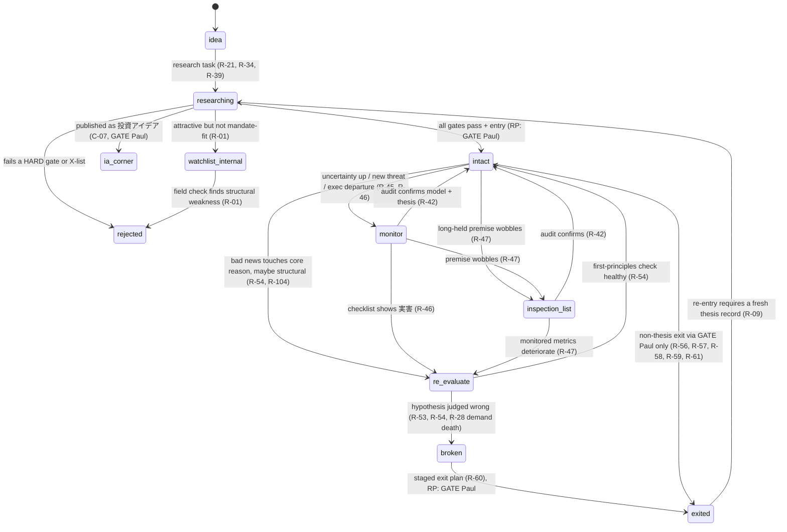

# Paul Tsai — Investment Philosophy & Engine Spec

**Version 1.0 · 2026-09-29 · Built for porting into Claude Code**

This specification turns Paul Tsai's investment philosophy into a form an engine can implement. The source is roughly 460 unique documents of his own writing, July 2022 → September 2026:
- the weekly Diamond ザイ newsletter;
- 連載 columns;
- Stock Voice TV notes;
- webinar and Zoom scripts;
- draft book chapters;
- his writing-style and compliance profile.

Every principle, rule and framework in it traces to dated passages in that corpus. Where Paul never gave a number, the spec says `TBD(Paul)` instead of inventing one.


**Contents**
§0 How to use this spec (conventions · the spine · invariants · decide-first list) — §1 Philosophy on one page — §2 Core principles register — §3 Decision system — §4 Research process & frameworks — §5 Portfolio — §6 Macro overlay — §7 Communication & compliance guardrails — §8 Engine blueprint — §9 Configuration (+ full config/philosophy.yaml) — §10 Decisions needed from Paul — §11 Data-quality & provenance caveats — §12 Glossary — §13 File map (in §0 block)


---

## §0 How to use this spec

### 0.1 Reading order
1. **This overview.** Conventions, the spine, the invariants, the first decisions to make, and the file map.
2. **§1–§2 Philosophy and principles** (`01_philosophy.md`). Why and how he invests; 42 principles, 23 temperament beliefs, 29 influences.
3. **§3 Decision system** (`02_decision_system.md`). The thesis-state machine, 130 rules (R-01…R-130), 40 exclusions (X-01…X-40), the sizing policy, the crisis playbook and the invariants.
4. **§7 Compliance** (`06_compliance.md`). Read this before building anything that writes text for the newsletter.
5. **§8 Engine blueprint** (`07_engine_blueprint.md`) and **§9 Configuration** (`08_configuration.md` + `config/philosophy.yaml`).
6. **Deep sections as needed:**
   - §4 Research & frameworks (122 frameworks, a 10-stage pipeline, metrics);
   - §5 Portfolio (history, performance, cases);
   - §6 Macro overlay;
   - §10 Decisions needed from Paul (93 decisions, Top 15);
   - §11 Data quality;
   - §12 Glossary.
7. **Provenance:** `reference/P1…P6`, the fully sourced long-form parts, with date lists and verbatim Japanese quotes for every item.

### 0.2 ID conventions

| Prefix | Meaning | Defined in |
|---|---|---|
| P-01…P-42 | Core principles | §2 / P1 |
| P1 T-01…T-23 | Temperament and behavioral beliefs (always written with the "P1" prefix) | §2.2 / P1 |
| INF-01…INF-29 | Influences (Lynch, Buffett, Bolton, Danoff, Tillinghast…) | §2.3 / P1 |
| R-01…R-130 | Decision rules | §3.2 / P2 |
| X-01…X-40 | Exclusions and red flags | §3.3 / P2 |
| INV-1…INV-7 | Engine invariants | §3.6 / P2 |
| C-01…C-20 · RG-01…RG-18 | Compliance guardrails · reader-guidance patterns | §7 / P2 |
| F-01…F-122 | Analytical frameworks | §4 / P3 |
| T-01…T-33 (bare "T-") | Tensions between stated rules and practice | §10 / P6 |
| D-01…D-93 | Decisions needed from Paul | §10 |
| M-P, M-R, I-, PR-, R1–R6, C1–C8, D1–D14 | Local IDs in the macro section: macro principles, macro rules, indicators, premises, regimes, macro channels, stance-vs-practice divergences. **Local to §6/P5.** Do not confuse C1–C8 with C-01…C-20, D1–D14 with D-01…D-93, or R1–R6 with R-01…R-130. | §6 / P5 |

### 0.3 Strength, encodings and value conventions
- **Strength**
  - **Core★**: explicitly called a rule or core design by Paul.
  - **Core**: explicit and recurring on ≥3 distinct dates, or explicitly framed as a rule.
  - **Stated**: explicit on 1–2 dates.
  - **Observed**: inferred from his actions.
  - Provenance is shown as first→last year and the number of distinct dates.
- **Encodings** (how a rule is implemented)
  - **HARD**: an inviolable constraint.
  - **SOFT**: a scoring or ranking input.
  - **ALERT**: surfaced for review; nothing is automated.
  - **GATE(Paul)**: needs Paul's explicit approval.
  - **GATE(reader)**: handed to the reader-as-PM as a framework, never as an instruction.
- **`TBD(Paul)`**: never stated by Paul. The engine must ALERT → GATE(Paul) and never guess (INV-5). "Suggested default" values in §10 are proposals, not rules. They take effect only after Paul approves them and they are written into config.
- **Evidence flags**
  - ⚠series: from the curated 2026-03-31 column compilation.
  - ⚠AI-draft: a lower-weight source.
  - ⚠arith: an arithmetic slip in the source (see §11).
  - Later explicit statements beat earlier ones; explicit beats inferred.
- **Privacy**: no third-party personal details; no personal wealth figures.

### 0.4 The spine in twelve lines
1. **Method:** buy companies with a good investment story when everyone is pessimistic, and hold them for the long term (§1).
2. **Survival first (退場しない):** bet only at a size that keeps you in the game even when wrong. No leverage-dependent bets and no Martingale (P-09, R-67, INV-4).
3. **Asymmetry by sizing:** start small, never sell the winners, and let winners become the big positions; "small when wrong, uncapped when right" (P-08).
4. **Thesis over price:** `thesis_status` is the master variable. Add only when the price falls and the thesis is unchanged; sell only when the thesis breaks. Volatility is noise (P-02, §3.1).
5. **Crises are the opportunity:** decide in calm times, classify the shock, deploy in stages where the story is intact, and never panic-sell (P-01, §3.5).
6. **Allocation first:** asset class → sector → stock. Currency and country are allocation choices, and the US is the anchor (P-11, P-15).
7. **Barbell:** an AI/tech growth core insured by energy and real assets. The third leg has been redefined several times (T-17, D-10).
8. **Moats that are mechanisms:** own the indispensable #1 (主役企業) and toll booths (関所); treat commodity businesses as cyclical (R-03, R-04, F-01, F-04).
9. **AI-era map:** the intelligence supply chain (知能のサプライチェーン), receipts-backed capex (領収書付きCapEx) and utilization (点灯率). Compute commoditizes; intelligence and toll booths take the margin (§4.4).
10. **Macro:** no edge in forecasting it, but it sets allocation, sleeves and cash parking, and it creates buying opportunities. It is never the reason to sell a thesis-intact name (§6).
11. **Low turnover, premise inspection:** don't churn. Inspect premises (前提の点検) and publish your misses (P-04, P-28, P-21).
12. **Readers are their own PMs:** the newsletter supplies frameworks, status and 点検材料, never orders. Recommended-portfolio (RP) changes are Paul-only (INV-1, INV-6, §7).

### 0.5 Engine invariants (binding everywhere)

| ID | Invariant |
|---|---|
| INV-1 | **Paul-only RP changes.** Inclusion, exclusion, weight change and any affirmative add-call on an RP name are GATE(Paul) (C-06). |
| INV-2 | **Thesis record everywhere.** Every holding and every idea carries a written thesis with break conditions and 点検材料 (R-09). `thesis_status` drives add/hold/sell. |
| INV-3 | **No price-only triggers.** No %-drop buys, no stop-losses, no %-gain auto-trims (R-33, R-55). Trims happen only through GATE(Paul). |
| INV-4 | **Survival first.** Every sizing proposal passes the 退場しない check (R-67) before any optimization. |
| INV-5 | **No invented thresholds.** A `TBD(Paul)` parameter defaults to ALERT → GATE, never to a guessed number. |
| INV-6 | **Reader-PM.** Reader-facing outputs never contain sizing instructions or imperative buy/sell calls. They contain the framework, the status, the weaknesses and 点検材料 (C-02–C-07). |
| INV-7 | **Output lint.** The forbidden-phrase lint (C-05) runs on every newsletter-bound string. |

The engine **never places orders** and **never publishes**. It researches, monitors, proposes and drafts (§8).

### 0.6 Decide these first (from §10.15)

| Rank | D-ID | Decision | Why it comes first |
|---|---|---|---|
| 1 | D-27 | Rule hardness | Global switch: whether any numeric line (crisis %, 10Y, oil persistence, bands) acts or only alerts. |
| 2 | D-11 | Engine user profile & index core | Sets which portfolio the engine optimizes (RP vs personal), plus name counts, cash, sleeves, FX outputs and wording. |
| 3 | D-04 | Survival budget | The R-67 check runs before any optimizer. Without numbers, sizing has no binding constraint. |
| 4 | D-01 | Max position / the "20%" | Binds every add and the largest holding; defines forced-rebalance logic. |
| 5 | D-10 | Canonical barbell | Defines the sleeves and bands used by rebalancing, hedging and allocation. |
| 6 | D-17 | Thesis-break exits & kill criteria | The primary sell path; counters the documented slowness to exit. |
| 7 | D-02 | Starter size & add rules | Every entry and add; the tranche scheduler. |
| 8 | D-16 | Rebalancing method | Sleeve vs name, calendar vs band. |
| 9 | D-15 | Profit-taking / valuation-only sells | The only discretionary trim path. |
| 10 | D-22 (+ D-45) | Crisis trigger & dry powder | His best-documented edge; defines crisis mode and cash deployment. |
| 11 | D-60 | AI de-risk & funding-stress triggers | The only exit path for the largest theme. |
| 12 | D-59 (+ D-05) | Uranium classification & AI-theme cap | Sets the concentration metric and whether the energy leg hedges at all. |
| 13 | D-30 (+ D-31) | Macro scope & premise register | Whether regime variables may tilt sleeves, and whether they can ever sell a name. |
| 14 | D-53 (+ D-52) | Primary universe & US core | Eligibility of every candidate; the regional bands. |
| 15 | D-28 | Technicals scope | The entry-pacing overlay and output lint (a stated-vs-practiced gap on ≈33 dates). |

---

## §13 File map

| File | Section | Contents |
|---|---|---|
| `CLAUDE.md` | — | Standing instructions for Claude Code in the engine repo |
| `docs/00_OVERVIEW.md` | §0, §13 | This file |
| `docs/01_philosophy.md` | §1–§2 | One-page philosophy; principles register P-01…P-42; temperament; influences |
| `docs/02_decision_system.md` | §3 | Thesis-state machine; rulebook R-01…R-130; exclusions X-01…X-40; sizing and construction; crisis playbook; invariants |
| `docs/03_research_frameworks.md` | §4 | 10-stage research pipeline and artifacts; framework index F-01…F-122; metrics & thresholds; AI-era toolkit |
| `docs/04_portfolio.md` | §5 | Current holdings map; barbell design; history; performance record; key cases; sector stances |
| `docs/05_macro.md` | §6 | Macro stance vs practice; indicator dashboard; macro rules; standing views and premises; track-record lessons |
| `docs/06_compliance.md` | §7 | RP vs 投資アイデア; approved phrasings; forbidden phrases; fair disclosure; reader-guidance patterns |
| `docs/07_engine_blueprint.md` | §8 | Architecture, data sources, data model, rule evaluation, workflows, replay tests, build plan |
| `docs/08_configuration.md` | §9 | How `config/philosophy.yaml` is organized and maintained |
| `docs/09_decisions_needed.md` | §10 | D-01…D-93 with evidence, suggested defaults and config keys; Top 15; crosswalk |
| `docs/10_data_quality.md` | §11 | Rules for learning from the corpus; misdated files; AI-drafted pieces; arithmetic errors with corrections |
| `docs/11_glossary.md` | §12 | 247 terms (JP ↔ EN) with IDs |
| `config/philosophy.yaml` | §9 | 525 parameters (158 `TBD(Paul)`), with provenance comments |
| `reference/P1_philosophy.md … P6_tensions_context.md` | — | Full sourced parts: date lists, recurrence counts, verbatim quotes, open questions |
| `reference/PAUL_STYLE_PROFILE.md` | — | Paul's Japanese writing-style and compliance profile for newsletter drafts |


---

## §1 Philosophy on one page

*Condensed from → P1 §1.1, the P1 overview and §1.2. IDs point to §2. Every quote is verbatim from P1.*

> **The method in his words:** 「良い投資ストーリーを持つ会社を、みんなが悲観している時に買い、長期で持つ」: buy companies with a good investment story when everyone is pessimistic, and hold them for the long term (2026-03-31 series). Four frames surround it: survival first, allocation first, a US anchor, and managing family money.

### 1.1 Who, why, for whom, how long
- **Who.**
  - Before Fidelity: born in Taiwan and raised in the US; engineer (UCLA, ExxonMobil); consultant (Mars & Co); CMU MBA.
  - Fidelity, 12+ years: Japan analyst; Japan and China research director (he opened Shanghai in 2011 and worked closely with Anthony Bolton); pilot-fund PM.
  - Independent since 2017 and based in Seattle. He writes for Japanese readers: the Diamond ザイ newsletter (since ~Aug 2022), 連載 columns, Stock Voice TV, webinars and a FIRE book.
- **Aim.** Turn savers into owners of productive capital.
  - Investing is a right to participate in the future (未来への参加権, P-20), and money buys freedom of time (P-18).
  - His own money is family money, for his children's education and his retirement: "what you need is not greatness but discipline" (EN, 2026-08-28).
  - He owns every recommended-portfolio (RP) name (P-40).
- **Audience.** Part-time individual investors, above all Japanese salaried workers whose income, savings and currency all sit in Japan.
  - Their edge over institutions, which are judged quarterly and bound to benchmarks, is time and the freedom to wait.
  - He supplies frameworks, not orders. Each reader is their own PM, and the RP is "one PM's answer" (私というPMの一つの答え), to be diluted to taste like instant coffee (P-22).
- **Horizon.** 「投資は時間で稼ぐものです」 ("investing earns its return through time", 2023-12-29; P-03).
  - He buys only with 5+ years of conviction.
  - He judges events by their effect on intrinsic value 10 years out.
  - He plans FIRE over 20–30 years.
  - In 2022 "long-term" meant 1–3 years → P1 OQ-01.

### 1.2 How he wins: his operating order
1. **Allocation first:** asset class → sector → stock. Currency and country are allocation choices ("allocation decides ~90%", P-11).
2. **Stand on the capital side, in the right place:** productive assets rather than cash (P-16), the US as anchor (P-15), and 「投資家としてのパスポートと、市民としてのパスポートは別物です」 ("your investor passport and your citizen passport are different things", 2026-08-21; P-12).
3. **A few long structural themes, insured:** above all AI, paired with energy and real-asset insurance so the portfolio survives either scenario. This is the barbell: structure over prediction (P-06).
4. **Story plus price for each name, in limited slots:**
   - quality businesses whose returns on capital beat near-riskless Treasuries (P-19);
   - revenue growth first for growth companies (P-24);
   - valuation as a secondary check (P-27).
5. **Buy when panic makes good companies cheap:** 「パニックが良い会社を安くする」 (2026-03-24/29; P-01). Do so only if the thesis is unchanged, and be the liquidity provider.
6. **Then mostly do nothing:** don't churn (P-04), and let winners compound.

His edge is 長期・論理・忍耐・分散 (long horizon, logic, patience and *uncorrelated* diversification; 2025-10-03), plus the ability to interpret raw US information (P-26). It is not prediction (P-14).

### 1.3 How he avoids losing
- **Survival first (退場しない, P-09):** 「外れても市場から退場しない大きさで賭けること。」 ("bet at a size that keeps you in the market even when wrong", 2026-09-27). No bet-the-house or leverage-dependent bets.
- **Asymmetry by sizing (P-08):** start small so a wrong call is a capped loss, and don't sell winners so a right call has no ceiling. In his words: "small when wrong, uncapped when right" (EN, 2026-08-28).
- **Other guards:**
  - Diversify by low correlation, currency included (P-05).
  - Keep speculation tiny and outside the core (P-07).
  - Avoid what you can't explain or see into (P-10, P-35, P-41): black boxes such as banks, complex or high-fee products, promotion stocks, private deals, and concentration in the yen.
  - Never panic-sell, and never trade on macro or news (P1 T-09, P-14).
  - Keep a realistic return map: the legends made ~20%/yr, and ordinary investors should expect 5–10% (P-37).
  - Sell only when the thesis breaks, inspect premises (前提の点検, P-28), and publish your misses (P-21).

### 1.4 Signature stances
- **Crises** (P-01, his most recurrent idea, on 64 dates):
  - His largest gains came from buying through 9/11, Lehman, 3/11 and COVID.
  - He buys only the dip where the price falls and the thesis is unchanged. Dying demand means retreat; a drop that flushes out positioning means opportunity.
  - Decisions are made in peacetime (P-06).
- **Thesis vs price** (P-02): 「「理由」が生きている限り、ボラティリティはノイズです」 ("as long as the reason is alive, volatility is noise", 2026-03-29). Price alone never triggers a sale.
- **Time** (P-03): compounding and patience are the individual's structural edge, and being out of the market is itself a risk.
- **US anchor** (P-15): 「不安定こそ、アメリカに投資するべきだと思います」 ("precisely when things are unstable, invest in America", 2023-05-12).
  - This is not blind faith. The US is the most efficient way to own the place where global innovation happens.
  - Japan is an option, bought only with strict selection (P-12).
- **AI** (P-13, P-32): 「AIはバブルではなくブームだということです」 ("AI is a boom, not a bubble", 2026-03-29).
  - Stay in the theme but keep selecting, because a right theme is not the layer that profits.
  - He has reversed his 2023 view that the compute supplier wins. By 2026, compute commoditizes, and intelligence and toll booths (関所) take the margin.

### 1.5 Evolution and engine stance
- **Current as of Sep 2026:**
  - Horizon: 1–3 years → 5+ years plus a 10-year test.
  - Risk: "price swings" → "dispersion of outcomes" (P-30).
  - Sizing: conviction/Kelly-style → "start small, let winners grow" (P-08).
  - Where AI value is captured: reversed (P-32).
  - Energy: from hedge to AI input (P-06).
  - New in 2026: premise inspection for a world of 5% rates.
- **Style arc:**
  1. Before the newsletter: defensive, with value, dividends, Japan and cash.
  2. 2022–23: quality growth bought on macro drawdowns, with an energy/real-asset hedge and REIT ballast.
  3. 2024–25: an AI-anchored US tech core with an energy barbell and very low turnover.
  4. 2026: structure over prediction, and selection by layer within AI.
- **Engine stance: judgment first.** He says simple rules get competed away and that he has no fixed single-stock rules (P-36). Most thresholds are therefore `TBD(Paul)`.

---

## §2 Core principles register

*Condensed from → P1 §1.2 (principles), §1.3 (temperament) and §1.4 (influences). For each principle, P1 §1.2 gives the statement, rationale, quotes, sub-rules, evolution and engine line. References to "P1 OQ-xx" feed §10. "↔ P6 T-xx" points to the tension that governs the open choice (→ P6 §6.2).*

- **Counts:**
  - 42 principles: 11 Core★, 30 Core, 0 Stated, 1 Observed.
  - 23 temperament beliefs: 22 Core, 1 Stated.
  - 29 profiled influences, plus 72 secondary-source rows (shown in 64 rows here).
- **Strength:**
  - **Core★:** Core, and explicitly framed by Paul as a rule, "the only …", "core design" or "core method".
  - **Core:** explicit on ≥3 distinct dates.
  - **Stated:** explicit on 1–2 dates.
  - **Observed:** inferred from his actions or writing.
- **Recurrence:** the number of distinct source dates. P1 computes it by script, merging duplicates and excluding fact-dates.
  - All principles are explicit (E) except three that add an inferred element (P-21, P-27, P-33) and P-42, which is inferred (I) with supporting E statements.
  - Row order follows P1: Core★ by recurrence, then Core by recurrence, then Observed.
- **Weight beyond the counts:** three rules he names explicitly carry more weight than their recurrence suggests. They are P-09 (survival first), P-08 (asymmetry by sizing) and P-10 ("know why you own it", his "only real rule").
- **Engine column:**
  - It is phrased as condition → action.
  - Config keys follow the §9 namespace. Keys added beyond that namespace are marked "(ext)".
  - `TBD(Paul)` marks every place where he never gave a number.
- **ID collision:** P1 also numbers its temperament beliefs T-01…T-23 and its quotes Q-01…Q-89. Those clash with P6's tensions (T-01…T-33) and P6's open questions (Q-xx).
  - In the master, cite the P1 items as "P1 T-xx" and "P1 Q-xx".
  - A bare "T-xx" means a P6 tension.

### 2.1 Principles (P-01…P-42)

| ID | Principle (one line) | Strength | Dates · span | Engine implication |
|---|---|---|---|---|
| P-01 | Crises and panic are the opportunity: be the buyer, never the panic seller (危機の中に機会) | Core★ | 64 · 2022→2026 | IF the drop is panic-, macro- or positioning-driven AND the thesis KPIs are unchanged AND demand is not dying → mark an add candidate and run pre-planned tranches from the peacetime watchlist. Never sell on price alone. `entry.dip_buy_requires_thesis_intact: true`. `crisis.trigger_drawdown_pct` and `crisis.deployment_tranches`: TBD(Paul); the only examples are a "20%+ fall" and SVB-era banks down 10–20% → P1 OQ-06 |
| P-02 | Thesis over price; sell only when the thesis breaks (テーゼと価格を分けて見る) | Core★ | 42 · 2022→2026 | Store per holding: {story, premises, KPIs, break conditions}. Price-only moves never generate sells. After earnings, check the KPIs against the original reasons; the default result is "no change". `exit.sell_on_thesis_break: true`. `exit.thesis_break_exit_mode` (ext; immediate vs re-evaluate, tranches): TBD(Paul) → P1 OQ-02 ↔ P6 T-15 |
| P-03 | Time is the edge: horizon, compounding, patience (投資は時間で稼ぐもの). Current: 5+ years of conviction plus a 10-year value test | Core★ | 37 · 2022→2026 | Reject buys without a ≥5-year story. Judge on multi-year windows, with no 60-day verdicts. Count time out of the market as a risk. `hold.horizon_min_years`: 5, per his 2026 wording; confirm → P1 OQ-01. Cash stance → P1 OQ-05 ↔ P6 T-23 |
| P-04 | Don't churn: doing nothing is a decision (動かないことで動いている) | Core★ | 27 · 2022→2026 | Default output is "no action". Propose trades only on a thesis break, a premise change, a crisis-buy trigger or an explicit exception. Review at earnings and scheduled inspections, not on daily news. `hold.turnover_budget_pct` (ext): TBD(Paul). References: a star PM ran <20%/yr; >100% was a Fidelity red flag → P1 OQ-17 |
| P-05 | Diversify by low correlation, balanced against conviction (分散しかない) | Core★ | 24 · 2022→2026 | Check correlation clusters, currency exposure (including cash and income currency) and look-through ETF concentration. `construction.target_names_min/max`: 20–30, or 10–20 with high conviction (his 2025-10-03 guidance; the RP ran ~14–17 names). Confirm → P1 OQ-04 ↔ P6 T-07, T-13 |
| P-06 | Structure over prediction: design in peacetime; the barbell (予測よりも構造). Current: a US/AI core, oil majors as insurance, uranium as an AI complement | Core★ | 21 · 2023→2026 | Keep a scenario grid (AI boom/bust × inflation or geopolitical shock × rates). The hedge sleeve must pay off in the adverse cells. Pre-commit the crisis playbook (watchlist, target prices, tranches) during calm periods. `construction.sleeves`, `construction.sleeve_weights`, `hedge.gold_allowed`, `hedge.bitcoin_allowed`: TBD(Paul) → P1 OQ-07 ↔ P6 T-05, T-17 |
| P-07 | Investment ≠ speculation: invest only with an edge (投資と投機は別) | Core★ | 20 · 2023→2026 | Tag each idea as investment, trade (with a time stop) or speculation. Speculation never enters the core. Every investment carries an edge statement. `sizing.speculative_max_pct`: TBD(Paul) → P1 OQ-20 ↔ P6 T-22 |
| P-08 | Asymmetry by sizing: "small when wrong, uncapped when right". Current: start small and let winners grow | Core★ | 17 · 2023→2026 | Start with a small size, add in stages as conviction rises, and never trim structural winners automatically. `sizing.initial_position_pct`, `sizing.max_position_pct`, `entry.staged_tranches`: TBD(Paul). `sizing.add_on_conviction: true`. `sizing.kelly_fraction`: TBD(Paul); the Kelly ~20% example is illustrative only and conflicts with "hold it small" → P1 OQ-03 ↔ P6 T-08, T-09 |
| P-09 | Survival first: never take a knockout loss (退場しない). Current: accept variance only at a survivable size | Core★ | 14 · 2022→2026 | Hard constraint: no bet whose loss would impair household goals. Per user, run a −50% endurance test, plus a zero-outcome test for each bet. Set the risk budget from his two questions: is the certain return enough, and does life survive a zero? `sizing.leverage_allowed` (ext): TBD(Paul) → P1 OQ-13 ↔ P6 T-30 |
| P-10 | Know why you own it: the investment story (投資ストーリー), his "only real rule" | Core★ | 14 · 2022→2026 | A buy requires a written 5–10-year story, premises, KPIs, explicit break conditions ("when would the story break?") and a valuation check. Reject the idea if a recent large move can't be explained. Re-check at each earnings report and inspection. `research.gates` |
| P-11 | Allocation first: asset class → sector → stock | Core★ | 10 · 2022→2026 | The pipeline runs allocation (asset class, currency, region) → sector → security. Attribution reports allocation effects first. Flag implicit allocations, such as all-yen savings. `construction.sleeves` ↔ P6 T-28 |
| P-12 | Investor passport ≠ citizen passport: reduce home bias; think in companies, not countries | Core | 38 · 2022→2026 | For JP residents, compute home bias (JP equities + JPY cash + JP income) and flag it above `universe.home_bias_flag_pct` (ext): TBD(Paul). Screen globally, not by listing (`universe.regions`). Report in the spending currency (`reporting.return_basis`). `fx.hedge_policy`: TBD(Paul), because the yen premise is "wobbling" → P1 OQ-08, OQ-22 ↔ P6 T-12, T-20 |
| P-13 | AI is real, structural and long-legged: "a boom, not a bubble" | Core | 37 · 2023→2026 | AI anchors the growth sleeve. De-risk when technical progress stalls or demand dies, not on a profit dip. Monitor funding stress (hyperscaler bonds, Oracle's FCF). `exit.ai_demand_death_triggers` (ext): TBD(Paul) → P1 OQ-11 ↔ P6 T-14 |
| P-14 | No edge in macro or short-term prediction ("the short term is roughly a coin flip") | Core | 32 · 2022→2026 | Security-level signals never depend on macro forecasts. Macro only tilts allocation and currency, and flags "opportunity windows". Timing tweaks are limited to size adjustments. `timing.macro_overlay_allowed`: allocation/currency only; bounds TBD(Paul) → P1 OQ-09 ↔ P6 T-02, T-03 |
| P-15 | America is the anchor, all the more when the world (or the US) is unstable | Core | 32 · 2023→2026 | US equities are the core sleeve. Geopolitical, election and tariff shocks are P-01 candidates, not sell signals. `construction.us_min_weight` and `construction.non_us_min_weight` (ext): TBD(Paul) → P1 OQ-08 ↔ P6 T-06, T-32 |
| P-16 | Own productive assets; cash is not safe (inflation is a 隠れデフォルト, a hidden default) | Core | 31 · 2022→2026 | Long-run cash is a liquidity reserve only. Fixed income stays short duration. Gold and crypto stay out of the core unless Paul confirms a hard-money sleeve. `cash.reserve_months_reader`: TBD(Paul); references are 6–12 months for readers, ≥1 year for himself and 生活費の数年分 for FIRE → P1 OQ-05. `cash.parking_instruments`: short duration → P1 OQ-12. `hedge.*` → P1 OQ-07 ↔ P6 T-04, T-18, T-33 |
| P-17 | Temperament beats intellect; behavior decides results (気性) | Core | 28 · 2022→2026 | Build guardrails: a cooling-off period after shocks (one Mar-2026 Zoom script says no trades for a few days), pre-committed plans, a decision journal, and no urgency framing. `crisis.cooling_off_days`: TBD(Paul). Urgency wording → `compliance.banned_phrases` |
| P-18 | Money is a means to freedom (time); FIRE is a start, not a finish | Core | 28 · 2022→2026 | Collect goal inputs: spending, "Enough", horizon and purpose. Show spending as compounding forgone. Never optimize terminal wealth alone. |
| P-19 | Buy good businesses at fair prices and let them compound; beware value traps | Core | 24 · 2022→2026 | Quality screen: ROIC/ROCE spread over the risk-free rate, moat durability, balance sheet, adaptability and alignment (`research.gates`; thresholds TBD(Paul)). Pair it with the P-27 valuation gate and the P-03 horizon. |
| P-20 | Be on the side of capital (未来への参加権) | Core | 17 · 2022→2026 | The default stance for savers is to be invested in equities. In the AI era, tilt toward owners of AI capital, subject to the P-32 layer rules. |
| P-21 | Judge process, not outcome; admit luck; audit your hypotheses (納得できる投資) | Core | 17 · 2022→2026 | Keep a decision journal with the ex-ante rationale and confidence. Post-mortems score process separately from outcome. Keep a per-hypothesis hit/miss ledger and an "inspection list" status for doubtful premises. |
| P-22 | Self-reliance: readers are their own PMs, and the RP is "one PM's answer" | Core | 17 · 2022→2026 | Outputs are decision support: rationale, counter-arguments and weaknesses, personalized to the user. Never phrase them as commands (`compliance.banned_phrases`). Disclose conflicts (`compliance.fair_disclosure_required`). Advisers → P1 OQ-25 |
| P-23 | Prices follow earnings; news is noise and fundamentals are signal | Core | 16 · 2022→2026 | Weight the earnings trajectory and revisions over price action. Allow for slow re-rating (じわじわ). Treat news as noise unless it changes 10-year value (the P-02 test). |
| P-24 | Growth companies: revenue growth first, and reinvestment is rational. Current: also require evidence that the spending earns a return | Core | 16 · 2022→2026 | The growth KPI is revenue growth, both level and acceleration. Accept capex only with receipts (領収書付き) or ROIC evidence. Flag high-multiple names whose profit growth stalls. |
| P-25 | What's priced in (織り込み) matters more than the outlook | Core | 16 · 2022→2026 | Each thesis states the consensus expectation and the variant view. Track implied expectations (consensus EPS/revenue, implied growth). Flag when the variant view has become consensus. |
| P-26 | Edge = interpreting raw information; the field before statistics | Core | 16 · 2022→2026 | Ingest primary sources: 10-K/10-Q, transcripts, IR decks (`research.required_sources`). Accept tagged field observations as evidence. Output structure (drivers, premises), not data dumps. |
| P-27 | Valuation is necessary but secondary, and business-specific | Core | 14 · 2022→2026 | Key the valuation module by business type: growth, cyclical/commodity, miner, order-backlog, financial (yardsticks TBD(Paul)). Valuation gates entry price and size, not exits, except for explicit bubble or extreme rules: `exit.valuation_trim_enabled`, `exit.valuation_trim_trigger`: TBD(Paul) → P1 OQ-10 ↔ P6 T-11 |
| P-28 | Regimes change suddenly: know history and inspect premises (前提の点検; 金利のある世界) | Core | 14 · 2022→2026 | Keep a premise register: {premise, since, evidence, status holding/wobbling/broken, dependent holdings}. Run scheduled inspections (`research.premise_inspection_cadence` (ext): TBD(Paul)). A status change re-runs the dependent theses; there are no automatic trades → P1 OQ-21, OQ-22 |
| P-29 | Structure and incentives decide whether value reaches owners | Core | 14 · 2022→2026 | Governance/alignment screen: insider ownership, takeover exposure, board accountability and capital-return record. Raise a value-trap flag where alignment is absent. Store management-integrity notes as thesis premises. |
| P-30 | Risk is the price of return. Current: risk is the width of outcomes (結果の振れ幅), not loss | Core | 13 · 2022→2026 | Risk metrics are outcome distributions and ruin probability, not volatility alone. Compare each allocation to the risk-free hurdle (`cash.hurdle_rate_source`: the 10-year UST at ≈5% vs the MMF yield, TBD(Paul) → P1 OQ-16). Personalize through "way of life" questions ↔ P6 T-26 |
| P-31 | Cycles and commodities mean-revert: a spike is a cycle, not a structure | Core | 13 · 2023→2026 | Classify each holding as structural, cyclical or commodity. Cyclical and commodity positions carry an exit plan tied to cycle indicators such as earnings direction and capacity/price (`exit.cyclical_exit_signals` (ext): TBD(Paul)). Structural compounders are exempt from cycle-based trims ↔ P6 T-05 |
| P-32 | A right theme ≠ the layer that profits (関所). Current: compute commoditizes, and intelligence and toll booths take the margin, reversing his 2023 view | Core | 12 · 2023→2026 | Map each AI holding to a layer: upstream (energy, scarce parts); midstream (compute with receipts, vs resellers of borrowed compute); downstream (toll booths, data owners). Penalize commoditizing layers. Every AI thesis must answer "who captures the margin?" ↔ P6 T-16 |
| P-33 | Bubbles: understand them, don't flee; they burst on excess real investment | Core | 10 · 2022→2026 | Bubble monitor: capex/GDP, utilization (the "lit rate", 点灯率), financing leverage, and the share of returns from earnings vs multiples. Action thresholds: TBD(Paul). |
| P-34 | Capitalism and competition: markets exist to allocate capital; owners of IP and of capital accumulate wealth | Core | 9 · 2022→2026 | Prefer IP-owning, price-setting businesses over volume manufacturers. Don't re-rank best-in-class companies on tariff news alone. |
| P-35 | Costs and taxes compound against you | Core | 9 · 2022→2024 (not restated since; implicit in his index advice) | Show projections net of fees and taxes. Penalize high-fee and complex products. Include the tax drag of turnover. |
| P-36 | Judgment over formulas; no easy rules survive | Core | 9 · 2022→2026 | The engine is judgment support. It surfaces structure, premises, counter-evidence and checklists, hard-codes only thresholds Paul supplies, and keeps models parsimonious ↔ P6 T-29 |
| P-37 | Keep a realistic return map: ~20%/yr is the sustained ceiling, 5–10% for ordinary investors | Core | 8 · 2022→2025 | Flag any sustained projected return above ~20%/yr. Planning range 5–10%/yr with a 7% base (his figures; confirm TBD(Paul)). `reporting.annualization_method: compound` (confirm → P1 OQ-15) ↔ P6 T-27 |
| P-38 | Index as the foundation; single stocks need discipline and selectivity. 2026-09: "an era of selection" (選別の時代) | Core | 8 · 2023→2026 | Two user modes: index-core (the default), and index-core plus a selective satellite, which requires discipline attestations. RP slot limit (`construction.target_names_max`): TBD(Paul) → P1 OQ-04, OQ-14 ↔ P6 T-25 |
| P-39 | Total return in your spending currency, not dividends | Core | 6 · 2023→2026 | Make every comparison in total-return, user-currency terms (`reporting.return_basis`; USD vs JPY base and `reporting.benchmark` → P1 OQ-15). Dividend yield is never a standalone criterion. The role of income assets → P1 OQ-23 ↔ P6 T-19 |
| P-40 | Eat your own cooking: he owns every RP name | Core | 4 · 2022→2024 (the practice is visible through 2026-09) | Record Paul's ownership status for each recommended name, and flag any recommendation he doesn't own (`compliance.fair_disclosure_required`) ↔ P6 T-24 |
| P-41 | Public markets are enough (王道, the royal road) | Core | 3 · 2025→2026 | Exclude private placements, unlisted deals and betting or prediction-market "investments" (`universe.exclusions`). |
| P-42 | Macro and charts are tools, not theses | Observed | 28 chart uses (2022→2026); ≥33 macro calls (2022→2025) | Charts serve only as entry-timing and price-level aids on thesis-approved names, and only for size adjustments. Macro feeds allocation and currency tilts. Neither can originate a buy or a sell. `timing.technical_overlay_allowed`: scope TBD(Paul). `timing.macro_overlay_allowed`: allocation/currency only → P1 OQ-09 ↔ P6 T-01, T-03 |

**Low-weight evidence inside the counts.** None of it changes a conclusion, and for every principle flagged dates are under 5% of the dated evidence (→ P1 Conventions; §11).
- P-03: three AI-assisted 2024 dates.
- P-04 and P-19: the Fundsmith-derived 2025-02 motto. Its avoided-sector list also conflicts with his energy holdings.
- P-05: 2024-08-26 (AI-assisted).
- P-08: the "free call option" framing from an outside analyst (2025-12-04).
- P-14: the Vinik piece (AI-drafted).
- P-15: some 2026-01 framing may be AI-suggested.
- P-16: 2025-12-08 and 2026-01-14.
- P-18: 2024-08-19.
- P-19: 2025-12-08.
- P-26: 2024-06-12.
- P-29: 2024-05-27.
- P-37: arithmetic slips in the YOLO examples; Soros listed at ~20% vs ~30%; the 69% RP figure uses simple annualization.
- P-39: 2024-05-27.

### 2.2 Temperament & behavioral beliefs (P1 T-01…T-23)

*Detail → P1 §1.3. These are P1 IDs, not P6 tensions. Strength · # distinct dates · span.*

| ID | Belief | Provenance | Engine hook |
|---|---|---|---|
| P1 T-01 | The brain isn't built for investing; going against impulse (衝動に逆らう) is the key | Core · 6 · 2022→2025 | Show contrary evidence next to the consensus; never rank ideas by recent price momentum alone |
| P1 T-02 | Loss aversion (~2×) is the market's recurring mispricing and his own design constraint | Core · 4 · 2025→2026 | Sentiment-driven drawdowns feed P-01; size positions for survivability (P-09) |
| P1 T-03 | Rational shopping: look at what's on sale (セール中の商品に注目する) | Core · 4 · 2022→2026 | Frame candidates as "on sale vs fair value", not "down x%" |
| P1 T-04 | Emotions are information, not a trigger; fear correctly (正しく怖がる) | Core · 5 · 2022→2026 | A shock creates a structure re-check task, not trade suggestions |
| P1 T-05 | The mind game is the hardest part; emotion is the biggest loss-maker (損失製造機) | Core · 4 · 2023→2026 | No daily P&L pushes and no urgency colors |
| P1 T-06 | Behavior over knowledge; temperament over intellect (Graham; Bolton #2) | Core · 7 · 2022→2026 | Checklists and pre-commitment matter more than more data (P-17) |
| P1 T-07 | Discomfort is a signal (Dalio); instability is welcome | Core · 4 · 2022→2025 | Discomfort is not a veto, but P-10 thesis quality is still required |
| P1 T-08 | Contrarianism is a by-product, not the goal; the consensus isn't always wrong | Core · 5 · 2022→2026 | Don't score ideas for being contrarian; score thesis quality and mispricing (P-25) |
| P1 T-09 | Never panic-sell, "the loser's strategy" (敗者の戦略). If you can't buy, at least don't sell | Core · 10 · 2022→2025 (restated to 2026 via P-01/P-02) | Block engine-generated sells during market-wide panics unless the thesis has broken |
| P1 T-10 | The prepared mind: decide in peacetime (平時に判断しておく) | Core · 5 · 2024→2026 | Keep a standing crisis watchlist with buy levels agreed in advance (P-06) |
| P1 T-11 | Patience is the core skill: cast the bait and wait (人間万事塞翁が馬) | Core · 10 · 2023→2026 | Use long evaluation windows; "no action" is a legitimate outcome |
| P1 T-12 | Resist the urge to act; not trading is not the same as doing nothing | Core · 5 · 2024→2026 | Require a written justification for every trade; the default is "hold" (P-04) |
| P1 T-13 | Japanese cultural virtues, patience and steady accumulation (コツコツ), are an asset | Stated · 2 · 2025 | For Japanese users, frame the plan as steady accumulation, not jackpots |
| P1 T-14 | Self-knowledge is the biggest edge (Bolton #8); know which game you are playing | Core · 6 · 2024→2026 | An onboarding temperament questionnaire; route trend-prone or emotional users to index-core (P-38) |
| P1 T-15 | Risk tolerance is personal, tested by whether you can endure your assets halving | Core · 4 · 2024→2026 | Stress-test every user portfolio at −50% |
| P1 T-16 | Low nerve by design: family money needs discipline, not greatness | Core · 3 · 2024→2026 | A "family money" profile puts survival constraints first (P-09) |
| P1 T-17 | Process over outcome (納得できる投資) | Core · 5 · 2025→2026 | The rubric scores decision quality separately from P&L |
| P1 T-18 | Luck is real, and humility is the root of risk management | Core · 7 · 2022→2026 | Attribute performance to style and era factors before crediting skill |
| P1 T-19 | Honest self-audit: count the misses, publish reversals, keep an inspection list | Core · 6 · 2023→2026 | Auto-generate a "what we got wrong" section in every review (P-21) |
| P1 T-20 | Regret, envy and FOMO are pointless; the defense is a consistent philosophy ("Let Them"; the "5 years on" test) | Core · 5 · 2024→2026 | No "missed winner" nudges |
| P1 T-21 | Humility and candor as an adviser: "I don't know" (分からない) on timing | Core · 9 · 2022→2026 | Every output lists uncertainties and bear points; "I don't know" is an allowed answer on timing |
| P1 T-22 | Scar tissue from the dot-com bubble led to his story-based method and "bubble immunity" | Core · 3 · 2022→2026 | Bubble modules teach recognition, not avoidance (P-33) |
| P1 T-23 | Delayed gratification and habits compound (出せるけれど、出さない) | Core · 3 · 2023→2026 | Habit-building features such as auto-invest; show spending as compounding forgone (P-18) |

### 2.3 Influences (INF-01…INF-29)

*Detail → P1 §1.4. Tiers are P1's:*
- *Tier 1 shapes rules; Tier 2 shapes frames; Tier 3 provides calibration and evidence.*
- *Light, third-party-derived, low-weight and never-cited are also P1 labels.*
- *"Not tiered" means P1 assigns no tier.*
- *The weight column shows tier · distinct dates · span.*

| ID | Who | What he takes | How it shows up | Weight |
|---|---|---|---|---|
| INF-01 | Warren Buffett / Berkshire | Crisis buying ("be fearful when others are greedy"), reframed in 2026 as providing liquidity. A great business at a fair price, with returns on capital well above Treasuries. Patience and consistency. Build cash in good times and deploy it in crises. "Don't bet against America". Luck and humility (the coin-toss story). A ceiling of ~20%/yr. Reproducibility. The "casino" remark as speculation outgrowing investment. Berkshire's moves read as signals (OXY/CVX, TSMC sold on Taiwan risk, the trading houses, insurance float). | P-01, P-03, P-15, P-19, P-21, P-37, P1 T-18. Caveat: he uses Buffett's buys as validation, in mild tension with his own warnings about persuasion | Tier 1 · 38 · 2022→2026 (most cited) |
| INF-02 | Charlie Munger | 「大きな利益は買いと売りにあるのではなく、待つことにある」; years of waiting, then buying bargains aggressively. *Poor Charlie's Almanack*, re-read yearly: mental models, circle of competence, inversion, bias awareness including the endowment effect. Avoid low-profit, promotion-driven stocks. | P-04, P-01, P-10, P1 T-14 | Tier 1 · 5 · 2023→2025 (the 2024-12-07 column was likely drafted ~Dec 2023) |
| INF-03 | Peter Lynch | Don't cut the flowers and water the weeds, i.e. ride winners. "Diworsification". Invest in what you know. Insiders buy for only one reason. The Lynch test: a 2-minute story, a buyable price, and the growth runway left. A ~20%/yr ceiling. | P-08, P-05, P-26. Tension: he keeps "a few weeds" (the real-estate ETFs) | Tier 1 · 12 · 2023→2026 (plus uncredited uses in 2022) |
| INF-04 | Will Danoff (Contrafund) | Price follows EPS; favour upward revisions. 「値段は忘れられるが、クオリティは残る」. "You re-buy your holdings every day", so sell when the premise breaks. Contrafund as his professional benchmark: an AI-chain overweight, memory sold at the peak ("a textbook on commodities"), zero Oracle. "Don't get off the AI theme, but keep selecting". Wait for proof of "beating every time". | P-23, P-19, P-02, P-31, P-32. He disagrees on SaaS and on trimming winners ("both are disciplines") | Tier 1 · 8 · 2022→2026 |
| INF-05 | Joel Tillinghast | 2022: Low-Priced Stock Fund notes. 2026: the Tillinghast test, a verification discipline that stops at what can't be verified from outside. | One of four named lenses in the 2026-09-25 idea review | Light · 2 (2022, 2026) |
| INF-06 | Anthony Bolton | He worked closely with Bolton from 2011 in China. Minimizing losses beats big hits. Bolton's 8 principles as Paul summarizes them: (1) avoid failure; (2) temperament equals intellect, and arrogance is the enemy; (3) the unpopular is opportunity, but select; (4) asymmetric risk/return and a healthy balance sheet; (5) a clear thesis, positions built in stages, selling by logic; (6) judge people; (7) what's priced in; (8) self-knowledge. From China, the lesson that governance comes first. | P-09, P-08, P-02, P-25, P-29, P1 T-06/T-07/T-14. Tensions: "popular is risk" vs his NVDA conviction; "weak finances are the biggest risk" vs holding ORCL (「ストレッチ」) ↔ P6 T-10, T-14 | Tier 1 · 6 · 2023→2025 (the closest match, by his own account) |
| INF-07 | Ray Dalio / Bridgewater | Discomfort as a signal. The bubble gauge. The economic-machine and debt-cycle framework. "Gold is the most basic money": he agrees on scarcity but prefers productive assets, and finds All Weather too hard for individuals. Currency shapes how returns look. Big Cycle, Hormuz and Suez-1956 tail-risk framing (2026-03-24 Zoom). | P1 T-07, P-06 (tail hedges), P-16 (the gold/hard-money evolution) | Tier 2 · 8 · 2022→2026 (plus an uncredited use in 2023) |
| INF-08 | Benjamin Graham (& Dodd) | Temperament over models. Liquidation value as "Value 1.0", followed by 2.0 (Buffett's "inevitables") and 3.0 (Combs/Weschler's digital quality). *The Intelligent Investor*. | P-17, P-27 (value-trap caution) | Tier 2 · 4 · 2022→2025 |
| INF-09 | Howard Marks | Nothing: he is never cited. The nearest analogues (second-order chains, what's priced in, risk as dispersion, cycles) are Paul's own or credited to others. | The engine must NOT attribute ideas to Marks | Never cited · 0 |
| INF-10 | Jeff Bezos | The flywheel (はずみ車), applied to Netflix. The 1997 letter: long-term leadership over short-term profit, 「今日1ドルを使い、10年後に10ドルを取る」. Letters that admit failure signal trustworthy disclosure. Owning 9%+ of Amazon means aligned incentives. Regret minimization, which becomes his three investing questions. | P-24, P-29, P1 T-20 | Tier 2 · 6 · 2022→2026 |
| INF-11 | Terry Smith / Fundsmith (never named) | The columns' motto 「良い会社を買う」「過剰に支払わない」「何もしない」 matches Fundsmith almost verbatim: the ROCE focus and the avoided sectors, which include energy and conflict with his barbell. | Corroborates P-19 and P-04 only; it is not his own rule set → P1 OQ-18 | Third-party-derived, unnamed · 2 (2025-02) |
| INF-12 | Jurrien Timmer (Fidelity) | A 60/20/20 stocks/bonds/hard-money split. The boom-not-bubble test. MOVE vs VIX. 「流動性の受け手ではなく、提供者になる時期かもしれない」. Corrections as rebalancing opportunities. | P-01 (the liquidity-provider idea is attributed to Buffett on 2026-03-29), P-13, P-16. Evidence: one of two same-day script versions, and its BTC/USD correlation figures are inconsistent | Tier 2 · 2026-03-24 (echoed 03-29) |
| INF-13 | Jeff Vinik | Timing fails even when you're right: 「読みが当たっても、タイミングが外れれば敗者になる」. Use time diversification. | P-14 | Low weight (AI-drafted piece) · 2026-02-16 |
| INF-14 | Emerson, "Self-Reliance" (via Buffett and Buffett's father) | Act on your own data and reasoning, and keep conviction when others disagree. | P-22, P1 T-06 | Not tiered · 2024-06-07 |
| INF-15 | Daniel Kahneman (with Tversky; with Deaton) | Loss aversion (~2×) plus media fear bias produces over-pessimism, which creates buying points. The happiness plateau, which he updates to ~$120k (US) or ~¥10M (JP). | P-01, P1 T-02, P-18 | Tier 2 · 2 (2025) |
| INF-16 | Ned Johnson (Fidelity) | Even he found timing hard. He belongs in the ~20%/yr ceiling group. His "chart rooms" taught Paul to read long-term charts as a record of fundamentals. Invest in yourself. | P-14, P-37, P-42. Note: Paul calls him 創業者 (founder), but he was the founder's son and long-time chairman | Not tiered · 5 · 2023→2025 |
| INF-17 | George Soros; Stanley Druckenmiller | Soros's long-run return as evidence for the ceiling, given as ~20% and ~30% (inconsistent). The 1992 sterling trade as the deliberate opposite of his low-nerve style. Druckenmiller and Bill Gross (with Bill Ackman closing his short) on 2-year vs long Treasuries, which supports short-Treasury ETFs. | P-37, P1 T-16 | Tier 3 · Soros 5 (2025→2026); Druckenmiller 2 (2023, 2026) |
| INF-18 | Return-calibration set: Tepper, Griffin, Medallion, Madoff | Tepper in the 20s%; Griffin's best year 38%; Medallion ~66%/yr; Madoff promised "only" 20–30%. Together they map plausible vs implausible returns. | P-37 | Tier 3 · 3 (2024→2025) |
| INF-19 | Ted Weschler; Todd Combs | Weschler's Roth IRA, in listed stocks only, shows the power of tax-free compounding and long holding. Combs and Weschler as "Value 3.0", i.e. digital quality (AAPL, GOOGL, NVDA, MSFT). | P-03, P-19 | Tier 3 · 2 (2024, 2025) |
| INF-20 | Kelly criterion; Markowitz / MPT | Kelly as a sizing concept: a 60% win rate implies ~20% in one stock. It is illustrative and was never adopted. The efficient frontier, as the case for low-correlation diversification. He rejects EMH and factor investing (Dimensional). | P-08 (→ P1 OQ-03), P-05 | Tier 3 · Kelly 2025; MPT 2023→2025 |
| INF-21 | Morgan Housel | True wealth is freedom; *The Psychology of Money*. | P-18 | Tier 2 · 2 (2024-08-19 AI-assisted; 2025-09-22) |
| INF-22 | Vicki Robin & Joe Dominguez, *Your Money or Your Life* (『お金か人生か』) | 「お金は生命エネルギーの貯蔵庫だ」. The real hourly wage. "Enough". The 9-step program. 「私が最も影響を受けた一冊」. | P-18; the FIRE book | Tier 2 · 5 · 2024→2026 |
| INF-23 | Thomas Piketty | People who already have money earn more easily; join them through steady investing. | P-20 | Not tiered · 2024-04-01 |
| INF-24 | Mel Robbins | "Let Them": follow your own plan; don't envy others or chase missed chances. | P1 T-20, P-22 | Not tiered · 2024-09-23 |
| INF-25 | *The Economist*, Buttonwood ("What makes a great investor?") | The criteria are luck, nerve, oddness and changing your mind, and an index fund is right for most people. His self-score: luck, mixed; nerve, deliberately low; oddness, "a little guilty"; changing his mind, his biggest weakness. | P1 T-16, P1 T-19, P-38 | Not tiered · 2026-08-28 |
| INF-26 | Carlota Perez; Philippe Aghion et al.; economic history | Installation vs deployment: capital moves at financial speed and demand at social speed, so bubbles blow up investors, not infrastructure. Bottlenecks. The Engels' pause. The lag from electrification to productivity. Railway Mania and 1873. The fiber boom. | P-33, P-32, P-13. Evidence: leans on outside research and has some unit or arithmetic mix-ups; framed as hypotheses | Tier 3 · 2026-08-04 |
| INF-27 | Li Lu; Sarah C. M. Paine; Sun Tzu | Maritime powers (whales) vs continental powers (elephants): the US imposes order without occupying land. Sun Tzu's 死地 (death ground), applied to Venezuela's leadership. | P-15 | Tier 3 · 2026-01-06/08 |
| INF-28 | Michael Green | The critique that passive flows distort markets is valid as a short-term lens but lacks empirical support. He rebuts it with cross-stock dispersion. | P-23 | Tier 3 · 2026-01-27 |
| INF-29 | Donald Rumsfeld | Known knowns, known unknowns and unknown unknowns: geopolitics is to be structured, not predicted. | P-06 | Tier 3 · 2026-03-01 |

**Secondary sources (P1 §1.4 Tables A–D).**
- Row counts: Table A (Fidelity lineage and unnamed mentors) has 25 rows, B (economists and policy) 17, C (tech and AI leaders) 13 and D (life, money and behavior) 17. The nine Fidelity-culture rows are merged into one here.
- The "Shows up" column means:
  - **P-xx:** P1 cites the source in that principle.
  - **cf. P-xx:** the same idea appears there without naming the source.
  - **—:** context only.
- Third parties are described generically.

| Source | What he takes | Shows up | Weight · date(s) |
|---|---|---|---|
| Fidelity culture (sayings and practice) | "Eat your own cooking". "Don't panic; long-term holding matters". Successful PMs of every style share a long view, and the longest-held portfolios did best. Folklore (hearsay): the best accounts belonged to people who forgot them. PMs with turnover >100% were scrutinized. Global funds were benchmarked to MSCI World/EAFE. Analysts and PMs were separate roles, so he can recommend without changing the RP. The best PMs made 18–19%/yr over ~10 years. "With Fidelity's research, a small fund would almost always win": size is the enemy of returns. | P-40, P-01, P1 T-09, P-03, P-04, P-12, P-22, P-37, P-38 | Tier 2 · 2022→2026 |
| A successful global Fidelity PM | 「私はどの国の会社か全く気にしないです」: company first | P-12 | Generic mentor · 2022-08-02 |
| An Asia regional head (ex-Russia PM) | 「株価は毎日、９０％下がれます」: a falling price is not a reason to buy | P-02, P-27 | Generic mentor · 2022-09-24 |
| A star Japan-equity PM | 「Topixの中でグローバル株を買う」; turnover <20% | P-12, P-04 | Generic mentor · 2022-11-08/10 |
| A Japanese PM colleague | 「xxxで考えますと、xxxですね。」: investing as a chain of if-then inferences | P-10 | Generic mentor · 2024-02-14 |
| A Japan PM who had brokers compile chart booklets | Price overlaid with capex, ROE and margin charts | P-42 | Generic mentor · 2024-07-10 (AI-assisted date) |
| A former Japanese PM colleague who followed only US markets and politics | Follow the US to invest anywhere | P-12, P-15 | Generic mentor · 2025-03-28 |
| A senior Hong Kong PM | 「私はバブルハンターです。バブルを探して、乗ります。」 | P-33 | Generic mentor · 2024-02-09 |
| His Morgan Stanley Japan sales & trading internship | Brokers mostly promote trading | P-22, P-04 | Career experience · 2023-01-10 |
| Mars & Co (strategy consulting) | 「数字で予想を表すこと、定量化することは重要です」 | P-10 | Career experience · 2023-01-10 |
| His UCLA engineering professor's last lecture | Compounding and starting early: $1 at 22 → $27 at 65 | P-03 | Career experience · 2022-09-13; 2022-12-30 |
| A veteran ExxonMobil site supervisor | 40 years of ESOP buying: 「正しいシステムを使って、長く続けた」 | P-03, P-20 | Career experience · 2023-07-06; 2026-03-31 |
| A former colleague and a family member | Borrow cheaply to invest in good assets: 「お金を返すのは簡単だけど、借りる方が難しいです」 | Leverage → P1 OQ-13 ↔ P6 T-30 | Generic · 2022-10-03 |
| An adviser friend | Concentration builds fortunes and the rich diversify afterwards; a three-bucket framework | P-05 | Generic · 2024-12-09 |
| An adviser friend and a Seattle advisory founder | Advisers' job is calming investors; fee comparison | P-35, P1 T-09 | Generic · 2023-09-08/29 |
| A Japanese physician-investor | Buy survivable cyclicals at loss-making troughs; concentrate your own money but diversify family money | P-31, P1 T-16 | Generic · 2026-02-01 |
| Dr. Herbert Wertheim | Long holding of what you know | P-03, INF-03 | Example · 2024-11-18 |
| Paul Krugman | Tariffs are a temporary brake; clustering; globalization can't be stopped | — | Context · 2024-11-11; 2025-04-04 |
| Kenneth Rogoff | Real rates will rise; he "basically agrees", so equities over bonds | — | Context · 2025-06-27 |
| Michael Pettis | Trade imbalances come from savings–investment imbalances | — | Context · 2025-03-24 |
| Kyle Bass | Right logic, wrong timing (JGB/yen) | P-14 | Context · 2023-08-02 |
| Paul Volcker; Powell, Yellen and the FOMC | Comparisons of eras; statements parsed for regime shifts | — | Context · 2023→2026 |
| Jamie Dimon | Caution on real estate; a "crack" in the bond market | — | Context · 2023-04-18; 2025-06-05 |
| Tony Blair (via Lee Kuan Yew) | Four criteria of national success: stable policy, thriving business, rule of law, quality of education | P-15 | Context · 2024-07-05 |
| Jared Diamond, *Guns, Germs and Steel* | Geography shapes development; he adds education, overseas experience and English | cf. P-15 | Context · 2023-08-09 |
| Yukio Noguchi, 『プア・ジャパン』 | Diversify while purchasing power remains | cf. P-12 | Context · 2023-10-18 |
| Nicholas Benes (BDTI); Peters & Wagner (2014) | US boards replace failing CEOs early | P-29 | Context · 2023-09-06 |
| Carl Icahn | Activists force economic rationality, which lifts multiples | cf. P-23, P-29 | Context · 2022-11-21 |
| Li Daokui; Joe Tsai; Arthur Kroeber | China reads: "respect"; household cash and confidence; the AI-power strategy | — | Context · 2024→2025 |
| "Capital Wars" (a concept; author unnamed) | Capital flows as power | cf. P-34 | Context · 2026-01-23 |
| Trump, *The Art of the Deal*; the film *The Apprentice* | Forecasting tariffs as negotiation: anchor first, then deal | — | Context · 2024→2026 |
| J. Paul Getty's maxim (unattributed) | 「借金が大きければ、それは借り手ではなく貸し手の問題だ」 | — | Context · 2025-04-21 |
| "Overestimate one year, underestimate ten" (unattributed) | Patience with financial-independence goals | — | Context · 2025-01-28 |
| Chaos theory; Pareto 80/20 | An analogy for price formation; tool usage | — | Context · 2024-02-14; 2024-07-10 |
| Jensen Huang | "A new industrial revolution"; compute = revenue; tokens are intelligence; AI killing software is 「世界で最も非論理的」 | cf. P-13 | Information source · 16 · 2024→2026 |
| Mark Zuckerberg | The capex rationale; agents and Llama; "personal superintelligence"; the social-data moat; intelligence earns higher margins than compute | cf. P-32 | Information source · 13 · 2024→2026 |
| Sam Altman | The cost of intelligence converges to the cost of electricity; labor's value falls as capital's rises | P-20 | Information source · 7 · 2025→2026 |
| Satya Nadella | "Tokens per dollar per watt"; the most valuable data lives in customers' tenants | cf. P-32 | Information source · 2026-07/08 |
| Dario Amodei; Demis Hassabis; OpenAI | AGI definitions and timelines; 「データセンターの中の天才の国」 | cf. P-13, P-20 | Information source · 2025→2026 |
| Daron Acemoglu; Goldman Sachs; McKinsey | The range of AI's GDP impact: ~1% over 10 years → +7% → "30% can't be ruled out" | cf. P-13 | Information source · 2026-08-04 |
| Bill Gates | Nuclear is needed; government lags AI; his AI-oversight proposals point the right way but are of doubtful feasibility | — | Information source · 2023→2026 |
| Eric Schmidt | AI will become a bubble "as always"; he underestimated CUDA; energy is crucial | cf. P-33 | Information source · 2024-08-28 |
| Leopold Aschenbrenner, *Situational Awareness* | A cautionary tale: right about AI's size, wrong about where value accrues, and levered | P-32 | Information source · 2026-08-04 |
| Elon Musk; Masayoshi Son; Shigenobu Nagamori | Founder/owner alignment; the "march of nines"; Son investing in AI despite high rates | P-29 | Information source · 2022→2026 |
| Steve Jobs | "A bicycle for the mind": AI complements creativity | — | Information source · 2022; 2025 |
| Benioff; Tim Cook; Fouquet (ASML); Cameco's president; Larry Fink | Agents as a thinking interface; a "once-in-100-years flood" in memory prices; semis recovery; uranium to "triple digits"; taking part in capital markets | P-20 (Fink) | Information source · 2024→2026 |
| Carnegie Mellon AI lecture and panel | Changed his view that AI was "just statistics", which lay behind the Sep-2022 NVDA call; human skills matter more | P-13 | Information source · 2024-06-12; 2026-03-26 |
| Ryan Cohen's father (as Cohen has published) | Delay gratification; save and invest; a share is part-ownership; teach children economics | P1 T-23 | Life/behavior · 2023-02-06 |
| The Freudenberg family rules | Think long-term; diversify; no big acquisitions; only #1/#2 businesses; a 40% equity ratio | P-29 | Life/behavior · 2023-02-06 |
| Harvard's 80-year study | Relationships matter | — | Life/behavior · 2023-02-06 |
| Blue Zones / Okinawa (ikigai, yuimaaru) | Purpose and community after financial independence | cf. P-18 | Life/behavior · 2022-11-01; 2025-02-02 |
| *DIE WITH ZERO*; *LIFE SHIFT* | The ideal; criticized for pushing "work longer" | — | Life/behavior · 2022-07-14; 2022-11-01 |
| Dunn & Aknin (2008); a Harvard spending study; the World Happiness Report | Spending on others brings happiness | — | Life/behavior · 2025-02-02; 2025-11-11 |
| The 2018 marshmallow re-examination; the Dunedin study; a 49-RCT meta-analysis | Self-control predicts outcomes and can be trained (stated carefully) | P1 T-23 | Life/behavior · 2026-08-23/24 |
| Philadelphia Fed and Fed "whales vs minnows" research | Long holding; behavior beats knowledge (reader caveat: the whales also time the market) | P-17, P1 T-06 | Life/behavior · 2024-12-03; 2026-03-24 |
| "10 best days/weeks" research | Missing the best periods destroys returns | P-03, P-14 | Life/behavior · 2023-03-28; 2026-03-31 |
| Fidelity's 401(k) millionaire study | Saving 17%+ for ~26 years in stock-centred accounts | P-03 | Life/behavior · 2025-09-26; 2025-10-03 |
| Morningstar / academic studies | Low fees and manager ownership are the top two performance factors | P-29, P-35 | Life/behavior · 2022-09-16 |
| MC Hammer | Income is not security without money management | — | Life/behavior · 2023-09-08 |
| Mad Fientist and other FIRE bloggers | Lessons from FIRE cases | — | Life/behavior · 2025-03-31 |
| 塞翁が馬 plus first principles | 「塞翁が馬は感情のブレーキであり、第一原理は思考のエンジンである」 | P-06, P1 T-11 | Life/behavior · 2023-02-06; 2026-02-08 |
| The Levi Strauss gold-rush parable | Picks and shovels (NVDA) | cf. P-32 (2023 view) | Life/behavior · 2023-11-23 |
| The film *The Wolf of Wall Street* | The anti-model of broker churn | P-04 | Life/behavior · 2025-11-27 |
| *Outlive*; 「300万円生活」-type saving books | Health; frugality | — | Life/behavior · 2023-06-08; 2023-02-06 |

**Data sources and tools.** These are not influences, but they show his primary-source habit (→ P1 §1.4):
- Market data and portfolio tools: FactSet, Bloomberg → Koyfin, Sharesight, Morningstar.
- Company primary sources: SEC filings and 10-Ks, earnings-call transcripts, IR decks.
- Energy: EIA, IEA, WNA, Kazatomprom, Cameco, NexGen.
- Official and macro: FRED, the CBO, and Fed, BOJ, FSA and MOF reports.
- Betting and prediction markets: PredictIt, Polymarket.
- Sell-side research: MS, GS, JPM, BofA, DB, Ned Davis Research.
- Alternative data: Placer.ai, Indeed, Levels.fyi, ICER, the Big Mac index.
- AI tools: Claude for depth of research, and Gemini as a "high-performance Google search".


---

## §3 Decision system

Source: P2 (Decision Rules, Exclusions, Compliance Guardrails & Reader Guidance), Jul 2022 → Sep 2026. Counts: 130 rules (R-01–R-130), 40 exclusions (X-01–X-40); §7 covers 20 guardrails (C-01–C-20) and 18 reader-guidance patterns (RG-01–RG-18). → P2 Overview.

**The spine (→ P2 Overview).** Thesis state is the master variable: buy only when the price falls and the thesis is intact, sell only when the thesis breaks, and treat volatility as noise. Sizing is asymmetric and survival-first. The core is a tech × oil barbell on a US base. Market-timing is allowed only as position adjustment. Crises mean staged buying, never panic-selling. Paul gave almost no numeric thresholds for trims, caps, stop-losses or rebalancing: these stay `TBD(Paul)` and route to ALERT → GATE(Paul), never to an invented number (INV-5).

**Legend used throughout §3.**
- Strength (P2 definitions): **Core** = explicit and recurring on ≥3 distinct dates, or explicitly called a rule/principle; **Stated** = explicit on 1–2 dates; **Observed** = inferred from actions. P2 assigns no Core★ grade to rules. Provenance is shown as first→last year and n≈ distinct dates.
- Encodings (P2 §2.0): **HARD** = inviolable constraint (blocks or requires); **SOFT** = scoring/ranking input; **ALERT** = surfaced for review, no automatic action; **GATE(Paul)** = needs Paul's explicit approval; **GATE(reader)** = decision handed to the reader-as-PM (framework out, never an instruction).
- Evidence flags: ⚠series = mainly from the curated 12-column 米国株入門 series tagged 2026-03-31 (a compilation of earlier columns; whether it is current doctrine is P2 Open Q25); ⚠AI-draft = lower-weight source; ⚠arith = arithmetic slip in his example.
- Abbreviations: RP = 推奨ポートフォリオ (recommended portfolio); IA = 投資アイデア corner; UST = US Treasury.

### 3.1 The thesis-state machine

P2 gives an *implied state model* and states plainly that it is "an engineering suggestion built from his own categories, not his words" (→ P2 §2.0). The lifecycle stages below (idea → researching → owned → exited, plus the internal watchlist and the IA corner) are the engineering frame; the owned sub-states are exactly P2's `thesis_status` values.

**Per-name tags (P2 implied state model).**
- `thesis_status` ∈ {intact, monitor, inspection_list, re_evaluate, broken}
- `role` ∈ {core_growth, barbell_insurance (oil majors), ai_upstream (uranium/energy for AI), stable_income (legacy), weed, speculative (lottery-size), trade (time-stopped), idea_outside_RP}
- `asset_type` ∈ {non_commodity, commodity_cyclical, miner_resource, real_estate, fund_etf, bond_cash}
- `conviction` ∈ {low, mid, high}; `edge_statement`; `horizon_years`
- `bucket` ∈ {spendable_yen, emergency, growth_usd, speculative}
- `shock_type` ∈ {temporary, structural} × {demand_death, position_clearing}

**Portfolio-level overlay flags** named in P2's engine hints (not separate name states): shock flag (R-94, R-107 cooling-off), crisis flag (R-102, R-109 deploy alert), crisis mode (R-104: no sell without a story-change classification).



**Transitions and the evidence that moves a name.**

| From → To | Evidence required | Rules |
|---|---|---|
| idea → researching | A research task: a price collapse (drawdown ≥ `TBD(Paul)`) triggers research, never a buy; a Paul-set level is hit; the first clear numerical rebuttal after long skepticism; an everyday observation to verify | R-21, R-34, R-39, R-26 |
| researching → rejected | Any HARD gate fails, or the name matches an exclusion (X-01–X-40) | R-09–R-24, §3.3 |
| researching → internal watchlist | Attractive but outside the RP mandate ("attractive ≠ eligible"); internal only, no public queue into the RP (C-08) | R-01, C-08 |
| researching → IA corner | Paul chooses to publish it as a 投資アイデア outside the RP (role `idea_outside_RP`), with the fair-disclosure sentence | R-01, R-39, C-07 |
| researching → owned/`intact` | Thesis record {story, grounds, break conditions, valuation view, horizon}; 5-yr conviction (core_growth); management alignment; edge statement; right yardstick; not peak-cyclical; income/AI/dev-stage gates as applicable; survival check; staged first tranche. RP inclusion = Paul-set mandate-fit flag + GATE(Paul) | R-01–R-26, R-30, R-65–R-67, INV-1, INV-2, INV-4 |
| `intact` → `monitor` | Uncertainty rises but thesis not broken; a new threat to the business model; an executive departure without 実害 | R-45, R-46 |
| `intact`/`monitor` → `inspection_list` (点検リスト) | A long-held premise wobbles: 「撤回はまだしません。ただ、点検リストには正式に載せます」; auto-creates a disclosure task | R-47, C-10 |
| any owned → `re_evaluate` | Bad news that touches the basic reason for owning and may be structural (three-question triage); news contradicting the one-line reason for buying; monitored metrics deteriorate; the 4-point departure checklist shows 実害 | R-54, R-104, R-47, R-46 |
| `monitor`/`inspection_list`/`re_evaluate` → `intact` | Post-earnings audit confirms both business model and thesis (「ビジネスモデル、投資テーゼ、両方確認できました」); first-principles check healthy | R-42, R-54 |
| `re_evaluate` → `broken` | Hypothesis judged wrong or core of story broken; revenue/earnings structure broken, capital impaired, or "time works for me" design broken; demand-death drop (2000-type) | R-53, R-54, R-28 |
| `broken` → exited | Exit plan staged per R-60 (unless catastrophic) within `TBD(Paul)` days; GATE(Paul) for RP names; disclosure task | R-53, R-60, C-10 |
| `intact` → exited/trimmed (non-thesis) | Only via ALERT → GATE(Paul): bubble dashboard, cycle peak (commodity_cyclical), opportunity cost (return ≈ hurdle), weed underperformance, trade time stop, concentration/tilt band | R-56–R-59, R-61, R-91, R-95 |
| exited → researching | Re-entry is a new idea; funds sold on a manager change are re-evaluated after a few months | R-09, R-63 |

**Evidence that can never move `thesis_status` on its own** (HARD suppression, R-44/X-35): a consensus miss with guidance unchanged; a small beat/miss; a flat or negative price reaction without fundamental change; one datapoint read as the end of the AI cycle; one week vs the index; one quarter; one month's macro data; a mix-driven weak quarter; a short-term guidance slowdown; a "not fatal" failed acquisition; a tariff threat; (2024 rule) FCF compression or a capex spike at a grower. Also never a trigger: price alone (R-29, R-33, R-55, INV-3), a political headline (R-101), a macro reason (R-106), a diversifiable single-name tail risk (R-78).

**Which rules fire in each state.**

| State | Rules that fire | Allowed actions |
|---|---|---|
| idea | R-21, R-26, X-36 | Research task only; an unresearched idea may be shared only flagged 「まだ深く調べていない」 (C-10) |
| researching | Eligibility R-01–R-08; gates R-09–R-26; behavioral checks R-25; exclusions X-01–X-40 | Pass/park/reject; no buy proposal without the thesis record (R-09) |
| internal watchlist | R-01, C-08 | Research notes for Paul; public wording must not imply a queue into the RP |
| IA corner (`idea_outside_RP`) | C-07, C-13, R-39, R-68 | Full idea draft to the wording ceiling; GATE(Paul) before release |
| owned · `intact` | Hold R-41, R-42, R-43, R-44, R-48–R-52; adds R-27–R-34, R-36, R-40 (staged, R-30); sizing R-65–R-69; alerts R-31, R-49, R-56, R-57, R-59, R-91, R-95 | Hold; staged adds when a dip is classified not thesis-relevant (R-27/R-28); any RP add or trim = GATE(Paul); dip wording via C-03/C-04 |
| owned · `monitor` | R-45, R-46, R-42 | Freeze adds, no sells; run the explicit checklist |
| owned · `inspection_list` | R-47, C-10, R-42 | No retraction yet; redo the check if metrics deteriorate; mandatory disclosure 「悪化すれば黙らずお知らせします」 |
| owned · `re_evaluate` | R-54, R-104, R-42 | Sell proposals become permissible (R-41); triage + first-principles check decides intact vs broken |
| owned · `broken` | R-53, R-60, C-10 | Exit plan (staged), GATE(Paul) for RP; holding on = 「投資ではなくギャンブル」 |
| exited | R-63, R-130, R-50 | TLH switch into a similar-driver name (±30-day wash-sale check); no FOMO re-buys |
| Role overrides | `trade`: R-61 time stop (exempt from R-10); `speculative`: R-68 cap (exempt from R-10); `commodity_cyclical`: R-57 exit plan; `weed`: R-58; `stable_income`: R-16/R-17; `barbell_insurance`: R-77 (not R-57) | — |
| Overlay: shock/crisis | R-102–R-110, R-62, R-93, R-94 (see §3.5) | Cooling-off; classify; hold intact stories; staged deployment → GATE |

### 3.2 Rulebook summary (R-01 – R-130)

One row per rule, grouped as in P2 §2.1 (a)–(m). "Str" = strength · first→last year · n≈ distinct dates. Config keys are defined in the parameter inventory at the end of this file.

#### (a) Universe & eligibility → P2 §2.1(a)

| ID | Condition → action | Parameters | Str | Encoding | Config key |
|---|---|---|---|---|---|
| R-01 | Strategy-fit gate: attractive but not mandate-fit → keep out of RP; route to IA (C-07), watch note, or suitability-labelled reader reference. Watch item dropped when field checks show structural weakness | Mandate = AI/tech growth core + barbell legs (oil majors, uranium) + legacy real-estate/stable sleeve; formal text `TBD(Paul)`. No promotion/demotion since 2026-09-11 (C-08) | Core · 22→25 · n≈10 | HARD (Paul-set mandate-fit flag) + GATE(Paul) | `universe.rp_mandate_text`, `universe.rp_mandate_fit_flag_required` |
| R-02 | Reader-access gate: Japanese readers can't practically buy via JP brokers → exclude from RP or pair with accessible substitute/route; check per ticker, not per asset class | Routes: IBKR; SPY/XLP (stable part); XLRE/VNQ (US REITs); VTR for OHI; PAGP for PAA; URA for CCJ; SGOV/SCHO/HYG/JNK "check each broker" | Core · 23→26 · n≈8 | HARD (per-ticker flag) + SOFT substitute map | `universe.reader_access_check`, `universe.access_substitutes` |
| R-03 | Own the protagonist (「主役企業」, the overwhelming #1 or a pinpoint name), not the basket; never buy a theme label indiscriminately | Examples: BXP not XLRE; CCJ over NXE; China/Japan by stock; nuclear taxonomy utility ≠ equipment ≠ pre-revenue SMR ≠ Navy supplier | Core · 23→26 · n≈8 | SOFT prefer #1 + HARD block on label buying | `universe.prefer_theme_leader`, `universe.block_label_driven_buying` |
| R-04 | Commodity (standardized, supply/demand-priced) → cyclical: hold only while cycle rises, with an exit plan (R-57), never long-term core; non-commodity (irreplaceable, toll booth (関所)) → core-eligible. Exception: oil majors as barbell insurance | 「必ずいつかは売却しなければいけないです」 | Core · 22→26 · n≈10 | HARD `asset_type` tag (drives R-57, R-14) | `universe.asset_type_tag_required`, `hold.cyclical_long_term_core_allowed` |
| R-05 | US base, Japan option: JP single names need an individual story (owner/large-holder management, disclosure, global competitiveness, 総還元); avoid domestic-oriented industries and JP software/internet | 「米国市場をベースに、日本をオプションとして考える」; Japan weight `TBD(Paul)` (small but nonzero) | Core · 22→26 · n≈10 | HARD story record + SOFT weight band | `universe.jp_requires_story`, `construction.jp_weight_pct` |
| R-06 | China/EM cheap but politically unpredictable → hold, don't add much; if buying, stagger and pick names; EM favoured when global rates fall, struggles under high US rates/strong USD | China purchases over ~1 year after a stimulus spike | Core · 23→25 · n≈10 | SOFT geopolitical penalty + ALERT on US-rate/USD regime | `entry.china_stagger_period`, `universe.geopolitical_risk_penalty` |
| R-07 | Hold exposure through the right vehicle: operating companies over futures (oil not USO); BTC via ETF/spot not treasury cos; speculative sectors via ETFs/large caps; a theme via a cheaper owned vehicle; JP without yen risk via DXJ; offer stock and ETF routes | Waymo inside GOOGL ~24x vs TSLA ~160x | Core · 23→26 · n≈8 | SOFT vehicle selector + HARD block on long-term futures/leveraged holds (X-14) | `universe.vehicle_preferences`, `universe.long_term_futures_or_leveraged_allowed` |
| R-08 | Fund/ETF screen for any fund suggested to readers: ETFs/low-cost first → active only for risk ETFs can't give → only exceptional understood managers → niches with liquidity care; check manager's total AUM | Fees ≥1% avoid unless special; ~300bp eats the alpha; no front/redemption loads without reason; turnover >100%/yr warning, <50% desirable (~25% good Fidelity funds); active money well below 50% = closet indexer; good funds ~30–40 names; funds trade ~20% of ADV; DIY: top 30–35 holdings + a little S&P ETF, hold 2–3 yrs | Core · 22→25 · n≈7 | HARD screen | `research.fund_screen.*` |

#### (b) Pre-buy research gates → P2 §2.1(b)

| ID | Condition → action | Parameters | Str | Encoding | Config key |
|---|---|---|---|---|---|
| R-09 | Written-thesis gate: can't answer 「この会社の投資ストーリーは何か」「そのストーリーを信じる根拠は何か」「そのストーリーはいつ崩れるか」 → 「買ってはいけません」. Hypothesis = business runway (成長の滑走路) + valuation (what's priced in) | Record = {story, grounds, break conditions, valuation view, horizon}; one-sentence reason per holding; tested quarterly | Core · 22→26 · n≈6 | HARD (no buy/add without record) | `research.thesis_record_required`, `research.thesis_record_fields` |
| R-10 | Five-year conviction: no conviction to hold ≥5 yrs → don't buy, even in a rising market | 5 years; exempt roles trade (R-61), speculative (R-68) | Core · 25→26 · n≈5 | HARD (core_growth) | `research.min_conviction_years` |
| R-11 | Management alignment: can't answer 「経営陣の利益は、私の利益と一致しているか」 → don't buy however cheap; aligned owners justify a modest premium | Positive signals: open-market buying by founder/large holder, dialogue, CEO on calls, dividends + buybacks | Core · 22→26 · n≈6 | HARD gate + SOFT premium; red flags → X-17 | `research.management_alignment_required` |
| R-12 | Edge gate: state the edge before sizing; judged by process not hits; no edge → index; never big money on an unpredictable 50/50 (「それは投資より投機です」) | Edge reweights 50/50 → 55/45 or 60/40; needs 100+ bets to show | Core · 24→26 · n≈5 | HARD (edge statement for conviction > low) + SOFT sizing input | `research.edge_statement_required_above` |
| R-13 | Valuation after the story, never mechanical: multiple vs story/growth, own history, peers, S&P; cheapness no defense when results confirm the bear case; check FCF yield | Reference points only (NVDA PEG ~1.1x; TSLA ~160x unjustified; normal S&P 14–16x; PSR if no profits); cutoffs: none by design | Core · 22→26 · n≈20+ | SOFT score, never a standalone trigger | `research.valuation_inputs`, `research.valuation_mechanical_cutoffs` |
| R-14 | Use the sector's yardstick: miners = reserves/grade/cost/contracts; oil majors = reserves + capital returns; uranium = long-term contract price; cyclicals = profit direction; order-driven = not P/E; real estate = rent + residual; JP = 総還元; E&Ps = EV/PV-10, EV/EBITDA; IPOs/pre-profit = PSR | E&P EV/EBITDA band 2–8x (⚠AI-draft/third-party) | Core · 22→26 · n≈12 | HARD (yardstick selected by `asset_type`) | `research.valuation_yardstick_by_asset_type` |
| R-15 | Cyclical peak-earnings trap: cyclical ∧ at/near peak earnings → don't buy even at low PER; locate real peak from supply/demand; no non-growth cyclical after a huge run | INPEX ~6.4x off bottom = high risk; extreme-growth alert threshold `TBD(Paul)` (semis +143% vs past peaks +30–80%) | Core · 22→26 · n≈4 | HARD block + ALERT | `research.block_cyclical_peak_earnings`, `research.earnings_growth_extreme_alert_pct` |
| R-16 | Income-name gate: never on yield alone; total return = yield + upside − loss risk; five questions; verify FCF/AFFO coverage and balance sheet | Yield ≥5% = "high"; ~10% fund yield → check it's real dividends; yield ≈ SGOV (3.5–4%) → why take equity risk? | Core · 22→26 · n≈10 | HARD gate + SOFT total-return vs hurdle | `research.income_gate_required`, `research.high_yield_threshold_pct` |
| R-17 | Risk-free hurdle: judge every investment vs the live USD risk-free rate (「MMFリターンを頭にベンチマークとして置くべきです」); a position whose remaining expected return has fallen to the hurdle is an exit candidate (R-59) | Live hurdle (history: 1-yr UST 4.75%; MMF ~4–5%; T-bill 5.46%; SGOV 3.5–4%; 10-yr ~5%) | Core · 22→26 · n≈9 | HARD input to expected returns + SOFT ranking | `cash.hurdle_rate_source` |
| R-18 | Balance sheet, cash quality, accounting noise: weak balance sheets = biggest risk; cash flow over net income; operating income over inflated EPS; flag debt/equity-funded capex and customer concentration | — | Core · 25→26 · n≈7 | HARD red flags (→ X-19) + SOFT quality | `research.red_flag_checks` |
| R-19 | Capex-with-receipts: capex justified only against visible contracted demand; separate sellers with backlog from buyers with promises; RPO counts only as it converts (「約束は約束にすぎない」). Supersedes the 2024 "ignore FCF compression" rule for capex-heavy names | Alert threshold (backlog/capex ratio) `TBD(Paul)` | Core · 26→26 · n≈4 | SOFT + ALERT | `research.capex_receipts_alert_ratio` |
| R-20 | Development-stage/single-asset: prefer producers with revenue; a pre-revenue single-asset name = 「コンパウンダーではなく、レバレッジのかかった賭け」 → non-core, sized to its premise; set watch/break metrics up front | NXE break: 1-yr slip, cost overrun, softer market (→ dilution); non-core cap `TBD(Paul)` | Core · 24→26 · n≈4 | HARD non-core cap + ALERT break metrics | `sizing.non_core_max_pct` |
| R-21 | Research before reaction: a price collapse triggers deeper research, not a buy; unresearched ideas shared only flagged 「まだ深く調べていない」 | Drawdown research trigger `TBD(Paul)` | Core · 23→25 · n=3 | ALERT → research task; never auto-buy | `research.drawdown_research_trigger_pct`, `research.unresearched_flag_text` |
| R-22 | Corroborating evidence only as confirmation: multiple meaningful insider buys, big informed buyers, buybacks, new coverage, upward revisions, pros' positioning (答え合わせ) | Don't jump on one small insider buy | Core · 24→26 · n≈9 | SOFT only | `research.corroborating_signals_soft_only` |
| R-23 | AI gates: buy where AI already lifts margins, not "AI potential"; state the AI-GDP scenario; tag the 知能のサプライチェーン layer (upstream energy/uranium; midstream chips/DCs + receipts test; downstream toll booths); avoid borrowed-compute resellers | Scenario range Acemoglu ~1% … Goldman ~7% …; dials: lit rate (点灯率), backlog growth, power prices | Core · 26→26 · n≈4 | HARD (layer + scenario tag) + ALERT dashboard | `research.ai_required_tags`, `research.ai_dials` |
| R-24 | Return-plausibility: convert any claim to a required annual return and compare with ceilings; beyond plausible → risk or promotion | 3%/yr outperformance = top class; >10%/yr stable is hard; ~20%/yr 「相当難しい」, >20% target avoided; 70–100%/yr = 「宝くじ的発想」; yield 5–10× benchmark sold as low-risk = red flag; planning 5–10% (equities 7–8%, bonds ~3%) | Core · 22→25 · n≈7 | HARD sanity check on outputs | `research.return_plausibility.*` |
| R-25 | Pre-decision behavioral checks: three regret questions; 5年判断ルール; "closer to what I really want?"; IPO future vs psychology; pre-mortem each worry | — | Core · 24→26 · n≈5 (⚠series in part) | GATE(reader) prompts; internal checklist for Paul | `research.behavioral_checklist` |
| R-26 | Research workflow: primary sources (10-K, transcripts, Buffett letters); AI restricted to 10-Ks/transcripts plus own industry knowledge; cross-check everyday observations (使って理解する) | — | Core (process) · 24→26 · n≈6 | HARD source whitelist for the AI research agent | `research.required_sources` |

#### (c) Entry / buy / add → P2 §2.1(c)

| ID | Condition → action | Parameters | Str | Encoding | Config key |
|---|---|---|---|---|---|
| R-27 | Standing dip rule: price falls ∧ thesis re-check passes (R-42) ∧ drop classified not thesis-relevant (R-28) → eligible for staged adds (R-30); thesis changed → no add, route to R-53 | No %-drop trigger; rate/oil-driven correction = "the typical example"; 「慌てる必要はありません」. Whether the RP itself adds on dips is unresolved (P2 Open Q7) | Core · 22→26 · n≈28 | HARD precondition `thesis_status = intact` + SOFT score + GATE(Paul) for any RP add; wording C-03/C-04 | `entry.dip_buy_requires_thesis_intact`, `entry.dip_threshold_pct`, `entry.rp_add_requires_paul` |
| R-28 | Judge first, act second: before any add or sell classify the drop on 5 axes — fundamental vs macro; industry cycle vs company; demand death (exit) vs position clearing (opportunity), judged by lit rate not price (「株価ではなく点灯率」); temporary vs structural; rational reaction? | — | Core · 22→26 · n≈12 | HARD (`shock_type` required before add/sell proposal) | `entry.drop_classification_required` |
| R-29 | A falling price alone is not a signal (「株価がさがったから、買いだと言えません」); best setup = good company falling on good results / near-term profit, capex or cost worries | — | Core · 22→26 · n≈5 | HARD no price-only buy + SOFT bonus | `entry.price_only_signal_allowed` |
| R-30 | Staged entry and time diversification (時間分散): buy part first, add on declines; more conviction → more time-spreading (「60年待てとは言いません。しかし、60日で判定するのも間違いです」); exits gradual too | China ~1 yr; TSM ~6-month sideways; tranche count and interval `TBD(Paul)`. Reconciliation (L): conviction sets size, timing uncertainty sets pace | Core · 22→26 · n≈15 | HARD no single-tranche full entry + SOFT scheduler | `entry.staged_tranches`, `entry.tranche_interval`, `entry.single_tranche_full_entry_allowed` |
| R-31 | After a sharp run: non-holders don't buy big (wait for bad news or calm); holders hold but stop adding; temper expectations; pullback after a run is normal; don't chase | Examples: NVDA +20%/10 days; +60% in ~6 months; +50%/1 yr; run-up threshold `TBD(Paul)` | Core · 22→26 · n≈10 | ALERT run-up flag + SOFT new-money penalty; holder/non-holder outputs differ (RG-11) | `entry.run_up_alert_pct` |
| R-32 | Buy pessimism, not euphoria; contrarian read of crowd positioning; Dalio bubble markers (newcomers, leverage-financed buying, broad bullishness) | — | Core · 22→26 · n≈6 | SOFT sentiment + ALERT bubble markers | `entry.sentiment_input` |
| R-33 | No percentage or price triggers; price vs corporate value guides adds; averaging down (ナンピン) may result; may add after a rise if still cheap; no single-metric rules | None exist; no numeric stop, size, weight or count rules in 2024 files | Stated · 2026 · n=2 | HARD (no price-only triggers) | `entry.price_pct_triggers_allowed` |
| R-34 | Set levels and commitments in advance: decide story and 「買いたい価格水準」 while calm; pre-commit 「この会社が30%下落したとき、自分はどうするか」; write 「投資ストーリーが変わらない限り、30%以上の暴落でも売らない」 | 30% = his example; per-name levels `TBD(Paul)` | Stated · 2026 · n=2 (⚠series) | SOFT Paul-maintained level table; hit → ALERT + research task, never auto-buy | `entry.per_name_levels`, `entry.precommit_drop_example_pct` |
| R-35 | Charts are a secondary timing aid, internal only: fundamentals decide what, technicals help when; never charts alone | Used: ranges, support zones, relative strength (e.g., XLE/S&P 0.229). Voice ban since 2026-08-14 | Core (practice) · 22→26 · n≈15 / forbidden in voice | SOFT internal hint + HARD output lint (C-05) | `timing.technical_overlay_allowed` |
| R-36 | Don't chase the event hedge; never sell what fell to buy what rose (「安くなった資産を売って、高くなった資産を買うこと」 is the error) | — | Stated · 25→26 · n≈3 | SOFT post-event penalty + HARD swap block | `entry.block_sell_fallen_buy_risen` |
| R-37 | Contrarian cyclical entries: sector underperformed for visible reasons → watch drivers turn; oil at historic lows → stage in via companies; survivable cyclicals near the trough once volume recovers; only part of the portfolio | XLE +7.66% vs S&P +16.77%, WTI ~$60 (⚠AI-draft); allocation cap `TBD(Paul)` | Core · 23→26 · n≈6 | ALERT + SOFT, capped by role | `construction.contrarian_cyclical_max_pct` |
| R-38 | JP stocks in yen-driven sell-offs: consider good companies only 「もし株が業績の為替感応度以上に下落していれば」 | — | Stated · 2024 · n=1 | SOFT (price vs FX-sensitivity model) | `entry.jp_fx_sensitivity_check` |
| R-39 | Idea timing: first clear numerical rebuttal after a long spell on the skepticism side, even if execution proof needs more quarters (ORCL) | — | Stated · 2026 · n=1 | SOFT signal for IA candidates | `entry.ia_first_rebuttal_signal` |
| R-40 | Get a theme via the cheapest owned vehicle; avoid redundant exposure already held 「厚く」; hold several beneficiaries whose risks offset; spread substitutions | AI via NVDA, GOOGL, TSM, SAP, META → no MSFT/AMZN | Stated · 23→26 · n=3 | SOFT overlap/correlation penalty | `construction.overlap_penalty` |

#### (d) Hold / do-nothing discipline → P2 §2.1(d)

| ID | Condition → action | Parameters | Str | Encoding | Config key |
|---|---|---|---|---|---|
| R-41 | Thesis intact → hold whatever the price (「テーゼが変わっていない限り、ボラティリティはノイズ」); sell only when the original hypothesis breaks | Tension with R-56 bubble exit and 2025-07-14 profit-taking line | Core · 22→26 · n≈25 | HARD: no sell proposal unless `thesis_status` ∈ {re_evaluate, broken} or Paul overrides | `exit.sell_on_thesis_break`, `hold.sell_allowed_statuses` |
| R-42 | Quarterly thesis audit: after each report check results point by point vs original reasons (「元々の理由通りに行っているのか？」), confirm business model and thesis; both hold → keep | Quarterly, every holding | Core · 22→26 · n≈14 | HARD post-earnings audit task → outputs `thesis_status` | `hold.post_earnings_audit` |
| R-43 | Growth-stock hold metric = revenue (and subscriber) growth: hold while revenue expands, even >40x near-term P/E; watch acceleration; one-off margin/EPS misses "not a big problem" | Deceleration alert threshold `TBD(Paul)` | Core · 23→25 · n≈6 | HARD metric (growth-tagged) + ALERT | `hold.revenue_decel_alert_pct` |
| R-44 | Noise filters: events that cannot alone change the thesis (see §3.1 suppression list) — 「一つデーターポイントに過ぎないです。過剰に注目しています。」 | List as written | Core · 23→26 · n≈18 | HARD suppression list; logged as ALERT context | `hold.noise_suppression_list` |
| R-45 | Uncertainty rises but thesis not broken → neither add nor sell (「足すことも…しません。しかし手放すこともしない」) | — | Core · 23→24 · n≈5 | `thesis_status = monitor` → freeze adds, no sells | `hold.monitor_freezes_adds` |
| R-46 | New business-model threat or executive departure → keep and monitor; "not fatal" setbacks are watch items; sell only on 実害 | Four checks: competitiveness slipping, launches delayed, AI monetization breaking in numbers, departures cascading | Core · 23→26 · n=3 | ALERT checklist; `thesis_status = monitor` | `hold.departure_checklist` |
| R-47 | A wobbling premise goes on the inspection list, never silence: 「撤回はまだしません。ただ、点検リストには正式に載せます」; metrics deteriorate → redo check and tell readers; publish hypothesis errors | — | Core · 2026 · n=3 | ALERT + mandatory disclosure task (C-10); `thesis_status = inspection_list` | `hold.inspection_list_disclosure_required` |
| R-48 | Low turnover; no 回転売買; "not trading ≠ doing nothing" | Endorsed <20%/yr turnover, 3+-yr holds; RP 2025 「銘柄の入れ替えなしで」; RP cap `TBD(Paul)`. Conditional, not absolute (R-56) | Core · 22→26 · n≈8 | SOFT turnover budget + ALERT when exceeded | `hold.turnover_endorsed_max_pct`, `hold.rp_turnover_cap_pct` |
| R-49 | Ride structural winners: no trims while the cycle is early; hold through high multiples (「マルチプルが高くとも」); 「花を摘んで雑草に水をやるな」 | NVDA never trimmed; CCJ ~5 yrs held. Concentration alert `TBD(Paul)` | Core · 23→26 · n≈10 | SOFT (no auto-trim) + ALERT concentration → GATE(Paul) | `hold.auto_trim_structural_winners`, `rebalance.concentration_alert_pct` |
| R-50 | Re-buy test daily, cost-basis blind; prefer upward revisions and quality (Danoff); ignore other people's winners; no FOMO swaps | — | Stated · 25→26 · n=3 | SOFT cost-blind scoring + HARD FOMO-swap block | `hold.cost_basis_blind`, `hold.block_fomo_swaps` |
| R-51 | Horizon parameters | Stocks ≥3–5 yrs; buying a sell-off ≥4–5 yrs; look 5–10 yrs ahead; new buys 5-yr conviction; FIRE 20–30 yrs; crises get a "10-year test". 2022: "long-term = 1–3 yrs" (superseded) | Core · 22→26 · n≈8 | Parameter `horizon_min_years = 5` for new core buys (P2: confirm with Paul, Open Q26) | `hold.horizon_min_years`, `hold.min_view_years` |
| R-52 | "Passing grade" top-level check (family-money standard): (1) hold on thesis, sell only when it breaks; (2) stay on the flowers, don't overwater the weeds; (3) keep cash and nerve to buy in despair | — | Stated · 2026 · n=1 (summarizes Core rules) | Top-level policy check on any action set | `hold.passing_grade_check` |

#### (e) Trim / sell → P2 §2.1(e)

| ID | Condition → action | Parameters | Str | Encoding | Config key |
|---|---|---|---|---|---|
| R-53 | Broken thesis → sell, even after a short hold (「仮説は間違えたと判断したら、株は長く保有歴なくても、売ります」); holding on = 「投資ではなくギャンブル」 | Exit window `TBD(Paul)` days; his named weakness = exiting too slowly. Don't cite the series' NFLX sell example (NFLX held since Aug 2022) | Core · 22→26 · n≈8 | HARD exit plan staged per R-60 + GATE(Paul) for RP | `exit.sell_on_thesis_break`, `exit.broken_thesis_exit_window_days` |
| R-54 | Sell-trigger taxonomy: fundamental change only (competitor, business model, management, industry structure) — 「ニュースは売り時を教えてくれない。ファンダメンタルズだけが教えてくれる」. Triage: touches the core reason? temporary vs structural? story returns if resolved? First principles: earnings structure, capital, "time works for me" | Healthy → buy cheaper; broken → cut loss | Core · 2026 · n=3 (⚠series in part) | HARD classification → `thesis_status` | `exit.bad_news_triage` |
| R-55 | No price-based stop-loss | Written-rule example: 「投資ストーリーが変わらない限り、30%以上の暴落でも売らない」; speculative-name exception `TBD(Paul)` (Open Q4) | Observed / Stated · (⚠series) | HARD (no price stop) | `exit.price_stop_loss`, `exit.speculative_stop_exception` |
| R-56 | Extreme valuation / bubble exit (discretionary): sell only on deteriorating fundamentals or too-high valuation; AI bubble to be sensed by feel (「感覚で掴んで、売る、またはポジションを削らなければいけない」); AI "over" 「利益が減ったときではなく、技術の進歩が止まったとき」 | Bubble clock ~2–4 yrs (typ. ~3); forward P/E analog NVDA 26x vs CSCO 214x peak (40–80x for 2+ yrs); trim thresholds `TBD(Paul)` | Core · 24→25 · n≈7 | ALERT (bubble dashboard) → GATE(Paul); never automatic | `exit.valuation_trim_enabled`, `exit.valuation_trim_trigger`, `exit.bubble_clock_years` |
| R-57 | Exiting cyclicals: must be sold eventually; sell near the real peak (supply/demand); take profits when earnings look most glamorous; exits are "even closer to art". Not for oil majors held as insurance | Semis ~40-month inventory cycle; past downturns ~−50% | Core · 23→26 · n≈7 | ALERT cycle-peak → GATE(Paul) | `exit.cyclical_exit_required`, `exit.cycle_peak_indicators` |
| R-58 | Trim rather than exit when a macro headwind caps upside but the thesis holds; keep "a few weeds", consider trimming underperformers (RE ETFs) | Size/timing `TBD(Paul)`; no RE trim executed as of 2026-09 | Stated · 24→26 · n=2 | ALERT (underperformance vs role) → GATE(Paul) | `exit.weed_trim_size_pct`, `exit.weed_trim_timing` |
| R-59 | Exit on opportunity cost: thesis played out and remaining expected return ≈ hurdle (R-17) → sell into names expected to beat it; merger-arb OK while a standalone floor limits downside | ATVI at $90–95 vs $95 bid = 「年率５％の定期預金みたいなもの」; margin `TBD(Paul)` | Core · 22→23 · n=4 | ALERT when (expected return − hurdle) ≤ `TBD(Paul)` | `exit.opportunity_cost_margin_pct` |
| R-60 | Exit gradually and by logic (Bolton #5, endorsed): 「売却は感情ではなく論理によって行われる」 | Staging `TBD(Paul)` | Stated · 2025 · n=1 | HARD staged exits unless catastrophic | `exit.staged_exit`, `exit.exit_staging` |
| R-61 | Time stop for trades (「投資ではなく、トレードと考えてください」): define catalyst + expiry; catalyst fails → reduce, then "don't recommend holding" | 「１ヶ月ちょっと、または数週間でうまくいかなければ、もう諦めた方がいい」; vehicle = diversified ETF (IAT/KRE) | Core · 2023 · n=3 | HARD (role = trade needs catalyst + expiry) + ALERT at expiry | `exit.trade_time_stop`, `exit.trade_requires_catalyst` |
| R-62 | Switching (乗り換え) during a crash from weakened holdings to intact-but-cheap names is rational; rotate high-risk → lower-risk instead of cash; harvest tax losses via similar-driver names (R-130) | — | Core · 22→26 · n=3 | SOFT switch candidates → GATE(Paul/reader) | `crisis.switching_candidates` |
| R-63 | Exiting funds: sell when the manager changes (「ファンドマネジャーが変更したら、とりあえずファンドを売るべき」); re-evaluate after a few months; realize losses on high-cost losers | — | Stated · 2022 · n=2 | ALERT (manager-change feed) | `research.fund_screen.sell_on_manager_change` |
| R-64 | Fund offense from defense (「一つ手」): trim a low-downside defensive position to add offense, with own-account disclosure | — | Stated · 2023 · n=1 | SOFT suggestion → GATE | `exit.defense_to_offense_switch` |

#### (f) Position sizing & concentration → P2 §2.1(f)

| ID | Condition → action | Parameters | Str | Encoding | Config key |
|---|---|---|---|---|---|
| R-65 | Asymmetric entry: 「納得できる値段で小さく買い、勝者は売らず複利で青天井」; loss avoidance first without capping upside (非対称な効用関数) | Initial size `TBD(Paul)`; e.g., GOOGL ~60% up vs ~15% down = 「良い賭け」 | Core · 22→26 · n≈6 | HARD initial-size cap + SOFT up/down ratio | `sizing.initial_position_pct` |
| R-66 | Conviction sizing (「確信度に応じてポジションを調整する」); Kelly as a concept only; never bet everything | Illustrative: 60% win → ~20% of assets (≈ f = 2p − 1); max position `TBD(Paul)`; base rates (~55% vs benchmark for excellent investors). Conflict with R-65 (Open Q1) | Core · 23→26 · n≈5 | SOFT conviction → weight band + HARD caps + GATE | `sizing.kelly_fraction`, `sizing.max_position_pct`, `sizing.add_on_conviction` |
| R-67 | Survival constraint (退場しない): 「外れても市場から退場しない大きさで賭けること」; 「期待値はコインを投げ続けた人にしか支払われない」; no bet-the-house; ask whether the certain ~5% (10-yr UST) suffices and whether life survives a zero | Max drawdown and position loss cap `TBD(Paul)` | Core · 22→26 · n≈8 | HARD portfolio stress + position loss cap; runs before any optimizer | `sizing.max_portfolio_drawdown_pct`, `sizing.position_loss_cap_pct` |
| R-68 | Speculation 「投機は宝くじサイズまで」; re-earned moats 「持つなら小さく」; single-asset levered bets sized to premise; binary dreamers only as a ~10-name basket; private deals only a careful slice; cyclical value only part of the portfolio | Lottery size `TBD(Paul)`; dreamer basket ~10 names | Core · 22→26 · n≈8 | HARD role caps; every position carries `role` | `sizing.speculative_max_pct`, `sizing.dreamer_basket_names` |
| R-69 | Never Martingale; never add risk to win back losses; no one-shot comeback concentration | — | Core · 23→25 · n=4 | HARD (no size increase conditioned on losses) | `sizing.martingale_allowed` |
| R-70 | Number of names by context | 20–30 = "fairly diversified"; 10–20 with strong conviction; RP 10 (2022-11) → 13 → 12 (2023-01) → 14 (2023-04) → 17 (2025); 30–60 for capable investors; NISA ≥10–15; dreamer ~10; ~¥1.5M account 4–5 | Core · 22→26 · n≈8 | RP band N ∈ [10, 20] under high conviction (P2: confirm with Paul; Open Q18) | `construction.target_names_min`, `construction.target_names_max` |
| R-71 | No fixed percentage per name; size by portfolio balance, conviction and cheapness | — | Stated · 2026 · n=1 | Consistent with R-66 bands | `sizing.fixed_pct_per_name` |
| R-72 | Largest weight → highest-conviction name whose valuation-vs-growth justifies it (NVDA; AI = 「推奨ポートフォリオの中心の部分」) | NVDA 15% (2023-04-05) | Observed · 23→26 · n≈5 | SOFT | `sizing.largest_weight_logic` |
| R-73 | True diversification: across asset classes, regions, currencies; look through ETFs; count household exposures ("one ship"); avoid diworsification | Korea ETF: two names = 44% | Core · 24→26 · n≈6 | HARD correlation/overlap check with ETF look-through | `construction.etf_look_through` |
| R-74 | Concentrate only with knowledge; diversify by default (「集中ではなく分散を心がける」); depends on life stage | — | Stated · 24→25 · n=3 | Reader-profile parameter | `reader.concentration_default` |
| R-75 | Options only with a clear catalyst and understood edge, after study | — | Stated · 2024 · n=2 | HARD: no options in RP unless Paul enables | `universe.options_allowed_in_rp` |

#### (g) Portfolio construction & asset allocation → P2 §2.1(g)

| ID | Condition → action | Parameters | Str | Encoding | Config key |
|---|---|---|---|---|---|
| R-76 | Decide asset class → sector → stock (「「資産配分」が90％の結果を決める」); RP weights loss avoidance over beating the index (絶対リターン思考); don't fight the macro current | Drawdown-penalty functional form `TBD(Paul)` | Core · 23→26 · n≈5 | HARD pipeline order; objective penalizes drawdowns | `construction.pipeline_order`, `construction.objective_drawdown_penalty` |
| R-77 | Barbell: tech/AI growth (offense) × oil majors as 「AIポートフォリオの保険」 (defense) on one bar (「私のバーベルは、テック株と石油株を一本の棒の両端に載せる考え方です」); not an oil-price bet; avoid a 「中途半端な真ん中」 and excessive tilt | Target weights `TBD(Paul)`; history e.g. 2023-03-15 tech 69% / integrated oil 12.48%; proof week 2026-09-11 (「保険は、事故の週に価値を証明します」). Gold's role and CCJ's leg unresolved (Open Q14) | Core · 22→26 · n≈15 | HARD both legs present; tilt band `TBD(Paul)`; ALERT on drift | `construction.sleeves`, `construction.sleeve_weights`, `construction.barbell_tilt_band` |
| R-78 | Uncorrelated diversification: pair legs that move for different reasons; handle a single-name tail risk by diversifying, not exiting | — | Core · 22→26 · n≈8 | SOFT correlation + HARD: diversifiable tail risk ≠ exit trigger | `construction.correlation_input` |
| R-79 | Keep tech weight high; no big rotation out of AI (「いまはAI株から大きく乗り換える局面ではありません」); breadth (RSP) as cheap insurance; watch semi-cycle peak / slowing profit acceleration | Semis ~40-month cycle; past EPS-growth peaks +30–80% vs +143% now | Core · 23→26 · n≈6 | ALERT semi-cycle gauges → GATE | `construction.semi_cycle_gauges` |
| R-80 | Reader allocation by risk capacity: halving test first (「資産は半分なっても耐えられるかどうかです」); 5+-yr money equity-centric; 60/40 only for the drawdown-intolerant | Timeline: 70/30 stocks/cash (2023) → 60/40 for beginners (2023–24) → equity-centric (2025) → 60/20/20 stocks/bonds/hard money when stock-bond correlation is positive (2026-03-24; split inferred). RP itself all equity (Observed) | Core (evolving) · 23→26 · n≈8 | Reader-profile module | `reader.allocation_templates` |
| R-81 | Inflation hedges/real assets — the gold question: real estate (2024) → oil + RE, no gold/crypto (2025-08) → energy + gold at 「一定比率」 (2026-03) → defensive leg gold + energy (2026-07-24) → tech × oil (2026-08-14) | Current: oil majors in RP, no gold ticker; `TBD(Paul)` | Stated (evolving) · 24→26 · n≈7 | GATE(Paul) on any gold/hard-money inclusion | `hedge.gold_allowed`, `hedge.bitcoin_allowed` |
| R-82 | Bonds: current rule short only (≤1 yr); no JGBs; no long bonds on a flat curve; HY only as a bet on the economy | SGOV ≤3-month; SCHO 1–3 yrs, duration ~1.9; 10-yr duration ≈ −10% per +1%; never EDV/TLT long-term; TMF at most a short trade | Core (evolving) · 22→26 · n≈12 | HARD: no long-duration core, no leveraged bond ETFs; bond sleeve = cash parking | `construction.bond_max_maturity_years`, `universe.leveraged_bond_etfs_allowed` |
| R-83 | US core, partial global diversification, small Japan; raise US weight on geopolitical risk; diversify, but not "out of the US" | Regional bands `TBD(Paul)` | Core · 22→26 · n≈15 | SOFT regional bands | `construction.us_min_weight`, `construction.regional_bands` |
| R-84 | Build an index base first; the RP is 「比較的に集中」 → dilute with a low-cost S&P ETF or VT (instant coffee); unbought RP names → SPY/VT; diversify fund counterparties | — | Core · 23→26 · n≈9 | Reader-template default | `reader.index_base_first` |
| R-85 | Separate money by role (buckets): three buckets; ≥1 yr living costs in cash/short bonds + growth bucket; アリとキリギリス; FIRE design | Buckets {spendable_yen, emergency, growth_usd, speculative} | Core · 24→26 · n≈5 | HARD `bucket` + `role` tags | `construction.bucket_tag_required` |
| R-86 | Calm-time hygiene: check leverage and concentration in normal times; write the allocation and stress-test it; 「何度来ても生き残れる設計」 | Named scenarios: prolonged inflation, sudden crash; others `TBD(Paul)` | Core · 2026 · n=3 (⚠series in part) | Scheduled ALERT (P2 engine hint: quarterly stress test) | `rebalance.stress_test_schedule`, `rebalance.stress_scenarios` |
| R-87 | Regime-conditional tilts: macro drives allocation and currency, not single-stock trading. Playbooks: rate cuts; rising rates; high rates + flat curve (insurers > large banks/IBs > regionals); banks need an economic bottom; JP banks' two variables; post-2024-election map; cyclicals 「長期投資向きではありませんが、中期・短期では注目に値します」 | JP banks: long rates +1% years → +30 pts vs market on average (18-yr check) | Core · 23→26 · n≈10 | ALERT/SOFT regime module; no auto-trades | `timing.macro_overlay_allowed` |
| R-88 | Small-account barbell template: 1 oil + 1 nuclear from the RP, 1 long-term growth (SaaS or RELX), 1–2 AI platforms (NVDA/META/GOOGL/AAPL); know 「なぜその組み合わせなのか」; 「一案だと思います」 | ~¥1.5M in 4–5 names | Stated · 2026 · n=1 | Reader template (one example, not a recommendation) | `reader.small_account_template` |
| R-89 | Real estate: location triad (population, rent, vacancy); low borrowing (「レバレッジが資産の安全性を奪う」); rent + residual valuation; steady income ≠ safety; triple-net REITs for unlevered exposure | JP income RE ~1% floating / ~2% fixed vs 6% surface yield = 4–5% spread | Core · 24→26 · n≈6 | Reader template; RP sleeve → R-58 | `reader.real_estate_rules` |
| R-90 | Tilt risk by age/life stage: ~70 reduce gradually (SPYG over QQQ); doing nothing riskiest for the old; FIRE decade ladder | NISA household at 35 can be 100% equities, 70/30 from age 58 | Core · 22→26 · n≈6 | Reader-profile module | `reader.age_tilt` |

#### (h) Rebalancing → P2 §2.1(h)

| ID | Condition → action | Parameters | Str | Encoding | Config key |
|---|---|---|---|---|---|
| R-91 | Default: rebalance a winner whose weight has grown; override: if the rise increased conviction, keep or raise the weight (NVDA never trimmed) | Weight band `TBD(Paul)` | Stated (explicit rule) · 2025 · n=2 | ALERT above band → GATE(Paul) decides and logs whether conviction changed | `rebalance.weight_band_pct`, `rebalance.conviction_override` |
| R-92 | Let weights drift; no calendar or threshold rebalancing described | Oil drifted 12.48% → 10.35%, BABA 4.65% → 3.81% (Mar–Jun 2023), no sales | Observed · 23→26 · n=3 | Default no-op; ALERTs only | `rebalance.calendar`, `rebalance.threshold` |
| R-93 | Rebalance toward stocks into weakness after large falls; corrections create rebalancing chances (Timmer) | 「２０％以上の下落」 (tentative, 2023) | Stated · 23→26 · n=2 | ALERT at −20% index drawdown → GATE | `rebalance.index_drawdown_alert_pct` |
| R-94 | Audit the design after a shock (region, currency, sector); rebalance if needed; 「設計を点検するタイミング」, not churn | — | Core · 2026 · n=4 | ALERT on shock flag → audit report | `rebalance.post_shock_audit` |
| R-95 | Control the barbell tilt; trim oil into strength but never to zero (「リスクヘッジとしてゼロまでしなくていい」; 「私は推奨ポートフォリオのCVXの比重を少し減らしました」) | Trim sizes `TBD(Paul)` | Core · 23→26 · n=4 | ALERT on tilt band → GATE | `construction.barbell_tilt_band`, `rebalance.oil_trim_size_pct` |

#### (i) Timing & market-timing stance → P2 §2.1(i)

| ID | Condition → action | Parameters | Str | Encoding | Config key |
|---|---|---|---|---|---|
| R-96 | Macro has no edge; timing only as position adjustment (「市場タイミングを試しますが、ポジション調整程度です」); no rate-cut bets; weekly news prediction 「投資としては、ほぼ意味がない」 | His many explicit timing calls = secondary inputs only | Core · 23→26 · n≈9 | HARD: no market-exit or all-cash signal; timing heuristics ALERT-only | `timing.market_exit_allowed`, `timing.all_cash_allowed` |
| R-97 | Readers own the timing; teach how to find timing, not when to buy | — | Stated · 2025 · n=2 | Output rule: no dated trade instructions (with C-03) | `compliance.dated_trade_instructions_allowed` |
| R-98 | Market-level heuristics (dashboard only): bottoms near 0% YoY earnings growth; stocks lead earnings ~3–6 months; bear rallies recover ~half; real correction = P/E compression; valuation vs growth; sentiment | S&P −5% with P/E −11%; −7.6% with −20%; 20x/18x with 32% EPS growth "not abnormal"; ~20% correction if growth slows to 6–7% | Stated (each) · 22→26 · n≈10 | ALERT only | `timing.market_dashboard_inputs` |
| R-99 | Macro event thresholds (a set) | 10-yr UST = the one indicator; >4.5% hurts risk assets (Timmer); US tolerates 3–4% nominal, 10-yr at 5% exceeds it (2026-09-11); oil >$100 calming in weeks = temporary; high oil ≥3 months → inflation → rates → equities; ~$20 backwardation = resolution expected; MOVE > VIX = bond epicentre; core CPI m/m >0.4% → hike almost certain; watch list 10/1/30-yr rates, 30-yr mortgage, CPI, oil | Core (as a set) · 24→26 · n≈8 | ALERT regime flags → R-87, R-105 | `timing.macro_thresholds.*` |
| R-100 | Asset-class mean reversion: weigh it, "not absolute" | Use as input `TBD(Paul)` (Open Q27) | Stated · 2025 · n=2 | SOFT tilt input | `timing.mean_reversion_input` |
| R-101 | Politics and narratives don't drive strategy (「過度に戦争を意識して投資する必要はありません」); a tariff threat is not a tariff; own the best companies regardless | — | Core · 22→25 · n≈10 | HARD: no allocation change on a political headline alone | `timing.political_headline_changes_allowed` |

#### (j) Crisis playbook rules → P2 §2.1(j) (ordered procedure in §3.5)

| ID | Condition → action | Parameters | Str | Encoding | Config key |
|---|---|---|---|---|---|
| R-102 | A crisis is an opportunity: buy big in major crises (「大きなクライシスになったときに大きく買い込むのがいいと思います」) but over time; going bigger as the bad news nears its end is not too late; be the Berkshire-style rescuer | Size and tempo `TBD(Paul)` | Core · 22→26 · n≈9 | ALERT crisis flag → staged deployment plan → GATE | `crisis.trigger_drawdown_pct`, `crisis.deployment_tranches`, `crisis.deployment_size_pct` |
| R-103 | Grade the response by situation: most → 「最善の対応は「何もしないこと」」; ≥4–5-yr horizon + spare cash → buy cautiously, gradually, diversified; short horizon → stay still; if acting, buy the falling market; lagged damage unpriced → quality or wait | — | Core · 2025 · n=3 | Reader-output template keyed by horizon and spare cash | `crisis.reader_min_horizon_years` |
| R-104 | Crash binary: story unchanged → do nothing; changed → sell (「この二択だけを考えればいい」); pre-commit in calm (R-34); sleepless-night protocol: close the app, reread the one-line note, check only whether the story changed | — | Core · 25→26 · n=3 (⚠series in part) | HARD: in crisis mode no sell without a story-change classification | `crisis.sell_requires_story_change` |
| R-105 | Classify the shock: predictable temporary vs long-term structural; AI sell-offs demand death vs position clearing; SVB-type 「誰が影響を受け、誰が受けないか」; an event counts only if it moves oil and rates for long | — | Core · 25→26 · n≈7 | HARD `shock_type` step → R-102/R-103 or R-53 | `crisis.shock_classification_required` |
| R-106 | Never sell in a panic or for macro reasons: 「もし買う勇気がなければ、こういう時期では絶対売ってはいけないです」; 「マクロの理由で売るのは間違えることが多いです」; 「台湾有事を理由に米国株を売ることは、ほぼ確実に間違いです」 | — | Core · 22→26 · n≈14 | HARD block on panic/macro sell proposals | `crisis.block_panic_macro_sells` |
| R-107 | Shock-day protocol: calm-time rules, buy list, target prices; don't trade on the shock day (spreads widen), wait a few days; then add gradually to intact stories. Three steps: check leverage/concentration → 段階的な買い増し where intact → consciously don't move much (「推奨ポートフォリオは動かないつもりです」) | Cooling-off "a few days" (`TBD(Paul)` in days). Complete Zoom version replaces the shock-day step with a 60/20/20 review | Core · 2026 · n≈5 | HARD cooling-off after a shock flag | `crisis.cooling_off_days` |
| R-108 | Don't flee to cash; be the liquidity provider (Buffett); rotate high → lower risk and harvest losses instead | Own case: added to healthy banks after SVB fell 10–20% | Core · 23→26 · n≈4 | HARD no all-cash + SOFT switch candidates | `timing.all_cash_allowed`, `crisis.switching_candidates` |
| R-109 | Dry powder: keep cash and nerve to buy in despair; always enough cash to act (「キャッシュ（現金）もまた立派な資産配分の一部」); with steady income invest a bit more in declines | Dry-powder % `TBD(Paul)`; conflicts: "stay fully invested" (2024, ⚠AI-draft), ~70/30 stocks/cash (2023, read as USD dry powder) — Open Q17 | Core · 23→26 · n≈6 | SOFT reserve band + ALERT to deploy on crisis flag | `cash.dry_powder_pct` |
| R-110 | Index-level buy markers (dated examples): S&P revisiting ~6,500 low = near-term bottom (2025-11-27); election, Korea-shock and weak-PMI dips; 「いい会社安くなったらピックアップします」 | Instance-specific; publishable? `TBD(Paul)` (Open Q12) | Stated · 23→25 · n≈8 | ALERT only; newsletter use must be converted to the standing principle (C-03) | `crisis.index_markers_publishable` |

#### (k) Currency & hedging → P2 §2.1(k)

| ID | Condition → action | Parameters | Str | Encoding | Config key |
|---|---|---|---|---|---|
| R-111 | No FX hedge on foreign equities for Japanese investors (「為替ヘッジは勧めしないです」): currency diversification is the point, yen weakness more likely, hedging costs; accept FX risk on USD bonds | Later "hedge if needed" (2025-07-28); premise on inspection list (R-117) — Open Q23 | Core · 22→23 · n=4 | HARD default unhedged; GATE(Paul) to change | `fx.hedge_policy` |
| R-112 | Currency timing ≠ stock timing (「ドルを買ういいタイミングは必ず米株を買うタイミングと合うわけでもない」); accumulate USD steadily; use yen-strength windows; FX is 「分散する」 not 「取る」 | — | Core · 23→26 · n≈8 | SOFT FX-tranche scheduler; no FX-forecast trades | `fx.usd_accumulation` |
| R-113 | Don't let FX block foreign purchases; no "wait for the yen" advice | — | Core · 22→25 · n=5 | HARD | `fx.wait_for_fx_advice_allowed` |
| R-114 | Measure true yen exposure incl. salary, employer type, pensions, real estate; yen cash = 「「日本円」という特定の通貨に100％集中投資している状態」 | — | Core · 22→26 · n≈7 | HARD: reader FX calc includes human capital | `fx.exposure_includes_human_capital` |
| R-115 | Overseas diversification is urgent (「日本人の海外分散は急務」); for a Japan-concentrated household US stocks = 「偏りを直す」行為 | Target share `TBD(Paul)`; just over 20% called "low" (2026-09-25) | Core · 22→26 · n≈12 | SOFT default target for JP readers | `fx.jp_reader_overseas_target_pct` |
| R-116 | Borrow yen at fixed rates; refinance variable mortgages to fixed (extra cost = insurance premium) | 10-yr fixed 2–3%, Flat 35 ~1.9% vs US 6%+ (2026-03); floating share 82.1% (2023) | Core · 22→26 · n≈6 | Reader-guidance module | `reader.fixed_rate_borrowing` |
| R-117 | Yen regime inputs: structural yen-weakness view since 2022; ¥150 "could change" (2023); intervention short-term only; 円安リスク＞円高リスク "wobbling" and on the inspection list since 2026-09-11, not retracted | PPP-convergence argument never reconciled (L) | Stated (evolving) · 22→26 · n≈10 | ALERT on premise status; changes R-111 only via GATE(Paul) | `fx.yen_weakness_premise_status` |
| R-118 | Natural hedges and listing currency (CCJ: USD revenue, CAD costs; DXJ: 「円のリスクを負わずに日本から恩恵を受けることができます」) | — | Stated · 24→26 · n≈4 | SOFT | `fx.natural_hedge_input` |

#### (l) Cash parking → P2 §2.1(l)

| ID | Condition → action | Parameters | Str | Encoding | Config key |
|---|---|---|---|---|---|
| R-119 | Keep roles separate: 「使うかもしれないお金は円の金利で、長期の成長はドルの企業で」; hold 「持っていて悔しくない円」; money you may use doesn't belong in high-dividend stocks | — | Core · 2026 · n=3 | HARD bucket tagging; spendable bucket excluded from equities | `cash.spendable_bucket_equity_allowed` |
| R-120 | USD parking vehicles: T-bills/USD MMF ("near-riskless" benchmark); SGOV or SCHO now; ladders of Treasuries or FDIC CDs for known needs | SGOV ≤3-month; SCHO 1–3 yrs, duration ~1.9; e.g. $400k/10 yrs = 20 rungs × $20k; iBonds 11 ETFs 2023–33 → 4.73%, 7bp | Core · 23→26 · n≈10 | HARD whitelist; duration cap ≈ SCHO-like (`TBD(Paul)`) | `cash.parking_instruments.usd`, `cash.usd_parking_duration_cap` |
| R-121 | JPY parking: 個人向け国債 or time deposits — 「元本の減らない金利」 | Fixed 5-yr 2.24%; floating 10-yr 1.95%; 1-yr deposits up to 1.4% (2026-09-04) | Core · 2026 · n=3 | HARD whitelist | `cash.parking_instruments.jpy` |
| R-122 | Size the emergency/safe-asset buffer; emergency money never in risky assets | 6 months (e.g., 月40万円 → ≥240万円), up to 1 yr; his own ≥1 yr; 6–12 months (「精神安定の薬」); FIRE 「生活費の数年分を安全資産で」; default by profile `TBD(Paul)` (Open Q20) | Core (size varies) · 24→26 · n≈6 | HARD floor | `cash.reserve_months_reader` |
| R-123 | Cash is not safe long term (「長期的には現金を大量に持つのは得策ではないと思います」; 「何もしないと、減るのは必然」) | Alert band `TBD(Paul)` | Core · 23→26 · n≈10 | ALERT when long-horizon money sits in cash beyond buffer + dry powder | `cash.long_horizon_cash_alert` |
| R-124 | Deposit safety and cash-alternative traps: split JP deposits above the insurance limit; HY ETFs ≠ higher-yield Treasuries; high-dividend stocks ≠ parking; compare savings products with the MMF | ¥10M JP deposit-insurance limit | Core · 23→26 · n≈5 | HARD parking exclusions | `cash.parking_exclusions`, `cash.jp_deposit_insurance_limit_jpy` |

#### (m) Account wrappers for readers → P2 §2.1(m)

| ID | Condition → action | Parameters | Str | Encoding | Config key |
|---|---|---|---|---|---|
| R-125 | Use NISA fully as a buy-and-never-sell compounder (「長期保有、一旦セットしたら売らないのがいい」); fill in the first 5 years; not for churning or emergency money | ¥3.6M/yr (つみたて ¥1.2M + 成長投資枠 ¥2.4M), ¥18M lifetime, no expiry | Core · 24→26 · n≈5 | HARD: NISA sleeve zero-turnover intent, no emergency money | `reader.nisa.*` |
| R-126 | What goes inside NISA — two versions: (2024) RP-type long-term growth names, no dividend stocks (「新NISAに向いていないのは配当銘柄です」), ≥10–15 names; (2026 ⚠series) diversified US index funds in NISA, riskier stocks in 特定口座 | Current placement `TBD(Paul)` (Open Q21) | Stated ×2 · 24→26 · n≈4 | GATE(Paul) picks; until then present both conditionally | `reader.nisa.placement_version` |
| R-127 | NISA 8-step plan: situation; risk tolerance; diversify by currency and names (10–15+); companies not countries; index composition; active-fund checks; zero tax favours long holds; JP indices unfit long-term | — | Stated · 2024 · n=2 | Reader template | `reader.nisa.eight_step_plan` |
| R-128 | iDeCo — never addressed | None | `TBD(Paul)` | No logic until Paul specifies | `reader.ideco` |
| R-129 | US tax-advantaged accounts (401(k), IRA, education) — evidence only (e.g., "401(k) millionaires" as 「時間を味方につけた地道な積み上げ」) | No contribution/allocation/Roth rules | evidence only; `TBD(Paul)` | None until Paul specifies | `reader.us_tax_accounts` |
| R-130 | Tax-loss harvesting: in down markets realize losses and switch to a similar-driver name; year-end offsets; mind wash sales; never trade just for tax (「売買をよくすると、税効率は悪いです」) | He wrote "no repurchase within 30 days"; actual US window is ±30 days (L) | Core · 22→25 · n≈6 | SOFT TLH finder with ±30-day check + HARD: no tax-only trade | `reader.tlh.wash_sale_window_days`, `reader.tlh.tax_only_trades_allowed` |

### 3.3 Exclusions & red flags (X-01 – X-40)

"Exclude" = never RP/IA-eligible, and reader-facing output warns against it (→ P2 §2.2). Strength and provenance in brackets.

| ID | What (avoid) | Why (his reasons) | Encoding |
|---|---|---|---|
| X-01 | Promotion-driven, low-profit stocks (e.g., BTC-treasury companies); hyped track records; "investing is easy" people; ads for big short-term returns; celebrity-promoted products [Core · 22→25 · n≈6] | 「利益があまりなく、Promotionがメインの銘柄は投資しないです」 (Munger); 「簡単だという人はたぶん信頼できない」; real big winners rarely self-promote | HARD exclude + red-flag lexicon on inputs |
| X-02 | Overly speculative, "dream" and binary names; unprofitable 40–100x stocks while rates rise; 「あとは認可だけ」 stories; Twitter/YouTuber spikes [Core · 22→26 · n≈9] | 「あまりにも投機的すぎる銘柄は基本的に買いません」; 「夢を売っている会社はすぐ戻らないと思います」; BYND lessons | HARD exclude from core; only as role = speculative (R-68; ~10-name basket) |
| X-03 | Dream-number targets (>20%/yr), "10x in 5 years" books, YOLO [Core · 22→25 · n≈7] | 「年率70〜100％を狙うのは投資ではなく、宝くじ的発想」; 「投資は宝くじではなく」 (⚠arith in his examples) | HARD plausibility check (R-24) |
| X-04 | Crypto/NFTs as investments; BTC as "digital gold"; BTC-treasury companies [Core · 22→26 · n≈8] | No utility or fundamental value; >80% falls twice; 「仮想通貨はリスク高すぎる」; treasury cos magnify losses. Conflict: BTC in 60/20/20 hard-money bucket (2026-03-24); ETF/spot simpler if held | HARD exclude from RP; GATE(Paul) for hard-money reader guidance |
| X-05 | Hyped IPOs priced for perfection [Stated · 2026 · n=1] | SpaceX PSR 93.6x ≈ 30× market; retail allocation and political timing non-fundamental; lockups, flipping penalties | IPO checklist (R-14); excluded by default |
| X-06 | Sports betting and prediction markets [Stated · 2026 · n=1] | ~3% stay profitable; −110 bet needs ~52.4%; own the house if you insist, but 「決して「安全資産」ではありません」 | HARD exclude |
| X-07 | Private placements/markets, hedge funds, frontier ventures, opaque private credit, AI-financing "high-grade protection with junk yields" [Core · 23→26 · n≈6] | Trust and transparency; big losses come from betrayal by operators; lock-ups, unclear exits; shale-boom FOMO analog | HARD exclude; only reader exception = R-68 small private slice |
| X-08 | Churning, day trading, short-term trading, options without study [Core · 23→26 · n≈10] | Broker model; tax-inefficient; 50/50 daily odds vs quants/AI; options time decay and IV | HARD turnover budget (R-48); no options (R-75) |
| X-09 | Leverage, bet-the-house, Martingale, concentration without knowledge [Core · 23→26 · n≈8] | Leverage + a single metaphor + all-in on one layer knocked out Aschenbrenner (4×, −67% in July 2026); 「私たちはもう少し慎重に、しかし逃げずに」; RE leverage = "cyclical illusion" | HARD (R-67, R-69) |
| X-10 | High-fee and high-load funds [Core · 22→24 · n≈6] | 「そもそも高いロード手数料のファンドは買うべきじゃない」; 3.3% load + 1.727%/yr; ≥1% fees; ~300bp eats alpha | HARD fund screen (R-08) |
| X-11 | Structural fund red flags: closet indexing, style drift, turnover >100%, team-managed, very large/brand funds, high cash, new manager, ratings- or bull-only picks, random or over-diversified funds [Core · 22→25 · n≈7] | Size drags returns; brand ≠ trust; misleading benchmarks | HARD fund screen |
| X-12 | Yield illusions in funds (capital gains paid as "dividends"); unchecked ~10% yields; derivative funds [Stated · 2022 · n=2] | 「あまり正直ではない」; judge yield on holdings' own dividends | HARD |
| X-13 | FX-hedged foreign-equity products for Japanese investors [Core · 22→23 · n=3] | See R-111 | HARD default |
| X-14 | Futures commodity ETFs (USO), leveraged ETFs (TMF), long-duration bond ETFs (EDV/TLT) as long-term holdings [Core · 25→26 · n=3] | Roll cost/contango; rate risk; long-dated futures ≠ forecasts | HARD exclude from long-term holdings |
| X-15 | Opaque "high-yield, low-risk" or complex products; counterparty concentration [Core · 22→24 · n≈5] | AT1 10% vs 1–2% 10-yr; 「複雑な商品は何かを隠そうとしているかもしれません」; FTX | HARD exclude + counterparty-diversification check |
| X-16 | Commission-driven advice [Core · 22→23 · n≈5] | 「客は狼の群れの中の羊」; 「セールスマンの話を鵜呑みすると損すると思います」; objection is to incentives, not advice as such | Reader guidance |
| X-17 | Misaligned management: token ownership, hidden bad news, hoarded cash, diworsifying M&A, peak-selling founders, managers without skin in the game, integrity issues [Core · 22→26 · n≈6] | 「人は簡単には変わらない」 | HARD (R-11) |
| X-18 | Japanese governance value traps: PBR <1 with non-owner management, cross-shareholdings, takeover defences, "salaryman" firms, cosmetic reform [Core · 22→26 · n≈9] | 「株は財務諸表上やすいから買いという結論にすると危険です」; 「いくら待っても報われない可能性」 | HARD (R-05, R-11) |
| X-19 | Weak balance sheets and low-quality earnings; promise-based or debt/equity-funded capex; customer concentration; "bad capex" at peaks [Core · 23→26 · n≈8] | Biggest risk source; profits without cash | HARD (R-18, R-19) |
| X-20 | Thin, eroding or re-earned moats; UI-familiarity moats; feature SaaS; AI-replaceable firms; AI startups; borrowed-compute neoclouds; upstream price-takers [Core · 24→26 · n≈9] | AI erodes slow/costly-production moats; data favours incumbents | SOFT moat score + HARD size cap for re-earned moats (R-68) |
| X-21 | Development-stage miners as core; buying by label ("buy every uranium stock", "AI boom → buy all AI stocks") [Core · 24→26 · n≈5] | Dilution, overruns, pay, time-to-production | HARD (R-03, R-20) |
| X-22 | Cyclical/commodity traps: peak earnings at low PER; glamour-moment producers; commodity-price bets; non-growth cyclical after a huge run; long-term utilities/banks/airlines/chemicals/steel/energy (energy only as insurance) [Core · 22→26 · n≈10] | 「循環株はピーク時ほどPERが低く見える」 | HARD (R-04, R-15, R-57) |
| X-23 | Income traps: yield alone; dividend payers that can't raise (「一番分の悪い持ち物」); falling-price yields; hurdle-level yields; dividend stocks in NISA; parking needed money in dividends; "high dividends beat deposits" [Core · 22→26 · n≈10] | Last-in-line equity risk for T-bill yield | HARD (R-16, R-17) |
| X-24 | Real-estate red flags: hospital landlords after field checks, office "for now" (2023), REITs before recovery (2024), paper yields in depopulating areas, capital-gain RE, leverage, home-dominated portfolios, new builds, no inspection [Core · 22→26 · n≈9] | 「机上の数字にすぎない」; steady rent ≠ safety | Reader-template exclusions (R-89) |
| X-25 | Bank traps: banks as long-term holds, single regional picks ("landmines"), banks before the bottom, chasing JP banks, JGB duration risk, hidden losses, "financials win when rates rise", "SVB → sell all banks" [Core · 22→26 · n≈10] | Black boxes; only half right | R-87 rules |
| X-26 | Japan-structural exposures: Japan-only portfolios, 「日本の資産は安全」 illusion, TOPIX long-term/in NISA, domestic demand, JP banks in hikes, JP software/internet, autos, weak-yen rallies read as fundamentals, familiarity bias [Core · 22→26 · n≈15] | A 100% yen/Japan portfolio = 「日本に「全額を賭けている」状態」; TOPIX range-bound in USD since 1996 | SOFT caps (R-05, R-83) |
| X-27 | Geopolitical/EM exposures: adding to China/EM under unpredictable risk; poor-governance cheap China; frontline-country concentration; resource-curse EMs; markets not understood (India); weak currencies [Core · 23→26 · n≈9] | Counter-rule: don't exclude good global companies for bad home macro; "not avoid China" | SOFT penalties (R-06) |
| X-28 | Thematic/political traps: green energy/EVs post-2024 election; ESG for max returns; regulated utilities as the AI-power play; tariffs as a theme; hyped defense; culture-war misreads; protectionism [Core · 23→25 · n≈9] | Regulatory and political risk | SOFT |
| X-29 | Treating yen cash/deposits as "safe" [Core · 22→26 · n≈15] | 「貧乏になるリスク」; 「何もしないと、減るのは必然」; recency bias; 「貯金＝安心」 | ALERT (R-123) |
| X-30 | Bond and allocation errors: long duration as long-term holds, JGBs, bonds as long-term core under inflation, HY as Treasury substitute, blind 60/40 or 100% stocks, over-conservative allocations, index-leaning in a "5% world" (選別の時代) [Core · 23→26 · n≈10] | — | HARD (R-82) |
| X-31 | Gold as a core long-term holding [Stated (conflicted) · 24→25 · n=3] | Produces nothing, psychology-driven, carrying costs, hedge priced in at high prices; owned none (2025-08). Conflict: set-ratio hedge, 60/20/20, defensive leg (2026) | GATE(Paul) (R-81) |
| X-32 | Household-structure errors: emergency money in risk assets; no buffer; fake diversification; "next NVIDIA" before an index base; Mag-7 dependence; floating-rate mortgages ahead of normalization; relying on employer [Core · 23→26 · n≈10] | Forced sales; 「金利はいつかまた下がる」 thinking | Reader-template checks |
| X-33 | Panic selling and leaving the market; spending or sitting on realized gains; selling winners, holding losers [Core · 22→26 · n≈14] | One of his four FIRE keys; missing the best days | HARD (R-106) |
| X-34 | Chasing: herds, post-run buying by non-holders, rallies, momentum, priced-in themes, euphoria adds, FOMO, anchoring, chasing the hedge asset, selling what fell to buy what rose [Core · 22→26 · n≈12] | His own IT-bubble losses | HARD/SOFT (R-31, R-36) |
| X-35 | Overreacting to a single datapoint (see R-44); judging a new category within 60 days; "revenue too small"; "demand will disappear"; 「「投資しすぎ」を心配するのは筋が悪い」 when capex is backlog-backed [Core · 23→26 · n≈14] | — | HARD suppression list (R-44) |
| X-36 | Information-hygiene failures: hype, summaries/social media over primary sources, overload, hourly price watching, short-term charts alone, AI without domain knowledge (「幻覚製造機」), being swayed by others [Core · 24→26 · n≈8] | — | HARD source whitelist (R-26) |
| X-37 | Method errors: single-metric screens, mechanical PER rules, cherry-picked rules, assumed edge, buying without research (「調べずに株を買うことは、重さの分からないコインを一回だけ投げる行為」), "right but too early", uninformed "this time is different" [Core · 25→26 · n≈9] | 「歴史を知らずに「今回は違う」と言う資格はありません」. Conflict: he embraces "this time is different" for AI (2026-08-28) | HARD (R-09, R-12, R-13) |
| X-38 | Macro- and politics-driven repositioning: forecasts, rate-cut bets, elections/war fears, selling US on Taiwan risk, big changes right after shocks, single indicators, tariff threats [Core · 22→26 · n≈12] | No macro edge | HARD (R-96, R-101, R-106) |
| X-39 | Taking "2 points" of risk when "1 point" meets your goals [Stated · 2026 · n=1] | ~5% 10-yr UST may suffice; 「人生の答案用紙は一枚しかありません」 | Reader-profile gate (R-67) |
| X-40 | Personal-finance anti-patterns: lifestyle inflation, consumption called "investment", status races, extreme frugality, purposeless FIRE, chasing "a bit more", "work until you die", AI-replaceable careers, underestimating needs [Core · 22→26 · n≈12] | — | FIRE/reader module |

### 3.4 Sizing & portfolio-construction policy

**Firm (Core or explicit rules).**
- **Survival before optimization.** Every sizing proposal first passes the 退場しない check: bet only at a size that cannot knock him out, because even a 60/40 edge misses 4 times in 10 (R-67, INV-4). No Martingale and no comeback bets (R-69); no leverage or bet-the-house (X-09).
- **Asymmetric, small entries; size comes from holding.** Buy small at a defensible price and let winners compound: "my largest position is my largest not because I sized it up, but because I held it long" (R-65, R-49, R-92). There is no fixed % per name (R-71). The largest weight goes to the highest-conviction name whose valuation-vs-growth justifies it (R-72, Observed).
- **Conviction moves size; Kelly is a concept only.** His example (60% win rate → ~20% of assets) is illustrative, and the inputs can't really be measured (R-66). Conviction sets size; timing uncertainty sets pace, so higher conviction means more time-spreading, not a bigger lump sum (R-30, L's reconciliation).
- **Staged in, staged out.** No single-tranche full entries (R-30); exits are gradual and logic-driven unless the break is catastrophic (R-60).
- **Speculation is lottery-sized and labelled.** Speculative, re-earned-moat and single-asset levered names are non-core, small and time-diversified (R-68, R-20); binary dreamers only as a ~10-name basket; every position carries `role` and `bucket` tags (R-68, R-85).
- **Construction.** Decide asset class → sector → stock, with an objective that weights loss avoidance over beating the index (R-76). The core is a tech × oil barbell with both legs present, oil majors held as 「AIポートフォリオの保険」 (R-77), on a US base with partial global diversification and a small, story-driven Japan sleeve (R-83, R-05). Diversify across legs that move for different reasons, look through ETFs, and don't dilute into low-conviction names (R-73, R-78). Breadth (e.g., RSP) is cheap insurance for keeping AI (R-79). Bonds are short-only cash parking (R-82). No options in the RP unless Paul enables them (R-75).
- **Rebalancing.** Weights drift; no calendar or threshold rebalancing has ever been described (R-92, Observed). The explicit default is to rebalance a grown winner, overridden when the rise increased conviction (R-91). Oil is trimmed into strength but never to zero (R-95). Large falls are rebalancing opportunities (R-93, −20% tentative).
- **Names.** 20–30 = "fairly diversified"; 10–20 is acceptable with strong conviction; the RP ran 10 → 17 names (2022–2025) (R-70).

**TBD(Paul) — routed to ALERT → GATE(Paul), never guessed (INV-5).**
- Initial position size; maximum single-name weight; "lottery-ticket" %; non-core cap (e.g., NXE, APP) (R-65–R-68; P2 Open Q1). The Kelly example conflicts with "buy small … let winners compound into size".
- Portfolio max drawdown and position loss cap (R-67); functional form of the drawdown penalty (R-76).
- Target tech:oil ratio and tilt band; whether gold belongs to the defensive leg; whether CCJ/uranium is the AI leg or the hedge leg (R-77, R-81, R-95; Open Q14).
- Japan weight, US minimum and regional bands (R-05, R-83); overseas target share for JP readers (R-115).
- Concentration/weight band that forces a review (R-49, R-91; Open Q3); trim sizes for oil and the real-estate "weeds" (R-95, R-58; Open Q15).
- Tranche count and interval (R-30); dry-powder % and whether the RP carries a cash line (R-109; Open Q17); RP target name count (R-70; Open Q18) — P2's engine band N ∈ [10, 20] and `horizon_min_years = 5` are both marked "confirm with Paul".
- Contrarian-cyclical allocation cap (R-37); stress scenarios beyond "prolonged inflation" and "sudden crash" (R-86).

### 3.5 Crisis playbook (ordered)

Assembled from P2 §2.1(j) plus the linked rules; each step cites its source rule.

1. **Before any crisis (calm times).** Check leverage and sector concentration; write the allocation down and stress-test it against prolonged inflation and a sudden crash (R-86, R-107 step 1). Prepare rules, a buy list and target price levels, and pre-commit: 「この会社が30%下落したとき、自分はどうするか」; write 「投資ストーリーが変わらない限り、30%以上の暴落でも売らない」 (R-34, R-107). Keep the emergency buffer and some dry powder (R-122, R-109).
2. **Shock day: don't trade.** Spreads widen and costs rise; wait a few days (cooling-off `TBD(Paul)` days) for a calm decision (R-107). The complete Zoom version replaces this step with a 60/20/20 review. Sleepless-night protocol: close the chart/app, reread the one-line note on why you bought, check only whether the story changed (R-104).
3. **Classify the shock.** Predictable temporary shock vs long-term structural change; for AI sell-offs, demand death (exit) vs position clearing (opportunity), judged by the lit rate, not the price; for SVB-type events, 「誰が影響を受け、誰が受けないか」 rather than selling a sector uniformly. An event counts only if it moves oil and rates for a long time (R-105, R-28, R-99).
4. **Apply the crash binary per holding.** Story unchanged → do nothing; story changed → sell (「この二択だけを考えればいい」) via R-53 (staged per R-60; GATE(Paul) for RP names) (R-104). Never sell in a panic or for macro reasons (R-106); don't flee to cash (R-108).
5. **Deploy in stages where the story is intact.** 段階的な買い増し (R-107 step 2, R-30). In major crises buy big but over time; going somewhat bigger as the bad news nears its end is not too late (R-102). Be the liquidity provider, not the taker (R-108); with steady income, invest a bit more in declines (R-109). Rebalance toward stocks after large falls (−20% tentative) (R-93). Switch (乗り換え) from weakened holdings into intact-but-cheap names, rotate high-risk → lower-risk rather than to cash, and harvest tax losses into similar-driver names (R-62, R-108, R-130). Deployment size and tempo are `TBD(Paul)` → GATE.
6. **Consciously don't move much.** RP stance: 「推奨ポートフォリオは動かないつもりです」; 「株式ポジションを大幅に変更するつもりはありません」 (R-107 step 3).
7. **Audit the design afterwards.** Check diversification by region, currency and sector and rebalance if needed; the crisis is 「設計を点検するタイミング」, not a reason to churn (R-94).
8. **Reader communication, graded by situation.** Most readers: 「最善の対応は「何もしないこと」」; ≥4–5-year horizon and spare cash → buy cautiously and gradually, diversified; short horizon → stay still; if acting, buy the falling market; lagged damage not yet priced → pick quality or wait (R-103, RG-10). Use the standing-principle wording only; instance-specific index markers (e.g., S&P ~6,500) stay ALERT-only unless Paul decides otherwise (R-110, C-03).

### 3.6 Engine invariants (INV-1 – INV-7)

Global invariants derived by P2 from the rules (→ P2 §2.0), stated in the same meaning:

| ID | Invariant |
|---|---|
| INV-1 | **Paul-only RP changes.** Inclusion, exclusion, weight change and any affirmative add-call on an RP name are GATE(Paul) (C-06). |
| INV-2 | **Thesis record everywhere.** Every holding and every idea carries a written thesis with break conditions and 点検材料 (R-09). `thesis_status` drives add/hold/sell (R-27, R-41, R-53). |
| INV-3 | **No price-only triggers.** No %-drop buys, no stop-losses and no %-gain auto-trims (R-33, R-55). Trims happen only through GATE(Paul). |
| INV-4 | **Survival first.** Every sizing proposal passes the 退場しない check (R-67) before any optimization. |
| INV-5 | **No invented thresholds.** A `TBD(Paul)` parameter defaults to ALERT → GATE, never to a guessed number. |
| INV-6 | **Reader-PM.** Reader-facing outputs never contain sizing instructions or imperative buy/sell calls; they contain the framework, the status, the weaknesses and 点検材料 (C-02–C-07). |
| INV-7 | **Output lint.** The forbidden-phrase lint (C-05) runs on every newsletter-bound string. |

Also binding (→ P2 §2.3): every engine output that can reach the newsletter must pass C-03 through C-08 and C-19.


---

## §4 Research process & frameworks

> Source: P3 (read in full). Detail for any item: `→ P3 §3.1 F-xx` (catalog), `→ P3 §3.2 S0–S9` (pipeline), `→ P3 §3.3.x` (metrics dictionary); `P3 OQ-n` = P3 "Open questions for Paul" (routed to §10).

- **Scope.** 122 frameworks (F-01…F-122) in 10 categories: 110 Core (6 shown as Core★) and 12 Stated; P3 has no Observed frameworks. Plus a research pipeline (P3 S0–S9, rendered here as 10 stages) and a 131-row metrics dictionary.
- **Three layers.** 2022–23 Fidelity-analyst craft (flywheel, thesis-KPI, consensus framing, own-history bands, merger arbitrage, the governance "box", fund metrics) → 2024–25 macro/currency, geopolitical order, AI demand → 2026 named AI-era vocabulary (知能のサプライチェーン, 領収書付きCapEx, 点灯率, compute→commodity / intelligence→margin, 関所). Most 2026 labels formalize 2022–24 precursors, so entries are dated from the precursor.
- **One real reversal (F-43).** 2023: models commoditize and the compute seller (NVDA) captures the profit. Jul 2026 →: compute commoditizes and intelligence captures the margin — while NVDA stays his largest holding. The engine must encode the reconciled boundary, pending Paul (4.4(d); P3 OQ-1).
- **Conventions.** Str = Core★ / Core / Stated; ≈n = distinct dates; years = first→last seen; `TBD(Paul)` = never stated (routes to ALERT → GATE, P2 INV-5); ⚠ = low-weight evidence (the curated [series] 2026-03-31, third-party relays such as Jensen Huang / Timmer / Dalio, arithmetic slips).

### 4.1 Research pipeline

Ten stages mapped to P3 §3.2 S0–S9. Ordering notes: P3's S2 is split into Stages 3–4; P3's S6 (decisive variable) is folded into Stage 6; P3 runs the four-lens check (S4) *before* valuation (S5) — here it follows valuation because two lenses test price (Tillinghast: reasonable P/E; Lynch: buyable price). Paul's own order principle: story and company first, valuation after (F-104); picking in reverse order "leads to mistakes".

**Pipeline-wide rules**
- Every idea and holding carries a written thesis record with break conditions and dated 点検材料 (F-104, F-108; P2 INV-2 / R-09).
- Missing thresholds are never guessed: `TBD(Paul)` → ALERT → GATE (P2 INV-5).
- Reader-facing output = ideas + reasons + fit notes, never orders (F-96; P2 INV-6). RP inclusion/weight changes are GATE(Paul) (P2 INV-1).
- Primary sources first; information is 「投資ストーリーの素材」 to be structured (F-104, F-113). Recompute any quoted arithmetic — several source slips are flagged (F-117).

**Overview**

| # | Stage | P3 | Key frameworks | Gate | Artifact |
|---|---|---|---|---|---|
| 1 | Idea sourcing | S0 | F-112, F-98, F-83, F-13, F-28, F-21, F-23, F-111, F-57, F-115, F-102, F-39 | none (watch-only) | `IdeaCandidate` |
| 2 | Story / thesis | S1 | F-104★, F-105, F-107 | three questions all answered | `ThesisRecord` v0 |
| 3 | Financial-statement reading | S2 | F-106, F-15, F-81, F-82, F-07, F-11, F-08 ("why" test), F-117, F-113 | unexplained big move = "don't understand the stock" | `FinancialRead` |
| 4 | Moat & mechanism | S2 | F-01–F-06, F-08, F-10, F-48, F-53, F-107; sector kits F-25–F-38; AI F-39/F-43/F-44 | none | `MoatAssessment` (+ driver model, role tag) |
| 5 | Gates (management alignment first) | S3 | F-09★, F-22, F-82, F-91 + F-85★, F-92, F-103 | F-09 = hard veto; others avoid / cap / substitute | `GateResult` |
| 6 | Valuation & what's priced in (+ decisive variable) | S5 + S6 | F-15, F-13, F-14, F-12, F-16, F-17, F-18, F-76, F-24, F-19/F-20/F-21/F-23/F-26 as applicable, F-46/F-54 (AI names), F-109, F-110 | hurdle (F-18) | `ValuationRecord` + lead `Checkpoint` |
| 7 | Four-lens check | S4 | F-114 | split → small size | `LensVerdicts` |
| 8 | Decision, labeling & sizing | S7 | F-79, F-75★, F-77, F-78, F-80, F-86★, F-93, F-94★, F-95, F-96, F-97, F-105, F-83 | survivability (F-75); RP change = GATE(Paul) | `PositionDecision` |
| 9 | Monitoring checkpoints (点検材料) | S8 | F-108, F-17, F-109, F-84, F-86★, F-73, F-63, F-45, F-41, F-34, F-65, F-111 | bear reading on a core premise → re-evaluate | `Checkpoint` list + `EventLog` |
| 10 | Thesis review, exit & audit | S9 | F-104★, F-27, F-101, F-34, F-23, F-04, F-90, F-73, F-67, F-118, F-93, F-119 | story broken → sell regardless of price | `ReviewLog` + `HypothesisLedger` |

**Stage 1 — Idea sourcing** (→ P3 S0; P2 §2.1(a))
- *Theme detection:* everyday 「あれ、変わったな」 moments; Lynch's five steps (own consumption → people around you → social trends → product quality → cross-check with formal research, F-112); structural lenses [2025]: long-term structural change, the "second wave" of an innovation, areas where excessive pessimism is priced in — 「「テーマ投資」より「地に足のついた構造投資」」.
- *Top-down funnel (F-98):* asset class → sector → stock; sector first, globally; then the best company wherever listed.
- *Mechanical scans:* drawdowns with intact theses (F-83); own-history band lows (F-13); worst sector with fading causes / Asset Periodic Table (F-28); spin-offs, breakups, merger spreads (F-21, F-23); insider buying, fund bets, block trades (F-111); sell-side upgrades/previews ("pick one sell-side viewpoint"); prediction markets and sector leadership (F-57); oversold second-wave losers (F-115); dispersion from passive flows (F-102).
- *Upstream-owner rule:* to ride a trend, own the upstream ("buying a uranium miner is best" for nuclear [2022]); refine with F-39 (upstream + toll-takers + sellers to the build-out).
- *Output:* `IdeaCandidate`, tier = 注目 (watch-only) — new names are typically introduced this way.

**Stage 2 — Story / thesis** (→ P3 S1; F-104★)
- *Three steps to pick, in this order:* the story (a visible trend) → the indispensable #1 (「主役企業」, not #2/#3) → buy when it is viewed pessimistically, with a chart check.
- *Three steps to understand:* (1) the longest price chart overlaid with P&L, CF, BS, PER and events — explain every rise and fall (F-105); (2) what drives the industry/sector index (F-107); (3) the business model from the 10-K, company presentations and transcripts (alternative: adopt one sell-side viewpoint).
- *Gate — three questions:* 「この会社の投資ストーリーは何か」「そのストーリーを信じる根拠は何か」「そのストーリーはいつ崩れるか」. Any blank → 「買ってはいけません」.
- *Output:* `ThesisRecord` v0 — one-line story, evidence list, break conditions (seeds for Stage 9), horizon statement (checked in Stage 5).

**Stage 3 — Financial-statement reading** (→ P3 S2)
- *Inputs* (`research.required_sources`): 10-K/20-F, 10-Q, earnings materials, IR decks, call transcripts, SEC filings (DEF 14A, Form 4), shareholder letters; ≥10 years of BS/CF/P&L; Koyfin metric-vs-price overlays. US disclosure makes visits unnecessary; Japan needs small meetings (institution-only); CEO interviews on YouTube are usable.
- *Procedure:*
  1. Blind read first (F-106): guess the industry from nameless statements; industry grammar (装置産業 vs 知識産業); patterns — rapid leveraging, post-capex harvest phase, inventory bloat, IP pattern (flat sales + rising GM + capex ~0 + cash piling + R&D >20% of sales), growth-with-negative-FCF (「成長への投資なのか、それとも破綻への行進なのか」).
  2. "Why" test on margin moves: cost cuts, pricing power or mix (F-08).
  3. Choose the metric for the economics (F-15): US flow over stock; EV/EBITDA when profits are suppressed; P/S for loss-makers; R&D ≈ capex; operating vs non-operating earnings.
  4. Operating leverage = ΔOI ÷ Δrevenue; map a ±1% revenue scenario to EPS and price (F-81).
  5. Cash reality (F-82): OCF vs net income, DSO, inventory days, FCF, net debt, maturities.
  6. ROCE/CFROI vs sector base rates (F-07); headcount vs revenue (F-11).
- *Flag:* a big price move you can't explain = you don't understand the stock (F-105).
- *Output:* `FinancialRead`.

**Stage 4 — Moat & mechanism** (→ P3 S2)
- *Toll-booth test (F-01):* map the value chain (who absorbs losses, who captures profit) → identify the chokepoint asset (customer touchpoint, proprietary data, standard, transaction rail, scarce permit) → replaceability (can agents or 「3社が300社」 bypass it?) → accumulating asset vs a rate re-earned each quarter → pricing-power evidence (take rate holds, hikes stick).
- *Other lenses:* moat teardown (F-02), data position (F-03), commodity test (F-04), flywheel & its KPIs (F-05), runway (F-06), pricing power (F-08), strategic option (F-10), AI sorting and victim-vs-user evidence (F-48), domain × AI (F-53).
- *Drivers (F-107):* sales = price × quantity; revenue ≈ demand × distribution; the dominant driver becomes the thesis KPI (→ F-108).
- *Sector kits by asset type:* commodity/cyclical F-25–F-27, F-29–F-32; energy F-36; REIT/real estate F-37; banks F-38; AI layer F-39/F-43/F-44 (4.4).
- *Output:* `MoatAssessment`, driver model, role tag (攻め/守り; ant/grasshopper; core/non-core — F-95), `asset_type` (P2 §2.0 enum).

**Stage 5 — Gates: hard vetoes before valuation** (→ P3 S3; P2 §2.1(b))

| Gate | Test | Fail outcome |
|---|---|---|
| G1 Management alignment (F-09★) | 「経営陣の利益は、私の利益と一致しているか」: executive ownership (「数億円以上」 vs "a few hundred shares"), pay mix, disclosure honesty (「「この年の判断は間違いだった」と書ける経営者は信頼できる」); tells — retained-earnings piles, diversifying M&A, no dividends/buybacks vs founder open-market buying, answering calls personally, returning cash | **Hard veto** "no matter how cheap, no matter how good the results"; strong pass → a somewhat higher valuation is acceptable. Strictness for ETFs / trading-house hedges: P3 OQ-17 |
| G2 Governance / value trap (F-22) | PBR<1 + control structure (treasury, bank/insurer, 特定株, 浮動株 holdings) + catalysts (unwinding cross-holdings, foreign/activist holders, hostile bids); Japanese names need a specific story (「個別ストーリーがなければ買わない」) | Low PBR + misaligned owners → avoid (価値の罠) |
| G3 Balance sheet / cash reality (F-82) | Weak finances = the biggest risk; 黒字倒産; growth-with-negative-FCF | No credible reinvestment story → avoid; weak BS → size cap or add a checkpoint |
| G4 Speculation (F-91 + F-85★) | Single-hypothesis "1-or-0" story? Required CAGR vs the 20–30% sustainable ceiling? 投資 vs 投機; 「5年以上持てる確信がなければ買わない」 | Exclude from core or size as non-core (scope of the 5-year rule for non-core: P3 OQ-3) |
| G5 Trust / complexity (F-92) | Complexity, heavy promotion, a yield far above the benchmark | Reject |
| G6 Implementability (F-103) | Buyable by the (Japanese) reader? Tax form (K-1 vs 1099)? ETF proxy? | Substitute a proxy or exclude |

- *Output:* `GateResult` per gate (pass/fail, evidence, outcome, notes for sizing).

**Stage 6 — Valuation & what's priced in, plus the decisive variable** (→ P3 S5 + S6)
- *Sequence:* metric choice (F-15) → own ~10-yr band and percentile (F-13) → PEG and relative P/E (F-14) → split the recent move into EPS vs multiple (F-12): multiple-only collapse + thesis intact = candidate; estimate cuts confirming the bear case = cheapness is no defense.
- *Priced-in scenario (F-16):* consensus EPS/revenue/guidance, buy-side whisper, positioning, "doubted stock" status; revision direction (F-17). Your view = consensus → no edge.
- *Hurdle gate (F-18):* expected return (yield + growth − loss risk) must beat the T-bill/MMF or 10-yr yield; ≤ hurdle → reject. Instrument and margin: `TBD(Paul)` (P3 OQ-9).
- *Asymmetry (F-76):* floor (yield F-19, deal price F-23, NAV/PV-10/liquidation F-20, contracts F-31, net cash, prior trough) vs upside (prior peak/trend F-13, peer re-rating, SOTP F-21, options valued at zero). Prize check (F-24): success fully prepaid → reverse asymmetry → avoid. Cyclicals: a low PER at record profits is a trap (F-26).
- *AI names:* state the analogy held (F-46) and the AI-GDP scenario you stand on (F-54); size and horizon must fit it.
- *Decisive variable (F-109, F-110):* inventory the bear case → Concern → Answer → reframe to the one decisive question → test the narrative against usage/survey/expert data → name "the most important number".
- *Output:* `ValuationRecord` (expected-return range, downside floor, gap vs priced-in) + the lead `Checkpoint` with bull and bear readings.

**Stage 7 — Four-lens check** (→ P3 S4; F-114, Stated, used once — APP 2026-09-25)
- Buffett: moat durability and margins. Danoff: accelerating earnings, upward revisions, "beating every time", the daily re-buy test. Tillinghast: low debt, real cash flow, reasonable P/E, verifiable from outside. Lynch: a 2-minute story, a buyable price, runway left.
- *Gate:* agreement → higher conviction and a larger size allowed; split → small size and the split becomes a check item (APP → hold small). Score every idea? `TBD(Paul)` (P3 OQ-18).
- *Output:* `LensVerdicts`.

**Stage 8 — Decision, labeling & sizing** (→ P3 S7; P2 §2.1(c), (f), (g))
- *Output tier:* 注目 (watch) → 投資アイデア (outside the RP, for readers "who want a thicker layer"; e.g. ORCL #1, APP #2 in Sep 2026) → 推奨 (RP). Some ideas stay out of the RP for 「ポートフォリオ構成などの考慮」. Confidence label on every output (F-93).
- *Size (F-79):* by conviction and cheapness, no fixed %. Tiers: core compounders (largest weights where PEG justifies) / non-core, sized to the premise / speculative, small and time-diversified. Private deals only a small part of assets; cyclical value only "in part". Caps `TBD(Paul)`.
- *Survivability first (F-75★; P2 INV-4):* would a zero on this name, or a −50% market, force selling or change your life? Two questions (F-77): is the certain return (~5% 10-yr UST) enough for your goals? Does your life survive drawing zero? Kelly only as an upper-bound intuition (60% win → ~20%; conflicts with "start small", P3 OQ-2).
- *Redundancy check:* existing exposure already thick (e.g., AI via NVDA/GOOGL/TSM/SAP/META → don't add MSFT/AMZN); get a theme through a cheaper owned vehicle (Waymo inside GOOGL).
- *Entry:* buy in pessimism; staged tranches, and higher conviction → spread purchases over time (F-80; count/interval `TBD(Paul)`); pre-set 「買いたい価格水準」 while calm (F-86★); chart support as a timing aid only (F-105); wait a few days after shocking news (F-83).
- *Portfolio fit:* barbell leg and balance (F-94★), correlation to the book (F-97), role bucket (F-95).
- *Handoff (F-96):* reasons + fit notes (risk tier, role, correlation to the existing book); the reader dilutes the "instant coffee" RP to taste.
- *Output:* `PositionDecision`.

**Stage 9 — Monitoring checkpoints (点検材料)** (→ P3 S8; F-108; P2 §2.1(d), (j))
- *Quarterly earnings review:* EPS, revenue and guidance vs consensus; beat size vs buy-side hopes; operating vs non-operating earnings; FX-neutral growth; the thesis KPI; estimate revisions (F-17).
- *Dated checkpoints per position*, each with a bull and a bear reading; premises re-inspected in batches (four premises on 2026-09-04; the yen added 2026-09-11). Examples: ORCL — funding and customer concentration; NFLX — viewing-time trend and US members after the price rise (mid-Oct Q3); APP — Nov Q3 growth ≥+46% with stable installs (bullish; another miss bearish), Meta/Google bidding signs, AI-model cadence, growth vs Unity. Only APP ≥46% has a stated threshold; the rest `TBD(Paul)`.
- *Event protocols:*
  - people news → "actual damage" four checks: competitiveness slipping, launch delays, monetization breaking in the numbers, departures cascading;
  - bad news → three questions: does it touch the basic reason I chose the company? temporary or structural? if resolved, does the growth story come back?
  - sharp drop → first-principles check (F-84): revenue/earnings structure broken? capital impaired? "time works for me" design intact? Healthy → buy cheaper; broken → cutting is rational;
  - price collapse → deeper research (ORCL −40% → 「今週はもっと詳しく調べました」);
  - crisis → crisis anatomy (F-73) → who is hurt / who benefits → the crash binary: story unchanged = do nothing or add in stages; changed = sell;
  - sleepless night → close the app, reread the one-line note, check only whether the story changed (F-86★).
- *Overlays:* oil/rates "three lines" (F-63); AI three gauges (F-45) and capex-funding checkpoint (F-41); bubble diagnostics (F-34); regime dashboard (F-65); smart-money corroboration (F-111 — never a standalone trigger).
- *State update* (state names per P2 §2.0): a bear reading on a core premise → `re_evaluate` (F-109); a confirmed break → `broken` → Stage 10.
- *Output:* `Checkpoint` list per position + `EventLog`.

**Stage 10 — Thesis review, exit & audit** (→ P3 S9; P2 §2.1(e))
- *Sell triggers are fundamental only* — 「ニュースは売り時を教えてくれない。ファンダメンタルズだけが教えてくれる」: a competitor appearing, the business model breaking, a management change, structural industry change. Story broken → 「投資ストーリーが崩れたらすぐ売る」 regardless of price (F-104★); structural decline → exit regardless of price (F-27). AI: call it "over" only 「技術の進歩が止まったとき」, not when profits dip (F-45).
- *Named breaks:* capex re-accelerating (oil, F-25); dividend cut (REIT, F-37); the content engine failing (NFLX, F-05).
- *Other exits:* thesis complete + upside capped (ATVI at a ~5% annualized spread, F-23); confirmed bubble conditions → trim (size `TBD(Paul)`, F-34); weeds → trim (F-101); commodity-cycle profits → take them (F-04). Trims route through GATE(Paul) (P2 INV-3).
- *Winners:* intact-thesis winners are not trimmed even as weight rises (NVDA under a rebalancing exception for rising conviction, F-101); overall trim policy = P3 OQ-4.
- *Switching (乗り換え) in a crash:* sell weakened names, buy intact-story names made cheap; reduce gradually by logic, not emotion (Bolton #5).
- *Never:* sell on macro alone (F-90); sell a whole sector uniformly (F-73); sell US stocks over a Taiwan contingency (F-67).
- *Audit:* dated hypothesis ledger with misses classed priced-in / wrong driver / wrong timing (F-118); score the decision process, not only P&L (F-93); performance accounting — batting average, rolling hit rate, drawdown and vol vs the S&P, simple (Sharesight) method (F-119).
- *Output:* `ReviewLog` + `HypothesisLedger`.

**Artifacts** (engineering rendering of P3 items; field names are suggestions, not Paul's words)

| Artifact | Stage | Key fields | Frameworks |
|---|---|---|---|
| `IdeaCandidate` | 1 | id, instrument, date, source_channel (theme / funnel / scan type / smart money / sell-side / prediction market), theme, sector, ai_layer, trigger_note, tier = 注目 | F-98, F-112, F-39 |
| `ThesisRecord` | 2 (updated 4, 6, 8, 9, 10) | story_one_line; q_story, q_evidence[], q_breaks_when[]; main_character (#1?); drivers[]; why_bought (one line); break_conditions[]; edge_statement; horizon_years (≥5 check); analogy_held, ai_scenario (AI names); confidence_label; thesis_status ∈ {intact, monitor, inspection_list, re_evaluate, broken}; role; asset_type; conviction (P2 §2.0 enums) | F-104, F-107, F-85, F-86, F-46, F-54, F-93 |
| `FinancialRead` | 3 | blind_read_guess, industry_grammar; patterns[]; margin_why (cost / pricing / mix); metrics_chosen; incremental_margin; ocf_vs_ni, dso, inventory_days; fcf; net_debt, maturities; roce, cfroi vs base rate; price_phases[] with explanations; unexplained_moves flag | F-106, F-08, F-15, F-81, F-82, F-07, F-105 |
| `MoatAssessment` | 4 | chokepoint_assets[]; replaceability; moat_kind (accumulating / re-earned); moat_sources (durable / weakening / re-earned); data_position; commodity_flag; flywheel_kpis[]; runway metrics; pricing_evidence; ai_sort (strengthened / replaced; victim-vs-user evidence); driver_model; role_tag | F-01–F-08, F-48, F-107, F-95 |
| `GateResult` | 5 | gate_id (G1–G6), pass/fail, evidence, outcome ∈ {veto, avoid, size_cap, checkpoint, substitute}, notes_for_sizing | F-09, F-22, F-82, F-91, F-85, F-92, F-103 |
| `ValuationRecord` | 6 | metric; band_low/high, percentile; peg; rel_pe (market, peers); move_decomposition (EPS vs multiple); priced_in_scenario; doubted_flag; revisions_direction; hurdle, expected_return (yield + growth − loss); floor (type, value); upside (type, value); asymmetry_ratio; prize_prepaid flag; decisive_variable; narrative_vs_data verdict; most_important_number | F-12–F-24, F-76, F-109, F-110 |
| `LensVerdicts` | 7 | buffett / danoff / tillinghast / lynch: verdict + reason; split_items[] | F-114 |
| `PositionDecision` | 8 | tier (注目 / 投資アイデア / 推奨); confidence_label; size_tier (core / non-core / speculative); role; survivability_test; f77_answers; kelly_note; redundancy_check; entry_plan (tranches, buy_levels, timing note, post-shock wait); drawdown_plan_at_−30%; fit_notes (risk tier, role, correlation); paul_gate flag | F-79, F-75, F-77, F-78, F-80, F-86, F-94–F-97, F-105 |
| `Checkpoint` (点検材料) | 6 → 9 | premise, KPI, source, next_date, bull_threshold, bear_threshold (mostly `TBD(Paul)`), last_reading, status | F-108, F-109 |
| `EventLog` | 9 | event_type (earnings / people / bad news / sharp drop / crisis), protocol run, answers, resulting thesis_status | F-108, F-109, F-84, F-73, F-86 |
| `ReviewLog` / `HypothesisLedger` | 10 | date, hypothesis, outcome, miss_class ∈ {priced_in, wrong_driver, wrong_timing}, process_score, exit_reason ∈ {thesis_broken, structural_decline, thesis_complete, bubble_trim, weed_trim, commodity_profit, switch}, performance metrics | F-118, F-93, F-119 |

**Pipeline config keys:** `research.required_sources` (list above) · `research.management_alignment_required: hard_veto` · `research.gates.{value_trap, balance_sheet, speculation, trust_complexity, implementability}` (outcomes as in the gate table) · `research.min_conviction_years: 5` (non-core scope `TBD(Paul)`) · `entry.dip_buy_requires_thesis_intact: true` · `entry.staged_tranches: TBD(Paul)` · `research.four_lens_every_idea: TBD(Paul)` · `monitor.checkpoints_required: true` · `exit.sell_on_thesis_break: true`.

### 4.2 Framework index

All 122 entries, by P3 category. **Str:** Core★ = Core and explicitly framed by Paul as a rule / signature / central method (P1's criterion), applied only where P3 itself annotates that framing (F-09, F-75, F-85, F-86, F-94, F-104; P3 uses only Core/Stated). ≈n = distinct dates (exact n where P3 gives one). **Years** = first→last seen (label year noted where the name came later). Full entry → P3 §3.1 F-xx.

**A. Business quality & moat (F-01–F-11)**

| ID | Name (JP / EN) | One-line definition | Inputs / data | Signal / output | Str. | Years |
|---|---|---|---|---|---|---|
| F-01 | Toll booth (関所; 料金所/通行料, 胴元, 地主) | Chokepoint business every flow must pass, collecting a recurring toll via customer touchpoint, proprietary data, a standard, transaction rails or a scarce permitted asset | Value-chain map; share, retention/subscription mix, contract terms, regulatory barriers, switching costs, take rate, platform-rule dependence (10-K, transcripts) | Irreplaceable gate → core long hold, higher multiple tolerated; thin/re-earned gate → 持つなら小さく; squeezed link → avoid | Core ≈22 | 2022→2026 (label 2026) |
| F-02 | Moat typology & AI-era moat teardown (参入障壁) | Classic moats (ecosystem inertia, scale, network, franchise, winner-takes-all) + 2026 four-step teardown: value source, who owns the customer once agents are the interface, barrier type (「3社が300社」), ability to evolve | Retention/churn, switching costs, share trends, platform dependencies (10-K risk factors), usage surveys | Durable source → hold through AI sell-offs; weakening → avoid; re-earned → size small | Core ≈12 | 2022→2026 |
| F-03 | Data moat & data positioning (データが王) | Proprietary data is the AI-era moat; classify own / customer-owned / wrapped in a low-margin business / generic-AI user, and check for a feedback loop | Data ownership, distribution, feedback loops | Own data + distribution → preferred; customer-owned → "rational to hold", lower priority; generic-AI users → commoditized | Core ≈8 | 2023→2026 |
| F-04 | Commodity vs non-commodity (コモディティかどうか; 規格品) | Standardized output has no pricing power and boom capex seeds the crash; custom/irreplaceable output keeps its profit — "not the price, but whether the profit lasts" | GM stability through the cycle, pricing, capacity additions, P/E at peak, customer design lock-in | Commodity → cyclical playbook (F-25/F-26), never core, take profits at the peak; non-commodity → compounder-eligible | Core ≈15 | 2022→2026 |
| F-05 | Flywheel (はずみ車) | Self-reinforcing loop (NFLX: content → members → revenue → reinvestment), checked each quarter | Net adds (while disclosed), revenue growth, engagement, price hikes, churn, FCF | Loop intact → hold/add on dips; break = the content engine failing (NFLX-2022 teaching-case conflict: P3 OQ-12) | Core ≈11 | 2022→2025 |
| F-06 | Growth runway & momentum (成長の滑走路 / 成長のモメンタム) | Innovation leaders with a visible long runway; growth causes change slowly, so ride the momentum; "for growth stocks, sales growth is everything" | Penetration vs reachable base, share of time/TAM, growth vs base rates (F-07) | Long runway + priced like a mature company (成熟企業の値段が付いた、成長企業) → buy candidate | Core ≈7 | 2022→2026 |
| F-07 | Long-Term Winner: ROCE/ROIC & base-rate persistence (CFROI) | Sustainably high ROCE + advantage + stable cash flow through the cycle; a good business beats Treasuries (Buffett test); growth base rates bound forecasts | ROCE/ROIC (NOPAT ÷ invested capital), sector CFROI & persistence, multi-year history | High, persistent returns → core-eligible; low-persistence sector → treat good years as temporary; above-base-rate forecasts need explicit justification | Core ≈5 | 2025→2026 |
| F-08 | Pricing power & temporary input shocks | A temporary input spike in a concentrated industry gets passed through; "why" test: are margins up from cost cuts, pricing or mix? | Input-price series, industry concentration, price realization, GM trend | Temporary shock + few players + priced as permanent → buy/watch | Core ≈6 | 2024→2026 |
| F-09 | Management alignment (「経営陣の利益は、私の利益と一致しているか」) | The one question always checked before any decision: executive ownership, pay mix, disclosure honesty; misalignment vs owner-manager tells | DEF 14A, Form 4, shareholder letters, call Q&A, capital-allocation history | Fail → hard veto "no matter how cheap"; strong pass → a somewhat higher valuation is acceptable | Core★ ≈12 | 2022→2026 |
| F-10 | Strategic adaptation | A mature leader can be a cash cow, fight for share, or transform (脱皮); 「イノベーションできなければ、買えばいい」; "not first, but best" | Strategy, M&A | Transformation bet priced as failure → asymmetric buy (F-76) | Stated | 2022→2026 |
| F-11 | Labor-productivity lens (revenue per employee) | Software should not need staff in proportion to revenue | Headcount, revenue, GM, operating margin (10-K) | Falling headcount + stable revenue → margin upside; bloat → discipline lost | Core ≈5 | 2022→2026 |

**B. Valuation (F-12–F-24)**

| ID | Name (JP / EN) | One-line definition | Inputs / data | Signal / output | Str. | Years |
|---|---|---|---|---|---|---|
| F-12 | Earnings × multiple decomposition ("two engines"; 業績 vs 信用) | Price change = EPS change + multiple change; diagnose a fall as an earnings problem or a credibility (multiple) problem | Price, trailing/forward consensus EPS, revisions | Multiple-only collapse + thesis intact → buy/add candidate; estimate cuts confirming the bear case → cheapness is no defense | Core ≈14 | 2022→2026 |
| F-13 | Own-history valuation band & prior-peak targets | Compare fwd PER, EV/EBITDA and yield with the company's own ~10-yr range; target = return to the prior peak or trend | 10 yrs of NTM PER, EV/EBITDA, P/S, yield, price + percentile (Koyfin) | Band low + thesis intact → buy/add; high percentile → caution, not a sell rule; PE is weak for order-driven (受注) industries | Core ≈18 | 2022→2026 |
| F-14 | Growth-adjusted & relative valuation (PEG / relative P/E) | Judge PER against the story, never mechanically; PEG = fwd P/E ÷ growth %; compare with market and peers | Fwd P/E, consensus revenue/EPS growth, market & peer P/E | PEG ≈1 or below + durable moat → buyable; growth company at an ordinary P/E → buy candidate; PEG cap `TBD(Paul)` | Core ≈12 | 2023→2026 |
| F-15 | Metric selection by business type | Match the metric to the economics: US flow over stock; EV/EBITDA when profits are suppressed; P/S for loss-makers; R&D ≈ capex; operating vs non-operating; PBR<1 as a Japan governance symptom | 10-K income and cash-flow statements, notes (R&D, SBC, equity gains) | The chosen metric feeds F-13/F-14 | Core ≈9 | 2022→2026 |
| F-16 | What's priced in (織り込み) & expectations gap (答え合わせ) | The market prices consensus; returns come from the gap between what is priced and what happens | Consensus EPS/revenue/guidance, buy-side whisper, sell-side previews, prediction markets, positioning | Doubted stock + acceleration → violent re-rating; your view = consensus → no edge | Core ≈20 | 2022→2026 |
| F-17 | Estimate-revision momentum | 「株価は最終的に一株利益（EPS）に従う」 (Danoff) → prefer upward revisions; consensus catching up to the thesis lifts the price | Consensus revision series, guidance history | Positive revisions + reasonable PEG → favour; negative revisions confirming the bear case → no defense | Core ≈5 | 2023→2026 |
| F-18 | Hurdle rate from the risk-free (10-yr as "the sun"; 太陽 / 体温) | Expected return (yield + growth − loss risk) must beat the T-bill/MMF or 10-yr yield | DGS1, DGS10 (FRED), SGOV/MMF yields | Candidate ≤ hurdle → reject; instrument & margin `TBD(Paul)` | Core ≈12 | 2022→2026 |
| F-19 | Dividend safety, yield floor & total shareholder yield (総還元) | Judge a dividend by cash coverage and total return, never yield alone; a covered yield is a price floor; five high-dividend questions | OCF, capex, FCF, dividends, net debt, cut history, buybacks, AFFO/FAD | Covered yield → floor; yield 5–10x the benchmark, or high only because the price fell (見かけ上の高配当株) → red flag | Core ≈16 | 2022→2026 |
| F-20 | Asset-based valuation (EV, liquidation, NAV, PV-10, hidden assets) | EV = 時価総額＋借入−現金; liquidation value = working capital; mining NAV; PV-10; unpriced stakes | Balance sheet, reserve reports, mine-plan NAV, 四季報 register | Price < asset value → margin of safety only if control or market discipline can realize it (F-22); ⚠ APA PV-10 arithmetic | Core ≈5 | 2022→2026 |
| F-21 | Conglomerate/complexity discount, SOTP & spin-offs | Conglomerates trade at a discount; breakups unlock SOTP value (「スピンオフはうまくいくことは多い」) | Segments, peer multiples, breakup/IPO calendars | Announced breakup/spin + discount → catalyst buy/watch | Core ≈6 | 2023→2026 |
| F-22 | Governance value trap (開かれていない箱; market-discipline test) | Cheap assets re-rate only under market discipline; a PBR<1 box can't be opened; governance re-rating is one-off | Takeover defences, shareholder mix (四季報), cross-holdings, activists, management ownership | Low PBR + misaligned management → avoid (価値の罠); owner-manager or activist catalyst → consider | Core ≈11 | 2022→2026 |
| F-23 | Merger-arbitrage framing | An announced cash deal is a low-downside, economy-uncorrelated 守り position: rebut regulators, compute spread and break-downside, annualize vs the hurdle ("時間はお金") | Deal terms, regulatory calendar, standalone multiples | Annualized spread > risk-free with limited break-downside → buy; spread ≈ risk-free (~5%/yr) → exit/recycle | Core ≈7 | 2022→2023 |
| F-24 | Value 1.0/2.0/3.0 & valuing against the prize | Graham liquidation → Buffett quality → digital-era growth (3.0); judge P/E against AGI's prize; reverse test for prepaid success (SpaceX 93.6x sales) | P/E, P/S, prize scenarios, lockup calendar | Large prize at a moderate multiple → buy; prize fully prepaid → reverse asymmetry → avoid | Stated ≈4 | 2025→2026 |

**C. Cycle & commodity analysis, plus sector toolkits (F-25–F-38)**

| ID | Name (JP / EN) | One-line definition | Inputs / data | Signal / output | Str. | Years |
|---|---|---|---|---|---|---|
| F-25 | Commodity capex cycle (「悪い設備投資」) | High prices → capex → oversupply → lower prices → capex cuts → tightening; returns follow the industry capex cycle, not the headline | ≥10 yrs of capex vs revenue/profit, capex vs OCF, supply additions, lead times, ESG/permitting | Sector under-investment + persistent demand → cyclical overweight; capex re-accelerating = the oil-thesis break | Core ≈8 | 2022→2026 |
| F-26 | Cyclical PER paradox & trough buying | 「循環株はピーク時ほどPERが低く見える」; trough template (third-party method he endorsed): survivable cyclical at the loss-making trough when volume turns (volume first, then price) | Multi-cycle EPS/PER, volume/shipments, balance-sheet survivability | Low PER at record profits → sell/avoid; losses + volume inflection + survivable BS → small cyclical-value position ("in part"; cap P3 OQ-16) | Core ≈5 | 2022→2026 |
| F-27 | Cyclical vs structural test | A business comes back if demand persists and the landscape is unchanged; technology killing demand or a player reshuffle = structural; a secular theme via a cyclical vehicle works only while tight | Demand persistence, competitive structure | Cyclical dip in an intact industry → buy/hold; structural decline → exit regardless of price | Core ≈7 | 2023→2026 |
| F-28 | Mean reversion & relative-strength ratios (平均への回帰; "wind isn't blowing") | Sectors and asset classes mean-revert; the worst sector with visible, fading causes is a rebound candidate | Sector/SPY ratio charts, 20-ETF Asset Periodic Table, YTD leaders/laggards | Ratio far below its prior peak + causes fading → contrarian overweight | Core ≈14 | 2022→2026 |
| F-29 | Semiconductor cycle clock | ~40-month inventory cycle; historical peak EPS growth +30–80%; watch the rate of change | SOX EPS growth, inventory days, TSM monthly sales, utilization, guidance | EPS growth far above the norm (+143%) → expect deceleration; cyclical dip in a structural leader → buy | Core ≈7 | 2022→2026 |
| F-30 | Premise-shift re-rating, bear-case inventory & supply discipline | Big re-ratings need several premises to shift at once; a bear case can describe the present correctly yet miss the shift (「弱気論が間違っていたのではありません」) | Itemized bear case, per-premise change log, supply behaviour | Several premises shifted + disciplined supply → own the leader, not the whole basket | Core ≈4 | 2022→2026 |
| F-31 | Uranium instrument panel & contract-book reading | The term (not spot) price drives producer profit; read spot / long-term / producer ceiling together; backlog is "the most important number" | Spot, LT price, contract floor/ceiling, backlog lbs, 5-yr forward (Cameco IR) | Rising term price + higher ceiling → the cycle has room; heavily contracted = compounder (CCJ), uncontracted = levered bet (NXE) | Core ≈8 | 2022→2026 |
| F-32 | Futures-curve reading & roll cost | The curve is the market's current best guess, less reliable with distance; contango/backwardation; roll cost erodes futures ETFs | Futures strip (CME), ETF holdings | Long-term commodity exposure via producer equities; USO only for short-term tracking | Core 3 | 2026 |
| F-33 | Rates as the opportunity cost of non-yielding assets | Higher cash yields lower the relative value of oil and gold (a tendency, not absolute) | 1-yr/10-yr yields vs WTI, gold | Cut cycle → commodity tailwind; higher-for-longer → headwind for gold/oil prices (not for payout-rich oil equities) | Core ≈5 | 2023→2026 |
| F-34 | Bubble diagnostics (bubble vs boom) | Seven tests: bubble-cycle table (~3 yrs to peak, range 2–4), Dalio gauge, fwd P/E vs Cisco, fast-money behaviour, skeptics, breadth + earnings vs 1999, two-sided financial conditions | Fwd P/E, revisions, sentiment/leverage, flows, breadth | Boom → stay invested; confirmed bubble conditions → trim (size `TBD(Paul)`) | Core ≈9 | 2024→2026 |
| F-35 | Market-bottom heuristics & HOPE sequence | Downturns hit Housing → Orders → Profits → Employment; bottoms: EPS growth ~0, P/E leads earnings, >50% retracement ≠ bear rally | Housing starts, ISM orders, S&P EPS growth, payrolls, retracement % | Late HOPE stage + >50% retracement → new up-trend (still in use? P3 OQ-21) | Core ≈5 | 2023 (+2025 marker) |
| F-36 | Energy-company checklist (energy equities, not oil bets) | Own producers on reserves + dividends/buybacks, not the oil price; operating leverage; pipelines = fee-based, inflation-linked tolls | EPS vs consensus, capex discipline, profit at comparable crude, volumes, reserve life & cost/bbl, cash at $30–50 oil, FCF/shareholder yield, EV/EBITDA vs peers, K-1 vs 1099 | Hold as barbell insurance; add in stages when oil is historically low; don't chase geopolitical spikes | Core ≈10 | 2022→2026 |
| F-37 | REIT & real-estate toolkit | REIT checklist (lease type, tenants, occupancy, fixed-rate debt, maturities, AFFO/FAD payout, coverage) + landlord lens + direct-RE rules (spread, location, dual market, total-return accounting, leverage line) | 10-K supplementals, cap rates, population/vacancy statistics | Covered yield + fixed-rate debt + demand > regulated supply → buy; a dividend cut = the break | Core ≈15 | 2022→2026 |
| F-38 | Bank & financials model | Spread vs credit cost; market vs relationship model; SVB anatomy (rates × time lag, not credit); Japan's slow squeeze; curve → sub-sector map | NIM, deposit mix / uninsured share, securities duration, unrealized losses, capital ratio, CRE share, curve slope | Banks are not long-term holds; buy after the economy bottoms; regional ETFs only as time-stopped short trades; in contagion buy healthy, differently-modelled banks | Core ≈12 | 2022→2026 |

**D. AI-era frameworks (F-39–F-55)** — module spec in 4.4

| ID | Name (JP / EN) | One-line definition | Inputs / data | Signal / output | Str. | Years |
|---|---|---|---|---|---|---|
| F-39 | Intelligence supply chain (知能のサプライチェーン) | One-page map: upstream energy/fuel (最上流) → midstream conversion (chips, DCs, compute; receipts-holders vs rented-compute resellers) → downstream 応用と料金所 | Revenue exposure by layer (10-K segments), backlog, gross margin per capex $ | Own upstream + toll-takers + sellers to the build-out; avoid rented-compute resellers and standardized midstream (memory) | Core ≈10 | 2023→2026 (label 2026) |
| F-40 | Capex with receipts (領収書付きCapEx) | Capex is justified when it meets contracted demand (backlog, RPO, binding PPAs); 「約束は約束にすぎない」 until it converts to revenue | Backlog/RPO & growth, RPO conversion schedule, capex, FCF during capex, customer concentration, prepayments | Receipts-backed → the cycle continues, hold/add sellers to the build-out; promise-only → run F-41/F-42 checks | Core ≈16 | 2022→2026 (label 2026) |
| F-41 | Capex-funding checkpoint | Watch AI capex funding shift from own cash flow to debt, equity and private credit | FCF after capex, bond/equity issuance, vendor financing, private credit, prepaid/customer-equipped share of orders | Rising debt funding = a rising-risk 点検材料, not an automatic sell | Core 4 | 2025→2026 |
| F-42 | Lit rate (点灯率 = AI utilization) | Actual utilization of AI infrastructure — separates demand death from position clearing | GPU/cluster utilization on calls, used-GPU renewal prices, "sold out" comments, token demand vs supply | High + rising used-compute prices → sell-offs are clearings (buyable); falling → demand-death warning (level `TBD(Paul)`) | Core 3 | 2026 (precursors 2025) |
| F-43 | Compute → commodity / intelligence → margin | Compute commoditizes (anyone with capital can buy it); intelligence sold on top of it earns the margin — reverses his 2023 view | GM per layer, price per token, take rate, incremental margin | Overweight intelligence/toll layers + scarce-component sellers; underweight commodity compute (boundary pending: P3 OQ-1) | Core ≈12 (evolved) | 2022→2026 |
| F-44 | Sell to the build-out, not the built-upon (Adams Express/Pullman; picks & shovels) | Network-building capital is ground down; suppliers with pricing power and toll-takers on the finished network win (「銘柄ではなく構造」) | Value-chain position, pricing power | Favour suppliers + toll-takers over network owners/financiers; riding the capex wave short/mid-term is still rational | Core ≈5 | 2023→2026 |
| F-45 | AI-cycle-end diagnostics (demand death vs position clearing; three gauges) | One customer's cut ≠ cycle end; gauges = lit rate, backlog growth, power prices; stop rule = technical progress stops, not a profit dip | Aggregate hyperscaler capex, lead times, lit rate, backlog, PJM prices, cross-layer dispersion | Gauges intact → the sell-off is an opportunity; gauges falling together + progress stalling → withdraw | Core ≈5 | 2025→2026 |
| F-46 | Metaphor = valuation (choosing the historical analogy) | The analogy picked decides whether capex looks excessive or early; tests: transport vs conversion, new category, Industrial-Revolution self-punch, scale yardsticks | AI capex % of GDP vs rail (5–7%) / dotcom (~5%), bust yardsticks | State the analogy held and why; size capex worry by the yardstick | Core ≈5 | 2023→2026 |
| F-47 | Installation-vs-deployment lag (Perez) & Engels' pause | Capacity is built at finance speed, demand matures at society speed; 「技術は先に働き、分配は後から来た」; payoff lag 5–10 yrs | Productivity/wage history, margin evidence | Tolerate bust-like drawdowns; accumulate over time (F-80); buy where AI already lifts margins | Stated 2 | 2026 |
| F-48 | AI sorts, not destroys (選別; amplifier; AI victim vs AI user) | 「AIはSaaSを破壊するのではなく、選別する」; AI as a feature strengthens incumbents; strengthened vs replaced work | AI-usage metrics, AI-influenced ARR, margins, seat counts | Sold-off "victim" with rising AI usage + intact margins → buy/watch; generic-AI users → commoditized | Core ≈14 | 2023→2026 |
| F-49 | Token economy / Compute = Revenue / AI factory & power bottleneck | ⚠ Jensen relay: tokens = revenue, compute needs ~1000x, DCs become power-constrained factories; the bottleneck is machines + permits, not electricity | Perf/W, cost/token, tokens per $ per W, Wh/query, NVDA DC/networking/sovereign/physical-AI revenue, grid/turbine lead times | Power/equipment/permit scarcity → upstream leg of F-39; conflicts with F-43 unless the boundary is applied | Core 4 (relay, lower weight) | 2025→2026 |
| F-50 | Demand for intelligence is ~unbounded (Jevons) | Reasoning/inference scaling needs 100x+ compute; cheaper models speed adoption (「「知性（Intelligence）」への需要は無限です」) | Model efficiency, adoption, capex | Efficiency shocks → buy AI leaders on the dip; break = saturation of demand (which he rejects) | Core ≈7 | 2025 |
| F-51 | AI arms-race inevitability (game theory) | Prisoner's dilemma among firms and nations makes restraint infeasible | Policy developments | Policy restraint is not a base-case risk to AI capex | Core 3 | 2023→2026 |
| F-52 | AI → capital over labor (鉄砲; 未来への参加権) & AI as deflation | AI lifts novices and commoditizes intellectual labor → capital becomes scarcer; AI is 狭く深く and deflationary, leaving room for cuts | — | Own AI-beneficiary equity as a household hedge; supports the equity-heavy allocation | Core ≈6 | 2023→2026 |
| F-53 | Domain expertise × AI | AI is the strongest amplifier for domain experts and a 幻覚製造機 for novices; value shifts to problem structuring | Proprietary domain data | Favour firms combining domain data/expertise with AI; use AI for processing, not judgment | Core 4 | 2025→2026 |
| F-54 | AI-GDP scenario verbalization & three-layer gap | Buying AI stocks is an implicit bet on a spectrum (Acemoglu ~1% over 10 yrs ↔ Amodei); factory floor / showroom / frontier gap | Scenario ranges | Position size and horizon must match the scenario you state | Stated | 2026 |
| F-55 | AI "free persistence" social-cost lens | AI removes the friction that limited complaints and disputes; the cost shifts to receivers | — | Negative screen for support-heavy and administrative businesses | Stated 1 | 2025 |

**E. Macro, currency & geopolitics (F-56–F-74)** — overlay detail in §6

| ID | Name (JP / EN) | One-line definition | Inputs / data | Signal / output | Str. | Years |
|---|---|---|---|---|---|---|
| F-56 | A nation's report card (国力の通信簿) | FX, rate levels and market reactions grade a nation (demographics, productivity, fiscal credibility, governance, talent); earning-power rates vs an "anxiety premium" | 30-yr FX, real rates, birth rates, mortgage structure, net debt/GDP, PPP income, talent flows | Weak card → underweight the currency and domestic-demand assets; strong → base-currency assets there (US) | Core ≈22 | 2022→2026 |
| F-57 | Market as messenger | Ask what the market is saying: TOPIX vs yen, sector leadership, prediction markets, MOVE vs VIX | TSE sector indices, FX, betting odds, MOVE/VIX | Align the macro base case with the revealed scenario unless you hold specific contrary evidence | Core ≈9 | 2023→2026 |
| F-58 | FX model (PPP + rate differential + flows; structural yen weakness) | Long run → PPP; mid-term → rate gap; drivers = US–JP spread, monetary-base ratio, US equity strength; three structural yen factors | FRED rates, BEI, Big Mac index, CPI, monetary base | Base case: no long-term yen uptrend while the gap persists; intervention works only short-term; JPY concentration = the bigger risk (⚠ "38%" slip; weights P3 OQ-15) | Core ≈16 | 2022→2026 |
| F-59 | A world with positive rates (金利のある世界) & the era of selection (選別の時代) | The zero-rate era is over; in a ~5% world only profit growers withstand rates → stock selection over the index | JGB/UST levels incl. the 30-yr | Favour earnings growers and total-yield payers; short-duration fixed income only; avoid long duration | Core ≈25 | 2022→2026 |
| F-60 | Rates drive valuation (real rates; duration of growth) | 「株価形成に重要なのはインフレではなく、金利です」; the higher the valuation, the bigger the present-value hit | TIPS breakeven, real yields, 10-yr | Rising real-rate shock → long-duration growth lags; add only where stories are intact | Core ≈6 | 2022→2026 |
| F-61 | Japan rate-normalization transmission (lagged mortgage squeeze) | ~80% variable mortgages + the 5-yr and 125% rules delay the pain → a chronic domestic-demand headwind; the BOJ's bind | Mortgage mix, reset rules, deposit base | Negative on Japanese domestic demand; regional banks per F-38 | Core ≈6 | 2023→2026 |
| F-62 | Debt endgame → financial repression (金融抑圧), weak-currency era, inflation as wealth transfer | Debt is resolved by inflation; repression hurts cash first, then bonds, and favours real assets | Debt/GDP gross & net, real policy rates, CPI, deficits | Hold real/productive and overseas assets; avoid long nominal bonds and yen cash | Core ≈14 | 2022→2025 |
| F-63 | Oil → inflation → rates → stocks & the "three lines" | Geopolitics hits stocks via oil → inflation → rates; react only to oil level/duration, conflict scale/duration, and spreading financial sanctions (Hormuz → USD/UST confidence) | Oil, rates, sanctions/shipping-insurance news | Keep the energy leg as insurance; don't reposition on headlines; act only if the lines persist (duration `TBD(Paul)`) | Core ≈6 | 2023→2026 |
| F-64 | Rate-cycle typology & long debt cycles | Fast/slow/one-off hikes; split yield rises into real vs inflation expectations; 7–10-yr credit cycles; Dalio's Big Cycle | Yield decomposition, cycle history (Ned Davis) | Classify the regime before sector calls | Core ≈7 | 2023→2026 |
| F-65 | Market-regime dashboard | Breadth, earnings engine, valuation band, financial conditions, real vs nominal, balance-sheet resilience, real-time inflation indicators | RSP/SPY/IWC, EPS level & revisions, financial-conditions index, CPI components | Earnings-led + broadening → stay invested; multiple-only + narrow + peak conditions → raise defense (trigger `TBD(Paul)`) | Core ≈12 | 2022→2026 |
| F-66 | Policy-reaction lens | Fed reflexivity, political economy of rates and bailouts, the market as a constraint on policy, Fed institutional design, policy signals | Fed/Treasury communication, political calendar | A policy "put" limits tail outcomes → buy the panic (F-83) | Core ≈12 | 2022→2026 |
| F-67 | Markets-not-land world order (War 1.0/2.0; whale vs elephant) | The US took markets, not land, and is "boss of the system"; ride the winner's capital (「抽出する側（勝者）の資本に相乗りすること」) | Geopolitical developments | Overweight US assets; don't concentrate in frontier countries; defense ETFs in 1.0 conflicts; never sell US stocks over Taiwan | Core ≈12 | 2022→2026 |
| F-68 | Leader-priority & policy-forecasting lens | First ask what the leader values most; Trump anchoring → settlement, transactional peak window, Roy Cohn predictor, presidential-power map | Political signals | Forecast the settlement, not the opening bid; opening shocks = buying windows | Core ≈9 | 2024→2026 |
| F-69 | US structural-advantage model | Four America-only conditions, three pillars against "decline", the information ladder | Engineer pay, dollar share of FX/reserves, military, openness | "US base, Japan option"; test noise vs structural change before de-rating US assets | Core ≈9 | 2023→2026 |
| F-70 | Country quality, development & the resource curse (資源の呪い) | Country checklist (stable policy, business, rule of law, education), development must-haves, the resource curse | Governance, education, resource dependence | EM/frontier allocation gate; frontier investing unnecessary; says "I don't know" when unanswerable | Core ≈8 | 2022→2026 |
| F-71 | Japan structural-macro model | Quantity-theory "dam", MOF two paths, K-shaped consumption; the 2025 rally = 再評価相場, not 持続的成長相場; the Japan index = leveraged US | Japanese macro data | Japan only via specific stories, global/founder-led firms, trading houses as hedges, or DXJ; negative on domestic demand | Core ≈14 | 2022→2026 |
| F-72 | Trade & tariff toolkit | S − I = X − M; Pettis; zero-balance fallacy; Krugman; tariffs can't replace income tax | Trade and tax data | Tariff shocks = temporary, priced-in drawdowns for global leaders | Core ≈9 | 2023→2025 |
| F-73 | Crisis anatomy ("crises rhyme") | Separate the common structure from the unique part, then map who is hurt and who benefits | Crisis specifics | Don't sell a sector uniformly; buy unaffected, differently-modelled names | Core ≈6 | 2023→2026 |
| F-74 | Store-of-value scorecard & hard money | Score ① scarcity ② productivity ③ psychological liquidity; productive gold; gold + BTC hard-money bucket; capital wars (資本の戦争) | Asset traits, gold/BTC–USD correlations (⚠ relay) | Favour productive, unlevered stores; gold/BTC only as a sized hedge (size `TBD(Paul)`) | Core ≈8 | 2024→2026 |

**F. Risk & sizing (F-75–F-82)** — rules in §3

| ID | Name (JP / EN) | One-line definition | Inputs / data | Signal / output | Str. | Years |
|---|---|---|---|---|---|---|
| F-75 | Never get knocked out (退場しない) & survive-any-shock design (何度来ても生き残れる設計) | 「外れても市場から退場しない大きさで賭けること」; design, not forecast: global diversification, a fixed inflation-hedge share, years of expenses in safe assets; halving test | Position and portfolio stress (a zero on one name; a −50% market) | Fails → cut to a survivable size (max % `TBD(Paul)`) | Core★ ≈22 | 2022→2026 |
| F-76 | Asymmetry (非対称的なリスク・リワード) | Limited downside with open upside; small entry + never selling winners = losses capped, gains uncapped | Floors (yield, deal, NAV/PV-10, net cash, prior trough) vs upside (prior peak, peer re-rating, options valued at zero) | Upside/downside ≫1 with a hard floor → buy; reverse asymmetry → avoid (min ratio `TBD(Paul)`) | Core ≈20 | 2022→2026 |
| F-77 | Expected value vs range of outcomes (リスク＝結果の振れ幅) | Risk is dispersion, not loss; research tilts the coin (55/45, 60/40); ask whether the certain return is enough and whether life survives a zero | 10-yr UST (~5%) as the certain benchmark | Certain return sufficient → skip the risk; otherwise research first and take a non-fatal size | Stated | 2026 |
| F-78 | Kelly criterion (concept only) | Win/loss probabilities and payoffs; 60% win → ~20% of assets (f = 2p − 1); never bet everything | — | Upper-bound intuition only; no engine formula endorsed (conflict: P3 OQ-2) | Stated 2 | 2025 |
| F-79 | Conviction- & premise-based sizing | Size by conviction and cheapness, no fixed %: core compounders / non-core sized to the premise / speculative small; staged; redundancy check | Conviction, existing exposure, role | Caps `TBD(Paul)`; 20–30 names in general, 10–20 with strong conviction | Core ≈15 | 2023→2026 |
| F-80 | Time diversification (時間による分散) | The more confident in a theme, the more continuous investing beats a lump sum; DCA smooths FX; bond ladders | — | Build in tranches (count/interval `TBD(Paul)`); add in stages in declines and crises | Core ≈6 | 2023→2026 |
| F-81 | Operating leverage (営業レバレッジ / 限界利益率) | Mostly fixed costs amplify a revenue change into larger profit and price moves — in both directions | Fixed/variable cost split, incremental margin (ΔOI ÷ Δrevenue), quarterly margins | Early in a revenue upturn → overweight; high leverage + fragile revenue → size small | Core ≈17 | 2022→2026 |
| F-82 | Balance-sheet & cash-reality risk | Weak finances are the biggest risk; 黒字倒産; growth-with-negative-FCF test; leverage is the safe/speculative line | OCF vs NI, DSO, inventory days, FCF, net debt/EBITDA, maturities, fixed vs floating debt | Cash divergence without a credible reinvestment story → avoid; weak BS → smaller size or a 点検材料 | Core ≈7 | 2025→2026 |

**G. Behavioral (F-83–F-93)**

| ID | Name (JP / EN) | One-line definition | Inputs / data | Signal / output | Str. | Years |
|---|---|---|---|---|---|---|
| F-83 | Fear discount: crises = a sale; be the liquidity provider (セール; 流動性の提供者) | Shoppers rush to sales but flee stock-market sales (「投資における最大の逆説」); 「恐怖は優良企業を割安にする装置」 | Drawdown vs thesis KPIs, valuation band, forced-seller evidence | Panic + intact story + band-low valuation → staged buying; keep cash to act; wait a few days after shocks | Core ≈35 | 2022→2026 |
| F-84 | Temperament over models | Mental management is a skill; humility; "Let Them"; Munger bias checklist; 塞翁が馬 (brake) + first principles (engine) | — | Separate emotion from judgment; after a sharp drop run the first-principles check | Core ≈18 | 2022→2026 |
| F-85 | Regret & horizon tests (5年判断ルール) | Bezos regret minimization; ask both five-year regret questions; 「5年以上持てる確信がなければ買わない」 | — | A buy needs a ≥5-yr conviction statement; a sell must pass the regret test (non-core scope: P3 OQ-3) | Core★ ≈5 | 2025→2026 |
| F-86 | Pre-commitment kit | Loss aversion means deciding before stress: written rules, a one-line why-bought note, a −30% plan, buy levels, a sleepless-night protocol | — | Per-position fields why_bought, break_conditions, drawdown_plan_at_−30%, buy_levels | Core★ 2 | 2026 |
| F-87 | Loss aversion & media lens | Losses feel ~2x gains and fear sells, so media amplify fear; hype is noise | — | Discount media-driven sentiment; require data | Stated 3 | 2025→2026 |
| F-88 | Whales vs minnows (クジラ / ミノウ) | Wallet study: large holders act on conviction; small holders chase FOMO and panic (⚠ stale BTC figures) | — | Low turnover, the 5-year rule, calm reassessment on falls | Stated 2 | 2024→2026 |
| F-89 | The individual investor's edge | No benchmark or peer pressure; freedoms of time, scale and accountability; can vary how much is deployed | — | Long horizons; vary deployment with opportunity; avoid short-term trading | Core ≈6 | 2022→2026 |
| F-90 | Macro has no edge — harvest macro-created mispricings | Selling for macro reasons is usually wrong; "right but too early" | — | Macro sets the hurdle (F-18) and regime context (F-65), never the sole sell trigger (vs his heavy macro work: P3 OQ-14) | Core ≈14 | 2022→2026 |
| F-91 | Speculation screen (投資 vs 投機; dreamers; return plausibility) | Single-hypothesis "1-or-0" dreamers; a return ladder with 20–30% as the sustainable ceiling; dream-number CAGR check | Required CAGR, story structure | Required CAGR >30% or a single-hypothesis story → speculation: exclude from core or size as non-core | Core ≈16 | 2022→2026 |
| F-92 | Trust & complexity screen | Information-asymmetry map; complexity and heavy promotion as warnings; be the house (胴元), not the bettor | Yield vs benchmark, product structure, marketing | Complexity + promotion + a yield far above the benchmark → reject | Core ≈12 | 2022→2026 |
| F-93 | Decision quality ≠ outcome; confidence labeling | 正しい判断 vs 良い結果; edge is judged by the process; flag low-confidence calls | — | A confidence label on every output; score the process, not just P&L | Stated 3 | 2023→2026 |

**H. Portfolio construction (F-94–F-103)** — rules in §3

| ID | Name (JP / EN) | One-line definition | Inputs / data | Signal / output | Str. | Years |
|---|---|---|---|---|---|---|
| F-94 | Barbell (バーベル戦略 / 二輪の戦略 / 両輪 / 一本の棒) | Pair offense (tech/AI, rate-sensitive) with defense (oil majors, uranium, pipelines) to neutralize inflation/rate risk and bet only on company specifics; current (2026-09-11): tech and oil at the two ends of 一本の棒 | Leg weights, weekly tech–XLE correlation, sector contribution | Keep both legs; rebalance when one dominates (band and weights `TBD(Paul)`); don't chase or sell the hedge leg right after an event | Core★ ≈50 | 2022→2026 |
| F-95 | Role-based buckets (攻め/守り; アリとキリギリス; three buckets; safe-asset reserve; hard money) | Label every holding and asset by role; three-bucket wealth; a safe-asset reserve; a hard-money bucket | Holdings, living costs | Role tag per holding; grasshopper/speculative names sized small; reserve size `TBD(Paul)` (6–12 months / ≥1 yr / several years) | Core ≈10 | 2023→2026 |
| F-96 | Instant-coffee portfolio & analyst → PM split (インスタントコーヒー) | The RP is a concentrate diluted with index "milk"; Paul is the analyst, the reader is the PM; reasons, never bare conclusions | — | Engine outputs ideas + reasons + fit notes (risk tier, role, correlation), not orders; the user sets the dilution | Core ≈20 | 2022→2026 |
| F-97 | Correlation-aware diversification & the stock–bond regime | Markowitz basis; 60/40 → stocks + cash → 60/20/20 → diversify within equities | Rolling correlations, SD (偏差値), Sharpe, max DD, sector/region weights, top-holding concentration | Favour low/negative-correlation legs over nominal bonds while inflation risk persists; target mix `TBD(Paul)` (60/20/20 split: P3 OQ-6) | Core ≈25 | 2022→2026 |
| F-98 | Allocation hierarchy (asset class → sector → stock) | 「「資産配分」が90％の結果を決める」; sector first globally, then the best company anywhere, then the listing country's macro | Sector ETFs and their top holdings, global peer sets | Top-down funnel for idea sourcing; country lens only for small caps, domestic demand, regulated industries, governance | Core ≈12 | 2022→2026 |
| F-99 | Reduce Japan home bias (investor passport; human capital in yen) | A salaryman's wealth is mostly yen human capital, so owning US stocks corrects a bias (偏りを直す) rather than adding risk | Personal balance sheet by currency, income currency, pension | JPY-heavy user → shift toward US/global via DCA; "US base, Japan option" | Core ≈35 | 2022→2026 |
| F-100 | Cash parking & short-duration toolkit | Idle USD in T-bills, MMFs or short-Treasury ETFs; JPY in 個人向け国債 or time deposits; duration rule; HY ≠ a higher-yield Treasury | Yields, duration | Cash yield = the portfolio hurdle; keep the reserve here | Core ≈15 | 2023→2026 |
| F-101 | Ride winners, trim weeds (Lynch flowers & weeds) | Don't cut the flowers and water the weeds; don't trade growing winners on valuation; NISA quota mechanics | Thesis status, relative performance | Intact-thesis winners → no trim even as weight rises; weeds → trim; commodity-cycle profits → take (trim rule: P3 OQ-4) | Core ≈12 | 2023→2026 |
| F-102 | Passive-structure lens | Cap-weighting buys high and sells low; passive distortions open price–value gaps; dispersion persists | Dispersion, flows | Dispersion = stock-picking opportunity; exploit mechanical flows | Core 5 | 2022→2026 |
| F-103 | Vehicle selection & implementability | The instrument must match the thesis, be buyable by the (Japanese) reader and be tax-efficient: ETF proxies, equities not USO, K-1 vs 1099, broker access | Broker availability, tax form, fees | Unbuyable or tax-inefficient → proxy or exclude | Core ≈14 | 2022→2026 |

**I. Research-process techniques (F-104–F-119)** — pipeline use in 4.1

| ID | Name (JP / EN) | One-line definition | Inputs / data | Signal / output | Str. | Years |
|---|---|---|---|---|---|---|
| F-104 | Investment story (投資ストーリー) | A falsifiable narrative of why the company wins, what drives the stock and what would break it; three steps to build, three to pick, three questions before buying | 10-K, presentations, transcripts, chart overlays | Story unchanged → hold/add; broken → sell regardless of price; any question blank → 「買ってはいけません」 | Core★ ≈15 | 2022→2026 |
| F-105 | Fundamental reading of price history (株価チャートのファンダメンタル分析) | Split the longest chart into phases and explain each move; an unexplained big move means you don't understand the stock; fundamentals pick, technicals time | Long price history + revenue/EPS/margin/PER/event overlays (Koyfin) | Entry-timing aid only, never the sole reason (technical parameters: P3 OQ-13) | Core ≈7 | 2023→2026 |
| F-106 | Financial-statement detective game (会社探偵ゲーム) | Guess the industry and company from 10+ yrs of nameless statements; industry grammar; "why" test; pattern library | 10+ yrs of BS/CF/P&L | Blind-read module as a bias check | Core 3 | 2023→2026 |
| F-107 | Driver analysis (ドライバー; demand × distribution) | Forecast drivers, not outcomes: sales = price × quantity; revenue ≈ demand × distribution (Mars & Co) | Driver history | Thesis KPI = the dominant driver (feeds F-108) | Core ≈5 | 2023→2026 |
| F-108 | Thesis-KPI verification & premise inspection (点検材料 / 前提の点検 / 監視ポイント) | Find the metric the thesis hinges on and check it every quarter; every idea ends with dated 点検材料; "actual damage" test for people news | Per-premise KPIs and sources | Bear reading on a core premise → re-evaluate; confirmed break → exit; thresholds mostly `TBD(Paul)` (APP ≥46%) | Core ≈25 | 2022→2026 |
| F-109 | Decisive-variable (bull/bear) method | Reduce the debate to one decisive variable: bear-case inventory → Concern → Answer → reframe → three questions for bad news | Itemized bear case | The decisive variable = the lead 点検材料; if it resolves against you → exit | Core ≈9 | 2022→2026 |
| F-110 | Narrative-vs-data test | Test a sell-off narrative against usage, survey or expert data before accepting it | Usage data, surveys (e.g., AlphaWise), expert calls | Data contradicts a narrative the price reflects → buy candidate (F-16 gap) | Core ≈7 | 2024→2026 |
| F-111 | Smart-money corroboration | Insider buying (several insiders, meaningful sums), who is buying, fund bet = fund − index weight, buybacks, consensus catching up | Form 4, 13F/fund holdings, block trades, buyback authorizations | Raises conviction; never a standalone buy trigger | Core ≈12 | 2022→2026 |
| F-112 | Scuttlebutt & everyday observation (Lynch) | Five steps: own consumption → people around you → social trends → product quality → cross-check with formal research | Observations, channel checks, CEO interviews (YouTube) | A hypothesis generator that must be cross-checked (「一つのデータポイントに過ぎませんが」) | Core ≈14 | 2022→2026 |
| F-113 | Information hygiene & structuring | Judge the evidence, not the source; hype is noise; primary sources; structure over freshness; take the opposite side; keep thinking time | Primary filings, Koyfin dashboard, AI tools (Claude for depth, Gemini as search) | The investor structures the material; AI for processing, not judgment | Core ≈5 | 2024→2026 |
| F-114 | Four-legend lens test (Buffett / Danoff / Tillinghast / Lynch) | Run one stock through four Fidelity-canon lenses to find where the verdicts split | Moat & margins; revisions & beats; debt, cash flow, P/E, verifiability; 2-minute story, price, runway | Agreement → higher conviction and size; split → small size + check items (all-idea scoring: P3 OQ-18) | Stated 1 | 2026 |
| F-115 | Second-order & causal-chain reasoning | Reason several steps ahead from any event (windfall tax, GLP-1 waves, culture-war damage) | Event chains | Oversold second-wave losers → watch/buy | Core ≈6 | 2022→2025 |
| F-116 | Precedent & time-machine analysis | History rhymes; use past cycles and earlier-reopening countries to forecast | Historical analogs | Anchor the base case to the closest analog and name the differences | Core ≈6 | 2022→2026 |
| F-117 | Back-of-envelope quantification | Put numbers on unknowns with simple arithmetic | Simple inputs | The engine recomputes, never copies (several slips flagged) | Core ≈6 | 2022→2024 |
| F-118 | Hypothesis-error audit & consensus-surprise post-mortem | Publish corrections to working hypotheses; classify why consensus or his own call failed | Dated hypotheses | Dated ledger; misses classed priced-in / wrong driver / wrong timing | Stated 3 | 2024→2026 |
| F-119 | Performance accounting | Batting average (打率: 70% vs 50–55% for top PMs), Sharesight simple method, rolling-window analysis | Own book, S&P 500 | Report batting average, rolling hit rate, drawdown and vol vs SPY | Core 3 | 2022→2025 |

**J. Supporting frameworks — funds & personal finance (F-120–F-122)**

| ID | Name (JP / EN) | One-line definition | Inputs / data | Signal / output | Str. | Years |
|---|---|---|---|---|---|---|
| F-120 | Fund-evaluation toolkit (Fidelity internal metrics) | Up/down-market record, manager, turnover, active money, size vs liquidity, fees, manager ownership; benchmark = the closest-style cheapest ETF | Prospectus, holdings, fees, SAI/Morningstar | Turnover ≥100% = flag; active money <50% = closet index; the question is 「誰に任せるか」 | Core ≈10 | 2022→2025 |
| F-121 | Personal balance sheet & human capital | Assets by type and currency, debts by type (fixed/floating), net worth, human-capital PV, pensions | User assets/debts, income currency, timing of big cash needs | Input layer for F-95/F-99 | Core ≈5 | 2022→2024 |
| F-122 | FIRE & personal-finance frameworks | Three FIRE engines, 25x / 4% rule, 脱出速度, purpose first, compounding imagery | User goals and spending | Drives the user-profile layer (goals, horizon, reserve), not security selection | Core (family) | 2022→2026 |

**Alias crosswalk** (merged names → canonical ID; → P3 §3.1-X)

| Alias / earlier name (first seen) | ID |
|---|---|
| NFLX "pipe" (2022); shovels/bullets/Levi's (2023); value-chain bargaining power (2023); 通行料/料金所 (2025–26); 胴元 (2026-06); 地主 (2026-09) | F-01 |
| Ecosystem inertia / scale merit / network effect (2022); standard/platform moat (2025); moat teardown (2026-02); accumulating vs re-earned moat (2026-09) | F-02 |
| Data moat (2023); データが王 (2026-02); data positioning (2026-07) | F-03 |
| Sector- vs company-driven (2022); 規格品; memory vs TSMC (2026-09); "second derivatives of AI" | F-04 |
| はずみ車; subscription flywheel; investment-story flywheel | F-05 |
| Owner-manager test; eat your own cooking | F-09 |
| Two engines; valuation compression; 業績 vs 信用; earnings-vs-rates attribution | F-12 |
| PEG; growth-adjusted P/E; relative P/E | F-14 |
| Consensus framing; 織り込み; expectations gap; 答え合わせ | F-16 |
| MMF-as-benchmark (2023-05); hurdle rate (2023-09); 10-yr as the sun / 体温 (2024-02); "certain one point" (2026-09) | F-18 |
| Yield-multiple red flag; dividend-safety check; 総還元; homemade dividend; yield floor | F-19 |
| Market-discipline test (2022); ¥10,000 box (2023); 開かれていない箱 (2026); control-adjusted valuation | F-22 |
| 「悪い設備投資」; capex-cycle mechanics | F-25 |
| Cycle vs structural decline; secular theme vs cyclical vehicle; "temporary or structural?" | F-27 |
| 平均への回帰; relative-ratio analysis; "wind isn't blowing"; Asset Periodic Table | F-28 |
| Bear-case inventory (2022); five-factor re-rating (2026-08); supply discipline | F-30 (+F-109) |
| Picks-and-shovels map (2023–24) → 知能のサプライチェーン (2026-08) | F-39 |
| "Actual orders" vs Cisco (2024-02); RPO quality check (2025-12); AI sellers vs buyers (2026-07); promise- vs receipts-based capex → 領収書付きCapEx | F-40 |
| "Clouds sold out" (2025-11) → 点灯率 (2026-08) | F-42 |
| 2023 "compute captures profit" (opposite view) → 2026 compute→commodity | F-43 |
| Picks & shovels (Levi Strauss); 「弾を打っている会社」; Adams Express/Pullman lesson | F-44 |
| False cycle-end filter (2025-02); demand death vs position clearing (2026-08); three-gauge dashboard | F-45 |
| AI = 鉄砲; ドラえもん投資; PC → internet → AI; transport vs conversion; 何が商品になったか | F-46 |
| AI as amplifier; 選別; AI victim vs user; AI×○○; enhanced vs replaced; "bicycle for the mind" | F-48 |
| 金融抑圧; hidden default; weak-currency era; inflation as a regressive tax | F-62 |
| Markets not land; War 1.0/2.0; Civilization 1.0–3.0; mafia boss; whale vs elephant | F-67 |
| 希少性 × 生産性 × 心理的流動性; 生産性を持つ金 (productive gold); hard-money bucket; 資本の戦争 | F-74 |
| 退場しない; 何度来ても生き残れる設計; Bolton #1; halving test | F-75 |
| セール; crises = opportunity; 「恐怖は…装置」; liquidity provider; 危機の中に機会 | F-83 |
| Bolton #2; "Let Them"; Munger bias checklist; 塞翁が馬 + first principles | F-84 |
| 二輪の戦略 (2024); 両輪; バーベル戦略; 一本の棒 (2026-08); AIポートフォリオの保険 (2026-09) | F-94 |
| 攻め/守り (2023); three buckets (2024-12); 両輪 (2026-03, FIRE wheels); アリとキリギリス (2026-09); hard-money bucket | F-95 |
| インスタントコーヒー; "readers are their own PMs" | F-96 |
| Two-part hypothesis (2022) → three-step story method (2026) | F-104 |
| "Explain the past price path"; 「財務諸表は過去の「決断の記録」、株価の歴史はその「評価の記録」」 | F-105 |
| Thesis-KPI (2022) → 点検材料 / 前提の点検 (2026-09) | F-108 |
| Concern → Answer (2024); reframe to the decisive question (2026); three questions for bad news | F-109 |
| Insider buying; "who is buying"; fund-bet analysis; buybacks as a signal | F-111 |

### 4.3 Metrics & thresholds

Condensed from the 131-row dictionary (→ P3 §3.3.1–3.3.6). Tables (a)–(f) hold every metric with a stated threshold or decision value, plus the metrics whose threshold P3 records as `TBD(Paul)` (these are engine parameters). Several dictionary rows are merged where they share a rule. Values are as written, with year or year-month. (g) lists numeric rules that appear only in the catalog. (h) groups the remaining metrics, which have example values only. **Config namespace extensions used here:** `monitor.*` (checkpoints / AI gauges), `macro.*` (regime readings), and sub-keys under `research.*` (`valuation`, `quality`, `income`, `gates`, `blind_read`). User-profile FIRE numbers map to the existing `reader.fire_targets.*`, and fund-evaluation metrics to the existing `research.fund_screen.*`.

**(a) Valuation & shareholder return**

| Metric | Definition | How he uses it | Stated threshold (as written) | Config key |
|---|---|---|---|---|
| Forward 12-m P/E (NTM) and own-band position | Price ÷ NTM consensus EPS (his default multiple); percentile within the company's ~10-yr range | vs own band, vs market, vs growth | Company: a 10-yr low + intact thesis = buy flag (TSM 12–13x, SAP 14.5–16.7x, BABA 10–11x, 2022); AI leaders at 21–24x in a sell-off = buy [2025-04]. Market: S&P ~17x vs 23.7x peak / 12.8x bottom [2022-11]; MSCI USA 21.4x = 90th percentile = caution, not a sell [2024-09]; S&P 19.6x, below its 5-yr average = an earnings-led (「稼ぐ」) market [2026-09] | `research.valuation.band_lookback_years: 10`; percentile → trim: `exit.valuation_trim_trigger: TBD(Paul)` (P3 OQ-11) |
| PEG | Fwd P/E ÷ expected growth % | Justify a high P/E | ≈1 or below + durable moat = buyable; NVDA 37x / ~80% ≈ 1.1 = OK; TSLA ~160x P/E = not [2026-07]; upper bound `TBD(Paul)` | `entry.peg_ceiling: TBD(Paul)` |
| Relative P/E | Stock P/E vs market or peer P/E | "Priced as an ordinary company" test | A growth company at ≈ the market P/E = buy candidate (NFLX ~21x vs S&P 19.6x [2026-09]); no numeric band | — |
| EV/経常利益; EV/FCF | EV ÷ recurring profit (Japan) | Asset-rich Japan check | Norm 7–8x; ~3x (and ~5x FCF) = "buy a listed company for free" math, still a value trap without market discipline (F-22) [2022-11] | — |
| PBR (P/B) | Price ÷ book | Japan governance symptom; miners' cycle gauge | PBR<1 = the unopenable box → run F-22; Japanese banks 0.5→1.57 = "re-rating done", one-off [2026-09]; CCJ 2.7x vs ~7x (2009) peak [2022-12] | `research.gates.value_trap_check_pbr_below: 1.0` |
| FCF yield | FCF ÷ market cap | "Don't overpay" test | Floor `TBD(Paul)` (CVX ~8%, CRM ~7% cited) | `research.quality.fcf_yield_min: TBD(Paul)` |
| Dividend yield | DPS ÷ price | Floor + income; red flags | Must beat the hurdle (SGOV 3.5–4%) after risk [2026-08]; 5–10x the benchmark = hidden risk [2023-04]; high only because the price fell = 見かけ上の高配当株; ~6% that merely matches HY ETFs isn't automatically attractive; JT 3.9% / Takeda 3.5% / NTT 3.1% beat the JGB, Mitsubishi Corp 2.5% doesn't [2026-09]; floors "下値は限定的" at XOM 3.52%, CVX ~4.3% [2025-09] | `research.return_plausibility.yield_vs_benchmark_red_flag_multiple: 5–10`; hurdle via `cash.hurdle_rate_source` |
| Dividend coverage | FCF (OCF − capex) ÷ dividends; AFFO/FAD payout for REITs | Safety | FCF must cover dividends (KHC ~$3B vs $2B; CAG ~$1.1B vs ~$0.66B); OHI AFFO payout 92%; minimum `TBD(Paul)` | `research.income.dividend_coverage_min: TBD(Paul)` |
| Merger spread (annualized) | (deal price − price) ÷ price, per year | Arb hold/exit | Buy while the annualized spread > risk-free with a limited break-downside; exit at ≈ risk-free (~5%/yr; ATVI 2023) | `exit.merger_arb_exit_at_hurdle: true` |
| Prior-peak upside vs floor (asymmetry) | (prior peak − price) ÷ price, vs downside to the floor | Target setting; F-76 | Upside/downside ≫1 with a hard floor (e.g., GOOGL 60% vs 15% [2023-03]); minimum ratio `TBD(Paul)` | `entry.asymmetry_min_ratio: TBD(Paul)` |
| Beat size vs whisper | Actual vs guidance vs buy-side hope | Reaction forecast | A beat below the hoped-for size can sink the stock (ADBE NNARR +5% vs 8–9% hoped [2024-12]); a "usual" beat is 3–5% (⚠ source garbled as "300–500bp") | — |

**(b) Quality, profitability & balance sheet**

| Metric | Definition | How he uses it | Stated threshold (as written) | Config key |
|---|---|---|---|---|
| ROCE / ROIC | NOPAT ÷ capital employed | Long-Term Winner test (F-07) | "Sustainably high" bar `TBD(Paul)` (APA ROIC ~30% over 5 yrs cited) | `research.quality.roce_min: TBD(Paul)` |
| CFROI persistence & growth base rates | Sector CFROI and year-to-year persistence; large-company growth base rates | Treat low-persistence good years as temporary; justify above-base forecasts | Staples ~9% (0.89); Energy ~5% (0.64); IT ~9% (0.50); Financials 5–6% (0.43); Health care ~8% (0.64). Growth ~5%/yr; <2% of firms sustain >20% for 10 yrs, <0.5% >30%, none ≥45% [2025-09] (⚠ unnamed, HOLT-like source) | `research.quality.base_rates` (reference table) |
| R&D % of sales (blind-read pattern) | R&D ÷ revenue | IP-asset signal; R&D-as-capex adjustment | >20% + flat sales + rising GM + capex ~0 + cash piling → pharma, software or branded consumer (IP is the asset) [2026-03] | `research.blind_read.ip_pattern_rd_pct: 20` |
| FCF during capex | OCF − capex while investing | 「投資しながら稼ぐ」; funding checkpoint (F-40/F-41) | Positive during heavy capex = a positive tell (MSFT: $41B quarterly capex, +$19.6B FCF [2026-07]); negative (ORCL −$5B) = risk → F-41 checkpoint | `monitor.capex_funding_checkpoint: true` |
| Net debt / EBITDA | Leverage | Quality | Ceiling `TBD(Paul)` (SAP 2x cited) | `research.quality.net_debt_ebitda_max: TBD(Paul)` |
| Insider / manager ownership | Holdings of executives or the fund PM | Alignment gate (F-09) | Executives holding 「数億円以上」 = aligned; "a few hundred shares" = not [2026-03]; fund manager >$1M → 48% vs 32% of funds outperform [2022-09]; exact floor `TBD(Paul)` | `research.management_alignment_required: hard_veto` |

**(c) Growth & AI-era**

| Metric | Definition | How he uses it | Stated threshold (as written) | Config key |
|---|---|---|---|---|
| Backlog ÷ capex (receipts ratio) | Backlog ÷ annual capex | Capex justification (F-40) | GOOGL >2× its raised capex [2026-07] is an example; rule threshold `TBD(Paul)` (P3 OQ-10) | `research.capex_receipts_alert_ratio: TBD(Paul)` |
| Lit rate (点灯率) | % of AI capacity actually in use | Demand death vs position clearing (F-42) | Reference points: fiber 2002 2.7% (~90% dark) vs ORCL GPU 97.9% [2026-09]; warning level `TBD(Paul)` (P3 OQ-10) | `monitor.lit_rate_warning_pct: TBD(Paul)` |
| AI capex % of GDP | National AI investment ÷ GDP | Bubble sizing (F-46) | US ~1–2% narrow / ~5% broad vs railway mania 5–7% (1847 peak ~7%) and dotcom ~5% → historical high-water marks not reached (Aug 2026) | — |
| Semis EPS growth | Aggregate (SOX) EPS growth | Cycle clock (F-29) | Historical peak +30–80%; +143% = extreme → expect deceleration [2026-09]; inventory cycle ~40 months | — |

**(d) Sector-specific**

| Metric | Definition | How he uses it | Stated threshold (as written) | Config key |
|---|---|---|---|---|
| Cap rate / gross yield; borrow–yield spread | Property yield; yield minus borrowing cost | Classify direct real estate (F-37) | Big-city ≤3% ≈ growth stocks; tier-2 (US Midwest/South 8–10%; Sapporo/Fukuoka/Sendai gross 5–8%) ≈ high-yield value with vacancy/population risk [2025-09]; Japan spread 4–5% [2026-04] | — |
| Reserve life, cost/bbl & low-oil cash test | Inventory depth; breakeven; cash at low prices | Energy checklist (F-36) | Cash generation at $30–50 oil [2026-01]; PXD 15–20 yrs of inventory under $35/bbl [2023-10]; reference valuation ~12x PER [2023], peer EV/EBITDA 4.5–6.5x [2025-12] | — |
| Uranium spot / term / producer ceiling | Three-price panel; contract floor–ceiling band | Cycle room (F-31) | Rising term price + a higher ceiling = room: band $70 / $130 [2024-11] → high-$70s / ~$160 [2026-08]; latest ~$87 spot / ~$95 term / ~$160 ceiling | — |
| Capital ratio (banks) | Regulatory capital ratio | Forced-sale risk (F-38) | Towa Bank 9.7%→6.7% vs a 4% minimum [2026-09] | — |

**(e) Macro, rates & regime** (overlay rules in §6)

| Metric | Definition | How he uses it | Stated threshold (as written) | Config key |
|---|---|---|---|---|
| 10-yr UST ("the sun") | Long risk-free yield | Anchor for all pricing; the "certain point" | ~5% = the "certain one point" [2026-09]; >4.5% bad for risk assets (⚠ Timmer relay) [2026-03]; US rates "won't go below 3%" [2024-05] | `cash.hurdle_rate_source: TBD(Paul)` (P3 OQ-9) |
| 1-yr T-bill / MMF / SGOV yield | Short risk-free yield | Hurdle for every investment (F-18) | 4.75% [2022-11] → MMF ~5% [2023] → ~4% [2025-08] → SGOV 3.5–4% [2026-08]; required margin above it `TBD(Paul)` | `cash.hurdle_rate_source`; `research.hurdle_margin_pct: TBD(Paul)` |
| Real rate; TIPS breakeven | Real yield; inflation expectations | Valuation driver (F-60); FX | Sustainable regime = real 1–2%, nominal 3–4% (as in 2000–08); ~2% productivity supports ~2% real [2022-09] | — |
| US–Japan rate differential | 10-yr and short-rate spreads | FX driver (F-58) | Only a spread below ~2% (0–2.5% on the 10-yr; 0–1% short) makes ¥100–120 likely [2024-02]; real-rate gap 5–6% [2023-08] | `fx.*` (→ §6) |
| Wage growth & CPI run-rate | Real-time inflation dashboard | Inflation read (F-65) | Wages +6% vs a historical 「4％以下」 [2023-06]; at +0.4% MoM YoY peaks in December, each +0.1pt delays it ~1 month, at +0.8% no 2023 peak [2022-11] | — |
| Oil level & duration | Price and persistence of a shock | Transmission chain (F-63) | >$100 that calms within weeks = absorbable; staying high → inflation → rates → S&P hit [2026-03]; WTI ~$60 (lowest since 2021) → "a good point to pay attention" [2025-12]; duration in weeks `TBD(Paul)` | `crisis.oil_shock_duration_weeks: TBD(Paul)` |
| MOVE vs VIX | Bond vs equity implied volatility | Locus of fear (F-57) | MOVE > VIX = 「恐怖の中心が株から債券に移った」 [2026-03] | — |
| Breadth (RSP vs SPY; IWC) | Equal-weight vs cap-weight; microcaps | Regime durability (F-65) | Require broadening beyond the Mag 7; numeric trigger `TBD(Paul)` | `macro.breadth_trigger: TBD(Paul)` |
| Retracement % and HOPE stage | Share of the prior decline recovered; Housing → Orders → Profits → Employment stage | Bottom test (F-35) | >50% recovered = not a bear rally (bear rallies recover ≤ half; S&P had recovered 64% [2023-06]); late HOPE + >50% → new up-trend; an S&P revisit of ~6500 = a near-term bottom marker [2025-11] | `timing.market_dashboard_inputs.bear_rally_recovery: 50` |
| Gold 50-dma / support levels | Dated technical levels | Hard-money timing | ~$4,980 50-dma; $4,000–4,200 floor; $4,500 support (⚠ Timmer) [2026-03]; engine use of technicals `TBD(Paul)` (P3 OQ-13) | `timing.technical_overlay_allowed: TBD(Paul)` |

**(f) Portfolio, fund & risk**

| Metric | Definition | How he uses it | Stated threshold (as written) | Config key |
|---|---|---|---|---|
| Position count | Number of names | Concentration (F-79) | 20–30 in general; 10–20 with strong conviction; RP 14 = "比較的に集中" (2023), RP 17 (2025) | `construction.target_names_min: 20`, `construction.target_names_max: 30` (high-conviction variant 10/20) |
| Position weight tiers | Core / non-core / speculative caps | Sizing (F-79) | Caps `TBD(Paul)`; only 2022–23 RP weights are known (tech ≈ half, energy ~20%, REITs 14–15%) | `sizing.max_position_pct`, `sizing.non_core_max_pct`, `sizing.speculative_max_pct`, `sizing.initial_position_pct`: `TBD(Paul)` (P3 OQ-2) |
| Kelly fraction (concept) | f ≈ 2p − 1 for even payoffs | Upper-bound intuition (F-78) | 60% win rate → ~20%; never bet everything; no formula endorsed | `sizing.kelly_fraction: TBD(Paul)` |
| Drawdown plan | Pre-committed action at a drawdown | Hold discipline (F-86) | 「投資ストーリーが変わらない限り、30%以上の暴落でも売らない」; plan written in advance | `entry.precommit_drop_example_pct: 30` |
| Halving tolerance | Can the portfolio survive −50%? | Equity share (F-75) | Yes (pensions counted as assets) → 100% equities OK [2024-02] | `construction.halving_test_required: true` |
| Cash reserve | Months of living costs in safe assets | Reserve (F-95) | 6–12 months cash (⚠ [series] 2026-03-31); ≥1-yr bucket [2025-08]; "several years" of safe assets [2026-03-24]; canonical figure `TBD(Paul)` (P3 OQ-7) | `cash.reserve_months_reader: TBD(Paul)` |
| Duration | Price change ≈ −duration × Δrate | Fixed-income choice (F-100) | 10-yr duration ≈ −10% per +1% (20-yr ≈ −20%); SCHO ~1.9, HY ~3, AGG ~6; short duration only (F-59) | `cash.parking_instruments` |
| Batting average (打率) | % of recommendations with a positive return | Performance (F-119) | 70% vs 50–55% for top PMs [2022-11] | `reporting.batting_average_benchmark: 50–55%` |
| Return accounting | Return method and comparison | Reporting (F-119) | Simple (not compound) cumulative from Aug 2022 (Sharesight); compared with the S&P 500 | `reporting.return_basis: simple_cumulative` (from 2022-08); `reporting.annualization_method: simple (not compound)`; `reporting.benchmark: S&P 500 (SPY)` |
| Active money / active share | Σ\|fund weight − index weight\| | Fund evaluation (F-120) | <50% = closet index | `research.fund_screen.closet_indexer_active_money: 50` |
| Turnover | Annual trading ÷ AUM | Fund evaluation | ≥100% = flag; star PM <20%/yr | `research.fund_screen.turnover_warning_above_pct: 100` |
| Position size vs ADV | Position ÷ average daily volume | Liquidity | ≤20% of ADV | `research.fund_screen.fund_trades_share_of_adv_pct: 20` |
| Return-plausibility ceiling | Sustainable CAGR | Speculation screen (F-91) | 20–30% = the sustainable ceiling (greats ~20%/yr); ordinary investors 5–10% compounded over 20–30 yrs; steady 20–30% claims (Madoff) = red flag | `research.gates.speculation_cagr_ceiling_pct: 20–30` |
| FIRE numbers | Target multiple; withdrawal rate | User profile (F-122) | 25× annual spending; 4% withdrawal | `reader.fire_targets.multiple_of_annual_spending: 25`; `reader.fire_targets.withdrawal_rule_pct: 4` |

**(g) Numeric rules found only in the catalog**

| Parameter | Stated value | Source | Config key |
|---|---|---|---|
| Conviction horizon | 「5年以上持てる確信がなければ買わない」 | F-85 [2026-03] | `research.min_conviction_years: 5` (non-core scope `TBD(Paul)`, P3 OQ-3) |
| Dip buying | Only with the thesis intact | F-83, F-104 | `entry.dip_buy_requires_thesis_intact: true` |
| Post-shock wait | "A few days" after shocking news (spreads widen) | F-83 [2026-03] | `crisis.cooling_off_days: TBD(Paul)` |
| Tranches | Staged; higher conviction → spread purchases over time | F-79, F-80 | `entry.staged_tranches: TBD(Paul)` |
| Thesis break | Sell regardless of price | F-104 | `exit.sell_on_thesis_break: true` |
| Bubble trim | Trim on confirmed bubble conditions (NVDA "breaker") | F-34 [2024-08] | `exit.bubble_trim_pct: TBD(Paul)` |
| Valuation trim | Policy undecided | F-101 (P3 OQ-4) | `exit.valuation_trim_enabled`, `exit.valuation_trim_trigger`: `TBD(Paul)` |
| Barbell | Both legs always held; weights and band not stated | F-94 (P3 OQ-5) | `construction.sleeves: [offense_tech_ai, defense_energy]`; `construction.sleeve_weights`, `construction.barbell_tilt_band`: `TBD(Paul)` |
| Hard-money hedge | Gold/BTC only as a sized hedge; a 60/20/20 split is inferred, not stated | F-74, F-97 (P3 OQ-6) | `hedge.gold_allowed`, `hedge.bitcoin_allowed`: sized hedge only; size `TBD(Paul)` |
| Regime defense trigger | Raise defense when gains are multiple-only + breadth narrow + peak conditions | F-65 | `macro.regime_defense_trigger: TBD(Paul)` |
| Bubble timing | ~3 years to peak (range 2–4) | F-34 [2024-02] | — |
| Cycle lengths | Semis inventory ~40 months; rate cycles 5+ yrs; credit cycles 7–10 yrs; an unsalvageable adjustment every 50–75 yrs | F-29, F-61, F-64 | — |
| Checkpoint example | APP Nov Q3 growth ≥+46% with stable installs = bullish; another miss = bearish | F-108 [2026-09] | per-`Checkpoint` `bull_threshold` |
| Loss aversion | Losses felt at about 2x gains | F-86, F-87 | — |

**(h) Other dictionary metrics — example values only, no stated threshold** (use as described; → P3 §3.3)
- **Valuation (12 rows):** 2-yr-forward P/E (bubble comparison: NVDA ~27 vs Cisco ~100; ORCL ~14x = 「疑われた株」); trailing P/E (cyclicals look cheapest at the peak; CCJ 73x); P/S (loss-makers and dreamers; SpaceX 93.6x "extremely hard to justify"); EV/EBITDA and EV/EBITA (suppressed profits; vs own band and peers — APA 3.1x vs a 2–8x band); P/CF and market cap vs book (US flow over stock); total shareholder yield 総還元 (vs the 10-yr government yield — Japan 3.6% vs JGB 3.006%); buyback % of market cap (management undervaluation signal; META ≈8%); mining NAV (CCJ NAV $37–38 vs a price in the $20s); PV-10 (E&P floor; ⚠ APA arithmetic inconsistent); liquidation value (Graham working capital); estimate revisions (direction: up = favour, F-17).
- **Quality & balance sheet (13):** ROE (Japanese tradition; META "20s%"); gross margin (commodity test; company watch levels, e.g., NVDA's 71–72% dip); operating margin (operating-leverage evidence); 限界利益率 = ΔOI ÷ Δrevenue (APP 85–95¢ per extra $1); variable vs fixed cost (downside multiplier; APP variable ~12% of revenue); revenue per employee (GOOGL ≈ $1.7M, META ≈ $2.0M); headcount vs revenue (Twitter 2,700→7,500); OCF vs net income (黒字倒産 test; swelling receivables = warning); capex vs OCF (self-funding; TSM capex within OCF); net cash / net debt (floor, flexibility); equity ratio (deleveraging read; K-Line 30s% → 63%); fixed-charge coverage (REIT safety; OHI 3.9x); % fixed-rate debt, maturity, rating (REIT/rate risk; OHI ~98% fixed, IG).
- **Growth, operating & AI (21):** revenue growth YoY/QoQ/FX-neutral ("for growth stocks, sales growth is everything"); EPS/revenue vs consensus; guidance vs consensus (re-rating driver); backlog / RPO / cloud backlog (receipts, leading indicator — MSFT $678B, AWS $496B, GOOGL $514B, ORCL ~$638B); RPO → revenue conversion (ORCL ~½ within 36 months); RPO concentration/circularity (~$300B of ORCL RPO tied to OpenAI); prepaid / customer-equipped share of new RPO (funding mitigant); used-GPU renewal price (direction: +20% = demand > supply); tokens processed, cost per token, perf/W, tokens per $ per W, Wh/query (compute→commodity and demand scaling); NVDA data-center / networking / sovereign / physical-AI revenue (AI-cycle gauge); aggregate hyperscaler capex (weigh the total, not one customer); subscribers / net adds / paid sharing; engagement hours (pricing power; AI-victim test); penetration / TAM share (growth priced as mature); ARR / NNARR / AI-influenced ARR (ADBE); take rate / take per install (toll strength; APP ~40¢ per $1); DAU / ARPU (META); churn / retention (moat evidence; RELX >90%); AI usage (CRM agent usage +97%; Firefly 16B→24B generations); TSM monthly sales (high-frequency semis demand); node mix (TSM advanced-node share).
- **Sector (15):** FFO/AFFO/FAD and payout (see coverage); occupancy, tenant count/concentration, lease type, NOI mix (REIT checklist); profit at comparable crude (structural-improvement test; XOM 2Q23 ≈ 2× 2Q2018); production volumes; XLE/S&P ratio (mean-reversion entry, F-28); futures-curve slope and roll cost (ETF vs equity choice, F-32); contract backlog lbs/yr and contracted share (compounder vs levered bet: CCJ >28M lbs/yr over 5 yrs vs NXE 11.3M lbs); all-in cost/lb and mine grade; mine supply ÷ reactor needs (~74%: "no third way"); NIM and curve slope (regionals = purest NIM bet); credit cost (two-variable bank model); uninsured-deposit share (run risk); securities duration and unrealized losses (Japanese regionals ~6 yrs, like SVB); CRE exposure (regionals 4.4× big banks); insurer float and long-rate level (「フラットでも、5％は5％です」).
- **Macro & regime (12):** 30-yr UST (long-end stress; 5.3% [2026-08]); US/Japan monetary-base ratio (FX driver #2); Big Mac PPP (long-run anchor; yen ~46% undervalued [2025-09]); debt/GDP gross & net (Japan 226% / 114%, US 78% net [2024-04]; Japan ~260%, US ~120%, Europe ~100% [2025-10]); gold/BTC–USD correlations (⚠ relay: −27% / +64%); earnings beat rate and EPS-growth revisions (77% beat; 23%→32% [2026-08]); financial-conditions index (loosest since 1997 = two-sided); TOPIX sector leadership (market-implied scenario); prediction-market odds (implied probabilities); Dalio bubble-gauge percentile (US 52nd [2024-02]); PJM capacity price, interconnection waits, transformer/turbine lead times (AI power bottleneck, 4.4); Japan variable-mortgage share and the 5-yr/125% rules (+0.1% ≈ +¥110B of burden).
- **Portfolio & fund (5):** SD (「偏差値」), Sharpe, max DD, cumulative return (10-yr backtest: SPY 12.94%/yr, Sharpe 0.79 vs 60/40 5.62%, 0.47 [2023-10]); rolling-window hit rate (6-month rolling almost always positive); fund bet = fund − index weight (sign = conviction, F-111); fees (compare with the closest-style cheapest ETF; Japan sales load 3.2% vs US 0.59%); top-N concentration (an ETF with 2 names = 44% is not diversified).

### 4.4 AI-era toolkit (2026)

Named Jul–Sep 2026, mainly in the Aug 2026 series 「エネルギーから知能へ」 (Pt1–Pt5), plus Jul 2026 earnings notes and Sep 2026 idea pieces. Most labels formalize 2022–24 precursors: the NFLX "pipe" (2022), NVDA as seller of "shovels/bullets" (2023) and the SAP cloud backlog as a leading indicator (2022). The toolkit's job is to tell which AI spending becomes durable profit, and for whom. → P3 §3.1 D and F-01.

| Concept | Question it answers | Data needed (source) | Engine computes / monitors | Signal | Open threshold |
|---|---|---|---|---|---|
| 知能のサプライチェーン (F-39) | Where does each name sit, and does the midstream hold receipts? | Revenue by layer (10-K segments), backlog, gross margin per capex $ | Layer tag per name; portfolio exposure by layer; flag midstream names without receipts | Own upstream + toll-takers + sellers to the build-out; avoid rented-compute resellers and standardized midstream | Layer-concentration limit `TBD(Paul)` |
| 領収書付きCapEx (F-40) + funding (F-41) | Is capex backed by contracted demand, and who funds it? | Backlog/RPO; RPO recognition schedule (10-Q note); capex, FCF (cash-flow statement); top-customer share; prepayments; bond/equity issuance; vendor and private credit | Receipts ratio; conversion %; RPO quality; seller vs buyer; FCF during capex; funding-mix trend | Receipts → hold/add sellers; promise-only → F-41/F-42 checks; more debt funding → 点検材料 | Receipts-ratio minimum `TBD(Paul)` |
| 点灯率 (F-42) + three gauges (F-45) | Is a sell-off demand death or position clearing? | Utilization on calls; used-GPU renewal/resale prices; "sold out" comments; token demand vs supply; backlog growth; power prices (PJM); aggregate hyperscaler capex; lead times; cross-layer dispersion | Dated utilization series per provider; direction of used-compute prices; gauge status; sell-off classifier | High/rising → clearing → buyable; gauges falling together + progress stalling → withdraw | Warning level `TBD(Paul)` |
| Compute → commodity / intelligence → margin (F-43) | Which layer keeps the margin? | GM per layer; price per token vs token volume; take rate; incremental margin | Boundary class per name; GM per capex $; token price vs volume trend | Overweight intelligence/toll layers + scarce-component sellers; underweight commodity compute | Boundary confirmation (P3 OQ-1) |
| 関所 (F-01, with F-02/F-03) | Is there a toll, and can AI bypass it? | Share, retention, subscription mix, take rate, switching costs, platform-rule dependence (10-K risk factors), data ownership | Toll-booth scorecard | Irreplaceable → core; thin → small; squeezed → avoid | — |

**(a) Intelligence supply chain (知能のサプライチェーン, F-39)** — Core ≈10; label 2026-08-04; precursors 2023–24 (picks and shovels, "pay attention to NVDA's suppliers", a GPU → foundry → lithography → apps chain of holdings).
- *Layers:* **upstream** = energy and fuel (power; uranium = 「最上流」) → **midstream** = conversion devices (chips, data centers, compute), split into 「受注残という領収書を持つ側」 (those holding backlog as a receipt) and 「借りたコンピュートを転売する側」 (resellers of rented compute, which "exited" in Jul 2026) → **downstream** = 「応用と料金所」 (software and platforms holding data, customers and standards).
- *Verdict (2026-08-04 Pt5):* own the upstream + the toll-takers on top + the sellers *to* the build-out (F-44); avoid resellers of rented compute and standardized midstream (memory). Anti-example: Aschenbrenner, 4x long midstream / short downstream → knocked out (F-75). Energy is intelligence's raw material; nuclear is held "for the same reason as AI"; hence the barbell's 「一本の棒」 (F-94).
- *Engine:* tag `ai_layer ∈ {upstream, midstream, downstream, none}` and `midstream_type ∈ {receipts_holder, scarce_component_seller, rented_compute_reseller, standardized}` (the second list is an engineering rendering; `scarce_component_seller` depends on the F-43 boundary). Compute portfolio weight by layer and flag midstream names without receipts. Reader output: "place your own holdings on this map" (F-96).

**(b) Capex with receipts (領収書付きCapEx, F-40) and the funding checkpoint (F-41)** — Core ≈16 (label he calls 「私がかねてから使っている言葉」, explicit 2026-07→09); F-41 Core, 4 dates.
- *Definition:* capex is justified when it meets visible, contracted demand (backlog, RPO, binding PPAs) — 「今回の設備投資には「領収書」が付いています」 — and not when it bets on unseen demand; 「約束は約束にすぎない」 until it converts to revenue. NVDA's revenue line is "the receipt for the entire industry's AI capex".
- *Per-company computations (quarterly):*
  1. **Receipts ratio** = backlog ÷ annual capex (GOOGL: $514B backlog > 2× its raised capex, most recognized within 24 months).
  2. **Conversion** = % of RPO recognized within 12/24/36 months (ORCL: ~half of ~$638B within 36 months; OCI +121% = promises turning into receipts).
  3. **RPO quality:** "probable" vs "certain", customer concentration, circularity (NVDA ↔ OpenAI ↔ ORCL; ~$300B of ORCL RPO depends on OpenAI).
  4. **Seller vs buyer:** the same $1 of capex is revenue acceleration at a seller with backlog (MSFT) but cost growth at a buyer (META: costs +55%, operating income −8%, FCF ~0).
  5. **「投資しながら稼ぐ」:** FCF > 0 during heavy capex (MSFT: $41B quarterly capex, +$19.6B FCF).
  6. **Funding mix (F-41):** FCF after capex, bond issuance, equity raises, vendor financing (NVDA's >$500B of third-party financing), private credit / project finance, and the share of new orders that are prepaid or customer-equipped (most of ORCL's +$26B new RPO = a mitigant).
- *Signals:* receipts-backed → the cycle continues; hold/add sellers to the build-out. Promise-only → require F-41/F-42 checks. A buyer without receipts can still be held if it bets on the high-margin intelligence layer with its own data (META: "the market sold for short-term receipts; I look at long-term structure"). More debt-funded capex = a rising-risk 点検材料, not an automatic sell; financially weak AI borrowers are the biggest risk (Bolton #4). Receipts logic also covers nuclear: ~10 GW of legally binding, multi-decade hyperscaler PPAs.
- *Open:* receipts-ratio minimum `TBD(Paul)` — is ≥2× a rule or an example? (P3 OQ-10).

**(c) Lit rate (点灯率, F-42) and the AI-cycle-end dashboard (F-45)** — F-42 Core, 3 dates (2026; precursors 2025-11 "clouds sold out", 2026-02 token demand); F-45 Core ≈5.
- *Definition:* "the actual utilization of AI infrastructure"; the gauge that separates demand death from position clearing — "not the stock price. It is the lit rate."
- *Data:* GPU/cluster utilization disclosed on calls (ORCL 97.9% = 空室のないホテル); renewal and resale prices of used GPUs (renewals +20%); cloud capacity "sold out" commentary; token demand vs supply.
- *Benchmarks:* fiber's 2002 lit rate was 2.7% (~90% dark), whereas AI data centers "fill the moment they are built".
- *Three gauges (F-45):* utilization (lit rate), backlog growth, power prices (PJM capacity prices rose >10× in ~2 yrs). Supporting reads: aggregate hyperscaler capex (not one customer's cut: 「それをサイクルの終焉と捉えがちだ」), lead times (shorter = the supply chain broadening), product-transition hiccups (not late-cycle), dispersion across layers.
- *Sell-off classifier* — evidence template from Jul 2026: S&P ~−2%; NVDA −5% but flat on the month; memory and neoclouds −35–55%; shorted software +17–37%; Citadel took a forced seller's $16B block at a discount (「波が終わったと考える者は、その在庫を買いません」) → **position clearing**, not demand death.
- *Stop rule:* AI is "over" 「利益が減ったときではなく、技術の進歩が止まったとき」.
- *Engine:* store every reading as {provider, metric, value, date, source}; track trend and the direction of used-compute prices; set gauge status per gauge; label each sell-off `shock_type ∈ {demand_death, position_clearing}` (P2 §2.0). Gauges intact → sell-off = opportunity (feeds F-83 staged buying); all gauges falling + technical progress stalling → withdraw. Warning level `TBD(Paul)` (P3 OQ-10).

**(d) Compute → commodity / intelligence → margin (F-43) and the boundary question** — Core ≈12, with an evolution.
- *Current view (from 2026-07-31):* compute commoditizes because anyone with capital can buy it; selling intelligence on top of compute earns far higher margins (Zuckerberg, quoted and agreed); "buy compute, sell software" (Aschenbrenner) was historically a losing long-term bet. AppLovin is "the purest example": model improvements flow straight into next quarter's profit — and so do stalls. The view is consistent with Contrafund selling memory.
- *Evolution:* 2022 Apple's IP vs Foxconn's thin assembly margin (precursor) → **2023-03 opposite view**: AI "might become a commodity", while NVDA (「弾を打っている会社」) profits the more competition there is → 2023-10 「AIもデフレに効きます」 → 2024-10 Google's AI-answer serving cost −90% in 18 months → 2025-01 cheaper models (DeepSeek) help AI users like META → 2025-11 token price −500–1000x while volume goes "vertical"; the cost of 「知能」 approaches zero → 2026-02-19 writing code commoditizes → 2026-02-26 counterpoint relayed from Jensen, 「Compute＝Revenue」 (F-49, ⚠ relay) → **2026-07-31 current view**.
- *Reconciled boundary* (inferred by P3 from 2026-07-31 / 08-04 / 09-04 — needs Paul's confirmation, P3 OQ-1):
  - **Commoditizing:** standardized, rentable or resold compute — memory, neoclouds, "borrowed compute".
  - **Margin-keeping:** sellers of the scarcest parts and equipment "who keep most of each capex dollar as gross profit" (NVDA, TSMC), plus the intelligence and toll layers.
  - This is what lets NVDA remain the largest holding under the 2026 view. Without the boundary, F-49 ("Compute = Revenue") and F-43 conflict.
- *Data:* gross margin per layer; price-per-token trend vs token volume (Jevons, F-50); take rate; incremental margin (F-81).
- *Engine:* `compute_boundary_class ∈ {commodity_compute, scarce_component_seller, intelligence_layer, toll_layer}` with `boundary_status: pending_paul`. Track gross profit kept per $ of customer capex. Apply F-04's test to each name — "not the price, but whether the profit lasts" (memory at 4x P/E = the market doubts persistence). High operating leverage to model quality (APP) → hold small (F-81, F-79).
- *Signal:* overweight intelligence/toll layers and scarce-component sellers; underweight commodity compute.

**(e) Toll booth (関所, F-01) in the AI era — with F-02 and F-03** — Core ≈22; label from Aug 2026 (料金所/通行料 2026-08-04; 胴元 2026-06/09; 地主 2026-09-11).
- *Chokepoint assets:* the customer touchpoint (「顧客接点を持つ主体が利益を取る」), proprietary data, a standard, embedding in transaction infrastructure, a scarce permitted physical asset.
- *Tests:* (1) map the value chain: who absorbs losses, who captures profit; (2) name the chokepoint asset; (3) replaceability: can AI agents or a flood of entrants bypass it (「3社が4社になるのではなく、3社が300社になる」)?; (4) is the moat an accumulating asset or 毎四半期稼ぎ直す率 (a rate re-earned every quarter)?; (5) pricing evidence: the take rate holds, price hikes stick. Add the data position (F-03: own / customer-owned / wrapped in a low-margin business) and the four-step AI teardown (F-02).
- *Hierarchy [2026-09-25]:* 「代替の利かない関所」 (TSMC, Oracle's database) sit above AppLovin, whose moat is 「一段細い」.
- *2026 roster:* SAP and Salesforce (data and workflow); Oracle (業務の関所 + AI-infrastructure 「地主」); Netflix (ストリーミングの関所); AppLovin (料金所 of free-game ad auctions).
- *Data:* segment share (e.g., SAP ERP 29% vs Oracle 19%), retention and subscription mix (RELX >90%, ~80%), contract terms, regulatory barriers, switching costs, take rate (APP ~40¢ per $1), platform-rule dependence (10-K risk factors).
- *Engine scorecard:* {chokepoint_assets[], replaceability, moat_kind, pricing_evidence, data_position} → irreplaceable → core long hold, higher multiple tolerated; thin / re-earned → 持つなら小さく; squeezed link → avoid (hospitals; ranchers vs the Big-4 packers; borrowed-compute resellers).

**(f) Supporting AI lenses**
- **F-44 Sell to the build-out:** after 1873 the parcel carrier (Adams Express) and sleeper-car lessor (Pullman) won, not the capital that laid track → favour suppliers and toll-takers over network owners and financiers.
- **F-46 Analogy & yardsticks:** AI *converts* energy into cognitive labor (「運搬の技術と変換の技術は、カテゴリーが違う」); it is a new category with no prior demand curve; scale yardsticks as in 4.3(c).
- **F-47 Lag:** electricity took ~40 years to show in productivity; Engels' pause → buy over time (F-80).
- **F-48 Sorting, not destruction:** test "AI victims" with usage data (CRM agent usage +97%; NFLX generative AI in ~300 titles at half the cost).
- **F-49 Power bottleneck (⚠ relay):** 「不足しているのは「電気」ではなく「電気を運ぶ機械と許認可」」 — grid interconnection waits ~4.5 yrs, big transformers 3–5 yrs, gas turbines effectively sold out to ~2030 → upstream leg. Efficiency metrics: tokens per $ per W, Wh/query (Gemini median 0.24 Wh, 1/33 in a year).
- **F-50 Jevons:** efficiency shocks (DeepSeek) → buy the leaders on the dip.
- **F-54 State your scenario:** size and horizon must fit the AI-GDP scenario you stand on.

**Monitoring cadence.** Quarterly: RPO/backlog and its conversion, capex guidance, FCF during capex, funding mix, utilization comments, used-GPU pricing. Event-driven: every AI sell-off runs the (c) classifier. Standing dated 点検材料, e.g., ORCL funding and customer concentration [2026-09-11]. Each reading is stored with date and source; any missing threshold routes to ALERT → GATE(Paul) (P2 INV-5).

### 4.5 Open items routed to §10 (P3 "Open questions for Paul")

| P3 OQ | Decision needed | Frameworks |
|---|---|---|
| 1 | Confirm the compute → commodity boundary: commoditizing = standardized/rented/resold compute; margin-keeping = scarcest parts (NVDA, TSMC) + intelligence/toll layers | F-43, F-49 |
| 2 | Max core weight, non-core and speculative caps; is 20% in one name (Kelly example) ever acceptable? | F-78, F-79 |
| 3 | Does the 5-year conviction rule apply to non-core "grasshopper" names (TSLA, APP, NXE)? | F-85, F-79, F-95 |
| 4 | Trim policy: ride winners vs "calmly take profits when prices rise too far"; trigger = weight %, bubble conditions or valuation percentile? | F-101, F-34 |
| 5 | The barbell's current legs, target weights and rebalance band | F-94 |
| 6 | Is 60/20/20 = bonds 20 / hard money 20, and does it apply to the RP or only to FIRE portfolios? | F-97 |
| 7 | Canonical cash reserve (6–12 months / ≥1 yr / several years); does it vary by age or income? | F-95 |
| 8 | Does Paul endorse an ant/grasshopper ratio (70/30 is a reader's ideal)? | F-95 |
| 9 | Hurdle instrument (MMF/SGOV, 1-yr T-bill or 10-yr UST) and the required equity margin | F-18 |
| 10 | Is backlog ≥2× capex a rule? What lit-rate level or fall signals demand death? | F-40, F-42 |
| 11 | Upper PEG or P/E bound; may the forward-PER percentile ever trigger a sell? | F-14, F-13 |
| 12 | NFLX 2022: intact thesis (newsletters) vs broken-story example (⚠ [series]) — which is canonical? | F-05, F-104 |
| 13 | Which technical signals may the engine use, with what parameters? | F-105 |
| 14 | Should macro views ever change position sizes, or only the hurdle and regime context? | F-90, F-58, F-63 |
| 15 | Current FX base case and driver weights after the 2024 misses | F-58 |
| 16 | Cap on cyclical value; is the trough-buying template endorsed for the engine? | F-26 |
| 17 | Is the alignment gate an absolute veto, including for ETF exposure and trading-house hedges? | F-09, F-22 |
| 18 | Score all four lenses on every idea? How do splits map to size? | F-114 |
| 19 | Correct arithmetic slips before encoding: CPI-vs-FX "yen −38%" (actual ~32–35%); APA PV-10 vs nominal reserves; NFLX regional net-add units; NVDA "+427%" (likely DC growth); OHI typo; ¥100 → ¥70 purchasing-power example (~¥77) | F-58, F-20, F-117 |
| 20 | Is the [series] 2026-03-31 compilation authorized (its 日本在住 line is likely an error — he lives in Seattle), and which of its checklists are canonical? | F-85, F-86, F-104 |
| 21 | Is HOPE still in use, and which data series feed it? | F-35 |
| 22 | Never-stated thresholds: minimum dividend coverage, FCF-yield floor, ROCE bar, debt/EBITDA ceiling, oil-shock duration (weeks), asymmetry ratio for a buy | 4.3 |


---

## §5 Portfolio

*Condensed from P4 (Portfolio & Cases), read in full. Dated evidence and detail → P4 §4.1 (RP history), §4.2 (case library), §4.3 (theme theses), P4 "Open questions". Tensions and data-quality items → P6 (T-xx, DQ-xx). General rules → P2 (R-xx, X-xx, C-xx); "↔ P2 R-xx" marks the matching general rule.*

**Conventions.** RP = 推奨ポートフォリオ (recommended portfolio). E = explicit; I = inferred. Strength: Core = explicit on ≥3 dates or called a rule; Stated = explicit on 1–2 dates; Observed = inferred from actions. ⚠ = data or arithmetic flag. TBD(Paul) = Paul gave no number.
- **Evidence weight.** File [2024-01-24*] is really ~Jan 2025. The 2026-03-31 series is a curated compilation that sometimes contradicts the letters written at the time (NFLX; the NVDA entry price), so it carries less weight. Some 2024 columns and some Dec 2025–Feb 2026 pieces (APA, INPEX) show traces of AI drafting or a third-party analyst, so they carry less weight as "Paul's own" views.
- **Scale.** ~19 RP names over time; 24 detailed cases + ~150 compact entries; ~100 performance datapoints; 32 open questions (5.7).

### 5.1 Current state (as of Sep 2026)

**Identity**
- **RP-F1** (E; 6 dates, 2023). Inception **2022-08-15** (「２０２２年８月１５日設立」). One letter says "since last Aug 14". Early period lengths conflict: "~3 months" on 10/19 vs "~2.5 months" on 11/2.
- **RP-F2** (E/I). Names vary:
  - 「モデルポートフォリオ」 (NL1 2022-07-11; 2022-10-20);
  - 「推奨ポートフォリオ」 (NL3 2022-08-16 onward);
  - 「勧めポートフォリオ」 (NL16).
  - The 31-entry NL1 list, the NL3 sector weights and the "10 recommended names" may be different objects (→ P6 DQ-20).
- **RP-F5** (E). He owns what he recommends: every RP name is held in his private account [2024-02-23], and NVDA is explicitly a personal holding too [2024-06-12] (→ P6 T-24).
- **RP-F7** (E/I) ⚠. Earlier start dates conflict with RP-F1:
  - the NL1 "model portfolio" (2022-07-11);
  - a "FIRE portfolio" record starting Jan 2022;
  - CCJ "held for 5 years" [2026-08-24/25], although it was first recommended 2022-12-25.
  - These are probably different portfolios or personal holdings (Q17, Q32).
- **Name count.**
  - 10 (Nov 2022) → 13 (2023-01-12) → 12 (2023-01-25, ⚠ unexplained) → 14 (Mar–Sep 2023).
  - **17** stated 2025-10-03 (past tense). 17 = 14 − ATVI + BXP + XLRE + VNQ + AAPL, which works only if MPLX is still in (I).
  - No count is given for Jul–Sep 2026 (Q3).
  - No removal has been announced from Jan 2024 to Sep 2026.
  - Breadth guidance: RP-C11.

**Holdings map by sleeve.** Status labels:
- *Confirmed current* = named as held in Jul–Sep 2026.
- *Last seen* = named as held earlier, with no exit announced.
- *Status unknown* = no reliable recent evidence.

| Sleeve | Name | Class | Status confidence (latest evidence) | Role / note |
|---|---|---|---|---|
| AI/tech core | **NVDA** | RP + personal | Confirmed current (2026-07-31; 08-28; 09-11) | AI-infrastructure core; **largest holding**; never trimmed |
| AI/tech core | **TSM** | RP | Confirmed current (2026-07-31; 09-04; 09-11) | Irreplaceable foundry; the only Asian-semis exposure |
| AI/tech core | BABA | RP | Last seen 2026-03-12 (contributor) | China-AI catch-up leg; absent from the Jul–Sep lists (Q5, Q31) |
| AI/tech core | ORCL | 投資アイデア #1; was a personal holding in Dec 2025 | Idea 2026-09-11; he "doesn't own it" | "Thicker AI-infrastructure layer"; ⚠ unreported personal exit (Q16) |
| AI/tech core | SMCI | Personal | 2024-02-09 | Small exploratory position (~30x); holding, not adding |
| AI/tech core | MSFT · AMZN · TSLA | Deliberately not held | 2026-07-31; 08-28 | Rationale in 5.5 |
| AI/tech core | Samsung · SK Hynix · Korea ETF; memory & neoclouds | Avoid | 2026-09-04 | Commodity midstream |
| AI/tech core | AVGO | — | 2026-08-28 | Whether he holds it himself is not stated |
| Toll booths (関所) | **GOOGL** | RP | Confirmed current (2026-07-24 「そのまま保有します」; 07-31; 08-28; 09-04) | Full-stack AI platform (TPU → Gemini → cloud); Waymo |
| Toll booths | **META** | RP | Confirmed current (2026-07-31 保有継続; 08-28) | Downstream platform capturing the intelligence margin; an "AI buyer" with its own data |
| Toll booths | **SAP** | RP | Confirmed current (2026-07-31; 08-28) | Business-workflow toll gate (業務の関所) |
| Toll booths | **NFLX** | RP | Confirmed current (2026-09-18) | Streaming toll gate; thesis intact after a ~−40% fall |
| Toll booths | ADBE | RP | Last seen 2026-01-29 (−16% YTD) | Creative/document platform; absent from the Jul–Sep lists (Q5) |
| Toll booths | AAPL | RP (added ~Apr–Jun 2024, I) | Status unknown. Last named as a holding 2025-08-08; "status not stated" 2026-07-31; absent from both 2026-08-28 lists (held and not held) | AI-platform candidate (Q4) |
| Toll booths | APP | 投資アイデア #2 | Idea 2026-09-25 | Owns the ad auction and takes the "intelligence margin"; "hold it small" |
| Toll booths | CRM | Watch; not held | 2026-08-28 | He owns SAP instead |
| Energy | **XOM, CVX** | RP | Confirmed current (2026-09-11) | Insurance for the AI portfolio (reserves + capital return, not an oil-price bet) |
| Energy | MPLX | RP | Status unknown. Last named 2024-02-16; in holdings lists until 2024-08-16; presumed part of the 2025 "17" (I) | Pipeline MLP, "stable part" (安定部分) (Q6) |
| Energy | Japanese trading houses (Mitsui & Co., Mitsubishi Corp.) | Personal | 2026-01-08 | Inflation hedge held "for several years" |
| Energy | KMI, PAGP; APA | Watch; idea | 2025-10; 2025-12-04 | Midstream watch names; APA 「皆さんに紹介したい」 |
| Uranium/nuclear | **CCJ** | RP; possibly also personal since ~2021 (Q17) | Confirmed current (2026-08-25) | "Held long"; AI complement (最上流, the most upstream link of the intelligence chain) |
| Uranium/nuclear | NXE | Not stated as held | 2026-08-25 | "Levered bet" |
| Real assets/REITs | **Real-estate ETFs** (I: XLRE and/or VNQ) | RP | Confirmed current as "RE ETFs" (2026-08-28) | Rate-sensitive diversifier; **trim candidate** ("have not performed") (Q7) |
| Real assets/REITs | OHI | RP | Last seen 2026-03-12 (contributor) | Skilled-nursing REIT; "stable part" (Q5) |
| Real assets/REITs | BXP | RP | Last seen 2026-03-12 (detractor) | Office REIT (Q5) |
| Hedge sleeve | Gold (no vehicle named) | Stated design; RP holding unconfirmed | Status unknown. 「金とエネルギーを維持する」 2026-07-24 → 08-14; he owned none in Aug 2025 | Defensive leg alongside energy (Q8, Q9) |
| Hedge sleeve | Bitcoin | None | 2026-03-29 | "Still essentially speculative" (Q10) |
| Other | US insurers (MET, PRU, AFL; TRV, CB, PGR) | Next 投資アイデア candidate | 2026-09-18 | Under research; no US financials held (Q25) |
| Other | Shin-Etsu, SoftBank, Pan Pacific International, Shionogi | Personal | 2026-01-08 | No theses given |
| Other | Quality US banks | Personal | Bought Mar 2023 (told 2026-03) | Bought after the SVB sell-off |
| Other | VT, VTI | Personal | 2022-12-08 | "Frequent holdings of his own" |
| Exited / never | ATVI | RP; merger-arbitrage exit ~Oct 2023 (I) | — | Exit never recorded (Q2) |
| Exited / never | COP | NL2 pick; absent from every weight list | — | RP membership unclear (Q1) |

- **Explicit non-holdings (Sep 2026)** also include US financials and NXE. His overall shape is "directionally like Contrafund", except for Contrafund's AMZN overweight [2026-08-28].
- **Other personal disclosures.**
  - Switched ATVI → GOOGL in his own account [2023-03-09].
  - Owned neither gold nor crypto on 2025-08-08; later status unknown.
  - "No special trades" in his personal portfolio during the Iran week [2026-03].
  - Historical: sold China stocks before COVID and bought back after the fall; took shipping profits ~2008.
- **⚠ Unconfirmed exits and status gaps.** Never infer a sale from silence.
  - BABA, ADBE, BXP, OHI: silent since Jan–Mar 2026 (Q5).
  - AAPL (Q4); MPLX (Q6).
  - Which RE ETFs, and whether the trim happened (Q7).
  - Whether the RP holds gold (Q8).
  - ATVI exit date and price (Q2); ORCL personal exit (Q16).
  - COP and the 13 → 12 count (Q1).
  - Full roster, weights and count (Q3).
- **Config.**
  - `construction.sleeves` = [ai_core, toll_booths, energy_insurance, uranium_nuclear, real_assets, gold_hedge].
  - `construction.sleeve_weights` = TBD(Paul): no weight table since mid-2023, and the ①② weight marks are unpublished.
  - `ideas.outside_rp` = true (RP-C9; → P2 C-07).

### 5.2 Design

**Barbell evolution** (→ P4 §4.1.2; P6 T-17, T-05; ↔ P2 R-77, R-79).

| Date | Framing, as stated | Legs / weights |
|---|---|---|
| 2022-07-11 | "バーベール" (barbell) model portfolio: growth tech + energy + inflation-resistant names; justified by low tech–energy correlation | 31 generic entries: tech/internet 15, media 2, energy 5, REITs 5, other 4 |
| 2022-08-16 | Cutting-edge tech + inflation-resistant oil + real estate | Tech ≈ 50%; energy (integrated oil + pipelines) ~20%; REITs 14–15%; ~15–20% unassigned |
| 2022-11-17 | Buffett's Q3 13F cited as validation (⚠ mild tension with his anti-promotion stance) | — |
| 2022-11-24 / 2023-01-12 | Three axes: energy, tech, China. Energy is cyclical: sell at end-2023 or in 2024 depending on level (never executed as a full exit). Tech and tech-centred China are long-term holds | — |
| 2023-02-02 → 02-21 | Tilt toward tech as the rate peak nears (「重心は少しづつテクノロジー株に移すべきです」). Oil stays as a hedge at PER ~10x. Two "wheels" (tech + energy) plus a stable part (安定部分: OHI, MPLX); SPY/XLP as substitutes | CVX trimmed |
| 2023-03-16 / 04-07 | Broad tech at 69% (「この配分はこれからでもいいと思っています」). No ETFs, because the RP is long-term individual stocks. Build order: oil first, then beaten-down tech | See weight table |
| 2023-09 | 「セクターリスクをとっています」 (oil & tech). The big-tech tilt is justified by a 2013–2023 backtest (⚠ arithmetic, 5.4) | — |
| 2023-11-10 / 12-29 | Copes with a Trump win. Self-assessment: the tech bet was "proven right"; oil lagged but CCJ covered for it | — |
| 2024-01-12 | Suits the new NISA: large caps, less likely to become 塩漬け (stuck losers); pair with an S&P or global ETF | — |
| 2024-02-23 / 10-17 | 「推奨ポートフォリーは割とテック、特にAIに傾けています。」; 「AIテーマは推奨ポートフォリオの中心の部分」 | NVDA and TSMC "relatively large" weights (2024) |
| 2025-03-21 → 06-19 | AI/tech core. Oil + nuclear as the inflation pair (「石油や原子力は良いペアになっていると判断しています」). Low-correlation energy and real estate; no dependence on exporters | — |
| 2025-10-03 | 「推奨ポートフォリオは１7銘柄でした」, AI-tilted | 17 names |
| 2026-01-02 → 01-14 | AI, nuclear and China tech stay strong; real estate and oil get a rate-cut tailwind. Tech × energy × real-estate barbell run 「数年前から」 ("バーベル戦略の継続") | — |
| 2026-07-24 / 07-31 | AI/quality growth vs gold & energy, with no half-hearted middle: 「金とエネルギーを維持する」 | — |
| 2026-08-04 Pt4 | 「知能への攻めの賭けと、ボトルネック側の守りの現実」: offense on intelligence vs defense in bottleneck, physical and regulated cash flows | — |
| 2026-08-04 Pt5 / 08-25 | 「あれは両端ではなく、一本の棒でした」: energy is intelligence's raw material, and uranium is held for the same reason as AI. ⚠ A uranium leg correlated with the AI thesis no longer hedges an AI downturn; oil and gold still hedge geopolitics | — |
| 2026-08-14 | "Tech stocks × oil stocks" (「私が長年続けている」); 「いまはAI株から大きく乗り換える局面ではありません」 | — |
| 2026-08-28 | Avoiding large losses matters more than beating the index. Decide asset class → sector → stock (→ P6 T-28) | — |
| 2026-09-11 | XOM/CVX are insurance for the AI portfolio, valued on reserves + dividends/buybacks, not a bet on the oil price | — |

**Third leg by date:** REITs (2022) → uranium + real estate (2023–25) → gold + energy (2026). In Aug 2026 the whole design was reframed as "one stick" (→ P6 T-17).

**Last published weights** (→ P4 §4.1.4).

| As of | Weights |
|---|---|
| 2023-03-15 (sector; sum 99.97%) | Integrated oil (CVX, XOM) 12.48% · pipeline (MPLX) 7.74% · semis (NVDA, TSM) 19.76% · internet/software (NFLX, META, GOOGL) 24.67% · packaged software (ATVI, SAP, ADBE) 19.92% · healthcare REIT (OHI) 5.19% · internet retail (BABA) 4.65% · uranium (CCJ) 5.56% → broad tech ~69% |
| ~2023-04-05 (names, rounded; sum ~101%) | NVDA 15 · GOOGL 11 · NFLX 7 · META 7 · ATVI 7 · SAP 7 · TSM 6 · ADBE 6 · BABA 5 (tech ~71%) · CVX + XOM ~13 · MPLX ~7 · CCJ ~5 · OHI ~5 |
| ~2023-06-01 (sector; sum 100.14%) | Semis 23.78 · internet 19.37 · software 18.79 · oil 10.35 · 「データープロセシング（NFLX）」 7.57 · pipeline 6.39 · 「その他エネルギ」 5.33 (I: CCJ) · REIT 4.75 · internet retail 3.81. Oil and BABA fell **passively** as tech rallied; no sales recorded (I) |
| After mid-2023 | No table. NVDA and TSMC were "relatively large" (2024); NVDA is the largest (2026); ①② weight marks exist [2025-06-27] but are unpublished |

**Sleeve roles: the Sep 2026 lens, the intelligence supply chain (知能のサプライチェーン).**

| Layer / sleeve | Names | Role | Rules |
|---|---|---|---|
| Upstream energy | XOM, CVX | Insurance for the AI portfolio | R-OIL-1, R-EN-1 |
| Upstream uranium | CCJ | AI complement ("upstream of intelligence") | R-CCJ-1…4, R-NUC-1…4 |
| Irreplaceable sellers to the build-out | NVDA, TSM | Sell the scarcest parts and keep most of each capex dollar | R-NVDA-1…5, R-TSM-1…3 |
| Downstream toll booths (関所) | GOOGL, META, SAP, NFLX | Hold data, customers and standards | R-GOOGL-1…3, R-META-1…3, R-SAP-1…2, R-NFLX-1…3, R-PLAT-1 |
| **Avoid:** commodity midstream | Memory, neoclouds | "Second derivatives of AI"; neoclouds resell rented compute | R-AI-5, R-SEMI-1 |
| Real assets | RE ETFs (OHI, BXP unconfirmed) | Rate-sensitive diversifier; under review | R-RE-1…3, R-REIT-1…3 |
| Hedge | Gold (vehicle unnamed) + energy | Inflation/USD-confidence and geopolitical hedge | R-GOLD-1 |
| Outside the RP | 投資アイデア: ORCL, APP | Analyst ideas | RP-C9, R-IDEA-1 |

**Turnover philosophy.**
- Excluding ATVI's merger-arbitrage exit, the only reductions ever reported are one small CVX trim (Feb 2023) and oil trims on rallies (2023).
- 2025 had no trades at all.
- No removal was announced from Jan 2024 to Sep 2026.
- NVDA has never been trimmed.

**Operating conventions** (→ P4 §4.1.3).

| ID | Convention | Strength (span) | Config / links |
|---|---|---|---|
| RP-C1 | Ride winners; near-zero turnover. Quotes: 「ほとんど売買をしていなくても」; 2025 done 「銘柄の入れ替えなしで」; 「NVDAのポジションも削らず」 | Core (7 dates, 2023→2026) | `hold.auto_trim_structural_winners` = false ↔ P2 R-48, R-49 |
| RP-C2 | Weekly beats or misses never change strategy (「これによって戦略を変えるつもりはありません」) | Core (4 dates, 2025) | `hold.ignore_weekly_results` (ext.) → P6 T-23 |
| RP-C3 | Event shocks (tariffs, DeepSeek, Iran, the Jul-2026 AI flush) change nothing unless a thesis breaks (「これによって自分の投資テーゼが壊れるのか？」) | Core (7 dates, 2023→2026) | `exit.sell_on_thesis_break` = true ↔ P2 R-41, R-44 |
| RP-C4 | Readers buy RP names on dips. If a name is still in the RP, its fundamentals have not materially changed. An S&P ~6500 or an April-type tariff drop is a buying chance for the whole RP | Core (3 dates, 2025) | `entry.dip_buy_requires_thesis_intact` = true ↔ P2 R-27, C-04 |
| RP-C5 | Watch → RP only when the timing fits, but tell readers early (「一番早く伝えたい」). Examples: BXP 2023, HSY 2024 | Stated | — |
| RP-C6 | Reader-access gate: names must be buyable through Japanese brokers (MPLX hard to buy, so SPY/XLP substitutes; ARE excluded; readers pointed to Interactive Brokers) | Stated (2023→2025) | `universe.reader_access_check` = TBD(Paul) (Q29) ↔ P2 R-02; → P6 T-31 |
| RP-C7 | Attractive ≠ eligible (strategy-fit gate): UNH 「一旦保留」; KHC/CAG "don't fit"; GEO/CXW and NXE are speculation; Japanese star-PM names are "hints" | Core (6 dates, 2022→2025) | `universe.rp_mandate_fit_flag_required` = true ↔ P2 R-01 |
| RP-C8 | "No ETFs" (2023-03-16) was superseded by the XLRE/VNQ addition (2023-12-14). ETFs are now allowed for sector sleeves (I) | Stated → changed | `universe.etf_allowed_for_sleeves` (ext.) = TBD(Paul) (Q28) |
| RP-C9 | Analyst vs PM split: 投資アイデア (ORCL #1, APP #2) sit outside the RP. A non-owned name rising is "the most common pain"; don't swap core holdings for it | Stated (2026) | `ideas.outside_rp` = true; `compliance.idea_corner_wording_ceiling` ↔ P2 C-02, C-07; → P6 T-24 |
| RP-C10 | By default, rebalance a winner whose weight grew. If the rise raises conviction, keep it or even add (NVDA) | Stated (2025) | `rebalance.default_trim_grown_winners` = true; `rebalance.conviction_override` = true (ext.); `sizing.max_position_pct` = TBD(Paul) (Q20) ↔ P2 R-91; → P6 T-08, T-09 |
| RP-C11 | Breadth: 20–30 names is "fairly diversified"; 10–20 is acceptable with strong conviction (「信念が強ければ、１０−２０銘柄もあり得ます」). The RP held 14–17. ⚠ Other dates say 30–60, or 10–15 for NISA | Stated (2025) | `construction.target_names_min/max` = TBD(Paul) ↔ P2 R-70; → P6 T-07 |
| RP-C12 | Small-account template (~¥1.5M, 4–5 names): one oil and one nuclear name *from the RP*; one long-term growth name (SaaS or RELX); one or two AI platforms from NVDA/META/GOOGL/AAPL. Know 「なぜその組み合わせなのか」 | Stated (2026-02-12) | ↔ P2 R-88 |
| RP-C13 | Energy and defensives up while growth and rate-sensitives fall = a "rational" risk-off rotation → no action | Stated (2026-03-12) | — |

### 5.3 History

Compact timeline (→ P4 §4.1.5 actions; §4.1.6 gate log). **Bold** rows are additions, trims and exits.

| Date | Action | Name(s) | Stated reason / terms |
|---|---|---|---|
| 2022-07-11 | Model list (NL1) | 31 generic entries | Barbell model portfolio; may be a different object (RP-F2) |
| 2022-08-02 | Pick, pre-inception (NL2) | XOM, CVX, COP | Capex discipline; far from exiting oil; supply-constrained prices; dividends + buybacks; fwd PER 6–8x; 1-yr targets XOM $120–130, CVX ~$200, COP ~$130 |
| **2022-08-16** | **Add** | NFLX | Flywheel; the 2022 subscriber slowdown is temporary; ~20x 2023 PER at ≥20% growth; $400–500 |
| **2022-08-30** | **Add** | NVDA | GPU leader (AI + crypto); buy the crypto dip; 30–38x OK at 20–30% EPS growth; $300s |
| **2022-09-06** | **Add** | TSM | Seven reasons; 12–13x (10-yr low); $80s → $130s; build over a ~6-month sideways period |
| **2022-09-15** | **Add** | MPLX | Toll-like midstream; ~8.5% yield covered by operating CF; PER in the 10s |
| **2022-09-21** | **Add (arbitrage)** | ATVI | MSFT's $95 cash offer; ~27% upside; 22x standalone floor |
| **2022-09-28** | **Add** | SAP | ERP #1; cloud shift; 14.5–16.7x (10-yr low); $140–150 |
| **2022-10-06** | **Add** | ADBE | 19x (10-yr low); the Figma deal is defensively necessary |
| **2022-10-13** | **Add (per H1)** | OHI | 「OHIは買いです」: 9.16% yield, no cut in 20 years |
| 2022-11-03 | Hold | XOM, oil | Best performer; 「まだまだ保有し続けていい」 |
| 2022-11-10 | Near-miss | Japanese star-PM quality basket + Shin-Etsu | "Hints": current earnings and valuation not analyzed (⚠ "14 names", 13 listed) |
| **2022-11-17** | **Add** | META | ~70% off peak; 4x ($400s) long-term; 「長期で保有できる前提であれば、お勧めします」. Same issue: TSM has "bottomed", add on a dip |
| 2022-12-14 | Watch | KWEB; CCJ/NXE | China-tech vehicle; uranium watch |
| **2022-12-22** | **Add** | BABA | ~$88; $120–130 in 1 yr, $300s mid/long-term "if no geopolitical problems" |
| **2022-12-25** | **Add** | CCJ | Nuclear is indispensable; 1-yr target ~$30 (+30%); URA as the diversified alternative |
| 2023-01-12 | Plan (never executed as a full exit) | Energy | Cyclical → sell at end-2023 or in 2024 depending on level |
| 2023-01-25 | ⚠ Count 13 → 12 | ? (COP, or a miscount) | Unexplained (Q1) |
| 2023-01-31 → 2024-01-26 | Watch → no | TSLA | → 「勧めている銘柄でもない」 |
| **2023-02-02** | **Trim (small)** | CVX | 「私は推奨ポートフォリオのCVXの比重を少し減らしました」: the rate peak is near, so tilt to tech; oil stays as a hedge; PER ~10x keeps the rest |
| 2023-02-21 | Substitutes | VTR, XLP, SPY | For readers who can't buy the stable part |
| **2023-03-09/10** | **Add** | GOOGL | ~$95; 「アップサイドは６０％ほど、ダウンサイドは１５％ほど」; NTM 18x at the bottom of its range |
| 2023-03-09 | Optional trim, done in his own account | ATVI → GOOGL | Fund offense (攻め) from defense (守り). The RP still showed ATVI at 7% on 04-05 |
| 2023-03-12 → 05-26 | Near-miss → avoid | MPW | OHI substitute → tenant rent cuts → "no longer a stable stock" |
| 2023-03-16 / 04-07 | Hold | Oil | Don't raise; maybe trim slightly; "not to zero" |
| 2023-05-05 | Hold; not recommended | ATVI; regional banks | ATVI held after the UK CMA block (standalone value $85–90) |
| 2023-05-26 / 06-02 | Hold, don't trim | NVDA, NFLX | 「推奨ポートフォリオのNVDAの割合は変更なしです」; 「今のところ削る必要はないと考えています」 (the AI cycle is early) |
| **2023-07-14** | **Exit plan** | ATVI | At $90–95 it is a ~5%/yr 「定期預金」 (time deposit) → redeploy into names expected to beat 5% |
| 2023-08-11 | Watch (timing) | BXP | 「まだ推奨ポートフォリオに入れません」 |
| 2023-08-18 | Neither add nor sell | BABA | 「足すことも…しません。しかし手放すこともしない」 |
| **2023-09-15** | **Add** | BXP | 「BXPを勧めたいです」: office is too hated; return to office (RTO); ~6% yield; rates peaking; target $125 |
| **~Oct 2023** | **Exit (I; never recorded)** | ATVI | Outside the corpus: MSFT closed the deal at $95 cash on 2023-10-13 (Q2) |
| 2023-10-13 → 12-08 | Near-misses | KO/medical devices; DXJ; AMZN; KIM, WPC, NLOP; PDD; FMC | GLP-1 "wave 2": research first. DXJ watch-only. AMZN 「推奨ポートフォリオに入ってないですが」. REITs on watch. PDD 「正式推奨する銘柄ではない」. FMC is the next watch name |
| 2023-11-10 | Hold | OHI | 「推奨ポートフォリオに保有続ける予定」 (~8.7% yield) |
| **2023-12-14** | **Add** | XLRE, VNQ | 「推奨ポートフォリオに入れる予定です」: real-estate mean reversion + falling rates (supersedes "no ETFs", RP-C8) |
| **2023 (per 12-29)** | **Trims on rallies** | Oil | "Oil positions adjusted on crude rallies"; sizes and dates not given |
| 2024-01-04 / 04-18 | Near-miss | HSY | Adding at ~$185 (chart support $180–185) considered; never confirmed |
| 2024-01-19 / 07-12 | Excluded | GEO, CXW | Speculative Trump plays |
| 2024-02-02 / 02-16 | Hold | NFLX, MPLX, XOM, CVX | Thesis confirmed; MPLX "cheap"; 「引き続き石油会社は推奨ポートフォリオの保有する予定です」 (PER 11–12x; tech hedge) |
| 2024-03-20 | Hold | ADBE | 28x vs a 50–60x history; a dip = buy |
| 2024-04-12 | Excluded | NXE | Prefers CCJ |
| 2024-04-18 | Trim considered, not executed | Real estate | "Reducing rather than selling it all is an option" if rate cuts are delayed |
| **~Apr–Jun 2024** | **Add (I)** | AAPL | Dips from rates and China are temporary; ~20x 2025 EPS; Apple Intelligence upgrade cycle (「AAPLを推奨する理由の一つ」 2024-06-14) |
| 2024-09-20 → 12-05 | Near-misses | Small-cap ETF; ASML; EWY | Small-cap ETF considered, never confirmed; ASML on the watch list; EWY 「押し目で少し買ってみるのも良い」 (an idea, not an RP trade) |
| 2024-10-17 → 12-20 | Hold | TSM, CCJ, GOOGL, ADBE | TSM ~24x; CCJ 「保有し続けます」; GOOGL 「売却するつもりはありませんが、注意して見ていくべき」; ADBE 「引き続き推奨ポートフォリオに保有します」 |
| 2025-01-10 | Ideas | IXN, PFE | — |
| 2025-01-31 / 02-21 | Hold | NVDA, CCJ, TSM; BABA | DeepSeek, Taiwan tariffs, power-demand fear; BABA "sold off heavily" |
| 2025-03-13 | Reader-level add call | Tech/AI | "Actively add"; "the last big buying opportunity" |
| 2025-04-21 / 05-22 | Not added | ARE; UNH | ARE: Japanese brokers can't easily buy it; UNH 「一旦保留」 on risk and theme grounds |
| **2025 (full year)** | **No changes** | — | 「銘柄の入れ替えなしで」 |
| 2025-10-10 → 10-24 | Not RP / watch | KHC, CAG; KMI, PAGP; CLOU, WCLD, IGV, CRM | KHC/CAG don't fit the strategy (offered to dividend investors); the rest 「現在注目している」 / "worth attention" |
| 2025-12-04 → 12-26 | Idea; unchanged; personal; flagged | APA; NFLX; ORCL; PONY, HSAI | APA 「皆さんに紹介したい」; NFLX 「ポジションを変更するつもりはなく」; ORCL held personally after −43%; PONY/HSAI "interesting", not researched |
| 2026-01-08 → 02-12 | Hold; watch | CVX, XOM, CCJ, ADBE, SAP, BABA; CRM, IGV, INTU, WDAY, NOW, RELX, TRI | Venezuela (「組み込んでいます」); CCJ despite a possible technical pullback; SAP fundamentals unchanged; software names as watch/ideas |
| 2026-03-08 / 03-19 | No change | All | Iran: 「推奨ポートフォリオは動かないつもりです」 |
| 2026-07-24 / 07-31 | Hold; not held | GOOGL, META, all; MSFT, AMZN, TSLA | GOOGL 「そのまま保有します」 after −7%; META 保有継続; 「推奨ポートフォリオに変更はありません」; the three deliberately excluded |
| 2026-08-25 | Analyzed, not held | NXE | Levered bet |
| **2026-08-28** | **Trim considered, not executed** | RE ETFs | "Have not performed… At some point I may consider trimming them" (practice admitting losses faster); keep "a few weeds… for balance". CRM: "keeps watching" |
| 2026-09-04 | Avoid | Samsung, SK Hynix, Korea ETF | Commodity memory |
| 2026-09-11 | Hold; idea #1 | XOM, CVX; ORCL | Oil majors held as insurance through the $100-oil week (そのまま保有します); ORCL is a 投資アイデア outside the RP |
| 2026-09-18 | Hold; research | NFLX; US financials/insurers | NFLX place unchanged after ~−40%, no add announced; no financials held; insurance under research |
| 2026-09-25 | Idea #2 | APP | "Hold it small" |

**Roster reconciliation** (I; Q1).
- **H1.** COP was never in the RP (it was an NL2 pick before inception), and OHI entered in Oct 2022. This reproduces 10 → 13 → 14, leaving only the 2023-01-25 "12" unexplained.
- **H2.** COP was in until mid-Jan 2023, and OHI entered only between 2023-01-25 and 02-02. This reproduces every stated count, but then 「OHIは買いです」 (2022-10-13) was not an RP entry.
- **CCJ entry date.** Its reported gains (+79.27% on 2023-08-31; +85% in Sep 2023) imply a ~$21 base, which fits Dec-2022 prices (outside-corpus check). The "candidate" wording on 2023-02-21 refers to *new energy money*, not the RP entry.

### 5.4 Performance record

**Method** (E).
- **RP-F3.** Measured in Sharesight ("ShareSight.com") from Friday opening prices [2023-04-07], including dividends (「配当入れて」). Since-inception annualized figures use Sharesight's "simple method" [2025-06-27]. The ①② marks next to names denote weights.
- **RP-F4.** The benchmark switches among SPY, "S&P ETF" and "S&P". USD is the primary basis; 為替込み (FX-inclusive, i.e. yen) is secondary. The base switches between issues.
- **RP-F6** (I, 2025). Weekly format: the week's return vs SPY → 「結論から言うと」 → cause → earnings detail → 「引き続き保有する予定」.

**Core finding for the engine** (I). Every 「年率」 (annualized) figure that can be checked is *simple* annualization (cumulative ÷ years since 2022-08-15), not a CAGR. The implied CAGRs below are P4's corrected values.

| Claim (date) | Stated | Implied cumulative | **Implied CAGR** | Benchmark as stated → cumulative / CAGR |
|---|---|---|---|---|
| 「年率77％」 (~Jan 2025; file [2024-01-24*]) | 77%/yr | ≈ +188% over 2.44 yr | **≈ 54%** | 19%/yr → ≈ +46% / ≈ 17% |
| Since inception, simple, to 2025-06-26 (E) | 69%/yr | ≈ +198% over 2.86 yr | **≈ 46%** | SPY 16.76%/yr → ≈ +48% / ≈ 15% |
| "75% annualized" (2025-09-26, past tense) | 75%/yr | ≈ +234% over 3.12 yr | **≈ 47%** | "19%" → ≈ +59% / ≈ 16% |
| Two-year annualized (2024-12-16) | 75% vs 30% | ≈ +150% vs +60% | **≈ 58% vs ≈ 26%** | Fits CY2023 × CY2024 = +130–155%. This resolves the earlier "1.75² ⇒ 2023 must be +91%" flag |
| NFLX 「年率１３３．３％」 (~Jan 2025) | 133.3%/yr | ≈ +325% | **≈ 81%** | Compounding from a ~$220–240 entry gives ≈80–85%/yr, so 133.3% is the simple rate |
| ⚠ "年率" 84.47% vs SPY 23.90% (2024-02-23) | — | — | — | Fits neither method (over 1.5 yr: simple ≈ 56%, CAGR ≈ 50%). SPY's "年率" exceeds its cumulative figure. Perhaps trailing 1-yr (Q14) |

- ⚠ **Cross-part discrepancy.** P6 DQ-23 reads the S&P 「年率19％」 as consistent with compounding; P4 treats every 「年率」 as simple. Unresolved (Q11).
- **Derived USD cumulative path** (I, low confidence): ~1.13x end-2022 → ~1.73x end-2023 → ~2.8x end-2024 → ~3.0x Jun 2025 → ~3.3x Sep 2025 → ~3.6x end-2025.

**Key datapoints** (→ P4 §4.1.7 Tables P1–P2).

| As of / period | RP | Benchmark | Basis | Note |
|---|---|---|---|---|
| 2022-11-16 | +13.34% | −7.34% | USD, cumulative | Excess 20.68 ✓ |
| ~2023-01-11 | +15.97% | −6.47% | USD, incl. dividends | |
| 2023-04-05 | +28.45% | −3.31% | USD | Every month beat the S&P except Sep 2022 |
| 2023-06-15 | +55.31% | SPY +5.3% | USD | Excess ≈ 50 (「累計で５０％」) |
| 2023-08-31 | 59.98% | S&P 6.73% | USD | ⚠ PF7 |
| "Aug 14" 2023 (≈ Sep 14) | +59.41% USD; +65.68% FX-incl. | — | Both | ⚠ PF6 |
| ~2023-10-25 | 48.83% USD; 57.21% JPY | — | Both | Pullback as 10Y yields rose |
| 2023-11-16 | +72.91% FX-incl. | S&P +16.52% | FX-incl. | "First time above 70%" |
| 2024-02-15 | +82.96% FX-incl.; +76.17% ex-FX | S&P incl. FX +22.88% | Both | ⚠ PF2 |
| ~2024-02-23 | +85.84% FX-incl. | SPY +21.18% | FX-incl. | ⚠ PF5 |
| 2024-05-31 | "開始以来、S&Pの倍以上" | — | — | Also "no big drawdown since we started" [2024-03-08] |
| CY2023 | +59.8% FX-incl.; +53.19% ex-FX | S&P +37.02% FX-incl.; +28.36% ex-FX | Calendar year | "+22.78 ahead" = the FX-incl. gap; ⚠ implied FX moves differ (PF1) |
| CY2024 | 50% · 54.6% · ~57% · ~60% | 23% · 24.5% · 27% · ~29% | Varies | Four figures, all ≈ 2x the index; canonical figure TBD(Paul) (Q12) |
| 1 yr to ~2025-04-30 | +26.88% | +13.71% | — | |
| **CY2025 (final)** | **+28.09%** | **SPY +17.88%** | USD (I) | No trades. Fell late-Feb → mid-Apr; beat mainly from May. Pre-year-end estimate was ~30% vs 19% |
| 2026 YTD to 01-29 | +5.9% | SPY +1.78% | — | |
| 7 days to ~2026-03-11 | −1% | SPY −2.24% | — | "Rational" risk-off rotation (RP-C13) |
| Jul–Sep 2026 | None reported | — | — | Gap |

**Weekly series.** Weekly RP-vs-SPY readings run from 2023-11 to 2025-08 (→ P4 Table P3). Examples: −3.64% vs −0.77% (2025-01-31, DeepSeek); −5.6% vs −5.5% (2025-03-13); +7.33% vs +4.5% (2025-05-15).

**Contributors and detractors** (E, condensed).

| Period | Contributors | Detractors / laggards |
|---|---|---|
| 2023 | NVDA +86.9% (04-05) → +268% (08-31); META; NFLX; SAP; CCJ; ADBE; GOOGL | Oil lagged; OHI and BABA the negative names |
| 2024 | Varying by week: NVDA, NFLX, SAP, META, BABA, TSM, CCJ, ADBE, BXP, MPLX, oil | AAPL pulled back (May–Jun). In Aug–Sep, NVDA (「上昇し過ぎた」), oil and uranium lagged while real estate and BABA rose |
| 2025 | CCJ (「今年のトップセクター」), BABA, GOOGL, NVDA, TSM, XOM (H2) | ADBE, SAP, XLRE, BXP, VNQ |
| 2026 YTD to 01-29 | CCJ +46%, BABA +18.88%, XOM +16.76%, CVX +12.32% | NFLX −11%, ADBE −16%, SAP −17% |
| Iran week (03-12) | CVX, BABA, XOM, OHI | SAP, TSM, NFLX, BXP |

**Related track records.** Keep these separate from the RP (→ P6 DQ-26).
- **"FIRE portfolio"** (AI tech × energy barbell), Jan 2022–May 2024. Not stated to be the RP; it starts before RP inception (Q32).
  - Cumulative return passed 100% by May 2024.
  - 9 negative months vs the S&P's 11; lagged the S&P in 5 of 29 months.
  - 6-month rolling returns "almost always positive"; volatility above the S&P.
  - The claim rests on one favourable window.
- **Big-tech basket backtest.** MSFT, NVDA, AMZN, ORCL, META, GOOGL, NFLX, ADBE, CRM, AAPL, TSLA, roughly equal-weight, 2013–2023 [2023-09-29].
  - Stated: 32.87%/yr vs 12.78%; max loss 46% vs 34%; SD 22.79% vs 14.6%. Offered as the reason for the tilt, "not a recommendation".
  - ⚠ The listed yearly returns compound to ~21.1%/yr (arithmetic mean 23.4%).
- **"Paid-newsletter portfolio."** 10-yr average 39%/yr; 58% peak-to-trough [2024-01-24].
- **Own portfolio, "S&P500の3.3倍以上のパフォーマンス"** [2026-03-31 series]. Period and basis unstated; low weight (Q15).

**Inconsistency flags.** Normalize before use (→ P6 DQ-20…DQ-26; P2 C-18).

| ID | Flag |
|---|---|
| PF1 | The USD and JPY pairs imply different FX moves for the RP and the benchmark on the same dates (2022-11-02; 2023-03-22; CY2023) |
| PF2 | The FX-inclusive uplift is consistently smaller than the USDJPY move since inception (outside-corpus check); method unknown (Q13) |
| PF3 | 「年率」 = simple annualization; never compare it with CAGRs. The engine stores cumulative returns + dates and computes CAGR itself |
| PF4 | Four CY2024 figures (50%, 54.6%, ~57%, ~60%); two CY2025 figures (~30% estimate vs 28.09% final) |
| PF5 | The benchmark is labelled SPY, S&P, "S&P ETF" or "S&P incl. FX", with SPY at different levels a week apart (22.88% vs 21.18%) |
| PF6 | Date slip: "as of Aug 14" in the 2023-09-15 issue is most likely Sep 14 |
| PF7 | Name-level claims conflict: "all positive except OHI & BABA" (08-18) vs "all positive, all double-digit except ATVI" (08-31) vs "all positive except BABA; 8 of 14 double-digit" (09-15) |
| PF8 | Month-to-date relative slip (2023-05-26: 11.27 stated, 9.41 correct); the "21.3" rounding (2022-11-15) |
| PF9 | The claim that the "typical active fund beats the index by ~3%" [2024-12-16] is questionable |

**Reporting standard: suggested default only.** Paul decides (Q11–Q15; P1 OQ-15; P6 Q-23).
- `reporting.annualization_method`. Suggested default: CAGR computed by the engine from stored cumulative returns + start/end dates (PF3). Relabel every legacy 「年率」 as `simple`.
- `reporting.return_basis`. Suggested default: USD total return (his primary basis per RP-F4; dividends included per RP-F3). Show the JPY 為替込み series separately; its method is TBD(Paul) (Q13).
- `reporting.benchmark`. Suggested default per P6's engine rule: SPY total return. The SPY vs S&P choice needs Paul's confirmation (Q12).
- Report both calendar-year and since-inception figures, and label the base, currency, period and method on every figure (→ P2 C-16).
- `reporting.evaluation_window_years` (ext.). Suggested default per P6 T-23: rolling 3–5 years for decisions.
- He says past RP results cannot be repeated; never extrapolate them (→ P6 T-27).

### 5.5 Key cases

Each case: status · thesis · watched metrics · rules and breaks · evolution · outcome/flags. Dated detail → P4 §4.2.

**NVDA — NVIDIA** · RP core since 2022-08-30; largest holding; never trimmed; also personal · ~72 mentions, 2022→2026.
- *Thesis:* GPU leader for AI + crypto (2022) → the "bullet seller" that profits the more competition there is (「弾を打っている会社なので…競争あるほど儲かります」) and the Levi Strauss of the AI gold rush (「AIより、AIを可能にする会社はこのゴルドラッシで一番儲かる」, 2023) → AI factories on the CUDA moat (2024–25) → "compute is revenue"; with TSMC, "the side that receives the orders, and the irreplaceable side" (2026).
- *Watch:* data-center (DC) revenue growth and guidance vs consensus; gross margin (2026: dip to 71–72%); hyperscaler capex; product ramps (Hopper → Blackwell → Rubin); performance per watt / cost per token; AI labs' funding and third-party financing; ASIC/AMD; customer ROI; chart support (2022–24 only).
- *Rules:* **R-NVDA-1** (Core, 5 dates 2023→2026) hold while DC revenue/guidance confirm demand and hyperscaler capex isn't falling; ~−5% post-earnings moves are 「ノイズ」 · **R-NVDA-2** (Stated) a large drop with fundamentals unchanged = 「買いの好機」; `entry.dip_threshold_pct` TBD(Paul) · **R-NVDA-3** (Stated) valuation is a secondary check vs growth (PEG ≈ 1.1 accepted 2026; 2022 implied up to ~1.9); threshold TBD(Paul) · **R-NVDA-4** (Stated) exit/trim only on (a) a broad AI-capex decline, (b) technical progress stopping (「利益が減ったときではなく、技術の進歩が止まったとき」), (c) bubble conditions sensed "by feel" (`exit.valuation_trim_trigger` TBD(Paul)); crypto, Fed, semi-cycle and China-license hits don't break it · **R-NVDA-5** (Observed) the largest weight goes to the highest-conviction name whose valuation growth explains; don't rebalance it down while conviction rises (↔ P2 R-72; `sizing.max_position_pct` TBD(Paul); → P6 T-09).
- *Valuation path:* 30–38x (2022) → ~27x 2-yr fwd vs Cisco ~100 (2024) → 26x fwd "not a bubble" (2025-11) → 37x fwd at ~80% growth, PEG ~1.1 (2026-07) → ~23x at ~70% guided growth (2026-08; ⚠ 37x → 23x within a month unexplained).
- *Outcome / flags:* +86.9% (2023-04) → +268% (2023-08) → ~10x (2024-06) → "13x+ in 3 years" (series); credited as key to the "75% annualized". ⚠ Entry "~$140 pre-split" vs "~$100" (Q19); "compute commoditizes" vs NVDA as largest holding — no stated trigger for chip sellers commoditizing (Q20; → P6 T-16).

**TSM — TSMC** · RP core since 2022-09-06 ($80s; target $130s); 6% (Apr 2023); "relatively large" (2024) · ~46 mentions, 2022→2026.
- *Thesis:* seven reasons at 12–13x, a 10-yr low (53% share; one of three firms at <10nm; scale; inventory correction priced in; self-funded capex, net cash; small war risk) → 「AIの見込みでTSMを推奨ポートフォリオに入れました」 (2024) → the irreplaceable foundry, decoupled from the memory cycle; Asian semis via TSMC only (2026).
- *Watch:* monthly sales; guidance; node mix; GM/OPM; capex; overseas-fab margin dilution (2–3%, later up to 4%); inventory cycle; US–China/Taiwan; tariffs and FX. Valuation 12–13x → ~17x → 16x → ~20x → ~24x (2024-10).
- *Rules:* **R-TSM-1** (Stated) industry-cyclical weakness (inventory, utilization) → buy dips · **R-TSM-2** (Core, 2022→2026) Taiwan risk → size and diversify, never exit on Taiwan fear alone (「台湾有事を理由に米国株を売ることは、ほぼ確実に間違いです」; → P6 T-32) · **R-TSM-3** (I) break = an actual cross-strait conflict, loss of technology leadership, or a cycle that fails to recover; TBD(Paul).
- *Outcome / flags:* no change when Buffett sold on Taiwan risk (2023-05; I — his silence is flagged); 2023 top contributor → 2024 large weight → 2025 driver → 2026 core; no price outcome in the corpus. ⚠ The "12.8% YoY" he cited was QoQ; "¥4兆 ($40B)" implies ¥100/$.

**GOOGL — Alphabet** · RP since 2023-03-10 (~$95; target the prior $150 peak) · ~51 mentions, 2022→2026.
- *Thesis:* AI won't do to Google what Google did to Yahoo (winner-takes-all internet; AI is a feature; the data mountain; cautious, not behind; revenue gains outweigh AI search costs), at 18x NTM and −37.1% from peak, with +60%/−15% asymmetry = 「良い賭け」 (2023) → full stack TPU → Gemini → cloud, plus Waymo; "capex with receipts" (backlog $514B > 2x capex) (2026).
- *Watch:* cloud growth and margin; backlog vs capex; supply constraints; search share and first-stop surveys; AI monetization; regulation; capex funding (debt ~$16B → ~$100B plus equity; the $84.7B equity raise is "next year's issue").
- *Rules:* **R-GOOGL-1** (Stated, 2026) four "actual damage" checks — Gemini competitiveness, launch delays, AI monetization, a departure cascade; if none trips, selloffs are noise → hold/add; thresholds TBD(Paul) (↔ P2 R-46) · **R-GOOGL-2** (Stated, 2024–25) break if AI answers strip search of its gateway role with no replacement business (ChatGPT etc. becomes the first stop) · **R-GOOGL-3** (Stated) capex is acceptable when backlog > 2x capex, converting within ~24 months (領収書付きCapEx; ↔ P2 R-19).
- *Evolution:* buy when down (2022) → added (2023-03) → "hold but watch" (2024-12: 「売却するつもりはありませんが、注意して見ていくべき」) → conviction softened (「トップピックではないにせよ、依然として保有する価値がある」, 2025-02) → 2025 contributor, 「AIに検索ビジネスがやられることはない」 proved right → −7% on the capex raise, 「そのまま保有します」 (2026-07-24).
- *Outcome:* +14.81% (2023-04); $317–342 (Jul 2026) vs the ~$95 entry ≈ 3.3–3.6x (I); the $150 target exceeded; valuation 18–28x over 2023–26.

**META — Meta Platforms** · RP since 2022-11-17 · ~70 mentions, 2022→2026.
- *Thesis:* ~70% off peak; network effect; ~$32B of capex-like R&D → adjusted PER single-digit; asymmetric (VR failure priced in); 4x+ ($400s) long-term (2022) → 「AIのテーマの勝ち組」, "the best-positioned AI stock" (2024–25) → an AI **buyer** with no receipts yet, betting on the high-margin intelligence layer: 「AI時代の金（ゴールド）はデータです」; distribution to 3.6B daily users (2026).
- *Watch:* revenue growth and acceleration; engagement / time spent; ad impressions and price; OPM; capex (read as positive); Reels monetization; Meta AI users.
- *Rules:* **R-META-1** (Core, 2022→2026) a fall on near-term cost/capex worries while revenue and engagement hold → buy/hold (「市場が足元の利益だけに注目して株価が下落すれば、それは株を安く買うチャンス」) · **R-META-2** (Stated) break: revenue declines; irrational metaverse spending; the core erodes while VR fails · **R-META-3** (I, 2026) break: the intelligence-layer bet shows no receipts over a horizon TBD(Paul) · paired with NVDA as offsetting AI beneficiaries (R-AI-10).
- *Outcome:* +83.18% (2023-04) → +136% (Sep 2023) → steady contributor 2023–25 → −8% after Q2 2026 (costs +55%, FCF ~0) → 保有継続 at 17x fwd ("the market sold for short-term receipts; I look at long-term structure"). ⚠ Cheapness is no defense when results confirm the bear case. Contrafund ~3x overweight.

**NFLX — Netflix** · RP since 2022-08-16; never traded (「売買はしていない」) · ~54 mentions, 2022→2026.
- *Thesis:* the flywheel — the biggest content pipe monetizes content best; the 2022 slowdown was temporary (2022) → paid sharing, ads, live (2023–25) → a streaming toll gate with pricing power; runway <45% of 800M households, ~5% of TV time, ~7% of a $670B TAM (2026).
- *Watch:* subscriber adds by region (APAC key), paid-sharing ramp, OPM (2022–24); revenue growth, ads (~$3B; target >10% of revenue), OPM, viewing time / engagement, US member trends after price rises, buybacks (2025+); **ignore FCF**.
- *Rules:* **R-NFLX-1** (Core, 2023→2026) hold while revenue grows, whatever the multiple (even >40x; ↔ P2 R-43) · **R-NFLX-2** (Stated) if viewing time or US member trends deteriorate at the Q3 report (mid-Oct 2026) → re-check the thesis and tell readers (黙らずにお知らせします; ↔ P2 R-47) · **R-NFLX-3** (Stated) break = the content engine / flywheel fails; thresholds TBD(Paul).
- *Outcome:* +31.83% (Nov 2022) → +54.6% (Jan 2023) → +74% (Sep 2023) → 「年率133.3%」 (simple; ≈ 81% CAGR) → −11% YTD (Jan 2026) → ~−40% from its high (Sep 2026; ~21x fwd vs the S&P's 19.6x): place unchanged, appeal "increased at this price", no add announced (→ P2 C-04; Q27); still ≈ 3x entry (I).
- *Flag:* ⚠ the 2026-03-31 series says he sold at the first subscriber decline (「投資ストーリーが崩れたらすぐ売る」), contradicting the 2022-08-16 letter, which recommended NFLX *because* the slowdown was temporary → treat as reconstructed (Q18).

**XOM & CVX — oil majors (with COP)** · RP oil leg; NL2 picks 2022-08-02 (pre-inception) · ~40 mentions each, 2022→2026.
- *Thesis:* capex discipline, far from exiting oil, supply-constrained prices, rising dividends/buybacks at 6–8x fwd PER; sector direction > stock pick; "cyclical, not truly long-term" (2022) → portfolio balancer and tech hedge (「テクノロジー関係株のいいヘッジになります」, 2024) → **insurance for the AI portfolio**, valued on reserves + dividends/buybacks, **not an oil-price bet** (2026). Name notes: XOM–Pioneer and Guyana positive; CVX–Hess a "plus"; CVX's Q2-24 miss = "market conditions and mix", not a break.
- *Watch:* capex discipline; whether earnings have peaked; production (Permian, Guyana); FCF, dividends, buybacks; oil vs its 20-yr real range; XLE/S&P ratio (vs ~0.5); fwd PER; yield support; futures curve (backwardation = temporary premium).
- *Rules:* **R-OIL-1** (Core, 2023→2026) hold the majors permanently as barbell insurance; don't chase geopolitical spikes, don't sell into them · **R-OIL-2** (Stated) don't buy a cyclical at peak earnings even at a low PER (「シクリカル（景気循環）の会社ではピーク利益だと、PER低くても買わない方がいい」; ↔ P2 R-15) · **R-OIL-3** (Stated) enter near the low end of the range (XOM $100–120 → buy near $100); when oil is historically low, buy in stages via companies, not USO · **R-OIL-4** (Observed) trim on crude rallies (2023); `rebalance.oil_trim_on_rally` (ext.) TBD(Paul) (Q22; ↔ P2 R-95) · **R-OIL-5** (Stated, macro gate) high oil lasting 「3ヶ月以上」 → inflation → rates → equity damage (`timing.macro_overlay_allowed`) · breaks: capex boom, peak earnings, a real exit from oil (2022 form); the 2026 insurance framing names none (→ P6 T-05).
- *Evolution:* exit plan end-2023/2024 (never executed) → small CVX trim and trims on rallies (2023; weight drifted 12.48% → 10.35%) → WTI $92–100+ call (2024; energy then ended among 2024's worst assets) → range-bound, the turn "a matter of time" (2025) → Venezuela 「組み込んでいます」; Iran "don't chase, don't sell", hedge rationale "stronger" at Brent $119 (2026-03) → held through $100 oil (2026-09-11).
- *Outcome:* XOM best performer (Nov 2022), +31.56% (Apr 2023); oil lagged 2023–24; XOM contributed H2 2025; YTD +16.76% / +12.32% (Jan 2026); sector at record highs (Sep 2026). **COP:** same thesis, target ~$130 (2022-08-02); absent from every later RP list (H1/H2; Q1).

**CCJ — Cameco** · RP uranium leg; "new recommendation" 2022-12-25; 5.56% (Mar 2023) · ~54 mentions, 2022→2026.
- *Thesis:* nuclear is indispensable; ride the secular theme via the upstream resource owner (「ウラン鉱山を買うのが一番」) → 「サイクル全体を最も安全に保有する方法」 (2026): the only Western firm across the full fuel cycle (tier-1 mines, fuel services, Westinghouse 49% with IPO filed), net cash, a contract book >28M lbs/yr on average over 5 years (market-linked floor high-$70s, ceiling ~$160), proven discipline (idled McArthur River in 2018 rather than sell at $20/lb); held "for the same reason as AI" (最上流).
- *Watch:* the **long-term contract price, not spot** (late Aug 2026: spot ~$87, LT ~$95); contracting volume/backlog; guidance; Westinghouse (EBITDA, IPO); dividend path; Kazakhstan. Valuation: P/B 2.7x vs a 7x peak, NAV $37–38 (2022); "high multiple OK" (2024); for miners use reserves/grade, cost and contract book, not P/E (73x trailing "prices the next cycle").
- *Rules:* **R-CCJ-1** (Core, 2024–25) hold through uranium-price dips, consensus misses with guidance held, and AI-power scares · **R-CCJ-2** (Stated) prefer integrated producers with revenue over development-stage single assets (CCJ > NXE; ↔ P2 R-20) · **R-CCJ-3** (Stated, 2025→2026) after a big run keep holding even if "technically it may correct"; no trim · **R-CCJ-4** (I) break = the structural demand case fails, the contract book deteriorates, or megaprojects/Kazakhstan fail; TBD(Paul).
- *Outcome:* from a ~$21 base (I): +79% (Aug 2023) → +85% (Sep 2023; carried the energy leg while oil lagged) → top 2025 contributor (「今年のトップセクター」) → +46% YTD (Jan 2026) → $130 peak → ~$102 (end-Aug 2026) ≈ 4.9x.
- *Flags:* ⚠ "held 5 years" vs the Dec-2022 recommendation; the "$130 in late 2024" date is doubtful (early 2026 more plausible, I); 73x vs ~100x trailing P/E (Q17); as an AI complement it cuts barbell diversification (→ P6 T-17).

**NXE — NexGen Energy** · never in the RP; "levered bet".
- *Path:* watch (2022-12) → excluded 2024-04-12 (Rook I world-class and likely permitted, but dilution, a C$1.3B remote build, excessive pay and 3–4 years to production: 「私はNXEよりもCCJを好む」; only for short-term speculators) → 2026-08-24/25 「次の新鉱山」への純粋な賭け.
- *Facts watched (2026):* one asset, zero revenue, design ~30M lbs/yr; CNSC license Mar 2026, construction from Jun 2026, first production ~2030; **key indicator:** the C$2.2B capex budget still "adequate"; liquidity of C$970M insufficient (five funding routes); deliberately uncontracted; stock >3x since 2021.
- *Break / rule:* a one-year slip, a cost overrun, or softer prices before first production → dilution. Rule (Stated): 「これはコンパウンダーではなく、レバレッジのかかった賭け」; if held, 「コアではなく、その前提に合ったサイズで」 → `sizing.speculative_max_pct` TBD(Paul) (Q26; R-NUC-2; ↔ P2 X-21). Holding not stated.

**BABA — Alibaba** · RP China-AI leg; ~$88 (2022-12-22); 4.65% → 3.81% passive drift (2023) · ~42 mentions, 2022→2026-03.
- *Thesis:* recovery after the zero-COVID exit, the 33% Ant stake, buybacks; PER 10–11x, EV/EBITDA 7.8x, net cash; governance judged fine; $120–130 in 1 yr, $300s mid/long "if no geopolitical problems" (2022) → 1+6+N breakup (2023) → the cheapest neglected AI/growth name at half US valuations; cloud accelerating; Qwen; "an AI beneficiary like Google and Amazon" (2024–25).
- *Watch:* cloud growth and acceleration; AI model rankings; international commerce growth and losses; buybacks/dividends; core e-commerce share; PER vs US peers.
- *Rules:* **R-BABA-1** (Stated) uncertainty up without a thesis break → neither add nor sell (「足すことも…しません。しかし手放すこともしない」; ↔ P2 R-45) · **R-BABA-2** (Stated) accumulate cheap China over ~1 yr, staggered, when policy turns supportive (`entry.staged_tranches`) · break (E): geopolitics; political suppression of entrepreneurs; Japan-style lost decades.
- *Evolution → outcome:* the only RP loser in 2023 → "slightly cautious" (2024-06) → "too cheap", accumulate (2024-09; +16% in a week) → hold on "excessive pessimism"; 2025 recovery contributor → +18.88% YTD (Jan 2026) → Iran-week contributor (2026-03-12) → silent since: **status unconfirmed** (Q5, Q31; → P6 T-21).

**SAP — SAP SE** · RP since 2022-09-28 (ADR in the $80s; 「チャート的にも８０ドル台でボトムアウト」) · ~50 mentions, 2022→2026.
- *Thesis:* ERP #1 (29% share vs Oracle's 19%); the license → cloud shift stabilizes revenue and lifts margins; 14.5–16.7x (10-yr low); $140–150 (2022) → rejects "AI replaces SAP" and its three bear cases (cheap AI-coded copies; per-seat erosion; AI-native startups): years of embedded customer feedback, SAP skills as a standard, SAP adds AI itself (2025) → 業務の関所; owns SAP, not CRM (2026).
- *Watch:* cloud backlog, total and current (his leading indicator); cloud revenue growth; S/4HANA migration; FCF and buybacks; OP guidance.
- *Rules:* **R-SAP-1** (Stated) hold through narrative "AI replaces software" selloffs while cloud backlog grows (see R-SW-1) · **R-SAP-2** (Stated) break: cloud growth fails (2022 form), or the three bear cases show up in the numbers; thresholds TBD(Paul).
- *Outcome:* +34.72%, best performer (Nov 2022) → +49.94% (Apr 2023) → 2023 top contributor → 2024 contributor → 2025 laggard → −17% YTD (Jan 2026) → 「ファンダメンタルズに特段の変化はありません」 (cloud backlog +30% to €77B) → held Sep 2026.

**ADBE — Adobe** · RP since 2022-10-06 (19x); 6% (Apr 2023) · ~46 mentions, 2022→2026.
- *Thesis:* Photoshop/Acrobat barriers, 37% OPM, 19x a 10-yr low; Figma defensively necessary (when the deal was dropped: 「投資理由に特に影響しないので…保有し続けます」); AI an opportunity (Firefly + Adobe's training data) → already a platform: a Firefly + Creative Cloud hub integrating OpenAI/Google models, strong in editing and workflow rather than generation (2025).
- *Watch:* NNARR/ARR; digital-media growth; OPM; AI traction (Firefly generations, AI-first ARR); guidance (habitually conservative).
- *Rules:* **R-ADBE-1** (Core, 2023→2025) beats with a falling stock (AI-monetization doubt) → hold; one quarter doesn't change the view · break (I): AI-native tools erode the franchise (users or pricing); metric TBD(Paul).
- *Outcome:* 2023 contributor → the 2024–25 "puzzle" (beats every quarter, stock falls) → −16% YTD (Jan 2026) → cited only as "legacy software" that squeezed +17–37% in July 2026; absent from the Jul–Sep holdings lists → **status unconfirmed** (Q5).

**ORCL — Oracle** · personal holding (Dec 2025) → 投資アイデア #1 (2026-09-11); never in the RP · ~6 mentions, 2023→2026.
- *Personal hold (2025-12-18/19):* held after ~−43%; the collapse triggered deeper research (「下がったので、今週はもっと詳しく調べました」); RPO $523B, but ~$300B OpenAI-dependent, circular flows, a 「ストレッチ」 balance sheet; PER 24x vs GOOGL's 28x = an overreaction → 「引き続き保有する予定」; break 「OpenAIが本当に問題になれば話は別」 (⚠ tension with Bolton's 「財務の弱い企業は最大のリスク源」; → P6 T-10; ↔ P2 X-19).
- *Idea #1 (2026-09-11):* keeps the 業務の関所 (the database) while becoming an AI-infrastructure 「地主」 (landlord); revenue +30%, OCI +121%, RPO ~$638B (about half → revenue within 36 months), GPU utilization 97.9%; ~14x 2-yr fwd EPS after $345 → $114; "the first clear numerical rebuttal" of the skeptics. Risks: debt dependence (capex $28B, FCF −$5B, a $20B equity raise); customer concentration. Check: how Morgan Stanley's two risks (the GM dip; a capex raise) move.
- *Stance / rule:* buying is reasonable for readers wanting a thicker AI-infrastructure layer; not in the RP; he doesn't own it; NVDA + TSMC stay the core. **R-IDEA-1** (Stated) idea entry = a long time on the skepticism side + the first clear numerical rebuttal, even before execution is proven (↔ P2 R-39). Break (E): an OpenAI problem; funding stress (FCF, debt); TBD(Paul).
- ⚠ **Unreported personal exit** between Dec 2025 and Sep 2026 (Q16).

**APP — AppLovin** · 投資アイデア #2 (2026-09-25); "hold it small".
- *Model:* runs the ad auction in free mobile games and keeps ~40¢ of each $1; AXON predicts installs; variable cost ~12%, so 85–95¢ of each extra $1 is profit (OPM 78%; FCF $4B) — "the purest case of 'compute commoditizes, intelligence takes the margin'".
- *Diagnosis:* a credibility problem, not an earnings problem — 2026 EPS estimates not cut while the multiple fell ~37x → ~15x (⚠ vs the "20x fwd" stated) after four shocks (Google's AI game demo; Meta/Google return reports; short reports and lawsuits; a model-update slip). The moat is real (it sees every bid) but "re-earned every quarter"; fwd P/E 20x vs +46–48% guidance (「成長率で割れば、著しく安い部類に入ります」).
- *Stance:* likes the model, but it leans "grasshopper" (キリギリス) → 持つなら小さく; size TBD(Paul) (Q26; ↔ P2 R-68, X-20).
- *Check items:* (1) November Q3 ≥ +46% with stable installs = bullish, another miss = bearish; (2) signs of Meta/Google bidding (rising in-game ad prices); (3) AI model-update frequency; (4) growth vs Unity.

**CRM — Salesforce** · watch; not held (owns SAP instead).
- *Path:* in the "LLMs will replace software" group (2025-08) → "worth attention" (2025-10) → fell on the Anthropic tool, an overreaction; watch; FCF yield ~7% with double-digit growth expected (2026-02).
- *Thesis / risk:* enterprises won't hand customer data to open general AI, so platform dependence may rise; a 5–10-year structural question keeps volatility high until the numbers prove AI is a tailwind (R-SW-4).
- *2026-08-28:* +23% in a day from a fwd P/E in the 14s ("nearly the price of a declining business") on revenue +11%, 12-month backlog +14%, FY raised; AI-agent usage +97% QoQ; "Claudeforce" with Anthropic (a frontier lab partnering with the incumbent = evidence against disruption). Disagrees with Contrafund's zero; "keeps watching". Break (I): growth stalls.

**MSFT / AMZN / TSLA — deliberately not held** (2026-07-31 / 08-28; R-PLAT-1).
- **MSFT** (~20 mentions): "a good company; holding it is perfectly rational", but excluded because "the data is the customers'" (Nadella's words) → positioning 「一段譲る」, and redundant given 「すでに厚く持っています」. Positives noted: Azure +43%; backlog $678B; capex funded while earning (「投資しながら稼ぐ」); 23x fwd. Re-entry condition TBD(Paul) (Q30).
- **AMZN** (~25): never in the RP. AWS strong (+36.7%, fastest in 18 quarters; backlog $496B) and consumer data rich ("maybe better positioned than MSFT"), but the AWS "jewel" is fused to low-margin retail → not a pure AI play. The market bought its capex raise 7 days after selling GOOGL's. Contrafund's AMZN overweight is the main difference from his shape.
- **TSLA** (~18): never recommended (「勧めている銘柄でもない」, 2024-01-26). The issue is price, not technology (~160x fwd "cannot be justified by growth"; autonomy early; Chinese EV competition). Rule (Stated): for believers, 「コアではなく小さく、時間分散で持つのが合理的」; autonomy exposure via Waymo inside GOOGL at ~24x.

**ATVI — merger arbitrage** · RP 2022-09-21 → exit ~Oct 2023 (I) · ~27 mentions.
- *Thesis:* buy on MSFT's $95 cash offer; the antitrust fear is wrong (CoD-on-PlayStation pledge; privacy commitments; MSFT gaming ≈ Sony, below Tencent; pulling CoD is uneconomic); ~27% upside; break = deal blocked, cushioned by a 22x standalone floor.
- *Path:* the FTC theory is unreasonable; at $77 ≈ 20x standalone → 26% in 1–2 yrs (2022-12) → trimmed personally to fund GOOGL (2023-03-09) → held after the UK block, standalone value $85–90 (2023-05-05) → exit plan at $90–95 = 「年率５％の定期預金みたいなもの」; readers happy with 5% may keep it (2023-07-14).
- *Rules:* **R-ARB-1** (Stated) merger arbitrage only with a standalone valuation floor (~20–22x) · **R-ARB-2** (Stated) opportunity-cost exit: expected remaining return ≤ the cash/MMF hurdle (~5%/yr then) → sell and redeploy (`cash.hurdle_rate_source`; ↔ P2 R-59, R-17) · **R-ARB-3** (Stated) fund offense from defense (攻め/守り; ↔ P2 R-64).
- *Outcome:* +9.75% (2023-09-01; the only name not in double digits); the exit is never recorded; outside the corpus the deal closed at $95 cash on 2023-10-13 (Q2).

**OHI and the real-estate sleeve (OHI, BXP, XLRE/VNQ)**
- **OHI** (~20): 「OHIは買いです」 (2022-10-13) — the largest skilled-nursing triple-net REIT; 9.16% yield, no cut in 20 years (incl. COVID); 80+ demographics; investment grade; 97.9% fixed-rate debt. **R-OHI-1** (Stated): hold-check = AFFO/FAD coverage, rent collection, fixed-rate share, fixed-charge coverage; **break = a dividend cut** (↔ P2 R-16). Path: −3.26% (early 2023) → +11.62% (May 2023) → 「推奨ポートフォリオに保有続ける予定」 (2023-11) → AFFO guide raised (2024) → 2025 contributor (tenant Genesis in Ch. 11 but paying) → Iran-week contributor (2026-03-12). ⚠ Held while also saying 「REITと地銀はとりあえず様子見するべき」 (2023-05-11).
- **BXP** (~18): watched for timing, preferring the pinpoint BXP over a "diluted" XLRE (2023-08-11) → added 2023-09-15 (office too hated; RTO; Class A in six cities; ~6% yield; rates peaking; target $125, ⚠ vs a "$130" past peak) → +28.70% in a month (late 2023); top performer (2024-01) → rate-driven hold (2024) → 2025 detractor → 2026-03-12 detractor.
- **XLRE/VNQ** (~25): XLRE the worst sector, with $37 as the log-chart breakout level (2023) → added 2023-12-14 (mean reversion + falling rates) → trim "an option" if cuts are delayed (2024-04-18) → buy dips, $36 → $42 (2025) → 2025 detractors → "have not performed", trim candidates, keep "a few weeds for balance" (2026-08-28; → P6 T-15; ↔ P2 R-58).
- *Rules:* **R-RE-1** (Stated, 2023) the RE sleeve is a rate-sensitive, mean-reverting diversifier; add after a large sector drawdown when the rate peak is in view · **R-RE-2** (Stated) trim option if cuts are delayed or underperformance persists; trigger and size TBD(Paul) (Q7) · **R-RE-3** (Stated → contradicted) prefer a pinpoint stock to a diluted ETF for a specific recovery thesis — contradicted by adding XLRE/VNQ.
- *Screened, not added:* MPW (never RP → avoid); VTR (substitute); KIM, WPC/NLOP, NNN (watch/idea); ARE (access); office/CRE (via BXP).

**KHC (with CAG)** · not in the RP; for dividend/stability investors (RP-C7).
- **KHC** (2025-10-10/17): merger savings failed; $90s → ~$25; ~10x P/E; ~6.4% yield; FCF ~$3B vs $2B of dividends → low cut risk (「配当カットなどがなければ、これ以上の下落は想像しづらい」); the 2H-2026 split could cure the innovation gap; chart at historic lows.
- **CAG:** 7–7.6% yield; ~10x; FCF ~$1.1B vs ~$0.66B of dividends; net debt ~$8.2B vs a ~$8–9B market cap is acceptable; 「注目に値する」 for dividend investors; break (I): coverage or leverage.
- Both apply the R-CON-2 dividend-safety check (↔ P2 R-16, X-23); they "don't fit the strategy", so they stay outside the RP.

**ASML** · watch (「注目したい」), 2024-10-17 / 12-05; never added.
- Hurt by weak non-AI demand, Intel's capex cuts, China at ~20% of 2025 sales, and export controls; $1,100 → $700s; 27x vs a 24–37x range, but P/E is a weak gauge for an order-driven (受注) business → use orders and the cycle (R-SEMI-3; ↔ P2 R-14); may recover on a semi-cycle turn. ⚠ A garbled "7%/93%" line.

**Memory names (Samsung, SK Hynix, Korea ETF; memory & neoclouds)** · avoid.
- *View (2026-08-28 → 09-18):* memory is a commodity; the price spike is a cycle, not structure. Both trade at 4x P/E (「循環株はピーク時ほどPERが低く見える」); SK Hynix −46% from its high. "Data suggest" the boom rests on ordinary server-memory shortages more than leading-edge AI memory, and extra capacity breaks it. Contrafund zeroed Samsung and cut SK Hynix >40% ("textbook on commodities"). Past downturns cut prices ~50%, so −46% is "about 80%" done (⚠ 46/50 = 92%).
- *Related:* the Korea ETF is 44% Samsung + SK Hynix → not diversified Asian semis (reverses the 2024-12 EWY dip idea); memory and neoclouds are the "second derivatives of AI" (−35–55% in July 2026).
- *Rules:* R-SEMI-1, R-SEMI-2 (↔ P2 R-04, X-22). Whether this discipline also applies to CCJ and oil is open (Q23).

**Financials and insurers** · no RP role ever; none held (Sep 2026).
- **R-FIN-1** (Core, 2023) banks are black boxes: no long-term core holdings; KRE/IAT only as time-stopped short trades (↔ P2 X-25) · **R-FIN-2** (Stated/Observed) in contagion, buy quality banks with different business models after 10–20% falls — he did so in Mar 2023 (「あの局面で僕は買い増しました」).
- **R-FIN-3** (Stated, 2026-09-18) the steepening hypothesis was wrong (the curve flattened) → insurers first, regional banks last; P&C (TRV, CB, PGR) carries a claims-inflation offset, life doesn't. Life: MET (~9x, ~3%), PRU (~9x, ~4.8%), AFL (~11x, 42 years of increases, 60–70% of profit from Japan); BRK.B "the best model"; IAK/KIE as vehicles; large banks JPM/BAC/WFC/C; regionals USB/PNC/RF worst placed; GS/MS weakness is "associative selling". Names are illustrative (↔ P2 C-11); insurers are the next 投資アイデア candidate (Q25).
- **R-FIN-4** (Stated) rising JGB yields: megabanks benefit (now re-rated, no longer high-dividend); regionals carry duration and variable-mortgage risk ("slow squeeze"); the current stance is conflicted (Q24).

**Other RP and personal names (compact)**
- **AAPL** (RP ~2024–25, I): ecosystem; captures IP value vs Foxconn (2022) → added ~Apr–Jun 2024 (dips temporary; ~20x 2025 EPS; Apple Intelligence "not first, but superior") → 2025 contributor. Concerns: delayed AI, Google TAC regulation, tariffs. 10-yr test: 「10年後にAppleが素晴らしい製品を作り続けているかどうか」. Break (I): AI product-cycle failure, or regulatory loss of Google TAC; TBD(Paul). Holding status not stated since 2026-07-31 (Q4).
- **MPLX** (RP 2022-09-15 → last named 2024-02-16): toll-like midstream MLP (an early 関所 form: regulation blocks new pipelines); operating CF up every year incl. COVID; distributions covered; ~8.5% yield; hard to buy via Japanese brokers (RP-C6); "cheap" in 2024-02 (9.7x, 8.75% yield). Break (I): a distribution cut or contract loss. Status unknown (Q6). KMI/PAGP are the later midstream watch names (R-EN-5).
- **SMCI** (personal, 2024-02-09): a small exploratory bet (「面白いかもしれないと思い」) that grew ~30x; holding, not adding.

### 5.6 Sector and theme stances

One paragraph per P4 §4.3 theme, current stance first, followed by its rules.

**AI (4.3.1; ~150+ mentions).** *Now:* the intelligence supply chain (知能のサプライチェーン) — own upstream energy and uranium, the sellers of the scarcest parts who keep most of each capex dollar (NVDA, TSMC), and the downstream toll booths that hold data, customers and standards (GOOGL, META, SAP, NFLX); avoid commodity midstream (memory, neoclouds): 「私の結論は、銘柄ではなく構造です」. The July 2026 "AI crash" was a positioning flush, not demand dying; 「AIはバブルではなくブーム」 (2026-03); 「いまはAI株から大きく乗り換える局面ではありません」. *Phases:* A "bullets and shovels" (2022-08 → 2023-02; ⚠ then "models commoditize, the compute supplier keeps the profit" — the reverse of 2026's "compute commoditizes, intelligence takes the margin") → B "AI is real; early cycle" (2023; don't trim winners) → C "AI is the core; bubble later" (2024; the ~3-yr bubble clock) → D "efficiency shock and the AGI lens" (2025; DeepSeek speeds adoption; no RP trades) → E "agentic inflection; boom, not bubble" (2026 H1) → F "value pools and receipts" (2026-07 → 09). → P6 T-13, T-14, T-16.
- *Rules:* **R-AI-1** (Core) classify every selloff — 「需要が死ぬ下落は撤退、ポジションが掃除される下落は好機」 — by utilization (「株価ではなく点灯率」), using three dials: utilization, backlog growth, power prices · **R-AI-2** (Core, 2025→2026) one datapoint ≠ the end of the cycle while hyperscaler capex rises (↔ P2 X-35) · **R-AI-3** (Stated) AI is "over" only when technical progress stops; definition TBD(Paul) · **R-AI-4** (Stated) capex is good when it has receipts (backlog >2x capex, ~24-month conversion); AI buyers are judged on downstream structure (own data, distribution) · **R-AI-5** (Stated) place every holding on the map; overweight upstream + sellers + toll booths; avoid rented-compute resellers and commodity parts · **R-AI-6** (Stated) more theme confidence → *more* time diversification (「テーマの正しさに自信があるほど、一度に賭けず時間を分けて買う」; `entry.staged_tranches`; ↔ P2 R-30) · **R-AI-7** (Stated) name the GDP-impact scenario you are betting on (Acemoglu ~1% over 10 yrs … Goldman +7% … the "30%/yr" camp … Amodei) · **R-AI-8** (Stated) scale yardstick: AI capex is ~1–2% of GDP narrowly and ~5% broadly, vs railways 5–7% and dot-com ~5% (⚠ the broad measure already equals dot-com) · **R-AI-9** (Stated; unreconciled) bubble exit "by feel", the ~3-yr clock, fwd P/E vs Cisco, whether fast money flees in risk-off; numeric trigger TBD(Paul) (`exit.valuation_trim_enabled` / `exit.valuation_trim_trigger`; ↔ P2 R-56) · **R-AI-10** (Stated) hold several AI beneficiaries whose sensitivities offset (NVDA + META) · **R-AI-11** (Observed) AI funding stress (NVDA financing platforms, Alphabet's raise, Oracle's FCF) is monitored with no exit threshold → TBD(Paul) (Q21).

**Semiconductors (4.3.2).** *Now:* commodity vs non-commodity. NVDA and TSMC (design/technology lock-in: CUDA, the leading-edge foundry) are held through cycles; memory, wafer-only makers and rented compute are avoided or only traded. No memory, equipment or Korea exposure; Asian semis via TSMC only. Semis EPS +143% within a ~40-month cycle → expect deceleration (2026-09-18). *Path:* TSM bought at the trough (2022) → Shin-Etsu (hold) vs SUMCO (trade), the first explicit split (2023-01) → separate cyclical from company-specific weakness (2023-07) → AI strong, non-AI weak; ASML order-driven (2024) → the tariff hit is priced in, "buy now" (2025-04) → memory declared a commodity (2026-08/09).
- *Rules:* **R-SEMI-1** (Stated, 2023→2026) classify names as non-commodity (hold through cycles; buy cyclical dips) or commodity (avoid, or trade only) (↔ P2 R-04) · **R-SEMI-2** (Observed) take commodity-cyclical profits when earnings look most glamorous; past downturns cut prices ~50% · **R-SEMI-3** (Stated) for order-driven equipment makers use orders and the cycle, not P/E · **R-SEMI-4** (Stated) cycle-maturity alert: sector EPS growth above ~+140% within ~40 months → expect deceleration; action TBD(Paul).

**Software / SaaS (4.3.3).** *Now:* 「私はAIの台頭を「破壊」ではなく「進化」と捉えています」. "AI kills software" selloffs are chances to hold or buy when the incumbent owns data, customers or standards and its reported growth holds. SAP is held (業務の関所); ADBE's status is unclear; CRM is watch-only. SaaS and the S&P ex-AI are recovering from a March bottom (2026-09-18); "numbers, not stories, finally persuade the market". *Path:* quality software bought at trough multiples (2022) → cloud backlog as the leading KPI (2024) → the three bear cases rejected (2025-08) → the Anthropic-tool selloff an overreaction; tell "mere SaaS" from data-core infrastructure such as RELX and TRI (2026-02) → software sits downstream (2026-08). Private credit to software: cautious (2026-03).
- *Rules:* **R-SW-1** (Core, 2025→2026) the hold/buy rule above · **R-SW-2** (Stated) proprietary data or a standard = moat; "mere SaaS" running generic AI = commoditization risk · **R-SW-3** (Stated) test the three bear cases against reported metrics (seats, pricing, share loss to AI natives); thresholds TBD(Paul) · **R-SW-4** (Stated) expect volatility until the numbers prove AI is a tailwind; an incumbent–frontier-lab partnership is evidence against disruption.

**Internet platforms, ads and streaming (4.3.4).** *Now:* downstream toll booths with their own data and distribution (META, GOOGL), plus a streaming toll gate (NFLX); AAPL in 2024–25; MSFT and AMZN excluded. Ad-auction owners (APP) take the intelligence margin but must re-earn the moat each quarter. 「AI時代の金（ゴールド）はデータです」. *Context:* XLC's outperformance was led by NFLX and META on AI (2024-11); Mag 7 at 32.6x vs the S&P just under 24x fwd (2025-11); their concentration persists while the capex wave lasts, but don't depend solely on them (2025-12).
- *Rule:* **R-PLAT-1** (Stated) prefer platforms with **their own** data and distribution over those whose data belongs to customers (MSFT) or whose AI jewel is bundled with low-margin businesses (AMZN).

**Energy and oil, plus midstream and gas (4.3.5; ~100+ mentions).** *Now:* the majors (XOM, CVX) are a permanent insurance leg for the AI portfolio, valued on reserves + capital return rather than as an oil bet, and held through $100 oil. Energy is at record highs and historically outperforms in rising-rate years. Keep "gold & energy"; oil also serves as cheap breadth insurance. *Path* (detail under XOM & CVX in 5.5): best sector, cyclical, a ~20% leg (2022) → sell plan never executed; 「石油はもっと終わりの方に来ていますが」 while uranium is early (2023) → portfolio balancer (2024) → mean reversion expected after bad years (2025) → Iran: don't chase, don't sell; add energy and gold at a set ratio (一定比率) (2026). Midstream: MPLX as the "stable part" (2023–24); KMI/PAGP on watch (regulation makes pipelines scarce = an inflation hedge). Gas: bullish, >$5/MMBtu by end-2026 on AI data-center demand. INPEX negative; APA an idea. → P6 T-05.
- *Rules:* **R-EN-1** (Core, 2023→2026) keep a permanent energy leg sized as insurance; never chase event spikes, never sell into them (↔ P2 R-36) · **R-EN-2** (Stated) energy is cyclical: don't buy at peak earnings; lean in after bad years or when oil is historically low, in stages · **R-EN-3** (Stated) use companies, not futures ETFs such as USO (↔ P2 X-14) · **R-EN-4** (Stated) macro gate: oil elevated ≥3 months → inflation → rates → equity pressure; backwardation ≈ the market expects resolution · **R-EN-5** (Stated) midstream is toll-like: buy when an oil selloff doesn't dent fee-based earnings; check dividend coverage · **R-EN-6** (Observed) trim oil into crude rallies (2023); size and triggers TBD(Paul). R-EN restates R-OIL at sector level.

**Nuclear and uranium (4.3.6).** *Now:* CCJ is the core exposure (「サイクル全体を最も安全に保有する方法」), held as the AI complement (最上流); "the story isn't over". The lesson is **not** 「ウラン株を片っ端から買え」. Hyperscalers' ~10 GW of binding PPAs = 「領収書付き」 demand. Utilities have contracted only ~half their needs, so "the lag is the opportunity". SMRs are "the wild card of the 2030s": if GE Hitachi's BWRX-300 lands on time and on budget, nearly all producers benefit. ⚠ The AI-complement framing cuts barbell diversification. *Path* (detail under CCJ in 5.5): BUY (2022-12) → "early", while oil is late (2023) → hold despite the multiple (2024) → prefer nuclear to utilities (2025) → the top sector of 2025 (2026-01) → the supply-chain framing (2026-08). Name map (classification only): Constellation, GE Vernova, Oklo, NuScale, BWXT, Westinghouse, Kazatomprom, SPUT, URA.
- *Rules:* **R-NUC-1** (Stated) core exposure goes through the integrated, contracted leader · **R-NUC-2** (Stated) pre-revenue, single-asset and SMR names are levered bets: non-core, sized to the premise; size TBD(Paul) · **R-NUC-3** (Stated) monitor the long-term contract price (not spot), utilities' uncovered needs, hyperscaler PPAs, BWRX-300 execution, and Kazakhstan · **R-NUC-4** (Stated, 2025→2026) after big runs, accept a possible "level-off", but don't trim.

**China (4.3.7; ~60 mentions).** *Now (last explicit Mar 2026):* the China AI catch-up is "likely to continue for a while"; US rate cuts help; BABA has been silent since 2026-03-12. The 2026-03-31 series frames the shift to US stocks as a geopolitical hedge, but "not 'avoid Chinese stocks'", and calls China a bigger long-term concern than Taiwan. *Path* (detail under BABA in 5.5): wait on political risk (2022-10) → BUY BABA (2022-12) → one of three RP axes (2023-01) → pick stocks, not the index (2024-01/02) → stagger buys over ~1 yr (2024-09) → hold amid "excessive pessimism" (2025). ⚠ The view swings between valuation optimism and political caution (Q31; → P6 T-21).
- *Rules:* **R-CN-1** (Core, 2023→2025) China is cheap and policy-driven: buy gradually, pick stocks, and prefer AI beneficiaries insulated from US–China friction (↔ P2 R-06) · **R-CN-2** (Stated) uncertainty up with the thesis intact → neither add nor sell · **R-CN-3** (Stated) break = war, suppression of entrepreneurs, or Japan-style lost decades · **R-CN-4** (Stated) US rate cuts are a plus for China stocks.

**Japan (4.3.8; ~60 mentions).** *Now:* no Japanese name has ever been in the RP (personal holdings only). 「米国市場をベースに、日本をオプションとして考える」; he buys only with a specific story (「個別ストーリーがなければ買わない形になっています」). Zero-rate-era premises were re-inspected (2026-09-04): megabanks re-rated; regional banks and shinkin in a "slow squeeze"; the high-dividend logic is broken (JT, Takeda and NTT still yield more than JGBs; Mitsubishi Corp. no longer does). Reduce home bias: overseas diversification is 「ポートフォリオの土台」. *Path:* 「日本株は買えないではなく、厳選して買わないといけないです」 (2022) → trading houses, via Buffett's case (2023) → DXJ the preferred way to own Japan; avoid Japanese internet/software; after the yen spike, "not the center of a portfolio" (2024) → individuals should concentrate on the US (2025) → Japan could be AI's biggest winner but lacks "conversion devices" (2026-08). ⚠ Regional banks: positive vs vulnerable vs "slow squeeze" (Q24; → P6 T-20).
- *Rules:* **R-JP-1** (Core, 2022→2026) US base, Japan option; own Japanese names only with a specific story, preferring globally competitive firms over domestic demand (↔ P2 R-05; `construction.us_min_weight` TBD(Paul)) · **R-JP-2** (Stated) avoid Japanese internet/software, high-dividend ETFs, and statistically cheap value traps · **R-JP-3** (Stated) cyclicals only with an explicit cycle read; exits are "art".

**REITs and real estate (4.3.9).** *Now:* the RE ETFs "have not performed" and are trim candidates (not executed); the sleeve is under review. 「インフレは高止まりし金利も下がっていない」 (2026-04). Outside the RP: Japanese core-city income property (spread + tax benefits) and US tech-metro homes (the "LV bag"); rural rental is the most exposed. *Path* (detail in 5.5): third barbell leg at 14–15% (2022) → OHI + MPLX as the stable part; MPW excluded (2023 H1) → BXP and XLRE/VNQ added (2023 H2) → trimming "an option" (2024) → unlevered real estate, farmland and forest as 「生産性を持つ金」; triple-net REITs as "bond-like real estate" (2025-10) → a 2025 detractor. ⚠ The access gate is applied unevenly: ARE was excluded while BXP and OHI were held (Q29; → P6 T-31).
- *Rules:* **R-REIT-1** (Stated) REITs are rate-driven: add after large drawdowns when the rate peak is visible; trim if cuts are delayed or underperformance persists; triggers TBD(Paul) · **R-REIT-2** (Stated) income REITs need AFFO/FAD coverage, fixed-rate debt and rent collection; a dividend cut = break · **R-REIT-3** (Stated) real estate as a store of value requires low leverage (↔ P2 R-89).

**Financials and insurers (4.3.10).** *Now:* none held and none ever in the RP. With a flattening curve, insurers rank first and regional banks last; insurance is being researched as a possible future 投資アイデア. *Path:* SVB (2023): banks are black boxes; regional-bank ETFs went from speculative → reduce → don't hold; he personally added quality banks → XLF may start an up-cycle but is already up (2024-11) → Japanese banks led 2025 → AI-infrastructure lenders (Blue Owl) and software private credit are risks (2025-11 / 2026-03) → the steepening call was wrong (2026-09).
- *Rules:* R-FIN-1…4 — see 5.5.

**Gold (4.3.11).** *Now:* part of the defensive leg (「金とエネルギーを維持する」, 2026-07-24 → 08-14); add energy and gold at a set ratio (一定比率, 2026-03-29). No vehicle or weight named; RP holding unconfirmed (Q8, Q9). *Path:* "already priced in, unproductive" (2024-04) → don't sell fallen bond ETFs to buy GLD/GDX (2025-04) → rejected on principle, owns none (「これらは収益を生まない資産であり、価値が人の心理に依存する」, 2025-08-08) → 「金は「究極の現金」」, though storage costs shrink it (2025-10) → 「非主権的資産」 (2026-01) → a hard-money bucket, with a 60/20/20 split considered (2026-03-24) → 「今の下落は調整であって、強気相場の終わりではない」 (2026-03-29). ⚠ Principle vs practice is unreconciled (→ P6 T-18; ↔ P2 X-31, R-81).
- *Rules:* **R-GOLD-1** (Stated, current) hold gold with energy at a set ratio as the inflation/USD-confidence hedge (`hedge.gold_allowed`; `hedge.energy_gold_ratio` (ext.) and vehicle TBD(Paul)) · **R-GOLD-2** (Stated) never sell a fallen asset to chase gold after a big rise · **R-GOLD-3** (Stated) technical levels (floor, 50-DMA) are secondary signals only (`timing.technical_overlay_allowed`).

**Crypto and bitcoin-treasury companies (4.3.12).** *Now:* no RP role. BTC is 「まだ本質的に投機的な性格が強い」, not hard money on par with gold (2026-03-29). Avoid BTC-treasury companies (MSTR, Metaplanet). *Path:* avoid; speculation only if you are ready to lose everything (2022; FTX was fraud) → 「仮想通貨はリスク高すぎる」 (2024) → produces nothing; owns none (2025-08) → leveraged proxies need BTC returns above their cost of capital, so prefer an ETF or spot (2025-10) → promotion-driven, avoid (2025-12) → BTC in the hard-money bucket (2026-03-24) vs "not on par" (2026-03-29). ⚠ Timmer's figures, which he cited, show BTC +64% correlated with the dollar, undercutting it as a dollar hedge.
- *Rules:* **R-BTC-1** (Core, 2025) avoid BTC-treasury companies (leverage, promotion, cost-of-capital hurdle; ↔ P2 X-04) · **R-BTC-2** (Stated) any BTC exposure goes through an ETF or spot, sized as speculation (`hedge.bitcoin_allowed` TBD(Paul); Q10) · **R-BTC-3** (Stated) read BTC drawdowns as a gauge of speculative froth, not a buy signal.

**Consumer (4.3.13).** *Now:* no RP role — "attractive ≠ eligible" (RP-C7). KHC/CAG are for dividend investors; DKNG: own the house, not the bettor — but it is not a safe asset; Japanese domestic demand is negative (mortgage resets); airlines and travel are hit by jet fuel (2026-03). *Path:* Apple captures IP value while Foxconn earns thin margins (2022) → BYND's single failed hypothesis → Don Quijote's proven-format rollout → XLP as a stable-part substitute (2023) → the BUD boycott; GLP-1 "wave 2" → HSY's temporary cocoa shock (2024) → observation investing (Costco, Pan Pacific) → staples as "Long Term Winner" illustrations (2025).
- *Rules:* **R-CON-1** (Stated) a temporary input-cost shock at a quality oligopoly → expect normalization; enter near support · **R-CON-2** (Stated) dividend-safety check: FCF vs dividends; net debt vs market cap and FCF; cut history, including COVID; a yield that is high only because the price fell is a "trap" · **R-CON-3** (Stated) second-order theme effects (GLP-1): judge the overreaction, but research before buying.

**Other sectors (4.3.14).**
- *Healthcare:* avoid hospitals; UNH on the watchlist; PFE a "Value 2.0" idea; pharma under RFK Jr. "may be interesting".
- *Dividend stocks:* once the vehicle for the FIRE "bridge"; now "the high-dividend premise is broken; use total return" (2026-09-25; → P6 T-19).
- *Utilities/power:* cyclical, mid/short-term only (2024) → regulated and already up, so prefer nuclear (2025); grid equipment and permits are the AI-power bottleneck (2026).
- *Defense ETFs:* war beneficiaries (2023) → "bought on expectations, sold when news calms"; cautious (2026).
- *Small caps:* long-cycle bottom (2023); VBR balances a portfolio; an ETF on rate cuts considered (2024); IJR a contrarian hint (2025).
- *Autos/EVs/autonomy:* Japanese autos are binary; Chinese EVs threaten Tesla; autonomy via Waymo inside GOOGL.
- *Cyclicals* (steel, non-ferrous, glass, paper, shipping): buy survivable names at the loss-making trough once volume recovers; hold until the return to profit re-rates the stock. Exits are "even closer to art"; cyclicals are only ever a part of a portfolio.
- *Regions:* US/Europe/EM diversification was "most rational" for 5+-yr money (2025-09). From 2026-03-29 the US is the axis, plus energy and gold (「分散すべき方向は「米国から外へ」ではなく」; → P6 T-06). India: "not invested, unfamiliar". Korea: memory-concentrated. EAFE attractive (2025-12). Saudi: "I don't know".
- *Tech/growth, generic:* a 10-yr yield above 4.5% pressures growth; "only earnings growers withstand" 5% rates (2026-09-11).
- *Clean energy/ESG* lags over 10 years; *space* is not developed.

### 5.7 Open questions for Paul (P4 Q1–Q32) → §10

| # | Question |
|---|---|
| Q1 | Was COP ever in the RP? When did OHI and CCJ formally enter? What explains 13 → 12 (H1 vs H2)? |
| Q2 | Was ATVI sold at $90–95, or held to the 2023-10-13 close? At what realized price? |
| Q3 | Full RP as of Sep 2026, with the ①② weights and the count. Still 17? |
| Q4 | AAPL's entry date and price. Is it still in the RP? |
| Q5 | Are BABA, ADBE, BXP and OHI still held? |
| Q6 | Is MPLX still in the RP? If removed, when and why? |
| Q7 | Which RE ETFs? What trigger and size for the flagged trim? |
| Q8 | Does the RP hold gold? Vehicle, weight, since when? |
| Q9 | The energy + gold "set ratio"; is 60/20/20 = 20% bonds / 20% hard money? |
| Q10 | Is BTC allowed in the hard-money bucket, and at what cap, given "still speculative"? |
| Q11 | Confirm every 「年率」 is Sharesight's simple method; supply the cumulative USD and yen series |
| Q12 | The canonical CY2024 figure, and the benchmark (SPY TR vs S&P price) |
| Q13 | How is 為替込み computed? |
| Q14 | What was "年率 84.47% vs SPY 23.90%" (trailing 1-yr?) |
| Q15 | Period and basis of "3.3x the S&P" |
| Q16 | ORCL: when and why was the personal position sold? |
| Q17 | CCJ: is "held 5 years" personal? Where and when was the $130 peak? |
| Q18 | NFLX 2022: a personal sale and re-buy? "Sell immediately" or "re-evaluate"? |
| Q19 | NVDA entry "~$140 pre-split" or "~$100"; the base for "13x" |
| Q20 | NVDA/AI: what drawdown counts as a "big drop = buy"? What observable means "progress stops" or "bubble"? Max single-name weight? |
| Q21 | A quantitative exit trigger for AI funding stress? |
| Q22 | Oil: what rule drove the 2023 trims on rallies? Trim XOM/CVX in sustained $100+ oil? |
| Q23 | Apply the memory-peak discipline to CCJ or oil? On what signal? |
| Q24 | Current stance on Japanese regional banks |
| Q25 | What moves insurers into 投資アイデア, or into the RP? Which metrics? |
| Q26 | % sizing for "hold it small" ideas and levered bets (APP, NXE, TSLA)? Do ideas graduate into the RP, and by what test? (→ P6 Q-24) |
| Q27 | Does the RP itself add on dips when a position is "unchanged"? |
| Q28 | Current ETF eligibility rules |
| Q29 | Is the access gate still binding? Should the engine enforce Japanese-broker availability? |
| Q30 | Conditions for adding MSFT or AMZN |
| Q31 | Current China allocation intent |
| Q32 | Is the FIRE portfolio the same as the RP or his personal account? Should its statistics be attributed to the RP? |


---

## §6 Macro overlay

*Condensed from P5 (Macro & Regime Views → Portfolio Translation; corpus Jul 2022 → 27 Sep 2026). Verbatim quotes, full date lists and the dated view timelines are in P5 §5.1–§5.4. Cross-references: P-xx → P1, R-xx → P2, F-xx → P3, T-xx → P6.*

**ID key.** P5's own IDs are kept verbatim:
- **M-P1–M-P13**: macro principles.
- **C1–C8**: translation channels. These are *not* compliance C-xx.
- **D1–D14**: stance-vs-practice divergences.
- **R1–R6**: regimes. These are *not* rules R-xx.
- **M-R01–M-R27**: macro rules.
- **I-01–I-60**: indicators.
- **PR-1–PR-9**: premises under inspection (点検リスト).

**Status marks:** ✔ held · ✘ wrong or missed · ↺ reversed by Paul · ~ partly right or timing off · ? open. **⚑** marks lower evidence weight. **(I)** marks an inference; "editor" means the inference is this section's, not P5's.

**At a glance**
- **Stance.** Macro gives no edge (マクロ指標は予測しづらく、しかもエッジはない). He uses macro-created selloffs to buy good companies (M-P1).
- **Practice.** Macro heavily drives three things:
  1. currency and country allocation for Japan-based savers;
  2. the barbell legs (tech/AI × energy/real assets);
  3. where cash and bonds are parked in each rate regime.
  
  Since Aug 2026 the order is explicitly top-down: asset class → sector → stock (M-P6).
- **Track record.** Strong on structural calls, weak on point and timing calls (§6.5).
- **Regime, late Sep 2026:**
  - The Fed is hiking again: 3.75–4.00%, "not one and done".
  - The 10-yr is above 5% and real rates are the highest since 2008.
  - Oil is above $100 on Iran/Hormuz.
  - The yen is off its lows on BOJ hike expectations.
  - Four premises have been inspected or corrected: PR-1 (the yen asymmetry), PR-2 (the 3–4% rate tolerance), PR-3 (curve steepening) and PR-4a–d (zero-rate-era Japan premises).
- **Engine encoding (Observed).** Encode his macro as three things:
  - (a) regime classifiers that drive allocation tilts;
  - (b) shock classifiers: "buy quality on macro dips" and "never sell for macro reasons";
  - (c) a dashboard of explicit thresholds.
  
  **Never** use his point forecasts as trading signals. His own rule is to judge edge by whether the process was right, not by whether the call hit (2026-09-27; P-21, F-93).

**Macro evidence caveats** (→ P5 header; §11)
- ⚑ **Possibly AI-assisted 2024 columns:** 05-13, 05-27, 06-12, 08-12, 08-19 and 08-26. Macro items dated 2024-08-26 and 2024-05-27 carry ⚑.
- ⚑ **AI-drafting residue:** 2025-12-04/11/13, 2026-01-14/28 and 2026-02-16. The framings "最強の略奪者" (strongest plunderer) and "冷徹なリアリズム" (cold realism) may be AI suggestions that he adopted.
- ⚑ **The 2026-03-31 series** is a curated compilation of older columns, so its views may predate the tag. Its "日本在住" (lives in Japan) line is an error. Don't propagate it.
- ⚑ **The 2026-03-24 Zoom's market figures** come from Timmer and Dalio (third-party). This weakens M-R05 (the 4.5% line), the MOVE > VIX reading behind M-R07 and I-07, and I-51's BTC–USD correlation. Separately, P2 R-80 notes that the exact 60/20/20 split is inferred.
- **Date fix:** the "2026 outlook" file named 20261222 is **2025-12-22**.

### 6.1 Stance vs practice

**(a) Stated macro principles**

| ID | Principle | Str · prov | Current (Sep 2026)? | See also |
|---|---|---|---|---|
| M-P1 | **Macro has no edge.** Don't bet on macro forecasts. Use macro-created chances to buy good companies (マクロが作ったチャンスを利用して株を買います). Selling for macro reasons is usually wrong (マクロの理由で売るのは間違えることが多いです). He says his macro commentary is "only to explain short-term stock moves". | Core · 2022→26, n≈9 | Yes; emphasis shifted to M-P6 | P-14, P-42, R-96, F-90, T-03 |
| M-P2 | **One month's data never changes the mid-term view** (単月の数字で過度に中期の視点を変更するのは危険). Buy what the print made cheap. | Core · 2023→24, n=5 | Yes | R-44 |
| M-P3 | **Timing slippage on a macro call doesn't matter** to a mid/long-term investor. | Stated · 2023, n=1 | Yes | — |
| M-P4 | **Elections don't steer strategy.** "Who is president may not matter much… Trump somewhat better for stocks." A big election-driven drop is a buy. | Core · 2023→24, n=4 | Yes | R-101 |
| M-P5 | **Structure over prediction.** Design to survive any shock (何度来ても生き残れる設計). Sort each worry into a "predictable temporary shock" or a "long-term structural change". An event is a real risk only if it moves **oil and rates for a long time**. Use a crisis to check the design, not to trade. | Core · 2026, n=3 (incl. ⚑series) | Yes | P-06, F-75, R-86, R-94, R-105 |
| M-P6 | **Top-down order (a new emphasis):** asset class → sector → stock (まず資産クラスを選ぶ。次にセクターを選ぶ。個別株は最後です). Fight the big currents (rates, inflation, the economy, currency) and even great picks underdeliver. Precursor: "sector × timing × stock" (2023-09-08). | Stated (Core with the precursor) · 2026, n=2 | **Current framing** | P-11, F-98, T-28 |
| M-P7 | **Inspect premises instead of trading** (売り買いではなく、前提の点検). A wobbling premise goes formally on the inspection list rather than being retracted at once (撤回はまだしません。ただ、点検リストには正式に載せます). Publish corrections. 前提が変わったなら見方を変える。それも投資です (if the premise changes, change the view; that is investing too). | Core · 2026, n=4 | **Yes** | P-28, R-47, F-108 |
| M-P8 | **Rates, not inflation, drive valuation** (株価形成に重要なのはインフレではなく、金利です). The 10-yr is "the sun" of all financial products and the economy's thermometer (金利は経済の温度計). | Core · 2022→24, n=3 | Yes | F-18, F-60 |
| M-P9 | **Forecast the drivers, not the outcome** (driver analysis, ドライバー分析). | Stated · 2023, n=2 | Yes | F-107, F-58 |
| M-P10 | **Market as messenger.** Read what prices say (円安は長引きします。株式市場はそれを言っています。). What is already priced in (織り込み) can't pay. "Consensus isn't always wrong." | Core · 2022→25, n=4 | Yes | P-25, F-16, F-57 |
| M-P11 | **Lived experience before statistics.** He judges inflation "by daily life"; change shows up in the field before it shows in the data. | Core · 2024→26, n≥5 | Yes | P-26, F-112 |
| M-P12 | **Crises are resolved through inflation,** so fleeing to cash is the real danger. Cash is not risk-free in an inflation regime. | Core · 2023→26, n≈6 | Yes | P-16, R-108, R-123, F-62 |
| M-P13 | **The US-instability paradox.** Turmoil in the US makes the US relatively safer, and money flows into the dollar in every crisis (アメリカが不確定になる時こそ、アメリカに投資しなければいけないです。). | Core · 2023→26, n≥8 | Yes, tempered by the dollar-confidence hedge (PR-8) | P-15, F-69, R-83 |

**(b) How macro legitimately enters decisions**

**Allocation order (M-P6; D2, D14; R-87).** Macro sets the weights for **asset class, sector, currency, cash parking and hedge size**. The stock itself is chosen bottom-up, on "story and price".
- Config: `timing.macro_overlay_allowed: true` and `timing.macro_overlay_scope: [asset_class, sector, currency, cash_parking, hedge_size]`.
- Paul still needs to confirm the scope (Q11).

| Ch. | Macro input → typical action (Observed) | Str · prov | Rules · config |
|---|---|---|---|
| C1 | **Currency and country allocation for Japan-based savers.** Inputs: structural yen weakness, BOJ constraints, demographics, fiscal position. Actions: <ul><li>US/global stocks as the core;</li><li>yen only for money you might spend (個人向け国債, JGBs for individuals; deposits);</li><li>no FX hedge on foreign stocks;</li><li>add USD on yen strength;</li><li>a small Japan weight, held via DXJ (yen-hedged) or selective names;</li><li>fixed-rate mortgages.</li></ul> **This is the most persistent macro → allocation link.** | Core · 2022→26, ≥40 dates | M-R15, M-R16; R-111–R-119 · `fx.hedge_policy`, `fx.jp_reader_overseas_target_pct` |
| C2 | **Barbell legs.** Inputs: inflation and geopolitics vs rate-insensitive growth. Actions: tech/AI × energy (oil majors), plus uranium. The third element has varied: REITs (2022) → real estate (2026-01) → gold (2026-03). Leg sizes move with the regime. | Core · 2022→26 | M-R07, M-R24; R-77, R-95, F-94, T-17 · `construction.sleeves`, `construction.sleeve_weights`, `hedge.energy_gold_ratio` |
| C3 | **Rate-cycle sector playbook.** <ul><li>Rates peaking or falling: long-duration tech, REITs (XLRE/VNQ), small caps, EM, commodities, uranium, China tech.</li><li>Rates rising: avoid venture-like tech and trim REITs.</li><li>Rates high and the curve flat: insurers > large banks/IBs > regionals.</li><li>Rising-rate years since 2001 have favoured financials and energy.</li></ul> **The realized results were poor for REITs, small caps and EM (D3).** | Core (low realized value) · 2022→26 | M-R09–M-R12; R-87 · `timing.rate_cycle_sector_tilts` |
| C4 | **Cash and bond parking by rate regime.** <ul><li>2023-01: cash and MMF ("stocks + cash beats 60/40").</li><li>2023-09 → 11: Treasuries near the peak, then short Treasuries (SCHO/VGSH/SPTS) and ladders.</li><li>2025-01: keep fixed income low.</li><li>2026-08: no long bonds; short Treasuries (SGOV/SCHO).</li><li>Yen side: 個人向け国債 or time deposits.</li></ul> | Core · 2023→26, n≈10 | M-R06, M-R13, M-R26; R-82, R-120, R-121, F-100 · `cash.parking_instruments`, `cash.hurdle_rate_source` |
| C5 | **Pace and aggressiveness.** <ul><li>Build gradually during drawdowns.</li><li>Don't be aggressive while the S&P makes lower highs and lower lows.</li><li>Buy macro dips in names whose thesis is intact.</li><li>Spread purchases over time more as conviction rises.</li></ul> | Core · 2022→26 | M-R01; R-30 · `entry.staged_tranches` |
| C6 | **Reframing tail risks.** Wars, the debt ceiling, FTX, SVB, elections, tariffs, shutdowns and Iran strikes are treated as "noise" or a buying chance. The US is the haven. | Core · 2022→26 | M-R03, M-R17, M-R18; R-101, R-105 |
| C7 | **Stock filters keyed to the regime:** <ul><li>"AI is rate-insensitive" (2023-06).</li><li>"Trends tariffs can't touch" (2025-03).</li><li>"AI, inflation and large deficits are the long-term trends" (2025-04).</li><li>"Firms that can pass energy costs on" (2026-08).</li><li>"In a 5% world only profit growers withstand" (2026-09).</li></ul> | Core · 2023→26 | M-R06; F-59 |
| C8 | **Reviewing hedge size after a shock.** <ul><li>Add energy and gold at a set ratio (一定比率).</li><li>Review toward 60/20/20 (stocks/bonds/hard money).</li><li>Hold several years of living expenses in safe assets.</li><li>Rebalance after shocks.</li></ul> | Stated · 2026, n=3 | M-R07; R-80, R-81, R-94, F-97 · `hedge.energy_gold_ratio`, `construction.review_mix_stocks_bonds_hardmoney` |

**First-year pattern (2022-07 → 11, I).** Macro set four things:
1. how aggressive to be;
2. which sectors (energy for inflation and under-investment; stable tech over venture tech while rates rise);
3. the case for FX diversification for Japanese readers;
4. how to reframe tail risks.

Channels C4, C7 and C8 extend the same pattern.

**Energy-leg rationale (→ P5 §5.3.10).** The rationale changed four times:
1. a cyclical inflation trade (2022–23);
2. a permanent barbell hedge against inflation and geopolitics (2023-12 →);
3. an inflation hedge replacing bonds (⚑series);
4. AI's raw material: uranium "for the same reason as AI" (2026-08).

**Tension.** A uranium leg that is correlated with AI does not hedge an AI downturn; the oil/gold leg still does.

**Current.** Oil majors are held as insurance and valued on reserves and capital returns. Uranium is held as an AI-power complement.

**(c) What macro must NOT do**
1. **Be the reason to sell a thesis-intact name.** In a macro or news selloff where the thesis is intact, buy gradually and never sell (M-R01; M-P1; R-106 HARD; P-02). Config: `crisis.block_panic_macro_sells: true`.
2. **Trigger selling US stocks over a Taiwan contingency or frontline war risk.** Doing so is 「ほぼ確実に間違いです」 (almost certainly wrong) (M-R18).
3. **React to one data print** (CPI, jobs, PMI) (M-P2, M-R02).
4. **Trade in the first days of a geopolitical shock,** or treat the shock as real before it moves oil and rates for a long time (M-R03, M-P5). Config: `crisis.cooling_off_days: TBD(Paul)`.
5. **Let elections or politics steer strategy.** Keep the conclusion (stay in US assets) and drop the election trades (M-P4, M-R17, D4).
6. **Turn point forecasts or timing calls into trades** (D1, D5). His timing is only position adjustment (ポジション調整程度) (R-96).
7. **Justify a position by the rate cycle alone.** Rate-cut sector rotations need a stock thesis that stands on its own (D3, M-R11).
8. **Chase energy after an event spike** (M-R04, M-R24; R-36).
9. **Flee to cash, or treat cash or long bonds as a store of value,** in an inflation regime (M-P12, M-R14).
10. **Stop diversifying out of yen because the yen strengthens.** Stagger purchases instead of stopping (M-R15; PR-1).
11. **Treat HY as a safe yield** (I-53), or **use PPP as an FX target** (D10).
12. **Score his calls from his own self-reports** (D6).

**(d) Where practice diverges from the stance**

| ID | Divergence (evidence) | His reconciliation → engine note | Tension |
|---|---|---|---|
| D1 | **Heavy dated macro forecasting, 2022–23.** Fed to ~5% then ~3.5%; S&P >4,100 in 2023; inflation at 4.5–5% through 2023; China reopening timing; "S&P may be bottoming". | "Markets are hard to predict, but keep a mental scenario." → Treat these as scenario-setting, not signals. | T-02, T-03 |
| D2 | **Allocation is macro-driven:** underweight Japan, diversify out of yen, DXJ, short Treasuries, bond ladders (2023-10 → 2024-08). | Implied: macro for allocation and currency, not for trading single stocks. Made explicit on 2026-08-21 (M-P6). → Encode macro at the allocation layer only. | T-03 |
| D3 | **Rate-cut sector bets that mostly lagged.** <ul><li>XLRE/VNQ added 2023-12-14; small caps 2024-09-20; EM 2024-09-10; "real estate & uranium progressing as planned" (2024-07-12).</li><li>Real estate lagged in 2025 and BXP was a March-2026 detractor. Real estate ETFs became "weeds" and a trim candidate (2026-08-28).</li><li>Small caps were the worst performers YTD (2025-07-04).</li><li>EM flipped to "will struggle" (2024-11-18).</li></ul> | None stated. → Give low weight to sector bets based only on the rate cycle; require a stock-level thesis. | — |
| D4 | **Election and Trump trades** despite "who is president doesn't matter much": GEO and energy deregulation (2024-07-18), financials after the win (2024-11-28), a tech overweight vs MAGA (2025-01-03). | The conclusion never changes: stay in US assets. → Keep the conclusion; drop the trades. | — |
| D5 | **Market-timing calls** despite "timing is near-impossible": <ul><li>"S&P may be bottoming" (2022-10-06);</li><li>"the last big buying opportunity" (2025-03-11/13);</li><li>"S&P ~6500 = near-term bottom" (2025-11-27);</li><li>"market peak in ~4–5 months", a technical analogue to LTCM 1998 (2025-11-25);</li><li>exit an AI bubble "by feel" (2024-08-28).</li></ul> | "Only position adjustment" (ポジション調整程度); charts are a secondary input. → Log as low-weight commentary. | T-01, T-02 |
| D6 | **Claimed foresight that doesn't match his record.** <ul><li>"Powell pivot, which I predicted for months" (2023-12-14), yet he called 5.25% the peak (2023-05-05) and expected more hikes (2023-06-30).</li><li>"China exited zero-COVID as predicted" (2022-12-12), yet he had forecast a reopening in Q2/H2 2023.</li></ul> | — → Score calls from the record, never from self-reports. | — |
| D7 | **"Don't hedge FX" vs promoting DXJ.** Don't hedge (2022-12-01) vs DXJ recommended or praised (2023-10-18, 2024-05-06, 2025-01-10, 2025-07-04). | DXJ is Japan equity exposure with the yen stripped out (exporters + hedge), which is consistent with a weak-yen view. → Rule: foreign assets unhedged; Japan equity may use a yen-hedged vehicle. | T-20 |
| D8 | **Energy's role.** <ul><li>In 2023 energy was a cyclical trade: "oil late", "sell energy by end-2023 or 2024", CVX trimmed.</li><li>The Fundsmith-style columns say "long-term investors avoid energy" (2025-02).</li><li>Yet energy is also a permanent barbell leg (2026-09).</li></ul> | Resolved in 2026: majors are held as insurance, valued on reserves and capital returns, not as a bet on the oil price. → Energy is an insurance sleeve, not an oil call. | T-05 |
| D9 | **Gold was rejected, then adopted.** <ul><li>Rejected on price (2025-04-21) and on principle, since it "produces nothing" (2025-08-08, 10-20).</li><li>Adopted as a Capital-Wars / inflation hedge (2026-01-14/23) and put in the hedge leg at "a set ratio" (2026-03-29).</li></ul> | Regime change: currency dilution and the dollar-confidence test. → **Current: gold is in the hedge leg.** No ticker is named; the ratio is TBD(Paul). | T-18 |
| D10 | **PPP anchor vs the yen view.** PPP says the yen is undervalued (41.2% in Dec 2022; ~46.3% on 2025-09-15), which implies appreciation. Yet he expects no sustained yen strength. | The adjustment comes through Japanese prices rather than through FX (2023-11-06; 2024-01-04; 2024-04-08). → Encode PPP as "Japanese inflation pressure", not as an FX target. | T-12 |
| D11 | **Uneven "temporary" labels (2024).** US and China problems are called temporary or cyclical; Japan's are called fundamental. | — → Watch for home-country pessimism bias. | — |
| D12 | **Inflation vs deflation.** Tariffs and fiscal policy are inflationary (2025-04 → 06), yet AI is "a persistent deflationary force" (2025-08-12; also 2023-10-05 and 2023-12-19). | Never made explicit. Implied: policy inflation in the short run, AI disinflation structurally. → Model them as separate drivers. | — |
| D13 | **Cash.** "Hold ~30% cash" (2023-01-19) vs "cash holders are the first losers under financial repression" (2025-04-21) vs "always hold cash" (2025-07-28). | Cash depends on its role: USD dry powder (~5%) or spendable money, never a long-term store. → Split cash into dry powder vs a spending buffer. | T-04 |
| D14 | **Top-down (2026-08-21) vs mostly bottom-up files** judged on "story and price". | Possibly driven by long yields above 5%. → The current version is top-down for allocation and bottom-up for the stock itself. | T-28 |

**(e) Regime map.** The regime labels are inferred (I); the actions are explicit (E) from the dates cited. Config: `macro.regime ∈ {R1…R6}` (a classifier).

| Regime (his period) | Macro signature | Allocation he used |
|---|---|---|
| R1 Tightening / inflation shock (Jul 2022 → early 2023) | Fast hikes, CPI 8–9%, all assets falling, strong USD | <ul><li>Oil majors (XOM/COP/CVX, MPLX).</li><li>Stable tech over venture tech; REITs / "inflation-resistant" names.</li><li>Cash/MMF instead of bonds; build gradually.</li><li>TSM and ATVI-type uncorrelated names.</li><li>FX diversification is urgent.</li></ul> |
| R2 Rate peak / pivot (mid → late 2023) | Fed pauses; the 10-yr peaks at 4.99% then falls | <ul><li>Add Treasuries, then short Treasuries and ladders.</li><li>BXP (2023-09-15) and XLRE/VNQ (2023-12-14).</li><li>Tech on AI.</li><li>Oil trimmed on rallies; uranium carries the energy leg.</li></ul> |
| R3 Easing cycle (Sep 2024 → Jan 2026, interrupted by the Trump/tariff shock) | Cuts and a soft landing, then tariff stagflation risk | <ul><li>EM and small caps (2024-09); real estate; uranium.</li><li>China tech, bought gradually over ~1 yr.</li><li>Tariff dip = buy quality (2025-04).</li><li>Gold/oil favoured under financial repression.</li></ul> |
| R4 Inflation / currency-dilution regime (2025 →) | Deficits, erosion of Fed independence, record gold | <ul><li>Equities over bonds and cash.</li><li>Real assets (energy, pipelines, gold, real estate).</li><li>"Select assets by structure (scarcity / productivity / psychological liquidity)".</li><li>US core.</li></ul> |
| R5 Geopolitical oil shock (Mar 2026 →) | Iran/Hormuz, Brent $119, MOVE > VIX | <ul><li>Energy and gold at a set ratio; review toward 60/20/20.</li><li>Hold AI; buy tested support levels.</li><li>Don't chase energy.</li></ul> |
| R6 金利のある世界 fully back (Aug–Sep 2026) | Fed hiking into strong growth; 10-yr >5%; JGB >3% | <ul><li>Short bonds.</li><li>Earnings growers only (選別の時代, the era of selection).</li><li>Financials ordered insurers > big banks > regionals.</li><li>Japan uses the total-return lens; spendable yen goes to 個人向け国債.</li><li>The yen premise is under inspection.</li></ul> |

### 6.2 Indicator dashboard

**His dashboards**
- **Minimal Fed gauges** (after Jackson Hole, 2024-08-28): the yields, the mortgage rate, CPI and oil. The verbatim list names the 10-, 1- and 30-yr yields (→ P2 R-99). Suggested series: DGS10, DGS1, DGS30, MORTGAGE30US, CPIAUCSL, DCOILWTICO.
- **AI-cycle dials** (2026-08-04): utilization (点灯率, the "lit rate"), backlog growth, power prices.
- **Geopolitical "three lines"** (2026-03-29):
  1. the oil level and how long it lasts;
  2. the conflict's scale and duration;
  3. Hormuz control, which drives confidence in the USD and Treasuries.

**Gaps.** He states **no yield-curve-inversion recession rule, no Sahm-type rule and no VIX-level rule** anywhere in the corpus. These are TBD(Paul) (Q9). HOPE is his only named cycle-staging tool.

**How to read the tables**
- **Thresholds** are as written by him.
- **The "Series" column** is the editor's *suggested default* data mapping for the engine. It is not Paul's content; verify availability at build time.
- **"derived"** means the engine computes the series from other series.

**A. US rates & the Fed**

| ID | Indicator: his read | Thresholds / rules of thumb | Series (suggested default) | Implication | Str · prov |
|---|---|---|---|---|---|
| I-01 | **US 10-yr.** "The sun" of asset pricing and the economy's body temperature (体温): a vital sign that can't diagnose alone and also reflects risk appetite. It sets the hurdle. | <ul><li>Sustainable regime: 3–4% nominal / 1–2% real, as in 2000–08 (2022-09).</li><li>3–3.5% is "not tasty" for bonds (2023-01).</li><li>Going forward 4–5%, not below 3% (2024-05).</li><li>**>4.5% = danger line for all risk assets, including growth** (Timmer ⚑, 2026-03).</li><li>**5% exceeds the "US can bear 3–4%" premise** (2026-09-11).</li><li>~5%/yr = the risk-free "certain one point" (2026-09-27).</li></ul> | DGS10 (daily) | <ul><li>A falling 10-yr lifts long-duration tech and REITs.</li><li>Above 4.5%, growth is under pressure.</li><li>At 5% and above: select stocks over the index; avoid long bonds.</li></ul> | Core · 2022→26, n≈21 |
| I-02 | **30-yr, auctions, Treasury buybacks.** Long-end stress and the government's worry. | <ul><li>30-yr ~5.31%, highest since 2007.</li><li>Auction at 5.216%, highest since 2001.</li><li>Buybacks raised $2B → $4B+ = 「政府が長期債の需給をここまで気にし始めた」 (the government has started worrying this much about long-bond supply and demand) (2026-08-21).</li><li>A $6B buyback didn't stop the rise; 30-yr 5.37% (2026-09-11).</li></ul> | DGS30; Treasury auction & buyback results | Avoid long bonds; short Treasuries; own growth equities | Stated · 2023→26, n=4 |
| I-03 | **Fed path: dots vs market pricing, terminal expectations, FOMC odds.** Direction matters more than level. | <ul><li>Terminal +~40bp with direction unchanged → keep the portfolio (2023-02).</li><li>~70% hike odds (2026-09-11); an October hike >50% (2026-09-18).</li><li>The key question: "one and done, or the start of a cycle?"</li></ul> | DFEDTARU/DFEDTARL; FOMC SEP; fed funds futures; prediction markets | <ul><li>Peak: hold stocks and add duration gradually (M-R13).</li><li>Cuts: M-R11.</li><li>Growth-driven hikes are digestible (M-R09).</li></ul> | Core · 2022→26, n≈25 |
| I-04 | **Real rates & breakevens.** Splits nominal moves into real rates vs expected inflation; the real-rate gap drives FX. | <ul><li>US–Japan real gap of 5–6%, so Japan would need ~5% rates to match (2023-08).</li><li>US TIPS 1.985% vs the Japan linker at −0.738% (2024-02).</li><li>The 2026 rise came "mainly from real rates"; real rates are the highest since 2008 (2026-09).</li></ul> | DFII10; T10YIE | <ul><li>Positive US real rates mean holding USD pays (yen-negative).</li><li>A real-rate rise with strong growth is no reason to panic.</li></ul> | Core · 2022→26, n=6 |
| I-05 | **Curve shape.** Tells which financials win; flattening can also signal a slowdown. | <ul><li>Flattening plus falling China→US container volumes = slowdown (2025-04).</li><li>The 2026 steepening hypothesis **✘**: the curve flattened (2-yr highest since Jul 2024; 10s–30s narrowest since Apr 2025) (2026-09-18).</li><li>Steep → large-bank NIM.</li><li>Flat but high → insurers (「フラットでも、5％は5％です」, flat or not, 5% is 5%).</li><li>Regionals are the purest NIM bet and are hurt by lagging deposit costs.</li></ul> | T10Y2Y; DGS2; DGS30 − DGS10 (derived) | Flat and high: insurers > large banks/IBs > regionals (M-R10) | Stated · 2023→26, n=3 |
| I-06 | **Type of rate cycle & sector history** | <ul><li>Ned Davis: after fast consecutive hikes, stocks fell after the first hike; after slow or single hikes, they rose.</li><li>Rising rates hurt stocks only when growth weakens at the same time.</li><li>Since 2001, rising-rate years: financials and energy outperform; utilities and staples lag (2026-09).</li><li>Rate cycles usually last 5+ yrs (Japan, 2025-02).</li><li>⚑ The 1984/2015 pace comparison (2023-05-05) is garbled.</li></ul> | Fed target history; XLF/XLE/XLU/XLP returns | Growth-driven hikes: stay invested and tilt to financials and energy | Stated · 2023→26, n=4 (F-64) |
| I-07 | **MOVE vs VIX; stock–bond correlation.** Shows where fear sits; his only VIX-type signal. | <ul><li>MOVE > VIX = 「恐怖の中心が株から債券に移った」 (the centre of fear moved from stocks to bonds).</li><li>Stocks and bonds positively correlated in the bad direction = 60/40 fails (2026-03).</li><li>**VIX level threshold: TBD(Paul).**</li></ul> | ICE BofA MOVE (not on FRED); VIXCLS; rolling stock–bond correlation (window TBD) | Review toward 60/20/20; energy/gold hedge (M-R07) | Stated · 2026, n=2 (Timmer ⚑) |
| I-08 | **USD MMF / T-bill yield.** The hurdle rate (金利のある世界). | <ul><li>MMF above 4.5% (「5％近い」); >40% of MMF assets sit in the Fed reverse repo, so risk is near zero (2023-04).</li><li>~5% risk-free is the hurdle (2023-05).</li><li>SGOV at 3.5–4% (2026-08).</li></ul> | DTB3 / DGS3MO; SGOV yield | <ul><li>Park cash here and compare every idea to it (M-R26).</li><li>Deposit flight squeezes banks.</li></ul> | Core · 2023→26, n≈6 |
| I-09 | **US mortgage rate & housing.** One of his four Fed gauges; drives housing inflation and CRE. | <ul><li>$207k average mortgage-holder equity + a 2–6m home shortage = no forced selling and no housing-led crisis (2022-12).</li><li>Lock-in makes shelter inflation sticky (2025-09).</li><li>A 6.5% mortgage makes buying a $1.2M home worse than renting; 6–7% rates hamper NNN deals (2026-04).</li></ul> | MORTGAGE30US; HOUST; CUSR0000SAH1 | No housing crisis; sticky rents mean inflation persists | Stated · 2022→26, n=4 |

**B. Inflation & labour**

| ID | Indicator: his read | Thresholds / rules of thumb | Series (suggested default) | Implication | Str · prov |
|---|---|---|---|---|---|
| I-10 | **CPI** (headline vs core, MoM vs YoY, shelter). The Fed's reaction function. | <ul><li>Run-rate math: at +0.4% MoM, YoY peaks in December; each +0.1pt of MoM delays the peak about a month; at +0.8% MoM there is no peak even in 2023 (2022-11).</li><li>**Core >0.4% MoM makes a hike "almost certain". Watch core MoM, not headline YoY** (2026-09-11).</li><li>Rent/OER are hard to measure.</li><li>Inflation floor ~3% (2023-01).</li><li>Cross-check against daily life.</li></ul> | CPIAUCSL; CPILFESL (MoM); CUSR0000SAH1 | A hot print makes a tech dip a buying zone. Don't trade single prints. | Core · 2022→26, n≈12 |
| I-11 | **PPI.** Pipeline inflation. | Aug 2026 PPI +5.4% YoY | PPIFIS (final demand) | The mood shifts to "wary of hikes" | Stated · 2026, n=1 |
| I-12 | **Disinflation basket.** Early evidence that inflation has turned. | Michigan inflation expectations, freight rates, car prices, housing and lumber, Baltic Dry (−88% from peak), fertilizer, oil and rents all easing; wages the exception (2022-09 → 2023-06) | MICH; Baltic Dry; lumber; used-car and freight indices | Supports "rate peak → growth rebound" | Stated · 2022→23, n=4 |
| I-13 | **US labour market.** Wage-price spiral risk; hikes transmit with a lag. | <ul><li>Unemployment 3.4–3.7% (2022–23), then 3.7% → 4.2% (2024-12).</li><li>Low participation and ~3.5m missing workers mean layoffs reflect imbalance, not slack (2022-12).</li><li>Indeed postings back to pre-pandemic levels (2024-10).</li><li>⚑ The NY Fed anxiety survey item is dated 2024-08-26.</li></ul> | UNRATE; CIVPART; PAYEMS; CES0500000003; IHLIDXUS | A strong labour market pushes cuts later | Core · 2022→24, n≈7 |
| I-14 | **Japan inflation & wages.** Is Japan escaping deflation? Drives the BOJ's path and the yen premise. | <ul><li>Core CPI +3.7% (Nov 2022), the highest since Dec 1981.</li><li>Tankan 5-yr inflation expectations 0% → 2%; CPI in the 3% range vs −1% to 1% before 2022.</li><li>A yen past ¥150 adds ~1.2% to CPI (2025-02).</li><li>**Wage growth is the strongest since 1997 and real wages are positive** (2026-09-11).</li></ul> | Japan CPI (Statistics Bureau); BOJ Tankan; MHLW Monthly Labour Survey | <ul><li>Inflation erodes yen savers, so diversify out of yen.</li><li>Strong wages put the yen premise under inspection (PR-1).</li></ul> | Core · 2022→26, n≈8 |

**C. Growth, cycle, earnings & valuation**

| ID | Indicator: his read | Thresholds / rules of thumb | Series (suggested default) | Implication | Str · prov |
|---|---|---|---|---|---|
| I-15 | **HOPE sequence** (Housing → Orders → Profits → Employment). Tells how far a downturn has progressed; his only named cycle-staging tool. | In January 2023 profits were falling and employment was starting to weaken, so "late in the downturn". A TV host later asked him about 「HOPE」, confirming the lens (2023-04-18). | HOUST; new orders (ISM, DGORDER); S&P EPS; PAYEMS | Late in a downturn, the stock bottom comes before the earnings trough, so don't sell | Stated · 2023, n=3 (F-35) |
| I-16 | **Activity data:** PMI, LEI, GDP/GDPNow, retail sales, traffic, trade volumes. | <ul><li>Don't over-rely on the PMI (2024-09).</li><li>⚑ LEI at its lowest since 2016 (2024-08-26).</li><li>**GDPNow ~5% for Q3 2026; August retail sales beat on every line** (2026-09-18).</li><li>Box and container volumes falling = slowdown signs (2023-06; 2025-04).</li><li>⚑ Consumer confidence at its lowest since 2014 (2026-01-28).</li></ul> | ISM PMI; Conference Board LEI; GDPC1; Atlanta Fed GDPNow; RSAFS | <ul><li>A data dip is a chance to buy quality.</li><li>Strong growth makes hikes digestible.</li></ul> | Core · 2023→26, n≈9 |
| I-17 | **FOMC growth-risk balance & projections.** Are hikes about growth or about inflation? | <ul><li>No FOMC member sees downside growth risk, a first since the statistic began.</li><li>The Fed sees 2% inflation only in 2029.</li><li>12 of 18 members see one more hike this year (2026-09-18).</li></ul> | FOMC SEP | "Hikes because growth is too strong", so don't panic | Stated · 2026, n=1 |
| I-18 | **Earnings growth & revisions.** The market's engine; tells when the bottom is in. | <ul><li>The stock bottom comes ~6 months before the earnings trough (2022-12).</li><li>Bear-rally test: 64% of the 2022 fall recovered with EPS growth ~0% (2023-06).</li><li>The consensus 12%/yr for 3–5 yrs is priced in; **a slowdown to 6–7% could mean a ~20% correction** (2025-12-22).</li><li>Q2 2026 EPS growth revised 23% → 32%; 77% beat (2026-08).</li><li>Small-cap upward revisions "usually signal outperformance" (2024-09).</li></ul> | Consensus EPS & revisions (FactSet/LSEG-type) | An earnings-led market is healthy. Watch for deceleration. | Core · 2022→26, n≈9 |
| I-19 | **Splitting a fall into earnings vs multiple.** Is a fall a "real" correction? | <ul><li>Index change = earnings change + multiple change.</li><li>S&P −5% with PER about −11% (2026-03-19).</li><li>S&P −7.6% with PER about −20% = "valuation normalization, not panic" (2026-03-29).</li><li>S&P +14% with EPS +31% and P/E −13%; forward 19.6x, below its 5-yr average (2026-09-04).</li></ul> | S&P 500 + forward EPS → forward P/E (derived) | A multiple-led correction with earnings intact means hold/add and **no big position changes** (M-R22) | Core · 2026, n=3 (F-12) |
| I-20 | **Market valuation level.** A froth check, secondary to earnings. | <ul><li>MSCI USA forward P/E 21.4x at the 90th percentile, dismissed (2024-09).</li><li>**S&P ~6500 = near-term bottom** (2025-11-27).</li><li>ERP (equity risk premium) says "slightly expensive" (やや割高) (2025-12).</li><li>Forward 20x cap-weighted / 18x equal-weighted is "not abnormal" with 32% EPS growth (2026-08).</li></ul> | Forward P/E, cap- vs equal-weight; ERP = forward earnings yield − DGS10 (derived) | Use breadth as insurance rather than selling | Core · 2024→26, n≈7 |
| I-21 | **Breadth & concentration.** Whether the bull market lasts. | <ul><li>A lasting bull needs "broadening" beyond the Mag 7 (2025-12).</li><li>Equal-weight S&P at a record: 「市場は壊れていません。壊れるどころか、広がっています」 (the market isn't broken; far from it, it's broadening) (2026-08-14).</li><li>Tech's share of market cap now exceeds the dot-com era, a point he concedes to the bears.</li><li>The S&P ex-AI and SaaS have been recovering since the March bottom (2026-09).</li></ul> | RSP/SPY ratio; IWC; sector weights | Stay in AI; RSP, non-tech and oil as cheap insurance (R-79) | Core · 2023→26, n≈6 |
| I-22 | **Financial conditions.** Both fuel and a warning. | The loosest since 1997, meaning both 「上昇の余地」 (room to rise) and 「過熱の入口」 (the start of overheating). 1997 gave 3 more boom years, then the 2000 crash (2026-08-14). | An FCI such as NFCI (the index he used is unspecified) | Hedge through breadth, not by selling AI | Stated · 2026, n=1 |
| I-23 | **Real vs nominal index accounting** | S&P +91% nominal, ~73% real, vs the 2009 bull's 147% real, called 「まだ半分強」 ("still just over half") (⚑ 73/147 = 49.7%) (2025-12-22) | S&P 500 ÷ CPIAUCSL (derived) | Watch real earning power | Stated · 2025, n=1 |
| I-24 | **Index trend structure & retracement.** How aggressive to be. | <ul><li>Lower highs and lower lows: don't be aggressive yet (2022-10-13).</li><li>A break above 4,100 means a return to the uptrend (2022-11).</li><li>A >50% retracement test; 64% was recovered (2023-06).</li></ul> | S&P 500 daily | Build gradually until the trend turns | Stated · 2022→23, n=5 |

**D. AI-cycle regime gauges** (stock-level detail is in P3/P4)

| ID | Indicator: his read | Thresholds / rules of thumb | Series (suggested default) | Implication | Str · prov |
|---|---|---|---|---|---|
| I-25 | **AI capex dials & scale.** Is the AI capex cycle intact? | <ul><li>**Three dials: utilization (点灯率), backlog growth, power prices** (2026-08-04).</li><li>AI investment is 1–2% of US GDP narrowly and ~5% broadly, vs a railway peak of 5–7% and dot-com ~5% (⚑ "not reached" holds only on the narrow measure).</li><li>Hyperscaler capex ~$340B/yr (2025-09).</li><li>Capex guides raised: GOOGL 2026 $180–190B → $195–205B; AMZN $200B → $220B (2026-07).</li><li>US capex ~$1.5T alongside ~$1.4T of buybacks (2026-09).</li></ul> | Hyperscaler capex and backlog/RPO (filings); utilization proxy (source TBD); power prices (EIA) | Demand death (utilization falls) means exit; a positioning flush means buy (M-R20) | Core · 2023→26, n≈8 (F-42, F-45) |
| I-26 | **AI financing & credit.** How fragile the funding of AI capex is. | <ul><li>Private credit funds data centres; junk worries for weaker borrowers; a shale-boom analogy (2025-11).</li><li>Private-credit stress in SaaS lending (2026-03).</li><li>>$500B of third-party financing: "the industry can no longer fund itself entirely out of its own cash flow" (2026-08-28).</li><li>Alphabet's $84.7B raise is "next year's issue" (2026-09-04).</li><li>**No exit threshold: TBD(Paul).**</li></ul> | AI-infrastructure debt/equity issuance; BAMLH0A0HYM2, BAMLC0A0CM | Monitored checkpoint (F-41) | Stated · 2025→26, n=4 |
| I-27 | **Semiconductor cycle clock.** How mature the cycle is. | <ul><li>~40-month inventory cycle.</li><li>Past peaks in EPS growth were +30–80%; today's +143% points to deceleration. "It is about the rate of change, not the level" (2026-09-18).</li><li>Past downturns cut prices ~50%, so SK Hynix at −46% has done ~80% of that (2026-09-04).</li></ul> | Semis consensus EPS growth (rate of change); memory prices | Prefer TSMC (non-commodity) over memory. At the cycle peak the broadened non-tech market earns its keep (M-R23). | Stated · 2024→26, n=4 (F-29) |
| I-28 | **Bubble gauges.** Is AI a bubble? | <ul><li>Dalio's gauge at the 52nd percentile (2024-02).</li><li>**Bubble clock: ~3 yrs from start to peak (2–4); AI started in 2023 and is "young"** (2024-02-09).</li><li>Forward P/E vs Cisco: NVDA 26–27x vs CSCO ~100x (2-yr forward) and 214x at its peak.</li><li>Is the rise earnings-backed?</li><li>Behaviour test: in a bubble, fast money flees in a risk-off. Memory and data-centre stocks held up, so AI is a boom (2026-03).</li><li>Crash articles multiply after rallies; a BTC flush lowers crash odds (2025-11).</li></ul> | Leaders' forward P/E; cycle start (2023) → clock | Stay in AI. Exit "by feel" once it is a bubble; **trigger TBD(Paul)** (M-R21). | Core · 2024→26, n≈9 (F-34) |
| I-29 | **Productivity data vs field evidence.** Does AI pay off at the macro level? | <ul><li>Executives self-report +1.8% productivity vs ~+0.6% in the data.</li><li>1.1 of the 1.2 points of 1H2025 US growth came from investment.</li><li>Micro studies: call centres +14%, coding tasks +56%, but veteran developers 19% slower (2026-08-04).</li></ul> | OPHNFB; micro studies | Before buying AI stocks, state which GDP scenario you're betting on (Acemoglu ~1% … Goldman ~7%) | Stated · 2026, n=1 (F-54) |

**Bubble-test toolkit, as used** (→ P5 §5.3.11; F-34, F-45):
- the bubble clock;
- Dalio's gauge;
- forward P/E vs CSCO 2000;
- earnings-backed or not;
- the behaviour test in a risk-off;
- the utilization/backlog/power dials;
- capex share of GDP vs the railway and dot-com peaks;
- demand-death vs positioning-flush classification;
- the receipts test (領収書);
- the semis-cycle rate of change.

**The exit trigger has never been quantified: TBD(Paul).**

**E. FX: USD/JPY**

| ID | Indicator: his read | Thresholds / rules of thumb | Series (suggested default) | Implication | Str · prov |
|---|---|---|---|---|---|
| I-30 | **USD/JPY level vs regime ranges.** His structural yen view and his buying windows. | <ul><li>Long-run "stable range" 100–120 (2022-07).</li><li>Four regimes: 2005–08 ¥100–120; 2009–14 ¥80–100; 2015–21 ¥100–120; 2022–now ¥130–140 (2024-02).</li><li>¥150 is "resistance": broken in Oct 2023, Apr 2024 (153) and Oct 2025.</li><li>The 163 range triggered joint US–Japan intervention on Jul 31 2026.</li></ul> | DEXJPUS (daily) | Add USD on yen strength. Don't wait for yen strength before buying. | Core · 2022→26, n≈30 |
| I-31 | **US–Japan rate differential (nominal & real).** The mid-term FX driver. | <ul><li>Mid-term FX follows the rate gap; long-term FX follows the inflation gap (2022-08).</li><li>**Only a spread of roughly <2% (0–2.5% on the 10-yr; 0–1% on short rates) makes ¥100–120 likely**; the correlation is "blurry" (2024-02-07).</li><li>In the 1990s the gap widened from ~0 to ~5%, yet the yen rose to the ¥80s, so FX is not only about rate gaps.</li><li>The gap is narrowing in 2026.</li></ul> | DGS10 − JGB 10-yr (MOF); DGS2 − JGB 2-yr (derived) | A wide gap means a weak yen, so diversify. A narrowing gap means inspect the premise (PR-1). | Core · 2022→26, n≈10 |
| I-32 | **FX driver model & structural factors.** Forecast the drivers, not the rate (M-P9). | <ul><li>Three drivers: (1) the rate differential; (2) the US/Japan monetary-base ratio; (3) US stock strength, since a rising S&P is yen-negative. When 2 of 3 point to yen weakness, expect no sharp yen rally (2023-12).</li><li>Three structural factors: BOJ low rates; constant outflows from pensions and insurers; a government with debt above 2x GDP that prefers inflation (2025-09).</li><li>**Yen strength would need a US recession + large Fed cuts + continued BOJ hikes + structural reform** (2026-08-21).</li><li>Falsifiers: wages doubling, the yen at ~¥80 without a wage change, returning animal spirits, structural reform or innovative Japanese companies (2023-07).</li></ul> | Rate spreads; BOGMBASE vs BOJ monetary base; S&P trend | Base case: no long-term yen uptrend, so diversify | Core · 2023→26, n=5 (F-58) |
| I-33 | **PPP / Big Mac / CPI-vs-FX gap.** The long-run anchor. | <ul><li>FX converges to PPP in the long run, so long-horizon FX risk "effectively doesn't exist" (2022-07).</li><li>Big Mac index: yen 41.2% undervalued in Dec 2022; implied ¥79.87 vs actual ¥148.82, ~46.3% undervalued (2025-09-15).</li><li>⚑ The "yen −38%" figure (2024-04) is actually ~32–35%.</li><li>**The adjustment comes via Japanese prices, not FX.**</li></ul> | OECD PPP; Economist Big Mac index | Japanese inflation is inevitable, so avoid yen cash. Tension: D10 / T-12. | Core · 2022→25, n≈7 |
| I-34 | **Positioning, intervention & forecasts.** A contrarian read. | <ul><li>~3/4 of the carry trade unwound (2024-08-05).</li><li>⚑ Foreigners buy cash equities while selling futures (2024-08-26).</li><li>Intervention works only in the short term (2026-08-21).</li><li>**Retail FX traders hold ¥3.6T of yen shorts: "as long as the crowd still faces the other way, the trend often isn't over"** (2026-09-11).</li><li>BofA sees the yen +6% by year-end (2026-09-11).</li></ul> | CFTC COT (JPY); Japanese retail FX positions (source TBD); MOF intervention data | Don't expect intervention to reverse the trend. Spread purchases over time. | Stated · 2024→26, n=4 |
| I-35 | **Market as messenger: TOPIX vs yen, sector leadership.** The market's verdict on the FX regime. | <ul><li>TOPIX stayed flat in 2022 while the yen fell, then caught up from 2023: 「円安は長引きします。株式市場はそれを言っています。」 (the weak yen will last; the stock market is saying so) (2024-05-06).</li><li>Financials fell most in the Aug 2024 crash, so the market expects domestic damage.</li><li>Banks, metals and real estate leading: 「日本で現金（円）を多く持つことは危険だと株式市場が見ている」 (the market sees holding a lot of yen cash in Japan as dangerous) (2025-10-03).</li></ul> | TOPIX & sector indices vs DEXJPUS | Reinforces yen diversification | Core · 2023→25, n=4 (F-57) |
| I-36 | **Tourism and price anecdotes as PPP evidence.** Real-world evidence of mispricing. | <ul><li>Western tourists are 「ドル高の証」 (proof of a strong dollar).</li><li>A ~$22 US lunch ≈ ¥2,900 vs a ¥500 bento.</li><li>Japanese prices ~50–70% of US prices, Turkey-like symptoms.</li><li>A ryokan charging foreigners 30–40% more: 「途上国になりずつ」 (becoming a developing country) (2023-04 → 2024-01).</li></ul> | Field evidence (e.g., JNTO arrivals) | Japan is "too cheap", so inflation comes and diversification follows | Core (method) · 2023→24, n=5 |
| I-37 | **DXY & safe-haven USD flows.** The global dollar regime. | <ul><li>USD 「一人高」 (the only strong currency) (2022-09).</li><li>Every currency falls against the USD until the US stops hiking (2022-10).</li><li>Capital inflows strengthen the dollar, by the trade identity (2025-04).</li><li>Tensions raise safe-haven dollar demand (2025-10).</li><li>DXY 97 → above 100 (2026-03).</li></ul> | ICE DXY; DTWEXBGS | US assets as the haven, plus a hard-money hedge against dollar-confidence risk | Core · 2022→26, n=6 |

**F. Japan rates, banks & household balance sheet**

| ID | Indicator: his read | Thresholds / rules of thumb | Series (suggested default) | Implication | Str · prov |
|---|---|---|---|---|---|
| I-38 | **JGB yields & BOJ policy rate.** Japan's normalization, read as a "national report card" (国力の通信簿). | <ul><li>Rising long rates, more than short rates, are the risk (2024-01).</li><li>BOJ 0.75% at end-2025, a 30-year high (2026-03).</li><li>BOJ 1% (2026-08).</li><li>**10-yr above 3% (3.006%) = normalization, "not alarmed"** (2026-09-04).</li></ul> | MOF JGB curve (daily); BOJ decisions; IRLTLT01JPM156N (monthly) | Fixed-rate mortgages; a headwind for domestic demand; JGBs/deposits for yen you might spend | Core · 2023→26, n≈8 (F-56, F-61) |
| I-39 | **Japanese mortgage structure.** How hikes reach households. | <ul><li>Floating-rate share 66.4% (FY2019) → 82.1% (FY2021); later readings 76–90%; ~80% (2026-03).</li><li>⚑ The +1% payment math and the "¥1T/yr" figure (≈¥1.3T) are approximate (2025-02-24).</li><li>The "5-year" and "125%" rules only delay the pain.</li><li>Flat 35 ~1.9% and 10-yr fixed 2–3% vs 6%+ in the US; fixed rates follow JGBs with a lag (2026-03).</li></ul> | JHF borrower surveys; Flat 35 rates | **Refinance to fixed now**, treating the extra cost as insurance. Domestic-demand stocks face a multi-year headwind. | Core · 2023→26, n≈8 |
| I-40 | **Japanese bank health.** How rate stress transmits. | <ul><li>Regional banks' asset duration ~6 yrs, like SVB (2023-03).</li><li>2026-09-04 readings: ~¥4T of visible unrealized losses; FSA flagged ¥11T of 仕組貸出 (structured loans); 21 regionals lost deposits in FY2025; loan-to-deposit ratio at a 27-year high; the megabank ordinary deposit rate went 0.001% → 0.40%.</li><li>Three walls protect regionals (speed, small insured deposits, BOJ current-account balances): 「壁は厚いですが、無限ではありません」 (the walls are thick, but not infinite).</li><li>Bank PBR 0.5 → 1.57; megabank profit growth +30–40% → plans of +4–12%.</li><li>His 18-yr check: in years when long rates rose 1%, banks beat the market by 30+ pts; in 9 falling-rate years they beat it only once.</li></ul> | FSA/BOJ Financial System Report; bank disclosures; TOPIX Banks | Watch the weak regionals, not the megabanks. **Don't rely on "rates up = banks up"** (PR-4a). | Core · 2023→26, n≈7 (F-38) |
| I-41 | **Dividend yield vs JGB; total shareholder yield.** The equity-vs-bond hurdle in Japan. | <ul><li>**The TSE Prime dividend yield (1.94%) is below the 10-yr JGB (3.006%), the first time since May 2008.**</li><li>Total yield including ¥22T of buybacks is 3.6%.</li><li>個人向け国債 sales exceeded ¥1T in August, the first time since 2014.</li><li>Rates: fixed 5-yr 2.24%, floating 10-yr 1.95%, 1-yr deposits up to 1.4%.</li></ul> | JPX dividend yield; MOF 個人向け国債 rates; buyback totals | Use the total-return lens (総還元). Spendable yen goes to 個人向け国債 or deposits (PR-4b). | Stated · 2026, n=2 (F-19) |
| I-42 | **Japan's fiscal position & BOJ balance sheet.** The dilemma behind the yen. | <ul><li>The BOJ owns ~50% of JGBs and ~6.7% of stocks (2022-12).</li><li>Debt 226% of GDP gross vs 114% net (2024-04); ~260% (2025-10).</li><li>The BOJ says banks' rate risk is 「低位に抑制されている」 (held at a low level) (2026-09-04).</li></ul> | BOJ balance sheet; MOF/IMF debt data | Diversification is urgent | Stated · 2022→26, n=4 (F-71) |

**G. Commodities & hard assets**

| ID | Indicator: his read | Thresholds / rules of thumb | Series (suggested default) | Implication | Str · prov |
|---|---|---|---|---|---|
| I-43 | **Oil price level (WTI/Brent), inflation-adjusted.** Inflation input, hedge value, cycle position. | <ul><li>"The $60s are historically low" (2025-09).</li><li>Majors generate cash even at $30–50 (2026-01).</li><li>**A spike above $100 that calms within weeks is a temporary shock. High oil lasting ≥3 months leads to inflation, then rates, then a hit to the whole S&P** (2026-03).</li><li>Latest: above $100; Brent ~$105, WTI $100; US diesel at a record $5.94/gal (2026-09-11).</li></ul> | DCOILWTICO; DCOILBRENTEU; GASDESW; real oil = WTI ÷ CPIAUCSL (derived) | Build energy in stages when oil is cheap. Hold it as insurance. Don't chase after an event spike (M-R04, M-R24). | Core · 2022→26, n≈20 (F-63) |
| I-44 | **Oil futures curve.** The market's best guess. | <ul><li>Backwardation means near-term tightness or a geopolitical premium; contango means inflation, shortage, storage costs or rates.</li><li>Far-dated contracts are unreliable: 「現時点における市場の最善の推測」 (the market's best current guess).</li><li>Mar 2026 curve: spot ~$93 → ~$55 in 2037. He doubts $55.</li><li>**~$20 of backwardation means the market expects resolution within months.**</li></ul> | NYMEX WTI / ICE Brent futures strip (front vs ~12–15 months; long-dated) | Treat the premium as temporary, but keep energy anyway | Stated · 2026, n=3 (F-32) |
| I-45 | **Oil fundamentals.** Supply and demand. | <ul><li>Low capex since 2016.</li><li>**Half of shale wells deplete in about a year.**</li><li>OPEC/Saudi cuts.</li><li>US inventories and refinery use.</li><li>⚑ Capex-cycle mechanics (2025-12-11).</li><li>Chinese EVs displace more than 400,000 b/d (2026-03).</li></ul> | EIA Weekly Petroleum Status Report; rig counts; OPEC+ quotas | Hold the majors through dips | Core · 2022→26, n≈10 (F-25) |
| I-46 | **Rates ↔ commodities.** Opportunity cost. | <ul><li>Falling rates favour commodities relative to currency.</li><li>Higher yields lower the value of oil, which pays no interest: WTI fell from $120 to the $60s while the 10-yr went from 2.5% to 4.15% (2025-09).</li><li>Gold suffers under "higher for longer" (2026-03).</li></ul> | DGS10/DFII10 vs WTI & gold | Rate cuts favour commodities | Core · 2023→26, n=5 (F-33) |
| I-47 | **Relative performance** (XLE vs S&P/XLK). Mean reversion. | <ul><li>The XLE/S&P ratio was used for timing (2022).</li><li>Energy lagged in 2024.</li><li>⚑ XLE +7.66% vs S&P +16.77%: energy is "the opposite of AI bubble talk" (2025-12-04).</li></ul> | XLE/SPY, XLE/XLK ratios | A lagging sector is a recovery case (R-100) | Stated · 2022→25, n=4 (F-28) |
| I-48 | **Natural gas & power demand.** The AI–power link. | <ul><li>Renewables cover less than half of power-demand growth (2024-09).</li><li>**Gas above $5/MMBtu by end-2026** (2025-09-05; an open call).</li><li>IEA data-centre power 415 TWh (2024) → 945 TWh (2030) (2026-08).</li></ul> | DHHNGSP; EIA electricity data | Majors' gas makes them an indirect AI play; favour LNG and nuclear | Stated · 2022→26, n=4 |
| I-49 | **Uranium market.** The nuclear cycle. | <ul><li>**Watch the long-term contract price, not spot**: LT ~$95, spot ~$87, 5-yr forward ~$105; Cameco's new-contract ceiling ~$160 (2026-08).</li><li>Kazakhstan (~40% of supply) cut its 2026 target ~10%.</li><li>Utilities have contracted only ~half of their needs.</li><li>Large reactors under construction: China 36, US 0. Japan: 15 of 33 restarted.</li><li>SMR trigger: GE Hitachi's BWRX-300 finishing on time and on budget.</li></ul> | UxC/TradeTech LT & spot indicators (e.g., as Cameco publishes) | Keep CCJ; NXE as a sized satellite | Core · 2022→26, n≈10 (F-31) |
| I-50 | **Gold.** Hard money, Capital Wars, dollar confidence. | <ul><li>Near $4,000 it "symbolizes the start of the inflation era" (2025-10).</li><li>Record $5,589 in January 2026, then $4,400–4,500.</li><li>**Floor $4,000–4,200**; bank targets $5,400–6,000.</li><li>「今の下落は調整であって、強気相場の終わりではない」 (this drop is a correction, not the end of the bull market) (2026-03-29).</li></ul> | LBMA/COMEX gold (not on FRED) | Energy and gold "at a set ratio"; **ratio TBD(Paul)** | Stated · 2025→26, n=5 (F-74) |
| I-51 | **Bitcoin.** A debasement and speculation gauge. | <ul><li>A store of value like gold that rises with debasement (2025-10).</li><li>The Nov 2025 fall was a healthy flush.</li><li>Held $70k but "still speculative" (2026-03).</li><li>⚑ The Timmer data he cites shows BTC +64% correlated with the dollar.</li></ul> | Exchange data (e.g., CBBTCUSD) | Included in the "hard money" part of 60/20/20 (2026-03-24), which conflicts with his speculation stance; **role TBD(Paul)** | Stated · 2022→26, n=6 (T-18) |

**H. Credit & systemic stress**

| ID | Indicator: his read | Thresholds / rules of thumb | Series (suggested default) | Implication | Str · prov |
|---|---|---|---|---|---|
| I-52 | **Anatomy of a bank run (US).** Systemic risk. | <ul><li>SVB was a rate/duration and concentration failure, not a credit event.</li><li>Uninsured deposits matter.</li><li>Any bank dies in a full run.</li><li>The AT1 lesson.</li><li>MMFs above 4.5% drain deposits; CRE will produce bad loans (2023-03 → 05).</li></ul> | FDIC unrealized losses; H.8 deposits; KRE | Avoid bank stocks; buy non-financial collateral damage; big banks benefit; spread deposits (M-R19) | Core · 2023 (recapped ⚑2026), n≈8 (F-73) |
| I-53 | **Yield-multiple red flag / HY / sovereign stress.** Hidden credit risk. | <ul><li>Rising sovereign-debt risk means avoid EM HY bonds (2022-10).</li><li>**A yield 5–10x the benchmark = hidden risk** (2023-04-14).</li><li>HY ETFs are 「景気に賭ける投資」 (a bet on the economy); HY duration ~3 yrs (2026-08-21).</li></ul> | BAMLH0A0HYM2; yield ÷ matching Treasury (derived) | Don't treat HY as a safe yield | Stated · 2022→26, n=3 |
| I-54 | **US fiscal metrics.** Long-run inflation and rates. | <ul><li>The debt ceiling is always cleared; promised cuts are never made, and the real limit is the bond market.</li><li>Debt ~120% of GDP vs 118% in 1946.</li><li>Interest above $1T, 3.2% of GDP in 2026.</li><li>OBBB adds ~$2.4T over 10 yrs.</li><li>A shutdown shows deficits won't be fixed easily (2025-10).</li></ul> | GFDEGDQ188S; A091RC1Q027SBEA; WALCL; CBO baseline | Inflation is the "hidden default", so hold equities and real assets, not cash | Core · 2023→25, n≈8 (F-62) |
| I-55 | **Fed-independence signals.** The inflation tail. | <ul><li>A chair succession in 2026.</li><li>The Cook firing (2025-08-28).</li><li>The DOJ probe of Powell (subpoena 2026-01-09).</li><li>Independence is "hard to break by design".</li></ul> | Event log | Real assets and equities, not cash | Stated · 2024→26, n=4 |

**I. Politics & sentiment inputs**

| ID | Indicator: his read | Thresholds / rules of thumb | Series (suggested default) | Implication | Str · prov |
|---|---|---|---|---|---|
| I-56 | **Prediction and betting markets, polls.** Event probabilities. | <ul><li>Odds cited 2023 → 2026; the last reading: Democrats 40–50% to take both houses (2026-03-12).</li><li>By 2026-06-22 he calls the betting boom a "casino floor".</li></ul> | Polymarket / Kalshi / PredictIt | Inputs only; they never drive strategy | Observed · 2023→26, n≈8 |
| I-57 | **"Who is buying" and crowding.** Capitulation vs conviction. | <ul><li>Berkshire/Buffett buying (2022).</li><li>Tech is "the most crowded trade" (2024-10).</li><li>Citadel took a $16B block in full (2026-08-04).</li><li>Hedge funds adding oil longs (2026-09-11).</li></ul> | 13F filings; block-trade reports; CFTC COT (crude) | Evidence against the market's fear | Observed · 2022→26, n≈6 (F-111) |
| I-58 | **China macro & the policy cycle.** Timing entries into China tech. | <ul><li>**China stocks are strongly policy-cycle driven** (2023-01).</li><li>Zero-COVID mobility data (2022-11).</li><li>Youth unemployment above 20% and no longer published (2023-08).</li><li>KWEB 15.4x and BABA under 10x, about half US valuations (2024-05).</li><li>Exports 14% of GDP; property in decline for 5 yrs.</li><li>⚑ The testing-cost "~8%" figure fits only the upper bound.</li></ul> | NBS China data; policy signals; KWEB/MCHI valuations | Pick stocks rather than the index. Buy gradually when policy turns (R-06). | Core · 2022→26, n≈10 |

**J. Geopolitical transmission**

| ID | Indicator: his read | Thresholds / rules of thumb | Series (suggested default) | Implication | Str · prov |
|---|---|---|---|---|---|
| I-59 | **Transmission chain & "three lines."** Turns geopolitics into market impact. | <ul><li>Chain: Iran news → oil → inflation fear → rates → stocks.</li><li>**Line 1: the oil level and how long it lasts. Line 2: the conflict's scale and duration. Line 3: loss of control over Hormuz, which shakes confidence in the USD and Treasuries** (2026-03-29).</li><li>Sep 2026 chain: Middle East → oil → inflation → rates → tech cooling. 「AIのテーゼは、変わっていません」 (the AI thesis hasn't changed) (2026-09-11).</li></ul> | I-43, I-01, I-37, I-50 + event log | Keep the energy/gold hedge. (I) No equity overhaul unless Line 3 breaks. | Stated · 2026, n=3 (F-63) |
| I-60 | **Oil-shock history.** How long equity damage takes to arrive. | <ul><li>1973, 1979 and 1990 hit stocks almost immediately; 2008 and 2022 hit with a lag.</li><li>After the Gulf War, the Iraq War and the 2019 Saudi attack, the S&P was up a year later in most cases (2026-03).</li></ul> | Static reference table | Stay invested | Stated · 2026, n=2 |

### 6.3 Macro condition → action rules

**Enforcement, per P2.**
- Macro-motivated sells are blocked (R-106, HARD).
- Shock classification is a hard step (R-105), followed by a cooling-off period (R-107).
- Thresholds are ALERT regime flags (R-98, R-99) that feed the regime tilts (R-87: ALERT/SOFT, no auto-trades).

**Detail:** → P5 §5.1.4.

| ID | Condition → action (as written) | Parameters | Str · prov | Config · links |
|---|---|---|---|---|
| M-R01 | **A macro- or news-driven selloff with the thesis intact** (「テーゼが変わらないまま価格だけが下がる」, only the price has fallen) → buy quality gradually, spreading purchases over time. **Never sell for macro reasons.** | Tariffs: with a 4+ yr horizon, build 「少しずつ」 (little by little) | Core · 2022→26, n≥12 | `entry.dip_buy_requires_thesis_intact: true`, `crisis.block_panic_macro_sells: true`, `entry.staged_tranches: TBD(Paul)` · R-27, R-30, R-106, P-01, P-02 |
| M-R02 | **A single CPI, jobs or PMI surprise** → no change to the mid-term view or the portfolio. The dip can be a buying zone. | — | Core · 2023→24, n=5 | M-P2 · R-44 |
| M-R03 | **A geopolitical event.** <ul><li>Classify it as a temporary shock or a structural change.</li><li>Treat it as a real risk only if it moves **oil and rates for a long time**.</li><li>Don't trade in the first days.</li><li>Check the design: global diversification, the inflation-hedge share, several years of expenses in safe assets.</li></ul> | — | Core · 2023→26, n=5 | `state.shock_type.persistence: [temporary_shock, structural_change]`, `crisis.cooling_off_days: TBD(Paul)` · R-94, R-105, R-107 |
| M-R04 | **An oil spike.** <ul><li>Above $100 but calm within weeks: absorbable.</li><li>High oil lasting **≥3 months** (「3ヶ月以上」): expect inflation → rates → a hit to the whole S&P.</li><li>**Hold** the energy hedge; don't chase energy after the event spike.</li><li>The action beyond holding is TBD(Paul).</li></ul> | $100/bbl; 3 months | Stated · 2026, n=3 | `timing.macro_thresholds.oil_spike_usd: 100`, `timing.macro_thresholds.oil_persistence_months: 3` · R-36, R-99, F-63 |
| M-R05 | **US 10-yr above 4.5%** (「4.5%を超えてくると」) → expect strong pressure on all risk assets, including growth. The action is TBD(Paul); in practice he moves toward selection and short duration. | 4.5% (Timmer ⚑) | Stated · 2026, n=2 | `timing.macro_thresholds.ust10y_risk_asset_headwind_pct: 4.5` · Q1 |
| M-R06 | **The 10-yr reaches ~5%,** above the premise that the US can bear 3–4% nominal. <ul><li>Only earnings growers withstand; select stocks rather than lean on the index.</li><li>Avoid long bonds and park in short Treasuries.</li><li>Use the ~5% 10-yr as the "certain" hurdle.</li></ul> | 3–4% premise; 5% | Stated · 2026, n=4 | `timing.macro_thresholds.ust10y_exceeds_tolerance_pct: 5.0`, `cash.long_bonds_allowed: false` · PR-2, R-82, F-59 |
| M-R07 | **MOVE above VIX, and stocks and bonds correlated in the bad direction** → the epicentre is in bonds and 60/40 fails. Review toward **60/20/20** (stocks/bonds/hard money: gold, bitcoin), with energy/gold at a set ratio. | 60/20/20 (P2 R-80: the exact split is inferred) | Stated · 2026, n=2 (Timmer ⚑) | `macro.move_gt_vix_review: true`, `construction.review_mix_stocks_bonds_hardmoney: [60,20,20]` (scope TBD(Paul)), `hedge.energy_gold_ratio: TBD(Paul)` · R-80, F-97 |
| M-R08 | **Core CPI above 0.4% MoM** → a hike is "almost certain". Watch core MoM, not headline YoY. | 0.4% | Stated · 2026, n=1 | `timing.macro_thresholds.core_cpi_mom_hike_pct: 0.4` |
| M-R09 | **The Fed starts hiking** → ask "one and done, or the start of a cycle?" <ul><li>After fast consecutive hikes, stocks fell after the first hike; after slow or single hikes, they rose (Ned Davis).</li><li>Growth-driven hikes are digestible.</li><li>Rising-rate years favour **financials and energy**; utilities and staples lag.</li></ul> | Since 2001 | Stated · 2026, n=2 | `macro.hike_cycle_type ∈ {one_and_done, cycle}` · R-87, F-64 |
| M-R10 | **Curve shape with rates high.** <ul><li>A flat, high curve ranks **insurers first**, then large banks and investment banks, then regional banks last.</li><li>A steep curve favours large-bank NIM.</li><li>Regional banks are the purest NIM bet and suffer when deposit costs lag.</li></ul> | 「フラットでも、5％は5％です」 | Stated · 2026, n=1 | `macro.financials_order_flat_high_curve: [insurers, large_banks_ib, regionals]` · PR-3, F-38 |
| M-R11 | **Rates peak or fall** → favour long-duration tech, REITs, small caps, EM, commodities vs the dollar, uranium and China tech. **Warning: the realized record is poor for REITs, small caps and EM.** | — | Core (low realized value) · 2023→26, n≈12 | `timing.rate_cycle_sector_tilts: TBD(Paul)`; P5's weighting (I): zero weight as a standalone signal · D3, R-87, Q7 |
| M-R12 | **Rates rise, or cuts get pushed back** → avoid venture-like tech. Trim REITs rather than exit (「全て売却するよりは、ポジションを削減する選択もあり得ます」). Tech weakness is a buying zone. | — | Stated · 2022→24, n=4 | R-58 |
| M-R13 | **The policy rate is at its peak** (the Fed signals the end) → hold stocks. Add Treasuries or high-grade bonds gradually, then short Treasuries and ladders. | — | Core · 2023, n=5 | R-82 |
| M-R14 | **An inflation regime:** financial repression, big deficits, erosion of Fed independence → own productive and real assets (equities, energy, gold, real estate). Avoid cash and long bonds as stores of value. | Losers: cash first, then bonds | Core · 2023→26, n≥8 | R-123, P-16, F-62 |
| M-R15 | **The yen strengthens** → use the window to accumulate USD assets. Spread purchases, including over currency timing. **Never stop diversifying** (「一番いいシナリオで円は横ばい、悪いシナリオは円安です」, best case the yen is flat, worst case it weakens). | — | Core · 2023→26, n≥7 | `fx.yen_strength_action: stagger_usd_accumulation` · R-112, R-113 |
| M-R16 | **A Japan-resident investor** → majority of growth assets in USD/global; yen for money you might spend; fixed-rate mortgage; long-term foreign holdings unhedged (「使うかもしれないお金は円の金利で、長期の成長はドルの企業で」). | — | Core · 2022→26, n≥20 | `fx.hedge_policy`, `fx.jp_reader_overseas_target_pct: TBD(Paul)`, `cash.parking_instruments.jpy` · R-111, R-116, R-119, P-12 |
| M-R17 | **US political turmoil** (elections, indictments, shutdowns, Fed pressure) → keep the US as the core, or raise the US weight "somewhat". Buy an election crash. | — | Core · 2023→26, n≥10 | `construction.us_min_weight: TBD(Paul)` · R-83, R-101 |
| M-R18 | **Taiwan contingency or war risk in a frontline country** → never sell US stocks for it (「ほぼ確実に間違いです」). Don't over-invest in frontline countries. Diversify. | — | Core · 2022→26, n=5 | `crisis.block_panic_macro_sells: true` · R-106, T-32 |
| M-R19 | **A bank crisis** (a run or duration losses). <ul><li>Avoid bank stocks, especially regionals and those that rose on inflation.</li><li>Buy non-financial collateral damage (the S&P after a Monday drop). Big banks benefit.</li><li>Spread deposits.</li><li>Bank ETFs only as a trade with a time stop.</li></ul> | Duration ~6 yrs = danger | Stated · 2023, n=5 | R-61, R-124, F-73 |
| M-R20 | **An AI selloff** → classify it: "demand death" (utilization falls) means exit; "position clearing" means opportunity. Judge on the 点灯率 (lit rate), not the stock price, and act only after judging. | Three dials: utilization, backlog growth, power prices | Stated · 2026, n=2 | `state.shock_type.mechanism: [demand_death, position_clearing]`, `research.ai_dials` · R-28, F-42, F-45 |
| M-R21 | **AI becomes a bubble** → sell or cut "by feel" (「感覚で掴んで、売る、またはポジションを削らなければいけない」). Bubbles take ~3 yrs (2–4) from start to peak. | Numeric trigger TBD(Paul) | Stated · 2024, n=3 | `exit.valuation_trim_trigger: TBD(Paul)` · R-56, F-34, T-15, Q6 |
| M-R22 | **The index falls** → split the fall into earnings vs multiple. If PER compression does the work and earnings are intact, make no big position changes. | S&P −5% / PER −11%; −7.6% / −20% | Core · 2026, n=3 | R-98, F-12 |
| M-R23 | **Semiconductor EPS growth runs far above past cycle peaks** → expect deceleration. Prefer non-commodity chipmakers (TSMC) over memory. Commodity profits are temporary: take profits at the peak of glamour (observed via Contrafund). | Past peaks +30–80%; now +143%; ~40-month cycle | Stated · 2026, n=3 | `macro.semis_eps_growth_past_peak_pct: [30, 80]` · PR-9, R-04, R-15, F-29 |
| M-R24 | **Energy is historically cheap or lagging** → build energy exposure in stages via equities. Value majors on reserves and capital returns, not on P/E or the oil price. Don't chase right after an event spike. | "$60s historically low"; majors are cash-generative at $30–50 | Core · 2022→26, n≥8 | R-36, R-77, F-36 |
| M-R25 | **A long-held premise wobbles** → put it on the inspection list (点検リスト); don't retract it at once. Publish the correction when data falsifies it (as with the curve). | — | Core · 2026, n=4 | `macro.premise_inspection_list` · R-47, F-108, P-28 |
| M-R26 | **Any asset competes with the T-bill / MMF** → it must beat the risk-free yield on total return. A dividend stock yielding only 3.5–4% asks "why take last-in-line equity risk for T-bill yield?". | MMF ~4.5–5% (2023); SGOV 3.5–4% (2026) | Core · 2023→26, n≈6 | `cash.hurdle_rate_source: us_tbill_mmf_yield` · R-17, F-18 |
| M-R27 | **Regional (Asian) risk-premium shocks** → get Asian semis through non-commodity leaders (TSMC). A Korea ETF concentrated in two names is "not diversification". Korean political turmoil: buy EWY on dips. | Two names = 44% of the Korea ETF | Stated · 2024→26, n=2 | R-73, R-110 |

### 6.4 Standing views (Sep 2026) & premises under inspection

**(a) Standing views.** These are his latest dated positions, current as of 2026-09-18/27.
- The "Monitor" column lists his stated conditions where he gave them.
- Items marked (I) are editor-derived from his own thresholds.

| Theme | Current view | Current action | Monitor: confirms ↔ refutes / shifts | Last |
|---|---|---|---|---|
| **Fed / US rates** | <ul><li>A hiking cycle has resumed (3.75–4.00%, "not one and done").</li><li>金利のある世界 is fully back, and globally.</li><li>Hikes are growth-driven, so digestible.</li><li>Real rates are the highest since 2008.</li></ul> | <ul><li>No long bonds; park in short Treasuries/T-bills (the ~5% 10-yr is the "certain" benchmark).</li><li>Equities: earnings growers only (選別の時代).</li><li>Financials: insurers > large banks/IBs > regionals. No US financials in the RP yet; he is researching insurers.</li></ul> | <ul><li>**Confirms:** further hikes (an October hike was >50% priced); the FOMC still sees no downside growth risk; GDPNow and retail strength.</li><li>**Shifts:** hikes coinciding with weakening growth, his condition for rates hurting stocks (M-R09, I-06); a Fed "end" signal switches to M-R13.</li></ul> | 2026-09-18, 09-27 |
| **Inflation** | Sticky: the Fed sees 2% only in 2029; PPI +5.4%; the rise is in real rates, not expectations. Long-run currency dilution plus AI productivity. | Cash erodes. Real assets and energy. | <ul><li>**Confirms:** core CPI MoM >0.4% (M-R08).</li><li>**Refutes (I):** the disinflation basket turning (I-12).</li><li>An "inflation beaten" threshold is TBD(Paul).</li></ul> | 2026-09-11/18 |
| **US equities** | <ul><li>An earnings-driven market (EPS +31%, forward P/E 19.6x, below its 5-yr average) with broadening breadth.</li><li>Bullish but hedged: financial conditions are the loosest since 1997, and tech's share is above dot-com levels.</li><li>"Betting on the US is a good bet" in a common currency.</li></ul> | US core; breadth (RSP, non-tech, oil) as insurance; buy dips only when the thesis is unchanged. | <ul><li>**Confirms:** upward EPS revisions; equal-weight records; multiple-led pullbacks (M-R22).</li><li>**Warns:** EPS growth slowing to 6–7% (his ~20%-correction case, 2025-12-22); narrowing breadth; the 1997 → 2000 conditions analogue (I-22).</li></ul> | 2026-08-14, 09-04, 09-25 |
| **AI cycle** | <ul><li>The thesis is unchanged.</li><li>Capex is supply-constrained demand.</li><li>Funding shifting to debt and equity is "next year's issue".</li><li>The semis cycle is maturing (EPS +143%); memory is the weakest.</li></ul> | Stay in AI through irreplaceable layers (NVDA, TSMC-type), not memory. Monitor the dials and financing. | <ul><li>**Confirms:** utilization, backlog growth and power prices rising; capex raised with receipts (領収書).</li><li>**Refutes:** utilization falling = demand death, so exit (M-R20); funding stress (threshold TBD(Paul)); semis EPS rate of change turning down (M-R23).</li></ul> | 2026-09-04, 09-18 |
| **Oil / energy** | <ul><li>Oil above $100 on Iran/Hormuz; the barbell worked.</li><li>No view on the oil price itself.</li><li>Nuclear is in a regime shift; the LT uranium price is heading toward three digits (Cameco).</li></ul> | Hold XOM/CVX as insurance (valued on reserves and capital returns); keep CCJ; NXE as a sized satellite. | <ul><li>Oil above $100 for **≥3 months** leads to inflation → rates → the S&P (M-R04).</li><li>~$20 of backwardation = the market expects resolution within months (I-44).</li><li>The uranium LT price, not spot; the SMR trigger (BWRX-300 on time and on budget).</li><li>Trim/add levels are TBD(Paul) (Q10).</li></ul> | 2026-08-25, 09-11 |
| **Gold / hard money** | The March dip was a correction in a bull market. Capital Wars. A dollar-confidence tail (Hormuz). | Energy + gold "at a set ratio" (TBD); a 60/20/20 review for FIRE-type portfolios. | <ul><li>His floor is $4,000–4,200; (I) a break below it would contradict "correction, not the end of the bull".</li><li>Line 3.</li><li>"Higher for longer" is a headwind (I-46).</li></ul> | 2026-03-29, 07-24 |
| **Geopolitics** | <ul><li>The short-war call is withdrawn; a prolonged Iran conflict with Red Sea spillover.</li><li>「正直に言うと、私には分かりません」 (honestly, I don't know) on Saudi Arabia.</li><li>The US is the safest place.</li></ul> | Barbell; don't reposition on headlines; US core. | <ul><li>The three lines (I-59).</li><li>**Refutes (I):** diplomatic progress; oil calming within weeks.</li><li>Line 3 is the only stated trigger for doubting the USD/Treasuries (PR-8).</li></ul> | 2026-07-24, 09-25 |
| **USD/JPY** | <ul><li>Base case: no long-term yen uptrend (2026-08-21).</li><li>But **円安リスク＞円高リスク** (yen-weakness risk > yen-strength risk) **is under inspection** (2026-09-11).</li><li>A BOJ hike would advance the 円高の芽 (early signs of yen strength).</li></ul> | <ul><li>Keep diversifying abroad.</li><li>Spread purchases over time, including currency timing.</li><li>Spendable yen goes to 個人向け国債 (fixed 5-yr 2.24%, floating 10-yr 1.95%) or deposits (1-yr up to 1.4%).</li></ul> | See PR-1 below | 2026-09-11/18 |
| **Japan** | <ul><li>JGB above 3% = normalization, not alarm.</li><li>The bank re-rating is over; regionals face a slow squeeze.</li><li>The dividend yield is below the JGB, so use the total-return lens.</li><li>Mortgage stress is a lagged, decade-long drag.</li></ul> | "US as the base, Japan as an option." Fixed-rate mortgages. Japan-resident readers: a large share in USD assets. | <ul><li>The 10-yr JGB and the BOJ path.</li><li>Regionals' deposit outflows, unrealized losses, 仕組貸出 and LDR; deposit-rate catch-up.</li><li>PR-4c is still open.</li></ul> | 2026-09-04, 09-25 |
| **China** | <ul><li>"Not avoid", but discounted by geopolitics.</li><li>EV and autonomous-driving leaders are strong.</li><li>Property is in a long cycle; China AI lagged.</li></ul> | Selective stock-picking; no index. | <ul><li>A policy-cycle turn (I-58) means buy gradually.</li><li>Evidence of China-AI catch-up.</li><li>Kill criterion TBD(Paul) (Q14).</li></ul> | 2025-12-22 → 2026-07-31 |
| **Taiwan / Korea** | Status quo; latent risk. Memory (Korea) is a commodity; TSMC is not. | Hold Asian semis via TSMC. Never sell US stocks over a Taiwan contingency. | Semis cycle (I-27); Korea ETF concentration (M-R27). | 2026-09-04 |
| **US politics** | <ul><li>Tariffs are a negotiating technique that converges.</li><li>Fed-independence risk.</li><li>The midterms (Nov 2026) are open (Democrats at 40–50% on 2026-03-12).</li></ul> | Don't let elections steer; buy a political crash. | Score the midterm call when the result comes; no strategy change (M-P4); I-55. | 2026-03-12, 03-31 ⚑ |
| **Recession** | No signal; growth is "too strong". | Stay invested. | HOPE sequence; FOMC growth-risk balance; GDPNow; retail sales. A numeric trigger is TBD(Paul) (Q9). | 2026-09-18 |
| **Other regions** (→ P5 §5.3.14) | <ul><li>EAFE is a "healthy alternative" (2025-12-22).</li><li>Non-US holdings are natural diversification, not money fleeing the US (2026-01-23).</li><li>India/Brazil: monitor only.</li><li>Avoid EMs with closed capital markets (2025-11-04).</li><li>Resource states: "don't know".</li><li>Crypto's role: TBD(Paul).</li></ul> | Partial diversification (IXN, EAFE, SAP); the US stays the core. | — | 2025-11 → 2026-09 |

**(b) Premises under inspection (点検リスト).** The confirm/refute conditions are his where stated; (I) marks editor-derived ones.

| ID | Premise (held since) | Status, Sep 2026 | Confirms (premise holds) | Refutes / his retraction conditions | Consequence now |
|---|---|---|---|---|---|
| PR-1 | **円安リスク＞円高リスク** (yen-weakness risk > yen-strength risk). Held since 2022-09-21 and reiterated on ≥30 dates. | **On the inspection list, not retracted** (2026-09-11). A BOJ hike would advance the 円高の芽 (09-18). What moved it: <ul><li>the yen at a ~7-month high;</li><li>BOJ hike expectations;</li><li>caution after the Jul-31 intervention;</li><li>the strongest wages since 1997 and positive real wages;</li><li>a narrowing US–Japan gap;</li><li>BofA's +6% call.</li></ul> | <ul><li>A wide rate gap.</li><li>2 of 3 drivers pointing to yen weakness (I-32).</li><li>The crowd still short the yen (¥3.6T), so "the trend often isn't over".</li><li>Intervention fading.</li></ul> | <ul><li>Yen strength needs a **US recession + large Fed cuts + continued BOJ hikes + structural reform** (2026-08-21).</li><li>A 10-yr spread <~2% makes ¥100–120 plausible.</li><li>Falsifiers: wages doubling, the yen at ~¥80 without a wage change, animal spirits.</li><li>**Numeric retraction trigger TBD(Paul)** (Q2).</li></ul> | Keep diversifying. A stronger yen is a reason to **stagger** purchases, not to stop. Yen you might spend goes to JGBs/deposits. `fx.yen_weakness_premise_status: under_inspection` |
| PR-2 | **"The US economy can withstand 3–4% nominal rates."** Rooted in the 2022-09-21 "sustainable regime" and "4–5%, not below 3%" (2024-05-02). | **Exceeded at 5%** and redefined as **"only companies with growing profits withstand a 5% world"** (選別の時代) (2026-09-11/18). | Growth-driven hikes (no FOMC member sees downside growth risk) are digestible. | Rising rates hurt only when growth weakens at the same time, so watch for that (I-06). | Stock selection over the index. Short bonds. Tilt to financials and energy. |
| PR-3 | **The yield-curve steepening hypothesis:** reflation → rising rates → steepening (2026). | **Corrected in public** (2026-09-18): the curve is flattening (2-yr at its highest since Jul 2024; the 10s–30s spread at its narrowest since Apr 2025). | — | He published the correction because curve shape decides which financials win: 政策金利の物語からカーブの物語へ (from the policy-rate story to the curve story). | Insurers first, then large banks/IBs, regionals last. US regional-bank NIM gains may stop. |
| PR-4a | **"Bank stocks rise with rates"** (a zero-rate-era Japan premise). | **Retired for the future** (2026-09-04). | His 18-yr data held in the past. | Banks up 6x vs TOPIX 2.3x; PBR 0.5 → 1.57; profit plans +4–12% vs +30–40% before; deposit-rate catch-up ahead. 「ピークアウトしているのは株価ではなく、勢いです」 (what is peaking is momentum, not the price). | Don't buy banks on the rates story. Watch the weak regionals. |
| PR-4b | **"High dividends beat deposits."** | **Broken** (2026-09-04). | — | The TSE Prime dividend yield (1.94%) is below the JGB (3.006%) for the first time since May 2008. A high-dividend stock that can't raise its dividend is now 一番分の悪い持ち物 (the worst-odds holding). | Use total return (総還元 3.6%). Spendable money goes to 個人向け国債 or deposits. |
| PR-4c | **"Japanese stocks are cheap."** | Listed for inspection but **not re-examined**. | — | TBD(Paul). US ROE 20% vs Japan 9% hints at the answer. | — |
| PR-4d | **US-rates and Taiwan/Korea premises.** | Re-checked (2026-09-04). | — | Memory crashed and TSMC decoupled. The test is commodity vs non-commodity. | Asian semis via TSMC; the Korea ETF is not diversification. |
| PR-5 | **The rate-cut tailwind** (「金融政策はすでに緩和局面」, monetary policy is already in an easing phase; Dec 2025 – Jan 2026). | **Overturned.** | — | Higher for longer in Mar 2026; a Fed hike in Sep 2026. | Rate-cut beneficiaries (real estate, China, EM) lose their macro support. Real estate ETFs are a trim candidate (2026-08-28). |
| PR-6 | **A short Iran war** (2026-03-12/19). | **Withdrawn** (2026-07-24): 「修正せざるを得ません」 (has to be revised). | — | No diplomatic progress; Red Sea spillover; oil spiking again. 「前提が変わったなら見方を変える。それも投資です」 | Barbell; gold/energy kept. |
| PR-7 | **The AI thesis is intact.** | Held: 「AIのテーゼは、変わっていません」 (2026-09-11). The pressure came from outside the thesis: rates, oil, FX. | The three dials; capex with receipts. | Exit only on demand death (utilization, backlog, power prices). The funding-stress threshold is TBD(Paul). | Stay in AI with irreplaceable layers; avoid memory. |
| PR-8 | **The US as the safest haven vs dollar-confidence risk.** | Both held: the US is the core, and hard money hedges the dollar tail. | DXY rose in the crisis. | Line 3 (loss of Hormuz control) is the **only** stated trigger for doubting the USD/Treasuries. Other triggers are open (Q16). | US core + energy/gold at a set ratio. |
| PR-9 | **The semiconductor cycle** (an implicit premise that the upcycle continues). | Watch: 「いずれ…ピークを打ち」 (it will peak at some point). | — | Semi EPS +143% vs past peaks of +30–80%. The trigger is the rate of change turning down. | At the peak, lean on breadth. Take commodity-chip profits at the peak of glamour. |

**(c) Latest readings he cites** (the engine's initial state vector, as written; → P5 §5.4.3)

| Variable | Latest value | Date |
|---|---|---|
| Fed funds | 3.75–4.00% (+25bp, the first hike in 3 years); an October hike >50% priced | 2026-09-18 |
| US 10-yr / 30-yr / 2-yr | 10-yr above 5%, the first time since Jul 2007. On 09-11: 10-yr 4.95%, 30-yr 5.37%, 2-yr 4.57% (1-year highs). | 2026-09-11/18 |
| US PPI | +5.4% YoY (August) | 2026-09-11 |
| S&P 500 | +14% YTD; EPS +31%; P/E −13%; forward 19.6x; equal-weight at a record (Aug) | 2026-09-04 |
| Oil | Above $100; Brent ~$105, WTI $100; diesel $5.94/gal | 2026-09-11 |
| Gold | $4,400–4,500 (last cited); floor $4,000–4,200 | 2026-03-29 |
| USD/JPY | The 163 range led to joint intervention on Jul 31; the yen at a ~7-month high on 09-11 (no level given) | 2026-08-21, 09-11 |
| BOJ / JGB | BOJ 1% (a hike pending on 09-18); 10-yr JGB 3.006% | 2026-08-21, 09-04 |
| Japan equities | TSE Prime dividend yield 1.94%; total yield 3.6%; banks 6x vs TOPIX 2.3x since 2022 | 2026-09-04 |
| Uranium | LT ~$95, spot ~$87, 5-yr forward ~$105 | 2026-08-24/25 |
| Asia semis | Korea −30% from its June high; Taiwan −5%; SK Hynix −46%; semi EPS +143% | 2026-09-04/18 |
| Growth | GDPNow ~5% (Q3); retail sales beat on every line; no FOMC member sees downside risk | 2026-09-18 |

**(d) Geopolitical frameworks behind "US core + hedges"** (→ P5 §5.3.9(b); F-67, F-69, F-70, F-74, P-12)
- **"Markets, not land"** (2022-09): 「アメリカが戦争に勝利した果実は土地ではなく、市場でした」 (the fruit of America's victory was markets, not land).
- **War 1.0 vs 2.0** (2023-10): 1.0 is about land and is prolonged; 2.0 is about markets, and both sides can prosper.
- **Frontier of the American empire** (2023-10): conflicts start on the border of the US market empire, so don't concentrate there.
- **The US-instability paradox** (M-P13).
- **"Boss" (親分) logic** (2024-07; 2025-01): the US as boss gathers the wealth, so overweight the US.
- **Civilization 1.0/2.0/3.0** (2025-01): territorial ambition is a regression that raises instability.
- **"No true alliance" / three spheres** (2025-02/03): raise the US weight somewhat.
- **AI as national security** (2024-08; 2025-11): you need US stocks for AI exposure.
- ⚑ **Whale vs elephant / "strongest extractor"** (2026-01): 「抽出する側（勝者）の資本に相乗りすること」 (ride the capital of the extracting side, the winner).
- **Capital Wars** (資本の戦争, 2026-01-23): gold is a 「非主権的資産」 (non-sovereign asset).
- **Dalio's Big Cycle; Hormuz = Suez 1956** (2026-03): a hard-money hedge and 60/20/20.
- ⚑series **Three pillars against "America in decline"** (2026-03-31): no alternative to the dollar; military plus geography; turmoil is 「民主主義のコスト」 (the cost of democracy).
- **"Designed to survive any shock"** (2026-03-24): past crises are 「小さな凹み」 (small dents) on a 30-year chart.
- **Resource curse** (資源の呪い, 2026-09-25).
- ⚑ **Investor passport** (2026-03): 「経済的なアメリカ市民」 (an economic American citizen).

### 6.5 Track-record lessons

**(a) Structural vs point/timing calls** (P5 Overview)

| Structural calls that held ✔ | Point/timing calls that missed ✘ or were reversed ↺ |
|---|---|
| **No deep US recession**: held on every recorded date, 2022-08-30 → 2026-09-18 | **The Fed peak level**: "5.25% should be the peak" (2023-05-05 ✘); "higher for longer won't happen" (2023-01-12 ✘) |
| **A weak yen through mid-2026** (¥120s → 163) | **"2% inflation by 1H2024"** (2023-11 ✘) |
| **金利のある世界**: no return to low rates (2024-03, confirmed in 2026) | **"¥150 is the peak"** (2024-03-08 ✘) |
| **AI as a multi-year capex cycle** ("AI is real", 2023 →) | **A stronger yen in 2024** (2023-12-12 ✘; he conceded it was "already priced") |
| **Nuclear/uranium** (2022 → 2026) | **Oil at $92–100+ in 2024** (2024-03-29 ✘) |
| **US assets as the haven in turmoil** | **The 2024 Congress outcome** (Senate 2024-07 ✘; divided government 2024-11 ✘) and **the 2025 midterm call** (↺) |
| | **A short Iran war** (2026-03 → withdrawn 2026-07-24, ↺✘) |
| | **The 2026 rate-cut tailwind** (↺/✘) |
| | **Curve steepening** (✘, self-corrected 2026-09-18) |

**(b) Call audit by category.** Counts are the items P5 §5.3.17 lists; "notable misses" are drawn from those items.

| Category | Held ✔ | Missed ✘ / reversed ↺ | Notable misses |
|---|---|---|---|
| US growth / recession | 3 | 2 | The revised stock-bottom call for H1/mid-2023 (2022-12-05); stagflation odds "fairly high" (2025-04-28) |
| Fed / rates | 6 | 7 | <ul><li>"Higher for longer won't happen" (2023-01).</li><li>5.25% is the peak (2023-05).</li><li>The 3/22 hike was unnecessary (2023-03).</li><li>Sided with market pricing below the dots (2023-01).</li><li>10-yr in the "5–6% range" (2023-10).</li><li>The 2026 easing tailwind ↺.</li><li>Curve steepening ✘.</li></ul> |
| Inflation | 3 | 2 | 4.5–5% through 2023 (2022-11); 2% by 1H2024 (2023-11) |
| Yen | 2 | 4 (+ the premise now under inspection) | "¥150 may be the peak" (2024-03); a 2024 flat/slightly stronger yen (2023-12); "the BOJ can't hike meaningfully" (2024-03); "the BOJ should stop hiking" (2024-08) |
| Japan | 3 | 4 | <ul><li>A Japanese bank crisis and bearishness on banks (banks rose 6x).</li><li>"Governance is cosmetic" (banks re-rated).</li><li>Stagflation in Japan (2023-11).</li><li>Index-level pessimism (TOPIX 2.3x).</li></ul> |
| China | 2 | 3 | "Recovery almost certain" (2024-02); "stagnation is temporary" (2024-01); China AI catch-up soon (2025-06), after which China AI lagged badly (2026-01) |
| Taiwan | 1 | 0 | — |
| Politics | 2 | 5 | The Senate (2024-07); divided government (2024-11); the midterm call ↺ (2025-04 → 10); tariffs "not a high priority" (2023-12); the ~50/50 wobble (2024-08) |
| Geopolitics | 2 | 2 | Ukraine/Gaza end in 2024 (2023-12); the short Iran war ↺ (2026-03 → 07) |
| Energy | 3 | 3 | WTI $92–100+ in 2024; "oil near bottom" in May 2025 (timing); "nuclear levels off" (2025-12, on technicals) |
| AI | 4 | 1 ✘ (+1 ~, +1 ?) | Small caps catch up (2024-09 ✘); "the last big buying opportunity" (2025-03, ~); the LTCM-analogue peak (?) |
| Rate-sensitive sleeves | 1 | 3 | REITs/real estate (2023-12 → 2026-08); small caps; the EM flip |
| **Total** | **32** | **36** (+2 AI ~/?, +1 under inspection) | |

**(c) Full tally of P5 §5.3 status marks (editor's count).**
- **Scope:** 327 dated view rows carry a status column; 280 of them are scored.
- **Counts:** ✔ 162 · ~ 36 · ✘ 29 · mixed ✔/✘ 8 · ↺ 8 · ↺+✘ 3 · ? 34.
- **Unscored:** 47 rows ("—", "current", or evidence rows).
- **Caveat:** these rows are dated views, not independent forecasts. The ✔ count includes framework/rule confirmations and "no crisis" outcomes, so it flatters his point accuracy. Use the curated audit in (b) for weighting.

**(d) Patterns worth encoding** (→ P5 §5.3.8, 5.3.12, 5.3.13, 5.3.17)
- **Recession.** His recession-*risk* flags (SVB 2023-03; ⚑LEI 2024-08; stagflation 2025-04) never became recessions. There is no inversion rule, no Sahm rule and no numeric trigger; HOPE is his only staging tool.
- **Elections.**
  - Winner: right. He called Trump in 2024 (2023-05-12 → 2024-01-19), with a mid-course "~50/50" wobble (2024-08-02).
  - Congress: wrong twice.
  - 2026 midterms: reversed, then partly swung back ("Republicans lose Congress" 2025-04-10 → "not optimistic for Democrats" 2025-10-03 → "Democrats 40–50%" 2026-03-12). The outcome is pending (Nov 2026).
  - His tone on Trump swung several times, but the conclusion never changed: stay in US assets.
- **Rate-sensitive sleeves.**
  - ✔ Duration discipline: he avoided long duration in 2022–23 and in 2026.
  - ✘ REITs/real estate: BXP added 2023-09-15 and XLRE/VNQ 2023-12-14; they lagged, and became "weeds" and a trim candidate (2026-08-28).
  - ✘ Small caps: 2024-09-20 → the worst performers YTD (2025-07-04).
  - ↺ EM: "favour EM" (2024-09-10) → "EM will struggle" (2024-11-18).
  - ~ US banks: the 2023 regional-bank trade was cut, but big banks did benefit.
- **Reversals by Paul himself** (11 ↺ rows):
  - the easing-phase tailwind;
  - the ~50/50 election call;
  - the short Iran war;
  - Japanese banks benefiting from wider margins (2026-03), then "re-rating nearly over" (2026-09);
  - his China tone (2024-06);
  - the midterm call (3 rows);
  - EM;
  - the two gold rejections (2025), before gold was adopted in 2026.
- **Self-claims ≠ the record** (D6).

**(e) Engine design rule** (P5 §5.3.17, I; matches M-P1 and his 2026-09-27 rule "judge process, not hits": P-21, F-93)
- **High weight:** his structural regime classifications:
  - 金利のある世界;
  - the inflation regime;
  - US-as-haven;
  - AI-cycle health via the dials;
  - no deep recession;
  - the yen's structural drivers.
- **Low weight:** point levels, timing calls, and political/election forecasts.
- **Zero weight as a signal:** rate-cut sector rotations (REITs, small caps, EM), unless a stock-level thesis stands on its own.
- **Score calls from the corpus record,** never from his self-reports.
- **Config:**
  - `macro.forecast_weight: {structural_regime: high, point_level: low, timing: low, political: low, rate_cycle_rotation: 0}`
  - `macro.call_scoring_source: corpus_record`

**(f) Asset-class scoreboards he published** (outcome evidence; → P5 §5.3.18)
- **2022:** VV −19.91%; S&P −18.18%; DXJ +5.96%; 60/40 −16.34% ("worst in 100 years"); energy was the best sector.
- **2023:** DXJ +41.39%; VV +27.49%; S&P +26.27%; XLRE +12.25%; EEM +7.54%; AGG +5.42%; cash 4.65%; XLE +1.59%.
- **2024:** DXJ was the best asset; energy was among the worst; S&P ~+27%.
- **2025:** URA +46% YTD (Jul), the best asset class; small caps the worst; MSCI Japan +23% YTD (Oct); real estate lagged despite cuts.
- **2026 YTD:** S&P −7.6% from its high (Mar 29), then +14% with EPS +31% (Sep 4); Japanese banks 6x vs TOPIX 2.3x since 2022; Korea −30% from its June high; memory/neoclouds −35–55% (Jul).

**(g) Historical analogues he uses** (→ P5 §5.3.16)
- **Oil shocks:** 1973/1979/1990 hit immediately, 2008/2022 with a lag, so the duration of the spike matters. After the Gulf War, the Iraq War and the 2019 Saudi attack, the S&P was up a year later.
- **Suez 1956** as a Hormuz template; the 1941 oil embargo, since energy security drives war risk.
- **1946 US debt at 118% of GDP** points to the inflation route out.
- **"Not the 1970s"** (2022).
- **1997 loose conditions → the 2000 crash.**
- **The bubble table** (gold '77 … AI '23) gives the ~3-yr clock. **Dot-com/Cisco**: demand-death selloffs mean exit. **⚑ LTCM 1998**: a low-weight timing input.
- **Lehman**: "not Lehman-class". **SVB/Credit Suisse**: a duration failure, big banks benefit, the AT1 lesson. **COVID**: "a stone dropped in a pond".
- **2022**: 60/40 failed, so use a barbell or cash instead of bonds.
- **Crash-as-opportunity episodes:** the Aug-2024 carry crash (recovered in ~2 weeks); Liberation Day 2025 (buy gradually); Iran in Mar 2026 (valuation normalization); the Jul-2026 "AI crash" (a flush, not demand death); NFLX's 2022 Russia-exit plunge.
- **Japan cases:**
  - the 1989 Nikkei peak (don't rely on Japan's index);
  - the 1990s yen at ¥80s (humility on FX);
  - the BOJ's post-bubble hard landing;
  - Kyle Bass (right idea, mistimed; ✘ timing);
  - the Argentina worst case;
  - postwar land reform and the deposit freeze (⚑; the investor passport);
  - the Korean-War procurement boom "no longer holds".

### 6.6 Config keys & open decisions for Paul

**Config keys** (namespace extended with `macro.*`; values are as written or TBD(Paul); key paths harmonized to `config/philosophy.yaml`, which is canonical; feeds §9)
```yaml
timing:
  macro_overlay_allowed: true                    # allocation layer only (M-P6, D2; R-87 no auto-trades)
  macro_overlay_scope: [asset_class, sector, currency, cash_parking, hedge_size]   # confirm: Q11
  rate_cycle_sector_tilts: TBD(Paul)             # P5 weighting (I): zero as a standalone signal (M-R11, D3); Q7
  recession_signals: TBD(Paul)                   # no inversion/Sahm rule in corpus; Q9
  macro_thresholds:
    ust10y_risk_asset_headwind_pct: 4.5          # Timmer ⚑; action TBD(Paul) (M-R05); Q1
    ust10y_exceeds_tolerance_pct: 5.0            # M-R06, PR-2
    oil_spike_usd: 100                           # M-R04
    oil_persistence_months: 3                    # M-R04; action beyond "hold" TBD(Paul)
    oil_backwardation_resolution_usd: 20         # I-44
    core_cpi_mom_hike_pct: 0.4                   # M-R08
entry:
  dip_buy_requires_thesis_intact: true           # M-R01
  staged_tranches: TBD(Paul)                     # "少しずつ", horizon 4+ yrs (M-R01)
exit:
  valuation_trim_trigger: TBD(Paul)              # bubble trigger: "by feel"; bubble clock ~3 yrs (2–4) from 2023 (M-R21); Q6
  ai_funding_stress_trigger: TBD(Paul)           # I-26; Q6
crisis:
  block_panic_macro_sells: true                  # M-R01, M-R18; R-106 HARD
  cooling_off_days: TBD(Paul)                    # "don't trade in the first days" (M-R03)
state:
  shock_type:
    persistence: [temporary_shock, structural_change]     # M-R03
    mechanism: [demand_death, position_clearing]          # M-R20
research:
  ai_dials: [utilization_lit_rate, backlog_growth, power_prices]            # M-R20
macro:
  regime: classifier over R1..R6                 # labels are P5 inferences
  move_gt_vix_review: true                       # M-R07
  hike_cycle_type: [one_and_done, cycle]         # M-R09
  financials_order_flat_high_curve: [insurers, large_banks_ib, regionals]   # M-R10
  semis_eps_growth_past_peak_pct: [30, 80]       # M-R23 (now +143%)
  vix_level_threshold: TBD(Paul)                 # I-07
  premise_inspection_list: [PR-1, PR-2, PR-3, PR-4a, PR-4b, PR-4c, PR-4d, PR-5, PR-6, PR-7, PR-8, PR-9]
  forecast_weight: {structural_regime: high, point_level: low, timing: low, political: low, rate_cycle_rotation: 0}
  call_scoring_source: corpus_record             # D6
fx:
  hedge_policy: foreign_unhedged; jp_equity_may_use_yen_hedged_vehicle     # D7, M-R16
  jp_reader_overseas_target_pct: TBD(Paul)       # JP-resident USD share: "majority of growth assets" / "a large share"; Q12
  yen_strength_action: stagger_usd_accumulation  # never stop diversifying (M-R15)
  yen_weakness_premise_status: under_inspection  # PR-1
  yen_premise_retire_triggers: TBD(Paul)         # Q2
cash:
  parking_instruments: {usd: [t_bills_mmf, SGOV, SCHO, VGSH, SPTS, short_ladders], jpy: [個人向け国債, time_deposits]}
  hurdle_rate_source: us_tbill_mmf_yield         # M-R26; the ~5% 10-yr as "certain" benchmark (M-R06)
  long_bonds_allowed: false                      # current regime (M-R06; R-82)
construction:
  us_min_weight: TBD(Paul)                       # US core; raise "somewhat" on turmoil (M-R17)
  sleeves: [ai_tech_core, energy_insurance_oil_majors, uranium_ai_power, hard_money_gold]
  sleeve_weights: TBD(Paul)                      # Q3
  review_mix_stocks_bonds_hardmoney: [60, 20, 20]   # review target after MOVE>VIX (M-R07); split inferred per P2 R-80; scope TBD(Paul), Q3
hedge:
  gold_allowed: TBD(Paul)                        # in the hedge leg since 2026-03 (D9); vehicle/ratio/RP inclusion open (Q4); P2 R-81 GATE
  energy_gold_ratio: TBD(Paul)                   # "一定比率" (C8, M-R07); Q3
  bitcoin_allowed: TBD(Paul)                     # hard money vs speculation; +64% USD correlation ⚑; Q5
```

**Open decisions for Paul** (P5's list, condensed; feeds §10)

1. **Rate threshold and action.** Which line triggers action: the 10-yr above 4.5% (Timmer ⚑) or 5% (the end of the 3–4% premise)? What exactly is the action (growth-exposure cut, duration, cash buffer)?
2. **Yen retraction trigger.** Candidates: a BOJ rate ≥ ?%; a US–Japan 10-yr spread < 2%; real wages positive for N months; USD/JPY below ¥?. And what changes for Japan residents beyond staggering purchases?
3. **Hedge ratios.** Scope and target weights for "energy + gold at a set ratio" and 60/20/20 (the RP? FIRE portfolios? all readers?), covering oil, uranium, gold and BTC.
4. **Gold.** Is it a standing sleeve? Which vehicle? Is it in the RP?
5. **Bitcoin.** Hard money or speculation, given its +64% correlation with USD?
6. **AI exit and funding-stress numbers.** Which utilization, backlog or power reading means "demand death"? Which financing reading (third-party financing share, capex/OCF, hyperscaler FCF) means funding stress?
7. **Rate-cycle sector tilts.** Keep them at all? If yes, with what sizing and time stops? Is the real-estate-ETF trim decided?
8. **Insurers.** Do they enter the RP, and on what entry condition?
9. **Recession signals.** Should the engine have a numeric recession/VIX trigger, or keep "no macro selling" absolute?
10. **Oil.** Is there any oil level or curve shape (e.g., contango above $X) at which to trim or add the energy sleeve?
11. **Hierarchy.** Confirm: macro → asset class, sector and currency weights; stocks → bottom-up only; never trade single stocks on macro.
12. **Japan residents.** What USD-share band should the engine use for "a large share in USD assets", and how does it scale with age and spending horizon?
13. **PPP.** Should the engine model PPP convergence through Japanese inflation only, and over what time horizon?
14. **China.** What is the current sizing rule and the kill criterion?
15. **Political forecasts.** Ignore his party/Congress forecasts and keep only the rules ("don't let elections steer"; "buy the political crash")?
16. **Other dollar-confidence triggers** beyond Line 3 (a failed auction, the buyback scale, foreign selling), and what would the portfolio do?
17. **Numbers to verify before encoding:**
    - the 1984/2015 hike-cycle comparison (2023-05-05);
    - 「２２００億ドル」 corporate cash (2023-09-22);
    - "Fed +5% in 10 months" (series);
    - the mortgage math (2025-02-24);
    - "500億ドル" in Ukrainian minerals (2025-02-21);
    - the labour force "~half by 2050" (2024-11-18);
    - 「円安に転じます」 (2023-12-14), probably 円高;
    - "July inflation 2.9%" (2025-09-18);
    - the "yen −38%" (2024-04-22).


---

## §7 Communication & compliance guardrails

Authority: Paul's style/compliance profile (consolidated 2026-08-28, updates through 2026-09-18) governs every phrasing and compliance rule; J (reader guidance) and D (portfolio actions) supply history (→ P2 §2.3, §2.4). **Every engine output that can reach the newsletter must pass C-03 through C-08 and C-19.** The engine drafts; it never sends or publishes.

**Phrasing provenance labels (used in every table below).**
- **[V] Verbatim** — Paul's own published or written wording, as quoted in P2.
- **[P] Profile** — wording or template mandated by Paul's style/compliance profile (his approved standard).
- **[D] Draft — needs Paul's sign-off** — an engine rendering or an inferred extension that P2 flags as unconfirmed. Must not ship until Paul approves it.

### 7.1 Non-negotiables at a glance

| Topic | Rule | Source |
|---|---|---|
| Paul-only approval | Inclusion, exclusion, weight change and any affirmative add-call on an RP name need a Paul-signed change record (GATE(Paul)); every engine output is a draft released only through Paul's workflow | INV-1, C-06, C-19 |
| 推奨ポートフォリオ (RP) vs 投資アイデア (IA) | RP = 「私というPMの一つの答え」, held names reported by status; no instance-specific buy language ever. IA = analyst pitch outside the RP, names Paul may trade, moderate timing opinion allowed up to the wording ceiling, fair-disclosure sentence always | C-01, C-03, C-07 |
| Dip wording | Standing principle only: 「私が押し目買いを推奨するのは『テーゼが変わらないまま価格だけが下がる』局面です」 [P]; an RP name that fell uses the six-element pattern | C-03, C-04 |
| Fair disclosure | Always in IA; content 「このコーナーの銘柄は推奨Pfの外、私自身が今後売買する可能性がある」 [P]; the full sentence is still [D] | C-07 |
| 候補銘柄 | Rejected by Paul, never published; no candidate tier, 編入候補, watch-to-RP pipeline, promotion/demotion | C-08 |
| Lint | Forbidden-phrase lint on every newsletter-bound string; any hit blocks the draft | C-05, INV-7 |

### 7.2 Guardrails C-01 – C-20

**C-01 · Channel map (what the engine may draft, and where)** — Core → P2 §2.3

| Channel | Purpose | Engine may draft | Hard limits |
|---|---|---|---|
| 推奨ポートフォリオ (RP) notes | 「私というPMの一つの答え」 [V] | Weekly performance line; per-name status after results (thesis audit; 「そのまま保有します」 [V]); 監視ポイント | No inclusion/exclusion/weight language unless Paul-signed; no affirmative add-calls; dips use the C-04 pattern |
| 投資アイデア (IA) corner | Analyst pitch to reader-PMs | Full idea draft (C-07) | Wording ceiling; fair-disclosure sentence; weaknesses; 点検材料; never 候補 |
| Market/macro commentary | Explain, calm, teach mechanics | Explanations and dashboards | No instance-specific buy calls (C-03); no chart jargon (C-05) |
| Reader Q&A | Anonymized answers | Quote the question → framework → status → delegation | No PII; no sizing instructions |
| 連載 column | Essay | Structure-first argument; 【投資家への含意】 [P] | No disclaimer unless asked; 「銘柄ではなく構造です」 [V] when vague or final |

**C-02 · Readers are their own PMs (analyst → PM division of labor)** — Core. At Fidelity, analysts pitched and PMs decided inclusion and sizing within mandate and risk; in the newsletter Paul is the analyst and readers are the PMs, because only they know their assets, risk appetite and horizon. Key lines: the RP is 「私というPMの一つの答え」であって、皆さんへの号令ではありません [V, 2026-09-11]; the right action depends on existing exposure (2026-09-18). Precursors: 「読者の考え方によって、参考にしてもよい」 [V, 2024-04-18]; readers own the timing (2025-03-28); 「読者は一からストーリーを考える必要はなく」 [V, 2025-11-06]. **Engine:** HARD — every recommendation-like output ends with the delegation line (C-04 ④).

**C-03 · Buy language is always the standing principle, never instance-specific** — Core (profile rule; repeated 2026-07-24 → 09-18).
- **Required line [P]:** 「私が押し目買いを推奨するのは『テーゼが変わらないまま価格だけが下がる』局面です」 (core phrase published repeatedly as 「かねてからお伝えしている通り」 [V], R-27).
- **Never:** any "this dip is a buying opportunity" statement, incl. the historical forms 「推奨銘柄は下落したら買いのチャンスと考えます」, 「絶好の買いのチャンス」, 「大きく下落する局面があれば、買いの好機と見てよいでしょう」 [V, now forbidden].
- **Holding statements may stay direct [V]:** 「そのまま保有します」, 「保有を継続する方針」, 「引き続き保有する予定」, 「推奨ポートフォリオは動かないつもりです」.
- **Engine:** HARD lint + template.

**C-04 · Pattern for an RP name that has fallen (thesis intact)** — Core; set 2026-09-18 on the NFLX case; compliance-driven. Six elements, in this order:

| # | Element | Wording | Label |
|---|---|---|---|
| ① | Opinion | 「私はこの会社がずっと好きです。この値段になって魅力はむしろ増した」 | [P] |
| ② | Sale metaphor | 「好きなものがセールになっているときにどうするか」; published NFLX form: 好きなものがセールになっているのを見つけたとき… 株も、同じことだと思います | [P] / [V] |
| ③ | Status, not act | 「テーゼは壊れておらず、推奨ポートフォリオでの位置づけも変わりません」 | [P] |
| ④ | Delegate decision and sizing | 「買うかどうか、いくら買うかはあなたのポートフォリオの構成次第。どの銘柄に当てはめるかはPMであるあなたの判断」 | [P] |
| ⑤ | Standing-principle line | C-03 required line | [P] |
| ⑥ | 監視ポイント, then disclosure promise | 「悪化すれば黙らずお知らせします」 | [V] |

Never: 「推奨を継続します」 as an act, or 「買い増しを検討する価値がある」. Why: a fresh affirmative add-call could restart Paul's ~3-month trading ban (C-06). **Engine:** HARD template for any RP name down with its thesis intact; requires the R-42 audit result and named monitoring points.

**C-05 · Forbidden phrases and constructs (lint list)** — Core. **Engine:** HARD lint (regex + semantic); block the draft on any hit.

| Forbidden | Why / replacement | Label |
|---|---|---|
| 「推奨を継続します」 as an act; 「買いの推奨を継続します」 | A fresh recommendation act → use C-04 ③ | profile ban |
| 「買い増しを検討する価値がある」 | Explicitly banned affirmative add-call → C-04 | profile ban |
| 「加えることを検討」, 「積極的に拡充」 (for RP names) | P2's inferred extension of the same class | **[D] confirm with Paul** |
| 「推奨します」 as an instruction; 「買ってください」 | Above the IA ceiling (C-07) | profile ban |
| Instance-specific "this dip is a buying opportunity" | Use the C-03 standing line | profile ban |
| 候補銘柄, 編入候補, promotion/demotion; pre-announcements 「推奨ポートフォリオに入れる予定」, HSY's "I'll report when it's added", 「推奨ポートフォリオにまだ入れない」 | Rejected concept (C-08) | profile ban |
| Chart-technical vocabulary in his voice: 200日線, ブレッドス％, 上放れ and the like | Express breadth via the equal-weight index (RSP) or earnings beats (correction 2026-08-14) | profile ban |
| Greeting 「皆さん、金曜日お疲れ様です」 | NOT his phrase (explicit correction 2026-08-14); no greeting line at all | profile ban |
| 恐縮 | Never used (0 times in 5 years of emails) | profile ban |
| A disclaimer line in the 連載 | Removed per instruction (2026-08); add only if asked | profile ban |
| Price targets | Used 2022–24, none since 2025 (Observed); default omit; `TBD(Paul)` | default ban |
| Dream-number or return promises | R-24 | HARD |

**C-06 · Personal-trading restriction (as Paul described it; not verified against Diamond's written rules)** — Core.
- A formal recommendation triggers a ~3-month ban on Paul's personal trading in that name under Diamond compliance; a fresh affirmative add-call on an existing RP name could restart it. Paul judged the ban too costly relative to newsletter income, so ideas he may trade live in the IA corner with a fair-disclosure sentence. As of 2024-02-23 every RP name was also held in his own account (eat-your-own-cooking; current status unverified), so the restriction bites.
- **Engine:** HARD — never generate RP inclusion/exclusion/weight-change language or affirmative add-calls without a Paul-signed change record. GATE(Paul) — every RP change carries a "compliance impact note" listing whose ban clocks start or restart. ALERT — restricted-name calendar (start = publication date of a formal recommendation; ~3 months; exact length `TBD(Paul/Diamond)`); never propose personal trades inside a window.
- **Open:** whether hold/status statements count; whether TV (StockVoice)/連載/Zoom mentions count; exact duration and rule text (P2 Open Q8).

**C-07 · The 投資アイデア corner: specification and template** — Core (created 2026-09-11; #1 ORCL 9/11, #2 APP in two parts 9/25). Semi-regular, only when a good idea exists; names sit outside the RP; no promotion/demotion, no 編入候補.

| Block | Content | Label |
|---|---|---|
| 1 Framing | Analyst → PM (C-02) | — |
| 2 Thesis with numbers | Story, grounds, when it breaks (R-09) | — |
| 3 Why now (optional) | Capped at 「タイミングも悪くない」 | [P] |
| 4 Weaknesses | 「アナリストの仕事は弱点も渡すこと」 / 「弱点も含めて渡すのがアナリストの仕事」; e.g., ORCL 借金依存の資金調達＋大口顧客集中; APP moat re-earned each quarter, 「どうか肝に銘じてください」 | [V] |
| 5 Suitability (reader-PM form) | APP 「持つなら小さく」 with the November Q3 report as 試金石 [V]; ORCL "if you want a thicker AI-infrastructure layer" (English paraphrase in P2) | [V] / paraphrase |
| 6 Fair-disclosure sentence — ALWAYS | Profile content: 「このコーナーの銘柄は推奨Pfの外、私自身が今後売買する可能性がある」 | [P] content |
|  | Engine rendering (NOT Paul's verified wording): 『このコーナーで取り上げる銘柄は推奨ポートフォリオの外にあり、私自身が今後売買する可能性があります。』 | **[D] Paul must confirm (Open Q9)** |
| 7 Close | Dated 点検材料 | — |

- **Wording ceiling [P]:** 「私はこの会社が好きです」／「タイミングも悪くない」／「ここで買うという判断は十分に成り立つ」／「組み入れ判断はPMであるあなたの仕事」.
- **NEVER:** 「推奨します」 as an instruction, or 「買ってください」.
- **Distinction:** in IA a moderate timing opinion is allowed up to the ceiling; in RP notes instance-specific buy language never is (C-03).
- **Engine:** HARD template + lint; GATE(Paul) before release.

**C-08 · The rejected 候補銘柄 concept — never revive** — Core. A candidate tier (候補銘柄) was briefly drafted, rejected by Paul and never published; the IA corner replaced it. Banned everywhere: "candidate" language, any watch-to-portfolio pipeline, 編入候補, promotion/demotion mechanics. Superseded history [V, now forbidden]: 「推奨ポートフォリオに入れる予定です」 (2023-12-14); HSY "I'll report when it's added" (2024); BXP 「まだ推奨ポートフォリオに入れません」 (2023-08-11); the tier label 「推奨ポートフォリオにまだ入れない」. The engine may keep an internal watchlist for Paul's research, but public wording must not imply a queue into the RP; which public label (if any) is allowed is open (P2 Open Q10). **Engine:** HARD lint.

**C-09 · Historical phrasing ladder mapped to current rules** — Core. Japanese historical forms are [V] (English items such as HSY's "I'll report when it's added" are P2 paraphrases); the "Status now" column is the profile ruling.

| Historical form (2022–25) | Status now | Use instead |
|---|---|---|
| 「買いです」 (e.g., 「OHIは買いです」); 「勧めたい」 | Not for RP names | RP: status + standing line; IA: ceiling phrases |
| 「買いの推奨を継続します」 (2022-10-27) | Forbidden | C-04 ③ |
| 「推奨ポートフォリオに入れる予定」; HSY "I'll report when it's added" | Forbidden (候補 framing) | Report only completed, Paul-approved changes |
| 「加えることを検討」; 「積極的に拡充」 (RP names) | Treated as forbidden add-calls — **[D] inferred, confirm with Paul** | C-04 |
| 「推奨銘柄は下落したら買いのチャンス」; 「絶好の買いのチャンス」 | Forbidden (instance-specific) | C-03 |
| 「注目」「注目に値する」「注目したい」「参考になれば」「参考にしてもよい」「一案だと思います」「とりあえず読者の皆さんに共有したい」「紹介したい」「投資妙味がある」 | Allowed for soft, non-RP mentions | A real idea goes through C-07 |
| 「保有し続けます」「そのまま保有します」「引き続き保有する予定」「保有を継続する方針」「動かないつもりです」 | Allowed | — |
| 「持つことは勧めしないです」 (2023, a non-RP trade) | Allowed for non-RP names | Removing an RP name = GATE(Paul) |
| 1-year price targets (XOM $120–130, BABA $120–130, CCJ ~$30, META $400s, TSM $130s, GOOGL $150, HSY $280) | Unused since 2025 (Observed) | Omit unless Paul decides otherwise (Open Q11) |
| 「投資ではなく、トレードと考えてください」; 「一つ手」 with own-account disclosure | Allowed labels | Keep speculation labelled |

**C-10 · Transparency and correction duties** — Core · 2023→2026 · n≈8. Report deterioration: 「悪化すれば黙らずお知らせします」 / 「黙らずにお知らせします」 [V]. Correct honestly (正直な訂正) and publish hypothesis errors (the curve-steepening error, 2026-09-18). Wobbling premise: 「撤回はまだしません。ただ、点検リストには正式に載せます」 [V]. Unresearched ideas: 「まだ深く調べていない」 [V]. Limits of competence: 「専門アナリストではありませんが…結論を共有します」 [V]. Probabilities where possible (NFLX–WBD 50:50; Polymarket). Risks at the end: 「リスクとしては…」 [V]. Alerts on important changes, not frequent churn. **Engine:** HARD — a `thesis_status` move to inspection_list, re_evaluate or broken auto-creates a disclosure task for the next issue.

**C-11 · Illustrative names are not recommendations** — Stated. Names used to draw a map (the financials map) are "examples for drawing the map, not individual recommendations" (2026-09-18; P2 records this in English — a Japanese rendering would be **[D]**). 連載: 「銘柄ではなく構造です」 [V] in final or vague installments. **Engine:** HARD — any multi-ticker illustration carries a "map, not recommendation" line.

**C-12 · Reader Q&A protocol** — Core. Subscribers may ask anything; he reads every question and anonymizes answers (2026-09-25); quote the question, then answer; open invitation 「質問はいつでも歓迎です」 [V]. Answer shape: ① 結論から言うと [P] → ② mechanics/framework → ③ his own status → ④ delegation to the reader-PM ("whether to buy and how much depends on what you already own") → ⑤ 点検材料 or risks. Differentiate holders from non-holders (R-31, RG-11). Generic descriptors only. **Engine:** HARD anonymization + template.

**C-13 · Suitability and risk labels** — Core. Label speculation [V]: 「投資ではなく、トレードと考えてください」; 「持つなら小さく」; 「どうか肝に銘じてください」; TSLA "for those who still believe" (English paraphrase in P2). Name who a suggestion suits [V]: 「ミドルリスク、長期投資できる人」; 「Defensive (守り)」; 「リスクが少し抑えめにしたい投資家には向いている」; QQQ = high risk/high return vs SPYG = mid-to-upper. Offer alternative routes (single stock vs ETF; a substitute when access is blocked). **Engine:** HARD — every IA or reader suggestion carries role and suitability tags.

**C-14 · Newsletter format constraints (profile)** — Core. [P] throughout.
- Layout: title line 「ニュースレター　２０２６年Ｘ月Ｘ日」; optional 4-bullet (・) summary; ■ section headers; no greeting and no formal sign-off.
- Structure: open with 結論から言うと; enumerate in prose with 第一に／第二に／第三に; Q&A quotes the question first.
- Weekly performance line (when data exist): 推奨ポートフォリオは今週±X％、SPYは±Y％.
- Numbers/terms: 億ドル with half-width digits (1,198億ドル), concrete and dense; gloss terms in parentheses: SPY(S&P500指数に連動するETF).
- Register: plain です・ます; hedging hierarchy 〜と思います > かもしれません > かなと思いました > と思っています; assert first, hedge after; ！ rare.
- J's Jul–Aug 2026 drafts opening 「皆さん、金曜日お疲れ様です」 are superseded by the 2026-08-14 correction: never use it.
- **Engine:** HARD template + lint.

**C-15 · 連載 and other channels** — Stated. Title 「タイトル――サブタイトル」 [P]; personal-story opening → counterfactual or number contrast → structural argument → honest counterpoint → 「結論はシンプルです。」 [P/V]; series installments end with 【投資家への含意】 [P]; structure over tickers when vague or final. Disclaimer: Aug-2026 drafts carried "the author's personal view, not a recommendation of any specific security or investment action" (2026-08-04); removed per instruction (2026-08) — don't add unless asked. **Engine:** channel-specific template.

**C-16 · Performance reporting standards** — Core · 2022→2026 · n≈20+. Weekly RP vs SPY with contributors, detractors and reasons. Label every base: currency (USD vs JPY incl. FX), benchmark (S&P vs SPY), period (since inception vs calendar year), method (simple vs compound annualization — his 69% and 75% "annualized" figures used the simple method and are not CAGRs). Name tool and method (Sharesight, simple method; 2023 used Friday opening prices) and explain measurement (2025-06-27). Say past high returns are not expected to repeat. **Engine:** HARD — one canonical performance calculator; every figure labelled with base, currency, period and method.

**C-17 · Disclose affiliations and sponsorships** — Stated. He wrote that Koyfin was "not sponsored" (2024-07-10) but also shared a discount/affiliate link (2024-04-25, 2024-07-29); disclose any affiliate or discount relationship at the point of mention. **Engine:** HARD disclosure flag on links.

**C-18 · Check the numbers before publication** — Core (from L). Recompute annualization/CAGR, FX conversions (¥/$ consistent within an issue), unit slips (億/万; $B vs 億ドル), weight totals, and cited figures with known slips (YOLO math, the college fund, the 60/40 backtest, APA's PV-10 range). **Engine:** HARD automated checks + ALERT on any inconsistency.

**C-19 · Approval workflow (human release gate)** — Core. Engine outputs are drafts only. Flow: ① Paul's draft → ② editor 添削 at Diamond, acknowledged by Paul with 「とてもいい添削、ありがとうございます」 [V] → ③ Diamond sends a [test] mail → ④ Paul authorizes release with 「開示の方、よろしくお願いします」 [V]. These two phrases are Paul's own acts; the engine never emits them on his behalf. Word deliverables use ASCII file names. **Engine:** GATE(Paul); never send or publish.

**C-20 · Privacy** — Core. Anonymize readers; no third-party personal details; family anecdotes only as Paul supplies them; no personal wealth or profit figures. **Engine:** HARD PII scrub on Q&A inputs and outputs.

### 7.3 Reader-guidance patterns (RG-01 – RG-18)

How Paul tells readers to act (→ P2 §2.4). Quoted Japanese is [V] unless marked. All reader output stays GATE(reader): framework and status, never sizing instructions (INV-6).

| ID | Pattern | Key content and phrasing | Str | Links |
|---|---|---|---|---|
| RG-01 | Start now, small and automatic | S&P 500 ETF/index accumulation 「月1万円からでも」; 「大切なのは「今日始めること」」; ~100% yen → fixed-amount US-ETF accumulation (in NISA); pay yourself first, automate; old age: doing nothing is riskiest | Core · 23→26 · n≈6 (⚠series in part) | R-84, R-90 |
| RG-02 | Dollar-cost averaging (積立) as default; step up to buying good companies cheaply | Buy a little regularly at any level; ¥30,000/month smooths FX; 積み上げ "monthly and yearly"; time-spreading and long holding both cut risk | Core · 23→26 · n≈6 | R-30, R-112 |
| RG-03 | Spread more when conviction is higher; invest a bit more in declines | 時間による分散 for high-confidence themes and small speculative positions; 「焦らず、しかし確実に」 | Core · 22→26 · n≈8 | R-30, R-109 |
| RG-04 | Index base first, then dilute the RP | Instant-coffee metaphor; fill unbought RP names with SPY/VT ("owning everything is SPY's job"); RSP for breadth; QQQ, VOO, VBR fine (VBR as diversifier); don't use one fund company | Core · 23→26 · n≈9 | R-84 |
| RG-05 | NISA | Rules R-125–R-127; invest in yourself first: 「あなた自身が最も価値のある資産です」 | Core · 24→26 · n≈6 | R-125–R-127 |
| RG-06 | Cash buffer before risk | 6 months → 1 year; 6–12 months; "several years" for FIRE; the buffer is 「精神安定の薬」 | Core · 24→26 · n≈6 | R-122 |
| RG-07 | Park cash by currency role | "What I would do" (私ならどうするか): bonds short, stocks for growth; SGOV, SCHO, HYG, JNK via IBKR or JP brokers — check listings | Core · 23→26 · n≈8 | R-119–R-121 |
| RG-08 | Currency | Unhedged foreign stocks; buy USD on yen strength; don't wait for the yen; FX is 分散, not 取る; salary = yen exposure; homework: USD/JPY vs 5 and 10 yrs ago, own yen/foreign ratio | Core · 22→26 · n≈12 | R-111–R-118 |
| RG-09 | Framing the home-bias correction | 「グローバル市民として投資する」; investor passport ≠ citizen passport; diversifying out of Japan = fire insurance; US stocks as 「偏りを直す」行為; 「日米両国でオイシイとこ取り」; US as safe haven | Core · 22→26 · n≈12 | R-115 |
| RG-10 | Crisis guidance graded by situation; confidence is the value-add | "Doing nothing is best; if you do something, buy what's falling"; 4–5+ yrs and cash → buy slowly, diversified; "pick quality, or wait"; 「慌てる必要はありません」; 「ボトムで売らない、または買います自信をつけるのは付加価値です」; a crisis checks design, not churn | Core · 24→26 · n≈10 | R-103, R-94 |
| RG-11 | Action depends on what the reader already owns | Holders keep, non-holders wait for bad news or calm; heavy vs no position act differently; after an RP name falls, check whole-portfolio risk first, then consider adding (conditional phrasing leaves sizing to the reader); tech-heavy readers add low-correlation energy/RE | Core · 23→26 · n≈5 | R-31, C-02 |
| RG-12 | Access, vehicles and substitutes | IBKR; software via IGV or single names; unlevered RE via triple-net REITs (WPC, NNN); bitcoin, if at all, via ETF or spot | Core · 23→26 · n≈9 | R-02, R-07 |
| RG-13 | Self-reliance and education | Understand the reasoning, don't copy conclusions; study rather than rely on salespeople; primary sources (Buffett letters, Bezos 1997 letter: 「これほどコスパの高い投資教育は他にない」, transcripts); statements practice, Koyfin, AI restricted to 10-Ks/transcripts, CEO interviews; ideas from daily life; opposing views; teach children early | Core · 22→26 · n≈12 | R-26, X-16 |
| RG-14 | Homework (「◆ 今日の一歩」) and written rules | Self-audit ratios; one sentence per position; write the 「30%以上の暴落でも売らない」 rule; scenario tests; top-3 beneficiaries of a theme; 知能のサプライチェーン placement; AI-GDP scenario; closing 「知識は行動に変えた時だけ、本当の価値になります」 | Stated · 2026 · n=2 (mostly ⚠series) | R-34, R-23, R-86 |
| RG-15 | Risk self-assessment tools | Halving test (count pensions); is one sure point enough (10-yr UST ~5%)? survive a zero?; three regret questions; 5年判断ルール; "closer to what I really want?"; IPO future vs psychology | Core · 24→26 · n≈6 | R-25, R-67, R-80 |
| RG-16 | FIRE and household guidance | 25× spending and the 4% rule; 5–10% compounding, 7% enough, 6% average needs US/foreign diversification; 「FIREは収入の多さより支出管理で決まります」; savings 50–70%; decade plan (30s index/growth → 40s RE/cash flow → 50s+ stabilize); rent or buy used; refinance to fixed; purpose: 「意味のある選択をするため」, 「出せるけれど、出さない」; refuses to prescribe FIRE-vs-parenting trade-offs (⚠arith in two examples) | Core · 22→26 · n≈15 | R-90, X-40 |
| RG-17 | Tone and phrasing patterns | 結論から言うと / 結論はシンプルです, then 順番に; conditional reason-first wording (「長期で保有できる前提であれば」); soft verbs (〜と思います; 注目に値する; 合理的だと思います); own voice 私ならどうするか — own positions shared only in IA with fair disclosure for names he may trade; analogies (instant coffee, fire insurance, Black Friday sale, passports, barbell, 精神安定の薬 …); risks last; firm rule-lines 「買ってはいけません」, 「この二択だけを考えればいい」 | Core · 22→26 · n≈15 | C-14, C-07 |
| RG-18 | Transparency and engagement | Weekly performance vs SPY with contributors and method; 「質問はいつでも歓迎です」; alerts on important changes, not churn; "newsletter-only" content; resources (Cameco uranium-price page, Koyfin, books re-read yearly) | Core · 22→26 · n≈12 | C-10, C-16 |

> Compliance parameters (banned-phrase lists, approved templates, disclosure text, approval flags) live under `compliance.*` in `config/philosophy.yaml` (§9).


---

## §8 Engine blueprint

This section is an **engineering proposal**. It is not part of Paul's philosophy. Everything the engine *decides* must come from §3 (decision system), §7 (compliance), the invariants INV-1…INV-7, and `config/philosophy.yaml`. Where the engine needs a policy Paul has not set, the blueprint points to the §10 decision (D-xx) instead of choosing one.

### 8.1 Purpose and scope

**What the engine does**
1. **Research.** Runs Paul's ten-stage pipeline (§4.1) on a name and produces the structured artifacts: `ThesisRecord`, `FinancialRead`, `MoatAssessment`, `GateResult`, `ValuationRecord`, `LensVerdicts`, `PositionDecision`. It can also render a one-page brief in the format of his `investment-research-brief` skill (key facts, how it makes money, cost structure, moat, what drives the stock, latest quarter, big moves, four lenses, the tension).
2. **Monitoring.** Tracks every holding's `thesis_status`, its dated 点検材料 checkpoints, the premise register (§6.4), the macro dashboard (§6.2) and portfolio health (survival, concentration, barbell balance). It raises alerts according to the rules.
3. **Decision support.** Proposes actions (research task, hold, staged add, trim, exit, switch, publish an idea). Each proposal carries its encoding (HARD / SOFT / ALERT / GATE) and the rule IDs behind it. **It never executes.**
4. **Newsletter support.** Drafts Japanese text for the RP, 投資アイデア, Q&A and column channels. Every draft passes the compliance lint (§7). Drafts only; the engine never publishes.
5. **Audit and learning.** Keeps the hypothesis ledger, the process scores and standardized performance reporting, and runs a decision-replay test suite against Paul's documented decisions.

**Non-goals**
- Autonomous trading.
- Price-only signals: no stop-losses, no %-drop buys, no %-gain trims (INV-3).
- Chart-driven strategies. Technicals are at most an entry-pacing overlay, per D-28.
- Macro-driven selling of thesis-intact names.
- Publishing anything.

**Users and books**
- Paul is the PM and the only approver.
- Two books may exist: the Recommended Portfolio (RP) and Paul's personal book. Which one the engine optimizes, and whether both are tracked, is decision **D-11**. Until Paul decides, treat both as read-only, and send every proposal on either book to GATE(Paul).
- Readers are never users. They receive frameworks through Paul's newsletter (INV-6).

### 8.2 Architecture

```mermaid
flowchart LR
  subgraph Sources
    IBKR[IBKR read-only\npositions, prices, performance]
    EDGAR[SEC EDGAR\n10-K/10-Q/8-K, XBRL facts,\nForm 4, DEF 14A]
    TR[Earnings-call transcripts\n+ IR decks]
    FRED[FRED / macro series\nyields, CPI, mortgage, USDJPY]
    CMDTY[Oil & uranium curves\n(source TBD)]
    CORPUS[Paul's own corpus\nnewsletters, columns]
  end
  CFG[(config/philosophy.yaml\n+ rules/*.yaml)]
  STORE[(State store\nSQLite/Postgres + Parquet)]
  RA[Research agent\nLLM, source-restricted]
  FW[Frameworks library\ndeterministic calculators]
  RE[Rules engine\nHARD > GATE > ALERT > SOFT]
  SM[Thesis state machine]
  MON[Monitors & schedulers]
  PROP[Proposals & alerts inbox]
  PAUL{{Paul approval\nDecisionRecord}}
  COMMS[Comms: JP drafts\n+ compliance lint]
  AUD[Audit: ledger, replay,\nperformance]

  Sources --> STORE
  STORE --> RA --> STORE
  STORE --> FW --> RE
  CFG --> RE
  RE --> SM --> STORE
  MON --> RE
  RE --> PROP --> PAUL
  PAUL --> STORE
  PAUL --> COMMS
  STORE --> AUD
```

**Modules** (suggested package `src/engine/`):

| Module | Responsibility | Key spec references |
|---|---|---|
| `config` | Load and validate `philosophy.yaml`. Detect `TBD(Paul)` values and expose them as unresolved decisions (D-IDs). Version every change (`ConfigVersion`). | §9, INV-5 |
| `connectors` | Clients for IBKR (read-only), EDGAR, transcripts, FRED, FX/commodities and the corpus. | §8.3 |
| `store` | Entities (§8.4) with an event-sourced `EventLog`. Time series live in Parquet or DuckDB. | §8.4 |
| `research` | Pipeline stages 1–10 as LLM-assisted steps with typed outputs. Enforces source discipline. | §4.1, §8.7 |
| `frameworks` | Deterministic calculators (§8.5): operating leverage, EPS-vs-multiple move split, own-history PER band, hurdle test, 領収書 conversion, 点灯率, asymmetry, EV vs range, CAGR. | §4.2–4.4 |
| `rules` | Compile R-/X-/C-/INV- rules from YAML. Evaluate them into typed `Action`s with encodings. | §3.2, §3.3, §3.6, §7 |
| `state` | The `thesis_status` machine, transition guards and suppression list (§3.1). | §3.1 |
| `monitor` | Schedulers for the earnings calendar, checkpoint due dates, premise cadence, macro refresh, portfolio health and the crisis detector. | §3.5, §6 |
| `comms` | Japanese draft builders per channel, templates, the forbidden-phrase lint and fair-disclosure insertion. | §7 |
| `audit` | `DecisionRecord`, `HypothesisLedger`, `ReviewLog`, performance and the decision-replay suite. | §5.4, §8.9 |
| `ui` | CLI plus Markdown/HTML reports: weekly brief, holdings dashboard, alerts inbox, decision queue. | — |

### 8.3 Data sources

| Source | Use | Notes |
|---|---|---|
| **IBKR** (the MCP connector if configured in Claude Code, otherwise the Client Portal/TWS API) | Positions, balances, price history and snapshots, contract search, themes, account performance (`get_pa_performance_all_periods`), watchlists, price alerts | **Read-only by default.** Order tools (`create_order_instruction`, `delete_order_instruction`) are disabled in config and must never be called without an explicit per-order instruction from Paul. Creating watchlists or alerts also needs his approval. |
| **SEC EDGAR** | 10-K/10-Q/8-K, XBRL company facts (≥10 years of BS/CF/P&L), DEF 14A (pay and ownership), Form 4 (insider buying), 13F where relevant | Primary source for revenue model, segments and cost structure. Use the 10-K's own segment names. |
| **Earnings-call transcripts and IR decks** | Guidance, KPIs, management tone, bull/bear variables | Provider TBD. Paul reads transcripts and CEO interviews, and names YouTube interviews with auto-captions as usable. |
| **FRED** | DGS2, DGS10, DGS30, T-bill yields, MORTGAGE30US, CPIAUCSL, DEXJPUS and similar | §6.2 maps each indicator. Series codes there are suggested mappings. |
| **Commodities** | WTI/Brent spot and the futures curve (contango vs backwardation), uranium price | Provider TBD (EIA for spot; the futures curve needs a market-data source). |
| **Corpus** | Paul's newsletters, columns and notes, used for retrieval (what he previously said about a name or premise) | Apply the §11 blocklist: never learn numbers from flagged passages. |

### 8.4 Data model

The field lists below are suggestions that render Paul's categories (see §3.1 and §4.1). Enums use the exact values from §3.1.

| Entity | Key fields |
|---|---|
| `Instrument` | ticker, name, exchange, region, sector, `asset_type` {non_commodity, commodity_cyclical, miner_resource, real_estate, fund_etf, bond_cash}, `ai_layer` {upstream, midstream_receipts, midstream_reseller, downstream_tollbooth, none}, reader_access flags, substitutes (e.g., URA for CCJ) |
| `Position` | instrument, book {RP, personal}, weight, since, `role` {core_growth, barbell_insurance, ai_upstream, stable_income, weed, speculative, trade, idea_outside_RP}, `bucket` {spendable_yen, emergency, growth_usd, speculative}, sleeve, `conviction` {low, mid, high} |
| `IdeaCandidate` | as §4.1 (source_channel, theme, trigger_note, tier = 注目) |
| `ThesisRecord` | as §4.1: story_one_line, evidence, break_conditions, main_character, drivers, why_bought, edge_statement, horizon_years, confidence_label, `thesis_status` {intact, monitor, inspection_list, re_evaluate, broken}, plus a status history with timestamps and triggering evidence |
| `FinancialRead`, `MoatAssessment`, `GateResult`, `ValuationRecord`, `LensVerdicts`, `PositionDecision` | as §4.1 |
| `Checkpoint` (点検材料) | premise, KPI, source, next_date, bull_threshold, bear_threshold (usually `TBD(Paul)`), last_reading, status |
| `EventLog` | event_type {earnings, people, bad_news, sharp_drop, crisis, macro, filing}, payload, protocol run, answers, resulting status (append-only) |
| `Premise` | id (§6.4 PR-xx), statement, status {standing, inspection, retracted}, confirming and refuting evidence, linked indicators, review cadence |
| `IndicatorReading` | series_id, date, value, source |
| `Alert` | rule_id, encoding, severity, message, entity refs, missing D-IDs (if caused by TBD), created, resolved_by, resolution |
| `Proposal` | type {research, hold, staged_add, trim, exit, switch, publish_idea, draft_text}, book, rationale (rule IDs, evidence refs), required gate, status |
| `DecisionRecord` | proposal_id, Paul's decision and notes, date, compliance implications (e.g., whether a formal recommendation starts a trading-restriction window; details `TBD(Paul/Diamond)`, D-78) |
| `NewsletterDraft` | channel {RP, IA, QA, column}, text_ja, template ids used, lint results, fair-disclosure present, approval status |
| `PerformanceRecord` | date, book, base currency, benchmark, method {CAGR, simple} (see §5.4, D-62) |
| `ConfigVersion` | hash, date, author, diff, resolved D-IDs |

### 8.5 Frameworks library: what to compute deterministically

Implement these as pure functions with unit tests. The LLM supplies inputs from filings; the functions do the arithmetic, never the LLM (§11: recompute every quoted number).

- **Operating leverage:** ΔOperating income ÷ ΔRevenue, and the EPS/price impact of a ±1% revenue scenario (F-81).
- **Move decomposition:** price change split into EPS change and multiple change. A multiple-only collapse with the thesis intact makes the name a candidate (F-12).
- **Own-history valuation band:** about 10 years of PER (or EV/EBITDA, P/S by business type, F-15), with the current percentile (F-13). Also PEG and relative P/E (F-14).
- **Hurdle test:** expected return (yield + growth − loss risk) vs the T-bill/MMF or 10-year yield (F-18). The margin is `TBD(Paul)`.
- **Asymmetry:** downside floor (yield, deal price, NAV/PV-10, contracts, net cash, prior trough) vs upside (prior peak/trend, peer re-rating, sum of parts), plus the prize-prepaid check (F-76, F-24).
- **Expected value vs range of outcomes:** the answer-sheet model from the risk column (F-77's two questions). Report both the EV and the dispersion; never EV alone.
- **領収書付きCapEx:** backlog (RPO) → revenue conversion rate over time for AI-infrastructure sellers (§4.4).
- **点灯率 (utilization)**, backlog growth and power prices: the three AI dials (F-45) whenever data exists.
- **Survival check (INV-4):** would a zero on this name, or a −50% market, force a sale or change the owner's life? Needs the sizing inputs D-01 and D-04.
- **Returns:** CAGR and simple annualization side by side, labeled. Paul's historical 「年率」 figures are simple (§5.4, §11).

### 8.6 Rule representation and evaluation

Rules live in `rules/*.yaml`, one entry per R-, X-, C- or INV- ID, keeping the spec's IDs and provenance. Example (illustrative encoding of existing rules; parameters come from config):

```yaml
- id: R-27
  title: Add on a dip only when the thesis is intact
  when:
    all:
      - event: price_drawdown            # a drawdown triggers classification, never a buy by itself (INV-3)
      - thesis_status: intact
      - shock_classification: not_thesis_relevant
  then:
    action: propose_staged_add
    encoding: GATE_PAUL                  # any RP add = GATE(Paul) (INV-1); personal book per D-11
    params: [entry.staged_tranches, sizing.max_position_pct]
  provenance: "§3.2 R-27 · Core"

- id: INV-5
  title: No invented thresholds
  when: { any_param_value: "TBD(Paul)" }
  then: { action: downgrade_to_alert_and_gate, encoding: ALERT, attach: missing_decision_ids }
```

**Evaluation order for each event**
1. Invariants (HARD).
2. Exclusions (X-list).
3. Research gates G1–G6.
4. The suppression list: evidence that can never move `thesis_status` (§3.1).
5. State transitions.
6. SOFT scores.
7. ALERTs.
8. GATEs.

**Precedence:** HARD > GATE(Paul) > ALERT > SOFT.

**TBD handling:** if an action needs a `TBD(Paul)` parameter, emit an ALERT that names the D-ID(s) and routes to GATE(Paul). Never substitute a "suggested default" unless Paul has approved it and it has been written into config.

**Tensions:** for every T-xx (§10), the engine follows current practice as documented. Where Paul has not decided, it raises an ALERT rather than silently choosing a side.

**Newsletter strings:** every newsletter-bound string runs through the C-05 lint (INV-7), the C-03/C-04 templates, C-07 fair disclosure, and the C-08 候補 ban.

### 8.7 Research-agent policy (LLM)

- **Source discipline:** filings and transcripts first. Every number carries a source and a period, e.g. "(FY2025 10-K)". Anything that cannot be verified is marked "(unverified)". Never fabricate a price move, an estimate or a quote. This mirrors the brief skill's standards and Paul's reader advice to restrict AI research to 10-Ks and call transcripts.
- **Structured outputs only:** each stage returns its typed artifact. Free text is limited to rationale fields.
- **Arithmetic:** send all computations to §8.5 functions and recompute any figure quoted from the corpus (§11).
- **Language:** English for internal records. Japanese newsletter drafts follow Paul's style profile (`reference/PAUL_STYLE_PROFILE.md`) and §7.
- **Memory:** retrieve Paul's prior statements on the name or premise from the corpus, apply the §11 blocklist, and show the dates.

### 8.8 Core workflows

| ID | Workflow | Trigger | Steps (rules) | Output |
|---|---|---|---|---|
| W1 | Weekly cycle | Monday; Friday newsletter | Scan earnings, macro releases and the premise register; build a topic menu; after Paul picks, draft the sections (§7 channels) | Topic menu; newsletter drafts (GATE) |
| W2 | Idea → thesis | New `IdeaCandidate` | Stages 1–8 (§4.1), gates G1–G6, four lenses, `PositionDecision` | Thesis record; brief; optional IA draft (C-07; GATE) |
| W3 | Earnings checkpoint | Earnings date (−7d / +1d) | Pre: list 点検材料 with bull/bear readings. Post: audit numbers vs the thesis KPI (R-42); apply the suppression list; transition state | Updated checkpoints and state; alert if `re_evaluate` |
| W4 | Drawdown protocol | Price drawdown ≥ `TBD(Paul)` (research trigger only) | Research task → three-question triage (R-54) → classify temporary vs structural, demand death vs position clearing → if intact: staged-add proposal plus dip-wording draft (C-03/C-04) | Proposal (GATE) or state change |
| W5 | Crisis mode | Crisis flag (R-102…R-110) | The eight-step playbook (§3.5): cooling-off, classify, crash binary per holding, staged deployment where the story is intact, "RP doesn't move", post-crisis design audit | Crisis report; staged-deployment proposal (GATE) |
| W6 | Premise & macro review | Monthly, or when an indicator crosses a stated line | Update the §6.2 dashboard; re-check the §6.4 premises; move a premise to or from inspection with a disclosure task (R-47, C-10) | Premise report; alerts |
| W7 | Portfolio health | Monthly | Survival check (INV-4); concentration and weight bands (D-01, D-16); barbell balance (D-10); weeds (R-58); opportunity cost vs hurdle (R-59); inspection list | Health report; alerts |
| W8 | Reader Q&A | Question received | Anonymize; map to reader-guidance patterns (RG-xx); draft the answer to the wording rules | Draft (GATE) |
| W9 | Performance & audit | Quarterly | Standardized returns (CAGR, stated basis, benchmark, D-62); hypothesis-ledger review (miss classes); process score; decision-replay run | Audit report |

### 8.9 Evaluation: decision-replay suite

Build `tests/replay/` from the §5 case library. Each case is a frozen snapshot of the evidence Paul had, the engine's expected classification and action, and the actual documented decision. Suggested starter cases:

| Case | Evidence | Expected engine behavior (per the spec) |
|---|---|---|
| NFLX 2022 subscriber slowdown | Price collapse, thesis (content engine and pricing power) intact | Research task → intact → hold or staged add; no sell |
| ORCL, Dec 2025, −40% | RPO doubts, OpenAI concentration, stretched balance sheet | Research (「もっと詳しく調べました」) → `monitor`/`inspection_list` with balance-sheet checkpoints; hold personal position; flag the Bolton weak-balance-sheet tension (T-10) |
| APP, Aug 2026 (<1% revenue miss, −20%) | Model-update delay; trust regime change | Suppression: a small miss alone does not move the thesis → `monitor`; Nov Q3 checkpoint (≥+46% growth with stable installs); non-core sizing |
| Memory names, 2026 | Commodity pricing; EPS peak | `commodity_cyclical` → exit plan on cycle signals (R-57); not core |
| TSMC vs Samsung/SK Hynix | Non-commodity foundry vs commodity memory | Different `asset_type`; TSMC core-eligible |
| ATVI merger arbitrage | Remaining spread ≈5% annualized | Thesis complete + upside capped → exit proposal (GATE) |
| NVDA weight growth | Winner with rising conviction | No auto-trim; rebalance override due to rising conviction (R-91) → ALERT only |
| CVX trim, Feb 2023 | Barbell drift toward energy | Oil trimmed into strength, never to zero (R-95) → GATE |
| SVB, Mar 2023 | Bank-run crisis | 「誰が影響を受け、誰が受けないか」; no uniform sector sell (F-73) |
| Iran shock, Mar 2026 | Geopolitical shock | Crisis-mode steps; 「推奨ポートフォリオは動かないつもりです」 |

**Metrics:** agreement rate with documented decisions; false-alert rate; share of proposals that needed a TBD gate (should fall as §10 decisions are made); lint pass rate.

**Unit tests:** INV-1…INV-7, including that a price-only trigger never produces a trade proposal, that TBD produces an ALERT, and that a banned phrase blocks a draft.

### 8.10 Human-in-the-loop, safety and privacy

- **No execution.** Order tools are disabled at the config and connector levels. Any exception needs Paul's explicit per-order instruction, logged as a `DecisionRecord`.
- **RP governance.** Any RP inclusion, exclusion, weight change or affirmative add-call is GATE(Paul) (INV-1). The `DecisionRecord` notes the compliance implication; the trading-restriction details are `TBD(Paul/Diamond)` (D-78).
- **Drafts only.** Newsletter output goes through the lint and Paul's approval (INV-6, INV-7).
- **Privacy.** Reader questions are anonymized before storage. Third-party personal details are never stored in thesis or event records.
- **Auditability.** Every alert, proposal and decision is append-only, with rule IDs and evidence links.

### 8.11 Suggested build plan for Claude Code

| Milestone | Deliverable | Done when |
|---|---|---|
| M0 Scaffold | Repo layout (below), config loader and validator (TBD detection → D-IDs), pydantic schemas, CLI skeleton | `engine config check` lists all unresolved D-IDs |
| M1 Connectors | IBKR read-only, EDGAR (company facts, filings), FRED; Parquet cache | Can pull positions, 10 years of financials and the macro series |
| M2 State | Thesis records, checkpoints, state machine, `EventLog` | Transitions and the suppression list pass their tests |
| M3 Rules | Rule YAMLs for R-/X-/C-/INV-, the evaluator and precedence | INV tests pass; every rule has a test |
| M4 Research | Pipeline stages 1–10 with typed outputs; brief renderer | One end-to-end thesis for a real name, with sources |
| M5 Monitoring | Earnings calendar, checkpoint scheduler, macro dashboard, premise register, portfolio health | Weekly brief generated automatically |
| M6 Comms | JP draft builders, templates, lint, approval queue | Lint blocks banned phrases; IA drafts include fair disclosure |
| M7 Audit | Performance (CAGR standard), hypothesis ledger, replay suite | Replay suite runs and reports agreement |
| M8 Decisions | Paul resolves the §10 Top 15 → config updated → replay re-run | Gate share falls; behavior is documented |

**Suggested repository layout**

```
paul-engine/
  CLAUDE.md
  config/philosophy.yaml
  docs/                 # this spec (00–11)
  reference/            # P1–P6 fully sourced parts + style profile
  rules/                # rulebook.yaml, exclusions.yaml, compliance.yaml, invariants.yaml
  src/engine/           # config, connectors, store, research, frameworks, rules, state, monitor, comms, audit, ui
  tests/unit/  tests/replay/
  data/                 # gitignored caches
```

**Stack (suggestion):** Python 3.11+, pydantic, SQLite (Postgres later), DuckDB/Parquet, PyYAML, pytest, Jinja2 for reports. Keep every philosophy parameter in config; nothing in code.


---

## §9 Configuration

`config/philosophy.yaml` is the single source of every parameter that the spec references as a backticked key (`namespace.key`). Code must read parameters from it and never hard-code them.

### 9.1 Structure

| Namespace | Leaves | `TBD(Paul)` | What it governs |
|---|---|---|---|
| `meta` | 3 | 0 | Spec version, as-of date, source corpus |
| `state` | 8 | 0 | Enums for `thesis_status`, `role`, `asset_type`, `bucket`, `shock_type` (§3.1) |
| `universe` | 39 | 9 | Mandate, reader access, theme-leader preference, asset-type tags, Japan/China/US scope |
| `research` | 97 | 22 | Required sources, gates G1–G6, valuation yardsticks, fund screens, AI dials, data-quality blocklist and date corrections |
| `entry` | 24 | 6 | Dip-buy conditions, staging, pre-commitment, post-shock waits |
| `hold` | 28 | 6 | Horizon, suppression rules, winner handling |
| `exit` | 33 | 15 | Thesis-break exits, cyclical exits, valuation trims, trade time stops, AI de-risk triggers |
| `sizing` | 17 | 8 | Initial size, max position, speculative caps, Kelly note, survival budget, leverage |
| `construction` | 39 | 22 | Sleeves and barbell, name counts, regional and theme caps, bonds |
| `rebalance` | 18 | 9 | Method, bands, oil trims, winner exceptions |
| `timing` | 40 | 15 | Technical and macro overlays, numeric-lines mode, sector tilts, premise register |
| `crisis` | 15 | 8 | Crisis flag, cooling-off, deployment, index markers |
| `fx` | 11 | 3 | Hedge policy, JP-reader overseas share, yen premise status |
| `cash` | 18 | 7 | Reader buffers, dry powder, parking instruments, hurdle source |
| `hedge` | 8 | 7 | Gold/bitcoin eligibility, insurance-sleeve bands, energy:gold ratio |
| `reporting` | 14 | 7 | Return basis, benchmark, annualization method, evaluation windows, number checks |
| `reader` | 37 | 4 | NISA/iDeCo/FIRE guidance parameters, bucket framework |
| `compliance` | 58 | 6 | Paul-only approvals, channel map, banned phrases, approved templates, fair disclosure, trading-restriction details |
| `monitor` | 3 | 1 | Checkpoint requirements and cadence |
| `macro` | 15 | 3 | Indicator thresholds, regime map, the VIX-level threshold (TBD) |
| **Total** | **525** | **158** | 7 values are `null` (none by design, e.g., no price stop-loss) |

### 9.2 Value conventions
- **Exact values** are copied from the sources. Each carries a trailing comment with rule IDs and a source note.
- **`TBD(Paul)`**: never stated. The engine must ALERT → GATE(Paul) and never guess (INV-5). **`TBD(Paul/Diamond)`** also needs Diamond's written rules (compliance).
- **`null`**: none by design, e.g., `exit.price_stop_loss: null` (INV-3).
- **Suggested defaults** from §10 appear only in comments (`# suggested default: …`). Promote one to a value only after Paul approves it, and record the D-ID in the change log.
- **⚠ flags (22)** mark places where a section's text states a different value from the config, or where sources disagree. Examples: target names 20–30 vs 10–20; three different sleeve lists; simple vs compound annualization. Resolve each through the D-ID named in the comment.

### 9.3 Maintenance rules
1. **Version every change.** Every edit bumps `meta.spec_version` and adds a `ConfigVersion` record (§8.4) listing the resolved D-IDs.
2. **Validate after every edit.** After each change, run the validator:
   - the file parses;
   - every backticked key in `docs/` resolves;
   - no key is orphaned;
   - the list of unresolved `TBD(Paul)` values is printed.
3. **Keep one canonical name per parameter.** Aliases from earlier drafts are listed as "aka" in comments.
4. **`research.gates` is a mapping.** Each gate G1–G6 has its outcome. The HARD pre-buy rule list is `research.gates.hard_pre_buy_rules`. Code must not treat `research.gates` as a list.
5. **Keep the `compliance.*` templates verbatim.** Paul must approve any Japanese template flagged [D] in §7 before it is used.

### 9.4 Full configuration file (`config/philosophy.yaml`)

```yaml
# =============================================================================
# config/philosophy.yaml — machine-readable parameters for Paul Tsai's investment engine
# Companion to PAUL_TSAI_INVESTMENT_ENGINE_SPEC.md v1.0 (§9 Configuration)
# -----------------------------------------------------------------------------
# PURPOSE
#   The single source of every parameter the spec's sections reference as a
#   backticked config key (`namespace.key`). Base = the P2 parameter inventory
#   (§3/§7: rules R-, exclusions X-, compliance C-), extended with the keys named
#   in §2 principles, §4 research/frameworks, §5 portfolio, §6 macro overlay and
#   §10/§11 decisions and data quality. Spec aliases merged into an existing key
#   during harmonization are recorded as "aka" in that key's comment and in
#   master/config_harmonization_log.md. Additions sit at the end of each
#   namespace under "v1.0 additions"; `monitor` and `macro` are new namespaces.
#   One structural change: research.gates is now a mapping (§4.1 gate outcomes);
#   its former list of HARD pre-buy rule IDs is research.gates.hard_pre_buy_rules.
#
# VALUE CONVENTIONS
#   TBD(Paul)   Never stated by Paul. The engine must ALERT → GATE(Paul) and never
#               guess, interpolate or fall back to a default (INV-5).
#               TBD(Paul/Diamond) = the same, and the answer also needs Diamond's
#               written rules (compliance).
#   null        None by design (e.g. no price stop-loss, no %-drop trigger); this
#               is a decision, not a missing value.
#   values      Exact numbers/strings as written in the sources; [a, b] = a stated
#               range. Tag vocabularies (state.*, macro.regime) are engineering
#               labels, not Paul's words.
#   "suggested default: …" appears in comments only: a synthesizer proposal
#               from §10, never Paul's rule, never loaded as a value.
#   Flagged evidence (⚠ AI-draft/series/arith, ⚑ relay) may illustrate a rule but
#               cannot set a parameter (§11.1 rule 1): no v1.0 addition takes its
#               value from it; flagged base values stay as P2 wrote them
#               (reference or ALERT-only inputs).
#
# PROVENANCE
#   Comments carry provenance: rule/decision IDs (R-, X-, C-, INV-, RG-, P-, F-,
#   M-R, PR-, T-, D-), the spec section (§N), source dates, open-question refs
#   (OQn / Qn) and phrasing labels ([V] verbatim · [P] profile-mandated · [D]
#   draft needing Paul's sign-off). "⚠ §N writes …" marks spec text that states
#   a different value; this file is canonical.
# =============================================================================
meta:
  spec_version: "1.0"
  as_of: "2026-09-29"
  source_corpus: "Paul Tsai newsletters, columns, TV/webinar notes, Jul 2022 – Sep 2026"

# ---------------------------------------------------------------------------
# state: tag vocabularies (P2 implied state model; engineering suggestion, not Paul's words)
# ---------------------------------------------------------------------------
state:
  thesis_status: [intact, monitor, inspection_list, re_evaluate, broken]   # R-41, R-45–R-47, R-53, R-54; P2 §2.0
  role: [core_growth, barbell_insurance, ai_upstream, stable_income, weed, speculative, trade, idea_outside_RP]  # R-68, R-85; P2 §2.0
  asset_type: [non_commodity, commodity_cyclical, miner_resource, real_estate, fund_etf, bond_cash]  # R-04, R-14; P2 §2.0
  conviction: [low, mid, high]                     # R-12, R-66; P2 §2.0
  bucket: [spendable_yen, emergency, growth_usd, speculative]  # R-85, R-119; P2 §2.0
  shock_type:
    persistence: [temporary, structural]           # R-28, R-105 · aka crisis.shock_classes (§6 M-R03 writes temporary_shock / structural_change)
    mechanism: [demand_death, position_clearing]   # R-28 「需要が死ぬ下落は撤退、ポジションが掃除される下落は好機」 · aka crisis.ai_selloff_classes (§6 M-R20)
  required_fields: [edge_statement, horizon_years] # R-12, R-51; P2 §2.0

# ---------------------------------------------------------------------------
# universe
# ---------------------------------------------------------------------------
universe:
  regions:
    base: US                                       # R-05, R-83 「米国市場をベースに、日本をオプションとして考える」
    japan: option                                  # R-05 small but nonzero; weight in construction.jp_weight_pct
    other: [Europe, Asia, other_developed, EM]     # R-83 partial diversification only
  rp_mandate_text: TBD(Paul)                       # R-01 formal mandate text never written
  rp_mandate_summary: "AI/tech growth core + barbell legs (oil majors, uranium) + legacy real-estate/stable sleeve"  # R-01 as observed
  rp_mandate_fit_flag_required: true               # R-01 Paul-set flag; RP inclusion = GATE(Paul) · aka universe.strategy_fit_gate (§5 RP-C7)
  reader_access_check: per_ticker                  # R-02 access checked per ticker, not per asset class · aka universe.reader_access_gate (§5 RP-C6, §10 D-53) · ⚠ §5 RP-C6 writes TBD(Paul): whether the gate still binds (P4 Q29)
  access_substitutes:                              # R-02, RG-12 routes he named
    us_reits_world_markets: "Interactive Brokers"
    stable_part_reits_mlps: [SPY, XLP]
    us_reits: [XLRE, VNQ]
    OHI: VTR                                       # MPW later withdrawn
    PAA: PAGP
    CCJ: URA                                       # ETF route
    short_bond_hy_etfs: "check each broker's listings"  # SGOV/SCHO/HYG/JNK
  prefer_theme_leader: true                        # R-03 「主役企業」, not #2/#3, not diluted ETF
  block_label_driven_buying: true                  # R-03, X-21 "AI boom → buy all AI stocks"
  asset_type_tag_required: true                    # R-04 drives R-14 yardstick and R-57 exit
  jp_requires_story: true                          # R-05 「個別ストーリーがなければ買わない形になっています」 · aka universe.japan_requires_story (§10 D-55)
  jp_avoid: [domestic_oriented_industries, jp_software_internet]  # R-05, X-26
  geopolitical_risk_penalty: soft                  # R-06, X-27 no number given
  vehicle_preferences:                             # R-07
    oil: operating_companies_not_futures           # not USO (roll cost, contango)
    bitcoin_if_held: etf_or_spot_not_treasury_companies
    speculative_sector: diversified_etf_or_large_caps  # e.g. IAT/KRE
    theme: cheapest_already_owned_vehicle          # Waymo inside GOOGL ~24x vs TSLA ~160x
    japan_without_yen_risk: DXJ
    offer_stock_and_etf_routes: true               # CCJ vs URA
  long_term_futures_or_leveraged_allowed: false    # R-07, X-14
  leveraged_bond_etfs_allowed: false               # R-82, X-14 TMF at most a short-term trade
  options_allowed_in_rp: false                     # R-75 unless Paul enables
  exclusions: [X-01, X-02, X-03, X-04, X-05, X-06, X-07, X-08, X-09, X-10, X-11, X-12, X-13, X-14, X-15, X-17, X-18, X-19, X-21, X-22, X-23, X-30, X-33, X-35, X-36, X-37, X-38]  # HARD-encoded (P2 §2.2); X-35 = suppression list, not a name ban
  soft_or_gated_exclusions: [X-16, X-20, X-24, X-25, X-26, X-27, X-28, X-29, X-31, X-32, X-34, X-39, X-40]  # reader/soft/alert/GATE per P2 §2.2 (X-20 has a HARD size cap; X-34 HARD/SOFT)
  eligible_asset_classes: TBD(Paul)                # RP observed all-equity (R-80); gold/BTC via GATE (R-81, X-04)
  # --- v1.0 additions: keys referenced in spec sections (see header) ---
  home_bias_flag_pct: TBD(Paul)                    # §2 P-12 (ext): flag JP residents' home bias (JP equities + JPY cash + JP income) above this level; P1 OQ-08 → §10 D-44, D-52; cf. fx.jp_reader_overseas_target_pct
  non_us_via_country_etf: TBD(Paul)                # §10 D-52 (T-06, R-05, R-83, F-69, F-99, P-12, P-15): non-US via country/regional ETFs, or company-level only?; suggested default: non-US only through company-level theses (no country bets) plus the hard-asset sleeve (P6)
  primary_universe: TBD(Paul)                      # §10 D-53 (T-31, R-02, RG-12, DQ-44; P4 Q29, P6 Q-31): Paul's IBKR universe (full US/global) vs a JP-reader-accessible one; suggested default: two universes, every name carries an accessibility flag (P6)
  china_max_pct: TBD(Paul)                         # §10 D-54 (T-21, T-22, R-06, X-27, F-70; P4 Q31, P5 Q14, P6 Q-21): suggested default: cap TBD(Paul); eligibility = large cap + governance screen; tranche buys only; no adds on cheapness alone (P6)
  japan_max_pct: TBD(Paul)                         # §10 D-55 (T-20, R-05, R-38, X-18, X-26, F-22, F-71, F-99; P4 Q24, P6 Q-20): Japan cap for JPY users; suggested default: no Japan index core, single names only with a written company story (P6); cf. construction.jp_weight_pct
  core_eligibility: TBD(Paul)                      # §10 D-56 (T-10, R-18, R-19, X-19, F-41, F-82; P6 Q-10): suggested default: weak balance sheet (negative FCF funded by debt or external capital) → not core-eligible; idea or satellite only, cap TBD(Paul) (P6)
  etf_allowed_for_sleeves: TBD(Paul)               # §5 RP-C8 (ext.; P4 Q28 → §10 D-09): "no ETFs" (2023-03-16) superseded by the XLRE/VNQ addition (2023-12-14); ETFs allowed for sector sleeves (I)

# ---------------------------------------------------------------------------
# research (gates)
# ---------------------------------------------------------------------------
research:
  required_sources: [10-K, earnings_call_transcripts, filings]  # R-26 AI agent source whitelist
  gates:                                           # HARD pre-buy gates. v1.0: a mapping (the P2 list moved to hard_pre_buy_rules) plus the §4.1 Stage-5 gate outcomes G2–G6; G1 management alignment = research.management_alignment_required (R-11, hard veto)
    hard_pre_buy_rules: [R-09, R-10, R-11, R-12, R-15, R-16, R-20, R-23] # P2 inventory value of research.gates
    value_trap: avoid                              # §4.1 G2 (F-22): low PBR + misaligned owners → avoid (価値の罠); JP names need a specific story
    value_trap_check_pbr_below: 1.0                # §4.3(a): PBR<1 = the unopenable box → run F-22
    balance_sheet: TBD(Paul)                       # §4.1 G3 (F-82): no credible reinvestment story → avoid; weak BS → size cap or checkpoint; §10 D-56: exclusion vs size cap vs idea-only flag (see universe.core_eligibility)
    speculation: [exclude_from_core, size_as_non_core] # §4.1 G4 (F-91 + F-85★): exclude from core or size as non-core; non-core scope of the 5-yr rule TBD(Paul) (P3 OQ-3 → §10 D-24)
    speculation_cagr_ceiling_pct: [20, 30]         # §4.3(f) F-91: 20–30% = sustainable CAGR ceiling (greats ~20%/yr); steady 20–30% claims (Madoff) = red flag
    trust_complexity: reject                       # §4.1 G5 (F-92): complexity, heavy promotion, a yield far above the benchmark
    implementability: [substitute_proxy, exclude]  # §4.1 G6 (F-103): buyable by the (Japanese) reader? tax form (K-1 vs 1099)? ETF proxy?
    governance_veto_scope: TBD(Paul)               # §10 D-57 (F-09, F-22, R-11, X-17, X-18; P3 Q17): does the alignment veto also bind index/ETF exposure and JP trading houses held as hedges?
    promotion: TBD(Paul)                           # §10 D-14, D-77 (T-24, C-07, C-08, F-96, F-114, INV-1): idea (投資アイデア) → RP gate; suggested default: explicit internal gate — thesis written, layer KPI, balance-sheet check, valuation gate, sizing slot; criteria TBD(Paul) (P6)
  three_questions:                                 # R-09 [V]
    - 「この会社の投資ストーリーは何か」
    - 「そのストーリーを信じる根拠は何か」
    - 「そのストーリーはいつ崩れるか」
  thesis_record_required: true                     # R-09 「買ってはいけません」 if unanswerable; INV-2
  thesis_record_fields: [story, grounds, break_conditions, valuation_view, horizon]  # R-09
  thesis_test_frequency: quarterly                 # R-09, R-42 「四半期ごとにその仮説をテストします」
  min_conviction_years: 5                          # R-10 「5年以上持てる確信がなければ買わない」 · aka entry.min_conviction_horizon_years (§4.1, §4.3(g))
  min_conviction_exempt_roles: [trade, speculative]  # R-10 via R-61, R-68
  management_alignment_required: true              # R-11 「経営陣の利益は、私の利益と一致しているか」 · aka research.gates.management_alignment: hard_veto (§4.1 G1, §4.3(b))
  edge_statement_required_above: low               # R-12 conviction above low needs an edge statement
  edge_reweight_examples: ["55/45", "60/40"]       # R-12 vs a 50/50 coin
  edge_min_bets_to_show: 100                       # R-12 "100+ bets"
  valuation_inputs: [peg, own_history_percentile, vs_peers, vs_sp500, fcf_yield]  # R-13 soft score only
  valuation_mechanical_cutoffs: null               # R-13 none by design; never "high PER → sell"
  normal_sp500_pe_range: [14, 16]                  # R-13 reference (2022-08-16)
  valuation_yardstick_by_asset_type:               # R-14 · aka research.valuation_module_by_type (§10 D-25)
    miner_resource: "reserves, grade, mining cost, contract book (not P/E)"
    oil_majors: "reserves and capital returns"
    uranium: "long-term contract price, not spot"
    commodity_cyclical: "direction of profits / position in profit cycle"
    order_driven: "P/E not very informative"
    real_estate: "rent + residual value over holding period"
    japanese_equity: "総還元 (dividends + buybacks), not dividend yield"
    e_and_p: "EV vs PV-10; EV/EBITDA vs 2–8x band and peers; ROIC; debt; insiders"  # ⚠AI-draft/third-party
    ipo: "PSR vs peers and market; retail allocation; political timing; lockups"
    pre_profit: PSR
  block_cyclical_peak_earnings: true               # R-15, X-22
  earnings_growth_extreme_alert_pct: TBD(Paul)     # R-15 ref: semis +143% vs past peaks +30–80%
  income_gate_required: true                       # R-16 five questions + FCF/AFFO coverage + balance sheet · aka research.gates.income (§10 D-71)
  income_five_questions: [profits_grow, dividend_kept_or_raised, per_share_value_rises, passes_on_inflation, upside_worth_equity_risk]  # R-16
  high_yield_threshold_pct: 5                      # R-16 "≥5% = high"
  fund_yield_check_pct: 10                         # R-16, X-12 ~10% fund yield → check real dividends
  red_flag_checks: [weak_balance_sheet, rising_receivables, non_operating_eps, debt_or_equity_funded_capex, customer_concentration]  # R-18, X-19
  capex_receipts_alert_ratio: TBD(Paul)            # R-19 backlog/capex ratio falling · aka monitor.receipts_ratio_min (§4.3(c); P3 OQ-10)
  drawdown_research_trigger_pct: TBD(Paul)         # R-21 collapse → research task, never auto-buy
  unresearched_flag_text: 「まだ深く調べていない」   # R-21, C-10 [V]
  corroborating_signals_soft_only: true            # R-22 insiders, informed buyers, buybacks, coverage, revisions
  ai_required_tags: [supply_chain_layer, gdp_scenario]  # R-23
  ai_supply_chain_layers: [upstream_energy_uranium, midstream_chips_dc_compute, downstream_toll_booths]  # R-23 知能のサプライチェーン
  ai_gdp_scenarios: ["Acemoglu ~1%", "Goldman ~7%", "beyond"]  # R-23
  ai_dials: [lit_rate, backlog_growth, power_prices]  # R-23 点灯率 · aka macro.ai_dials (§6 M-R20; §6.6 writes utilization_lit_rate)
  return_plausibility:                             # R-24, X-03
    top_class_outperformance_pct_per_yr: 3
    stable_return_hard_above_pct: 10
    check_risk_if_promised_pct: 15
    best_pm_record_pct: [18, 19]                   # Fidelity best PMs ~10 years
    very_hard_pct: 20                              # 「相当難しい」
    avoid_targets_above_pct: 20
    exceptional_skill_plus_luck_pct: 30
    lottery_thinking_pct: [70, 100]                # 「宝くじ的発想」
    yield_vs_benchmark_red_flag_multiple: [5, 10]  # aka research.income.yield_red_flag_multiple (§4.3(a))
    one_year_real_gain_reexamine_pct: 20
    planning_compound_pct: [5, 10]
    equity_planning_pct: [7, 8]
    bond_planning_pct: 3
  behavioral_checklist:                            # R-25, RG-15 [V]
    - "If this stock goes up 5 times, will I regret not buying now?"
    - "If it halves, can I accept my decision?"
    - "Am I swayed by news or other people, or is this my own choice?"
    - 「5年後に振り返って、この決断をしなかったことを後悔するだろうか」
    - 「…この決断をしたことを後悔するだろうか」
    - "Does this bring me closer to what I really want?"
    - "IPO: investing in the company's future or speculating on market psychology?"
    - "Pre-mortem: list each worry and answer it"
  fund_screen:                                     # R-08, R-63, X-10, X-11 (reader-suggested funds)
    order: [etf_low_cost, active_only_for_risk_etfs_cannot_give, exceptional_understood_manager, niches_with_liquidity_care]
    avoid_fee_at_or_above_pct: 1.0                 # unless special (illiquid indexes, niche EM)
    alpha_eating_fee_bp: 300
    loads_allowed: false                           # no front-load/redemption-fee funds without a special reason
    turnover_warning_above_pct: 100                # aka research.fund_eval.turnover_flag_pct (§4.3(f))
    turnover_desirable_below_pct: 50
    turnover_good_fund_example_pct: 25
    closet_indexer_active_money: "well below 50%"  # aka research.fund_eval.active_money_min_pct: 50 (§4.3(f): <50% = closet index)
    good_fund_names: [30, 40]
    fund_trades_share_of_adv_pct: 20               # liquidity note: exiting illiquid small caps can take months/years · aka research.fund_eval.max_position_pct_adv (§4.3(f) reads the same 2022-12-01 rule as position ≤20% of ADV)
    team_managed_warning: true
    compare_against: cheapest_fund_of_closest_strategy
    sell_on_manager_change: true                   # R-63 「ファンドマネジャーが変更したら、とりあえずファンドを売るべき」
    rebuy_review_after: "a few months"             # R-63
    diy_copy_top_holdings: [30, 35]                # plus a little S&P ETF
    diy_hold_years: [2, 3]
  # --- v1.0 additions: keys referenced in spec sections (see header) ---
  valuation:                                       # §4.3(a) sub-keys
    band_lookback_years: 10                        # §4.3(a) F-13: percentile within the company's own ~10-yr forward-P/E range
  quality:                                         # §4.3(a)–(b) sub-keys; thresholds never given (P3 Q22 → §10 D-26)
    fcf_yield_min: TBD(Paul)                       # §4.3(a) FCF-yield floor, the "don't overpay" test (CVX ~8%, CRM ~7% cited)
    roce_min: TBD(Paul)                            # §4.3(b) F-07: "sustainably high" ROCE/ROIC bar for a Long-Term Winner (APA ROIC ~30% over 5 yrs cited)
    net_debt_ebitda_max: TBD(Paul)                 # §4.3(b) leverage ceiling (SAP 2x cited)
    base_rates: TBD(Paul)                          # §4.3(b) F-07: sector CFROI persistence & growth base rates (reference table there; ⚠ unnamed HOLT-like source, cannot set parameters per §11.1)
  income:                                          # §4.3(a) sub-keys
    dividend_coverage_min: TBD(Paul)               # §4.3(a): FCF (OCF − capex) ÷ dividends; AFFO/FAD payout for REITs (OHI AFFO payout 92%); P3 Q22 → §10 D-26; cf. research.income_gate_required (R-16)
  blind_read:                                      # §4.1 Stage 3 (F-106)
    ip_pattern_rd_pct: 20                          # §4.3(b): R&D >20% of sales + flat sales + rising GM + capex ~0 + cash piling → IP-asset pattern (2026-03)
  four_lens_every_idea: TBD(Paul)                  # §4.1 Stage 7 (F-114, used once: APP 2026-09-25; P3 OQ-18): score all four lenses on every idea? → §10 D-14; cf. research.four_lens_scoring
  four_lens_scoring: TBD(Paul)                     # §10 D-14 (F-114; P3 Q18): scope and how split verdicts map to size; suggested default: lenses agree → higher conviction and size; split → small size + check items (P3 F-114)
  hurdle_margin_pct: TBD(Paul)                     # §4.3(e), §10 D-47 (R-17, F-18, M-R06, M-R26; P3 OQ-9): required margin of expected return over the hurdle (cash.hurdle_rate_source); cf. exit.opportunity_cost_margin_pct (R-59, exit side)
  ai_layer_map: TBD(Paul)                          # §10 D-58 (T-16, F-43, F-01, F-04, F-39, F-40, F-44; P3 Q1, P6 Q-16): canonical layer map, one KPI per layer, commoditizing vs margin-keeping boundary; suggested default: tag every AI holding upstream energy / midstream receipt-holder / midstream reseller / downstream toll booth (関所) (P6); cf. research.ai_supply_chain_layers (R-23)
  commoditization_triggers: TBD(Paul)              # §10 D-58: commoditization watch on chip sellers (pricing, gross margin, customer in-sourcing); suggested default: triggers TBD(Paul) (P6)
  ai_base_rate_weight: TBD(Paul)                   # §10 D-61 (F-46, F-47, F-116, P-33, T-14; P1 OQ-21): weight of railway/fiber precedents in AI theses; no default in the parts
  premise_inspection_cadence: TBD(Paul)            # §2 P-28 (ext; P1 OQ-21, OQ-22): scheduled premise inspections (前提の点検); cf. timing.premise_register, macro.premise_inspection_list
  source_weights: TBD(Paul)                        # §10 D-86, D-87; §11.1 rules 1–4 (DQ-03, DQ-10…DQ-15): evidence weights; suggested default: [series] for philosophy only, never to date a current view; corroborate AI-drafted/third-party claims in first-person newsletter text (P6)
  canonical_versions: TBD(Paul)                    # §10 D-88 (DQ-08, DQ-09; P6 Q-17, Q-35): suggested default: latest version canonical unless Paul says otherwise; the canonical 2026-03-24 Zoom (279 vs 280) is unknown (P6)
  dq_blocklist: TBD(Paul)                          # §11.1 rule 1 config hook: passages flagged DQ-ID / ⚠arith / ⚠AI-draft / ⚠series / ⚑ may illustrate but never set a parameter
  date_corrections: TBD(Paul)                      # §11.1 rule 2 config hook: misdated, reused and multi-version files (§11.2)

# ---------------------------------------------------------------------------
# entry
# ---------------------------------------------------------------------------
entry:
  dip_buy_requires_thesis_intact: true             # R-27 standing dip rule; INV-2
  dip_threshold_pct: null                          # R-27, R-33 none by design — no %-drop trigger (INV-3) · ⚠ §5 R-NVDA-2 writes TBD(Paul)
  rp_add_requires_paul: true                       # R-27, INV-1 any RP add = GATE(Paul); whether RP adds on dips = OQ7
  drop_classification_required: true               # R-28 "judge first, act second"
  drop_classification_axes: [fundamental_vs_macro, industry_cycle_vs_company, demand_death_vs_position_clearing, temporary_vs_structural, market_reaction_rational]  # R-28
  demand_death_gauge: lit_rate                     # R-28 「株価ではなく点灯率」
  price_only_signal_allowed: false                 # R-29 「株価がさがったから、買いだと言えません」
  price_pct_triggers_allowed: false                # R-33 no "buy after X% up/down" rule
  staged_tranches: TBD(Paul)                       # R-30 number of tranches
  tranche_interval: TBD(Paul)                      # R-30
  single_tranche_full_entry_allowed: false         # R-30 never all in one day
  china_stagger_period: "~1 year"                  # R-06, R-30 「時間を分散して、中国株の購入を、１年ぐらいの投資期間で」 (2024-09-27)
  sideways_build_example: "~6 months"              # R-30 TSM (2022-09-06)
  run_up_alert_pct: TBD(Paul)                      # R-31 examples: NVDA +20%/10 days; +60%/~6 months; +50%/1 yr
  sentiment_input: soft                            # R-32 buy pessimism, not euphoria
  bubble_markers: [inexperienced_newcomers, leverage_financed_buying, broad_bullishness]  # R-32 Dalio
  per_name_levels: TBD(Paul)                       # R-34 Paul-maintained 「買いたい価格水準」; hit → ALERT + research task
  precommit_drop_example_pct: 30                   # R-34 「この会社が30%下落したとき、自分はどうするか」 (his example) · aka hold.drawdown_plan_trigger_pct (§4.3(f) F-86 calls it a drawdown-plan trigger; ⚠series → example only)
  block_sell_fallen_buy_risen: true                # R-36, X-34
  post_event_spike_penalty: soft                   # R-36
  jp_fx_sensitivity_check: true                    # R-38 buy only if fall > earnings FX sensitivity
  ia_first_rebuttal_signal: soft                   # R-39 first numerical rebuttal after long skepticism
  # --- v1.0 additions: keys referenced in spec sections (see header) ---
  peg_ceiling: TBD(Paul)                           # §10 D-25 (T-11, R-13, R-14, F-14; P3 Q11) and §4.3(a) PEG upper bound (aka research.valuation.peg_max); suggested default: growers = forward P/E ÷ growth, ceiling TBD(Paul); valuation gates new buys and adds, not holds (P6); refs: PEG ≈1 + durable moat buyable, NVDA ~1.1 OK, TSLA ~160x P/E not (2026-07); note research.valuation_mechanical_cutoffs: null (R-13)
  asymmetry_min_ratio: TBD(Paul)                   # §4.3(a) F-76 (P3 Q22 → §10 D-26): upside to prior peak vs downside to the floor, ≫1 with a hard floor (GOOGL 60% vs 15%, 2023-03); cf. sizing.upside_downside_ratio_input: soft (R-65)

# ---------------------------------------------------------------------------
# hold
# ---------------------------------------------------------------------------
hold:
  sell_allowed_statuses: [re_evaluate, broken]     # R-41 else only via Paul override
  post_earnings_audit: true                        # R-42 every holding, quarterly; outputs thesis_status
  audit_confirms: [business_model, investment_thesis]  # R-42 「ビジネスモデル、投資テーゼ、両方確認できました」
  growth_hold_metric: revenue_growth               # R-43 「成長株にとっては売上の成長が最も重要であり」
  revenue_decel_alert_pct: TBD(Paul)               # R-43
  noise_suppression_list:                          # R-44, X-35 cannot alone move thesis_status
    - consensus_miss_with_full_year_guidance_unchanged
    - small_beat_or_miss
    - flat_or_negative_reaction_without_fundamental_change
    - single_datapoint_read_as_end_of_ai_cycle
    - one_week_vs_index
    - one_quarter
    - one_month_macro_data
    - market_or_mix_driven_weak_quarter
    - short_term_guidance_slowdown
    - not_fatal_failed_acquisition
    - tariff_threat_not_actual_tariff
    - grower_fcf_compression_or_capex_spike        # 2024 rule; see R-19 for 2026 capex-heavy names
  monitor_freezes_adds: true                       # R-45 neither add nor sell
  departure_checklist: [competitiveness_slipping, launches_delayed, ai_monetization_breaking_in_numbers, departures_cascading]  # R-46 sell only on 実害
  inspection_list_disclosure_required: true        # R-47, C-10
  turnover_endorsed_max_pct: 20                    # R-48 endorsed star-PM practice (<20%/yr, 3+-yr holds)
  rp_turnover_cap_pct: TBD(Paul)                   # R-48
  auto_trim_structural_winners: false              # R-49 「花を摘んで雑草に水をやるな」 · aka hold.ride_winners (§5 RP-C1; inverse polarity)
  cost_basis_blind: true                           # R-50 re-buy test
  block_fomo_swaps: true                           # R-50
  horizon_min_years: 5                             # R-51 new core buys (P2: confirm with Paul; OQ26) · aka hold.min_horizon_years (§2 P-03), hold.min_conviction_years (§10 D-24)
  min_view_years: [3, 5]                           # R-51 「株式投資には最低3〜5年の長期的な視点が必要です」
  sell_off_buy_min_years: [4, 5]                   # R-51
  look_ahead_years: [5, 10]                        # R-51
  fire_horizon_years: [20, 30]                     # R-51
  crisis_test_years: 10                            # R-51 "10-year test"
  passing_grade_check: [hold_on_thesis_sell_only_on_break, stay_on_flowers_not_weeds, keep_cash_and_nerve_in_despair]  # R-52
  cyclical_long_term_core_allowed: false           # R-04 「必ずいつかは売却しなければいけないです」
  oil_majors_as_barbell_insurance: true            # R-04, R-77 exception to the cyclical rule
  diversifiable_tail_risk_is_exit_trigger: false   # R-78
  # --- v1.0 additions: keys referenced in spec sections (see header) ---
  turnover_budget_pct: TBD(Paul)                   # §10 D-21, §2 P-04 (aka rebalance.turnover_budget_pct; P1 OQ-17): turnover budget for the RP and reader portfolios; suggested default: SOFT budget, ALERT when proposals exceed it (P2); refs: star PM <20%/yr, >100% a Fidelity red flag; RP cap = hold.rp_turnover_cap_pct (R-48)
  ignore_weekly_results: TBD(Paul)                 # §5 RP-C2 (ext.; Core, 4 dates 2025): weekly beats or misses never change strategy 「これによって戦略を変えるつもりはありません」; → P6 T-23; cf. reporting.evaluation_window_years
  buy_test_years: TBD(Paul)                        # §10 D-24 (P6 §6.1.6 reading, I; P2 Q26, P3 Q3): the "10-year test" (would you hold it 10 years?) used as a buy test; suggested default: 10 (P6); cf. hold.crisis_test_years: 10 (R-51 reads the same 2026-03-24 line as a crisis test)
  portfolio_horizon_years: TBD(Paul)               # §10 D-24 (P6 §6.1.6 reading, I): general portfolio horizon; suggested default: [20, 30] (P6); cf. hold.fire_horizon_years: [20, 30] (R-51, stated for FIRE portfolios)

# ---------------------------------------------------------------------------
# exit
# ---------------------------------------------------------------------------
exit:
  sell_on_thesis_break: true                       # R-41, R-53
  broken_thesis_exit_window_days: TBD(Paul)        # R-53 immediate vs staged (OQ5) · aka exit.thesis_break_exit_days (§10 D-17)
  bad_news_triage:                                 # R-54 three questions
    - "Does it touch the basic reason I chose the company?"
    - "Is it temporary or structural?"
    - "If it is resolved, does the growth story come back?"
  first_principles_checks: [earnings_structure_broken, capital_impaired, time_works_for_me_design_intact]  # R-54
  price_stop_loss: null                            # R-55 none; INV-3 · aka exit.price_stop_loss_enabled (§10 D-19; suggested false = none)
  speculative_stop_exception: TBD(Paul)            # R-55 confirm none (OQ4)
  valuation_trim_enabled: alert_to_gate_only       # R-56 discretionary; never automatic · ⚠ §4.3(g) writes TBD(Paul) (P3 OQ-4 → §10 D-15)
  valuation_trim_trigger: TBD(Paul)                # R-56 「上がりすぎた」 undefined (OQ2) · aka exit.bubble_trigger (§6 M-R21: sell or cut "by feel")
  bubble_clock_years: [2, 4]                       # R-56 typically ~3; AI started 2023
  bubble_dashboard_inputs: [forward_pe_vs_analogs, lit_rate, backlog_growth, power_prices, dalio_markers, bubble_clock]  # R-56
  bubble_pe_reference: "NVDA 26x not a bubble vs CSCO 214x peak (40–80x for 2+ yrs); Mag 7 32.6x; S&P just under 24x (2025-11-25)"  # R-56
  ai_over_condition: 「利益が減ったときではなく、技術の進歩が止まったとき」  # R-56 [V]
  cyclical_exit_required: true                     # R-57 commodity bets, not oil majors as insurance
  cycle_peak_indicators:                           # R-57
    semis_inventory_cycle_months: 40
    past_downturn_price_cut_pct: 50
  weed_trim_size_pct: TBD(Paul)                    # R-58 real-estate ETFs (OQ15)
  weed_trim_timing: TBD(Paul)                      # R-58
  opportunity_cost_margin_pct: TBD(Paul)           # R-59 alert when expected return − hurdle ≤ margin
  staged_exit: true                                # R-60 unless catastrophic
  exit_staging: TBD(Paul)                          # R-60 · aka exit.staging (§10 D-17)
  trade_requires_catalyst: true                    # R-61
  trade_time_stop: "about a month, or a few weeks" # R-61 「１ヶ月ちょっと、または数週間でうまくいかなければ、もう諦めた方がいい」 · aka exit.trade_time_stop_days (§10 D-19)
  trade_vehicle: diversified_etf                   # R-61 IAT/KRE, not single banks
  defense_to_offense_switch: soft_suggestion_gate  # R-64 「一つ手」
  # --- v1.0 additions: keys referenced in spec sections (see header) ---
  thesis_break_exit_mode: TBD(Paul)                # §2 P-02 (ext; P1 OQ-02 ↔ P6 T-15 → §10 D-17): immediate vs re-evaluate vs tranches (「崩れたらすぐ売る」 vs 「再評価が必要」); cf. exit.broken_thesis_exit_window_days, exit.exit_staging
  kill_criteria_required: TBD(Paul)                # §10 D-17 (T-15, R-41, R-53, R-54, R-60, F-108, P-02): suggested default: every position carries written thesis KPIs and kill criteria (P6); cf. research.thesis_record_fields (break_conditions)
  underperformance_review_months: TBD(Paul)        # §10 D-18, D-76 (T-15, R-58, F-101, m-25): suggested default: underperformance vs benchmark for TBD(Paul) months → a mandatory documented review, not an automatic sale (P6); weeds = ALERT → GATE(Paul) (P2)
  bubble_clock_enabled: TBD(Paul)                  # §10 D-18 (R-56, M-R21; clock stated 2024-02-09): is the ~3-yr bubble clock retired?; suggested default: retire it unless Paul reaffirms (P6); clock length = exit.bubble_clock_years
  bubble_trim_pct: TBD(Paul)                       # §4.3(g) F-34 (2024-08): trim size on confirmed bubble conditions (NVDA "breaker"); trims route through GATE(Paul) (INV-3)
  cyclical_exit_signals: TBD(Paul)                 # §10 D-20, §2 P-31 (aka exit.cyclical_exit_triggers; T-05, R-04, R-15, R-57, F-26, F-27, M-R23): cycle signals that trigger profit-taking on cyclical/commodity trades; suggested default: shipping/memory-type cyclicals only as tagged cycle trades with pre-set exit rules (P6); P2 R-57: cycle-peak ALERT → GATE, not for oil majors held as insurance; cf. exit.cycle_peak_indicators
  ai_demand_death_triggers: TBD(Paul)              # §10 D-60, §2 P-13 (aka exit.ai_derisk_triggers; P1 OQ-11; T-10(d), R-23, R-56, F-40–F-42, F-45, M-R20, M-R21): which observable means "technical progress stops" or "demand death" (lit rate, backlog growth, power prices); suggested default: exit trigger TBD(Paul), AI-funding KPIs as dashboard items (P6); bubble-dashboard ALERT → GATE, never automatic (P2); cf. exit.ai_over_condition
  ai_funding_stress_trigger: TBD(Paul)             # §10 D-60 (F-41, PR-7, m-22; P5 Q6), §6.6 I-26 (aka macro.ai_funding_stress_threshold): third-party financing share, AI capex % of OCF, hyperscaler FCF, credit spreads, vendor financing, ORCL FCF
  merger_arb_exit_at_hurdle: true                  # §4.3(a) F-23: buy while the annualized spread > risk-free with limited break-downside; exit at ≈ risk-free (~5%/yr; ATVI 2023); R-59

# ---------------------------------------------------------------------------
# sizing
# ---------------------------------------------------------------------------
sizing:
  survival_check_first: true                       # R-67, INV-4 退場しない before any optimizer
  initial_position_pct: TBD(Paul)                  # R-65 (OQ1)
  max_position_pct: TBD(Paul)                      # R-66 (OQ1)
  speculative_max_pct: TBD(Paul)                   # R-68 「投機は宝くじサイズまで」 (OQ1)
  non_core_max_pct: TBD(Paul)                      # R-20, R-68 e.g. NXE, APP (OQ1) · aka sizing.noncore_max_pct (§4.3(f))
  kelly_mode: concept_only                         # R-66 inputs can't really be measured
  kelly_fraction: TBD(Paul)                        # R-66 illustrative: 60% win → ~20% of assets (≈ f = 2p − 1)
  add_on_conviction: true                          # R-66 「確信度に応じてポジションを調整する」
  max_portfolio_drawdown_pct: TBD(Paul)            # R-67 · aka sizing.max_drawdown_budget_pct (§10 D-04)
  position_loss_cap_pct: TBD(Paul)                 # R-67 · aka sizing.max_single_name_loss_pct (§10 D-04)
  dreamer_basket_names: 10                         # R-68 "~10-name venture-style basket"
  role_tag_required: true                          # R-68
  martingale_allowed: false                        # R-69
  fixed_pct_per_name: null                         # R-71 none by design
  largest_weight_logic: "highest conviction whose valuation-vs-growth justifies it"  # R-72 (Observed)
  upside_downside_ratio_input: soft                # R-65 e.g. GOOGL ~60% up vs ~15% down
  # --- v1.0 additions: keys referenced in spec sections (see header) ---
  leverage_allowed: TBD(Paul)                      # §10 D-07, §2 P-09 (aka sizing.leverage_policy; P1 OQ-13, P6 Q-30, T-30, X-09, R-69): hard ban or limits?; suggested default: false — no margin/leverage in the equity engine; leverage is a real-estate-only decision outside it (P6)

# ---------------------------------------------------------------------------
# construction
# ---------------------------------------------------------------------------
construction:
  pipeline_order: [asset_class, sector, stock]     # R-76 「「資産配分」が90％の結果を決める」
  objective: loss_avoidance_over_index_beating     # R-76 「推奨ポートフォリオはインデックスに勝つことより、損失を避けることに比重を置く」
  objective_drawdown_penalty: TBD(Paul)            # R-76 functional form
  sleeves: [tech_ai_growth_offense, oil_majors_insurance_defense, uranium_energy_for_ai, legacy_real_estate_stable]  # R-77, R-01 as currently observed · ⚠ sleeve lists differ: §4.3(g) [offense_tech_ai, defense_energy]; §5.1 [ai_core, toll_booths, energy_insurance, uranium_nuclear, real_assets, gold_hedge]; §6.6 [ai_tech_core, energy_insurance_oil_majors, uranium_ai_power, hard_money_gold] → §10 D-10
  barbell_both_legs_required: true                 # R-77 「私のバーベルは、テック株と石油株を一本の棒の両端に載せる考え方です」
  sleeve_weights: TBD(Paul)                        # R-77 target tech:oil ratio (OQ14); history 2023-03-15 tech 69%, integrated oil 12.48%
  barbell_tilt_band: TBD(Paul)                     # R-77, R-95 avoid 「中途半端な真ん中」 and excessive tilt · aka rebalance.barbell_band (§4.3(g))
  gold_in_defensive_leg: TBD(Paul)                 # R-77, R-81 2026-07-24 gold+energy vs 2026-08-14 tech × oil (OQ14)
  uranium_leg_assignment: TBD(Paul)                # R-77 AI leg or hedge leg (OQ14)
  target_names_min: 10                             # R-70 「信念が強ければ、１０−２０銘柄もあり得ます」; P2 RP band, confirm with Paul · ⚠ §2 P-05 and §4.3(f) write 20 (max 30) for the general band = general_diversified_names, 10–20 only with high conviction; §5 RP-C11 TBD(Paul); parts differ (§10 D-08)
  target_names_max: 20                             # R-70 same · ⚠ §4.3(f) writes 30; §2 P-38 "RP slot limit" TBD(Paul); see target_names_min
  rp_target_names: TBD(Paul)                       # R-70 history 10 → 13 → 12 → 14 → 17 (OQ18)
  general_diversified_names: [20, 30]              # R-70 "fairly diversified"
  capable_investor_names: [30, 60]                 # R-70 (2023-08-16)
  jp_weight_pct: TBD(Paul)                         # R-05 small but nonzero
  us_min_weight: TBD(Paul)                         # R-83 US is the axis
  regional_bands: TBD(Paul)                        # R-83
  contrarian_cyclical_max_pct: TBD(Paul)           # R-37 "only part of the portfolio" · aka construction.cyclical_value_max_pct (§10 D-20; F-26 cyclical value only "in part", P3 Q16)
  overlap_penalty: soft                            # R-40 no redundant exposure held 「厚く」
  correlation_input: soft                          # R-78 legs that move for different reasons
  etf_look_through: true                           # R-73 e.g. Korea ETF two names = 44%
  semi_cycle_gauges: [semis_inventory_cycle_months_40, eps_growth_peak_vs_past_30_80_pct]  # R-79 current +143%
  breadth_insurance_tool: RSP                      # R-79 「AIを持ち続けるための保険が安く手に入る環境」
  bond_max_maturity_years: 1                       # R-82 bonds only short (≤1 year) (2025-08-08); note R-120 also lists SCHO (1–3 yrs) as current parking
  bucket_tag_required: true                        # R-85
  buckets_reference: ["basic living (very conservative)", "lifestyle & philanthropy (can take risk)", "legacy"]  # R-85 three-bucket structure
  # --- v1.0 additions: keys referenced in spec sections (see header) ---
  speculation_sleeve_max_pct: TBD(Paul)            # §10 D-03 (T-22, R-68, X-02, F-79, F-91, P-07): suggested default: optional speculation sleeve, total and per-name caps TBD(Paul), excluded from core performance attribution (P6); per-name cap = sizing.speculative_max_pct
  ai_theme_max_pct: TBD(Paul)                      # §10 D-05, D-59 (T-13, T-05(b), R-73, R-79, F-94, P-05): aggregate AI exposure (NVDA, TSM, software, uranium, AI-exposed energy); suggested default: AI-theme metric with cap TBD(Paul), add breadth before trimming structural winners on a breach; uranium counts inside the AI bucket (P6)
  tech_max_pct: TBD(Paul)                          # §10 D-05: cap on tech weight (~70% tech in 2023)
  taiwan_dependence_max_pct: TBD(Paul)             # §10 D-06 (T-32, M-R18, PR-4d; P6 Q-32): suggested default: aggregate Taiwan-dependence exposure (TSM + fab-dependent designers such as NVDA) with cap TBD(Paul) and a scenario note in each affected thesis (P6)
  etf_count_as_names: TBD(Paul)                    # §10 D-09 (T-07, R-07, R-08, R-73, R-79, F-103; P4 Q28, P6 Q-07): suggested default: count ETFs separately, as a breadth/insurance sleeve (P6)
  user_profiles: TBD(Paul)                         # §10 D-11 (T-25, T-13, R-84, RG-04, F-96, P-38): Paul's concentrated RP / general reader / FIRE drawdown user; suggested default: index core + active satellite; concentration for his own book, index-first for general readers (P6; T-13 reading, I)
  index_core_weight_pct: TBD(Paul)                 # §10 D-11: suggested default: include an index core sleeve (SPY/VT-type), weight TBD(Paul) (P6); cf. reader.index_base_first (R-84)
  core_noncore_ratio: TBD(Paul)                    # §10 D-12 (F-95, F-79, R-85; P3 Q8): ant/grasshopper (アリとキリギリス) split; 70/30 is a reader's ideal; no numeric default in the parts
  income_floor: TBD(Paul)                          # §10 D-13 (T-19, R-16, X-23, F-19, P-39, PR-4b): suggested default: none — total return; yield is not a selection criterion; FIRE withdrawals via the 4% rule (P6)
  bond_duration_rule: TBD(Paul)                    # §10 D-48 (T-33, R-82, R-120, X-30, M-R06, M-R13): suggested default: short-duration reserve/ladder only unless Paul sets a yield-linked duration rule (P6); cf. construction.bond_max_maturity_years, cash.long_bonds_allowed
  non_us_min_weight: TBD(Paul)                     # §2 P-15 (ext; P1 OQ-08 → §10 D-52): non-US floor; cf. construction.us_min_weight, construction.regional_bands (R-83)
  halving_test_required: true                      # §4.3(f) F-75: can the portfolio survive −50%? (pensions counted; yes → 100% equities OK, 2024-02); cf. reader.allocation_templates.halving_test (R-80), sizing.survival_check_first (INV-4)
  review_mix_stocks_bonds_hardmoney: TBD(Paul)     # §6 M-R07, C8 (F-97, R-80): review toward 60/20/20 after MOVE > VIX; §6 writes [60, 20, 20] but the source is a Timmer relay (⚑) and the bonds/hard-money split is inferred (P2 R-80), so no value is set (§11.1); scope TBD(Paul) (P5 Q3 → §10 D-40); cf. hedge.sixty_twenty_twenty_status

# ---------------------------------------------------------------------------
# rebalance
# ---------------------------------------------------------------------------
rebalance:
  calendar: null                                   # R-92 none ever described (Observed)
  threshold: null                                  # R-92 weights drift with winners
  weight_band_pct: TBD(Paul)                       # R-91 alert above band → GATE(Paul) (OQ3)
  concentration_alert_pct: TBD(Paul)               # R-49 e.g. NVDA weight (OQ3)
  conviction_override: true                        # R-91 keep/raise a grown winner if conviction rose; log it
  index_drawdown_alert_pct: 20                     # R-93 「２０％以上の下落」 (tentative, 2023-01-19)
  post_shock_audit: true                           # R-94 region, currency, sector
  oil_trim_size_pct: TBD(Paul)                     # R-95 never stated
  oil_min_weight: "> 0"                            # R-95 「リスクヘッジとしてゼロまでしなくていい」
  stress_test_schedule: quarterly                  # R-86 P2 engine hint (scheduled ALERT)
  stress_scenarios: [prolonged_inflation, sudden_crash]  # R-86 named; further scenarios TBD(Paul)
  # --- v1.0 additions: keys referenced in spec sections (see header) ---
  max_weight_by_appreciation_pct: TBD(Paul)        # §10 D-01 (T-09, R-49, R-65, R-66, F-78, F-79, P-08): how far appreciation may carry a name above the add cap before a forced sleeve rebalance; suggested default: no adds above 20% of the portfolio (pending confirmation), appreciation may carry a name above it up to TBD(Paul) (P6)
  level: TBD(Paul)                                 # §10 D-16 (T-08, R-91–R-95, F-94; P2 Q3, P6 Q-08): sleeve level or single names?; suggested default: rebalance sleeves — AI/growth, energy insurance, real assets, speculation (P6)
  method: TBD(Paul)                                # §10 D-16: calendar or bands?; suggested default: back to bands TBD(Paul) (P6); a band breach → ALERT → GATE(Paul), logging whether conviction changed; observed default = no-op (P2; cf. rebalance.calendar / threshold: null, R-92)
  band_pct: TBD(Paul)                              # §10 D-10, D-16, D-37: sleeve rebalancing band(s); cf. construction.barbell_tilt_band (R-77, R-95), rebalance.weight_band_pct (R-91, single names), hedge.insurance_sleeve_band_pct
  topdown_review_cadence: TBD(Paul)                # §10 D-32 (T-28, F-98, R-87, P-11; P5 Q11, P6 Q-28): suggested default: sleeve and sector budgets set top-down at a TBD(Paul) cadence; names chosen bottom-up inside them (P6)
  default_trim_grown_winners: true                 # §5 RP-C10 (Stated 2025) = R-91 default: rebalance a winner whose weight has grown; override = rebalance.conviction_override; observed practice = drift/no-op (R-92); tension P6 T-08
  oil_trim_on_rally: TBD(Paul)                     # §5 R-OIL-4 (ext.; Observed 2023: trims on crude rallies; P4 Q22 → §10 D-37); cf. rebalance.oil_trim_size_pct, construction.barbell_tilt_band (R-95)

# ---------------------------------------------------------------------------
# timing
# ---------------------------------------------------------------------------
timing:
  technical_overlay_allowed: internal_only         # R-35 SOFT hint; never in his voice (C-05); OQ24 · ⚠ §4.3(e) writes TBD(Paul) (P3 OQ-13 → §10 D-28)
  macro_overlay_allowed: allocation_and_fx_only    # R-87, R-96 no single-stock macro trades; ALERT/SOFT · ⚠ §6.1(b), §6.6 write true (scope: timing.macro_overlay_scope)
  market_exit_allowed: false                       # R-96 「市場タイミングを試しますが、ポジション調整程度です」
  all_cash_allowed: false                          # R-96, R-108 don't flee to cash
  rate_cut_bets_allowed: false                     # R-96 「利下げを狙う投資などはしない方がいいと思います」
  political_headline_changes_allowed: false        # R-101
  mean_reversion_input: TBD(Paul)                  # R-100 "not absolute" (OQ27) · aka timing.mean_reversion_scope (§10 D-36)
  market_dashboard_inputs:                         # R-98 ALERT only
    bottom_near_yoy_eps_growth_pct: 0              # 「大体利益増減ゼロのところで市場は底を打ちます」
    stocks_lead_earnings_months: [3, 6]
    sp500_leads_profit_trough_months: 6
    bear_rally_recovery: "about half"              # aka macro.bottom_retracement_pct: 50 (§4.3(e) F-35: >50% recovered = not a bear rally)
    real_correction: pe_compression
    priced_in_eps_growth_pct_3_5y: 12              # 2025-12-22
    correction_if_growth_slows_pct: 20             # if growth slows to the 6–7% average
    bubble_clock_years: [2, 4]
  macro_thresholds:                                # R-99 ALERT regime flags → R-87, R-105
    key_indicator: us_10y                          # 「一つの金融指標だけ注目するであれば、これになるでしょう」
    ust10y_risk_asset_headwind_pct: 4.5            # 「4.5%を超える10年金利はリスク資産全般に悪影響」 (Timmer) · aka macro.us10y_danger_pct (§6 M-R05, Timmer ⚑)
    us_economy_nominal_rate_tolerance_pct: [3, 4]  # long-held premise
    ust10y_exceeds_tolerance_pct: 5                # 2026-09-11: only earnings growers withstand · aka macro.us10y_premise_break_pct (§6 M-R06)
    oil_spike_usd: 100                             # calms within weeks = temporary · aka macro.oil_shock_usd (§6 M-R04)
    oil_persistence_months: 3                      # 「3ヶ月以上」 → inflation → rates → equities · aka macro.oil_shock_persistence_months (§6 M-R04)
    oil_backwardation_resolution_usd: 20           # ~$20 = resolution expected within months · aka macro.oil_backwardation_resolution_usd (§6.6)
    bonds_epicentre_signal: "MOVE > VIX"
    core_cpi_mom_hike_pct: 0.4                     # above → hike almost certain · aka macro.core_cpi_mom_hike_pct (§6 M-R08)
    watch_list: [ust_10y, ust_1y, ust_30y, mortgage_30y_fixed, cpi, oil]  # 2024-08-28
  # --- v1.0 additions: keys referenced in spec sections (see header) ---
  macro_overlay_scope: [asset_class, sector, currency, cash_parking, hedge_size] # §6.1(b) (M-P6; D2, D14; R-87): macro sets these weights; the stock is chosen bottom-up; Paul still to confirm the scope (P5 Q11 → §10 D-30, D-32)
  rate_cycle_sector_tilts: TBD(Paul)               # §6 C3, M-R11 (D3, R-87; P5 Q7 → §10 D-33): P5 weighting (I) = zero weight as a standalone signal; cf. timing.sector_tilts_enabled, timing.rate_cut_bets_allowed: false (R-96)
  numeric_lines_mode: TBD(Paul)                    # §10 D-27 (T-29, P-36, INV-3, INV-5; P6 Q-29): hard constraint vs review alert for his numeric lines; suggested default: alert — explicit numbers become review alerts, not auto-trades; every hard constraint needs Paul's sign-off (P6)
  technical_indicators: TBD(Paul)                  # §10 D-28 (T-01, R-35, F-28, F-105, C-05; P3 Q13): candidates support zones, 50-day MA, relative strength vs S&P, trendline breaks, drawdown vs past bears, >50% retracement, mean-reversion bands; suggested default: may only stage the entry of an approved buy near support, never trigger a trade; parameters TBD(Paul) (P6); internal only (C-05)
  position_adjustment_band_pct: TBD(Paul)          # §10 D-29 (T-02, R-96, R-108, X-38, P-14): how far equity exposure may move as ポジション調整; suggested default: moves only inside a band TBD(Paul), no binary in/out calls (P6)
  top_calls_allowed: TBD(Paul)                     # §10 D-29 (LTCM analogue 2025-11-25): suggested default: false (P6); cf. timing.market_exit_allowed: false (R-96)
  macro_inputs: TBD(Paul)                          # §10 D-30 (T-03, R-87, R-96, R-99, F-65, F-90; P3 Q14, P5 Q1, Q11): which regime variables are formal inputs, at which thresholds, with which action; suggested default: macro tilts asset-class and sector sleeves within bands TBD(Paul) and raises watchlist flags (P6); macro sizes the hurdle and sets regime context (P3); cf. timing.macro_thresholds.watch_list
  rate_threshold_10y_pct: TBD(Paul)                # §10 D-30, §6.6 open decision 1 (P5 Q1): the action line — 4.5% (Timmer ⚑) or 5% (end of the 3–4% premise); refs timing.macro_thresholds.ust10y_risk_asset_headwind_pct / ust10y_exceeds_tolerance_pct
  macro_single_name_sell_allowed: TBD(Paul)        # §10 D-30: suggested default: false (P6, P2); inverse of crisis.block_panic_macro_sells (R-106 HARD: true), which governs until Paul answers
  premise_register: TBD(Paul)                      # §10 D-31 (T-03, R-47, M-R25, F-108, P-28; P1 OQ-22, P6 Q-03): status (holding / wobbling / broken, review date) and portfolio consequence of PR-1…PR-9; suggested default: a register modelled on the 2026-09-04 and 09-11 lists (P6); ALERT + mandatory disclosure task (P2); members = macro.premise_inspection_list
  sector_tilts_enabled: TBD(Paul)                  # §10 D-33 (M-R09–M-R12, PR-3, PR-5, R-87, F-38, F-64; P4 Q25, P5 Q7, Q8): apply rate-cycle sector tilts at all?; no numeric default in the parts; P2 R-87: ALERT/SOFT regime module, no auto-trades
  sector_tilt_band_pct: TBD(Paul)                  # §10 D-33: sizing (and time stops) of sector tilts; no default in the parts
  recession_signals: TBD(Paul)                     # §10 D-34 (F-35, R-106, M-R02, m-16; P3 Q21, P5 Q9), §6.6 (aka macro.recession_trigger): no inversion/Sahm rule in the corpus; no numeric trigger in the parts; no macro-only sells (R-106 HARD); cf. macro.vix_level_threshold
  political_forecasts_used: TBD(Paul)              # §10 D-35 (DQ-51, m-19, R-101, M-R17, F-68; P5 Q15): suggested default: false — his election/party/war-duration forecasts have low reliability and are not encoded (P6)
  crowding_action: TBD(Paul)                       # §10 D-36 (T-14, R-32, R-100, F-28, P-31, P-33): suggested default: crowding → review plus breadth additions, never an automatic trim of a structural winner (P6)

# ---------------------------------------------------------------------------
# crisis
# ---------------------------------------------------------------------------
crisis:
  trigger_drawdown_pct: TBD(Paul)                  # R-102 crisis flag
  deployment_tranches: TBD(Paul)                   # R-102 buy big, but over time
  deployment_size_pct: TBD(Paul)                   # R-102 size and tempo
  cooling_off_days: TBD(Paul)                      # R-107 "a few days" after a shock · aka hold.cooling_off_days (§2 P-17), entry.post_shock_wait_days (§4.3(g) F-83)
  shock_classification_required: true              # R-105
  sell_requires_story_change: true                 # R-104 crash binary 「この二択だけを考えればいい」
  block_panic_macro_sells: true                    # R-106 · aka exit.macro_sell_blocked (§6 M-R01, M-R18)
  switching_candidates: soft_to_gate               # R-62, R-108 乗り換え; rotate high → lower risk
  reader_min_horizon_years: [4, 5]                 # R-103 buy cautiously only with ≥4–5 yrs + spare cash
  index_markers_publishable: TBD(Paul)             # R-110 e.g. S&P ~6,500; ALERT only until decided (OQ12) · aka compliance.index_buy_markers_public (§10 D-82)
  event_counts_if: "moves oil and rates for a long time"  # R-99, R-105
  steps: [calm_time_prep, no_trade_shock_day, classify_shock, crash_binary, staged_adds_where_intact, dont_move_much, post_shock_design_audit, graded_reader_guidance]  # §3.5
  # --- v1.0 additions: keys referenced in spec sections (see header) ---
  quality_name_drop_pct: TBD(Paul)                 # §10 D-22 (T-02(b), R-93, R-102, R-108, F-45, F-83; SVB precedent: banks −10–20%): parts differ — suggested default: buy from a pre-approved watchlist when a quality name falls ≥10–20% on non-thesis news, staged (P6) vs no %-drop auto-buys (P2 INV-3, R-33); reconciled only as alerts (§10 D-27); cf. entry.dip_threshold_pct: null
  watchlist_required: TBD(Paul)                    # §10 D-22: suggested default: crisis buying only from a pre-approved (peacetime) watchlist (P6); cf. entry.per_name_levels (R-34)
  oil_shock_duration_weeks: TBD(Paul)              # §4.3(e) F-63 (P3 Q22 → §10 D-26): how long (weeks) an oil spike may last and still count as absorbable ("calms within weeks"); cf. timing.macro_thresholds.oil_persistence_months: 3 (「3ヶ月以上」, R-99, M-R04)

# ---------------------------------------------------------------------------
# fx
# ---------------------------------------------------------------------------
fx:
  hedge_policy: unhedged                           # R-111, X-13 「為替ヘッジは勧めしないです」; change = GATE(Paul); "hedge if needed" (2025-07-28) → OQ23 · ⚠ §6.6 writes foreign_unhedged; jp_equity_may_use_yen_hedged_vehicle (§6 D7); §2 P-12 TBD(Paul)
  usd_accumulation: steady                         # R-112 「ドルを買ういいタイミングは必ず米株を買うタイミングと合うわけでもない」
  fx_forecast_trades_allowed: false                # R-112 FX is 「分散する」, not 「取る」
  wait_for_fx_advice_allowed: false                # R-113
  exposure_includes_human_capital: true            # R-114 salary, pensions, real estate, yen products
  jp_reader_overseas_target_pct: TBD(Paul)         # R-115 just over 20% called "low" (2026-09-25) · aka fx.jpy_user_usd_asset_band_pct (§10 D-44), fx.jp_resident_usd_share (§6 C1, M-R16)
  yen_weakness_premise_status: inspection_list     # R-117 円安リスク＞円高リスク since 2026-09-11, not retracted · aka fx.yen_premise_status (§6 PR-1 writes under_inspection; §10 D-43)
  natural_hedge_input: soft                        # R-118 CCJ USD revenue/CAD costs; DXJ
  # --- v1.0 additions: keys referenced in spec sections (see header) ---
  hedged_japan_allowed: TBD(Paul)                  # §10 D-42 (T-12, T-20, R-111, R-112, X-13, F-58; DXJ +41.39% in 2023 = a tactical call; P2 Q23, P6 Q-12, Q-20): suggested default: FX-hedged Japan only as a tagged tactical position (P6); §6 D7: Japan equity may use a yen-hedged vehicle; cf. universe.vehicle_preferences.japan_without_yen_risk: DXJ
  yen_premise_retire_triggers: TBD(Paul)           # §10 D-43 (T-12, PR-1, R-117, F-58, M-R15; P2 Q23, P3 Q15, P5 Q2, Q13), §6.6 (aka fx.yen_premise_retraction_trigger): candidates BOJ rate ≥ ?%, US–JP 10-yr spread < 2%, real wages positive for N months, USD/JPY below ¥?; suggested default: premise carried as monitored, review triggers TBD(Paul) (P6)
  yen_strength_action: stagger_usd_accumulation    # §6 M-R15 (R-112, R-113; Core 2023→26): a stronger yen is a window to accumulate USD assets, staggered; never stop diversifying

# ---------------------------------------------------------------------------
# cash
# ---------------------------------------------------------------------------
cash:
  hurdle_rate_source: "live USD risk-free rate (T-bill / USD MMF)"  # R-17 「MMFリターンを頭にベンチマークとして置くべきです」 · ⚠ §4.3(e) writes TBD(Paul) (P3 OQ-9); §6 writes us_tbill_mmf_yield; instrument open in §10 D-47
  hurdle_history_examples: ["1-yr UST 4.75% (2022-11)", "MMF ~4–5% (2023-05)", "1-yr T-bill 5.46% (2023-09)", "SGOV 3.5–4% (2026-08)", "10-yr UST ~5% (2026-09)"]  # R-17 reference only
  reserve_months_reader: TBD(Paul)                 # R-122 options: 6 (→ up to 12), 6–12 (「精神安定の薬」), ≥12 (his own), several years (FIRE) (OQ20)
  reserve_example: "月40万円 → at least 240万円"   # R-122 6-month example
  emergency_in_risk_assets_allowed: false          # R-122, X-32
  dry_powder_pct: TBD(Paul)                        # R-109 RP cash line? (OQ17) · aka cash.dry_powder_band_pct (§10 D-45)
  long_horizon_cash_alert: TBD(Paul)               # R-123 cash beyond buffer + dry powder
  spendable_bucket_equity_allowed: false           # R-119 「使うかもしれないお金は円の金利で、長期の成長はドルの企業で」
  parking_instruments:
    usd: [T-bills, USD_MMF, SGOV, SCHO, VGSH, SPTS, treasury_ladder, FDIC_CD_ladder, iShares_iBonds, Invesco_BulletShares]  # R-120 SGOV ≤3-month; SCHO 1–3 yrs, duration ~1.9
    jpy: [個人向け国債, time_deposits]              # R-121 「元本の減らない金利」; fixed 5-yr 2.24%, floating 10-yr 1.95%, 1-yr deposits up to 1.4% (2026-09-04)
  usd_parking_duration_cap: TBD(Paul)              # R-120 ≈ SCHO-like (duration ~1.9)
  ladder_example: "$400k for 10 years of income = 20 rungs × $20k"  # R-120
  parking_exclusions: [hy_etfs_as_treasury_substitute, high_dividend_stocks]  # R-124, X-23
  jp_deposit_insurance_limit_jpy: 10000000         # R-124 split deposits above ¥10M or use megabanks
  # --- v1.0 additions: keys referenced in spec sections (see header) ---
  reserve_inside_engine: TBD(Paul)                 # §10 D-45 (T-04, R-108, R-109, R-123, F-95, P-16; P1 OQ-05, P2 Q17, P6 Q-04): is the living reserve inside the engine?; suggested default: outside the engine (P6)
  portfolio_target_pct: TBD(Paul)                  # §10 D-45: suggested default: portfolio cash 0–5% as dry powder (from the 2023 reconciliation, P6); cf. cash.dry_powder_pct (R-109)
  portfolio_max_pct: TBD(Paul)                     # §10 D-45: suggested default: cash above TBD(Paul)% needs a logged deployment plan (P6); cf. cash.long_horizon_cash_alert (R-123)
  long_bonds_allowed: false                        # §6 M-R06 (R-82, PR-2; Stated 2026): avoid long bonds and park in short Treasuries (current regime, ~5% 10-yr); cf. construction.bond_max_maturity_years, construction.bond_duration_rule

# ---------------------------------------------------------------------------
# hedge (hard money)
# ---------------------------------------------------------------------------
hedge:
  gold_allowed: TBD(Paul)                          # R-81, X-31 GATE(Paul); owned none (2025-08-08) vs set-ratio hedge (2026-03-29)
  bitcoin_allowed: false                           # X-04 excluded from RP; hard-money reader guidance = GATE(Paul) (OQ19) · ⚠ §2 P-06, §5 R-BTC-2, §6.6 write TBD(Paul); §10 D-39 suggested default false
  sixty_twenty_twenty_status: TBD(Paul)            # R-80 stocks/bonds/hard money when stock-bond correlation positive; split inferred (OQ19)
  # --- v1.0 additions: keys referenced in spec sections (see header) ---
  insurance_sleeve_band_pct: TBD(Paul)             # §10 D-37 (T-05, R-57, R-77, R-95, F-36, M-R04, M-R24; P2 Q6, P4 Q22, P5 Q10, P6 Q-05): suggested default: a permanent oil/gas insurance sleeve with band TBD(Paul), rebalanced rather than traded on oil forecasts (P6)
  gold_max_pct: TBD(Paul)                          # §10 D-38 (T-18, R-81, X-31, F-74, M-R14): suggested default: gold only inside the insurance sleeve, cap TBD(Paul) (P6); any gold inclusion = GATE(Paul) (P2)
  gold_instrument: TBD(Paul)                       # §10 D-38: vehicle (ETF vs miners); no gold ticker named (§6 D9)
  dollar_confidence_triggers: TBD(Paul)            # §10 D-41 (T-06(c), PR-8, F-63, F-74, m-09, m-10; P5 Q16, P6 Q-06): beyond Line 3 (loss of Hormuz control) — a failed auction, the scale of Treasury buybacks, foreign selling; suggested default: the energy + gold insurance sleeve covers a dollar-confidence shock; other triggers TBD(Paul) (P6)
  energy_gold_ratio: TBD(Paul)                     # §5 R-GOLD-1 (ext.), §6 C2, C8, M-R07: energy + gold at 「一定比率」 (a set ratio); P5 Q3 → §10 D-38, D-40

# ---------------------------------------------------------------------------
# reporting
# ---------------------------------------------------------------------------
reporting:
  return_basis: TBD(Paul)                          # C-16 must be labelled: USD vs JPY incl. FX · ⚠ §4.3(f) writes simple_cumulative (from 2022-08); §5.4 suggested default: USD total return; currency also → reporting.base_currency (§10 D-62)
  benchmark: SPY                                   # C-14, C-16 weekly line; label S&P vs SPY
  weekly_line_template: "推奨ポートフォリオは今週±X％、SPYは±Y％"  # C-14 [P]
  annualization_method: TBD(Paul)                  # C-16 label simple vs compound; 69%/75% "annualized" were simple, not CAGRs · ⚠ §2 P-37 writes compound (confirm); §4.3(f) simple (not compound) = current Sharesight practice; §5.4 suggested default: CAGR computed by the engine
  current_tool_and_method: "Sharesight, simple method"  # C-16 (2023 used Friday opening prices)
  labels_required: [currency, benchmark, period, method]  # C-16
  past_returns_repeat_caveat: true                 # C-16, R-24 past high returns not expected to repeat
  number_checks: [annualization_cagr, fx_consistency, unit_slips, weight_totals, known_slip_figures]  # C-18 · aka research.number_checks (§10 D-89, §11.1)
  # --- v1.0 additions: keys referenced in spec sections (see header) ---
  base_currency: TBD(Paul)                         # §10 D-62 (C-16, F-119; P1 OQ-15, P4 Q11, Q13, P6 Q-23): USD or JPY base; suggested default: USD, with JPY shown separately (P6); cf. reporting.return_basis
  evaluation_window_years: TBD(Paul)               # §10 D-63, §5.4 (aka reporting.evaluation_window; T-23; P1 OQ-01, P6 Q-23): suggested default: rolling 3–5 years for decisions; annual review; sub-quarter moves count only with thesis-relevant news (P6)
  restated_track_record: TBD(Paul)                 # §10 D-64 (DQ-22, DQ-25, T-27; P4 Q12, Q14, Q15): which CY2024 figure and benchmark are canonical; suggested default: never copy, recompute on one basis (P6)
  track_records: TBD(Paul)                         # §10 D-65 (DQ-26, DQ-50f; P4 Q32): suggested default: keep the "FIRE portfolio" (Jan 2022–May 2024) separate from the RP, which starts 2022-08-15 (P4)
  planning_return_pct: TBD(Paul)                   # §10 D-66 (T-27, P-37, R-24; P6 Q-27): planning return for FIRE math; suggested default: index-like, TBD(Paul); never extrapolate RP history (P6); refs research.return_plausibility.planning_compound_pct / equity_planning_pct
  batting_average_benchmark: [50, 55]              # §4.3(f) F-119: % of recommendations with a positive return for top PMs (RP 70%, 2022-11)

# ---------------------------------------------------------------------------
# reader (reader-guidance modules; extension of the namespace)
# ---------------------------------------------------------------------------
reader:
  concentration_default: diversify                 # R-74 「集中ではなく分散を心がける」
  index_base_first: true                           # R-84, RG-04 dilute the RP with S&P ETF or VT
  allocation_templates:                            # R-80
    halving_test: 「資産は半分なっても耐えられるかどうかです」
    five_year_money: equity_centric_us_europe_em
    sixty_forty_only_for: [needs_money_soon, cannot_sleep_through_declines, just_before_retirement]
    stocks_cash_70_30_equals_60_40_risk: true      # 2023-01-19
    sixty_twenty_twenty: "stocks/bonds/hard money when stock-bond correlation is positive (split inferred)"  # 2026-03-24
  small_account_template: "~¥1.5M in 4–5 names: 1 oil + 1 nuclear (RP), 1 long-term growth (SaaS or RELX), 1–2 AI platforms (NVDA/META/GOOGL/AAPL); 「一案だと思います」"  # R-88
  real_estate_rules:                               # R-89
    location_triad: [population_outlook, rent_trend, vacancy_trend]
    jp_income_re_example: "borrow ~1% floating or ~2% fixed vs 6% surface yield = 4–5% spread"
    unlevered_route: [WPC, NNN]
  age_tilt:                                        # R-90
    start_reducing_risk_age: 70                    # "around 70": SPYG over QQQ
    nisa_household_example: "35 → 100% equities if psychologically OK; 70/30 from age 58"
    fire_decades: {"30s": "index + growth", "40s": "real estate + cash flow", "50s+": "stabilize income"}
  fixed_rate_borrowing: "refinance variable to fixed; extra cost = insurance premium; 10-yr fixed 2–3%, Flat 35 ~1.9% (2026-03)"  # R-116
  nisa:                                            # R-125–R-127
    annual_limit_jpy: 3600000
    tsumitate_jpy: 1200000
    growth_quota_jpy: 2400000
    lifetime_limit_jpy: 18000000
    expiry: none
    fill_within_years: 5
    hold_years: 20                                 # "~20 years"
    turnover_intent: zero
    emergency_money_allowed: false
    min_names: [10, 15]                            # 「最低１０−１５銘柄以上は目安」
    placement_version: TBD(Paul)                   # R-126 2024 growth-in-NISA vs 2026 ⚠series index-in-NISA (OQ21) · aka reader.nisa_placement (§10 D-49)
    eight_step_plan: [know_situation, know_risk_tolerance, diversify_currency_and_names, companies_not_countries, understand_index_composition, active_fund_checks, zero_tax_favours_long_holds, jp_indices_unfit_long_term]  # R-127
  ideco: TBD(Paul)                                 # R-128 never addressed (OQ22) · aka reader.ideco_guidance (§10 D-50)
  us_tax_accounts: TBD(Paul)                       # R-129 evidence only (OQ22)
  tlh:                                             # R-130
    wash_sale_window_days: 30                      # check ±30 days: he wrote "can't repurchase within 30 days"; actual US window is 30 days before or after (L)
    tax_only_trades_allowed: false
  fire_targets: {multiple_of_annual_spending: 25, withdrawal_rule_pct: 4, savings_rate_pct: [50, 70]}  # RG-16 · aka profile.fire_multiple, profile.withdrawal_rate_pct (§4.3(f) F-122)
  # --- v1.0 additions: keys referenced in spec sections (see header) ---
  adviser_recommendation: TBD(Paul)                # §10 D-51 (T-25, RG-13, F-84; P1 OQ-25): should the engine ever recommend a human adviser?; no default in the parts

# ---------------------------------------------------------------------------
# compliance ([V] Paul verbatim · [P] profile-mandated · [D] draft needing Paul's sign-off)
# ---------------------------------------------------------------------------
compliance:
  recommendation_requires_paul: true               # INV-1, C-06 Paul-signed change record
  rp_change_types_gated: [inclusion, exclusion, weight_change, affirmative_add_call]  # INV-1, C-06
  compliance_impact_note_required: true            # C-06 lists whose ban clocks start/restart
  personal_trading_ban_months: "~3"                # C-06 as Paul described; not verified vs Diamond rules
  personal_trading_ban_exact: TBD(Paul/Diamond)    # C-06 duration, rule text, whether status/TV/連載/Zoom count (OQ8)
  engine_may_send_or_publish: false                # C-19 drafts only
  newsletter_output_must_pass: [C-03, C-04, C-05, C-06, C-07, C-08, C-19]  # P2 §2.3
  dated_trade_instructions_allowed: false          # R-97, C-03
  delegation_line_required: true                   # C-02, C-04 ④
  standing_dip_line: 「私が押し目買いを推奨するのは『テーゼが変わらないまま価格だけが下がる』局面です」  # C-03 [P]
  rp_dip_pattern:                                  # C-04 order fixed; requires R-42 audit + named 監視ポイント
    - 「私はこの会社がずっと好きです。この値段になって魅力はむしろ増した」            # ① [P]
    - 「好きなものがセールになっているときにどうするか」                             # ② [P]; published NFLX form 好きなものがセールになっているのを見つけたとき… 株も、同じことだと思います [V]
    - 「テーゼは壊れておらず、推奨ポートフォリオでの位置づけも変わりません」          # ③ [P]
    - 「買うかどうか、いくら買うかはあなたのポートフォリオの構成次第。どの銘柄に当てはめるかはPMであるあなたの判断」  # ④ [P]
    - "<standing_dip_line>"                                                              # ⑤ [P]
    - "監視ポイント + 「悪化すれば黙らずお知らせします」"                                 # ⑥ [V]
  allowed_hold_statements: [「そのまま保有します」, 「保有し続けます」, 「保有を継続する方針」, 「引き続き保有する予定」, 「推奨ポートフォリオは動かないつもりです」, 「動かないつもりです」]  # C-03, C-09 [V]
  soft_mention_phrases: [「注目」, 「注目に値する」, 「注目したい」, 「参考になれば」, 「参考にしてもよい」, 「一案だと思います」, 「とりあえず読者の皆さんに共有したい」, 「紹介したい」, 「投資妙味がある」]  # C-09 [V] non-RP only
  allowed_labels: [「投資ではなく、トレードと考えてください」, 「一つ手」, 「持つことは勧めしないです」]  # C-09 [V]; last one for non-RP names only
  idea_corner_wording_ceiling: [「私はこの会社が好きです」, 「タイミングも悪くない」, 「ここで買うという判断は十分に成り立つ」, 「組み入れ判断はPMであるあなたの仕事」]  # C-07 [P]
  idea_corner_never: [「推奨します」, 「買ってください」]  # C-07 as instructions
  idea_corner_template: [analyst_to_pm_framing, thesis_with_numbers, why_now_optional_capped, weaknesses, suitability_reader_pm_form, fair_disclosure_sentence, dated_点検材料]  # C-07
  idea_corner_weakness_line: 「アナリストの仕事は弱点も渡すこと」  # C-07 [V]; also 「弱点も含めて渡すのがアナリストの仕事」
  fair_disclosure_required: true                   # C-07 ALWAYS in IA
  fair_disclosure_content_profile: 「このコーナーの銘柄は推奨Pfの外、私自身が今後売買する可能性がある」  # C-07 [P] content spec
  fair_disclosure_sentence_draft: 『このコーナーで取り上げる銘柄は推奨ポートフォリオの外にあり、私自身が今後売買する可能性があります。』  # C-07 [D] NOT verified — Paul must confirm (OQ9) · aka compliance.fair_disclosure_text (§10 D-79)
  ia_release_gate: paul                            # C-07 GATE(Paul) before release
  banned_phrases:                                  # C-05, C-08, C-09 profile bans — lint blocks on any hit
    - 「推奨を継続します」                           # as an act
    - 「買いの推奨を継続します」
    - 「買い増しを検討する価値がある」
    - 「推奨します」                                 # as an instruction
    - 「買ってください」
    - 「推奨銘柄は下落したら買いのチャンスと考えます」
    - 「絶好の買いのチャンス」
    - 「大きく下落する局面があれば、買いの好機と見てよいでしょう」
    - 候補銘柄
    - 編入候補
    - 「推奨ポートフォリオに入れる予定」             # stem; historical form ends 〜です (2023-12-14)
    - 「推奨ポートフォリオにまだ入れない」
    - 「まだ推奨ポートフォリオに入れません」
    - 「皆さん、金曜日お疲れ様です」                 # not his phrase; no greeting at all
    - 恐縮
  banned_phrases_rp_only: [「買いです」, 「勧めたい」]  # C-09 not for RP names
  banned_phrases_pending_confirmation: [「加えることを検討」, 「積極的に拡充」]  # C-05, C-09 [D] P2's inferred extension for RP names — confirm with Paul
  banned_constructs: [instance_specific_dip_buy_call, candidate_tier_or_watch_to_rp_pipeline, promotion_demotion, rp_pre_announcement, return_promise_or_dream_number]  # C-03, C-05, C-08, R-24
  chart_vocab_banned: [200日線, ブレッドス％, 上放れ]  # C-05 "and the like"; use RSP breadth or earnings beats
  greeting_line: null                              # C-05, C-14 no greeting, no formal sign-off
  serial_disclaimer: omit_unless_asked             # C-05, C-15 removed 2026-08
  price_targets: TBD(Paul)                         # C-05, C-09 default omit; unused since 2025 (OQ11) · aka compliance.price_targets_allowed (§10 D-81)
  disclosure_task_on_status: [inspection_list, re_evaluate, broken]  # C-10, R-47
  disclosure_phrases: [「悪化すれば黙らずお知らせします」, 「黙らずにお知らせします」, 「撤回はまだしません。ただ、点検リストには正式に載せます」, 「まだ深く調べていない」, 「専門アナリストではありませんが…結論を共有します」, 「リスクとしては…」]  # C-10 [V]
  map_not_recommendation_line_required: true      # C-11 "examples for drawing the map, not individual recommendations"; JP wording [D]
  serial_structure_line: 「銘柄ではなく構造です」   # C-11, C-15 [V]
  qa_answer_shape: [結論から言うと, framework, own_status, delegation_to_reader_pm, 点検材料_or_risks]  # C-12
  qa_invitation: 「質問はいつでも歓迎です」         # C-12, RG-18 [V]
  suitability_tags_required: true                  # C-13 role + suitability on every IA/reader suggestion
  format:                                          # C-14 [P]
    title_line: 「ニュースレター　２０２６年Ｘ月Ｘ日」
    summary: optional_4_bullets_・
    section_header: ■
    opener: 結論から言うと
    enumeration: [第一に, 第二に, 第三に]
    number_style: "億ドル, half-width digits (1,198億ドル)"
    term_gloss_example: SPY(S&P500指数に連動するETF)
    register: です・ます
    hedging_hierarchy: [〜と思います, かもしれません, かなと思いました, と思っています]
  serial_format: {title: 「タイトル――サブタイトル」, conclusion_line: 「結論はシンプルです。」, series_ending: 【投資家への含意】}  # C-15 [P]
  affiliate_disclosure_required: true              # C-17
  release_workflow: [paul_draft, diamond_editor_添削, diamond_test_mail, paul_release_authorization]  # C-19
  paul_only_phrases: [「とてもいい添削、ありがとうございます」, 「開示の方、よろしくお願いします」]  # C-19 [V] Paul's own acts; engine never emits
  word_deliverable_filenames: ascii                # C-19
  pii_scrub: true                                  # C-20 anonymize readers; no third-party details; no wealth figures
  # --- v1.0 additions: keys referenced in spec sections (see header) ---
  restriction_window_days: TBD(Paul/Diamond)       # §10 D-78 (C-06, C-04, INV-1; P2 Q8): exact length of the personal-trading restriction; suggested default: ALERT calendar of ~3 months, exact length TBD(Paul/Diamond) (P2); cf. compliance.personal_trading_ban_months, personal_trading_ban_exact
  restriction_triggers: TBD(Paul/Diamond)          # §10 D-78: does a hold/status statement restart the clock, or only a new inclusion or explicit add-call? do TV (StockVoice), 連載 or Zoom mentions count?
  watchlist_public_label: TBD(Paul)                # §10 D-80 (C-07, C-08, C-09; P2 Q10): public label, if any, for the internal watchlist; suggested default: report only completed, Paul-approved changes; HARD lint on candidate language; label TBD(Paul) (P2); cf. compliance.banned_phrases
  speculative_trades_channel: TBD(Paul)            # §10 D-83 (R-61, C-09, C-13; P2 Q13): are time-stopped trades still offered to readers, and in which channel?; no default; labels allowed per C-09/C-13

# ---------------------------------------------------------------------------
# monitor (checkpoints / AI gauges; namespace extension from §4.1 and §4.3)
# ---------------------------------------------------------------------------
monitor:
  checkpoints_required: true                       # §4.1 (F-104, F-108; P2 INV-2, R-09): every idea and holding carries dated 点検材料 (a Checkpoint list with bull and bear readings)
  capex_funding_checkpoint: true                   # §4.3(b) F-40, F-41: FCF during heavy capex; negative (ORCL −$5B) = risk → funding checkpoint
  lit_rate_warning_pct: TBD(Paul)                  # §4.3(c) F-42 (P3 OQ-10 → §10 D-60): AI capacity-utilization (点灯率) warning level; reference points fiber 2002 2.7% vs ORCL GPU 97.9% (2026-09)

# ---------------------------------------------------------------------------
# macro (regime readings; namespace extension from §4.3 and §6)
# ---------------------------------------------------------------------------
macro:
  regime: [R1, R2, R3, R4, R5, R6]                 # §6.1(e) classifier; labels are P5 inferences (I): R1 tightening/inflation shock · R2 rate peak/pivot · R3 easing cycle · R4 inflation/currency dilution · R5 geopolitical oil shock · R6 金利のある世界
  breadth_trigger: TBD(Paul)                       # §4.3(e) F-65: require broadening beyond the Mag 7 (RSP vs SPY; IWC); numeric trigger TBD(Paul)
  regime_defense_trigger: TBD(Paul)                # §4.3(g) F-65: raise defense when gains are multiple-only + breadth narrow + peak conditions
  move_gt_vix_review: true                         # §6 M-R07 (Timmer ⚑; R-80, F-97): MOVE > VIX with stocks and bonds correlated the bad way → review toward 60/20/20 (construction.review_mix_stocks_bonds_hardmoney); signal = timing.macro_thresholds.bonds_epicentre_signal
  hike_cycle_type: [one_and_done, cycle]           # §6 M-R09 (R-87, F-64): classify the first Fed hike (Ned Davis)
  financials_order_flat_high_curve: [insurers, large_banks_ib, regionals] # §6 M-R10 (PR-3, F-38): 「フラットでも、5％は5％です」
  semis_eps_growth_past_peak_pct: [30, 80]         # §6 M-R23 (PR-9, R-04, R-15, F-29): past cycle peaks; +143% now (2026-09) → expect deceleration; cf. research.earnings_growth_extreme_alert_pct, construction.semi_cycle_gauges
  premise_inspection_list: [PR-1, PR-2, PR-3, PR-4a, PR-4b, PR-4c, PR-4d, PR-5, PR-6, PR-7, PR-8, PR-9] # §6 M-R25, §6.4, §6.6 (R-47, F-108, P-28); statuses → timing.premise_register
  forecast_weight: {structural_regime: high, point_level: low, timing: low, political: low, rate_cycle_rotation: 0} # §6.5(e) engine design rule (P5 §5.3.17, I)
  call_scoring_source: corpus_record               # §6.5(e) (D6; §11.1 rule 6): score his calls from the contemporaneous record, never from his self-reports
  vix_level_threshold: TBD(Paul)                   # §6.6 config block only (I-07) → §10 D-34; cf. timing.recession_signals
```


---

## §10 Decisions needed from Paul

**How to read this section**
- One deduplicated list of every open question and tension in the six parts: P6 Q-01…Q-36 and T-01…T-33 (plus the minor tensions m-01…m-25), P1 OQ-01…OQ-25, P2 Q1–Q27, P3 Q1–Q22, P4 Q1–Q32 and P5 Q1–Q17. Result: **93 decisions (D-01…D-93) in 13 themes**. The crosswalk in 10.16 maps every source question and T-ID to its D-ID.
- **Suggested default** = a synthesizer proposal quoted from the parts (P6 "SUGGESTED DEFAULT", P2 "Engine" encodings, P3 "Signal" lines). It is **never Paul's rule**. Where parts propose different defaults, both are shown. Any number Paul never gave stays `TBD(Paul)`.
- Until Paul answers, P2's invariants hold: INV-5 (a `TBD(Paul)` parameter → ALERT → GATE(Paul), never a guessed number) and INV-1 (every RP change is Paul-only).
- Source-question refs: "P2 Q7" = P2 open question 7; "P1 OQ-03"; "P6 Q-09". ID conventions: F-xx = P3 frameworks, C-xx = P2 compliance. P6's own formative-experience IDs (F-01…F-12) and career IDs (C-01…C-14) are cited with a prefix ("P6 F-07"). M-Rxx and PR-x = P5 macro rules and premises. DQ-xx → §11.
- Dates are representative; strength and full provenance stay in the parts (→ P6 §6.2 for every T-ID).

### 10.1 Sizing & concentration

| D-ID | Question | Why it matters for the engine | Evidence (IDs · dates · source Qs) | Suggested default (from the parts; not Paul's rule) | Config key(s) |
|---|---|---|---|---|---|
| D-01 | Max single-name weight. Is the "20%" of 2025-09-26 a position cap (Kelly: 60% win → ~20% of assets) or a return ceiling ("no idea deserves >20%")? Max at cost vs max by appreciation? | Hard cap on every add. Decides whether NVDA (largest holding, never trimmed) can ever force a trim or rebalance. | T-09 (ambiguity), R-65, R-66, R-49, F-78 (concept only), F-79, P-08; "largest because held long, not sized up" [2026-08-28]. Qs: P1 OQ-03; P2 Q1; P3 Q2; P4 Q20; P6 Q-09 | P6: no *adds* above 20% of the portfolio (pending confirmation); appreciation may carry a name above it up to `TBD(Paul)` before a forced sleeve rebalance. P2: HARD caps `TBD(Paul)` + GATE; no auto-trim of structural winners; concentration ALERT → GATE (R-49). | `sizing.max_position_pct`, `rebalance.max_weight_by_appreciation_pct`, `sizing.kelly_fraction` (concept only) |
| D-02 | Starter size and add rules. Initial %? Adds only on thesis confirmation? Tranche count and interval? Does conviction set size, or only pace? | Every entry and add; the tranche scheduler. | T-09 ("everything starts small"; conviction → adds and pace [2026-07-31; 2026-08-28]), R-30, R-65, R-66, F-80, P-08; P6 F-03 (Bolton staged sizing). Qs: P1 OQ-03; P2 Q1; P6 Q-09 | P6: starter `TBD(Paul)`, small and uniform; adds only on documented thesis confirmation, in tranches spread over time. P2: HARD no single-tranche full entry (R-30); initial-size cap `TBD(Paul)` (R-65). | `sizing.initial_position_pct`, `sizing.add_on_conviction`, `entry.staged_tranches` |
| D-03 | Speculation and non-core caps. Allow a speculation sleeve? Total and per-name caps? What % is "lottery-ticket size"? Cap for "hold it small" ideas (APP) and levered bets (NXE; TSLA "for believers")? | R-68's HARD role caps need numbers; IA sizing language; performance attribution. | T-22, R-68, X-02, F-79, F-91, P-07; P6 F-09 (never bet the house); small SMCI bet [2024-02-09]; APP "hold it small" [2026-09-25]. Qs: P1 OQ-20; P2 Q1; P3 Q2; P4 Q26; P6 Q-22 | P6: optional speculation sleeve; total and per-name caps `TBD(Paul)`; excluded from core performance attribution; unresearched ideas stay on the watchlist until a thesis is written. P2: every position role-tagged; role = speculative ≤ `TBD(Paul)`%. | `sizing.speculative_max_pct`, `construction.speculation_sleeve_max_pct`, `sizing.non_core_max_pct` |
| D-04 | Survival budget and risk frame. Max portfolio drawdown budget? Max single-name loss contribution? Are metrics framed as "loss aversion first" [2026-08-28] or "risk = dispersion" [2026-09-27]? | The R-67 check runs before any optimizer; the objective's functional form (R-76) is undefined without it. | T-26, R-67, R-76, F-75, F-77, P-09, P-30; DQ-50f ("losses very unlikely" from one 29-month window). Qs: P1 OQ-16; P6 Q-26 | P6: survival is the primary constraint; both limits `TBD(Paul)`; volatility accepted inside the budget; never market "losses unlikely" from short windows. | `sizing.max_portfolio_drawdown_pct`, `sizing.position_loss_cap_pct` |
| D-05 | AI-theme and tech caps. Cap on aggregate AI exposure (NVDA, TSM, software, uranium, AI-exposed energy)? Cap on tech weight? | Hidden concentration: uranium is held "for the same reason as AI", and NVDA + TSM are the core. Defines the concentration metric and the breach response. | T-13, T-05(b), R-73, R-79, F-94 ("one stick" [2026-08-04 Pt5; 2026-08-25]), P-05; ~70% tech (2023); 17 AI-tilted names (2025). Qs: P6 Q-13 (with D-59) | P6: an AI-theme exposure metric with cap `TBD(Paul)`; on a breach, add breadth (equal-weight/non-tech ETFs, insurance sleeve) before trimming structural winners. | `construction.ai_theme_max_pct`, `construction.tech_max_pct` |
| D-06 | Taiwan-dependence cap (TSM + fab-dependent designers such as NVDA)? Does it bind? | Scenario risk sits in the core; affects TSM/NVDA adds. | T-32, M-R18 (never sell US stocks over a Taiwan contingency), PR-4d; TSM ~6% kept without comment [2023-05/06]; NVDA + TSMC = core [2026-09-11]. Qs: P6 Q-32 | P6: compute an aggregate Taiwan-dependence exposure with cap `TBD(Paul)` and a scenario note in each affected thesis. | `construction.taiwan_dependence_max_pct` |
| D-07 | Leverage: hard ban or limits? Confirm no margin in the securities engine. | Sizing and risk math assume unlevered positions. | T-30, X-09, R-69 (never Martingale); 「レバレッジが資産の安全性を奪う」 [2025-10-20] vs "borrow cheaply for good assets" [2022-10-03]; real-estate wording drift (DQ-F20); no securities-margin use anywhere in P6's inputs. Qs: P1 OQ-13; P6 Q-30 | P6: no margin/leverage in the equity engine; leverage is a real-estate-only decision outside the engine. | `sizing.leverage_allowed` (suggested `false`) |

### 10.2 Name count & construction

| D-ID | Question | Why it matters for the engine | Evidence (IDs · dates · source Qs) | Suggested default (from the parts; not Paul's rule) | Config key(s) |
|---|---|---|---|---|---|
| D-08 | Name count for the RP and for reader profiles. Current RP target (14 → 17 → ?)? Is "30–60 names" (2023) retired? | Optimizer bounds, promotion slots, reader templates. | T-07, R-70, R-74, R-84. Figures: 31-entry NL1 (2022); 10 (Nov-2022); 13 → 12 (Jan-2023); 14 (2023); 30–60 [2023-08-16]; NISA ≥10–15 [2024-01-17]; 20–30, or 10–20 with conviction [2025-10-03]; 17 [2025-09-26]. Qs: P1 OQ-04; P2 Q18; P6 Q-07 | **Parts differ.** P6: core 15–25 single names, hard floor 10, cap `TBD(Paul)`; 30–60 retired unless reinstated. P2 R-70: RP band N ∈ [10, 20] under high conviction (confirm); reader templates by context. | `construction.target_names_min`, `construction.target_names_max` |
| D-09 | ETFs in the RP. Eligible (the 2023 "no ETFs in the RP" rule was broken by XLRE/VNQ)? Do ETFs count as names, or form a breadth/insurance sleeve? | Name counting, the eligibility filter, look-through overlap. | T-07, R-07, R-08, R-73 (ETF look-through), R-79 (RSP breadth), F-103; P4 §4.1.2 [2023-03-16]. Qs: P4 Q28; P6 Q-07 | P6: count ETFs separately, as a breadth/insurance sleeve. | `universe.eligible_asset_classes`, `construction.etf_count_as_names` |
| D-10 | Canonical barbell. Legs, instruments, target weights and tilt band (target tech:oil ratio)? Is real estate still a leg? | R-77 requires both legs and a tilt band. Sleeve rebalancing (R-95), hedging and allocation all key off it. | T-17 (5–6 third-leg definitions: REITs 2022 → real estate → gold and 60/20/20 [2026-03] → bottleneck cash flows [2026-08-04 Pt4]; then both "one stick" [2026-08-04 Pt5; 08-25] and "tech × oil" [2026-08-14; 09-11]), T-05, R-77, R-95, F-94, P-06; DQ-07. Weights known only for 2022–23. Qs: P2 Q14; P3 Q5; P6 Q-17 | P6: until Paul publishes one spec, use the Aug-2026 form (growth leg = AI supply chain incl. uranium; insurance leg = oil/gas majors (+ gold); RE sleeve under review), bands `TBD(Paul)`. P2: HARD both legs present; tilt band `TBD(Paul)`; ALERT on drift. | `construction.sleeves`, `construction.sleeve_weights`, `rebalance.band_pct` |
| D-11 | Engine user profile and index core. Which profile does the engine serve (Paul's concentrated RP, a general reader, a FIRE drawdown user)? Include an index core sleeve, and at what weight? "Index for most people" or "an era of selection"? | Changes name counts, cash, sleeves, FX outputs and wording in every output. | T-25, T-13, R-84, RG-04, F-96, P-38; "index for most people" [2026-04-03; 2026-08-28] vs "an era of selection, not of the index" [2026-09-11]. Qs: P1 OQ-14; P6 Q-13, Q-25 | P6: include an index core sleeve (SPY/VT-type), weight `TBD(Paul)`, with the active portfolio as satellite; model real estate outside the engine. T-13 reading (I): concentration for his own book, index-first for general readers. | `construction.user_profiles`, `construction.index_core_weight_pct` |
| D-12 | Core/non-core ratio. Does Paul endorse an ant/grasshopper (アリとキリギリス) split? (70/30 is a reader's ideal.) | Role budgets for core vs grasshopper names. | F-95, F-79, R-85. Qs: P3 Q8 | No numeric default in the parts. F-95: every holding role-tagged; grasshopper names sized small. | `construction.core_noncore_ratio` |
| D-13 | Objective. Total return with no income floor, including FIRE drawdown users? What role do income assets (REITs, income real estate) keep now that the high-dividend premise is "broken"? | Selection scoring, any income sleeve, FIRE withdrawal logic. | T-19, R-16, X-23, F-19, P-39, PR-4b [2026-09-04]; 「両方持て、ただし役割を理解して持て」 [2026-04-03] vs "use total return" [2026-09]. Qs: P1 OQ-23; P2 Q16; P6 Q-19 | P6: total return; yield is not a selection criterion; FIRE withdrawals come from total return via the 4% rule. | `construction.income_floor` (suggested none), `reporting.return_basis` |
| D-14 | Idea → RP promotion gate. Can an 投資アイデア name ever enter the RP, and by what test? Score all four lenses (Buffett / Danoff / Tillinghast / Lynch) on every idea? How do split verdicts map to size? | The two-list state model (idea pipeline vs portfolio); IA sizing. | T-24, C-07, C-08, F-96, F-114 (used once, APP [2026-09-25]), INV-1; ORCL = IA #1, not owned; CRM argued for, SAP owned. Qs: P2 Q10; P3 Q18; P4 Q26; P6 Q-24 | P6: two lists with an explicit internal promotion gate (thesis written, layer KPI, balance-sheet check, valuation gate, sizing slot), criteria `TBD(Paul)`. P3 F-114: lenses agree → higher conviction and size; split → small size + check items. Public wording → D-80. | `research.gates.promotion`, `research.four_lens_scoring` |

### 10.3 Trims/exits & rebalancing

| D-ID | Question | Why it matters for the engine | Evidence (IDs · dates · source Qs) | Suggested default (from the parts; not Paul's rule) | Config key(s) |
|---|---|---|---|---|---|
| D-15 | Profit-taking. What does 「上がりすぎた」 ("too far") mean in numbers (valuation, % above cost or target, weight)? Ride winners "with barely a trim", or Danoff-style trimming? Is there any valuation-only sell (e.g., a forward-PER percentile)? | The only discretionary trim path outside thesis exits; interacts with D-01 and D-16. | T-08, T-11, R-49, R-56, R-91, F-34, F-101, P-02, P-27; "calmly take profits" [2025-07-14, no threshold]; NVDA multiple drifted with no action [2025-02 → 08]. Qs: P1 OQ-02, OQ-10; P2 Q2; P3 Q4, Q11; P6 Q-08, Q-11 | P6: no trimming of structural winners unless the thesis weakens or the single-name cap is breached; cyclicals take profits on pre-set cycle signals; a valuation-driven trim only when growth decelerates. P2 INV-3: no %-gain auto-trims; trims only via GATE(Paul). | `exit.valuation_trim_enabled`, `exit.valuation_trim_trigger` |
| D-16 | Rebalancing method. Sleeve level or single names? Calendar or bands? Which concentration or tilt level forces a review, and when may weights drift freely? | Rebalancer design and ALERT thresholds. | T-08, R-91 (rebalance by default, conviction override [2025-09-26; 2025-10-03]), R-92 (observed drift), R-93, R-95, F-94; review toward 60/20/20 [2026-03-24, Zoom v280]. Qs: P2 Q3; P6 Q-08 | P6: rebalance sleeves (AI/growth, energy insurance, real assets, speculation) back to bands `TBD(Paul)`. P2: a band breach → ALERT → GATE(Paul), logging whether conviction changed; observed default = no-op. | `rebalance.level`, `rebalance.method`, `rebalance.band_pct` |
| D-17 | Thesis-break exits. Written kill criteria per holding? Is the exit immediate or staged, and over how long? Which wording governs: 「崩れたらすぐ売る」 or 「再評価が必要」 [series]? | The primary sell path (R-41, R-53). His self-named weakness is slow exits. | T-15, R-41, R-53, R-54, R-60, F-108, P-02; "too slow to exit broken theses" [2026-08-28]; exits are "the hardest part" [2026-02-01]. Qs: P1 OQ-02; P2 Q5; P6 Q-15 | P6: every position carries written thesis KPIs and kill criteria; a break → exit within `TBD(Paul)` days. P2: a staged exit plan unless the break is catastrophic, staging `TBD(Paul)`; GATE(Paul) for RP names. | `exit.sell_on_thesis_break`, `exit.kill_criteria_required`, `exit.broken_thesis_exit_window_days`, `exit.exit_staging` |
| D-18 | Underperformance and the bubble clock. Does prolonged underperformance force a review or a sale, and after how long? What are the criteria for trimming "weeds" (the RE ETFs)? Is the ~3-year bubble clock (2024) retired? | Adds the missing performance-based review; keeps or drops a time-based exit. | T-15, R-56, R-58, F-101, M-R21, m-25; bubble clock [2024-02-09]; RE-ETF trim considered [2026-08-28]. Qs: P1 OQ-02; P2 Q15; P6 Q-15 | P6: underperformance vs benchmark for `TBD(Paul)` months → a mandatory documented review, not an automatic sale; retire the bubble clock unless Paul reaffirms it. P2: weeds = ALERT → GATE(Paul). | `exit.underperformance_review_months`, `exit.bubble_clock_enabled` |
| D-19 | Stops. Confirm there are no price stop-losses, including for speculative names, and that only trades carry a time stop. | Allows or forbids price-triggered sells. | R-55, R-61 (time stop of about a month or a few weeks; a diversified ETF such as IAT/KRE), R-33, INV-3, X-08. Qs: P2 Q4 | P2: HARD no price stop (confirm the speculative exception); role = trade requires a catalyst and an expiry. | `exit.price_stop_loss` (suggested `false`), `exit.trade_time_stop` |
| D-20 | Commodity cyclicals. Which cycle signals trigger profit-taking (shipping- or memory-type)? Apply Contrafund's memory-peak discipline to CCJ or the oil majors? Cap on cyclical value? Is the trough-buying template endorsed, or only described? | Exit rules for cycle trades; decides whether the insurance and AI-upstream legs are exempt. | T-05(c), T-08, R-04, R-15, R-57, F-26, F-27, M-R23, P-31; P6 F-02 (shipping exit lesson). Qs: P3 Q16; P4 Q23; P6 Q-05 | P6: shipping/memory-type cyclicals only as tagged cycle trades with pre-set exit rules `TBD(Paul)`. P2 R-57: cycle-peak ALERT → GATE; applies to commodity bets, not to oil majors held as insurance. | `exit.cyclical_exit_signals`, `construction.contrarian_cyclical_max_pct` |
| D-21 | Turnover budget for the RP and for reader portfolios. | Churn guard on all proposals. | R-48 (star-PM <20%/yr endorsed [2022-11]; RP "no swaps" in 2025), P-04; >100% was a red flag at Fidelity. Qs: P1 OQ-17 | P2: SOFT turnover budget; ALERT when proposals exceed it; RP cap `TBD(Paul)`. | `hold.turnover_budget_pct` |

### 10.4 Entry/dip & crisis triggers

| D-ID | Question | Why it matters for the engine | Evidence (IDs · dates · source Qs) | Suggested default (from the parts; not Paul's rule) | Config key(s) |
|---|---|---|---|---|---|
| D-22 | Crisis buying. Trigger: "market −20%+" [2023-01-19] or "quality name −10–20%" (the SVB precedent)? Tranches and tempo? Cooling-off days? How to tell demand death from a positioning flush? What drawdown makes NVDA "a big drop = buy"? | His best-documented edge (P6 F-07). Defines the crisis-mode state and how dry powder is used. | T-02(b), R-93 (−20%, tentative), R-102, R-104, R-105, R-107 ("a few days"), R-109, F-45, F-83, M-R01, P-01; DQ-50c (the SVB retelling omits the reduction). Qs: P1 OQ-06; P4 Q20; P6 Q-02 | **Parts differ.** P6: rule-based crisis buying from a pre-approved watchlist when a quality name falls ≥10–20% on non-thesis news, staged over time. P2: no %-drop auto-buys (INV-3, R-33); a −20% index drawdown = ALERT → staged plan → GATE (R-93, R-102). Reconciled only if levels are alerts (D-27). | `crisis.trigger_drawdown_pct`, `crisis.quality_name_drop_pct`, `crisis.deployment_tranches`, `crisis.cooling_off_days`, `crisis.watchlist_required` |
| D-23 | RP dip-buying. Does the RP itself add to thesis-intact names on dips, or only hold while readers decide (NFLX "unchanged" [2026-09-18])? If it adds, how is that announced without an affirmative add-call? | RP state changes vs reader signals; the compliance clock (D-78). | T-24, R-27, C-03, C-04, INV-1. Qs: P2 Q7; P4 Q27; P6 Q-24 | P6: a "recommend dip-buying" note is a reader signal only, unless the portfolio rule says add. P2: precondition thesis_status = intact; any RP add = GATE(Paul); wording via C-03/C-04. | `entry.dip_buy_requires_thesis_intact`, `compliance.recommendation_requires_paul` |
| D-24 | Horizon. Confirm 5+ years of conviction for new core buys, the 10-year buy test and a 20–30-year portfolio horizon (the 2022 "1–3 years" usage is obsolete). Does the 5-year rule also bind non-core names (TSLA, APP, NXE)? | The buy gate for every core name; exemptions for trades and speculation. | P6 §6.1.6, R-10, R-51, F-85, P-03. Qs: P1 OQ-01; P2 Q26; P3 Q3 | P6: thesis ≥5 yr; buy test 10 yr; portfolio 20–30 yr. P2: `horizon_min_years = 5` for core_growth (confirm); roles trade and speculative exempt. | `hold.horizon_min_years`, `hold.buy_test_years`, `hold.portfolio_horizon_years` |
| D-25 | Valuation modules. Which yardstick per business type? Upper PEG or forward-P/E bound for growers? | Gates every new buy and add. | T-11, R-13, R-14, F-14 (PEG ~1.1 OK; upper bound `TBD`), F-15, P-27; TSLA ~160x and SpaceX 93.6x sales rejected, while CCJ at ~73–100x trailing is held. Qs: P1 OQ-10; P3 Q11; P6 Q-11 | P6: valuation gates new buys and adds, not holds; growers = forward P/E ÷ growth, ceiling `TBD(Paul)`; cyclicals/miners = P/NAV or mid-cycle EPS; pre-profit = speculation bucket only. P2: SOFT score, never a standalone trigger; yardstick chosen by `asset_type` (HARD). | `research.valuation_yardstick_by_asset_type`, `entry.peg_ceiling` |
| D-26 | Research-gate thresholds never given: minimum dividend coverage, FCF-yield floor, ROCE bar for a "Long-Term Winner", debt/EBITDA ceiling, oil-shock duration in weeks, asymmetry ratio for a buy. | Numeric gates in the research pipeline. | F-07, F-19, F-76, F-82, R-16, R-18. Qs: P3 Q22 | All `TBD(Paul)`. P2 INV-5: ALERT → GATE until set, never a guessed number. | `research.gates.*` |

### 10.5 Technicals, timing & macro overlays

| D-ID | Question | Why it matters for the engine | Evidence (IDs · dates · source Qs) | Suggested default (from the parts; not Paul's rule) | Config key(s) |
|---|---|---|---|---|---|
| D-27 | Rule hardness. Which of his numeric lines are hard constraints and which are review alerts? (FIRE 25x/4%; 10Y >4.5%; oil ≥3 months; the real-estate location triad; "20%+ fall"; banks −10–20%.) | Global switch: decides whether any number can act on its own anywhere in the engine. | T-29, P-36, INV-3, INV-5; "no fixed rules for single stocks" [2026-01-23; 2026-03-12]; "set your own rules" [2026-08-28]. Qs: P6 Q-29 | P6: encode his explicit numbers as review alerts, not auto-trades; every hard constraint needs Paul's sign-off. | `timing.numeric_lines_mode` (suggested `alert`) |
| D-28 | Technicals. Entry/pacing of approved buys only, a formal signal, or never? Which indicators are admissible (support zones, 50-day MA, relative strength vs S&P, trendline breaks, drawdown vs past bears, >50% retracement, mean-reversion bands)? "Coin flip" [2026-03-24] or "very effective short-term" [2026-03-10]? Internal use only, never in his voice? | Inputs to the entry scheduler; the output lint. | T-01 (n ≈ 33 dates, 2022 → 2026), R-35, F-28, F-105, P-42, C-05; DQ-50e. Qs: P1 OQ-09; P2 Q24; P3 Q13; P6 Q-01 | P6: technicals may only stage the entry of an approved buy near support and flag attention; never trigger a buy, sell or size change on their own; log chart rationale separately; parameters `TBD(Paul)`. P2: SOFT internal timing hint; HARD lint on chart vocabulary. | `timing.technical_overlay_allowed`, `timing.technical_indicators`, `compliance.banned_phrases` |
| D-29 | Position-adjustment band. How far may equity exposure move as ポジション調整? Can a top call (the LTCM analogue [2025-11-25]) ever cut exposure? | Bounds every timing action; the no-exit invariant. | T-02(a, c), R-96, R-108, X-38, P-14; m-18. Qs: P1 OQ-09; P6 Q-02 | P6: no binary in/out calls; exposure moves only inside a band `TBD(Paul)`; tag timing-motivated actions "timing"; no top calls. P2: HARD no market-exit or all-cash signal; timing heuristics ALERT-only. | `timing.position_adjustment_band_pct`, `timing.top_calls_allowed` (suggested `false`) |
| D-30 | Macro inputs. Which regime variables are formal inputs, at which thresholds (10Y 4.5% vs 5%; curve slope; oil persistence; USD/JPY; policy rate), and which action does each trigger (cut growth by X%, change duration, change the cash buffer)? May macro change position sizes, or only the hurdle and regime context? Can macro ever sell a single name? | Scope of the regime module and its permitted actions. | T-03, R-87, R-96, R-99, R-106, F-65, F-90, M-R04 ($100 oil for ≥3 months), M-R05 (10Y >4.5%, from Timmer ⚑), M-R06 (~5%), P-14; DQ-51 (macro misses); m-05, m-06. Qs: P1 OQ-09; P3 Q14; P5 Q1, Q11; P6 Q-03 | P6: macro may tilt asset-class and sector sleeves within bands `TBD(Paul)` and raise watchlist flags; it may not sell a name unless the change breaks that name's thesis. P3: macro sizes the hurdle and sets regime context; never the sole sell trigger. P2: HARD block on macro-motivated sells. Actions per threshold `TBD(Paul)`. | `timing.macro_overlay_allowed`, `timing.macro_inputs`, `timing.rate_threshold_10y_pct`, `timing.macro_single_name_sell_allowed` (suggested `false`) |
| D-31 | Premise register. Confirm the status and portfolio consequence of each listed premise: PR-1 円安リスク＞円高リスク ("wobbling"); PR-2 "the US withstands 3–4%" (redefined); PR-3 curve steepening (corrected); PR-4a–d, including "Japanese stocks are cheap" (never re-checked); PR-5…PR-9. | Inspection-list states drive disclosure tasks and sleeve tilts. | T-03, R-47, M-R25, F-108, P-28, P5 §5.4.2; the lists of [2026-09-04; 2026-09-11]. Qs: P1 OQ-22; P6 Q-03 | P6: a premise register modelled on the 9/4 and 9/11 lists (holding / wobbling / broken, with a review date); score macro calls only from contemporaneous text. P2: ALERT + mandatory disclosure task. | `timing.premise_register` |
| D-32 | Top-down layer. Confirm the hierarchy: macro → asset-class, sector and currency weights; stocks bottom-up only; never trade single stocks on macro. At what cadence is the top-down review run? | Two-layer allocation: budgets top-down, names bottom-up. | T-28, F-98, R-87, P-11; 「国で考えるより、会社で考えます」 [2024-01-17] vs asset class → sector → stock [2026-08-21]. Qs: P5 Q11; P6 Q-28 | P6: sleeve and sector budgets set top-down at a `TBD(Paul)` cadence; names chosen bottom-up inside the budgets. | `rebalance.topdown_review_cadence`, `construction.sleeve_weights` |
| D-33 | Rate-cycle sector tilts. Apply them at all (REITs, small caps and EM lagged after his rate-cut calls)? With what sizing and time stops? Financials in a hiking cycle: do insurers (MET/PRU/AFL; P&C) enter the IA or the RP, on what condition and which metrics? | Whether the regime module may tilt sectors; the next IA candidates. | M-R09, M-R10 (insurers first), M-R11 (poor realized record), M-R12, PR-3, PR-5, R-87, F-38, F-64. Qs: P4 Q25; P5 Q7, Q8 | No numeric default in the parts. P2 R-87: ALERT/SOFT regime module, no auto-trades. | `timing.sector_tilts_enabled`, `timing.sector_tilt_band_pct` |
| D-34 | Recession signals. Any numeric trigger (inversion, Sahm, VIX level)? Is HOPE (Housing → Orders → Profits → Employment, defined once [2023-01-17]) still used, and on which data? Or does "no macro selling" stay absolute? | Adds or withholds a macro de-risk channel. | F-35, R-106, M-R02, m-16; P5 §5.4.1 (no recession signal as of 2026-09-18). Qs: P3 Q21; P5 Q9 | No numeric trigger in the parts; no macro-only sells (R-106, HARD). | `timing.recession_signals` |
| D-35 | Political and geopolitical forecasts. Should the engine ignore his election, party and war-duration forecasts and keep only the rules ("don't let elections steer"; "buy the political crash")? | Removes low-reliability inputs. | DQ-51 (Congress, midterm and Iran short-war misses), m-19, R-101, M-R17, F-68. Qs: P5 Q15 | P6 (m-19, DQ-51): geopolitical calls have low reliability and are not encoded; his edge lies in company/theme theses and crisis buying. | `timing.political_forecasts_used` (suggested `false`) |
| D-36 | Contrarian vs momentum. May crowding or popularity (人気はリスク) ever cut a structural winner? When to lean against a trend, and when to respect it? Use asset-class mean reversion as a scoring input? | Sentiment and mean-reversion inputs to sizing. | T-14, R-32, R-100, F-28, P-31, P-33; "buy when pessimism is total" [2026-08-28] vs "while the crowd faces the other way, the trend isn't over" [2026-09-11]. Qs: P1 OQ-24; P2 Q27; P6 Q-14 | P6: mean reversion only for cyclical and sector sleeves; crowding → review plus breadth additions, never an automatic trim of a structural winner. P2: mean reversion = SOFT tilt input. | `timing.mean_reversion_input`, `timing.crowding_action` |

### 10.6 Hedge sleeve (gold/bitcoin) & FX

| D-ID | Question | Why it matters for the engine | Evidence (IDs · dates · source Qs) | Suggested default (from the parts; not Paul's rule) | Config key(s) |
|---|---|---|---|---|---|
| D-37 | Oil/gas insurance sleeve. Permanent with a band, or tactical? What ends the role (deteriorating reserves or capital returns)? Any oil level or curve shape (e.g., contango above $X) that trims or adds? What rule drove the 2023 trims on crude rallies? Would XOM/CVX be trimmed in a sustained $100+ regime? Is the 2023 "sell energy at end-2023/2024" plan retired? | Defines the only true hedge leg besides gold. | T-05, R-57, R-77, R-95, F-36, M-R04, M-R24; "insurance, not a bet on the oil price" [2026-09-11]; DQ-51 (oil misses). Qs: P2 Q6; P4 Q22; P5 Q10; P6 Q-05 | P6: a permanent insurance sleeve with band `TBD(Paul)`, rebalanced rather than traded on oil forecasts. P2: trims into strength only via a tilt-band ALERT → GATE (R-95; sizes `TBD(Paul)`); R-57 marks the 2023 plan superseded (confirm). | `hedge.insurance_sleeve_band_pct`, `rebalance.band_pct` |
| D-38 | Gold. A standing sleeve? Cap, vehicle (ETF vs miners), held in the RP? What is the energy + gold "set ratio" (一定比率)? | Composition of the insurance leg; the GATE on any hard-money inclusion. | T-18, R-81, X-31, F-74, M-R14; "produces nothing", none owned [2025-08-08] → hedge leg [2026-03-29; 2026-07-24] → "tech × oil" [2026-08-14]. Qs: P1 OQ-07; P2 Q14; P4 Q9; P5 Q3, Q4; P6 Q-18 | P6: gold eligible only inside the insurance sleeve, cap `TBD(Paul)`, justified by the dollar-confidence/geopolitical hedge. P2: GATE(Paul) on any gold inclusion. | `hedge.gold_allowed`, `hedge.gold_max_pct`, `hedge.gold_instrument` |
| D-39 | Bitcoin. Ever eligible as hard money (60/20/20), or only as speculation? Cap? | Membership of the hard-money bucket. | T-18, X-04, DQ-F15 (the Timmer data he cited: BTC +64% correlated with the dollar, gold −27%), DQ-14 (Dalio/Timmer frame is third-party); "not on par with gold" [2026-03-29]. Qs: P1 OQ-07; P2 Q19; P4 Q10; P5 Q5; P6 Q-18 | P6: excluded unless Paul confirms. P2 X-04: crypto excluded as an investment. | `hedge.bitcoin_allowed` (suggested `false`) |
| D-40 | 60/20/20. Is it 20 bonds / 20 hard money (the split is inferred)? A reader recommendation or discussion only? For the RP, or only for FIRE portfolios? | Reader allocation templates; the FIRE profile. | T-17, R-80 (the RP is all equity, Observed), F-97, M-R07 (MOVE > VIX), DQ-08 (Zoom 279 vs 280). Qs: P2 Q19; P3 Q6; P4 Q9; P5 Q3; P6 Q-17 | P6: keep 60/20/20 as an alternative for FIRE-drawdown users only if Paul confirms it. | `construction.sleeve_weights` (FIRE profile) |
| D-41 | Dollar-confidence tail. Besides Line 3 (loss of Hormuz control), what other triggers would make him doubt the USD/Treasuries (a failed auction, the scale of Treasury buybacks, foreign selling)? What would the portfolio do? Hedge with gold/energy only, or also with non-USD equities? | Tail-hedge triggers and the response. | T-06(c), PR-8, F-63, F-74; m-09, m-10. Qs: P5 Q16; P6 Q-06 | P6: the hard-asset insurance sleeve (energy, gold) covers a dollar-confidence shock; non-USD exposure only through company theses. Other triggers `TBD(Paul)`. | `hedge.dollar_confidence_triggers` |
| D-42 | FX hedging for JPY users. Unhedged, partial or regime-based ("never hedge" vs "hedge if needed" [2025-07-28])? Are FX-hedged Japan products (DXJ-type) allowed? | The default FX treatment in every JPY-reader output. | T-12, T-20, R-111, R-112, X-13, F-58; DXJ = tactical call (top 2023 asset, +41.39%). Qs: P2 Q23; P6 Q-12, Q-20 | P6: unhedged USD assets stay the default; no FX timing trades; FX-hedged Japan only as a tagged tactical position. P2: HARD unhedged default; change only via GATE(Paul). | `fx.hedge_policy`, `fx.hedged_japan_allowed` |
| D-43 | Yen premise and FX model. Which readings would retract 円安リスク＞円高リスク (BOJ rate ≥ ?%; US–JP 10-yr spread < 2%; real wages positive for N months; USD/JPY below ¥?), and what changes afterwards? Current base case and driver weights (rate spread, monetary base, flows, PPP)? Model PPP convergence through Japanese inflation only, with an explicit horizon? | The premise status feeds FX guidance and can change R-111. | T-12 (PPP ~46% undervaluation vs structural weakness), PR-1, R-117, F-58, M-R15; DQ-51 (yen misses). Qs: P2 Q23; P3 Q15; P5 Q2, Q13; P6 Q-12 | P6: carry the premise as monitored, review triggers `TBD(Paul)`; PPP gap and real-rate spread as dashboard context only. P2: premise ALERT; it can change R-111 only via GATE(Paul). | `fx.yen_weakness_premise_status`, `fx.yen_premise_retire_triggers` |
| D-44 | USD-asset band for Japan residents. What % band, scaled by age and spending horizon? What level of Japan/yen exposure counts as "concentration"? | The reader FX-exposure calculation and its default target. | R-114, R-115 (a reader's "just over 20%" called "low" [2026-09-25]), R-119, M-R16, F-99, P-12, RG-08, RG-09. Qs: P1 OQ-08; P5 Q12 | P2: SOFT default target for Japanese readers; share `TBD(Paul)`. | `fx.jp_reader_overseas_target_pct` |

### 10.7 Cash & reader guidance

| D-ID | Question | Why it matters for the engine | Evidence (IDs · dates · source Qs) | Suggested default (from the parts; not Paul's rule) | Config key(s) |
|---|---|---|---|---|---|
| D-45 | Cash policy. Is the living reserve inside or outside the engine? Portfolio cash target and maximum? A dry-powder band, and what raises or lowers it? Which currency for JPY users' cash? | Exposure level, crisis deployment, cash ALERTs. | T-04 (~30% cash [2023-01-19] → "stay 100% invested" [2024-08-12, a DQ-10 low-weight piece] → "always hold cash" [2025-07-28]; "cash holders lose under repression" [2025-04-21]), R-108, R-109, R-123, F-95, P-16. Qs: P1 OQ-05; P2 Q17; P6 Q-04 | P6: reserve outside the engine; portfolio cash 0–5% as dry powder (from the 2023 reconciliation); cash above `TBD(Paul)`% needs a logged deployment plan; no long-dated yen cash for JPY users. P2: SOFT reserve band; dry-powder % `TBD(Paul)`. | `cash.reserve_inside_engine`, `cash.portfolio_target_pct`, `cash.portfolio_max_pct`, `cash.dry_powder_pct` |
| D-46 | Reserve size by reader type: 6 months, 6–12 months, 1 year, or "several years" (FIRE)? Does it vary by age or income? | The HARD buffer floor before any risk asset (R-122). | R-122, RG-06, F-95; 6 months, up to 1 yr if needed [2024-01]; ≥1 yr for himself [2025-08-08]; 6–12 months [series ⚑]; 生活費の数年分 [2026-03-24]. Qs: P1 OQ-05; P2 Q20; P3 Q7; P6 Q-04 | P2: HARD floor; default by profile `TBD(Paul)` (6 / 6–12 / 12 months, or years for FIRE). P6: his own ≥12 months. | `cash.reserve_months_reader` |
| D-47 | Hurdle instrument: MMF/SGOV yield, the 1-yr T-bill, or the 10-yr UST (~5%, the "certain point")? What margin must equities clear? | An input to every expected-return calculation (R-17). | R-17, F-18, M-R06, M-R26; the 2023-05-25 vs 2026-09-27 framings. Qs: P1 OQ-16; P3 Q9 | P2: MMF/T-bill as the benchmark (HARD input); margin `TBD(Paul)`. | `cash.hurdle_rate_source`, `research.hurdle_margin_pct` |
| D-48 | Bonds. Short-duration reserve only, or is there a 10Y level above which the engine adds duration? | The parking whitelist and any duration sleeve. | T-33, R-82, R-120, X-30, M-R06, M-R13; 「債券なら短期、株なら成長」 [2026-08-21]. Qs: P1 OQ-12; P6 Q-33 | P6: short-duration reserve/ladder only, unless Paul sets a yield-linked duration rule. P2: HARD no long-duration core and no leveraged bond ETFs; the bond sleeve is cash parking. | `cash.parking_instruments`, `construction.bond_duration_rule` |
| D-49 | NISA placement: RP growth stocks inside NISA (2024 version), or index funds in NISA and single stocks in 特定口座 ([series] version)? | Reader account guidance. | R-125, R-126, RG-05; DQ-15. Qs: P2 Q21 | P2: GATE(Paul) picks the version; until then present both conditionally. | `reader.nisa.placement_version` |
| D-50 | Other wrappers: any iDeCo guidance? Any 401(k)/IRA rules for US-based readers? | Reader account modules. | R-128 (never addressed), R-129 (evidence only). Qs: P2 Q22 | P2: no logic until Paul specifies. | `reader.ideco`, `reader.us_tax_accounts` |
| D-51 | Advisers: should the engine ever recommend a human adviser? | Reader-guidance content. | T-25, RG-13, F-84; "Let Them — follow your own plan" [2024-09-23] vs 「必須なパートナー」 [2025-01-14, a piece P2 flags ⚠AI-draft, partly garbled]; advisers' job is "calming investors" [2023-09]. Qs: P1 OQ-25 | No default in the parts. | `reader.adviser_recommendation` |

### 10.8 Universe (US-only vs global; China; Japan) and eligibility screens

| D-ID | Question | Why it matters for the engine | Evidence (IDs · dates · source Qs) | Suggested default (from the parts; not Paul's rule) | Config key(s) |
|---|---|---|---|---|---|
| D-52 | US core and non-US. Minimum US core %? Maximum non-US %? Non-US via country/regional ETFs, or company-level only? 「米国株一択」 ([series]) or "avoid US-only concentration" (Zoom)? | Regional bands for every allocation. | T-06, R-05, R-83, F-69, F-99, P-12, P-15; m-08, m-09; DQ-03 ("US-only" is older series text). Qs: P1 OQ-08; P6 Q-06 | P6: US-listed core ≥ `TBD(Paul)`%; non-US only through company-level theses (no country bets) plus the hard-asset sleeve; report USD and JPY views. P2: SOFT regional bands `TBD(Paul)`. | `construction.us_min_weight`, `universe.regions`, `universe.non_us_via_country_etf` |
| D-53 | Primary universe and access gate. Does the RP draw on Paul's IBKR universe (full US/global) or on a JP-reader-accessible one (Japanese brokers, NISA)? Is the access gate still binding (ARE excluded while BXP/OHI were held)? Confirm his Monex/Japanese-broker status. | Eligibility of every candidate; accessibility flags. | T-31, R-02, RG-12, DQ-44. Qs: P4 Q29; P6 Q-31 | P6: two universes; every name carries an accessibility flag, checked rather than assumed. | `universe.primary_universe`, `universe.reader_access_check` |
| D-54 | China. Cap? Current intent (the series' "shift to the US"; BABA silent since Mar-2026)? Sizing rule and kill criterion (BABA, autonomous-driving names)? May PONY/HSAI-type names leave the idea list? | Country cap and eligibility screen. | T-21, T-22, R-06, X-27, F-70; P6 F-03 (Bolton governance lesson); the China-AI catch-up call (2025-06) lagged (P5). Qs: P4 Q31; P5 Q14; P6 Q-21 | P6: cap `TBD(Paul)`; eligibility = large cap + governance screen passed; buys in tranches only; no adds on cheapness alone. P2 R-06: hold, don't add much, stagger, pick names. | `universe.china_max_pct` |
| D-55 | Japan. Cap for JPY users? Current stance on Japanese regional banks (positive, Mar-2026; vulnerable, [series]; "slow squeeze", Sep-2026)? Status of "Japanese stocks are cheap" (PR-4c)? Hedged products → D-42. | Country cap and the story requirement. | T-20, R-05, R-38, X-18, X-26, F-22, F-71, F-99. Qs: P4 Q24; P6 Q-20 | P6: no Japan index core; Japanese single names only with a written company-specific story. | `universe.japan_max_pct`, `universe.jp_requires_story` |
| D-56 | Balance-sheet screen. An exclusion, a size cap or an idea-only flag? Metrics and thresholds (net debt/EBITDA, FCF after capex, reliance on debt or vendor financing)? An exception for receipt-backed capex (contracted backlog)? | Core eligibility; ORCL-type names. | T-10, R-18, R-19, X-19, F-41, F-82; P6 F-03 (「財務の弱い企業は最大のリスク源」). Qs: P6 Q-10 | P6: weak balance sheet (negative FCF funded by debt or external capital) → not eligible for core; idea or satellite only, cap `TBD(Paul)`. | `research.gates.balance_sheet`, `universe.core_eligibility` |
| D-57 | Governance gate. Is failing the alignment "one question" an absolute veto (as stated [2026-03-24]), including for index/ETF exposure and for Japanese trading houses held as hedges? | Scope of a HARD veto. | F-09, F-22, R-11, X-17, X-18. Qs: P3 Q17 | P3 F-09 / P2 R-11: hard veto; its scope for ETFs and trading houses `TBD(Paul)`. | `research.gates.governance_veto_scope` |

### 10.9 AI-era boundaries (compute vs intelligence; energy/uranium as hedge vs AI input)

| D-ID | Question | Why it matters for the engine | Evidence (IDs · dates · source Qs) | Suggested default (from the parts; not Paul's rule) | Config key(s) |
|---|---|---|---|---|---|
| D-58 | Layer map and boundary. Confirm: commoditizing = standardized, rented or resold compute (memory, neoclouds, "borrowed compute"); margin-keeping = sellers of the scarcest parts and equipment (NVDA, TSMC) plus the intelligence and toll layers. Canonical layer map and one KPI per layer? Commoditization triggers for chip sellers (pricing, gross margin, customer in-sourcing)? Rule for rotating from midstream to downstream? | Layer tags drive AI theses, tilts and the commoditization watch. NVDA stays largest although "compute commoditizes". | T-16, F-43 (reconciled boundary, I), F-01, F-04, F-39, F-40, F-44, P-32; F-49 "Compute = Revenue" [2026-02-26] is a third-party relay (lower weight). Qs: P3 Q1; P6 Q-16 | P3 F-43: the boundary as stated (needs confirmation). P6: tag every AI holding by layer (upstream energy / midstream receipt-holder / midstream reseller / downstream toll booth (関所)); layer KPI required in each thesis; commoditization watch on suppliers, triggers `TBD(Paul)`. | `research.ai_layer_map`, `research.commoditization_triggers` |
| D-59 | Uranium/energy: AI input or hedge? Is CCJ in the AI leg or the insurance leg, and does it count toward AI concentration? | Hedge accounting and the AI-theme metric (D-05). | T-05(b), T-13, T-17 ("not two ends but one stick" [2026-08-04 Pt5; 2026-08-25]), R-77, F-31, F-94. Qs: P1 OQ-07; P2 Q14; P4 Q23; P6 Q-05 | P6: uranium/nuclear sits inside the AI-theme bucket for concentration and correlation; only oil/gas majors and gold count as true insurance. P2 state model: role `ai_upstream` vs `barbell_insurance`. | `construction.sleeves`, `construction.ai_theme_max_pct` |
| D-60 | AI de-risk and funding stress. Which observable means "technical progress stops" or "demand death" (lit-rate level or fall, backlog growth, power prices)? Is backlog ≥2× capex a rule or an example? Funding-stress threshold (third-party financing share, AI capex % of OCF, hyperscaler FCF, credit spreads, vendor financing, ORCL FCF)? | The only exit path for the largest theme. | T-10(d), R-23, R-56, F-40, F-41, F-42 (only datapoints: fiber 2.7%, ORCL 97.9%), F-45, M-R20, M-R21, PR-7, m-22; "when technical progress stops, not when profits fall" [2025-11-14]. Qs: P1 OQ-11; P2 Q2; P3 Q10; P4 Q20, Q21; P5 Q6; P6 Q-10 | P6: AI-funding KPIs as dashboard items; exit trigger `TBD(Paul)` (e.g., loss of funding access, backlog conversion failing). P2: bubble-dashboard ALERT → GATE, never automatic. P5: classify demand death vs position clearing before acting. | `exit.ai_demand_death_triggers`, `exit.ai_funding_stress_trigger` |
| D-61 | Base rates for AI. How much weight do railway/fiber precedents get, given history-first [2026-08-04] vs "this time is different" embraced on purpose [2026-08-28]? | Weight of historical analogues in AI theses and bubble tests. | F-46, F-47, F-116, P-33, T-14; the 2026-08-04 analogues carry arithmetic slips (DQ-A16…A18). Qs: P1 OQ-21 | No default in the parts. | `research.ai_base_rate_weight` |

### 10.10 Reporting standard

| D-ID | Question | Why it matters for the engine | Evidence (IDs · dates · source Qs) | Suggested default (from the parts; not Paul's rule) | Config key(s) |
|---|---|---|---|---|---|
| D-62 | Performance method. Confirm every 「年率」 figure is Sharesight's simple method (cumulative ÷ years), and supply the cumulative USD and yen series. How is 為替込み computed? Compound or simple; USD or JPY base; SPY or S&P (total return or price)? | One canonical calculator for every published or internal figure. | C-16, F-119, DQ-20…DQ-26, P4 PF1–PF9 (→ §11.4). Qs: P1 OQ-15; P4 Q11, Q13; P6 Q-23 | P6: rebuild the RP record from dated transactions and prices; USD, total return, CAGR, calendar-year and since-inception, vs SPY TR; JPY separately. P2 C-16: label every figure's base, currency, period and method. | `reporting.return_basis`, `reporting.annualization_method`, `reporting.benchmark`, `reporting.base_currency` |
| D-63 | Evaluation window, given annual and even 7-day SPY comparisons. | Which performance data may feed decisions. | T-23, P6 §6.1.6; 7-day window [2026-03-12]. Qs: P1 OQ-01; P6 Q-23 | P6: rolling 3–5-yr evaluation; annual review; sub-quarter moves count only with thesis-relevant news. | `reporting.evaluation_window_years` |
| D-64 | Canonical figures. Which CY2024 figure (50% vs 23%; 54.6% vs 24.5%; ~57% vs 27%; ~60% vs 29%) and which benchmark? What was "年率 84.47% vs SPY 23.90%" [2024-02-23] (trailing 1-yr?)? Period and basis of "3.3x the S&P" [series]? Will the RP record be restated on one basis? | The history the engine may cite. | DQ-22, DQ-25, T-27, P4 PF4. Qs: P4 Q12, Q14, Q15; P6 Q-23 | P6: never copy; recompute on one basis. | `reporting.restated_track_record` |
| D-65 | The "FIRE portfolio" (Jan 2022–May 2024): the RP, an overlap, or a personal account? Attribute its statistics to the RP? | Track-record attribution. | DQ-26, DQ-50f, P4 RP-F7. Qs: P4 Q32 | P4: keep it separate from the RP (it starts before RP inception, 2022-08-15). | `reporting.track_records` |
| D-66 | Planning return for FIRE math. | Reader FIRE projections. | T-27, P-37, R-24; 30%/yr only for exceptional people with luck [2024-01-12]; ~20% sustainable limit [2025-09-26]; RP results "unrepeatable". Qs: P6 Q-27 | P6: index-like, `TBD(Paul)`; never extrapolate RP history. | `reporting.planning_return_pct` |

### 10.11 Current holdings status (ORCL, BABA, ADBE, OHI, MPLX, AAPL, BXP, gold)

Best-known state is P4 §4.1.8: Tier 1 confirmed Jul–Sep 2026 (NVDA, TSM, GOOGL, META, SAP, NFLX, XOM, CVX, CCJ, RE ETFs); Tier 2 confirmed H1 2026 with no exit reported; Tier 3 status unknown. These rows set **state**, not config.

| D-ID | Question | Why it matters for the engine | Evidence (IDs · dates · source Qs) | Suggested default (from the parts; not Paul's rule) | State / config |
|---|---|---|---|---|---|
| D-67 | Full RP roster as of Sep 2026, with weights (the ①② marks) and the total count. Still 17? | The initial portfolio state every rule acts on. | P4 §4.1.8 tiers; R-70 counts. Qs: P2 Q18; P4 Q3 | No default in the parts; P4's tiers are the best-known state. | state: `rp.roster`, `rp.weights` |
| D-68 | ORCL. Owned personally now? When and why was it sold after Dec-2025 (thesis break or opportunity cost)? | Personal vs RP book; IA fair disclosure. | T-10, DQ-45; held through −40%+ as a "stretch" [2025-12-18/19] vs "does not own" [2026-09-11/18]; IA #1, not in the RP. Qs: P4 Q16; P6 Q-10 | P6: either an unreported sale or a personal-vs-RP distinction; ask. P4: IA #1, not in the RP. | state: `personal.holdings` |
| D-69 | BABA. Still held? | State of the China leg. | P4 Tier 2: last a contributor [2026-03-12]; not in the Jul–Sep lists; no exit announced. T-21. Qs: P4 Q5 | P4 Tier 2: confirmed H1 2026, no exit reported. | state: `rp.roster` |
| D-70 | ADBE. Still held? | Software-sleeve state. | P4 Tier 2: last named [2026-01-29] (−16% YTD); not in the Jul–Sep lists. Qs: P4 Q5 | As D-69. | state: `rp.roster` |
| D-71 | OHI. Still held, and still RP-eligible now that "the high-dividend premise is broken" [2026-09-04]? | The income-name gate (R-16) vs a current holding. | P4 Tier 2: last a contributor [2026-03-12]; only "RE ETFs" named in Aug. P2 R-16: OHI "is still listed in the profile's Aug-2026 holdings". R-16, T-19, PR-4b. Qs: P2 Q16; P4 Q5 | As D-69; eligibility follows D-13. | state: `rp.roster`; `research.income_gate_required` |
| D-72 | MPLX. Still in the RP? If removed, when and why? | Legacy "stable part" state. | P4 Tier 3: last named 2024-02-16 (listed through 2024-08-16); presumed in the 2025 "17" (I). Qs: P4 Q6 | P4 Tier 3: status unknown. | state: `rp.roster` |
| D-73 | AAPL. Entry date and price? Still in the RP? | Roster state. | P4 Tier 3: last as a holding 2025-08-08; "holding status not stated" 2026-07-31; absent from both 2026-08-28 lists (held and not held). Qs: P4 Q4 | P4 Tier 3: status unknown. | state: `rp.roster` |
| D-74 | BXP. Still held? | RE-sleeve state. | P4 Tier 2: last a detractor [2026-03-12]; only "RE ETFs" named in Aug; access-gate tension (T-31). Qs: P4 Q5 | As D-69. | state: `rp.roster` |
| D-75 | Gold in the RP. Actually held (「金とエネルギーを維持する」 [2026-07-24])? Vehicle, weight, since when? (He owned none in Aug-2025.) | Insurance-leg state (D-38). | P4 Tier 3; R-81 (no gold ticker named). Qs: P4 Q8; P5 Q4 | P4: RP gold holding unconfirmed. P2: GATE(Paul) on any gold inclusion. | state: `rp.roster`; `hedge.gold_allowed` |
| D-76 | Real-estate ETFs. Which (XLRE, VNQ, both)? What triggers the trim flagged on 2026-08-28, at what size, and is it decided? | The pending "weeds" trim. | P4 Tier 1 ("have not performed"); R-58 (no RE trim executed as of 2026-09), PR-5, m-25. Qs: P2 Q15; P4 Q7; P5 Q7 | P2 R-58: ALERT → GATE(Paul); size and timing `TBD(Paul)`. | state: `rp.roster`; `exit.underperformance_review_months` |
| D-77 | MSFT and AMZN. Under what conditions would they be added ("holding MSFT is perfectly rational")? | Watch → RP criteria for two mega-caps. | P4 §4.1.8 B (MSFT: its data belongs to customers; AMZN: AWS fused to low-margin retail). Qs: P4 Q30 | No default in the parts. | `research.gates.promotion` |

### 10.12 Compliance wording sign-offs

| D-ID | Question | Why it matters for the engine | Evidence (IDs · dates · source Qs) | Suggested default (from the parts; not Paul's rule) | Config key(s) |
|---|---|---|---|---|---|
| D-78 | Personal-trading restriction. Does a hold/status statement restart the ~3-month clock, or only a new inclusion or explicit add-call? Do TV (StockVoice), 連載 or Zoom mentions count? Exact duration and rule text? | Every RP-related sentence; the restricted-name calendar. | C-06 (as Paul described it; not verified against Diamond's written rules), C-04, INV-1. Qs: P2 Q8 | P2: HARD — no RP change or add-call language without a Paul-signed record; GATE with a compliance-impact note; ALERT calendar of ~3 months, exact length `TBD(Paul/Diamond)`. | `compliance.recommendation_requires_paul`, `compliance.restriction_window_days`, `compliance.restriction_triggers` |
| D-79 | Fair-disclosure sentence. Exact published wording? Is the engine's rendering acceptable: 『このコーナーで取り上げる銘柄は推奨ポートフォリオの外にあり、私自身が今後売買する可能性があります。』? | Mandatory in every IA piece. | C-07 (the profile gives the content as 「このコーナーの銘柄は推奨Pfの外、私自身が今後売買する可能性がある」). Qs: P2 Q9 | P2: always include it; the rendering is engine-drafted, not his verified wording. | `compliance.fair_disclosure_required`, `compliance.fair_disclosure_sentence_draft` |
| D-80 | IA → RP announcement. If an IA name enters the RP, how is that announced without 編入候補 framing? Which public label, if any, may describe the internal watchlist? | Lint and templates for the promotion path (D-14). | C-07, C-08 (the candidate concept was rejected; never revive), C-09. Qs: P2 Q10 | P2: report only completed, Paul-approved changes; HARD lint on candidate language; label `TBD(Paul)`. | `compliance.banned_phrases`, `compliance.watchlist_public_label`, `compliance.idea_corner_wording_ceiling` |
| D-81 | Price targets. Retired entirely, or allowed in IA? | A lint rule. | C-05, C-09 (1-year targets used 2022–24; none since 2025, Observed). Qs: P2 Q11 | P2: omit; `TBD(Paul)`. | `compliance.price_targets` |
| D-82 | Index-level buy markers. May instance levels (e.g., S&P ~6,500) be published, or only the standing principle? | Market-commentary drafts. | R-110 (dashboard only), C-03, F-35. Qs: P2 Q12 | P2: ALERT/dashboard only; buy language is always the standing principle. | `crisis.index_markers_publishable` |
| D-83 | Speculative trades. Are time-stopped trades (like the 2023 regional-bank ETF trade) still offered to readers, and in which channel? | The channel map (C-01) and labels. | R-61, C-09, C-13 (「投資ではなく、トレードと考えてください」). Qs: P2 Q13 | No default; the labels are allowed per C-09/C-13. | `compliance.speculative_trades_channel` |
| D-84 | Lint confirmations. Treat 「加えることを検討」 and 「積極的に拡充」 for RP names as banned add-calls (an engine extension)? Keep chart vocabulary out of his voice (internal use only)? | Completeness of the lint list. | C-05 (extension marked I, "confirm with Paul"), C-09, R-35. Qs: P2 Q24 | P2: treat as forbidden pending confirmation; charts internal only. | `compliance.banned_phrases` |

### 10.13 Biographical, provenance & data conflicts

| D-ID | Question | Why it matters for the engine | Evidence (IDs · dates · source Qs) | Suggested default (from the parts; not Paul's rule) | Config key(s) |
|---|---|---|---|---|---|
| D-85 | Biography. MBA years (~2000–02?); dot-com outcome (sold most in 2001 vs big losses); Seattle residence (the [series] 日本在住 lines); "40 years of Japan experience". | Profile and book text; stops errors propagating. | DQ-03, DQ-40, DQ-41, DQ-42, P6 §6.1.8. Qs: P1 OQ-19; P3 Q20; P6 Q-34 | P6: Seattle; MBA ~2000–02. | — (profile metadata) |
| D-86 | [series] and 12Q doctrine. Is the 2026-03-31 series authorized, and are its rules current doctrine (the three questions, the 30% crash rule, 60/40 only for the drawdown-intolerant, NISA placement, the 6–12-month buffer, the pre-commitment kit, the 3-step method)? | Several R/F items rest mainly on it (⚠series). | DQ-03, DQ-15, R-09, R-34, F-86. Qs: P2 Q25; P3 Q20 | P6: use [series] for philosophy, never to date a current view. | `research.source_weights` |
| D-87 | Evidence weight. Does he stand behind statements found only in AI-assisted or third-party-derived pieces (the Fundsmith motto and avoided-sector list [2025-02-17/25]; the Vinik lessons [2026-02-16]; generic 2024 columns; the Dalio/Timmer frame)? | Which rules may be encoded as his. | DQ-10…DQ-14; T-05 (Side C); T-18. Qs: P1 OQ-18 | P6: corroborate in first-person newsletter text before encoding. | `research.source_weights` |
| D-88 | Canonical versions. Is the latest version canonical for 116/117, Energy→Intelligence Pt 1 ver1/ver3, the risk column ver1/ver3 and the JP/EN FIRE essays? Which 2026-03-24 Zoom script (279 or 280)? | Which text counts as "his" when versions differ. | DQ-08, DQ-09. Qs: P6 Q-17, Q-35 | P6: latest version canonical unless Paul says otherwise; the canonical Zoom is unknown. | `research.canonical_versions` |
| D-89 | Arithmetic corrections. Correct the slips in published or book drafts? Verify P5's list before encoding. | Numbers the engine may reuse or publish (C-18). | §11.5, §11.9; DQ-A01…A28. Qs: P3 Q19; P5 Q17; P6 Q-36 | P6: the engine uses the corrected figures. | `reporting.number_checks` |
| D-90 | NFLX 2022. Did he sell at the first subscriber decline and re-buy by Aug-2022 (as [series] says)? Canonical teaching case: thesis-intact accumulation (letters, Aug–Nov 2022) or "broken story → sell" ([series])? | The case library and the exit-rule wording (D-17). | F-05, F-104, DQ-03, DQ-F13; T-15 (wording drift). Qs: P3 Q12; P4 Q18 | P3/P4: the series carries lower weight than the letters. | — |
| D-91 | NVDA entry price ("~$140 pre-split" or "~$100") and the base for "13x". | Case data. | DQ-25. Qs: P4 Q19 | None in the parts. | — |
| D-92 | CCJ. Is "held 5 years" personal (~2021) rather than the RP (Dec-2022)? When and where was the "$130" peak? | Case dates. | DQ-F07, P4 RP-F7, R-49. Qs: P4 Q17 | None in the parts. | — |
| D-93 | RP roster history. Was COP ever in the RP? When did OHI and CCJ formally enter? Why 13 → 12 (2023-01-12 → 01-25)? ATVI: sold at $90–95 per the 2023-07-14 plan, or held to the deal close (Oct 2023), and at what price? | Rebuilding the track record from transactions (D-62). | DQ-F18, P4 §4.1.4–4.1.5. Qs: P4 Q1, Q2 | None in the parts. | — |

### 10.14 Minor tensions m-01…m-25: disposition

| Disposition | m-IDs (P6's reading, I) |
|---|---|
| No decision needed; the engine adopts P6's reading | m-01 (Buffett/Wall Street citations are rhetoric, not signals) · m-02 (story = hypothesis; numbers = confirmation trigger) · m-03 (anecdotes are colour, not signals) · m-04 (current = structural (構造) over theme) · m-07 (bad for the economy ≠ bad for nominal stocks) · m-11 (shutdown talk = noise; DQ-F20) · m-12 (housing view; real estate is outside the engine) · m-13 (pension and FIRE-engine framing drift; DQ-09) · m-14 (hyperinflation talk is country-specific) · m-15 (China-reopening framings never reconciled; no engine use) · m-17 (market pricing = signal, not truth) · m-20 (FIRE frugality deliberately unresolved) · m-21 (betting contexts differ) · m-23 (GOOGL conviction softened, then vindicated) · m-24 (value labels kept explicit) |
| Feeds a decision above | m-05, m-06 → D-30 (inflation direction; AI names treated as partly rate-sensitive) · m-08, m-09 → D-52 (conclusion constant: US core) · m-09, m-10 → D-41 · m-16 → D-34 · m-18 → D-29 (tone follows data; no allocation switch) · m-19 → D-35 (don't encode geopolitical calls) · m-22 → D-60 and DQ-50d (receipts discipline is effectively a 2026 framework) · m-25 → D-18, D-76 |

### 10.15 Top 15 to decide first (ordered by how much engine behavior depends on each)

| Rank | D-ID | Decision | Why it comes first |
|---|---|---|---|
| 1 | D-27 | Rule hardness | Global switch: whether any numeric line (crisis %, 10Y, oil persistence, bands) acts or only alerts. Every threshold below inherits it. |
| 2 | D-11 | Engine user profile & index core | Sets which portfolio the engine optimizes; name counts, cash, sleeves, FX outputs and wording all branch on it. |
| 3 | D-04 | Survival budget | The R-67 check runs before any optimizer; without numbers, sizing has no binding constraint. |
| 4 | D-01 | Max position / the "20%" | Binds every add and the largest holding; defines forced-rebalance logic. |
| 5 | D-10 | Canonical barbell | Defines the sleeves and bands used by rebalancing, hedging and allocation (R-77 is HARD). |
| 6 | D-17 | Thesis-break exits & kill criteria | The primary sell path; counters the documented slow-exit weakness. |
| 7 | D-02 | Starter size & add rules | Every entry and add; the tranche scheduler. |
| 8 | D-16 | Rebalancing method | Sleeve vs name, calendar vs band; interacts with D-01 and D-15. |
| 9 | D-15 | Profit-taking / valuation-only sells | The only discretionary trim path (ride winners vs "take profits when too far"). |
| 10 | D-22 (+ D-45) | Crisis trigger & dry powder | His best-documented edge; defines crisis mode and cash deployment. The parts' defaults conflict. |
| 11 | D-60 | AI de-risk & funding-stress triggers | The only exit path for the largest theme; today an unthresholded ALERT. |
| 12 | D-59 (+ D-05) | Uranium classification & AI-theme cap | Sets the concentration metric and whether the energy leg hedges at all. |
| 13 | D-30 (+ D-31) | Macro scope & premise register | Whether regime variables may tilt sleeves, and whether they can ever sell a name. |
| 14 | D-53 (+ D-52) | Primary universe & US core | Eligibility of every candidate; the regional bands. |
| 15 | D-28 | Technicals scope | Entry-pacing overlay and the output lint (a stated-vs-practiced gap on ≈33 dates). |

Next tier: D-08 (name count; defaults conflict but overlap), D-62 (performance method), D-24 (horizon gate), D-25 (valuation modules), D-37/D-38 (insurance sleeve, gold), D-42/D-43 (FX policy, yen premise), D-78 (compliance clock).

### 10.16 Source crosswalk (every source question and T-ID → D-ID)

- **P1:** OQ-01 D-24, D-63 · OQ-02 D-15, D-17, D-18 · OQ-03 D-01, D-02 · OQ-04 D-08 · OQ-05 D-45, D-46 · OQ-06 D-22 · OQ-07 D-10, D-38, D-39, D-59 · OQ-08 D-52, D-44 · OQ-09 D-28, D-29, D-30 · OQ-10 D-25, D-15 · OQ-11 D-60 · OQ-12 D-48 · OQ-13 D-07 · OQ-14 D-11 · OQ-15 D-62 · OQ-16 D-04, D-47 · OQ-17 D-21 · OQ-18 D-87 · OQ-19 D-85 · OQ-20 D-03 · OQ-21 D-61 · OQ-22 D-31 · OQ-23 D-13 · OQ-24 D-36 · OQ-25 D-51.
- **P2:** Q1 D-01, D-02, D-03 · Q2 D-15, D-60 · Q3 D-16 · Q4 D-19 · Q5 D-17 · Q6 D-37 · Q7 D-23 · Q8 D-78 · Q9 D-79 · Q10 D-14, D-80 · Q11 D-81 · Q12 D-82 · Q13 D-83 · Q14 D-10, D-38, D-59 · Q15 D-18, D-76 · Q16 D-13, D-71 · Q17 D-45 · Q18 D-08, D-67 · Q19 D-39, D-40 · Q20 D-46 · Q21 D-49 · Q22 D-50 · Q23 D-42, D-43 · Q24 D-28, D-84 · Q25 D-86 · Q26 D-24 · Q27 D-36.
- **P3:** Q1 D-58 · Q2 D-01, D-03 · Q3 D-24 · Q4 D-15 · Q5 D-10 · Q6 D-40 · Q7 D-46 · Q8 D-12 · Q9 D-47 · Q10 D-60 · Q11 D-25, D-15 · Q12 D-90 · Q13 D-28 · Q14 D-30 · Q15 D-43 · Q16 D-20 · Q17 D-57 · Q18 D-14 · Q19 D-89 · Q20 D-85, D-86 · Q21 D-34 · Q22 D-26.
- **P4:** Q1–Q2 D-93 · Q3 D-67 · Q4 D-73 · Q5 D-69, D-70, D-71, D-74 · Q6 D-72 · Q7 D-76 · Q8 D-75 · Q9 D-38, D-40 · Q10 D-39 · Q11 D-62 · Q12 D-64 · Q13 D-62 · Q14–Q15 D-64 · Q16 D-68 · Q17 D-92 · Q18 D-90 · Q19 D-91 · Q20 D-01, D-22, D-60 · Q21 D-60 · Q22 D-37 · Q23 D-20, D-59 · Q24 D-55 · Q25 D-33 · Q26 D-03, D-14 · Q27 D-23 · Q28 D-09 · Q29 D-53 · Q30 D-77 · Q31 D-54 · Q32 D-65.
- **P5:** Q1 D-30 · Q2 D-43 · Q3 D-38, D-40 · Q4 D-38, D-75 · Q5 D-39 · Q6 D-60 · Q7 D-33, D-76 · Q8 D-33 · Q9 D-34 · Q10 D-37 · Q11 D-30, D-32 · Q12 D-44 · Q13 D-43 · Q14 D-54 · Q15 D-35 · Q16 D-41 · Q17 D-89.
- **P6:** Q-01 D-28 · Q-02 D-22, D-29 · Q-03 D-30, D-31 · Q-04 D-45, D-46 · Q-05 D-20, D-37, D-59 · Q-06 D-41, D-52 · Q-07 D-08, D-09 · Q-08 D-15, D-16 · Q-09 D-01, D-02 · Q-10 D-56, D-60, D-68 · Q-11 D-15, D-25 · Q-12 D-42, D-43 · Q-13 D-05, D-11 · Q-14 D-36 · Q-15 D-17, D-18 · Q-16 D-58 · Q-17 D-10, D-40, D-88 · Q-18 D-38, D-39 · Q-19 D-13 · Q-20 D-42, D-55 · Q-21 D-54 · Q-22 D-03 · Q-23 D-62, D-63, D-64 · Q-24 D-14, D-23 · Q-25 D-11 · Q-26 D-04 · Q-27 D-66 · Q-28 D-32 · Q-29 D-27 · Q-30 D-07 · Q-31 D-53 · Q-32 D-06 · Q-33 D-48 · Q-34 D-85 · Q-35 D-88 · Q-36 D-89.
- **Tensions:** T-01 D-28 · T-02 D-22, D-29 · T-03 D-30, D-31 · T-04 D-45, D-46 · T-05 D-20, D-37, D-59 · T-06 D-41, D-52 · T-07 D-08, D-09 · T-08 D-15, D-16 · T-09 D-01, D-02 · T-10 D-56, D-60, D-68 · T-11 D-15, D-25 · T-12 D-42, D-43 · T-13 D-05, D-11 · T-14 D-36 · T-15 D-17, D-18 · T-16 D-58 · T-17 D-10, D-40 · T-18 D-38, D-39 · T-19 D-13 · T-20 D-42, D-55 · T-21 D-54 · T-22 D-03 · T-23 D-63 · T-24 D-14, D-23 · T-25 D-11, D-51 · T-26 D-04 · T-27 D-64, D-66 · T-28 D-32 · T-29 D-27 · T-30 D-07 · T-31 D-53 · T-32 D-06 · T-33 D-48 · m-01…m-25 → 10.14.

---


---

## §11 Data-quality & provenance caveats

Condensed from P6 §6.4 (DQ-01…DQ-51), plus the flags carried in P1–P5 (P2 ⚠AI-draft / ⚠series / ⚠arith; P3 and P4 ⚠; P5 ⚑). Full detail → P6 §6.4 and P4 §4.1.7.

### 11.1 Engine rules for learning from the corpus

1. **Never learn a number from a flagged passage.** A figure carrying a DQ-ID, ⚠arith, ⚠AI-draft, ⚠series or ⚑ cannot set a parameter. Recompute it from primary data, or use the corrected figure in 11.4–11.5. A flagged passage may still illustrate a principle; it may not set a threshold.
2. **Prefer later explicit statements over earlier ones**, after the date corrections in 11.2. "Later" means the date of the view, not of the file: [series] and reused text carry older views under 2026 dates. Current = Phase 7 (late Aug → Sep 2026) unless a thread says otherwise (→ P6 §6.3).
3. **Prefer explicit (E) over inferred (I).** An inference, a reconciliation or a synthesizer default never overrides an explicit statement. Every "suggested default" in §10 is I.
4. Rules or claims found *only* in likely AI-drafted or heavily third-party-derived pieces (11.3) need corroboration in first-person newsletter text before they are encoded as Paul's (P6 §6.4 rule 2).
5. Normalize performance (currency, index, total return, compounding, period) before any comparison. Store cumulative returns with dates, and compute CAGR in the engine (P4 PF3).
6. Score his calls only from contemporaneous text. Retrospective self-scoring (11.8) is checked, never trusted. Product-timing claims are not stable facts (DQ-F23).
7. Corrections the parts drew from outside knowledge are marked "verify" (e.g., DQ-F06, DQ-F07, DQ-F09, DQ-F22). Confirm them before use.

Config hooks (new keys; weights `TBD(Paul)`): `research.source_weights`, `research.dq_blocklist`, `research.date_corrections`; plus the existing `reporting.number_checks` (C-18).

### 11.2 Misdated, reused and multi-version files

| ID | Item | Correct reading / engine action |
|---|---|---|
| DQ-01 | [2024-01-24*] (file 120): its Netflix data match the Jan-2025 report | Re-date to ~Jan 2025, together with its 「年率77％」, S&P 「年率19％」 and NFLX 「年率133.3％」 |
| DQ-02 | File named "20261222" ("2026年投資戦略") | = 2025-12-22 |
| DQ-03 | [series] 2026-03-31: a curated compilation of older columns. Its 日本在住 lines; Tesla 「今は160ドルを超えている」 (2024-era); "US-only" and "the dollar is always the haven" (older text); 12Q#11 reuses the 2026-03-23 BOJ column | Residence lines are errors (never propagate). Use the series for philosophy only; never date its views to Mar-2026 |
| DQ-04 | 2026-03-24 Zoom: 「去年のシリコンバレー銀行の破綻」 (SVB failed 2023-03-10) | Stale reused text |
| DQ-05 | 2024-12-07: mentions Munger's death | A ~Dec-2023 draft; treat as a Dec-2023 view |
| DQ-06 | 2023-09-15: data "as of Aug 14" | **Parts disagree.** P6: use the Aug-14 date. P4 PF6: most likely Sep 14 (fits the Sep series). Unresolved → exclude the datapoint until checked |
| DQ-07 | 2026-08-14 "concretely tech × oil" file is dated after the series files | Barbell-version ordering → T-17, D-10 |
| DQ-08 | 2026-03-24 Zoom 279 vs 280: same date, two scripts. 279 = usual post-shock recovery; step ② "don't trade for a few days". 280 = 「今回は、その前提が問われている」; step ② "review toward 60/20/20"; adds gold and bitcoin. Both close with the 10-year test | Canonical version unknown → D-88 |
| DQ-09 | Other multi-version pieces: 116 vs 117 [2026-03-05/08]; Energy→Intelligence Pt 1 ver1 vs ver3 [2026-08-04]; risk column ver1 vs ver3 [2026-09-27]; JP vs EN FIRE essays [2026-08-23/24]; the 2022-07-03 draft vs the 07-14 final (pension age 60 vs 65; "runs a fund" vs "manages own money"); file 014 named 連載10 but headed 「連載９」; NL1 dated 2022-07-11 vs "one-year anniversary" on 2023-09-01 | Latest version canonical unless Paul says otherwise (D-88). NL1's date may be a pre-launch draft date |
| P4 RP-F7 | Start dates that conflict with RP inception (2022-08-15): the NL1 "model portfolio" (2022-07-11), the "FIRE portfolio" (from Jan 2022), CCJ "held 5 years" (first recommended 2022-12-25) | Likely different portfolios or personal holdings → D-65, D-92 |

### 11.3 Likely AI-drafted or third-party-derived pieces (lower evidence weight)

| ID | Pieces | Consequence |
|---|---|---|
| DQ-10 | 2024 columns 05-13, 05-27, 06-12, 08-12, 08-19, 08-26 (generic register; P1/P2 also list 07-10) | Generic statements = low signal. T-04's "stay 100% invested" [2024-08-12] rests on one of them |
| DQ-11 | 2024-07-10 ends with a leftover assistant line (「また、画像について何か特定の指示があればお知らせください。」) | AI-assisted draft |
| DQ-12 | 2026-02-16 Vinik anti-timing piece addresses him as 「あなたのフィデリティの先輩方が語る」 | AI-drafted; the Fidelity-lore attribution is low confidence |
| DQ-13 | 2025-12-08, 12-13; 2026-01-14, 01-28, 02-16 (files 262, 266, 269, 273 among them): drafting residue. 「最強の略奪者」 and 「冷徹なリアリズム」 may be AI-suggested framings he adopted | Weight below his explicit rules |
| DQ-14 | Third-party-heavy: APA [2025-12-04] and INPEX [2025-12-11] (outside analysts, transcripts); Fundsmith-style columns [2025-02-17/25]; the Dalio/Timmer scenario (Zoom v280, 2026-03-24) | A third-party frame is not his rule unless he restates it. Affects T-05 Side C ("avoid energy"), T-18 (gold/bitcoin), M-R05 (the 10Y 4.5% line is Timmer's) and M-R07. Sources he cites and argues with (Rogoff, Krugman/Pettis, Aschenbrenner) are not down-weighted |
| DQ-15 | [series] 2026-03-31 and 12Q 2026-03-24: onboarding/compilation material, possibly edited, with several factual slips | Philosophy summaries only (D-86) |
| DQ-16 | Koyfin "not sponsored" [2024-07-10] → affiliate discount link [2024-07-29] | Tool recommendations carry a commercial link (C-17) |
| Other parts | 2025-01-14 advisor piece, "partly garbled" (P2 ⚠AI-draft; bears on D-51 and the FIRE-portfolio claims) · F-49 "Compute = Revenue" is a third-party relay (P3, lower weight; D-58) · 2026-03-24 Zoom market figures come from Timmer and Dalio (P5 ⚑) · P1: flagged dates make up <5% of each principle's evidence | As above |

### 11.4 Performance-reporting inconsistencies (normalize before use)

Key finding (P4 §4.1.7, I): every checkable 「年率」 figure is **simple** annualization (cumulative ÷ years since 2022-08-15), not a CAGR. Never compare it with a CAGR.

| ID | As written | Problem → corrected or implied figure |
|---|---|---|
| DQ-20 | 2022-07 → 11: モデル／推奨／勧め portfolio; the 31-entry NL1 list vs the "10 recommended names"; "about 3 months" [10-20] vs "about 2.5 months" [11-03]; USD and JPY pairs; "21.3%" [11-15] | Unclear which portfolio. The USD/JPY pairs imply different FX moves for one period (≈+5.3% RP vs ≈+13.0% S&P). The 10/19 figures imply S&P −15.0%. 21.3 = 21.37 rounded |
| DQ-21 | 2023-08 → 12: SPY 「年率3.39％」 beside a cumulative 51%; OHI/BABA negative [08-18] vs "all positive, all double-digit except ATVI" [08-31] vs "all positive except BABA" [09-15]; TV +52.27% vs 27.75% [12-26] vs newsletter +59.8% / +53.19% vs 37.02% / 28.36% [12-29] | Mixed bases (since inception vs calendar year; USD vs FX-inclusive; S&P vs SPY); the name-level claims conflict (P4 PF7) |
| DQ-22 | 2024-02 → 2025-01: SPY/S&P 22.88% [02-16] vs 21.18% [02-23]; base yen [05-24] vs USD [06-21]; four CY2024 figures (50%, 54.6%, ~57%, ~60% vs 23–29%) | Different dates and currencies; all ≈2x the index. Canonical CY2024 `TBD(Paul)` (D-64) |
| 2024-02-23 | "年率" 84.47% vs SPY 23.90% | Impossible as annualized over ~1.5 yr (simple ≈56%, CAGR ≈50%); SPY "年率" exceeds its cumulative figure; perhaps trailing 1-yr (unverified) (P4) |
| FX method | 2024-02-15: FX effect taken by subtraction (6.79 pts) | Compounding gives 3.85%; both far below the ~12% USDJPY move since inception (outside-corpus check). 為替込み method unknown (P4 PF2; D-62) |
| MTD slip | 2023-05-26: relative MTD "11.27" | Should be 9.41 (the cumulative SPY figure was used) (P4 PF8) |
| DQ-23 | 「年率77％」 (~Jan 2025) | ≈+188% cumulative over 2.44 yr ≈ **54% CAGR** (P4) |
| DQ-24 | "69%/yr" since inception (to 2025-06-26); SPY 16.76%/yr | ≈+198% over 2.86 yr ≈ **46% CAGR**; SPY ≈+48% ≈ **15% CAGR** (P4) |
| DQ-24 | "75% annualized" [2025-09-26]; S&P "19%" | ≈+234% over 3.12 yr ≈ **47% CAGR**; benchmark ≈ **16%** (P4). SPY 16.76% → 19% within 3 months = a period change |
| DQ-24 | Two-year annualized 75% vs 30% [2024-12-16] | 2-yr cumulative ≈+150% vs +60% ≈ **58% vs 26% CAGR** (P4) |
| DQ-23 | NFLX 「年率133.3％」 (~Jan 2025) | ≈+325% cumulative ≈ **81% CAGR**; P6: compounding from a ~$220–240 entry gives ≈80–85%/yr, so 133.3% is cumulative ÷ years |
| DQ-23 vs P4 | S&P 「年率19％」 (~Jan 2025) | **Parts disagree:** P6 says it fits compounding; P4 treats it as simple (≈+46% ≈ 17% CAGR). Recompute from index data |
| DQ-24 | CY2025: ~30% vs S&P 19% [12-26] vs 28.09% vs SPY 17.88% [2026-01-02] | 12-26 is a pre-year-end estimate; use the final |
| DQ-25 | "Beat the S&P 500 「3.3倍以上」" [series]; NVDA "13x" | No period or basis; return multiple vs ending-value multiple unclear. The 13x runs from the ~$140 recommendation (v1#9) in one place and from the bottom over ~3 yrs (v1#11) in another (D-91) |
| DQ-26 | Big-tech basket 32.87%/yr, max loss −46% [2023-09-29] vs "paid-newsletter portfolio" 39%/yr, −58% [2024-01-24]; FIRE portfolio "losses very unlikely" [2025-01-14] | Unreconciled (different portfolio, period or averaging?). The yearly returns listed compound to ≈21.1%/yr (DQ-A05). The FIRE claim rests on one favourable 29-month window |

**Engine rule (P6):** rebuild the RP track record from dated transactions and prices; report in USD, total return, CAGR, calendar-year and since-inception, vs SPY TR; show JPY separately.

### 11.5 Arithmetic & unit errors (corrected figures)

| ID | As written [date] | Correct / check |
|---|---|---|
| DQ-A01 | ¥3M → ¥100M in 5 yrs = "97%/yr" [2025-09-22; 2025-10-03 Part6] | Needs ≈101.6–102%/yr; 97% gives ≈¥89M |
| DQ-A02 | ¥0.5M → ¥5B in 20 yrs = "78%/yr" [same] | 10,000x needs ≈58.5%/yr; 78% for 20 yrs ≈100,000x |
| DQ-A03 | Lottery ¥300 → ¥100M = "+3,333,233%" [2025-09-22] | +33,333,233% (conclusion stands) |
| DQ-A04 | 60/40 backtest: ~13% (12.94%)/yr → "+206%"; ~5.6% (5.62%)/yr → "+66.21%"; Sharpe 0.79 / 0.47 [2023-10-11; series] | Compounding gives ≈+238–239% and ≈+72–73% (the stated totals imply ≈11.8% and ≈5.2%/yr, likely arithmetic means). Return ÷ risk = 0.89 / 0.59 (the stated values imply a risk-free deduction). The 206/66 ≈ 3.1x ("3倍以上") holds |
| DQ-A05 | Big-tech yearly returns → "32.87%/yr" [2023-09-29] | ≈21.1%/yr compounded (arithmetic mean 23.4%) |
| DQ-A06 | Charity case "$1.1M (約１５億円)"; scenario 「１千７０万ドル」 [2022-09-13] | ≈¥1.5億 (10x slip); the scenario recomputes to ≈$11.8M and contradicts the ~$1.1M actually left; the savings-only ≈$1.72M checks |
| DQ-A07 | FIRE bridge: ¥2.5–3M/yr withdrawals leave ¥15–20M [2022-08-16] | Holds only near ¥2.5M/yr; at ¥3M/yr ≈¥11–14M remains |
| DQ-A08 | Fund costs "first year 20–30万円" on ¥10M [2022-12-20] | With the 1% trust fee ≈30–40万 |
| DQ-A09 | College-fund compounding; "$2–3M ≈ ¥4.6–6.2億" [2025-05-27]; mortgage figures [2025-02-24] | The FX implies ¥207–230/$ vs ~¥150–155 used in the same piece; mortgage figures approximate |
| DQ-A10 | "20 best weeks = 0.41%" [2023] | 20 of ~2,392 weeks = 0.84% (0.41% ≈ 10 weeks) |
| DQ-A11 | 百年定期 "9.75%/yr" (¥1 → ¥10,000 in 100 yrs) | ≈9.65%/yr |
| DQ-A12 | 73% real vs 147% = 「まだ半分強」 [2025-12-22] | ≈49.7%, just under half |
| DQ-A13 | China stocks "−23%" over 1, 3 and 5 yrs alike; testing cost "~8%" of revenue [2022-12-22] | Copy slip; $240bn/$2.9tn ≈8.3% fits only the upper bound ($100bn ≈3.4%) |
| DQ-A14 | "7千万–1億人以上" [2023-08-18] | ≈3,800万 (the 20% was applied to both sexes); he notes large error margins |
| DQ-A15 | ¥4.61M at ¥148 ≈ "$31,400"; "3x the savings" [2024-03-13] | ≈$31,150 (minor); "3x" is loose |
| DQ-A16 | Industrial Revolution 1–1.5%/yr for 150 yrs vs "GDP per person roughly tripled" [2026-08-04] | 1–1.5% compounds to ≈4.4–9.3x; tripling ≈0.7%/yr (the rates are presumably aggregate GDP) |
| DQ-A17 | 「1％と30％。この4桁の幅」 [2026-08-04] | Mixed units (~1% cumulative over 10 yrs vs 30% per year); "4桁" works only if 30%/yr compounds for 10 yrs (≈+1,280%) |
| DQ-A18 | AI capex "~5%" has "not yet reached" dot-com (~5%) / railway (5–7%, also "~7%") [2026-08-04] | Only the narrow 1–2% measure is clearly "not yet reached"; the railway peak is stated two ways |
| DQ-A19 | Situational Awareness ~$45B × (1−0.67) vs "~$10B AUM" [2026-08-04] | ≈$15B; gap unexplained |
| DQ-A20 | APA 969M BOE × $8–20/BOE = "$11.6–17.4B" [2025-12-04] | $7.8–19.4B (the stated range implies $12–18/BOE); the $58.1B nominal is correct |
| DQ-A21 | CCJ "~30% gap to $37–38 NAV" vs "+30% to ~$30" [2022-12-25] | The two imply different current prices (~$26 vs ~$23) |
| DQ-A22 | Tesla split-adjusted IPO "$1.27" [2023; 2026-03-24 12Q#2] | ≈$1.13 ($17 ÷ 15); "100x+" still holds |
| DQ-A23 | "$1M in 2002 ≈ $2M today" (大雑把) [2023-07-06] | CPI ≈$1.7M |
| DQ-A24 | FX/price-implied slips: TSM capex 「４兆円（４０Bドル）」; $2.3B ≈ ¥320B; BTC dollar values; yen "−38%" [2024-04-22]; "¥100 → ¥70"; 「1ドル=100円から150円」 for 2022 | Imply ¥100/$ (vs ~¥145) and ¥139/$; BTC ~$40k (stale?); yen fall ≈32–35% and ¥100 → ~¥77 (P3); 2022 began near ¥115 (¥100 → 150 spans 2021–22; the +50% / −26.7% math is correct) |
| DQ-A25 | 10x and unit slips: GOOGL "184億ドル above consensus" [2023-07-28]; Tesla 2022 revenue 「８１億ドル」; 「初任給は５５万ドル」 [2023-07-20]; 「119.５万ドルの投資が909.４万円」; 「5000億元（約70億ドル）」 [2024]; Ukrainian minerals "500億ドル" [2025-02-21]; NFLX regional net adds [2022-10-20]; OHI 「２６歳以上」 +44% [2022-10-13] | ~18億ドル; ≈810億ドル; 5.5万ドル; 119.5万円; ≈700億ドル; probably $500B; unit errors; a typo (P4: probably 85+ or 65+) |
| DQ-A26 | Meta median pay $300k vs $200k [2023-06-07 vs 07-12] | Inconsistent; do not reuse |
| DQ-A27 | AppLovin "約37倍から約15倍へ" vs forward P/E 20x at ~$312 [2026-09-25] | Different bases (2026 EPS vs NTM; the $298 trough vs now); unclarified |
| DQ-A28 | NFLX "~15x" its 2024 EPS of $15 [2023-01-26] | A reader recalls ~$340–350 (≈23x); uncertain |
| P4 flags | SK Hynix −46% called "~80%" of a typical ~50% downturn [Aug–Sep 2026]; TSMC "12.8% YoY" [2024] | 46/50 = 92% (P2 R-57 carries the "80%" unflagged); 12.8% was QoQ, YoY ≈36% |

### 11.6 Factual, name, ticker, date & wording slips

| ID | Slip → correction |
|---|---|
| DQ-F01 | "OHA" → OHI; "Jeff Rogan" → Joe Rogan; "CCF" → CCJ; "Colin Powell（中央銀行総裁）" → Jerome Powell; "OpenAIのGrok-3" → Grok-3 is xAI's; "Dimension Advisor Funds" → Dimensional Fund Advisors |
| DQ-F02 | XLRE called 「Ishares」 → a SPDR fund; BYD 「285 HK」 → BYD Co. = 1211.HK (285.HK = BYD Electronic); VGSTX is a Vanguard mutual fund, not an ETF; 1577 labelled two ways; JPXN is not an ESG fund; NVIDIA NIM = inference microservices, not networking hardware (outside knowledge) |
| DQ-F03 | 「トランプ前大統領」 for the sitting president; H20 license 「2019年4月」 → Apr-2025; SAP 「2024年第1四半期」 → Q1 2025 |
| DQ-F04 | Protest-triggering fire placed in 「四川」 → Ürümqi, Xinjiang; "three red lines" dated 2022 → 2020; PBOC easing "2023" → 2022 |
| DQ-F05 | Buffett 「95歳」 in early 2025 → 94; Shuji Nakamura 「ノーベル化学賞」 → Physics (2014); Model S "2010" → launched 2012 |
| DQ-F06 | 「FRBが10ヶ月で金利を5%以上引き上げた」 → the 2022 hikes ≈4.25 pts; 5%+ took ~14 months; SVB 「米国18位」 → commonly ~16th (verify) |
| DQ-F07 | Cameco 「2024年後半に130ドル」 → CCJ traded ~$50–60 in late 2024; perhaps late 2025 and/or C$ (verify; D-92) |
| DQ-F08 | KWEB 「2026年以来の低いレベル」 → 2016; 「９８年ごろ…８０−９０円」 → USD/JPY was ~115–147 in 1998; 80–90 fits ~1995 |
| DQ-F09 | S&P max drawdown since 1994 "~50%" → ≈57% (2007–09). Doubtful, verify: Xbox 「250万人」; MPLX's only cut "2021 Q4 (COVID)"; NVDA segment mix 60/30/8/2; corporate cash 「２２００億ドル」; dividend tax "lower than the 20% capital-gains rate"; WPC "never cut" [2023-11-16] (outside knowledge: a dividend reset was announced with the office spin-off in Sep-2023) |
| DQ-F10 | CVX "Hess went well" before the deal closed; NVDA "total revenue +427%" → data-center growth; TSMC "12.8% YoY" → QoQ; ASML "7%/93%" garbled; BABA RMB/USD pairs mismatched; HSY 「PER(1株利益)」 mislabel |
| DQ-F11 | MSFT cloud +28% vs +19% (Azure vs segment); US Q3 GDP 4.6% vs 4.9% within days; META +164% vs +168% (net income vs EPS; not a real conflict); META guide called "above" a consensus equal to its midpoint; Contrafund GOOGL and META both 3.34% (possible copy slip) |
| DQ-F12 | NFLX "~220M" and "300M+" in one letter; WTI "~$60" → "~$68" a week later (Brent vs WTI, or stale); "July inflation 2.9%" (possibly the August print) |
| DQ-F13 | Tesla: "−60% in 2019 on Model 3 failure" vs "2018–19 Model 3 mass-production success" (internally contradictory); the "13x" bases (DQ-25) |
| DQ-F14 | Japan's labour force "~half by 2050" overstated; "active funds beat the index by ~3%" questionable; wash-sale rule simplified (the window is 30 days before or after); year-end tax selling called the "January effect"; US renewable share 3.5% (likely wind/solar only) |
| DQ-F15 | Bitcoin paired with gold as a dollar-confidence hedge while the cited Timmer data show BTC +64% correlated with the dollar (gold −27%) → internally inconsistent (D-39) |
| DQ-F16 | 「逆張り」 used for "sell when prices fall, buy when they rise" → 順張り; 「カバードプット」 for selling puts without the stock → cash-secured put; a yen move attributed to 「アメリカの利下げ観測」 → receding cut expectations; 「共和党」 written for both sides → the second = 民主党 |
| DQ-F17 | 「私は一本のものにするのはススメしたいです」 → likely "don't recommend"; 「個別銘柄は国単位で考えるように」 contradicts its heading 「国で考えるより、会社で考えます」; 「需要」 → 重要; 「８０円台の円安」 → 円高; 「為替は円安に転じます」 [2023-12-14] → possibly 円高 (uncertain) |
| DQ-F18 | "This 14-name list" lists 13; 13 → 12 names with no removal explained; "two lessons" followed by three; energy 「最近１年ぐらいは最悪」 [2022-11-03] contradicts "best sector in 2022" [2022-08-02] (maybe "~10 years"); NFLX 「年間８−９０万人」 garbled; 「役８０％」 → 約80% |
| DQ-F19 | XLRE driver list 「２０２０年初期から現在」 → 2022 intended; FX regimes "2016–2022 flat" and "2021–2023 weak yen" overlap |
| DQ-F20 | Real estate as a store of value 「借入を抑えて」 (column) vs 「適度なレバレッジで」 (TV); shutdown "permanent damage" vs "not permanent" → wording drift between formats (T-30, m-11) |
| DQ-F21 | 「三井商事」 → ambiguous (三井物産 or 三菱商事?); "LVのバッグ理論" illustrated with a Hermès Birkin → naming mismatch |
| DQ-F22 | Xi became leader "right after" his late-2013 return to Tokyo → Xi took office Nov-2012 / Mar-2013 (outside knowledge); a minor memoir slip |
| DQ-F23 | GB300 expected "2026 or later"; H20 ban (~$8B/quarter lost) → re-approval (Jul) → net positive (Aug 2025) → facts changed within months; never encode product timing as stable |

### 11.7 Biography & holdings conflicts (do not encode precise memoir details)

| ID | Conflict | Best reading |
|---|---|---|
| DQ-40 | MBA: left ExxonMobil "in 2002" [2023-01-10] vs "around 2000" [2023-07] vs "early 1990s" [2024-09-20]; 9/11 came "after my MBA summer internship" | Born ~1975, so the 1990s is impossible → ~2000–02 (D-85) |
| DQ-41 | Dot-com: sold most in 2001 to pay for business school ("luck") [2022-12-30] vs big losses buying on 熱狂 [series]; "froze and didn't buy" [2023-01-10] vs "my biggest gains came from 9/11, Lehman…" [2024-12-07] | Not reconcilable; the lesson (story-based method; buy crashes) is consistent, the details are not |
| DQ-42 | 日本在住 [series] vs Seattle; 「40年の日本経験」 [2026-03-16] vs first Japan visit ~1992 (≈34 yrs) | Seattle; "40 years" is loose |
| DQ-43 | A relative's AI-adoption anecdote described inconsistently across files | Anecdote only; do not encode |
| DQ-44 | "No Japanese brokerage account" [2025-06-02; 2025-10-03] vs a Monex account used to check XLRE [2023-11-30] and "trades Japanese stocks through Monex when needed" [2025-05-19] | Unresolved; affects the access gate (D-53) |
| DQ-45 | ORCL held personally through −40%+ [2025-12-18/19] vs "does not own Oracle" [2026-09-11/18] | Sold (unreported) or a personal-vs-RP distinction; ask (D-68) |

### 11.8 Retrospective self-scoring vs the contemporaneous record

| ID | Retrospective claim | Contemporaneous record |
|---|---|---|
| DQ-50a | Dec-2023 Fed pivot "predicted for months" [2023-12-14] | Fed-peak call at 5.25% [2023-05-05], then more hikes expected [2023-06-30]; "higher for longer is the main scenario" [2023-08-18] |
| DQ-50b | China's reopening came "as predicted" [2022-12-12] | He had forecast a gradual reopening in Q2 or H2 2023 [2022-11-29]; it came in Dec-2022 |
| DQ-50c | SVB day: "went through my watchlist and bought quality banks down 10–20%" [2026-03-24; 03-29] | A bank-ETF trade with a time stop [2023-03-16]; regional banks a low-confidence idea [2023-03-22] → reduce [2023-04-14] → don't hold [2023-05-05]. Not false, but the reduction is omitted |
| DQ-50d | 「領収書付き」 is "a term I have long used" [2026-08-24] | 2024: capex is good and FCF doesn't matter for growth stocks; the only receipts-style argument was NVDA's confirmed orders vs Cisco [2024-02-29] → effectively a 2026 framework (m-22) |
| DQ-50e | NVDA 「見事にサポートレベルから反転」 [2024-09-24] | One self-graded chart call, not a tested rule |
| DQ-50f | FIRE portfolio "losses very unlikely" [2025-01-14] | Rests on one favourable 29-month window |

**DQ-51 documented misses** (weight his macro and geopolitical forecasts with these, not his stock theses): the Mar-2023 hike judged unnecessary [2023-03-22]; the unified-government call [2024-11-04 → 11-19]; the midterm call reversed [2025-04-10 → 10-03]; WTI $92–100+ [2024-03-29] while energy was among 2024's worst assets; oil "near the bottom" [2025-05-08] yet still in the $60s in Sep-2025; "¥150 may be peak weakness" [2024-03-08] → broke 153; big yen strength "unlikely" [2024-03 → 05] → the Aug-2024 spike; the Iran short-war view [2026-03-19] reversed [2026-07-24]; curve steepening wrong [2026-09-18]; GB300 timing [2025-02-27]. P5 adds: the Fed peak level, "2% inflation by 1H2024", a stronger yen in 2024, the 2026 rate-cut tailwind.
**Documented hits he cites:** NVDA (recommended Sep-2022), NFLX (Aug-2022), "AI won't kill Google search" [2025-12-26], the Trump 2024 win [2024-01-19 → 10-24], selling China before COVID [2025-11-27].
**Implication (P6, I):** his edge shows in company/theme theses and crisis buying, not in macro, FX or geopolitical point forecasts → macro stays an overlay (D-30, D-35).

### 11.9 Numbers to verify before encoding (P3 Q19, P5 Q17)

- The 2023-05-05 hike-cycle comparison with 1984/2015 (P5; not otherwise in the register).
- Corporate cash 「２２００億ドル」 [2023-09-22] (DQ-F09).
- "Fed +5% in 10 months" in 2022 [series] (DQ-F06).
- The mortgage math [2025-02-24] (DQ-A09).
- Ukrainian minerals "500億ドル" [2025-02-21] (DQ-A25).
- Japan's labour force "~half by 2050" [2024-11-18] (DQ-F14).
- 「円安に転じます」 [2023-12-14], probably 円高 (DQ-F17).
- "July inflation 2.9%" [2025-09-18] (DQ-F12).
- Yen "−38%" [2024-04-22] → ~32–35% (P3; DQ-A24); ¥100 → ¥70 → ~¥77 (P3).
- APA PV-10 vs nominal reserves (DQ-A20); NFLX regional net adds (DQ-A25); NVDA "+427% total revenue", likely data-center growth (DQ-F10); OHI 「26歳以上 +44%」 typo (DQ-A25).

### 11.10 Cross-part inconsistencies found while condensing

- **DQ-06 data date:** P6 says use Aug-14; P4 PF6 says it is most likely Sep-14. Unresolved → exclude the datapoint.
- **S&P 「年率19％」 (~Jan 2025):** P6 DQ-23 says it fits compounding; P4 §4.1.7 treats it as simple (≈17% CAGR). Recompute from index data.
- **Name-count defaults:** P6 T-07 proposes 15–25 names (floor 10); P2 R-70 proposes [10, 20] (D-08).
- **Crisis-trigger defaults:** P6 T-02 proposes a −10–20% watchlist rule; P2 INV-3/R-33 forbid %-drop triggers. They are consistent only if the level is an ALERT (D-22, D-27).
- **Current barbell reading:** P2 R-77 = tech × oil (2026-08-14 / 09-11); P6 T-17 = AI chain incl. uranium + oil/gas majors (+ gold) + RE under review; P3 Q5 records a return to "tech × oil" on 2026-09-11 (D-10).
- **ID collisions:** P6 reuses F-01…F-12 (formative experiences) and C-01…C-14 (career timeline), which clash with P3's F-xx frameworks and P2's C-xx compliance rules. Always cite P6's with a "P6" prefix. (P6's M-01…M-08 media IDs and P5's M-Rxx macro rules do not clash.)
- **OHI status:** P2 R-16 says OHI is still listed in the profile's Aug-2026 holdings; P4 §4.1.8 puts it in Tier 2 (last named 2026-03-12; only "RE ETFs" named in Aug). Different sources; confirm via D-71.
- **Unflagged slip:** P2 R-57 carries SK Hynix "~80% done" as written; P4 flags 46/50 = 92% (11.5). Do not learn it.


---

## §12 Glossary

Japanese terms are Paul's own vocabulary from his newsletter, columns and talks; English glosses follow the parts and add no new claims, and duplicates across the parts are merged into one entry.
Entry format: **JP term** (romaji) — English meaning — IDs, sorted alphabetically by English meaning within each group (by headword in §12.8).
IDs point to the principle, rule and framework entries: P- principles, P1 T- temperament beliefs, INF- influences (§2); R- rules, X- exclusions, INV- invariants (§3); F- frameworks (§4); M-P/M-R macro principles and rules, I- indicators, PR- premises under inspection (§6); C- guardrails, RG- reader guidance (§7); D- decisions for Paul (§10).
A bare § number points to a section of this spec; "P1 §" points to the P1 appendix.

### 12.1 Philosophy & temperament

- **動かないことで動いている** (ugokanai koto de ugoite iru) — acting by not acting — P-04
- **腕が上がるほどテーブルが小さくなる** (ude ga agaru hodo tēburu ga chiisaku naru) — "the better you get, the smaller your table", in betting products — P-41
- **餌を投げて待つ** (esa o nagete matsu) — cast the bait and wait: his fishing-style patience — P1 T-11
- **回転売買 / 循環売買** (kaiten baibai / junkan baibai) — churning / rotation trading — P-04, P1 T-12, R-48
- **ドリーマー／１か０の会社** (dorīmā / ichi ka zero no kaisha) — dreamer / 1-or-0 company — F-91
- **正しく怖がる** (tadashiku kowagaru) — fear correctly — P1 T-04
- **5年判断ルール** (go-nen handan rūru) — five-year decision rule: a regret and horizon test — R-25, F-85, RG-15
- **衝動に逆らう** (shōdō ni sakarau) — go against impulse — P1 T-01
- **分からない** (wakaranai) — "I don't know": his honest answer on timing — P1 T-21
- **何かしなければ** (nanika shinakereba) — the "I must do something" urge — P1 T-04
- **知的資産** (chiteki shisan) — intellectual assets / IP — P-34
- **投資は時間で稼ぐもの** (tōshi wa jikan de kasegu mono) — investing earns its return through time — P-03
- **当てにいく投資 / 納得できる投資** (ate ni iku tōshi / nattoku dekiru tōshi) — investing to guess right vs investing you can stand behind — P-21, P1 T-17
- **投資と投機は別 / 投機** (tōshi to tōki wa betsu / tōki) — investment and speculation are different games / speculation — P-07, F-91
- **テーゼ / テーゼと価格を分けて見る** (tēze / tēze to kakaku o wakete miru) — investment thesis / look at thesis and price separately — P-02
- **流動性の提供者（受け手ではなく）** (ryūdōsei no teikyōsha, ukete de wa naku) — liquidity provider, not a taker, in panics — P-01, R-108, F-83
- **長期・論理・忍耐・分散** (chōki, ronri, nintai, bunsan) — long horizon, logic, patience and uncorrelated diversification: his stated edge — §1
- **敗者の戦略** (haisha no senryaku) — "the loser's strategy", i.e. panic selling — P1 T-09
- **損失製造機** (sonshitsu seizōki) — "loss-making machine", i.e. emotion — P1 T-05
- **宝くじ（的発想）** (takarakuji, takarakuji-teki hassō) — lottery (thinking): his verdict on YOLO bets and 70–100%/yr targets — P-07, P-37, X-03
- **熱狂** (nekkyō) — mania, euphoria — P1 T-22
- **マインドゲーム** — mind game — P1 T-05
- **ノイズ** — noise: volatility while the reason for owning is alive (e.g., post-earnings moves) — P-02, R-41
- **成金** (narikin) — nouveau riche: aiming to get rich quick is speculation — P-07
- **人間万事塞翁が馬（塞翁が馬）** (ningen banji Saiō ga uma) — "the old man's lost horse" (Sai-ō's horse): fortune and misfortune can't be judged early; his emotional brake — P-06, P1 T-11, F-84
- **テーゼが変わらないまま価格だけが下がる** (tēze ga kawaranai mama kakaku dake ga sagaru) — "only the price falls while the thesis is unchanged": the only dip he recommends buying — P-01, P-02, C-03, M-R01
- **危機の中に機会** (kiki no naka ni kikai) — opportunity inside a crisis — P-01
- **パッシブ vs 才能ある人間** (passhibu vs sainō aru ningen) — passive vs a talented human — P-38
- **平時（に判断しておく）** (heiji ni handan shite oku) — peacetime: decide in calm periods, execute in the crisis — P-06, P1 T-10
- **ありえるリターン / ありえないリターン** (arieru ritān / arienai ritān) — plausible vs implausible returns — P-37
- **保護主義** (hogo shugi) — protectionism, "only temporary comfort" — P-34
- **公開市場 / 王道** (kōkai shijō / ōdō) — public markets / the "royal road" — P-41
- **正しい方向に、長く続ける** (tadashii hōkō ni, nagaku tsuzukeru) — right direction, for a long time — P-03
- **未来への参加権** (mirai e no sankaken) — right to participate in the future — P-20, F-52
- **セール / セール中の商品に注目する** (sēru / sēru-chū no shōhin ni chūmoku suru) — sale: a crisis is a sale; look at what's on sale — P1 T-03, F-83, C-04
- **コツコツ / 地道な積み上げ** (kotsukotsu / jimichi na tsumiage) — steady, patient accumulation — P1 T-13
- **予測よりも構造** (yosoku yori mo kōzō) — structure over prediction — P-06, M-P5
- **弱肉強食** (jakuniku kyōshoku) — survival of the fittest — P-34
- **気性** (kishō) — temperament — P-17
- **トレード** — trade: a labeled short-term position, not an investment — P-07, C-09, C-13
- **居心地悪い** (igokochi warui) — uncomfortable: discomfort as a signal — P1 T-07
- **クジラ / ミノウ** (kujira / minō) — whales / minnows: large holders act on conviction, small holders chase FOMO and panic — F-88

### 12.2 Research, moat & valuation

- **実害** (jitsugai) — actual damage (not a mere setback): the only ground for selling after a new threat or an executive departure — R-46, F-108
- **経営陣の利益は、私の利益と一致しているか** (keieijin no rieki wa, watashi no rieki to itchi shite iru ka) — alignment question: "Are management's interests aligned with mine?" — R-11, F-09
- **見かけ上の高配当株** (mikakejō no kōhaitō-kabu) — apparent high-yield stock (yield trap) — F-19
- **悪い設備投資** (warui setsubi tōshi) — bad capex — F-25
- **黒字倒産** (kuroji tōsan) — bankruptcy despite reported profits — F-82
- **参入障壁** (sannyū shōheki) — barrier to entry — F-02
- **地味** (jimi) — "boring", which in commodities can coexist with big returns — P-31
- **答え合わせ** (kotae-awase) — checking the answer (results vs expectations) — F-16, F-111
- **コモディティ / 規格品** (komoditi / kikakuhin) — commodity / standardized product: a price spike is a cycle, not a structure — P-31, F-04
- **会社探偵ゲーム / 財務諸表で会社を当てるゲーム** (kaisha tantei gēmu / zaimu shohyō de kaisha o ateru gēmu) — company-detective game: guess the company from its financial statements — F-106
- **個別ストーリー** (kobetsu sutōrī) — company-specific story, required before he buys a Japanese stock — P-10, R-05
- **循環株 / 循環資産** (junkan-kabu / junkan shisan) — cyclical stocks / cyclical assets: they look cheapest at the peak — P-27, P-31, F-26
- **疑われた株** (utagawareta kabu) — doubted stock — F-12, F-16
- **ドライバー / ドライバー分析** (doraibā / doraibā bunseki) — driver / driver analysis: forecast the drivers, not the outcome — F-107, M-P9
- **業績 vs 信用** (gyōseki vs shin'yō) — earnings vs credibility: the two engines of price — F-12
- **装置産業 / 知識産業** (sōchi sangyō / chishiki sangyō) — equipment industry / knowledge industry — F-106
- **株主という最後の順位** (kabunushi to iu saigo no jun'i) — equity's last place in the capital structure — P-19
- **第一原理** (daiichi genri) — first principles — R-54, F-84
- **はずみ車** (hazumi-guruma) — flywheel (Bezos) — INF-10, F-05
- **無料のコールオプション** (muryō no kōru opushon) — free call option (an asset valued at zero) — F-20, F-76
- **浮動株 / 特定株** (fudōkabu / tokuteikabu) — free float / locked-up ("specified") shares — F-22
- **株価チャートのファンダメンタル分析** (kabuka chāto no fandamentaru bunseki) — fundamental reading of the price chart — F-105
- **じわじわ** (jiwajiwa) — gradually: prices re-rate slowly when fundamentals change — P-23
- **地に足のついた構造投資** (chi ni ashi no tsuita kōzō tōshi) — grounded structural investing — §4.1 (Stage 1)
- **成熟企業の値段が付いた、成長企業** (seijuku kigyō no nedan ga tsuita, seichō kigyō) — a growth company priced like a mature one — F-06
- **成長の滑走路 / 成長のモメンタム（慣性）** (seichō no kassōro / seichō no momentamu, kansei) — growth runway / growth momentum (inertia) — F-06
- **胴元** (dōmoto) — the house (bookmaker; auction house), which always wins — P-41, F-01, F-92
- **あれ、変わったな** (are, kawatta na) — "huh, that's changed": the moment that triggers an idea — F-104
- **仮説** (kasetsu) — hypothesis: audited, and published when it proves wrong — P-21, C-10, F-118
- **投資ストーリー** (tōshi sutōrī) — investment story: why the company must grow over 5–10 years; not visible in the financial statements — P-10, F-104
- **主役企業** (shuyaku kigyō) — lead company (the indispensable #1) — F-104
- **Long Term Winner（長期に勝つ）銘柄** (chōki ni katsu meigara) — long-term winner — F-07
- **経営陣は現代の貴族** (keieijin wa gendai no kizoku) — "management are modern aristocrats": entrenched non-owner managers in Japan — P-29
- **市場規律** (shijō kiritsu) — market discipline — F-22
- **市場の本音** (shijō no honne) — market's true view, read from futures prices — P-25
- **平均回帰 / 平均への回帰** (heikin kaiki / heikin e no kaiki) — mean reversion — P-31, F-28
- **脱皮** (dappi) — molting (strategic transformation) — F-10
- **肌感覚** (hada kankaku) — on-the-ground feel — F-112
- **営業レバレッジ / 限界利益率** (eigyō rebarejji / genkai rieki-ritsu) — operating leverage / incremental (marginal) profit margin — F-81
- **受注産業 / 受注** (juchū sangyō / juchū) — order-driven (backlog) industry, where P/E is not a gauge — P-27, R-14, F-13
- **前提の点検 / 点検リスト** (zentei no tenken / tenken risuto) — premise inspection / the inspection list: a wobbling long-held premise goes formally on the list instead of being retracted at once — P-21, P-28, P1 T-19, R-47, C-10, F-108, M-P7, D-31
- **織り込み（済み）** (orikomi, orikomi-zumi) — priced in — P-25, F-16, M-P10
- **毎四半期稼ぎ直す率** (mai-shihanki kasegi-naosu ritsu) — a rate re-earned every quarter (vs an accumulating moat) — F-02
- **スプレッド経営** (supureddo keiei) — spread management (borrow low, earn high) — F-37
- **一段譲る** (ichidan yuzuru) — a step behind (MSFT's positioning) — §5.5
- **ストレッチ** — "a stretch": his word for Oracle's balance sheet — INF-06
- **仕組みと文化** (shikumi to bunka) — systems and culture, as opposed to one genius — P-29
- **総還元** (sō-kangen) — total shareholder yield (dividends + buybacks) — F-19, I-41
- **開かれていない箱 / 箱が「開けられない」** (hirakarete inai hako / hako ga akerarenai) — unopened box: the PBR<1 value trap; "the box can't be opened" is why PBR<1 persists — P-29, F-22
- **価値の罠 / バリュートラップ** (kachi no wana / baryū torappu) — value trap — P-19, F-22
- **一番分の悪い持ち物** (ichiban bu no warui mochimono) — worst-odds holding: a high-dividend stock that can't raise its dividend — X-23, PR-4b

### 12.3 AI-era vocabulary

- **増幅** (zōfuku) — amplification: AI as an amplifier, strongest for domain experts — F-48, F-53
- **応用と料金所** (ōyō to ryōkinjo) — applications and toll gates (the downstream layer) — F-39
- **バブルではなくブーム** (baburu de wa naku būmu) — a boom, not a bubble — P-13
- **バブルハンター** — bubble hunter, who rides bubbles with eyes open — P-33
- **領収書付きCapEx / 領収書** (ryōshūsho-tsuki CapEx / ryōshūsho) — capex with receipts: spending backed by evidence of return (the receipts test) — P-24, R-19, F-40, D-60
- **弾を打っている会社** (tama o utte iru kaisha) — the company selling the bullets (arms supplier): his 2023 view that the compute supplier wins — P-32, F-43, F-44
- **データが王 / AI時代の金（ゴールド）はデータ** (dēta ga ō / AI jidai no gōrudo wa dēta) — data is king / data is the gold of the AI era — P-32, F-03
- **需要が死ぬ下落 / ポジションが掃除される下落** (juyō ga shinu geraku / pojishon ga sōji sareru geraku) — demand-death drop (retreat) vs positioning-flush drop (opportunity) — P-01, R-28, F-45, D-60
- **ドラえもん投資** (Doraemon tōshi) — "Doraemon investing" (technology past a critical point) — F-46
- **投資しながら稼ぐ** (tōshi shinagara kasegu) — earning while investing (FCF positive during capex) — F-40
- **破壊ではなく進化 / 選別** (hakai de wa naku shinka / senbetsu) — "evolution, not destruction" / sorting: AI sorts SaaS rather than destroying it — P-32, F-48
- **実体投資の行き過ぎ** (jittai tōshi no ikisugi) — excess real investment, which is what bursts bubbles — P-33
- **工場化（AIファクトリー）** (kōjōka, AI fakutorī) — factory-ization (the AI factory) — F-49
- **鉄砲** (teppō) — firearms: AI as the great equalizer — F-52
- **エネルギーから知能へ** (enerugī kara chinō e) — "From Energy to Intelligence" (his 2026 series) — F-39
- **幻覚製造機** (genkaku seizōki) — hallucination machine: AI in a novice's hands — F-53
- **空室のないホテル** (kūshitsu no nai hoteru) — a hotel with no vacancies — F-42
- **知能のサプライチェーン** (chinō no sapurai chēn) — intelligence supply chain: the upstream → midstream → downstream map — F-39, D-58
- **地主** (jinushi) — landlord: an AI-infrastructure owner (Oracle) — F-01
- **点灯率** (tentōritsu) — lit rate ("lights-on rate"): utilization of built AI capacity; a bubble yardstick — P-33, R-28, F-42, D-60
- **足が長い（投資トレンド）** (ashi ga nagai, tōshi torendo) — long-legged (investment trend) — P-13
- **量産される認知 / 蛇口から出る思考** (ryōsan sareru ninchi / jaguchi kara deru shikō) — mass-produced cognition / thought from the tap — F-46
- **最上流** (saijōryū) — most upstream layer (energy, uranium) — F-39
- **狭く深く** (semaku fukaku) — narrow and deep — F-52
- **約束は約束にすぎない** (yakusoku wa yakusoku ni suginai) — a promise is only a promise: RPO counts only as it converts — R-19, F-40
- **借りたコンピュートを転売する側** (karita konpyūto o tenbai suru gawa) — resellers of borrowed compute — F-39
- **知能の供給曲線** (chinō no kyōkyū kyokusen) — supply curve of intelligence: own its upstream and the toll points on it — P-32
- **受注残という領収書を持つ側** (juchūzan to iu ryōshūsho o motsu gawa) — those holding backlog as a receipt — F-39, F-40
- **時間差** (jikansa) — time lag: a constraint that is solvable but slow to solve is the opportunity — P-32
- **関所 / 料金所 / 通行料** (sekisho / ryōkinjo / tsūkōryō) — toll booth / toll gate / toll: whoever holds customers, data, workflow or standards collects a toll; variants 代替の利かない関所 (an irreplaceable toll booth) and 業務の関所 (a business-workflow toll gate: SAP; Oracle's database) — P-32, F-01, D-58
- **何が商品になったか** (nani ga shōhin ni natta ka) — "what became a product", as opposed to how much was spent — P-33

### 12.4 Portfolio, sizing & risk

- **一発逆転** (ippatsu gyakuten) — all-or-nothing bet to win everything back at once — P-05, R-69
- **年率** (nenritsu) — "annualized": in his RP reports, simple annualization, not a CAGR — C-16, D-62, §5.4
- **アリとキリギリス / キリギリス** (ari to kirigirisu / kirigirisu) — the ant and the grasshopper: role split; a "grasshopper" name leans speculative — R-85, F-95, D-12
- **資産配分** (shisan haibun) — asset allocation, which "decides 90%" — P-11, F-98
- **非対称的なリスク・リワード** (hitaishōteki na risuku riwādo) — asymmetric risk-reward — F-76
- **バーベル戦略（バーベール） / 二輪 / 二輪の戦略 / 両輪** (bāberu senryaku / nirin / nirin no senryaku / ryōrin) — barbell: offense (tech/AI) plus insurance (energy/real assets), i.e. "don't bet on one side"; 二輪 ("two wheels", tech + energy) was his 2023 framing — P-06, F-94, D-10
- **打率** (daritsu) — batting average (his hit rate) — F-119
- **コンパウンダー** — compounder, as opposed to "a leveraged bet" — P-08
- **何度来ても生き残れる設計** (nando kite mo ikinokoreru sekkei) — a design that survives any number of shocks — F-75, M-P5
- **分散しかない** (bunsan shika nai) — diversification is the only tool against risk — P-05
- **ハードマネーバケツ** — hard-money bucket (gold + BTC); Timmer's 60/20/20 stocks/bonds/hard-money split — P-16, INF-12, F-95, D-39
- **持つなら小さく** (motsu nara chiisaku) — "if you hold it, hold it small": for non-core or levered names — P-08, C-07, C-13, D-03
- **保険 / AIポートフォリオの保険** (hoken / AI pōtoforio no hoken) — insurance (for the AI portfolio): oil majors held as insurance, not as an oil-price bet — P-06, R-77, F-94
- **限られた枠** (kagirareta waku) — limited slots of the RP — P-38
- **退場しない** (taijō shinai) — never get knocked out of the market (stay in the game): survival first — P-09, R-67, INV-4, F-75, D-04
- **攻め / 守り** (seme / mamori) — offense / defense — F-23, F-95
- **一本の棒** (ippon no bō) — "one bar" (one stick): his Aug-2026 recognition that energy/uranium and AI are one bet, not two ends; by 2026-09-11 his barbell puts tech and oil at the two ends of one bar — P-06, R-77, F-94, D-59
- **人生の答案用紙は一枚** (jinsei no tōan yōshi wa ichimai) — only one answer sheet in life — P-30, P1 T-15
- **ポジション調整程度** (pojishon chōsei teido) — "only position adjustment": his framing of market timing — R-96, D-29
- **ポジション・サイジング / 確信度** (pojishon saijingu / kakushindo) — position sizing / conviction level — P-08
- **一定比率** (ittei hiritsu) — a set (fixed) ratio of energy + gold as the hedge — R-81, M-R07, D-38
- **安定部分** (antei bubun) — stable part (OHI, MPLX in 2023) — R-02, §5.3
- **塩漬け** (shiozuke) — stuck loser held indefinitely — §5.3
- **乗り換え** (norikae) — switching during a crash, from weakened holdings to intact-but-cheap names — R-62, §4.1 (Stage 10)
- **定期預金** (teiki yokin) — time deposit: his analogy for the ATVI merger-arb position (~5%/yr), a cue to exit on opportunity cost — R-59, §5.5
- **時間による分散 / 時間分散 / 少しずつ** (jikan ni yoru bunsan / jikan bunsan / sukoshi zutsu) — time diversification: staged buying, "little by little" — R-30, F-80, M-R01
- **トータルリターン / 為替込み（のリターン）** (tōtaru ritān / kawase-komi no ritān) — total return / FX-inclusive (yen-basis) return — P-39, D-62
- **結果の振れ幅** (kekka no furehaba) — width (dispersion) of outcomes: his current definition of risk — P-30, F-77, D-04

### 12.5 Macro, rates & currency

- **体温 / 温度計 / 太陽** (taion / ondokei / taiyō) — body temperature / thermometer / "the sun": metaphors for the 10-yr yield — F-18, M-P8, I-01
- **親分** (oyabun) — the boss: the US as the system's boss, which gathers the wealth — §6.4(d)
- **資本の戦争** (shihon no sensō) — Capital Wars: the frame in which he calls gold a non-sovereign asset — F-74
- **偏りを直す** (katayori o naosu) — correcting the bias (home bias) — F-99, RG-09
- **民主主義のコスト** (minshu shugi no kosuto) — the cost of democracy: how he reads US turmoil — §6.4(d)
- **死地** (shichi) — "death ground" (Sun Tzu), applied to Venezuela's leadership — INF-27
- **円高の芽** (endaka no me) — early signs (sprouts) of yen strength — PR-1
- **選別の時代** (senbetsu no jidai) — era of selection, not of the index: only earnings growers withstand a 5% world — P-38, F-59, PR-2, D-11
- **弱い通貨を容認する時代** (yowai tsūka o yōnin suru jidai) — the era of tolerating weak currencies — F-62
- **金融抑圧** (kin'yū yokuatsu) — financial repression — P-16, F-62, M-R14
- **隠れデフォルト** (kakure deforuto) — hidden default: inflation as indebted governments' covert default — P-16
- **HOPE** — Housing → Orders → Profits → Employment: his only named cycle-staging sequence — F-35, I-15
- **投資家としてのパスポート / 市民としてのパスポート · 経済的なアメリカ市民** (tōshika to shite no pasupōto / shimin to shite no pasupōto; keizaiteki na Amerika shimin) — investor passport vs citizen passport; "an economic American citizen" — P-12, F-99, RG-09
- **個人向け国債** (kojin-muke kokusai) — JGBs for individuals (retail JGBs): parking for yen you might spend — R-121, F-100
- **一人高** (hitori-daka) — lone strength: the USD as the only strong currency — I-37
- **国力の通信簿** (kokuryoku no tsūshinbo) — a nation's report card (of national strength): currency and markets as a verdict on a country — P-12, F-56, I-38
- **非主権的資産** (hi-shukenteki shisan) — non-sovereign asset (gold) — F-74
- **生産性を持つ金** (seisansei o motsu kin) — productive gold: real estate and other unlevered real assets — P-16, F-74
- **金利正常化** (kinri seijōka) — rate normalization (Japan's), "a marathon, not a sprint" — P-28
- **再評価相場 / 持続的成長相場** (saihyōka sōba / jizokuteki seichō sōba) — re-rating rally vs sustained-growth rally (Japan 2025) — F-71
- **資源の呪い** (shigen no noroi) — resource curse — F-70
- **上がる時はじわじわ、下がる時はショック** (agaru toki wa jiwajiwa, sagaru toki wa shokku) — rises creep, falls shock — P-28
- **上昇の余地 / 過熱の入口** (jōshō no yochi / kanetsu no iriguchi) — room to rise / the start of overheating: loose financial conditions read both ways — I-22
- **安全資産** (anzen shisan) — "safe asset", which cash is not — P-16
- **小さな凹み** (chiisana hekomi) — small dents: past crises on a 30-year chart — §6.4(d)
- **厳選** (gensen) — strict selection, the only way he buys Japanese stocks — P-12
- **仕組貸出** (shikumi kashidashi) — structured loans (a Japanese-bank stress reading) — I-40
- **台湾有事** (Taiwan yūji) — a Taiwan contingency (never a reason to sell US stocks) — P-15, M-R18
- **国で考えるより、会社で考える** (kuni de kangaeru yori, kaisha de kangaeru) — think in companies, not countries — P-12
- **究極の現金** (kyūkyoku no genkin) — the ultimate cash (gold) — F-74
- **米国株一択** (beikokukabu ittaku) — "US stocks as the only choice": the 2026-03 series wording, which conflicts with the Zoom — P-15, D-52
- **金利のある世界** (kinri no aru sekai) — world with (positive) interest rates: the regime after zero rates; the return of rates — P-28, F-59
- **持っていて悔しくない円** (motte ite kuyashikunai en) — yen you won't regret holding — F-100
- **円安リスク＞円高リスク** (en'yasu risuku > endaka risuku) — yen-weakness risk exceeds yen-strength risk: held since 2022; on the inspection list since 2026-09-11 — P-12, P-28, PR-1, D-43

### 12.6 Newsletter & compliance

- **買い増し** (kaimashi) — adding to a position: 「買い増しを検討する価値がある」 is a banned add-call for RP names — C-04, C-05
- **候補銘柄 / 編入候補** (kōho meigara / hen'nyū kōho) — candidate stocks / inclusion candidates: a candidate tier Paul rejected; never published, never to be revived — C-05, C-08, D-80
- **200日線 / ブレッドス％ / 上放れ** (nihyakunichi-sen / bureddosu % / uwabanare) — chart-technical vocabulary (200-day line, breadth %, upward breakout): banned in his voice — C-05, D-84
- **点検材料 / 監視ポイント** (tenken zairyō / kanshi pointo) — checkpoints / monitoring points: the dated items to watch in every thesis record, IA piece and RP status note — INV-2, C-04, C-07, C-12, F-108
- **保有継続** (hoyū keizoku) — continue holding: direct hold statements are allowed — C-03, C-09
- **押し目 / 押し目買い** (oshime / oshime-gai) — dip / buying the dip: recommended only as the standing principle (thesis unchanged, only the price falls), never for a specific dip — R-27, C-03, C-04
- **添削** (tensaku) — editorial correction by Diamond's editor, before Paul authorizes release — C-19
- **正直な訂正** (shōjiki na teisei) — honest correction, including publishing hypothesis errors — C-10
- **恐縮** (kyōshuku) — a humble-apology set phrase he never uses (0 times in 5 years of emails); banned — C-05
- **黙らずにお知らせします** (damarazu ni oshirase shimasu) — "I will tell you rather than stay silent": the promise to disclose deterioration — R-47, C-04, C-10
- **【投資家への含意】** (tōshika e no gan'i) — "implications for investors": the section that ends each series installment — C-01, C-15
- **インスタントコーヒー（の粉）** (insutanto kōhī no kona) — instant coffee (powder): the RP as a concentrate, diluted to taste — P-22, F-96, RG-04
- **投資アイデア** (tōshi aidea; IA) — investment idea (IA): an analyst pitch outside the RP, on names Paul may trade; always carries the fair-disclosure sentence — C-01, C-07, D-14, D-79, §4.1 (Stage 8)
- **一旦保留** (ittan horyū) — on hold for now (attractive ≠ eligible) — R-01, §5.2
- **私というPMの一つの答え / 号令** (watashi to iu PM no hitotsu no kotae / gōrei) — "one PM's answer": the RP, which is not a 号令 (an order) to readers — P-22, C-02
- **推奨ポートフォリオ** (suishō pōtoforio; RP) — recommended portfolio (RP): held names reported by status; every change is Paul-only; variant names モデルポートフォリオ, 勧めポートフォリオ, 推奨Pf — P-04, P-22, P-40, C-01, C-03, INV-1, §5.1
- **連載** (rensai) — serialized column: his essay channel — §1, C-01, C-15
- **銘柄ではなく構造** (meigara de wa naku kōzō) — "structure, not stock names": the 連載 line for vague or final installments — F-44, C-01, C-11, C-15
- **結論から言うと** (ketsuron kara iu to) — "to give the conclusion first": his standard opener — C-12, C-14, RG-17
- **注目** (chūmoku) — watch: a soft mention, allowed for non-RP names (label set 注目 / 投資アイデア / 推奨) — C-09, §4.1 (Stage 8)
- **ザイ投資戦略メルマガ** (Zai tōshi senryaku merumaga) — ZAi investment-strategy mail magazine: his weekly paid Diamond ZAi newsletter — §1

### 12.7 Life, FIRE & reader guidance

- **出せるけれど、出さない** (daseru keredo, dasanai) — "could spend it, but don't" — P1 T-23, RG-16
- **客は狼の群れの中の羊** (kyaku wa ōkami no mure no naka no hitsuji) — "the customer is a sheep among wolves" — P-22
- **積立** (tsumitate) — dollar-cost averaging: buying a little regularly at any level, the default — RG-02
- **脱出速度** (dasshutsu sokudo) — escape velocity (FIRE) — F-122
- **家訓** (kakun) — family precepts, to be passed on with money — P-18
- **FIRE** — financial independence, retire early; for him a starting point, not a finish line — P-18, F-122, RG-16
- **生きがい** (ikigai) — ikigai, a reason for living — P-18
- **NISA** — Japan's tax-advantaged individual investment account — P-05, P-18, P-39, R-125–R-127, RG-05, D-49
- **お金は生命エネルギーの貯蔵庫** (okane wa seimei enerugī no chozōko) — money is stored life energy — INF-22
- **ゆいまーる** (yuimāru) — Okinawan mutual support (yuimaaru) and community after financial independence — P1 §1.4 (Table D)
- **生活費の数年分** (seikatsuhi no sūnenbun) — several years of living costs: the cash-reserve reference for FIRE — P-16, RG-06, D-46
- **今日の一歩** (kyō no ippo) — "today's step": his homework prompt for readers — RG-14
- **精神安定の薬** (seishin antei no kusuri) — a tranquilizer: the cash reserve — F-95, RG-06
- **私ならどうするか** (watashi nara dō suru ka) — "what I would do": his own-voice framing for readers — RG-07, RG-17
- **誰に任せるか** (dare ni makaseru ka) — whom to entrust (manager selection) — F-120
- **『お金か人生か』** (Okane ka jinsei ka) — *Your Money or Your Life* (Robin & Dominguez), "the one book that influenced me most" — INF-22

### 12.8 English-only concepts & abbreviations

- **10-year intrinsic-value test** — judge events by their effect on intrinsic value 10 years out — P-02, P-03, D-24
- **Bubble immunity** — what his dot-com scar tissue gave him, along with the story-based method — P1 T-22
- **Circle of competence** — Munger's mental model: invest within what you understand — P-10, INF-02
- **Core★ / Core / Stated / Observed** — strength grades: Core★ = Core and framed by Paul as a rule or core method; Core = explicit on ≥3 distinct dates (or called a rule); Stated = explicit on 1–2 dates; Observed = inferred from actions — §2, §3, §4
- **Diworsification** — Lynch's term for diversifying into worse: avoided in the portfolio; diworsifying M&A is a management red flag — P-05, R-73, X-17, INF-03
- **E / I** — explicit / inferred — §2, §5, §6
- **"Eat your own cooking"** — he owns every RP name — P-40, C-06
- **"Enough"** — the *Your Money or Your Life* concept; a goal input for FIRE planning — P-18, INF-22
- **HARD / SOFT / ALERT / GATE(Paul) / GATE(reader)** — engine encodings: inviolable constraint (blocks or requires) / scoring or ranking input / surfaced for review, no automatic action / needs Paul's explicit approval / decision handed to the reader-as-PM, never an instruction — §3, INV-1, INV-6, D-27
- **IA** — the 投資アイデア (investment idea) corner; see §12.6 — C-07
- **Installation vs deployment; Engels' pause** — capacity is built at financial speed and demand matures at social speed, so bubbles blow up investors, not infrastructure; Engels' pause: "technology worked first, distribution came later" — INF-26, F-47
- **INV-1…INV-7** — engine invariants: Paul-only RP changes; thesis record everywhere; no price-only triggers; survival first; no invented thresholds; reader-PM; output lint — §3.6
- **"Let Them"** — Mel Robbins' line: follow your own plan; don't envy others or chase missed chances — P1 T-20, INF-24
- **"Low nerve, in family investing, is not a flaw. It is the design."** — family money needs discipline, not greatness — P1 T-16
- **Lynch, Danoff and Tillinghast tests** — the three legends' lens tests (e.g., Lynch: a 2-minute story, a buyable price, the runway left); with Buffett's, the four-legend lens test — INF-03, INF-04, INF-05, F-114
- **PM** — portfolio manager: in the newsletter Paul is the analyst and each reader is their own PM — P-22, C-02, F-96
- **RP** — recommended portfolio (推奨ポートフォリオ); see §12.6 — INV-1
- **⚠series / ⚠AI-draft / ⚠arith · ⚑** — evidence flags: the curated 2026-03-31 series / a lower-weight AI-drafted source / an arithmetic slip; ⚑ marks lower evidence weight in §6 — §3, §11, D-86, D-87, D-89
- **"Small when wrong, uncapped when right"** — asymmetry by sizing: start small so a wrong call is a capped loss; don't sell winners so a right call has no ceiling — P-08
- **Suggested default** — a synthesizer proposal quoted from the parts; never Paul's rule — §10
- **TBD(Paul)** — a number Paul never gave: it routes to ALERT → GATE(Paul) and is never guessed; TBD(Paul/Diamond) marks the unconfirmed length of the personal-trading restriction — INV-5, C-06
- **UST** — US Treasury — R-17, RG-15, D-47
- **[V] / [P] / [D]** — phrasing labels: Paul's verbatim wording / wording mandated by his style-compliance profile / engine draft that needs Paul's sign-off — §7
- **Value 1.0 / 2.0 / 3.0** — liquidation value / Buffett's "inevitables" / Combs and Weschler's digital quality — INF-08, F-24
